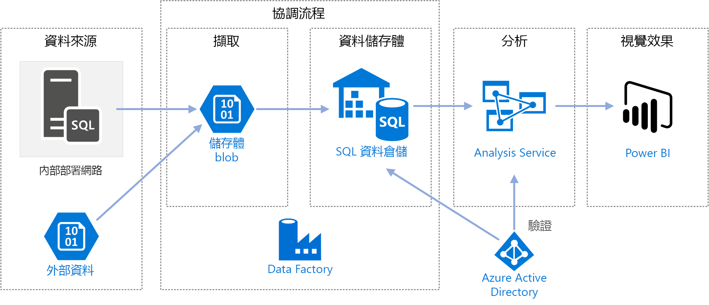
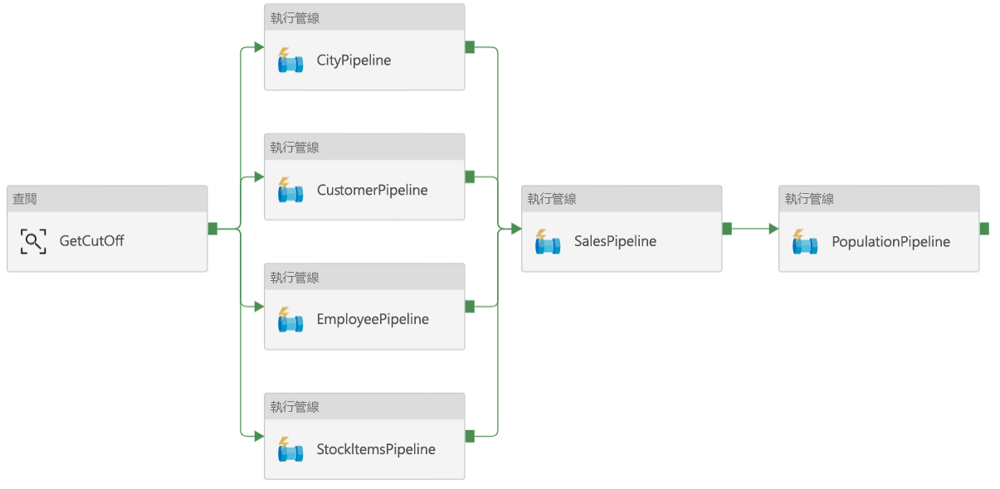
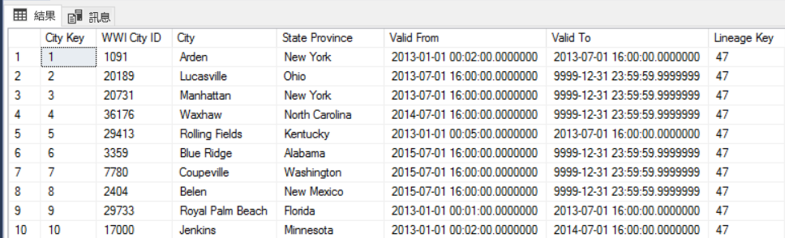
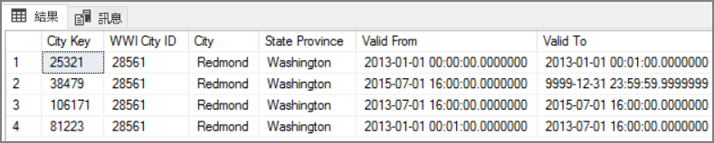
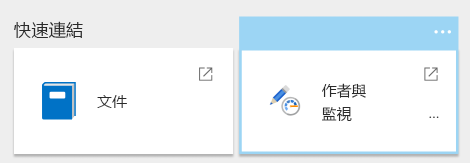
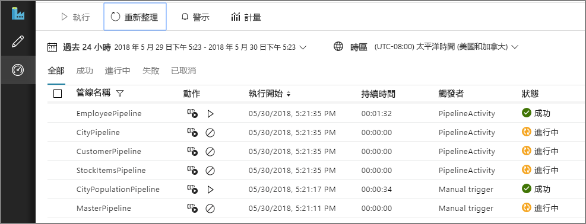
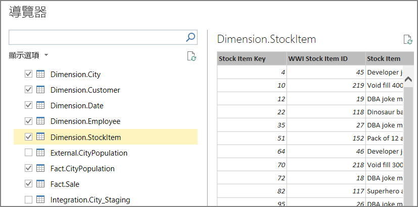
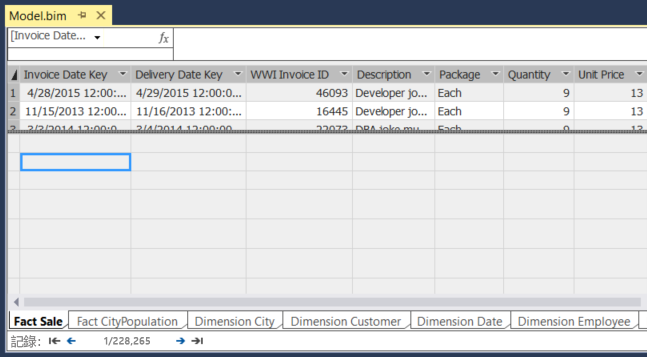
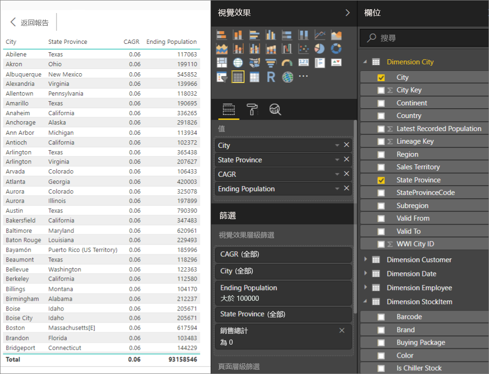

# <a name="automated-enterprise-bi-with-sql-data-warehouse-and-azure-data-factory"></a><span data-ttu-id="7eab5-103">具 SQL 資料倉儲和 Azure Data Factory 的自動化 Enterprise BI</span><span class="sxs-lookup"><span data-stu-id="7eab5-103">Automated enterprise BI with SQL Data Warehouse and Azure Data Factory</span></span>

<span data-ttu-id="7eab5-104">此參考架構示範如何在 [ELT](../../data-guide/relational-data/etl.md#extract-load-and-transform-elt) (擷取-載入-轉換) 管線中執行累加式載入。</span><span class="sxs-lookup"><span data-stu-id="7eab5-104">This reference architecture shows how to perform incremental loading in an [ELT](../../data-guide/relational-data/etl.md#extract-load-and-transform-elt) (extract-load-transform) pipeline.</span></span> <span data-ttu-id="7eab5-105">該架構會使用 Azure Data Factory 將 ELT 管線自動化。</span><span class="sxs-lookup"><span data-stu-id="7eab5-105">It uses Azure Data Factory to automate the ELT pipeline.</span></span> <span data-ttu-id="7eab5-106">管線會以累加方式，將最新的 OLTP 資料從內部部署 SQL Server 資料庫載入 SQL 資料倉儲中。</span><span class="sxs-lookup"><span data-stu-id="7eab5-106">The pipeline incrementally moves the latest OLTP data from an on-premises SQL Server database into SQL Data Warehouse.</span></span> <span data-ttu-id="7eab5-107">交易資料會轉換成表格式模型以供分析。</span><span class="sxs-lookup"><span data-stu-id="7eab5-107">Transactional data is transformed into a tabular model for analysis.</span></span> [<span data-ttu-id="7eab5-108">**部署這個解決方案**。</span><span class="sxs-lookup"><span data-stu-id="7eab5-108">**Deploy this solution**.</span></span>](#deploy-the-solution)



<span data-ttu-id="7eab5-109">此架構是基於[具 SQL 資料倉儲的 Enterprise BI](./enterprise-bi-sqldw.md)，但增加了一些對企業資料倉儲情況很重要的功能。</span><span class="sxs-lookup"><span data-stu-id="7eab5-109">This architecture builds on the one shown in [Enterprise BI with SQL Data Warehouse](./enterprise-bi-sqldw.md), but adds some features that are important for enterprise data warehousing scenarios.</span></span>

-   <span data-ttu-id="7eab5-110">使用 Data Factory 將管線自動化。</span><span class="sxs-lookup"><span data-stu-id="7eab5-110">Automation of the pipeline using Data Factory.</span></span>
-   <span data-ttu-id="7eab5-111">累加式載入。</span><span class="sxs-lookup"><span data-stu-id="7eab5-111">Incremental loading.</span></span>
-   <span data-ttu-id="7eab5-112">可整合多個資料來源。</span><span class="sxs-lookup"><span data-stu-id="7eab5-112">Integrating multiple data sources.</span></span>
-   <span data-ttu-id="7eab5-113">可載入二進位資料，立如地理空間資料與影像。</span><span class="sxs-lookup"><span data-stu-id="7eab5-113">Loading binary data such as geospatial data and images.</span></span>

## <a name="architecture"></a><span data-ttu-id="7eab5-114">架構</span><span class="sxs-lookup"><span data-stu-id="7eab5-114">Architecture</span></span>

<span data-ttu-id="7eab5-115">此架構由下列元件組成。</span><span class="sxs-lookup"><span data-stu-id="7eab5-115">The architecture consists of the following components.</span></span>

### <a name="data-sources"></a><span data-ttu-id="7eab5-116">資料來源</span><span class="sxs-lookup"><span data-stu-id="7eab5-116">Data sources</span></span>

<span data-ttu-id="7eab5-117">**內部部署的 SQL Server**。</span><span class="sxs-lookup"><span data-stu-id="7eab5-117">**On-premises SQL Server**.</span></span> <span data-ttu-id="7eab5-118">來源資料位於內部部署的 SQL Server 資料庫中。</span><span class="sxs-lookup"><span data-stu-id="7eab5-118">The source data is located in a SQL Server database on premises.</span></span> <span data-ttu-id="7eab5-119">為了模擬內部部署環境，此架構的部署指令碼會在 Azure 中佈建已安裝 SQL Server 的虛擬機器。</span><span class="sxs-lookup"><span data-stu-id="7eab5-119">To simulate the on-premises environment, the deployment scripts for this architecture provision a virtual machine in Azure with SQL Server installed.</span></span> <span data-ttu-id="7eab5-120">系統會使用 [Wide World Importers OLTP sample database][wwi] 作為來源資料庫。</span><span class="sxs-lookup"><span data-stu-id="7eab5-120">The [Wide World Importers OLTP sample database][wwi] is used as the source database.</span></span>

<span data-ttu-id="7eab5-121">**外部資料**。</span><span class="sxs-lookup"><span data-stu-id="7eab5-121">**External data**.</span></span> <span data-ttu-id="7eab5-122">資料倉儲常見的一種情況是整合多個資料來源。</span><span class="sxs-lookup"><span data-stu-id="7eab5-122">A common scenario for data warehouses is to integrate multiple data sources.</span></span> <span data-ttu-id="7eab5-123">此參考架構會載入外部資料集，其中包含依年度的城市人口，且會將資料集與 OLTP 資料庫中的資料整合。</span><span class="sxs-lookup"><span data-stu-id="7eab5-123">This reference architecture loads an external data set that contains city populations by year, and integrates it with the data from the OLTP database.</span></span> <span data-ttu-id="7eab5-124">您可以使用這項資料以進行深入解析，例如「每個區域中的銷售成長率是符合或超過人口成長率？」</span><span class="sxs-lookup"><span data-stu-id="7eab5-124">You can use this data for insights such as: "Does sales growth in each region match or exceed population growth?"</span></span>

### <a name="ingestion-and-data-storage"></a><span data-ttu-id="7eab5-125">擷取和資料儲存體</span><span class="sxs-lookup"><span data-stu-id="7eab5-125">Ingestion and data storage</span></span>

<span data-ttu-id="7eab5-126">**Blob 儲存體**。</span><span class="sxs-lookup"><span data-stu-id="7eab5-126">**Blob Storage**.</span></span> <span data-ttu-id="7eab5-127">Blob 儲存體會作為來源資料在載入至 SQL 資料倉儲之前的臨時區域。</span><span class="sxs-lookup"><span data-stu-id="7eab5-127">Blob storage is used as a staging area for the source data before loading it into SQL Data Warehouse.</span></span>

<span data-ttu-id="7eab5-128">**Azure SQL 資料倉儲**。</span><span class="sxs-lookup"><span data-stu-id="7eab5-128">**Azure SQL Data Warehouse**.</span></span> <span data-ttu-id="7eab5-129">[SQL 資料倉儲](/azure/sql-data-warehouse/)是為了對大型資料執行分析而設計的分散式系統。</span><span class="sxs-lookup"><span data-stu-id="7eab5-129">[SQL Data Warehouse](/azure/sql-data-warehouse/) is a distributed system designed to perform analytics on large data.</span></span> <span data-ttu-id="7eab5-130">它支援大量平行處理 (MPP)，因而適合用來執行高效能分析。</span><span class="sxs-lookup"><span data-stu-id="7eab5-130">It supports massive parallel processing (MPP), which makes it suitable for running high-performance analytics.</span></span> 

<span data-ttu-id="7eab5-131">**Azure Data Factory**。</span><span class="sxs-lookup"><span data-stu-id="7eab5-131">**Azure Data Factory**.</span></span> <span data-ttu-id="7eab5-132">[Data Factory][adf] 是受控服務，可協調並自動化資料移動和資料轉換。</span><span class="sxs-lookup"><span data-stu-id="7eab5-132">[Data Factory][adf] is a managed service that orchestrates and automates data movement and data transformation.</span></span> <span data-ttu-id="7eab5-133">在此架構中，該服務會協調 ELT 程序的各個階段。</span><span class="sxs-lookup"><span data-stu-id="7eab5-133">In this architecture, it coordinates the various stages of the ELT process.</span></span>

### <a name="analysis-and-reporting"></a><span data-ttu-id="7eab5-134">分析和報告</span><span class="sxs-lookup"><span data-stu-id="7eab5-134">Analysis and reporting</span></span>

<span data-ttu-id="7eab5-135">**Azure Analysis Services**。</span><span class="sxs-lookup"><span data-stu-id="7eab5-135">**Azure Analysis Services**.</span></span> <span data-ttu-id="7eab5-136">[Analysis Services](/azure/analysis-services/) 是完全受控的服務，可提供資料模型功能。</span><span class="sxs-lookup"><span data-stu-id="7eab5-136">[Analysis Services](/azure/analysis-services/) is a fully managed service that provides data modeling capabilities.</span></span> <span data-ttu-id="7eab5-137">語意模型會載入 Analysis Services 中。</span><span class="sxs-lookup"><span data-stu-id="7eab5-137">The semantic model is loaded into Analysis Services.</span></span>

<span data-ttu-id="7eab5-138">**Power BI**。</span><span class="sxs-lookup"><span data-stu-id="7eab5-138">**Power BI**.</span></span> <span data-ttu-id="7eab5-139">Power BI 是一套用來分析資料以產生商業見解的商務分析工具。</span><span class="sxs-lookup"><span data-stu-id="7eab5-139">Power BI is a suite of business analytics tools to analyze data for business insights.</span></span> <span data-ttu-id="7eab5-140">在此架構中，它會查詢儲存在 Analysis Services 中的語意模型。</span><span class="sxs-lookup"><span data-stu-id="7eab5-140">In this architecture, it queries the semantic model stored in Analysis Services.</span></span>

### <a name="authentication"></a><span data-ttu-id="7eab5-141">驗證</span><span class="sxs-lookup"><span data-stu-id="7eab5-141">Authentication</span></span>

<span data-ttu-id="7eab5-142">**Azure Active Directory** (Azure AD) 會驗證透過 Power BI 連線至 Analysis Services 伺服器的使用者。</span><span class="sxs-lookup"><span data-stu-id="7eab5-142">**Azure Active Directory** (Azure AD) authenticates users who connect to the Analysis Services server through Power BI.</span></span>

<span data-ttu-id="7eab5-143">Data Factory 也可以透過使用服務主體或受控服務識別 (MSI)，利用 Azure AD 來驗證 SQL 資料倉儲。</span><span class="sxs-lookup"><span data-stu-id="7eab5-143">Data Factory can use also use Azure AD to authenticate to SQL Data Warehouse, by using a service principal or Managed Service Identity (MSI).</span></span> <span data-ttu-id="7eab5-144">為了簡單起見，範例部署會使用 SQL Server 驗證。</span><span class="sxs-lookup"><span data-stu-id="7eab5-144">For simplicity, the example deployment uses SQL Server authentication.</span></span>

## <a name="data-pipeline"></a><span data-ttu-id="7eab5-145">Data Pipeline</span><span class="sxs-lookup"><span data-stu-id="7eab5-145">Data pipeline</span></span>

<span data-ttu-id="7eab5-146">在 [Azure Data Factory][adf] 中，管線是在此情況下，用來協調 &mdash; 工作的活動邏輯群組，會將資料載入 SQL 資料倉儲中，並加以轉換。</span><span class="sxs-lookup"><span data-stu-id="7eab5-146">In [Azure Data Factory][adf], a pipeline is a logical grouping of activities used to coordinate a task &mdash; in this case, loading and transforming data into SQL Data Warehouse.</span></span> 

<span data-ttu-id="7eab5-147">此參考架構會定義執行一連串的子管線的主要管線。</span><span class="sxs-lookup"><span data-stu-id="7eab5-147">This reference architecture defines a master pipeline that runs a sequence of child pipelines.</span></span> <span data-ttu-id="7eab5-148">每條子管線都會將資料載入一個或多個資料倉儲資料表中。</span><span class="sxs-lookup"><span data-stu-id="7eab5-148">Each child pipeline loads data into one or more data warehouse tables.</span></span>



## <a name="incremental-loading"></a><span data-ttu-id="7eab5-149">累加式載入</span><span class="sxs-lookup"><span data-stu-id="7eab5-149">Incremental loading</span></span>

<span data-ttu-id="7eab5-150">當您執行自動化的 ETL 或 ELT 程序時，只載入從上次執行之後變更的資料最有效率。</span><span class="sxs-lookup"><span data-stu-id="7eab5-150">When you run an automated ETL or ELT process, it's most efficient to load only the data that changed since the previous run.</span></span> <span data-ttu-id="7eab5-151">這就叫做「累加式載入」，而非載入所有資料的完整載入。</span><span class="sxs-lookup"><span data-stu-id="7eab5-151">This is called an *incremental load*, as opposed to a full load that loads all of the data.</span></span> <span data-ttu-id="7eab5-152">若要執行累加式載入，您需要有識別哪些資料已經變更的方式。</span><span class="sxs-lookup"><span data-stu-id="7eab5-152">To perform an incremental load, you need a way to identify which data has changed.</span></span> <span data-ttu-id="7eab5-153">最常見的方法是使用「上限標準」值，這表示要追蹤來源資料表中某些資料行 (可能是日期時間資料行，或唯一的整數資料行) 的最新值。</span><span class="sxs-lookup"><span data-stu-id="7eab5-153">The most common approach is to use a *high water mark* value, which means tracking the latest value of some column in the source table, either a datetime column or a unique integer column.</span></span> 

<span data-ttu-id="7eab5-154">從 SQL Server 2016 開始，您可以使用[時態表](/sql/relational-databases/tables/temporal-tables)。</span><span class="sxs-lookup"><span data-stu-id="7eab5-154">Starting with SQL Server 2016, you can use [temporal tables](/sql/relational-databases/tables/temporal-tables).</span></span> <span data-ttu-id="7eab5-155">這些是由系統建立版本的資料表，會保留資料變更的完整歷程記錄。</span><span class="sxs-lookup"><span data-stu-id="7eab5-155">These are system-versioned tables that keep a full history of data changes.</span></span> <span data-ttu-id="7eab5-156">資料庫引擎會將每一項變更的歷程記錄，自動記錄在個別的歷程記錄資料表中。</span><span class="sxs-lookup"><span data-stu-id="7eab5-156">The database engine automatically records the history of every change in a separate history table.</span></span> <span data-ttu-id="7eab5-157">您可以將 FOR SYSTEM_TIME 子句新增到查詢中，來查詢歷程記錄資料。</span><span class="sxs-lookup"><span data-stu-id="7eab5-157">You can query the historical data by adding a FOR SYSTEM_TIME clause to a query.</span></span> <span data-ttu-id="7eab5-158">就內部而言，資料庫引擎會查詢記錄資料表，但這對應用程式而言是透明的。</span><span class="sxs-lookup"><span data-stu-id="7eab5-158">Internally, the database engine queries the history table, but this is transparent to the application.</span></span> 

> [!NOTE]
> <span data-ttu-id="7eab5-159">對於舊版的 SQL Server，您可以使用[異動資料擷取](/sql/relational-databases/track-changes/about-change-data-capture-sql-server)(CDC)。</span><span class="sxs-lookup"><span data-stu-id="7eab5-159">For earlier versions of SQL Server, you can use [Change Data Capture](/sql/relational-databases/track-changes/about-change-data-capture-sql-server) (CDC).</span></span> <span data-ttu-id="7eab5-160">這個方法比起時態表較不方便，因為您需要查詢個別變更資料表，而且此方法不是按照時間戳記，而是按照記錄序號來追蹤變更。</span><span class="sxs-lookup"><span data-stu-id="7eab5-160">This approach is less convenient than temporal tables, because you have to query a separate change table, and changes are tracked by a log sequence number, rather than a timestamp.</span></span> 

<span data-ttu-id="7eab5-161">時態表對於維度資料很有用，因為後者會隨著時間而變更。</span><span class="sxs-lookup"><span data-stu-id="7eab5-161">Temporal tables are useful for dimension data, which can change over time.</span></span> <span data-ttu-id="7eab5-162">事實資料表通常代表固定的交易 (例如銷售)，在此情況下保留由系統建立版本的歷程記錄沒有任何意義。</span><span class="sxs-lookup"><span data-stu-id="7eab5-162">Fact tables usually represent an immutable transaction such as a sale, in which case keeping the system version history doesn't make sense.</span></span> <span data-ttu-id="7eab5-163">因此，交易通常會有代表交易日期的資料行，可用來當作上限標準值。</span><span class="sxs-lookup"><span data-stu-id="7eab5-163">Instead, transactions usually have a column that represents the transaction date, which can be used as the watermark value.</span></span> <span data-ttu-id="7eab5-164">例如，在 Wide World Importers OLTP 資料庫中，Sales.Invoices 和 Sales.InvoiceLines 資料表有 `LastEditedWhen` 欄位，預設值為 `sysdatetime()`。</span><span class="sxs-lookup"><span data-stu-id="7eab5-164">For example, in the Wide World Importers OLTP databse, the Sales.Invoices and Sales.InvoiceLines tables have a `LastEditedWhen` field that defaults to `sysdatetime()`.</span></span> 

<span data-ttu-id="7eab5-165">以下是 ELT 管線的一般流程：</span><span class="sxs-lookup"><span data-stu-id="7eab5-165">Here is the general flow for the ELT pipeline:</span></span>

1. <span data-ttu-id="7eab5-166">針對來源資料庫中每個資料表，追蹤上次 ELT 作業執行的截止時間。</span><span class="sxs-lookup"><span data-stu-id="7eab5-166">For each table in the source database, track the cutoff time when the last ELT job ran.</span></span> <span data-ttu-id="7eab5-167">將這項資訊儲存在資料倉儲中。</span><span class="sxs-lookup"><span data-stu-id="7eab5-167">Store this information in the data warehouse.</span></span> <span data-ttu-id="7eab5-168">(在初始設定時，所有時間都設為 '1-1-1900'。)</span><span class="sxs-lookup"><span data-stu-id="7eab5-168">(On initial setup, all times are set to '1-1-1900'.)</span></span>

2. <span data-ttu-id="7eab5-169">在資料匯出步驟期間，會將截止時間當作參數，傳遞至來源資料庫中的一組預存程序。</span><span class="sxs-lookup"><span data-stu-id="7eab5-169">During the data export step, the cutoff time is passed as a parameter to a set of stored procedures in the source database.</span></span> <span data-ttu-id="7eab5-170">這些預存程序會查詢截止時間之後所變更或建立的任何記錄。</span><span class="sxs-lookup"><span data-stu-id="7eab5-170">These stored procedures query for any records that were changed or created after the cutoff time.</span></span> <span data-ttu-id="7eab5-171">「銷售」事實資料表會使用 `LastEditedWhen` 資料行。</span><span class="sxs-lookup"><span data-stu-id="7eab5-171">For the Sales fact table, the `LastEditedWhen` column is used.</span></span> <span data-ttu-id="7eab5-172">維度資料則會使用由系統建立版本的時態表。</span><span class="sxs-lookup"><span data-stu-id="7eab5-172">For the dimension data, system-versioned temporal tables are used.</span></span>

3. <span data-ttu-id="7eab5-173">資料移轉完成時，會更新儲存截止時間的資料表。</span><span class="sxs-lookup"><span data-stu-id="7eab5-173">When the data migration is complete, update the table that stores the cutoff times.</span></span>

<span data-ttu-id="7eab5-174">記錄每次 ELT 執行的*歷程*也很有幫助。</span><span class="sxs-lookup"><span data-stu-id="7eab5-174">It's also useful to record a *lineage* for each ELT run.</span></span> <span data-ttu-id="7eab5-175">對於給定的記錄，歷程會將該記錄與產生資料的 ELT 執行產生關聯。</span><span class="sxs-lookup"><span data-stu-id="7eab5-175">For a given record, the lineage associates that record with the ELT run that produced the data.</span></span> <span data-ttu-id="7eab5-176">每次 ELT 執行時，都會針對每份資料表建立新的歷程記錄，顯示開始和結束載入時間。</span><span class="sxs-lookup"><span data-stu-id="7eab5-176">For each ETL run, a new lineage record is created for every table, showing the starting and ending load times.</span></span> <span data-ttu-id="7eab5-177">每筆記錄的歷程索引鍵都會儲存在維度資料表和事實資料表中。</span><span class="sxs-lookup"><span data-stu-id="7eab5-177">The lineage keys for each record are stored in the dimension and fact tables.</span></span>



<span data-ttu-id="7eab5-178">新批次的資料載入至倉儲之後，會重新整理 Analysis Services 表格式模型。</span><span class="sxs-lookup"><span data-stu-id="7eab5-178">After a new batch of data is loaded into the warehouse, refresh the Analysis Services tabular model.</span></span> <span data-ttu-id="7eab5-179">請參閱[使用 REST API 進行非同步重新整理](/azure/analysis-services/analysis-services-async-refresh)。</span><span class="sxs-lookup"><span data-stu-id="7eab5-179">See [Asynchronous refresh with the REST API](/azure/analysis-services/analysis-services-async-refresh).</span></span>

## <a name="data-cleansing"></a><span data-ttu-id="7eab5-180">資料清理</span><span class="sxs-lookup"><span data-stu-id="7eab5-180">Data cleansing</span></span>

<span data-ttu-id="7eab5-181">資料清理應該是 ELT 程序的一部分。</span><span class="sxs-lookup"><span data-stu-id="7eab5-181">Data cleansing should be part of the ELT process.</span></span> <span data-ttu-id="7eab5-182">在此參考架構中，有錯誤的資料其中來源會是城市人口資料表，其中部分城市可能會因為沒有資料可用，使得人口數為零。</span><span class="sxs-lookup"><span data-stu-id="7eab5-182">In this reference architecture, one source of bad data is the city population table, where some cities have zero population, perhaps because no data was available.</span></span> <span data-ttu-id="7eab5-183">在處理期間，ELT 管線會從城市人口資料表中移除那些城市。</span><span class="sxs-lookup"><span data-stu-id="7eab5-183">During processing, the ELT pipeline removes those cities from the city population table.</span></span> <span data-ttu-id="7eab5-184">請在暫存表格中執行資料清理，而不是在外部資料表中。</span><span class="sxs-lookup"><span data-stu-id="7eab5-184">Perform data cleansing on staging tables, rather than external tables.</span></span>

<span data-ttu-id="7eab5-185">以下的預存程序會從城市人口資料表中移除人口數為零的城市。</span><span class="sxs-lookup"><span data-stu-id="7eab5-185">Here is the stored procedure that removes the cities with zero population from the City Population table.</span></span> <span data-ttu-id="7eab5-186">(您可以在[此處](https://github.com/mspnp/reference-architectures/blob/master/data/enterprise_bi_sqldw_advanced/azure/sqldw_scripts/citypopulation/%5BIntegration%5D.%5BMigrateExternalCityPopulationData%5D.sql)找到來源檔案。)</span><span class="sxs-lookup"><span data-stu-id="7eab5-186">(You can find the source file [here](https://github.com/mspnp/reference-architectures/blob/master/data/enterprise_bi_sqldw_advanced/azure/sqldw_scripts/citypopulation/%5BIntegration%5D.%5BMigrateExternalCityPopulationData%5D.sql).)</span></span> 

```sql
DELETE FROM [Integration].[CityPopulation_Staging]
WHERE RowNumber in (SELECT DISTINCT RowNumber
FROM [Integration].[CityPopulation_Staging]
WHERE POPULATION = 0
GROUP BY RowNumber
HAVING COUNT(RowNumber) = 4)
```

## <a name="external-data-sources"></a><span data-ttu-id="7eab5-187">外部資料來源</span><span class="sxs-lookup"><span data-stu-id="7eab5-187">External data sources</span></span>

<span data-ttu-id="7eab5-188">資料倉儲通常會合併來自多個來源的資料。</span><span class="sxs-lookup"><span data-stu-id="7eab5-188">Data warehouses often consolidate data from multiple sources.</span></span> <span data-ttu-id="7eab5-189">此參考架構會載入包含人口統計資料的外部資料來源。</span><span class="sxs-lookup"><span data-stu-id="7eab5-189">This reference architecture loads an external data source that contains demographics data.</span></span> <span data-ttu-id="7eab5-190">在 [WorldWideImportersDW](https://github.com/Microsoft/sql-server-samples/tree/master/samples/databases/wide-world-importers/sample-scripts/polybase) 範例中的 Azure Blob 儲存體內提供了此資料集。</span><span class="sxs-lookup"><span data-stu-id="7eab5-190">This dataset is available in Azure blob storage as part of the [WorldWideImportersDW](https://github.com/Microsoft/sql-server-samples/tree/master/samples/databases/wide-world-importers/sample-scripts/polybase) sample.</span></span>

<span data-ttu-id="7eab5-191">Azure Data Factory 可以使用 [Blob 儲存體連接器](/azure/data-factory/connector-azure-blob-storage)，直接從 Blob 儲存體複製。</span><span class="sxs-lookup"><span data-stu-id="7eab5-191">Azure Data Factory can copy directly from blob storage, using the [blob storage connector](/azure/data-factory/connector-azure-blob-storage).</span></span> <span data-ttu-id="7eab5-192">不過，連接器需要連接字串或共用存取簽章，因此不能用來複製具有公用讀取權限的 Blob。</span><span class="sxs-lookup"><span data-stu-id="7eab5-192">However, the connector requires a connection string or a shared access signature, so it can't be used to copy a blob with public read access.</span></span> <span data-ttu-id="7eab5-193">因應措施是使用 PolyBase 從 Blob 儲存體建立外部資料表，再將外部資料表複製到 SQL 資料倉儲中。</span><span class="sxs-lookup"><span data-stu-id="7eab5-193">As a workaround, you can use PolyBase to create an external table over Blob storage and then copy the external tables into SQL Data Warehouse.</span></span> 

## <a name="handling-large-binary-data"></a><span data-ttu-id="7eab5-194">處理大型二進位資料</span><span class="sxs-lookup"><span data-stu-id="7eab5-194">Handling large binary data</span></span> 

<span data-ttu-id="7eab5-195">在來源資料庫中，城市資料表具有包含[地理](/sql/t-sql/spatial-geography/spatial-types-geography)空間資料類型的「位置」資料行。</span><span class="sxs-lookup"><span data-stu-id="7eab5-195">In the source database, the Cities table has a Location column that holds a [geography](/sql/t-sql/spatial-geography/spatial-types-geography) spatial data type.</span></span> <span data-ttu-id="7eab5-196">SQL 資料倉儲原生不支援 **geography** 類型，因此在載入期間會將此欄位轉換成 **varbinary** 類型。</span><span class="sxs-lookup"><span data-stu-id="7eab5-196">SQL Data Warehouse doesn't support the **geography** type natively, so this field is converted to a **varbinary** type during loading.</span></span> <span data-ttu-id="7eab5-197">(請參閱[不支援資料類型的因應措施](/azure/sql-data-warehouse/sql-data-warehouse-tables-data-types#unsupported-data-types)。)</span><span class="sxs-lookup"><span data-stu-id="7eab5-197">(See [Workarounds for unsupported data types](/azure/sql-data-warehouse/sql-data-warehouse-tables-data-types#unsupported-data-types).)</span></span>

<span data-ttu-id="7eab5-198">不過，PolyBase 支援的最大資料行大小為 `varbinary(8000)`，這表示可能會截斷某些資料。</span><span class="sxs-lookup"><span data-stu-id="7eab5-198">However, PolyBase supports a maximum column size of `varbinary(8000)`, which means some data could be truncated.</span></span> <span data-ttu-id="7eab5-199">此問題的因應措施是將資料在匯出期間分成區塊，然後再重組區塊，如下所示：</span><span class="sxs-lookup"><span data-stu-id="7eab5-199">A workaround for this problem is to break the data up into chunks during export, and then reassemble the chunks, as follows:</span></span>

1. <span data-ttu-id="7eab5-200">針對「位置」資料行，建立暫時的暫存資料表。</span><span class="sxs-lookup"><span data-stu-id="7eab5-200">Create a temporary staging table for the Location column.</span></span>

2. <span data-ttu-id="7eab5-201">針對每座城市，將位置資料分割成 8000 個位元組的區塊，產生每座城市 1 &ndash; N 個資料列。</span><span class="sxs-lookup"><span data-stu-id="7eab5-201">For each city, split the location data into 8000-byte chunks, resulting in 1 &ndash; N rows for each city.</span></span>

3. <span data-ttu-id="7eab5-202">若要重組區塊，請使用 T-SQL [PIVOT](/sql/t-sql/queries/from-using-pivot-and-unpivot)運算子將資料列轉換成資料行，然後再串連每座城市的資料行值。</span><span class="sxs-lookup"><span data-stu-id="7eab5-202">To reassemble the chunks, use the T-SQL [PIVOT](/sql/t-sql/queries/from-using-pivot-and-unpivot) operator to convert rows into columns and then concatenate the column values for each city.</span></span>

<span data-ttu-id="7eab5-203">所面臨的挑戰是每座城市會根據地理位置資料的大小，分割成不同數目的資料列。</span><span class="sxs-lookup"><span data-stu-id="7eab5-203">The challenge is that each city will be split into a different number of rows, depending on the size of geography data.</span></span> <span data-ttu-id="7eab5-204">每座城市都必須具有相同數目的資料列，PIVOT 運算子才能夠運作。</span><span class="sxs-lookup"><span data-stu-id="7eab5-204">For the PIVOT operator to work, every city must have the same number of rows.</span></span> <span data-ttu-id="7eab5-205">為了進行這項作業，T-SQL 查詢 (您可以在 [here][MergeLocation] 檢視) 藉助一些技巧，用空白值填補了資料列，讓每座城市在樞紐後都具有相同數目的資料行。</span><span class="sxs-lookup"><span data-stu-id="7eab5-205">To make this work, the T-SQL query (which you can view [here][MergeLocation]) does some tricks to pad out the rows with blank values, so that every city has the same number of columns after the pivot.</span></span> <span data-ttu-id="7eab5-206">產生的查詢比一次重複一列的迴圈快得多。</span><span class="sxs-lookup"><span data-stu-id="7eab5-206">The resulting query turns out to be much faster than looping through the rows one at a time.</span></span>

<span data-ttu-id="7eab5-207">影像資料也使用了相同的方法。</span><span class="sxs-lookup"><span data-stu-id="7eab5-207">The same approach is used for image data.</span></span>

## <a name="slowly-changing-dimensions"></a><span data-ttu-id="7eab5-208">緩時變維度</span><span class="sxs-lookup"><span data-stu-id="7eab5-208">Slowly changing dimensions</span></span>

<span data-ttu-id="7eab5-209">維度資料相對來說是靜態的，但仍可以變更。</span><span class="sxs-lookup"><span data-stu-id="7eab5-209">Dimension data is relatively static, but it can change.</span></span> <span data-ttu-id="7eab5-210">例如，產品可能會指派給不同的產品類別目錄。</span><span class="sxs-lookup"><span data-stu-id="7eab5-210">For example, a product might get reassigned to a different product category.</span></span> <span data-ttu-id="7eab5-211">有數種方法可處理緩時變維度。</span><span class="sxs-lookup"><span data-stu-id="7eab5-211">There are several approaches to handling slowly changing dimensions.</span></span> <span data-ttu-id="7eab5-212">有一種常用的技巧，稱為[類型 2](https://wikipedia.org/wiki/Slowly_changing_dimension#Type_2:_add_new_row)，是在每次維度變更時新增記錄。</span><span class="sxs-lookup"><span data-stu-id="7eab5-212">A common technique, called [Type 2](https://wikipedia.org/wiki/Slowly_changing_dimension#Type_2:_add_new_row), is to add a new record whenever a dimension changes.</span></span> 

<span data-ttu-id="7eab5-213">若要實作類型 2 方式，維度資料表會需要可針對給定記錄，指定有效日期範圍的額外資料行。</span><span class="sxs-lookup"><span data-stu-id="7eab5-213">In order to implement the Type 2 approach, dimension tables need additional columns that specify the effective date range for a given record.</span></span> <span data-ttu-id="7eab5-214">此外，系統會複製來自來源資料庫的主索引鍵，因此維度資料表必須要有人工的主索引鍵。</span><span class="sxs-lookup"><span data-stu-id="7eab5-214">Also, primary keys from the source database will be duplicated, so the dimension table must have an artificial primary key.</span></span>

<span data-ttu-id="7eab5-215">下圖顯示 Dimension.City 資料表。</span><span class="sxs-lookup"><span data-stu-id="7eab5-215">The following image shows the Dimension.City table.</span></span> <span data-ttu-id="7eab5-216">`WWI City ID` 資料行是來自來源資料庫的主索引鍵。</span><span class="sxs-lookup"><span data-stu-id="7eab5-216">The `WWI City ID` column is the primary key from the source database.</span></span> <span data-ttu-id="7eab5-217">`City Key` 資料行是在 ETL 管線期間所產生的人工索引鍵。</span><span class="sxs-lookup"><span data-stu-id="7eab5-217">The `City Key` column is an artificial key generated during the ETL pipeline.</span></span> <span data-ttu-id="7eab5-218">也請注意，資料表有 `Valid From` 和 `Valid To` 資料行，其中定義了每個資料列有效的時間範圍。</span><span class="sxs-lookup"><span data-stu-id="7eab5-218">Also notice that the table has `Valid From` and `Valid To` columns, which define the range when each row was valid.</span></span> <span data-ttu-id="7eab5-219">`Valid To` 目前值的等於 ' 9999-12-31'。</span><span class="sxs-lookup"><span data-stu-id="7eab5-219">Current values have a `Valid To` equal to '9999-12-31'.</span></span>


<span data-ttu-id="7eab5-220">這種方法的優點是會保留歷程記錄資料，這對分析來說很有價值。</span><span class="sxs-lookup"><span data-stu-id="7eab5-220">The advantage of this approach is that it preserves historical data, which can be valuable for analysis.</span></span> <span data-ttu-id="7eab5-221">不過，這也表示相同的實體會有多個資料列。</span><span class="sxs-lookup"><span data-stu-id="7eab5-221">However, it also means there will be multiple rows for the same entity.</span></span> <span data-ttu-id="7eab5-222">例如，以下是符合 `WWI City ID` = 28561 的記錄：</span><span class="sxs-lookup"><span data-stu-id="7eab5-222">For example, here are the records that match `WWI City ID` = 28561:</span></span>



<span data-ttu-id="7eab5-223">針對每個「銷售」事實，建議您將事實與「城市」維度資料表中的單一資料列產生關聯，並對應到發票日期。</span><span class="sxs-lookup"><span data-stu-id="7eab5-223">For each Sales fact, you want to associate that fact with a single row in City dimension table, corresponding to the invoice date.</span></span> <span data-ttu-id="7eab5-224">請建立具有下列項目的額外資料行，作為 ETL 程序的一部分</span><span class="sxs-lookup"><span data-stu-id="7eab5-224">As part of the ETL process, create an additional column that</span></span> 

<span data-ttu-id="7eab5-225">下列 T-SQL 查詢會建立暫存資料表，讓每張發票與來自「城市」維度資料表中正確的「城市索引鍵」產生關聯。</span><span class="sxs-lookup"><span data-stu-id="7eab5-225">The following T-SQL query creates a temporary table that associates each invoice with the correct City Key from the City dimension table.</span></span>

```sql
CREATE TABLE CityHolder
WITH (HEAP , DISTRIBUTION = HASH([WWI Invoice ID]))
AS
SELECT DISTINCT s1.[WWI Invoice ID] AS [WWI Invoice ID],
                c.[City Key] AS [City Key]
    FROM [Integration].[Sale_Staging] s1
    CROSS APPLY (
                SELECT TOP 1 [City Key]
                    FROM [Dimension].[City]
                WHERE [WWI City ID] = s1.[WWI City ID]
                    AND s1.[Last Modified When] > [Valid From]
                    AND s1.[Last Modified When] <= [Valid To]
                ORDER BY [Valid From], [City Key] DESC
                ) c

```

<span data-ttu-id="7eab5-226">此資料表會用來填入「銷售」事實資料表中的資料行：</span><span class="sxs-lookup"><span data-stu-id="7eab5-226">This table is used to populate a column in the Sales fact table:</span></span>

```sql
UPDATE [Integration].[Sale_Staging]
SET [Integration].[Sale_Staging].[WWI Customer ID] =  CustomerHolder.[WWI Customer ID]
```

<span data-ttu-id="7eab5-227">此資料行可讓 Power BI 查詢針對給定的銷售發票，找出正確的「城市」記錄。</span><span class="sxs-lookup"><span data-stu-id="7eab5-227">This column enables a Power BI query to find the correct City record for a given sales invoice.</span></span>

## <a name="security-considerations"></a><span data-ttu-id="7eab5-228">安全性考量</span><span class="sxs-lookup"><span data-stu-id="7eab5-228">Security considerations</span></span>

<span data-ttu-id="7eab5-229">為了增加安全性，您可以使用[虛擬網路服務端點](/azure/virtual-network/virtual-network-service-endpoints-overview)，讓 Azure 服務資源只連線到您的虛擬網路，以保護其安全。</span><span class="sxs-lookup"><span data-stu-id="7eab5-229">For additional security, you can use [Virtual Network service endpoints](/azure/virtual-network/virtual-network-service-endpoints-overview) to secure Azure service resources to only your virtual network.</span></span> <span data-ttu-id="7eab5-230">這會完全移除公用網際網路對這些資源的存取權，而只允許來自您虛擬網路的流量。</span><span class="sxs-lookup"><span data-stu-id="7eab5-230">This fully removes public Internet access to those resources, allowing traffic only from your virtual network.</span></span>

<span data-ttu-id="7eab5-231">使用此方法，您就可以在 Azure 中建立 VNet，然後再建立 Azure 服務的私用服務端點。</span><span class="sxs-lookup"><span data-stu-id="7eab5-231">With this approach, you create a VNet in Azure and then create private service endpoints for Azure services.</span></span> <span data-ttu-id="7eab5-232">接著這些服務會限制為只允許來自該虛擬網路的流量。</span><span class="sxs-lookup"><span data-stu-id="7eab5-232">Those services are then restricted to traffic from that virtual network.</span></span> <span data-ttu-id="7eab5-233">您也可以透過閘道，從您的內部部署網路存取這些服務。</span><span class="sxs-lookup"><span data-stu-id="7eab5-233">You can also reach them from your on-premises network through a gateway.</span></span>

<span data-ttu-id="7eab5-234">請留意以下限制：</span><span class="sxs-lookup"><span data-stu-id="7eab5-234">Be aware of the following limitations:</span></span>

- <span data-ttu-id="7eab5-235">在此參考架構建立時，Azure 儲存體和 Azure SQL 資料倉儲會支援 VNet 服務端點，但 Azure Analysis Service 則不支援。</span><span class="sxs-lookup"><span data-stu-id="7eab5-235">At the time this reference architecture was created, VNet service endpoints are supported for Azure Storage and Azure SQL Data Warehouse, but not for Azure Analysis Service.</span></span> <span data-ttu-id="7eab5-236">請在[此處](https://azure.microsoft.com/updates/?product=virtual-network)檢查最新狀態。</span><span class="sxs-lookup"><span data-stu-id="7eab5-236">Check the latest status [here](https://azure.microsoft.com/updates/?product=virtual-network).</span></span> 

- <span data-ttu-id="7eab5-237">若啟用了 Azure 儲存體的服務端點，PolyBase 就無法從儲存體將資料複製到 SQL 資料倉儲中。</span><span class="sxs-lookup"><span data-stu-id="7eab5-237">If service endpoints are enabled for Azure Storage, PolyBase cannot copy data from Storage into SQL Data Warehouse.</span></span> <span data-ttu-id="7eab5-238">此問題沒有緩和措施。</span><span class="sxs-lookup"><span data-stu-id="7eab5-238">There is a mitigation for this issue.</span></span> <span data-ttu-id="7eab5-239">如需詳細資訊，請參閱[使用 VNet 服務端點搭配 Azure 儲存體的影響](/azure/sql-database/sql-database-vnet-service-endpoint-rule-overview?toc=%2fazure%2fvirtual-network%2ftoc.json#impact-of-using-vnet-service-endpoints-with-azure-storage)。</span><span class="sxs-lookup"><span data-stu-id="7eab5-239">For more information, see [Impact of using VNet Service Endpoints with Azure storage](/azure/sql-database/sql-database-vnet-service-endpoint-rule-overview?toc=%2fazure%2fvirtual-network%2ftoc.json#impact-of-using-vnet-service-endpoints-with-azure-storage).</span></span> 

- <span data-ttu-id="7eab5-240">若要將資料從內部部署移動到 Azure 儲存體中，您需要將來自內部部署或 ExpressRoute 的公用 IP 位址，列入白名單中。</span><span class="sxs-lookup"><span data-stu-id="7eab5-240">To move data from on-premises into Azure Storage, you will need to whitelist public IP addresses from your on-premises or ExpressRoute.</span></span> <span data-ttu-id="7eab5-241">欲知詳情，請參閱[將 Azure 服務放到虛擬網路保護](/azure/virtual-network/virtual-network-service-endpoints-overview#securing-azure-services-to-virtual-networks)。</span><span class="sxs-lookup"><span data-stu-id="7eab5-241">For details, see [Securing Azure services to virtual networks](/azure/virtual-network/virtual-network-service-endpoints-overview#securing-azure-services-to-virtual-networks).</span></span>

- <span data-ttu-id="7eab5-242">若要讓 Analysis Services 可從 SQL 資料倉儲中讀取資料，請將 Windows VM 部署到包含 SQL 資料倉儲服務端點的虛擬網路中。</span><span class="sxs-lookup"><span data-stu-id="7eab5-242">To enable Analysis Services to read data from SQL Data Warehouse, deploy a Windows VM to the virtual network that contains the SQL Data Warehouse service endpoint.</span></span> <span data-ttu-id="7eab5-243">在 VM 上安裝 [Azure 內部部署資料閘道](/azure/analysis-services/analysis-services-gateway)。</span><span class="sxs-lookup"><span data-stu-id="7eab5-243">Install [Azure On-premises Data Gateway](/azure/analysis-services/analysis-services-gateway) on this VM.</span></span> <span data-ttu-id="7eab5-244">然後將您的 Azure 分析服務連線到資料閘道。</span><span class="sxs-lookup"><span data-stu-id="7eab5-244">Then connect your Azure Analysis service to the data gateway.</span></span>

## <a name="deploy-the-solution"></a><span data-ttu-id="7eab5-245">部署解決方案</span><span class="sxs-lookup"><span data-stu-id="7eab5-245">Deploy the solution</span></span>

<span data-ttu-id="7eab5-246">此參考架構的部署可在 [GitHub][ref-arch-repo-folder] 上取得。</span><span class="sxs-lookup"><span data-stu-id="7eab5-246">A deployment for this reference architecture is available on [GitHub][ref-arch-repo-folder].</span></span> <span data-ttu-id="7eab5-247">它會部署下列各項：</span><span class="sxs-lookup"><span data-stu-id="7eab5-247">It deploys the following:</span></span>

  * <span data-ttu-id="7eab5-248">一個 Windows VM，用以模擬內部部署資料庫伺服器。</span><span class="sxs-lookup"><span data-stu-id="7eab5-248">A Windows VM to simulate an on-premises database server.</span></span> <span data-ttu-id="7eab5-249">其中包含 SQL Server 2017 和相關工具以及 Power BI Desktop。</span><span class="sxs-lookup"><span data-stu-id="7eab5-249">It includes SQL Server 2017 and related tools, along with Power BI Desktop.</span></span>
  * <span data-ttu-id="7eab5-250">一個提供 Blob 儲存體的 Azure 儲存體帳戶，用以保存從 SQL Server 資料庫匯出的資料。</span><span class="sxs-lookup"><span data-stu-id="7eab5-250">An Azure storage account that provides Blob storage to hold data exported from the SQL Server database.</span></span>
  * <span data-ttu-id="7eab5-251">一個 Azure SQL 資料倉儲執行個體。</span><span class="sxs-lookup"><span data-stu-id="7eab5-251">An Azure SQL Data Warehouse instance.</span></span>
  * <span data-ttu-id="7eab5-252">一個 Azure Analysis Services 執行個體。</span><span class="sxs-lookup"><span data-stu-id="7eab5-252">An Azure Analysis Services instance.</span></span>
  * <span data-ttu-id="7eab5-253">Azure Data Factory 和 ELT 作業的 Data Factory 管線。</span><span class="sxs-lookup"><span data-stu-id="7eab5-253">Azure Data Factory and the Data Factory pipeline for the ELT job.</span></span>

### <a name="prerequisites"></a><span data-ttu-id="7eab5-254">先決條件</span><span class="sxs-lookup"><span data-stu-id="7eab5-254">Prerequisites</span></span>

[!INCLUDE [ref-arch-prerequisites.md](../../../includes/ref-arch-prerequisites.md)]

### <a name="variables"></a><span data-ttu-id="7eab5-255">變數</span><span class="sxs-lookup"><span data-stu-id="7eab5-255">Variables</span></span>

<span data-ttu-id="7eab5-256">下列步驟包括了一些使用者定義的變數。</span><span class="sxs-lookup"><span data-stu-id="7eab5-256">The steps that follow include some user-defined variables.</span></span> <span data-ttu-id="7eab5-257">您會需要用您定義的值加以取代。</span><span class="sxs-lookup"><span data-stu-id="7eab5-257">You will need to replace these with values that you define.</span></span>

- <span data-ttu-id="7eab5-258">`<data_factory_name>`。</span><span class="sxs-lookup"><span data-stu-id="7eab5-258">`<data_factory_name>`.</span></span> <span data-ttu-id="7eab5-259">Data Factory 名稱。</span><span class="sxs-lookup"><span data-stu-id="7eab5-259">Data Factory name.</span></span>
- <span data-ttu-id="7eab5-260">`<analysis_server_name>`。</span><span class="sxs-lookup"><span data-stu-id="7eab5-260">`<analysis_server_name>`.</span></span> <span data-ttu-id="7eab5-261">Analysis Services 伺服器名稱。</span><span class="sxs-lookup"><span data-stu-id="7eab5-261">Analysis Services server name.</span></span>
- <span data-ttu-id="7eab5-262">`<active_directory_upn>`。</span><span class="sxs-lookup"><span data-stu-id="7eab5-262">`<active_directory_upn>`.</span></span> <span data-ttu-id="7eab5-263">您的 Azure Active Directory 使用者主體名稱 (UPN)。</span><span class="sxs-lookup"><span data-stu-id="7eab5-263">Your Azure Active Directory user principal name (UPN).</span></span> <span data-ttu-id="7eab5-264">例如： `user@contoso.com`。</span><span class="sxs-lookup"><span data-stu-id="7eab5-264">For example, `user@contoso.com`.</span></span>
- <span data-ttu-id="7eab5-265">`<data_warehouse_server_name>`。</span><span class="sxs-lookup"><span data-stu-id="7eab5-265">`<data_warehouse_server_name>`.</span></span> <span data-ttu-id="7eab5-266">SQL 資料倉儲的伺服器名稱。</span><span class="sxs-lookup"><span data-stu-id="7eab5-266">SQL Data Warehouse server name.</span></span>
- <span data-ttu-id="7eab5-267">`<data_warehouse_password>`。</span><span class="sxs-lookup"><span data-stu-id="7eab5-267">`<data_warehouse_password>`.</span></span> <span data-ttu-id="7eab5-268">SQL 資料倉儲的系統管理員密碼。</span><span class="sxs-lookup"><span data-stu-id="7eab5-268">SQL Data Warehouse administrator password.</span></span>
- <span data-ttu-id="7eab5-269">`<resource_group_name>`。</span><span class="sxs-lookup"><span data-stu-id="7eab5-269">`<resource_group_name>`.</span></span> <span data-ttu-id="7eab5-270">資源群組的名稱。</span><span class="sxs-lookup"><span data-stu-id="7eab5-270">The name of the resource group.</span></span>
- <span data-ttu-id="7eab5-271">`<region>`。</span><span class="sxs-lookup"><span data-stu-id="7eab5-271">`<region>`.</span></span> <span data-ttu-id="7eab5-272">將部署資源的 Azure 區域。</span><span class="sxs-lookup"><span data-stu-id="7eab5-272">The Azure region where the resources will be deployed.</span></span>
- <span data-ttu-id="7eab5-273">`<storage_account_name>`。</span><span class="sxs-lookup"><span data-stu-id="7eab5-273">`<storage_account_name>`.</span></span> <span data-ttu-id="7eab5-274">儲存體帳戶名稱。</span><span class="sxs-lookup"><span data-stu-id="7eab5-274">Storage account name.</span></span> <span data-ttu-id="7eab5-275">您必須遵循儲存體帳戶的[命名規則](../../best-practices/naming-conventions.md#naming-rules-and-restrictions)。</span><span class="sxs-lookup"><span data-stu-id="7eab5-275">Must follow the [naming rules](../../best-practices/naming-conventions.md#naming-rules-and-restrictions) for Storage accounts.</span></span>
- <span data-ttu-id="7eab5-276">`<sql-db-password>`。</span><span class="sxs-lookup"><span data-stu-id="7eab5-276">`<sql-db-password>`.</span></span> <span data-ttu-id="7eab5-277">SQL Server 登入密碼。</span><span class="sxs-lookup"><span data-stu-id="7eab5-277">SQL Server login password.</span></span>

### <a name="deploy-azure-data-factory"></a><span data-ttu-id="7eab5-278">部署 Azure Data Factory</span><span class="sxs-lookup"><span data-stu-id="7eab5-278">Deploy Azure Data Factory</span></span>

1. <span data-ttu-id="7eab5-279">巡覽至 [GitHub repository][ref-arch-repo] 的 `data\enterprise_bi_sqldw_advanced\azure\templates` 資料夾。</span><span class="sxs-lookup"><span data-stu-id="7eab5-279">Navigate to the `data\enterprise_bi_sqldw_advanced\azure\templates` folder of the [GitHub repository][ref-arch-repo].</span></span>

2. <span data-ttu-id="7eab5-280">請執行下列 Azure CLI 命令以建立資源群組。</span><span class="sxs-lookup"><span data-stu-id="7eab5-280">Run the following Azure CLI command to create a resource group.</span></span>  

    ```bash
    az group create --name <resource_group_name> --location <region>  
    ```

    <span data-ttu-id="7eab5-281">指定可支援 SQL 資料倉儲、Azure Analysis Services 和 Data Factory v2 的區域。</span><span class="sxs-lookup"><span data-stu-id="7eab5-281">Specify a region that supports SQL Data Warehouse, Azure Analysis Services, and Data Factory v2.</span></span> <span data-ttu-id="7eab5-282">請參閱[不同區域的產品](https://azure.microsoft.com/global-infrastructure/services/)</span><span class="sxs-lookup"><span data-stu-id="7eab5-282">See [Azure Products by Region](https://azure.microsoft.com/global-infrastructure/services/)</span></span>

3. <span data-ttu-id="7eab5-283">執行下列命令</span><span class="sxs-lookup"><span data-stu-id="7eab5-283">Run the following command</span></span>

    ```
    az group deployment create --resource-group <resource_group_name> \
        --template-file adf-create-deploy.json \
        --parameters factoryName=<data_factory_name> location=<location>
    ```

<span data-ttu-id="7eab5-284">接下來，使用 Azure 入口網站取得 Azure Data Factory [整合執行階段](/azure/data-factory/concepts-integration-runtime)的驗證金鑰，如下所示：</span><span class="sxs-lookup"><span data-stu-id="7eab5-284">Next, use the Azure Portal to get the authentication key for the Azure Data Factory [integration runtime](/azure/data-factory/concepts-integration-runtime), as follows:</span></span>

1. <span data-ttu-id="7eab5-285">在 [Azure 入口網站](https://portal.azure.com/)中，巡覽至 Data Factory 執行個體。</span><span class="sxs-lookup"><span data-stu-id="7eab5-285">In the [Azure Portal](https://portal.azure.com/), navigate to the Data Factory instance.</span></span>

2. <span data-ttu-id="7eab5-286">在 [Data Factory] 刀鋒視窗中，按一下 [撰寫和監視]。</span><span class="sxs-lookup"><span data-stu-id="7eab5-286">In the Data Factory blade, click **Author & Monitor**.</span></span> <span data-ttu-id="7eab5-287">這會在另一個瀏覽器視窗中開啟 Azure Data Factory 入口網站。</span><span class="sxs-lookup"><span data-stu-id="7eab5-287">This opens the Azure Data Factory portal in another browser window.</span></span>

    

3. <span data-ttu-id="7eab5-288">在 Azure Data Factory 入口網站中，選取鉛筆圖示 ([撰寫])。</span><span class="sxs-lookup"><span data-stu-id="7eab5-288">In the Azure Data Factory portal, select the pencil icon ("Author").</span></span> 

4. <span data-ttu-id="7eab5-289">按一下 [連線]，然後選取 [整合執行階段]。</span><span class="sxs-lookup"><span data-stu-id="7eab5-289">Click **Connections**, and then select **Integration Runtimes**.</span></span>

5. <span data-ttu-id="7eab5-290">在 **sourceIntegrationRuntime** 底下，按一下鉛筆圖示 ([編輯])。</span><span class="sxs-lookup"><span data-stu-id="7eab5-290">Under **sourceIntegrationRuntime**, click the pencil icon ("Edit").</span></span>

    > [!NOTE]
    > <span data-ttu-id="7eab5-291">現在入口網站會將狀態顯示為「無法使用」。</span><span class="sxs-lookup"><span data-stu-id="7eab5-291">The portal will show the status as "unavailable".</span></span> <span data-ttu-id="7eab5-292">在您部署內部部署伺服器之前，這是預期的行為。</span><span class="sxs-lookup"><span data-stu-id="7eab5-292">This is expected until you deploy the on-premises server.</span></span>

6. <span data-ttu-id="7eab5-293">請尋找 **Key1** 並複製驗證金鑰值。</span><span class="sxs-lookup"><span data-stu-id="7eab5-293">Find **Key1** and copy the value of the authentication key.</span></span>

<span data-ttu-id="7eab5-294">您會需要驗證金鑰以進行下一個步驟。</span><span class="sxs-lookup"><span data-stu-id="7eab5-294">You will need the authentication key for the next step.</span></span>

### <a name="deploy-the-simulated-on-premises-server"></a><span data-ttu-id="7eab5-295">部署模擬的內部部署伺服器</span><span class="sxs-lookup"><span data-stu-id="7eab5-295">Deploy the simulated on-premises server</span></span>

<span data-ttu-id="7eab5-296">在此步驟中，您會將 VM 部署為模擬的內部部署伺服器，其中包含 SQL Server 2017 和相關工具。</span><span class="sxs-lookup"><span data-stu-id="7eab5-296">This step deploys a VM as a simulated on-premises server, which includes SQL Server 2017 and related tools.</span></span> <span data-ttu-id="7eab5-297">這個步驟也會將 [Wide World Importers OLTP database][wwi] 載入 SQL Server 中。</span><span class="sxs-lookup"><span data-stu-id="7eab5-297">It also loads the [Wide World Importers OLTP database][wwi] into SQL Server.</span></span>

1. <span data-ttu-id="7eab5-298">巡覽至存放庫的 `data\enterprise_bi_sqldw_advanced\onprem\templates` 資料夾。</span><span class="sxs-lookup"><span data-stu-id="7eab5-298">Navigate to the `data\enterprise_bi_sqldw_advanced\onprem\templates` folder of the repository.</span></span>

2. <span data-ttu-id="7eab5-299">在 `onprem.parameters.json` 檔案中，搜尋 `adminPassword`。</span><span class="sxs-lookup"><span data-stu-id="7eab5-299">In the `onprem.parameters.json` file, search for `adminPassword`.</span></span> <span data-ttu-id="7eab5-300">這是登入 SQL Server VM 的密碼。</span><span class="sxs-lookup"><span data-stu-id="7eab5-300">This is the password to log into the SQL Server VM.</span></span> <span data-ttu-id="7eab5-301">請用另一個密碼取代該值。</span><span class="sxs-lookup"><span data-stu-id="7eab5-301">Replace the value with another password.</span></span>

3. <span data-ttu-id="7eab5-302">在相同的檔案中，搜尋 `SqlUserCredentials`。</span><span class="sxs-lookup"><span data-stu-id="7eab5-302">In the same file, search for `SqlUserCredentials`.</span></span> <span data-ttu-id="7eab5-303">此屬性會指定 SQL Server 的帳戶認證。</span><span class="sxs-lookup"><span data-stu-id="7eab5-303">This property specifies the SQL Server account credentials.</span></span> <span data-ttu-id="7eab5-304">請使用不同的值取代該密碼。</span><span class="sxs-lookup"><span data-stu-id="7eab5-304">Replace the password with a different value.</span></span>

4. <span data-ttu-id="7eab5-305">在相同的檔案中，將 Integration Runtime 驗證金鑰貼入 `IntegrationRuntimeGatewayKey` 參數中，如下所示：</span><span class="sxs-lookup"><span data-stu-id="7eab5-305">In the same file, paste the Integration Runtime authentication key into the `IntegrationRuntimeGatewayKey` parameter, as shown below:</span></span>

    ```json
    "protectedSettings": {
        "configurationArguments": {
            "SqlUserCredentials": {
                "userName": ".\\adminUser",
                "password": "<sql-db-password>"
            },
            "IntegrationRuntimeGatewayKey": "<authentication key>"
        }
    ```

5. <span data-ttu-id="7eab5-306">執行下列命令。</span><span class="sxs-lookup"><span data-stu-id="7eab5-306">Run the following command.</span></span>

    ```bash
    azbb -s <subscription_id> -g <resource_group_name> -l <region> -p onprem.parameters.json --deploy
    ```

<span data-ttu-id="7eab5-307">此步驟可能需要 20 到 30 分鐘才能完成。</span><span class="sxs-lookup"><span data-stu-id="7eab5-307">This step may take 20 to 30 minutes to complete.</span></span> <span data-ttu-id="7eab5-308">此步驟包含執行 [DSC](/powershell/dsc/overview) 指令碼來安裝工具，並將資料庫還原。</span><span class="sxs-lookup"><span data-stu-id="7eab5-308">It includes running a [DSC](/powershell/dsc/overview) script to install the tools and restore the database.</span></span> 

### <a name="deploy-azure-resources"></a><span data-ttu-id="7eab5-309">部署 Azure 資源</span><span class="sxs-lookup"><span data-stu-id="7eab5-309">Deploy Azure resources</span></span>

<span data-ttu-id="7eab5-310">此步驟會佈建 SQL 資料倉儲、Azure Analysis Services 和 Data Factory。</span><span class="sxs-lookup"><span data-stu-id="7eab5-310">This step provisions SQL Data Warehouse, Azure Analysis Services, and Data Factory.</span></span>

1. <span data-ttu-id="7eab5-311">巡覽至 [GitHub repository][ref-arch-repo] 的 `data\enterprise_bi_sqldw_advanced\azure\templates` 資料夾。</span><span class="sxs-lookup"><span data-stu-id="7eab5-311">Navigate to the `data\enterprise_bi_sqldw_advanced\azure\templates` folder of the [GitHub repository][ref-arch-repo].</span></span>

2. <span data-ttu-id="7eab5-312">執行下列 Azure CLI 命令。</span><span class="sxs-lookup"><span data-stu-id="7eab5-312">Run the following Azure CLI command.</span></span> <span data-ttu-id="7eab5-313">請取代角括弧中所顯示的參數值。</span><span class="sxs-lookup"><span data-stu-id="7eab5-313">Replace the parameter values shown in angle brackets.</span></span>

    ```bash
    az group deployment create --resource-group <resource_group_name> \
     --template-file azure-resources-deploy.json \
     --parameters "dwServerName"="<data_warehouse_server_name>" \
     "dwAdminLogin"="adminuser" "dwAdminPassword"="<data_warehouse_password>" \ 
     "storageAccountName"="<storage_account_name>" \
     "analysisServerName"="<analysis_server_name>" \
     "analysisServerAdmin"="<user@contoso.com>"
    ```

    - <span data-ttu-id="7eab5-314">`storageAccountName` 參數必須遵循儲存體帳戶的[命名規則](../../best-practices/naming-conventions.md#naming-rules-and-restrictions)。</span><span class="sxs-lookup"><span data-stu-id="7eab5-314">The `storageAccountName` parameter must follow the [naming rules](../../best-practices/naming-conventions.md#naming-rules-and-restrictions) for Storage accounts.</span></span> 
    - <span data-ttu-id="7eab5-315">對於 `analysisServerAdmin` 參數，請使用您的 Azure Active Directory 使用者主體名稱 (UPN)。</span><span class="sxs-lookup"><span data-stu-id="7eab5-315">For the `analysisServerAdmin` parameter, use your Azure Active Directory user principal name (UPN).</span></span>

3. <span data-ttu-id="7eab5-316">請執行下列 Azure CLI 命令，以取得儲存體帳戶的存取金鑰。</span><span class="sxs-lookup"><span data-stu-id="7eab5-316">Run the following Azure CLI command to get the access key for the storage account.</span></span> <span data-ttu-id="7eab5-317">您將會在下個步驟中使用此金鑰。</span><span class="sxs-lookup"><span data-stu-id="7eab5-317">You will use this key in the next step.</span></span>

    ```bash
    az storage account keys list -n <storage_account_name> -g <resource_group_name> --query [0].value
    ```

4. <span data-ttu-id="7eab5-318">執行下列 Azure CLI 命令。</span><span class="sxs-lookup"><span data-stu-id="7eab5-318">Run the following Azure CLI command.</span></span> <span data-ttu-id="7eab5-319">請取代角括弧中所顯示的參數值。</span><span class="sxs-lookup"><span data-stu-id="7eab5-319">Replace the parameter values shown in angle brackets.</span></span> 

    ```bash
    az group deployment create --resource-group <resource_group_name> \
    --template-file adf-pipeline-deploy.json \
    --parameters "factoryName"="<data_factory_name>" \
    "sinkDWConnectionString"="Server=tcp:<data_warehouse_server_name>.database.windows.net,1433;Initial Catalog=wwi;Persist Security Info=False;User ID=adminuser;Password=<data_warehouse_password>;MultipleActiveResultSets=False;Encrypt=True;TrustServerCertificate=False;Connection Timeout=30;" \
    "blobConnectionString"="DefaultEndpointsProtocol=https;AccountName=<storage_account_name>;AccountKey=<storage_account_key>;EndpointSuffix=core.windows.net" \
    "sourceDBConnectionString"="Server=sql1;Database=WideWorldImporters;User Id=adminuser;Password=<sql-db-password>;Trusted_Connection=True;"
    ```

    <span data-ttu-id="7eab5-320">連接字串會以角括弧顯示必須取代的子字串。</span><span class="sxs-lookup"><span data-stu-id="7eab5-320">The connection strings have substrings shown in angle brackets that must be replaced.</span></span> <span data-ttu-id="7eab5-321">針對 `<storage_account_key>`，請使用您在上一個步驟中取得的金鑰。</span><span class="sxs-lookup"><span data-stu-id="7eab5-321">For `<storage_account_key>`, use the key that you got in the previous step.</span></span> <span data-ttu-id="7eab5-322">針對 `<sql-db-password>`，請使用您先前在 `onprem.parameters.json` 檔案中指定的 SQL Server 帳戶密碼。</span><span class="sxs-lookup"><span data-stu-id="7eab5-322">For `<sql-db-password>`, use the SQL Server account password that you specified in the `onprem.parameters.json` file previously.</span></span>

### <a name="run-the-data-warehouse-scripts"></a><span data-ttu-id="7eab5-323">執行資料倉儲指令碼</span><span class="sxs-lookup"><span data-stu-id="7eab5-323">Run the data warehouse scripts</span></span>

1. <span data-ttu-id="7eab5-324">在 [Azure 入口網站](https://portal.azure.com/)中，找出名為 `sql-vm1` 的內部部署 VM。</span><span class="sxs-lookup"><span data-stu-id="7eab5-324">In the [Azure Portal](https://portal.azure.com/), find the on-premises VM, which is named `sql-vm1`.</span></span> <span data-ttu-id="7eab5-325">該 VM 的使用者名稱與密碼會在 `onprem.parameters.json` 檔案中指定。</span><span class="sxs-lookup"><span data-stu-id="7eab5-325">The user name and password for the VM are specified in the `onprem.parameters.json` file.</span></span>

2. <span data-ttu-id="7eab5-326">請按一下 [連線]，並使用遠端桌面連線到 VM。</span><span class="sxs-lookup"><span data-stu-id="7eab5-326">Click **Connect** and use Remote Desktop to connect to the VM.</span></span>

3. <span data-ttu-id="7eab5-327">從遠端桌面工作階段中，開啟命令提示字元，並巡覽至 VM 上的下列資料夾：</span><span class="sxs-lookup"><span data-stu-id="7eab5-327">From your Remote Desktop session, open a command prompt and navigate to the following folder on the VM:</span></span>

    ```
    cd C:\SampleDataFiles\reference-architectures\data\enterprise_bi_sqldw_advanced\azure\sqldw_scripts
    ```

4. <span data-ttu-id="7eab5-328">執行以下命令：</span><span class="sxs-lookup"><span data-stu-id="7eab5-328">Run the following command:</span></span>

    ```
    deploy_database.cmd -S <data_warehouse_server_name>.database.windows.net -d wwi -U adminuser -P <data_warehouse_password> -N -I
    ```

    <span data-ttu-id="7eab5-329">針對 `<data_warehouse_server_name>` 和 `<data_warehouse_password>`，請使用先前取得的資料倉儲伺服器名稱和密碼。</span><span class="sxs-lookup"><span data-stu-id="7eab5-329">For `<data_warehouse_server_name>` and `<data_warehouse_password>`, use the data warehouse server name and password from earlier.</span></span>

<span data-ttu-id="7eab5-330">若要確認此步驟，您可以使用 SQL Server Management Studio (SSMS) 連線到 SQL 資料倉儲資料庫。</span><span class="sxs-lookup"><span data-stu-id="7eab5-330">To verify this step, you can use SQL Server Management Studio (SSMS) to connect to the SQL Data Warehouse database.</span></span> <span data-ttu-id="7eab5-331">您應該會看到資料庫資料表結構描述。</span><span class="sxs-lookup"><span data-stu-id="7eab5-331">You should see the database table schemas.</span></span>

### <a name="run-the-data-factory-pipeline"></a><span data-ttu-id="7eab5-332">執行 Data Factory 管線</span><span class="sxs-lookup"><span data-stu-id="7eab5-332">Run the Data Factory pipeline</span></span>

1. <span data-ttu-id="7eab5-333">從相同的遠端桌面工作階段中，開啟 PowerShell 視窗。</span><span class="sxs-lookup"><span data-stu-id="7eab5-333">From the same Remote Desktop session, open a PowerShell window.</span></span>

2. <span data-ttu-id="7eab5-334">執行下列 PowerShell 命令。</span><span class="sxs-lookup"><span data-stu-id="7eab5-334">Run the following PowerShell command.</span></span> <span data-ttu-id="7eab5-335">出現提示時，請選擇 [是]。</span><span class="sxs-lookup"><span data-stu-id="7eab5-335">Choose **Yes** when prompted.</span></span>

    ```powershell
    Install-Module -Name AzureRM -AllowClobber
    ```

3. <span data-ttu-id="7eab5-336">執行下列 PowerShell 命令。</span><span class="sxs-lookup"><span data-stu-id="7eab5-336">Run the following PowerShell command.</span></span> <span data-ttu-id="7eab5-337">出現提示時，請輸入您的 Azure 認證。</span><span class="sxs-lookup"><span data-stu-id="7eab5-337">Enter your Azure credentials when prompted.</span></span>

    ```powershell
    Connect-AzureRmAccount 
    ```

4. <span data-ttu-id="7eab5-338">請執行下列 PowerShell 命令。</span><span class="sxs-lookup"><span data-stu-id="7eab5-338">Run the following PowerShell commands.</span></span> <span data-ttu-id="7eab5-339">請取代角括弧中的值。</span><span class="sxs-lookup"><span data-stu-id="7eab5-339">Replace the values in angle brackets.</span></span>

    ```powershell
    Set-AzureRmContext -SubscriptionId <subscription id>

    Invoke-AzureRmDataFactoryV2Pipeline -DataFactory <data-factory-name> -PipelineName "MasterPipeline" -ResourceGroupName <resource_group_name>

5. In the Azure Portal, navigate to the Data Factory instance that was created earlier.

6. In the Data Factory blade, click **Author & Monitor**. This opens the Azure Data Factory portal in another browser window.

    

7. In the Azure Data Factory portal, click the **Monitor** icon. 

8. Verify that the pipeline completes successfully. It can take a few minutes.

    


## Build the Analysis Services model

In this step, you will create a tabular model that imports data from the data warehouse. Then you will deploy the model to Azure Analysis Services.

**Create a new tabular project**

1. From your Remote Desktop session, launch SQL Server Data Tools 2015.

2. Select **File** > **New** > **Project**.

3. In the **New Project** dialog, under **Templates**, select  **Business Intelligence** > **Analysis Services** > **Analysis Services Tabular Project**. 

4. Name the project and click **OK**.

5. In the **Tabular model designer** dialog, select **Integrated workspace**  and set **Compatibility level** to `SQL Server 2017 / Azure Analysis Services (1400)`. 

6. Click **OK**.


**Import data**

1. In the **Tabular Model Explorer** window, right-click the project and select **Import from Data Source**.

2. Select **Azure SQL Data Warehouse** and click **Connect**.

3. For **Server**, enter the fully qualified name of your Azure SQL Data Warehouse server. You can get this value from the Azure Portal. For **Database**, enter `wwi`. Click **OK**.

4. In the next dialog, choose **Database** authentication and enter your Azure SQL Data Warehouse user name and password, and click **OK**.

5. In the **Navigator** dialog, select the checkboxes for the **Fact.\*** and **Dimension.\*** tables.

    

6. Click **Load**. When processing is complete, click **Close**. You should now see a tabular view of the data.

**Create measures**

1. In the model designer, select the **Fact Sale** table.

2. Click a cell in the the measure grid. By default, the measure grid is displayed below the table. 

    

3. In the formula bar, enter the following and press ENTER:

    ```
    <span data-ttu-id="7eab5-340">Total Sales:=SUM('Fact Sale'[Total Including Tax])</span><span class="sxs-lookup"><span data-stu-id="7eab5-340">Total Sales:=SUM('Fact Sale'[Total Including Tax])</span></span>
    ```

4. Repeat these steps to create the following measures:

    ```
    <span data-ttu-id="7eab5-341">Number of Years:=(MAX('Fact CityPopulation'[YearNumber])-MIN('Fact CityPopulation'[YearNumber]))+1</span><span class="sxs-lookup"><span data-stu-id="7eab5-341">Number of Years:=(MAX('Fact CityPopulation'[YearNumber])-MIN('Fact CityPopulation'[YearNumber]))+1</span></span>
    
    <span data-ttu-id="7eab5-342">Beginning Population:=CALCULATE(SUM('Fact CityPopulation'[Population]),FILTER('Fact CityPopulation','Fact CityPopulation'[YearNumber]=MIN('Fact CityPopulation'[YearNumber])))</span><span class="sxs-lookup"><span data-stu-id="7eab5-342">Beginning Population:=CALCULATE(SUM('Fact CityPopulation'[Population]),FILTER('Fact CityPopulation','Fact CityPopulation'[YearNumber]=MIN('Fact CityPopulation'[YearNumber])))</span></span>
    
    <span data-ttu-id="7eab5-343">Ending Population:=CALCULATE(SUM('Fact CityPopulation'[Population]),FILTER('Fact CityPopulation','Fact CityPopulation'[YearNumber]=MAX('Fact CityPopulation'[YearNumber])))</span><span class="sxs-lookup"><span data-stu-id="7eab5-343">Ending Population:=CALCULATE(SUM('Fact CityPopulation'[Population]),FILTER('Fact CityPopulation','Fact CityPopulation'[YearNumber]=MAX('Fact CityPopulation'[YearNumber])))</span></span>
    
    <span data-ttu-id="7eab5-344">CAGR:=IFERROR((([Ending Population]/[Beginning Population])^(1/[Number of Years]))-1,0)</span><span class="sxs-lookup"><span data-stu-id="7eab5-344">CAGR:=IFERROR((([Ending Population]/[Beginning Population])^(1/[Number of Years]))-1,0)</span></span>
    ```

    

For more information about creating measures in SQL Server Data Tools, see [Measures](/sql/analysis-services/tabular-models/measures-ssas-tabular).

**Create relationships**

1. In the **Tabular Model Explorer** window, right-click the project and select **Model View** > **Diagram View**.

2. Drag the **[Fact Sale].[City Key]** field to the **[Dimension City].[City Key]** field to create a relationship.  

3. Drag the **[Face CityPopulation].[City Key]** field to the **[Dimension City].[City Key]** field.  

    

**Deploy the model**

1. From the **File** menu, choose **Save All**.

2. In **Solution Explorer**, right-click the project and select **Properties**. 

3. Under **Server**, enter the URL of your Azure Analysis Services instance. You can get this value from the Azure Portal. In the portal, select the Analysis Services resource, click the Overview pane, and look for the **Server Name** property. It will be similar to `asazure://westus.asazure.windows.net/contoso`. Click **OK**.

    

4. In **Solution Explorer**, right-click the project and select **Deploy**. Sign into Azure if prompted. When processing is complete, click **Close**.

5. In the Azure portal, view the details for your Azure Analysis Services instance. Verify that your model appears in the list of models.

    

## Analyze the data in Power BI Desktop

In this step, you will use Power BI to create a report from the data in Analysis Services.

1. From your Remote Desktop session, launch Power BI Desktop.

2. In the Welcome Scren, click **Get Data**.

3. Select **Azure** > **Azure Analysis Services database**. Click **Connect**

    

4. Enter the URL of your Analysis Services instance, then click **OK**. Sign into Azure if prompted.

5. In the **Navigator** dialog, expand the tabular project, select the model, and click **OK**.

2. In the **Visualizations** pane, select the **Table** icon. In the Report view, resize the visualization to make it larger.

6. In the **Fields** pane, expand **Dimension City**.

7. From **Dimension City**, drag **City** and **State Province** to the **Values** well.

9. In the **Fields** pane, expand **Fact Sale**.

10. From **Fact Sale**, drag **CAGR**, **Ending Population**,  and **Total Sales** to the **Value** well.

11. Under **Visual Level Filters**, select **Ending Population**. Set the filter to "is greater than 100000" and click **Apply filter**.

12. Under **Visual Level Filters**, select **Total Sales**. Set the filter to "is 0" and click **Apply filter**.



The table now shows cities with population greater than 100,000 and zero sales. CAGR  stands for Compounded Annual Growth Rate and measures the rate of population growth per city. You could use this value to find cities with high growth rates, for example. However, note that the values for CAGR in the model aren't accurate, because they are derived from sample data.

To learn more about Power BI Desktop, see [Getting started with Power BI Desktop](/power-bi/desktop-getting-started).


[adf]: //azure/data-factory
[azure-cli-2]: //azure/install-azure-cli
[azbb-repo]: https://github.com/mspnp/template-building-blocks
[azbb-wiki]: https://github.com/mspnp/template-building-blocks/wiki/Install-Azure-Building-Blocks
[MergeLocation]: https://github.com/mspnp/reference-architectures/blob/master/data/enterprise_bi_sqldw_advanced/azure/sqldw_scripts/city/%5BIntegration%5D.%5BMergeLocation%5D.sql
[ref-arch-repo]: https://github.com/mspnp/reference-architectures
[ref-arch-repo-folder]: https://github.com/mspnp/reference-architectures/tree/master/data/enterprise_bi_sqldw_advanced
[wwi]: //sql/sample/world-wide-importers/wide-world-importers-oltp-database
