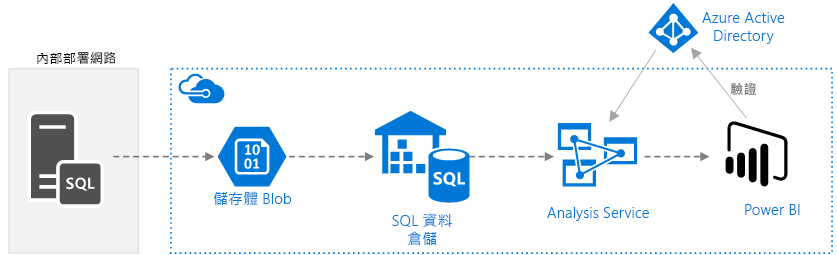
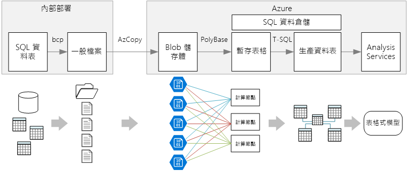
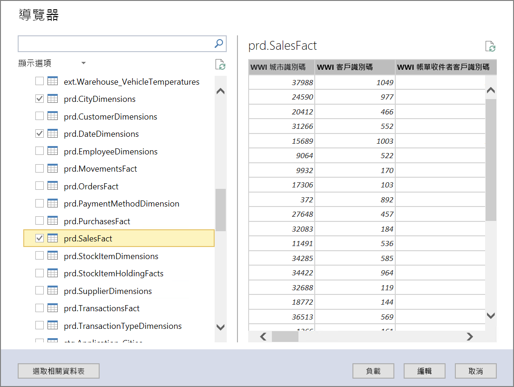
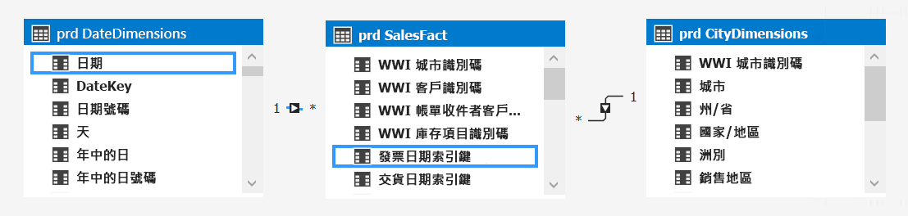
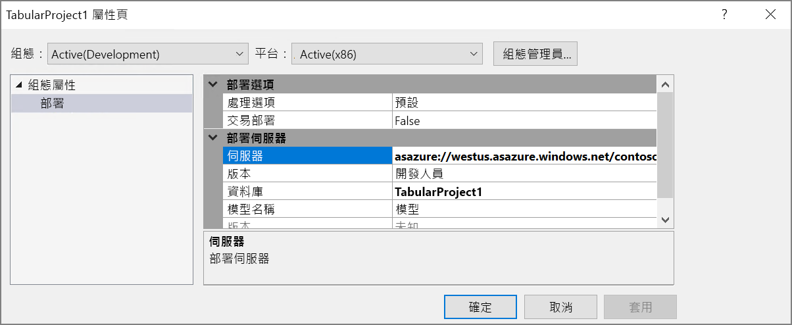
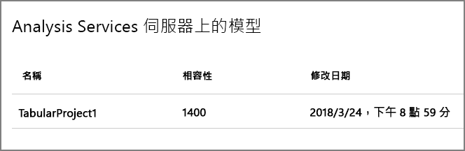
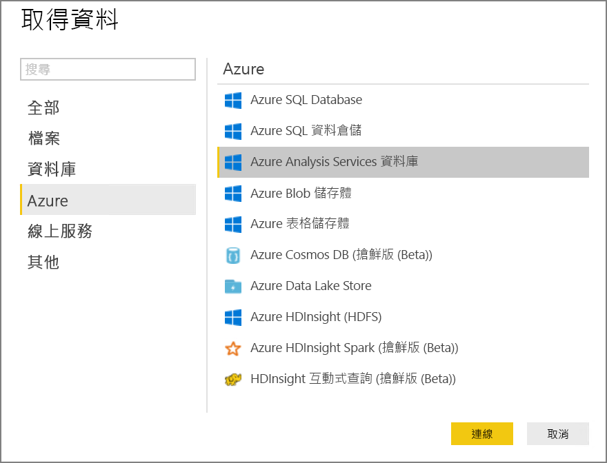
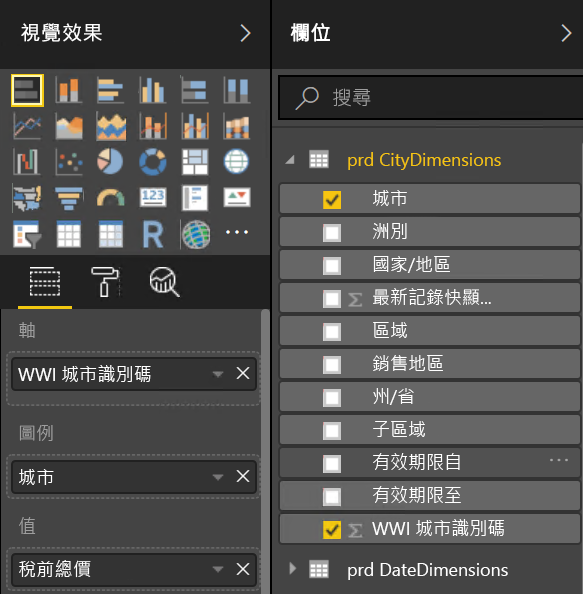
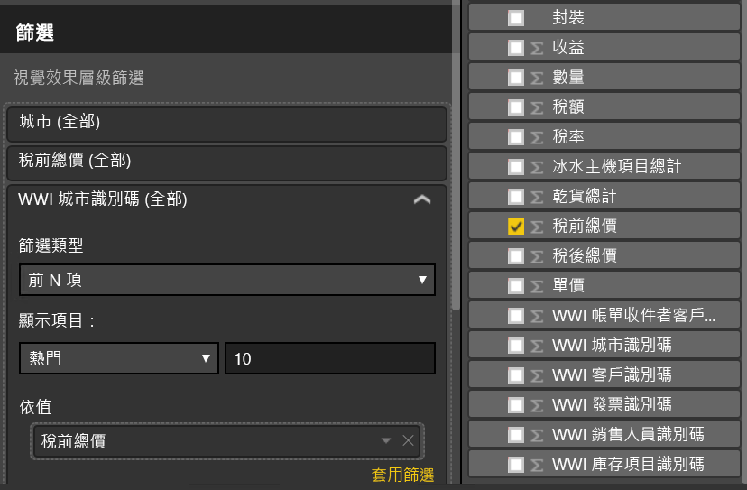
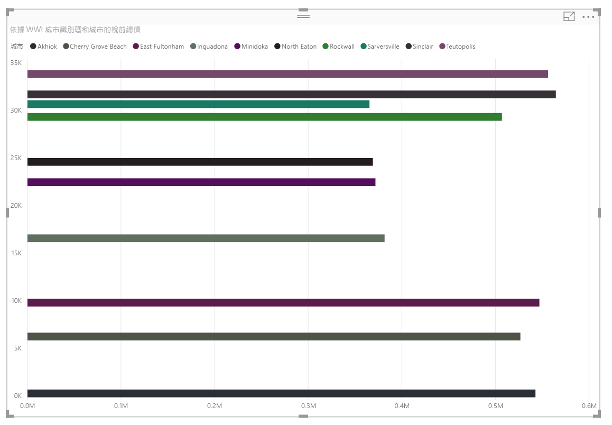

# <a name="enterprise-bi-with-sql-data-warehouse"></a>具 SQL 資料倉儲的 Enterprise BI
 
此參考架構會實作 [ELT](../../data-guide/relational-data/etl.md#extract-load-and-transform-elt) (擷取-載入-轉換) 管線，將資料從內部部署 SQL Server 資料庫移至 SQL 資料倉儲，並轉換資料以供分析。 [**部署這個解決方案**。](#deploy-the-solution)



**案例**：組織具有在內部部署的 SQL Server 資料庫中儲存的大型 OLTP 資料集。 組織想要使用 SQL 資料倉儲，透過 Power BI 執行分析。 

此參考架構是針對一次性或隨需作業而設計的。 如果您需要持續移動資料 (每小時或每日)，建議您使用 Azure Data Factory 來定義自動化工作流程。

## <a name="architecture"></a>架構

此架構由下列元件組成。

**SQL Server**。 來源資料位於內部部署的 SQL Server 資料庫中。 為了模擬內部部署環境，此架構的部署指令碼會在 Azure 中佈建已安裝 SQL Server 的虛擬機器。 

**Blob 儲存體**。 Blob 儲存體會作為在資料載入至 SQL 資料倉儲之前用來複製資料的臨時區域。

**Azure SQL 資料倉儲**。 [SQL 資料倉儲](/azure/sql-data-warehouse/)是為了對大型資料執行分析而設計的分散式系統。 它支援大量平行處理 (MPP)，因而適合用來執行高效能分析。 

**Azure Analysis Services**。 [Analysis Services](/azure/analysis-services/) 是完全受控的服務，可提供資料模型功能。 使用 Analysis Services 可建立可供使用者查詢的語意模型。 Analysis Services 在 BI 儀表板案例中最能發揮效用。 在此架構中，Analysis Services 會從資料倉儲讀取資料以處理語意模型，並有效率地為儀表板查詢提供服務。 它也可藉由相應放大複本以加快查詢處理速度，而支援彈性的並行存取。

目前，Azure Analysis Services 支援表格式模型，但不支援多維度模型。 表格式模型使用關聯式模型建構 (資料表和資料行)，而多維度模型則使用 OLAP 模型建構 (Cube、維度和量值)。 如果您需要多維度模型，請使用 SQL Server Analysis Services (SSAS)。 如需詳細資訊，請參閱[比較表格式和多維度解決方案](/sql/analysis-services/comparing-tabular-and-multidimensional-solutions-ssas)。

**Power BI**。 Power BI 是一套用來分析資料以產生商業見解的商務分析工具。 在此架構中，它會查詢儲存在 Analysis Services 中的語意模型。

**Azure Active Directory** (Azure AD) 會驗證透過 Power BI 連線至 Analysis Services 伺服器的使用者。

## <a name="data-pipeline"></a>Data Pipeline
 
此參考架構會使用 [WorldWideImporters](/sql/sample/world-wide-importers/wide-world-importers-oltp-database) 範例資料庫做作為資料來源。 資料管線具有下列階段：

1. 將資料從 SQL Server 匯出至一般檔案 (bcp 公用程式)。
2. 將一般檔案複製到 Azure Blob 儲存體 (AzCopy)。
3. 將資料載入 SQL 資料倉儲中 (PolyBase)。
4. 將資料轉換為星型結構描述 (T-SQL)。
5. 將語意模型載入 Analysis Services 中 (SQL Server Data Tools)。


 
> [!NOTE]
> 在步驟 1 &ndash; 3 中，請考慮使用 Redgate 資料平台 Studio。 資料平台 Studio 會套用最適當的相容性修正檔與最佳化，因此它是開始使用 SQL 資料倉儲最快的方式。 如需詳細資訊，請參閱[使用 Redgate 資料平台 Studio 載入資料](/azure/sql-data-warehouse/sql-data-warehouse-load-with-redgate)。 

以下幾節將詳細說明這些階段。

### <a name="export-data-from-sql-server"></a>從 SQL Server 匯入資料

[bcp](/sql/tools/bcp-utility) (大量複製程式) 公用程式是從 SQL 資料表建立一般文字檔的快速途徑。 在此步驟中，您會選取您要匯出的資料行，但不會轉換資料。 任何資料轉換均應在 SQL 資料倉儲中執行。

**建議**

可能的話，請將資料擷取排程於離峰時間，以盡可能避免生產環境中的資源爭用。  

請避免在資料庫伺服器上執行 bcp，改以其他機器來執行。 請將檔案寫入至本機磁碟機。 請確定您有足夠的 I/O 資源可處理並行寫入。 為了達到最佳效能，請將檔案匯出至專用的快速儲存磁碟機。

您可以用 Gzip 壓縮格式儲存匯出的資料，以加快網路傳輸速度。 不過，壓縮的檔案載入至倉儲的速度會低於非壓縮檔案的載入速度，因此，您必須在網路傳輸速度與載入速度之間做出取捨。 如果您決定使用 Gzip 壓縮，請勿建立單一 Gzip 檔案。 此時，請將資料分成多個壓縮檔案。

### <a name="copy-flat-files-into-blob-storage"></a>將一般檔案複製到 Blob 儲存體中

[AzCopy](/azure/storage/common/storage-use-azcopy) 公用程式可讓您以高效能將資料複製到 Azure Blob 儲存體中。

**建議**

儲存體帳戶請建立在來源資料所在位置的鄰近區域中。 請將儲存體帳戶和 SQL 資料倉儲執行個體部署在相同區域中。 

請勿在執行生產工作負載的相同機器上執行 AzCopy，因為 CPU 和 I/O 的耗用可能會影響到生產工作負載。 

請先測試上傳，以確認上傳速度。 您可以使用 AzCopy 中的 /NC 選項來指定並行複製作業數目。 一開始請先使用預設值，然後再試著以這項設定調整效能。 在低頻寬環境中，過多的並行作業有可能會拖垮網路連線，而使作業無法順利完成。  

AzCopy 會透過公用網際網路將資料移至儲存體。 若其速度不夠快，請考慮設定 [ExpressRoute](/azure/expressroute/) 線路。 ExpressRoute 是一項服務，它會透過專用私人連線將您的資料路由傳送至 Azure。 當網路連線速度太慢時，您也可以考慮將磁碟上的資料傳送至 Azure 資料中心。 如需詳細資訊，請參閱[從 Azure 來回傳輸資料](/azure/architecture/data-guide/scenarios/data-transfer)。

在複製作業期間，AzCopy 會建立暫存日誌檔案，讓 AzCopy 能夠在作業中斷 (例如，由於網路錯誤) 時加以重新啟動。 請確定有足夠的磁碟空間可儲存日誌檔案。 您可以使用 /Z 選項來指定日誌檔案的寫入位置。

### <a name="load-data-into-sql-data-warehouse"></a>將資料載入至 SQL 資料倉儲

使用 [PolyBase](/sql/relational-databases/polybase/polybase-guide) 可將檔案從 Blob 儲存體載入資料倉儲中。 PolyBase 依設計會運用 SQL 資料倉儲的 MPP (大量平行處理) 架構，因此能夠以最快的速度將資料載入 SQL 資料倉儲中。 

載入資料的程序由兩個步驟組成：

1. 為資料建立一組外部資料表。 外部資料表是一項資料表定義，會指向儲存在倉儲外部的資料 &mdash; 在此案例中，是指 Blob 儲存體中的一般檔案。 此步驟不會將任何資料移至倉儲中。
2. 建立暫存資料表，並將資料載入暫存資料表中。 此步驟會將資料複製到倉儲中。

**建議**

當您的資料龐大 (超過 1 TB)，且您的分析工作負載透過平行處理來執行又會比較好的話，請考慮使用 SQL 資料倉儲。 SQL 資料倉儲不適用於 OLTP 工作負載或較小的資料集 (< 250 GB)。 對於小於 250 GB 的資料集，請考慮使用 Azure SQL Database 或 SQL Server。 如需詳細資訊，請參閱[資料倉儲](../../data-guide/relational-data/data-warehousing.md)。

建立堆積資料表形式的暫存資料表 (不會編製索引)。 建立生產資料表的查詢時將會執行完整資料表掃描，因此不需要編製暫存資料表的索引。

PolyBase 會在倉儲中自動使用平行處理。 載入效能會在您增加 DWU 時隨之調整。 若要達到最佳效能，請使用單一載入作業。 將輸入資料分成多個區塊，並執行多項並行載入，並不會帶來效能上的優勢。

PolyBase 可讀取 Gzip 壓縮檔案。 不過，每個壓縮檔案只會使用一個讀取器，因為解壓縮檔案是單一執行緒作業。 因此，請避免載入單一大型壓縮檔案。 此時，請將資料分成多個壓縮檔案，以運用平行處理。 

請留意以下限制：

- PolyBase 支援的資料行大小上限為 `varchar(8000)`、`nvarchar(4000)` 或 `varbinary(8000)`。 如果您有超出這些限制的資料，其中一個選項是在資料匯出時將其分成多個區塊，並等到匯入後再重組區塊。 

- PolyBase 會使用固定的資料列結束字元 \n 或新行。 如果來源資料中出現新行字元，這可能會造成問題。

- 您的來源資料結構描述可能會包含 SQL 資料倉儲中不支援的資料類型。

為了因應這些限制，您可以建立會執行必要轉換的預存程序。 在執行 bcp 時，請參考此預存程序。 或者，[Redgate 資料平台 Studio](/azure/sql-data-warehouse/sql-data-warehouse-load-with-redgate) 會自動轉換在 SQL 資料倉儲中不支援的資料類型。

如需詳細資訊，請參閱下列文章：

- [將資料載入 Azure SQL 資料倉儲中的最佳做法](/azure/sql-data-warehouse/guidance-for-loading-data)。
- [將您的結構描述移轉至 SQL 資料倉儲](/azure/sql-data-warehouse/sql-data-warehouse-migrate-schema)
- [定義 SQL 資料倉儲中的資料表資料類型的指引](/azure/sql-data-warehouse/sql-data-warehouse-tables-data-types)

### <a name="transform-the-data"></a>轉換資料

轉換資料，並將其移至生產資料表中。 在此步驟中，資料會轉換成具有維度資料表與事實資料表、且適用於語意模型的星型結構描述。

建立具有叢集資料行存放區索引的生產資料表，以提供最理想的整體查詢效能。 資料行存放區索引已針對會掃描多筆記錄的查詢進行最佳化。 資料行存放區索引也不會就單一查閱而執行 (也就是查閱單一資料列)。 如果您需要執行頻繁的單一查詢，您可以將非叢集索引新增至資料表。 使用非叢集索引的單一查閱可大幅提升執行速度。 不過，相較於 OLTP 工作負載，在資料倉儲案例中通常較不常使用單一查閱。 如需詳細資訊，請參閱[在 SQL 資料倉儲中編製資料表的索引](/azure/sql-data-warehouse/sql-data-warehouse-tables-index)。

> [!NOTE]
> 叢集資料行存放區資料表不支援 `varchar(max)`、`nvarchar(max)` 或 `varbinary(max)` 資料類型。 在此情況下，請考慮使用堆積或叢集索引。 您可以將這些資料行放入個別的資料表中。

由於範例資料庫並不龐大，因此我們建立的複寫資料表不含分割區。 對於生產工作負載，使用分散式資料表應可改善查詢效能。 請參閱[在 Azure SQL 資料倉儲中設計分散式資料表的指引](/azure/sql-data-warehouse/sql-data-warehouse-tables-distribute)。 我們的範例指令碼會使用靜態[資源類別](/azure/sql-data-warehouse/resource-classes-for-workload-management)執行查詢。

### <a name="load-the-semantic-model"></a>載入語意模型

將資料載入至 Azure Analysis Services 中的表格式模型。 在此步驟中，您會使用 SQL Server Data Tools (SSDT) 建立語意資料模型。 您也可以從 Power BI Desktop 檔案匯入模型，藉以建立模型。 SQL 資料倉儲並不支援外部索引鍵，因此您必須將關聯性新增至語意模型，以便在資料表之間進行聯結。

### <a name="use-power-bi-to-visualize-the-data"></a>使用 Power BI 以視覺方式呈現資料

Power BI 支援兩個連線至 Azure Analysis Services 的選項：

- 匯入。 資料會匯入 Power BI 模型中。
- 即時連線。 資料會直接提取自 Analysis Services。

建議您使用即時連線，因為它不需要將資料複製到 Power BI 模型中。 此外，使用 DirectQuery 可確保結果絕對會與最新的來源資料一致。 如需詳細資訊，請參閱[使用 Power BI 進行連線](/azure/analysis-services/analysis-services-connect-pbi)。

**建議**

請避免直接對資料倉儲執行 BI 儀表板查詢。 BI 儀表板需要非常短的回應時間，直接對倉儲執行的查詢可能達不到此需求。 此外，重新整理儀表板將會計入並行查詢數目，而可能會影響效能。 

Azure Analysis Services 依設計可用來處理 BI 儀表板的查詢需求，因此，建議的作法是從 Power BI 查詢 Analysis Services。

## <a name="scalability-considerations"></a>延展性考量

### <a name="sql-data-warehouse"></a>SQL 資料倉儲

透過 SQL 資料倉儲，您可以隨需相應放大您的計算資源。 查詢引擎可根據計算節點的數目最佳化要平行處理的查詢，並視需要在節點之間移動資料。 如需詳細資訊，請參閱[管理 Azure SQL 資料倉儲中的計算能力](/azure/sql-data-warehouse/sql-data-warehouse-manage-compute-overview)。

### <a name="analysis-services"></a>Analysis Services

對於生產工作負載，建議您使用 Azure Analysis Services 的標準層，因為它支援分割區和 DirectQuery。 在一層之中，執行個體大小會決定記憶體和處理能力。 處理能力會以查詢處理單位 (QPU) 來測量。 請監視 QPU 使用量以選取適當的大小。 如需詳細資訊，請參閱[監視伺服器計量](/azure/analysis-services/analysis-services-monitor)。

在高負載的情況下，查詢效能可能會因為查詢並行而下降。 您可以建立用來處理查詢的複本集區以相應放大 Analysis Services，以便同時執行多個查詢。 處理資料模型的工作一律會在主要伺服器上執行。 根據預設，主要伺服器也會處理查詢。 您可以選擇性地指定以獨佔方式執行處理的主要伺服器，讓查詢集區可處理所有查詢。 如果您的處理需求較高，則應將處理獨立於查詢集區以外。 如果您的查詢負載較高，且處理負載相對較低，則可以將主要伺服器包含在查詢集區中。 如需詳細資訊，請參閱 [Azure Analysis Services 相應放大](/azure/analysis-services/analysis-services-scale-out)。 

若要減少非必要的處理量，請考慮使用分割區將表格式模型分成多個邏輯部分。 每個分割區將可個別處理。 如需詳細資訊，請參閱[分割區](/sql/analysis-services/tabular-models/partitions-ssas-tabular)。

## <a name="security-considerations"></a>安全性考量

### <a name="ip-whitelisting-of-analysis-services-clients"></a>Analysis Services 用戶端的 IP 白名單

請考慮使用 Analysis Services 防火牆功能，將用戶端 IP 位址列入白清單中。 防火牆啟用時，會封鎖未指定於防火牆規則中的所有用戶端連線。 預設規則會將 Power BI 服務列入白名單中，但您可以視需要停用此規則。 如需詳細資訊，請參閱[使用新的防火牆功能強化 Azure Analysis Services](https://azure.microsoft.com/blog/hardening-azure-analysis-services-with-the-new-firewall-capability/)。

### <a name="authorization"></a>Authorization

Azure Analysis Services 會使用 Azure Active Directory (Azure AD) 驗證連線至 Analysis Services 伺服器的使用者。 您可以建立角色，然後將 Azure AD 使用者或群組指派給這些角色，以限制特定使用者所能檢視的資料。 對於每個角色，您可以︰ 

- 保護資料表或個別資料行。 
- 根據篩選運算式保護個別資料列。 

如需詳細資訊，請參閱[管理資料庫角色和使用者](/azure/analysis-services/analysis-services-database-users)。

## <a name="deploy-the-solution"></a>部署解決方案

此參考架構的部署可在 [GitHub][ref-arch-repo-folder] 上取得。 它會部署下列各項：

  * 一個 Windows VM，用以模擬內部部署資料庫伺服器。 其中包含 SQL Server 2017 和相關工具以及 Power BI Desktop。
  * 一個提供 Blob 儲存體的 Azure 儲存體帳戶，用以保存從 SQL Server 資料庫匯出的資料。
  * 一個 Azure SQL 資料倉儲執行個體。
  * 一個 Azure Analysis Services 執行個體。

### <a name="prerequisites"></a>先決條件

1. 複製、派生或下載適用於 [Azure 參考架構][ref-arch-repo] GitHub 存放庫的 zip 檔案。

2. 安裝 [Azure 建置組塊][azbb-wiki] (azbb)。

3. 從命令提示字元、bash 提示字元或 PowerShell 提示字元中，使用下列命令登入 Azure 帳戶，並依照指示操作。

  ```bash
  az login  
  ```

### <a name="deploy-the-simulated-on-premises-server"></a>部署模擬的內部部署伺服器

首先，您會將 VM 部署為模擬的內部部署伺服器，其中包含 SQL Server 2017 和相關工具。 這個步驟也會將範例 [Wide World Importers OLTP 資料庫](/sql/sample/world-wide-importers/wide-world-importers-oltp-database)載入至 SQL Server。

1. 瀏覽至您在上述必要條件中下載之存放庫的 `data\enterprise-bi-sqldw\onprem\templates` 資料夾。

2. 在 `onprem.parameters.json` 檔案中，取代 `adminUsername` 和 `adminPassword` 的值。 此外也應變更 `SqlUserCredentials` 區段中的值，以符合使用者名稱和密碼。 請留意 userName 屬性中的 `.\\` 前置詞。
    
    ```bash
    "SqlUserCredentials": {
      "userName": ".\\username",
      "password": "password"
    }
    ```

3. 依照下列方式執行 `azbb`，以部署內部部署伺服器。

    ```bash
    azbb -s <subscription_id> -g <resource_group_name> -l <location> -p onprem.parameters.json --deploy
    ```

4. 此部署可能需要 20 到 30 分鐘才能完成，其中包括執行 [DSC](/powershell/dsc/overview) 指令碼以安裝工具和還原資料庫。 在 Azure 入口網站中檢閱資源群組中的資源，以驗證部署。 您應該會看到 `sql-vm1` 虛擬機器及其相關聯的資源。

### <a name="deploy-the-azure-resources"></a>部署 Azure 資源

此步驟會佈建 Azure SQL 資料倉儲和 Azure Analysis Services，以及儲存體帳戶。 如果您想，您可以將此步驟與上一個步驟平行執行。

1. 瀏覽至您在上述必要條件中下載之存放庫的 `data\enterprise-bi-sqldw\azure\templates` 資料夾。

2. 執行下列 Azure CLI 命令以建立資源群組 (請取代在方括弧中指定的參數)。 請注意，您可以部署至與您在上一個步驟中用於內部部署伺服器的資源群組不同的群組。 

    ```bash
    az group create --name <resource_group_name> --location <location>  
    ```

3. 執行下列 Azure CLI 命令以部署 Azure 資源 (請取代在方括弧中指定的參數)。 `storageAccountName` 參數必須遵循儲存體帳戶的[命名規則](../../best-practices/naming-conventions.md#naming-rules-and-restrictions)。 對於 `analysisServerAdmin` 參數，請使用您的 Azure Active Directory 使用者主體名稱 (UPN)。

    ```bash
    az group deployment create --resource-group <resource_group_name> --template-file azure-resources-deploy.json --parameters "dwServerName"="<server_name>" "dwAdminLogin"="<admin_username>" "dwAdminPassword"="<password>" "storageAccountName"="<storage_account_name>" "analysisServerName"="<analysis_server_name>" "analysisServerAdmin"="user@contoso.com"
    ```

4. 在 Azure 入口網站中檢閱資源群組中的資源，以驗證部署。 您應該會看到儲存體帳戶、Azure SQL 資料倉儲執行個體和 Analysis Services 執行個體。

5. 使用 Azure 入口網站取得儲存體帳戶的存取金鑰。 選取要開啟的儲存體帳戶。 在 [設定] 底下，選取 [存取金鑰]。 複製主要金鑰值。 您在下一個步驟將會用到此值。

### <a name="export-the-source-data-to-azure-blob-storage"></a>將來源資料匯出至 Azure Blob 儲存體 

在此步驟中，您將執行 PowerShell 指令碼以使用 bcp 將 SQL 資料庫匯出至 VM 上的一般檔案，然後使用 AzCopy 將這些檔案複製到 Azure Blob 儲存體中。

1. 使用遠端桌面連線至模擬的內部部署 VM。

2. 登入 VM 後，從 PowerShell 視窗執行下列命令。  

    ```powershell
    cd 'C:\SampleDataFiles\reference-architectures\data\enterprise_bi_sqldw\onprem'

    .\Load_SourceData_To_Blob.ps1 -File .\sql_scripts\db_objects.txt -Destination 'https://<storage_account_name>.blob.core.windows.net/wwi' -StorageAccountKey '<storage_account_key>'
    ```

    針對 `Destination` 參數，請將 `<storage_account_name>` 取代為您先前建立的儲存體帳戶的名稱。 針對 `StorageAccountKey` 參數，請使用該儲存體帳戶的存取金鑰。

3. 在 Azure 入口網站中，瀏覽至儲存體帳戶、選取 Blob 服務，並開啟 `wwi` 容器，以確認來源資料已複製到 Blob 儲存體。 您應該會看到以 `WorldWideImporters_Application_*` 開頭的資料表清單。

### <a name="execute-the-data-warehouse-scripts"></a>執行資料倉儲指令碼

1. 在您的遠端桌面工作階段中，啟動 SQL Server Management Studio (SSMS)。 

2. 連線到 SQL 資料倉儲

    - 伺服器類型：資料庫引擎
    
    - 伺服器名稱：`<dwServerName>.database.windows.net`，其中，`<dwServerName>` 是您在部署 Azure 資源時所指定的名稱。 您可以從 Azure 入口網站中取得此名稱。
    
    - 驗證：SQL Server 驗證。 請使用您在部署 Azure 資源時指定於 `dwAdminLogin` 和 `dwAdminPassword` 參數中的認證。

2. 瀏覽至 VM 上的 `C:\SampleDataFiles\reference-architectures\data\enterprise_bi_sqldw\azure\sqldw_scripts` 資料夾。 您將依數值順序執行此資料夾中的指令碼 `STEP_1` 到 `STEP_7`。

3. 在 SSMS 中選取 `master` 資料庫，並開啟 `STEP_1` 指令碼。 請變更以下這一行中的密碼值，然後執行指令碼。

    ```sql
    CREATE LOGIN LoaderRC20 WITH PASSWORD = '<change this value>';
    ```

4. 在 SSMS 中選取 `wwi` 資料庫。 開啟 `STEP_2` 指令碼，並執行指令碼。 如果發生錯誤，請確定您是對 `wwi` 資料庫執行指令碼，而非對 `master` 執行。

5. 使用 `STEP_1` 指令碼中指定的 `LoaderRC20` 使用者和密碼，開啟對 SQL 資料倉儲的新連線。

6. 使用此連線開啟 `STEP_3` 指令碼。 在指令碼中設定下列值：

    - 密碼：使用儲存體帳戶的存取金鑰。
    - 位置︰使用儲存體帳戶的名稱，如下所示：`wasbs://wwi@<storage_account_name>.blob.core.windows.net`。

7. 使用相同的連線，依序執行指令碼 `STEP_4` 到 `STEP_7`。 請確認一個指令碼順利完成後，再執行下一個。

在 SMSS 中，您應該會在 `wwi` 資料庫中看到一組 `prd.*` 資料表。 若要確認資料已產生，請執行下列查詢： 

```sql
SELECT TOP 10 * FROM prd.CityDimensions
```

### <a name="build-the-azure-analysis-services-model"></a>建置 Azure Analysis Services 模型

在此步驟中，您將建立會從資料倉儲匯入資料的表格式模型。 然後，您會將模型部署至 Azure Analysis Services。

1. 在您的遠端桌面工作階段中，啟動 SQL Server Data Tools 2015。

2. 選取 [檔案] > [新增] > [專案]。

3. 在 [新增專案] 對話方塊中的 [範本] 下，選取 [商業智慧] > [Analysis Services] > [Analysis Services 表格式專案]。 

4. 為專案命名，然後按一下 [確定]。

5. 在 [表格式模型設計工具] 對話方塊中，選取 [整合式工作區]，然後將 [相容性層級] 設為 `SQL Server 2017 / Azure Analysis Services (1400)`。 按一下 [SERVICEPRINCIPAL] 。

6. 在 [表格式模型總管] 視窗中，以滑鼠右鍵按一下專案，然後選取 [從資料來源匯入]。

7. 選取 [Azure SQL 資料倉儲]，然後按一下 [連線]。

8. 針對 [伺服器]，輸入 Azure SQL 資料倉儲伺服器的完整名稱。 針對 [資料庫]，輸入 `wwi`。 按一下 [SERVICEPRINCIPAL] 。

9. 在下一個對話方塊中，選擇 [資料庫] 驗證，並輸入您的 Azure SQL 資料倉儲的使用者名稱和密碼，然後按一下 [確定]。

10. 在 [導覽器] 對話方塊中，選取 **prd.CityDimensions**、**prd.DateDimensions** 和 **prd.SalesFact** 的核取方塊。 

    

11. 按一下 [載入]。 在處理完成時，按一下 [關閉]。 您現在應該會看到資料的表格式檢視。

12. 在 [表格式模型總管] 視窗中，以滑鼠右鍵按一下專案，然後選取 [模型檢視] > [圖表檢視]。

13. 將 **[prd.SalesFact].[WWI City ID]** 欄位拖曳至 **[prd.CityDimensions].[WWI City ID]** 欄位，以建立關聯性。  

14. 將 **[prd.SalesFact].[Invoice Date Key]** 欄位拖曳至 **[prd.DateDimensions].[Date]** 欄位。  
    

15. 在 [檔案] 功能表中，選擇 [全部儲存]。  

16. 在 [方案總管] 中，以滑鼠右鍵按一下專案，然後選取 [屬性]。 

17. 在 [伺服器] 下，輸入 Azure Analysis Services 執行個體的 URL。 您可以從 Azure 入口網站中取得此值。 在入口網站中選取 Analysis Services 資源，按一下 [概觀] 窗格，然後尋找 [伺服器名稱] 屬性。 該屬性將類似於 `asazure://westus.asazure.windows.net/contoso`。 按一下 [SERVICEPRINCIPAL] 。

    

18. 在 [方案總管] 中，以滑鼠右鍵按一下專案，然後選取 [部署]。 在出現提示時，登入 Azure。 在處理完成時，按一下 [關閉]。

19. 在 Azure 入口網站中，檢視 Azure Analysis Services 執行個體的詳細資料。 請確認您的模型出現在模型清單中。

    

### <a name="analyze-the-data-in-power-bi-desktop"></a>在 Power BI Desktop 中分析資料

在此步驟中，您將使用 Power BI 從 Analysis Services 中的資料建立報告。

1. 在您的遠端桌面工作階段中，啟動 Power BI Desktop。

2. 在 [歡迎使用] 畫面中，按一下 [取得資料]。

3. 選取 [Azure] > [Azure Analysis Services 資料庫]。 按一下 [連接] 

    

4. 輸入 Analysis Services 執行個體的 URL，然後按一下 [確定]。 在出現提示時，登入 Azure。

5. 在 [導覽器] 對話方塊中，展開您所部署的表格式專案，選取您所建立的模型，然後按一下 [確定]。

2. 在 [視覺效果] 窗格中，選取 [堆疊橫條圖] 圖示。 在 [報告] 檢視中，將視覺效果調整得大一些。

6. 在 [欄位] 窗格中，展開 **prd.CityDimensions**。

7. 將 **prd.CityDimensions** > [WWI 城市識別碼] 拖曳至 [軸] 區。

8. 將 **prd.CityDimensions** > [城市] 拖曳至 [圖例] 區。

9. 在 [欄位] 窗格中，展開 **prd.SalesFact**。

10. 將 **prd.SalesFact** > [未稅額總計] 拖曳至 [值] 區。

    

11. 在 [視覺效果層級篩選] 下，選取 [WWI 城市識別碼]。

12. 將 [篩選類型] 設為 `Top N`，並將 [顯示項目] 設為 `Top 10`。

13. 將 **prd.SalesFact** > [未稅額總計] 拖曳至 [依據值] 區

    

14. 按一下 [套用篩選]。 視覺效果會依城市顯示前 10 個總銷售量。

    

若要深入了解 Power BI Desktop，請參閱[開始使用 Power BI Desktop](/power-bi/desktop-getting-started)。

## <a name="next-steps"></a>後續步驟

- 如需關於此參考架構的詳細資訊，請瀏覽我們的 [GitHub 存放庫][ref-arch-repo-folder]。
- 了解 [Azure 建置組塊][azbb-repo]。

<!-- links -->

[azure-cli-2]: /azure/install-azure-cli
[azbb-repo]: https://github.com/mspnp/template-building-blocks
[azbb-wiki]: https://github.com/mspnp/template-building-blocks/wiki/Install-Azure-Building-Blocks
[github-folder]: https://github.com/mspnp/reference-architectures/tree/master/data/enterprise_bi_sqldw
[ref-arch-repo]: https://github.com/mspnp/reference-architectures
[ref-arch-repo-folder]: https://github.com/mspnp/reference-architectures/tree/master/data/enterprise_bi_sqldw

