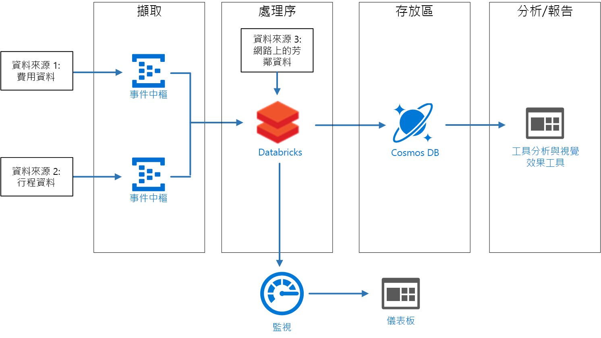

# <a name="create-a-stream-processing-pipeline-with-azure-databricks"></a>使用 Azure Databricks 建立串流處理管線

此參考架構顯示端對端[串流處理](/azure/architecture/data-guide/big-data/real-time-processing)管線。 此類型的管線有四個階段：擷取、處理、儲存，以及分析和報告。 在此參考架構中，管線會從兩個來源擷取資料、對來自每個資料流的相關記錄執行聯結、擴充結果，並即時計算平均值。 結果會儲存以供進一步分析。 [**部署這個解決方案**](#deploy-the-solution)。



**案例**：計程車公司會收集有關每趟計程車車程的資料。 在此案例中，我們假設有兩個不同的裝置會傳送資料。 計程車的其中一個計量會傳送關於每趟車程的資訊，如車程時間、距離和上下車地點等。 另一個裝置會接收客戶付款，並傳送費用相關資料。 為了找出乘客數趨勢，計程車公司想要對每個鄰近地區即時計算出平均每英里的小費。

## <a name="architecture"></a>架構

此架構由下列元件組成。

**資料來源**。 在此架構中，有兩個資料來源會即時產生資料流。 第一個資料流包含車程資訊，而第二個包含費用資訊。 參考架構包含模擬的資料產生器，可讀取一組靜態檔案，並將資料推送到事件中樞。 實際應用程式中的資料來源會是安裝在計程車上的裝置。

**Azure 事件中樞**. [事件中樞](/azure/event-hubs/)是事件擷取服務。 此架構使用兩個事件中樞執行個體，分別用於兩個資料來源。 每個資料來源會將資料流傳送至相關聯的事件中樞。

**Azure Databricks**。 [Databricks](/azure/azure-databricks/) 是一個針對 Microsoft Azure 雲端服務平台進行最佳化的 Apache Spark 分析平台。 Databricks 可用來建立計程車車程與費用資料的相互關聯，並以 Databricks 檔案系統中儲存的鄰近地區資料來擴充相互關聯的資料。

**Cosmos DB**。 Azure Databricks 作業的輸出是一系列的記錄，會使用 Cassandra API 寫入至 [Cosmos DB](/azure/cosmos-db/)。 之所以使用 Cassandra API，因為它支援時間序列資料模型化。

**Azure Log Analytics**。 [Azure 監視器](/azure/monitoring-and-diagnostics/)所收集的應用程式記錄資料會儲存在 [Log Analytics 工作區](/azure/log-analytics)中。 Log Analytics 查詢可用來分析和視覺化計量，並可檢查記錄訊息以找出應用程式中的問題。

## <a name="data-ingestion"></a>資料擷取

若要模擬資料來源，此參考架構會使用[紐約市計程車資料](https://uofi.app.box.com/v/NYCtaxidata/folder/2332218797)資料集<sup>[[1]](#note1)</sup>。 此資料集包含紐約市在四年期間的計程車路程資料 (2010 &ndash; 2013)。 其包含兩種類型的記錄：車程資料和費用資料。 車程資料包括路程持續時間、路程距離和上下車地點。 費用資料包括費用、稅金和小費金額。 在這兩種記錄類型中共同欄位包含計程車牌照號碼、計程車執照和廠商識別碼。 這三個欄位可唯一識別一輛計程車加上司機。 資料會以 CSV 格式儲存。

> [1] <span id="note1">Donovan, Brian; Work, Dan (2016)：紐約市計程車車程資料 (2010-2013)。 伊利諾大學香檳分校。 https://doi.org/10.13012/J8PN93H8

資料產生器為 .NET Core 應用程式，可讀取記錄並將其傳送到 Azure 事件中樞。 產生器會以 JSON 格式傳送車程資料，以 CSV 格式傳送費用資料。

事件中樞使用[分割區](/azure/event-hubs/event-hubs-features#partitions)來分割資料。 資料分割可讓取用者平行讀取每個分割。 將資料傳送至事件中樞時，您可以明確指定分割區索引鍵。 否則，記錄會以循環配置資源的方式指派給分割區。

在此案例中，車程資料和費用資料最後應具有指定計程車的同一分割區識別碼。 這可讓 Databricks 在將兩個資料流相互關聯時套用一定程度的平行處理原則。 車程資料分割區 *n* 中的記錄會比對到費用資料分割區 *n* 中的記錄。


在資料產生器中，這兩種記錄類型的共同資料模型具有 `PartitionKey` 屬性，其為 `Medallion`、`HackLicense` 和 `VendorId` 的串連。

```csharp
public abstract class TaxiData
{
    public TaxiData()
    {
    }

    [JsonProperty]
    public long Medallion { get; set; }

    [JsonProperty]
    public long HackLicense { get; set; }

    [JsonProperty]
    public string VendorId { get; set; }

    [JsonProperty]
    public DateTimeOffset PickupTime { get; set; }

    [JsonIgnore]
    public string PartitionKey
    {
        get => $"{Medallion}_{HackLicense}_{VendorId}";
    }
```

在傳送至事件中樞時，這個屬性用來提供明確的分割區索引鍵：

```csharp
using (var client = pool.GetObject())
{
    return client.Value.SendAsync(new EventData(Encoding.UTF8.GetBytes(
        t.GetData(dataFormat))), t.PartitionKey);
}
```

### <a name="event-hubs"></a>事件中樞

事件中樞的輸送量容量會以[輸送量單位](/azure/event-hubs/event-hubs-features#throughput-units)來測量。 您可以啟用[自動擴充](/azure/event-hubs/event-hubs-auto-inflate)以自動調整事件中樞，這會根據流量 (上限為設定的最大值) 自動調整輸送量單位。

## <a name="stream-processing"></a>串流處理

在 Azure Databricks 中會以作業執行資料處理。 作業會指派給叢集並於其上執行。 作業可以是以 Java 撰寫的自訂程式碼或是 Spark [Notebook](https://docs.databricks.com/user-guide/notebooks/index.html)。

在此參考架構中，作業是以 Scala 和 Java 撰寫類別的 Java 封存檔。 在指定 Databricks 作業的 Java 封存檔時，Databricks 叢集會指定要執行的類別。 在此，**com.microsoft.pnp.TaxiCabReader** 類別的 **Main** 方法包含資料處理邏輯。

### <a name="reading-the-stream-from-the-two-event-hub-instances"></a>從兩個事件中樞執行個體讀取資料流

資料處理邏輯會使用 [Spark 結構化串流](https://spark.apache.org/docs/2.1.2/structured-streaming-programming-guide.html)，從兩個 Azure 事件中樞執行個體進行讀取：

```scala
val rideEventHubOptions = EventHubsConf(rideEventHubConnectionString)
      .setConsumerGroup(conf.taxiRideConsumerGroup())
      .setStartingPosition(EventPosition.fromStartOfStream)
    val rideEvents = spark.readStream
      .format("eventhubs")
      .options(rideEventHubOptions.toMap)
      .load

    val fareEventHubOptions = EventHubsConf(fareEventHubConnectionString)
      .setConsumerGroup(conf.taxiFareConsumerGroup())
      .setStartingPosition(EventPosition.fromStartOfStream)
    val fareEvents = spark.readStream
      .format("eventhubs")
      .options(fareEventHubOptions.toMap)
      .load
```

### <a name="enriching-the-data-with-the-neighborhood-information"></a>以鄰近地區資訊擴充資料

車程資料包含載客與下車位置的緯度和經度座標。 雖然這些座標有其效用，但要加以取用並進行分析並不容易。 因此，這項資料會使用讀取自[形狀檔](https://en.wikipedia.org/wiki/Shapefile)的鄰近地區資料進行擴充。

形狀檔屬於二進位格式且無法輕易剖析，但 [GeoTools](http://geotools.org/) 程式庫針對地理空間資料而提供的工具即使用形狀檔格式。 此程式庫用於 **com.microsoft.pnp.GeoFinder** 類別中，可根據載客和下車座標判斷鄰近地區名稱。

```scala
val neighborhoodFinder = (lon: Double, lat: Double) => {
      NeighborhoodFinder.getNeighborhood(lon, lat).get()
    }
```

### <a name="joining-the-ride-and-fare-data"></a>聯結車程與費用資料

第一項車程和費用資料會進行轉換：

```scala
    val rides = transformedRides
      .filter(r => {
        if (r.isNullAt(r.fieldIndex("errorMessage"))) {
          true
        }
        else {
          malformedRides.add(1)
          false
        }
      })
      .select(
        $"ride.*",
        to_neighborhood($"ride.pickupLon", $"ride.pickupLat")
          .as("pickupNeighborhood"),
        to_neighborhood($"ride.dropoffLon", $"ride.dropoffLat")
          .as("dropoffNeighborhood")
      )
      .withWatermark("pickupTime", conf.taxiRideWatermarkInterval())

    val fares = transformedFares
      .filter(r => {
        if (r.isNullAt(r.fieldIndex("errorMessage"))) {
          true
        }
        else {
          malformedFares.add(1)
          false
        }
      })
      .select(
        $"fare.*",
        $"pickupTime"
      )
      .withWatermark("pickupTime", conf.taxiFareWatermarkInterval())
```

然後，車程資料會與費用資料相聯結：

```scala
val mergedTaxiTrip = rides.join(fares, Seq("medallion", "hackLicense", "vendorId", "pickupTime"))
```

### <a name="processing-the-data-and-inserting-into-cosmos-db"></a>處理資料並將其插入 Cosmos DB 中

每個鄰近地區的平均費用金額均依據指定的時間間隔計算：

```scala
val maxAvgFarePerNeighborhood = mergedTaxiTrip.selectExpr("medallion", "hackLicense", "vendorId", "pickupTime", "rateCode", "storeAndForwardFlag", "dropoffTime", "passengerCount", "tripTimeInSeconds", "tripDistanceInMiles", "pickupLon", "pickupLat", "dropoffLon", "dropoffLat", "paymentType", "fareAmount", "surcharge", "mtaTax", "tipAmount", "tollsAmount", "totalAmount", "pickupNeighborhood", "dropoffNeighborhood")
      .groupBy(window($"pickupTime", conf.windowInterval()), $"pickupNeighborhood")
      .agg(
        count("*").as("rideCount"),
        sum($"fareAmount").as("totalFareAmount"),
        sum($"tipAmount").as("totalTipAmount")
      )
      .select($"window.start", $"window.end", $"pickupNeighborhood", $"rideCount", $"totalFareAmount", $"totalTipAmount")
```

得出的結果會插入 Cosmos DB 中：

```scala
maxAvgFarePerNeighborhood
      .writeStream
      .queryName("maxAvgFarePerNeighborhood_cassandra_insert")
      .outputMode(OutputMode.Append())
      .foreach(new CassandraSinkForeach(connector))
      .start()
      .awaitTermination()
```

## <a name="security-considerations"></a>安全性考量

對 Azure 資料庫工作區的存取可使用[管理主控台](https://docs.databricks.com/administration-guide/admin-settings/index.html)來控制。 管理主控台中包含新增使用者、管理使用者權限，以及設定單一登入的功能。 工作區、叢集、作業和資料表的存取控制也可以透過管理主控台來設定。

### <a name="managing-secrets"></a>管理密碼

Azure Databricks 包含[密碼存放區](https://docs.azuredatabricks.net/user-guide/secrets/index.html)，可用來儲存密碼，包括連接字串、存取金鑰、使用者名稱和密碼。 Azure Databricks 密碼存放區中的祕密會依**範圍**進行分割：

```bash
databricks secrets create-scope --scope "azure-databricks-job"
```

祕密會在範圍層級新增：

```bash
databricks secrets put --scope "azure-databricks-job" --key "taxi-ride"
```

> [!NOTE]
> 您可以不要使用原生的 Azure Databricks 範圍，而使用 Azure Key Vault 支援的範圍。 若要深入了解，請參閱 [Azure Key Vault 支援的範圍](https://docs.azuredatabricks.net/user-guide/secrets/secret-scopes.html#azure-key-vault-backed-scopes)。

在程式碼中，會透過 Azure Databricks [祕密公用程式](https://docs.databricks.com/user-guide/dev-tools/dbutils.html#secrets-utilities)來存取祕密。

## <a name="monitoring-considerations"></a>監視功能考量

Azure Databricks 以 Apache Spark 為基礎，且兩者都以 [log4j](https://logging.apache.org/log4j/2.x/) 作為記錄的標準程式庫。 除了 Apache Spark 所提供的預設記錄外，此參考架構也會將記錄和計量傳送至 [Azure Log Analytics](/azure/log-analytics/)。

**Com.microsoft.pnp.TaxiCabReader** 類別會設定 Apache Spark 記錄系統，以使用 **log4j.properties** 檔案中的值將記錄傳送至 Azure Log Analytics。 雖然 Apache Spark 記錄器訊息是字串，Azure Log Analytics 仍會要求將記錄訊息格式化為 JSON。 **com.microsoft.pnp.log4j.LogAnalyticsAppender** 類別會將這些訊息轉換成 JSON：

```scala

    @Override
    protected void append(LoggingEvent loggingEvent) {
        if (this.layout == null) {
            this.setLayout(new JSONLayout());
        }

        String json = this.getLayout().format(loggingEvent);
        try {
            this.client.send(json, this.logType);
        } catch(IOException ioe) {
            LogLog.warn("Error sending LoggingEvent to Log Analytics", ioe);
        }
    }

```

當 **com.microsoft.pnp.TaxiCabReader** 類別處理車程和費用訊息時，其中任一訊息都有可能因格式不正確而無效。 在生產環境中，請務必分析這些格式不正確的訊息並找出資料來源的問題，以快速加以修正而避免資料遺失。 **com.microsoft.pnp.TaxiCabReader** 類別會註冊 Apache Spark Accumulator，用以追蹤格式不正確的費用和車程記錄數目：

```scala
    @transient val appMetrics = new AppMetrics(spark.sparkContext)
    appMetrics.registerGauge("metrics.malformedrides", AppAccumulators.getRideInstance(spark.sparkContext))
    appMetrics.registerGauge("metrics.malformedfares", AppAccumulators.getFareInstance(spark.sparkContext))
    SparkEnv.get.metricsSystem.registerSource(appMetrics)
```

Apache Spark 會使用 Dropwizard 程式庫來傳送計量，而部分原生 Dropwizard 計量欄位會與 Azure Log Analytics 不相容。 因此，此參考架構包含自訂的 Dropwizard 接收器和報告程式。 它會以 Azure Log Analytics 所預期的格式將計量格式化。 在 Apache Spark 報告計量時，也會傳送格式不正確的車程和費用資料的自訂計量。

要記錄到 Azure Log Analytics 工作區的最後一項計量，是 Spark 結構化串流作業進度的累計進度。 此動作可使用在 **com.microsoft.pnp.StreamingMetricsListener** 類別中實作的自訂 StreamingQuery 接聽程式來完成。 此類別會在作業執行時註冊到 Apache Spark 工作階段：

```scala
spark.streams.addListener(new StreamingMetricsListener())
```

每當結構化串流事件發生時，Apache Spark 執行階段就會呼叫 StreamingMetricsListener 中的方法，將記錄訊息和計量傳送至 Azure Log Analytics 工作區。 您可以在工作區中使用下列查詢來監視應用程式：

### <a name="latency-and-throughput-for-streaming-queries"></a>串流查詢的延遲和輸送量

```shell
taxijob_CL
| where TimeGenerated > startofday(datetime(<date>)) and TimeGenerated < endofday(datetime(<date>))
| project  mdc_inputRowsPerSecond_d, mdc_durationms_triggerExecution_d
| render timechart
```

### <a name="exceptions-logged-during-stream-query-execution"></a>在資料流查詢執行期間記錄的例外狀況

```shell
taxijob_CL
| where TimeGenerated > startofday(datetime(<date>)) and TimeGenerated < endofday(datetime(<date>))
| where Level contains "Error"
```

### <a name="accumulation-of-malformed-fare-and-ride-data"></a>格式不正確的費用和車程資料的累計

```shell
SparkMetric_CL
| where TimeGenerated > startofday(datetime(<date>)) and TimeGenerated < endofday(datetime(<date>))
| render timechart
| where name_s contains "metrics.malformedrides"

SparkMetric_CL
| where TimeGenerated > startofday(datetime(<date>)) and TimeGenerated < endofday(datetime(<date>))
| render timechart
| where name_s contains "metrics.malformedfares"
```

### <a name="job-execution-to-trace-resiliency"></a>追蹤復原情形的作業執行

```shell
SparkMetric_CL
| where TimeGenerated > startofday(datetime(<date>)) and TimeGenerated < endofday(datetime(<date>))
| render timechart
| where name_s contains "driver.DAGScheduler.job.allJobs"
```

## <a name="deploy-the-solution"></a>部署解決方案

若要部署及執行參考實作，請依照 [GitHub 讀我檔案](https://github.com/mspnp/azure-databricks-streaming-analytics)中的步驟。

