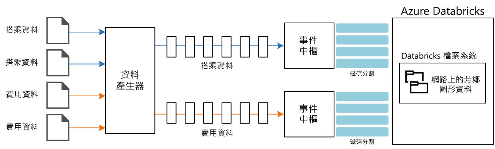

# <a name="stream-processing-with-azure-databricks"></a>串流處理搭配 Azure Databricks

此參考架構顯示端對端[串流處理](/azure/architecture/data-guide/big-data/real-time-processing)管線。 此類型的管線有四個階段：擷取、處理、儲存，以及分析和報告。 在此參考架構中，管線會從兩個來源擷取資料、對來自每個資料流的相關記錄執行聯結、擴充結果，並即時計算平均值。 結果會儲存以供進一步分析。 [**部署這個解決方案**。](#deploy-the-solution)


**案例**：計程車公司會收集有關每趟計程車車程的資料。 在此案例中，我們假設有兩個不同的裝置會傳送資料。 計程車的其中一個計量會傳送關於每趟車程的資訊，如車程時間、距離和上下車地點等。 另一個裝置會接收客戶付款，並傳送費用相關資料。 為了找出乘客數趨勢，計程車公司想要對每個鄰近地區即時計算出平均每英里的小費。

## <a name="architecture"></a>架構

此架構由下列元件組成。

**資料來源**。 在此架構中，有兩個資料來源會即時產生資料流。 第一個資料流包含車程資訊，而第二個包含費用資訊。 參考架構包含模擬的資料產生器，可讀取一組靜態檔案，並將資料推送到事件中樞。 實際應用程式中的資料來源會是安裝在計程車上的裝置。

**Azure 事件中樞**. [事件中樞](/azure/event-hubs/)是事件擷取服務。 此架構使用兩個事件中樞執行個體，分別用於兩個資料來源。 每個資料來源會將資料流傳送至相關聯的事件中樞。

**Azure Databricks**。 [Databricks](/azure/azure-databricks/) 是一個針對 Microsoft Azure 雲端服務平台進行最佳化的 Apache Spark 分析平台。 Databricks 可用來建立計程車車程與費用資料的相互關聯，並以 Databricks 檔案系統中儲存的鄰近地區資料來擴充相互關聯的資料。

**Cosmos DB**。 Azure Databricks 作業的輸出是一系列的記錄，會使用 Cassandra API 寫入至 [Cosmos DB](/azure/cosmos-db/)。 之所以使用 Cassandra API，因為它支援時間序列資料模型化。

**Azure Log Analytics**。 [Azure 監視器](/azure/monitoring-and-diagnostics/)所收集的應用程式記錄資料會儲存在 [Log Analytics 工作區](/azure/log-analytics)中。 Log Analytics 查詢可用來分析和視覺化計量，並可檢查記錄訊息以找出應用程式中的問題。

## <a name="data-ingestion"></a>資料擷取

若要模擬資料來源，此參考架構會使用[紐約市計程車資料](https://uofi.app.box.com/v/NYCtaxidata/folder/2332218797)資料集<sup>[[1]](#note1)</sup>。 此資料集包含紐約市在四年期間的計程車路程資料 (2010 &ndash; 2013)。 它包含兩種類型的記錄：車程資料和費用資料。 車程資料包括路程持續時間、路程距離和上下車地點。 費用資料包括費用、稅金和小費金額。 在這兩種記錄類型中共同欄位包含計程車牌照號碼、計程車執照和廠商識別碼。 這三個欄位可唯一識別一輛計程車加上司機。 資料會以 CSV 格式儲存。 

資料產生器為 .NET Core 應用程式，可讀取記錄並將其傳送到 Azure 事件中樞。 產生器會以 JSON 格式傳送車程資料，以 CSV 格式傳送費用資料。 

事件中樞使用[分割區](/azure/event-hubs/event-hubs-features#partitions)來分割資料。 資料分割可讓取用者平行讀取每個分割。 將資料傳送至事件中樞時，您可以明確指定分割區索引鍵。 否則，記錄會以循環配置資源的方式指派給分割區。 

在此案例中，車程資料和費用資料最後應具有指定計程車的同一分割區識別碼。 這可讓 Databricks 在將兩個資料流相互關聯時套用一定程度的平行處理原則。 車程資料分割區 *n* 中的記錄會比對到費用資料分割區 *n* 中的記錄。



在資料產生器中，這兩種記錄類型的共同資料模型具有 `PartitionKey` 屬性，其為 `Medallion`、`HackLicense` 和 `VendorId` 的串連。

```csharp
public abstract class TaxiData
{
    public TaxiData()
    {
    }

    [JsonProperty]
    public long Medallion { get; set; }

    [JsonProperty]
    public long HackLicense { get; set; }

    [JsonProperty]
    public string VendorId { get; set; }

    [JsonProperty]
    public DateTimeOffset PickupTime { get; set; }

    [JsonIgnore]
    public string PartitionKey
    {
        get => $"{Medallion}_{HackLicense}_{VendorId}";
    }
```

在傳送至事件中樞時，這個屬性用來提供明確的分割區索引鍵：

```csharp
using (var client = pool.GetObject())
{
    return client.Value.SendAsync(new EventData(Encoding.UTF8.GetBytes(
        t.GetData(dataFormat))), t.PartitionKey);
}
```

### <a name="event-hubs"></a>事件中樞

事件中樞的輸送量容量會以[輸送量單位](/azure/event-hubs/event-hubs-features#throughput-units)來測量。 您可以啟用[自動擴充](/azure/event-hubs/event-hubs-auto-inflate)以自動調整事件中樞，這會根據流量 (上限為設定的最大值) 自動調整輸送量單位。 

## <a name="stream-processing"></a>串流處理

在 Azure Databricks 中會以作業執行資料處理。 作業會指派給叢集並於其上執行。 作業可以是以 Java 撰寫的自訂程式碼或是 Spark [Notebook](https://docs.databricks.com/user-guide/notebooks/index.html)。

在此參考架構中，作業是以 Scala 和 Java 撰寫類別的 Java 封存檔。 在指定 Databricks 作業的 Java 封存檔時，Databricks 叢集會指定要執行的類別。 在此，**com.microsoft.pnp.TaxiCabReader** 類別的 **Main** 方法包含資料處理邏輯。 

### <a name="reading-the-stream-from-the-two-event-hub-instances"></a>從兩個事件中樞執行個體讀取資料流

資料處理邏輯會使用 [Spark 結構化串流](https://spark.apache.org/docs/2.1.2/structured-streaming-programming-guide.html)，從兩個 Azure 事件中樞執行個體進行讀取：

```scala
val rideEventHubOptions = EventHubsConf(rideEventHubConnectionString)
      .setConsumerGroup(conf.taxiRideConsumerGroup())
      .setStartingPosition(EventPosition.fromStartOfStream)
    val rideEvents = spark.readStream
      .format("eventhubs")
      .options(rideEventHubOptions.toMap)
      .load

    val fareEventHubOptions = EventHubsConf(fareEventHubConnectionString)
      .setConsumerGroup(conf.taxiFareConsumerGroup())
      .setStartingPosition(EventPosition.fromStartOfStream)
    val fareEvents = spark.readStream
      .format("eventhubs")
      .options(fareEventHubOptions.toMap)
      .load
```

### <a name="enriching-the-data-with-the-neighborhood-information"></a>以鄰近地區資訊擴充資料

車程資料包含載客與下車位置的緯度和經度座標。 雖然這些座標有其效用，但要加以取用並進行分析並不容易。 因此，這項資料會使用讀取自[形狀檔](https://en.wikipedia.org/wiki/Shapefile)的鄰近地區資料進行擴充。 

形狀檔屬於二進位格式且無法輕易剖析，但 [GeoTools](http://geotools.org/) 程式庫針對地理空間資料而提供的工具即使用形狀檔格式。 此程式庫用於 **com.microsoft.pnp.GeoFinder** 類別中，可根據載客和下車座標判斷鄰近地區名稱。 

```scala
val neighborhoodFinder = (lon: Double, lat: Double) => {
      NeighborhoodFinder.getNeighborhood(lon, lat).get()
    }
```

### <a name="joining-the-ride-and-fare-data"></a>聯結車程與費用資料

第一項車程和費用資料會進行轉換：

```scala
    val rides = transformedRides
      .filter(r => {
        if (r.isNullAt(r.fieldIndex("errorMessage"))) {
          true
        }
        else {
          malformedRides.add(1)
          false
        }
      })
      .select(
        $"ride.*",
        to_neighborhood($"ride.pickupLon", $"ride.pickupLat")
          .as("pickupNeighborhood"),
        to_neighborhood($"ride.dropoffLon", $"ride.dropoffLat")
          .as("dropoffNeighborhood")
      )
      .withWatermark("pickupTime", conf.taxiRideWatermarkInterval())

    val fares = transformedFares
      .filter(r => {
        if (r.isNullAt(r.fieldIndex("errorMessage"))) {
          true
        }
        else {
          malformedFares.add(1)
          false
        }
      })
      .select(
        $"fare.*",
        $"pickupTime"
      )
      .withWatermark("pickupTime", conf.taxiFareWatermarkInterval())
```

然後，車程資料會與費用資料相聯結：

```scala
val mergedTaxiTrip = rides.join(fares, Seq("medallion", "hackLicense", "vendorId", "pickupTime"))
```

### <a name="processing-the-data-and-inserting-into-cosmos-db"></a>處理資料並將其插入 Cosmos DB 中

每個鄰近地區的平均費用金額均依據指定的時間間隔計算：

```scala
val maxAvgFarePerNeighborhood = mergedTaxiTrip.selectExpr("medallion", "hackLicense", "vendorId", "pickupTime", "rateCode", "storeAndForwardFlag", "dropoffTime", "passengerCount", "tripTimeInSeconds", "tripDistanceInMiles", "pickupLon", "pickupLat", "dropoffLon", "dropoffLat", "paymentType", "fareAmount", "surcharge", "mtaTax", "tipAmount", "tollsAmount", "totalAmount", "pickupNeighborhood", "dropoffNeighborhood")
      .groupBy(window($"pickupTime", conf.windowInterval()), $"pickupNeighborhood")
      .agg(
        count("*").as("rideCount"),
        sum($"fareAmount").as("totalFareAmount"),
        sum($"tipAmount").as("totalTipAmount")
      )
      .select($"window.start", $"window.end", $"pickupNeighborhood", $"rideCount", $"totalFareAmount", $"totalTipAmount")
```

得出的結果會插入 Cosmos DB 中：

```scala
maxAvgFarePerNeighborhood
      .writeStream
      .queryName("maxAvgFarePerNeighborhood_cassandra_insert")
      .outputMode(OutputMode.Append())
      .foreach(new CassandraSinkForeach(connector))
      .start()
      .awaitTermination()
```

## <a name="security-considerations"></a>安全性考量

對 Azure 資料庫工作區的存取可使用[管理主控台](https://docs.databricks.com/administration-guide/admin-settings/index.html)來控制。 管理主控台中包含新增使用者、管理使用者權限，以及設定單一登入的功能。 工作區、叢集、作業和資料表的存取控制也可以透過管理主控台來設定。

### <a name="managing-secrets"></a>管理密碼

Azure Databricks 包含[密碼存放區](https://docs.azuredatabricks.net/user-guide/secrets/index.html)，可用來儲存密碼，包括連接字串、存取金鑰、使用者名稱和密碼。 Azure Databricks 密碼存放區中的祕密會依**範圍**進行分割：

```bash
databricks secrets create-scope --scope "azure-databricks-job"
```

祕密會在範圍層級新增：

```bash
databricks secrets put --scope "azure-databricks-job" --key "taxi-ride"
```

> [!NOTE]
> 您可以不要使用原生的 Azure Databricks 範圍，而使用 Azure Key Vault 支援的範圍。 若要深入了解，請參閱 [Azure Key Vault 支援的範圍](https://docs.azuredatabricks.net/user-guide/secrets/secret-scopes.html#azure-key-vault-backed-scopes)。

在程式碼中，會透過 Azure Databricks [祕密公用程式](https://docs.databricks.com/user-guide/dev-tools/dbutils.html#secrets-utilities)來存取祕密。


## <a name="monitoring-considerations"></a>監視功能考量

Azure Databricks 以 Apache Spark 為基礎，且兩者都以 [log4j](https://logging.apache.org/log4j/2.x/) 作為記錄的標準程式庫。 除了 Apache Spark 所提供的預設記錄外，此參考架構也會將記錄和計量傳送至 [Azure Log Analytics](/azure/log-analytics/)。

**Com.microsoft.pnp.TaxiCabReader** 類別會設定 Apache Spark 記錄系統，以使用 **log4j.properties** 檔案中的值將記錄傳送至 Azure Log Analytics。 雖然 Apache Spark 記錄器訊息是字串，Azure Log Analytics 仍會要求將記錄訊息格式化為 JSON。 **com.microsoft.pnp.log4j.LogAnalyticsAppender** 類別會將這些訊息轉換成 JSON：

```scala

    @Override
    protected void append(LoggingEvent loggingEvent) {
        if (this.layout == null) {
            this.setLayout(new JSONLayout());
        }

        String json = this.getLayout().format(loggingEvent);
        try {
            this.client.send(json, this.logType);
        } catch(IOException ioe) {
            LogLog.warn("Error sending LoggingEvent to Log Analytics", ioe);
        }
    }

```

當 **com.microsoft.pnp.TaxiCabReader** 類別處理車程和費用訊息時，其中任一訊息都有可能因格式不正確而無效。 在生產環境中，請務必分析這些格式不正確的訊息並找出資料來源的問題，以快速加以修正而避免資料遺失。 **com.microsoft.pnp.TaxiCabReader** 類別會註冊 Apache Spark Accumulator，用以追蹤格式不正確的費用和車程記錄數目：

```scala
    @transient val appMetrics = new AppMetrics(spark.sparkContext)
    appMetrics.registerGauge("metrics.malformedrides", AppAccumulators.getRideInstance(spark.sparkContext))
    appMetrics.registerGauge("metrics.malformedfares", AppAccumulators.getFareInstance(spark.sparkContext))
    SparkEnv.get.metricsSystem.registerSource(appMetrics)
```

Apache Spark 會使用 Dropwizard 程式庫來傳送計量，而部分原生 Dropwizard 計量欄位會與 Azure Log Analytics 不相容。 因此，此參考架構包含自訂的 Dropwizard 接收器和報告程式。 它會以 Azure Log Analytics 所預期的格式將計量格式化。 在 Apache Spark 報告計量時，也會傳送格式不正確的車程和費用資料的自訂計量。

要記錄到 Azure Log Analytics 工作區的最後一項計量，是 Spark 結構化串流作業進度的累計進度。 此動作可使用在 **com.microsoft.pnp.StreamingMetricsListener** 類別中實作的自訂 StreamingQuery 接聽程式來完成。 此類別會在作業執行時註冊到 Apache Spark 工作階段：

```scala
spark.streams.addListener(new StreamingMetricsListener())
```

每當結構化串流事件發生時，Apache Spark 執行階段就會呼叫 StreamingMetricsListener 中的方法，將記錄訊息和計量傳送至 Azure Log Analytics 工作區。 您可以在工作區中使用下列查詢來監視應用程式：

### <a name="latency-and-throughput-for-streaming-queries"></a>串流查詢的延遲和輸送量 

```shell
taxijob_CL
| where TimeGenerated > startofday(datetime(<date>)) and TimeGenerated < endofday(datetime(<date>))
| project  mdc_inputRowsPerSecond_d, mdc_durationms_triggerExecution_d  
| render timechart
``` 
### <a name="exceptions-logged-during-stream-query-execution"></a>在資料流查詢執行期間記錄的例外狀況

```shell
taxijob_CL
| where TimeGenerated > startofday(datetime(<date>)) and TimeGenerated < endofday(datetime(<date>))
| where Level contains "Error" 
```

### <a name="accumulation-of-malformed-fare-and-ride-data"></a>格式不正確的費用和車程資料的累計

```shell
SparkMetric_CL 
| where TimeGenerated > startofday(datetime(<date>)) and TimeGenerated < endofday(datetime(<date>))
| render timechart 
| where name_s contains "metrics.malformedrides"

SparkMetric_CL 
| where TimeGenerated > startofday(datetime(<date>)) and TimeGenerated < endofday(datetime(<date>))
| render timechart 
| where name_s contains "metrics.malformedfares" 
```

### <a name="job-execution-to-trace-resiliency"></a>追蹤復原情形的作業執行

```shell
SparkMetric_CL 
| where TimeGenerated > startofday(datetime(<date>)) and TimeGenerated < endofday(datetime(<date>))
| render timechart 
| where name_s contains "driver.DAGScheduler.job.allJobs" 
```

## <a name="deploy-the-solution"></a>部署解決方案

此參考架構的部署可在 [GitHub](https://github.com/mspnp/azure-databricks-streaming-analytics) 上取得。 

### <a name="prerequisites"></a>必要條件

1. 複製、派生或下載[串流處理，使用 Azure Databricks](https://github.com/mspnp/azure-databricks-streaming-analytics) GitHub 存放庫。

2. 安裝 [Docker](https://www.docker.com/) 以執行資料產生器。

3. 安裝 [Azure CLI 2.0](/cli/azure/install-azure-cli?view=azure-cli-latest)。

4. 安裝 [Databricks CLI](https://docs.databricks.com/user-guide/dev-tools/databricks-cli.html)。

5. 從命令提示字元、Bash 提示字元或 PowerShell 提示字元中登入 Azure 帳戶，如下所示：
    ```shell
    az login
    ```
6. 安裝 Java IDE 與下列資源：
    - JDK 1.8
    - Scala SDK 2.11
    - Maven 3.5.4

### <a name="download-the-new-york-city-taxi-and-neighborhood-data-files"></a>下載紐約市計程車和鄰近地區資料檔案

1. 在本機檔案系統中複製的 Github 存放庫根目錄中建立名為 `DataFile` 的目錄。

2. 開啟 web 瀏覽器並巡覽至 https://uofi.app.box.com/v/NYCtaxidata/folder/2332219935。

3. 按一下此頁面上的 [下載] 按鈕，下載該年度所有計程車資料的 ZIP 檔案。

4. 將 ZIP 檔案解壓縮至 `DataFile` 目錄。

    > [!NOTE]
    > 此 ZIP 檔案包含其他 ZIP 檔案。 請勿解壓縮子系 ZIP 檔案。

    目錄結構看起來必須如下所示：

    ```shell
    /DataFile
        /FOIL2013
            trip_data_1.zip
            trip_data_2.zip
            trip_data_3.zip
            ...
    ```

5. 開啟 web 瀏覽器並巡覽至 https://www.zillow.com/howto/api/neighborhood-boundaries.htm。 

6. 按一下 [紐約鄰近地區界限] 以下載檔案。

7. 從瀏覽器的 **downloads** 目錄將 **ZillowNeighborhoods-NY.zip** 檔案複製到 `DataFile` 目錄。

### <a name="deploy-the-azure-resources"></a>部署 Azure 資源

1. 從殼層或 Windows 命令提示字元執行下列命令，並遵循登入提示：

    ```bash
    az login
    ```

2. 巡覽至 GitHub 存放庫中名為 `azure` 的資料夾：

    ```bash
    cd azure
    ```

3. 執行下列命令以部署 Azure 資源：

    ```bash
    export resourceGroup='[Resource group name]'
    export resourceLocation='[Region]'
    export eventHubNamespace='[Event Hubs namespace name]'
    export databricksWorkspaceName='[Azure Databricks workspace name]'
    export cosmosDatabaseAccount='[Cosmos DB database name]'
    export logAnalyticsWorkspaceName='[Log Analytics workspace name]'
    export logAnalyticsWorkspaceRegion='[Log Analytics region]'

    # Create a resource group
    az group create --name $resourceGroup --location $resourceLocation

    # Deploy resources
    az group deployment create --resource-group $resourceGroup \
        --template-file deployresources.json --parameters \
        eventHubNamespace=$eventHubNamespace \
        databricksWorkspaceName=$databricksWorkspaceName \
        cosmosDatabaseAccount=$cosmosDatabaseAccount \
        logAnalyticsWorkspaceName=$logAnalyticsWorkspaceName \
        logAnalyticsWorkspaceRegion=$logAnalyticsWorkspaceRegion
    ```

4. 部署的輸出會在完成後隨即寫入至主控台。 請搜尋下列 JSON 的輸出：

```JSON
"outputs": {
        "cosmosDb": {
          "type": "Object",
          "value": {
            "hostName": <value>,
            "secret": <value>,
            "username": <value>
          }
        },
        "eventHubs": {
          "type": "Object",
          "value": {
            "taxi-fare-eh": <value>,
            "taxi-ride-eh": <value>
          }
        },
        "logAnalytics": {
          "type": "Object",
          "value": {
            "secret": <value>,
            "workspaceId": <value>
          }
        }
},
```
這些值是將在後續小節中新增至 Databricks 祕密的祕密。 在您將其新增至這些小節前，請妥善加以保存。

### <a name="add-a-cassandra-table-to-the-cosmos-db-account"></a>將 Cassandra 資料表新增至 Cosmos DB 帳戶

1. 在 Azure 入口網站中，瀏覽至在上述**部署 Azure 資源**一節中建立的資源群組。 按一下 [Azure Cosmos DB 帳戶]。 使用 Cassandra API 建立資料表。

2. 在 [概觀] 刀鋒視窗中，按一下 [新增資料表]。

3. 當 [新增資料表] 刀鋒視窗開啟時，在 [Keyspace 名稱] 文字方塊輸入 `newyorktaxi`。 

4. 在 [輸入建立資料表的 CQL 命令] 區段中，於 `newyorktaxi` 旁邊的文字方塊中輸入 `neighborhoodstats`。

5. 在下方的文字方塊中，輸入下列項目：
```shell
(neighborhood text, window_end timestamp, number_of_rides bigint,total_fare_amount double, primary key(neighborhood, window_end))
```
6. 在 [輸送量 (1,000 - 1,000,000 RU/s)] 文字方塊中，輸入 `4000` 值。

7. 按一下 [確定]。

### <a name="add-the-databricks-secrets-using-the-databricks-cli"></a>使用 Databricks CLI 新增 Databricks 祕密

首先，請輸入 EventHub 的祕密：

1. 使用在必要條件的步驟 2 中安裝的 **Azure Databricks CLI**，建立 Azure Databricks 的祕密範圍：
    ```shell
    databricks secrets create-scope --scope "azure-databricks-job"
    ```
2. 新增計程車車程 EventHub 的祕密：
    ```shell
    databricks secrets put --scope "azure-databricks-job" --key "taxi-ride"
    ```
    執行後，此命令會開啟 vi 編輯器。 從*部署 Azure 資源*一節的步驟 4 輸入 **eventHubs** 輸出區段中的 **taxi-ride-eh** 值。 儲存並結束 vi。

3. 新增計程車費用 EventHub 的祕密：
    ```shell
    databricks secrets put --scope "azure-databricks-job" --key "taxi-fare"
    ```
    執行後，此命令會開啟 vi 編輯器。 從*部署 Azure 資源*一節的步驟 4 輸入 **eventHubs** 輸出區段中的 **taxi-fare-eh** 值。 儲存並結束 vi。

接著，輸入 Cosmos DB 的祕密：

1. 開啟 Azure 入口網站，並瀏覽至在**部署 Azure 資源**一節的步驟 3 中指定的資源群組。 按一下 [Azure Cosmos DB 帳戶]。

2. 使用 **Azure Databricks CLI**，新增 Cosmos DB 使用者名稱的秘密：
    ```shell
    databricks secrets put --scope azure-databricks-job --key "cassandra-username"
    ```
執行後，此命令會開啟 vi 編輯器。 從*部署 Azure 資源*一節的步驟 4 輸入 **CosmosDb** 輸出區段中的 **username** 值。 儲存並結束 vi。

3. 接著，新增 Cosmos DB 密碼的祕密：
    ```shell
    databricks secrets put --scope azure-databricks-job --key "cassandra-password"
    ```

執行後，此命令會開啟 vi 編輯器。 從*部署 Azure 資源*一節的步驟 4 輸入 **CosmosDb** 輸出區段中的 **secret** 值。 儲存並結束 vi。

> [!NOTE]
> 如果使用 [Azure Key Vault 支援的祕密範圍](https://docs.azuredatabricks.net/user-guide/secrets/secret-scopes.html#azure-key-vault-backed-scopes)，則必須範圍命名為 **azure-databricks-job**，且祕密的名稱必須與前述名稱完全相同。

### <a name="add-the-zillow-neighborhoods-data-file-to-the-databricks-file-system"></a>將 Zillow 鄰近地區資料檔案新增至 Databricks 檔案系統

1. 在 Databricks 檔案系統中建立目錄：
    ```bash
    dbfs mkdirs dbfs:/azure-databricks-jobs
    ```

2. 瀏覽至 `DataFile` 目錄並輸入下列命令：
    ```bash
    dbfs cp ZillowNeighborhoods-NY.zip dbfs:/azure-databricks-jobs
    ```

### <a name="add-the-azure-log-analytics-workspace-id-and-primary-key-to-configuration-files"></a>將 Log Analytics 工作區識別碼和主要金鑰新增至組態檔

在本節中，您將需要 Log Analytics 工作區識別碼和主要金鑰。 工作區識別碼是*部署 Azure 資源*一節步驟 4 中的 **logAnalytics** 輸出區段所包含的 **workspaceId** 值。 主要金鑰是輸出區段中的 **secret**。 

1. 若要設定 log4j 記錄，請開啟 `\azure\AzureDataBricksJob\src\main\resources\com\microsoft\pnp\azuredatabricksjob\log4j.properties`。 請編輯以下兩個值：
    ```shell
    log4j.appender.A1.workspaceId=<Log Analytics workspace ID>
    log4j.appender.A1.secret=<Log Analytics primary key>
    ```

2. 若要設定自訂記錄，請開啟 `\azure\azure-databricks-monitoring\scripts\metrics.properties`。 請編輯以下兩個值：
    ```shell
    *.sink.loganalytics.workspaceId=<Log Analytics workspace ID>
    *.sink.loganalytics.secret=<Log Analytics primary key>
    ```

### <a name="build-the-jar-files-for-the-databricks-job-and-databricks-monitoring"></a>建置 Databricks 作業和 Databricks 監視的 .jar 檔案

1. 使用您的 Java IDE，匯入根目錄中名為 **pom.xml** 的 Maven 專案檔。 

2. 執行清除組建。 此組建的輸出是名為 **azure-databricks-job-1.0-SNAPSHOT.jar** 和 **azure-databricks-monitoring-0.9.jar** 的檔案。 

### <a name="configure-custom-logging-for-the-databricks-job"></a>設定 Databricks 作業的自訂記錄

1. 在 **Databricks CLI** 中輸入下列命令，以將 **azure-databricks-monitoring-0.9.jar** 檔案複製到 Databricks 檔案系統：
    ```shell
    databricks fs cp --overwrite azure-databricks-monitoring-0.9.jar dbfs:/azure-databricks-job/azure-databricks-monitoring-0.9.jar
    ```

2. 輸入下列命令，以從 `\azure\azure-databricks-monitoring\scripts\metrics.properties` 將自訂的記錄屬性複製到 Databricks 檔案系統：
    ```shell
    databricks fs cp --overwrite metrics.properties dbfs:/azure-databricks-job/metrics.properties
    ```

3. 您尚未決定 Databricks 叢集的名稱，請先選取此名稱。 後續您將在叢集的 Databricks 檔案系統路徑中輸入此名稱。 輸入下列命令，以從 `\azure\azure-databricks-monitoring\scripts\spark.metrics` 將初始化指令碼複製到 Databricks 檔案系統：
    ```
    databricks fs cp --overwrite spark-metrics.sh dbfs:/databricks/init/<cluster-name>/spark-metrics.sh
    ```

### <a name="create-a-databricks-cluster"></a>建立 Databricks 叢集

1. 在 Databricks 工作區中按一下 [叢集]，然後按一下 [建立叢集]。 輸入您在上述**設定 Databricks 作業的自訂記錄**一節的步驟 3 中建立的叢集名稱。 

2. 選取 [標準] 叢集模式。

3. 將 [Databricks 執行階段版本] 設為 **4.3 (包括 Apache Spark 2.3.1、Scala 2.11)**

4. 將 [Python 版本] 設為 **2**。

5. 將 [驅動程式類型] 設為 [與背景工作角色相同]

6. 將 [背景工作角色類型] 設為 **Standard_DS3_v2**。

7. 將 [背景工作數下限] 設為 **2**。

8. 取消選取 [啟用自動調整]。 

9. 在 [自動終止] 對話方塊下方，按一下 [Init 指令碼]。 

10. 輸入 **dbfs:/databricks/init/<cluster-name>/spark-metrics.sh**，替換在 <cluster-name> 的步驟 1 中所建立的叢集名稱。

11. 按一下 [新增]  按鈕。

12. 按一下 [建立叢集] 按鈕。

### <a name="create-a-databricks-job"></a>建立 Databricks 作業

1. 在 Databricks 工作區中，依序按一下 [作業]、[建立作業]。

2. 輸入作業名稱。

3. 按一下 [設定 jar]，這會開啟 [上傳要執行的 JAR] 對話方塊。

4. 將在**建置 Databricks 作業的 .jar** 一節中建立的 **azure-databricks-job-1.0-SNAPSHOT.jar** 檔案拖曳到 [在這裡放置 JAR 以上傳] 方塊。

5. 在 [主要類別] 欄位中輸入 **com.microsoft.pnp.TaxiCabReader**。

6. 在引數欄位中，輸入下列項目：
    ```shell
    -n jar:file:/dbfs/azure-databricks-jobs/ZillowNeighborhoods-NY.zip!/ZillowNeighborhoods-NY.shp --taxi-ride-consumer-group taxi-ride-eh-cg --taxi-fare-consumer-group taxi-fare-eh-cg --window-interval "1 minute" --cassandra-host <Cosmos DB Cassandra host name from above> 
    ``` 

7. 依照下列步驟安裝相依程式庫：
    
    1. 在 Databricks 使用者介面中，按一下 [首頁] 按鈕。
    
    2. 在 [使用者] 下拉式清單中按一下您的使用者帳戶名稱，以開啟您的帳戶工作區設定。
    
    3. 按一下您帳戶名稱旁邊的下拉式箭號，再按一下 [建立]，然後按一下 [程式庫] 以開啟 [新增文件庫] 對話方塊。
    
    4. 在 [來源] 下拉式控制項中，選取 [Maven 座標]。
    
    5. 在 [安裝 Maven 成品] 標題下方，於 [座標] 文字方塊中輸入 `com.microsoft.azure:azure-eventhubs-spark_2.11:2.3.5`。 
    
    6. 按一下 [建立程式庫] 以開啟 [成品] 視窗。
    
    7. 在 [執行叢集的狀態] 下方，勾選 [自動連結至所有叢集] 核取方塊。
    
    8. 針對 `com.microsoft.azure.cosmosdb:azure-cosmos-cassandra-spark-helper:1.0.0` Maven 座標重複執行步驟 1 - 7。
    
    9. 針對 `org.geotools:gt-shapefile:19.2` Maven 座標重複執行步驟 1 - 6。
    
    10. 按一下 [進階選項]。
    
    11. 在 [存放庫] 文字方塊中輸入 `http://download.osgeo.org/webdav/geotools/`。 
    
    12. 按一下 [建立程式庫] 以開啟 [成品] 視窗。 
    
    13. 在 [執行叢集的狀態] 下方，勾選 [自動連結至所有叢集] 核取方塊。

8. 將在步驟 7 中新增的相依程式庫新增至在步驟 6 的結尾建立的作業：
    1. 在 Azure Databricks 工作區中，按一下 [作業]。

    2. 按一下在**建立 Databricks 作業**一節的步驟 2 中建立的作業名稱。 
    
    3. 在 [相依程式庫] 區段旁邊按一下 [新增]，以開啟 [新增相依程式庫] 對話方塊。 
    
    4. 在 [程式庫來源] 下方，選取 [工作區]。
    
    5. 依序按一下 [使用者]、您的使用者名稱，然後按一下 `azure-eventhubs-spark_2.11:2.3.5`。 
    
    6. 按一下 [確定]。
    
    7. 針對 `spark-cassandra-connector_2.11:2.3.1` 和 `gt-shapefile:19.2` 重複執行步驟 1 - 6。

9. 在 [叢集：] 旁邊，按一下 [編輯]。 這會開啟 [設定叢集] 對話方塊。 在 [叢集類型] 下拉式清單中，選取 [現有的叢集]。 在 [選取叢集] 下拉式清單中，選取在**建立 Databricks 叢集**一節中建立的叢集。 按一下 [確認]。

10. 按一下 [立即執行]。

### <a name="run-the-data-generator"></a>執行資料產生器

1. 瀏覽至 GitHub 存放庫中名為 `onprem` 的目錄。

2. 更新 **main.env** 檔案中的值，如下所示：

    ```shell
    RIDE_EVENT_HUB=[Connection string for the taxi-ride event hub]
    FARE_EVENT_HUB=[Connection string for the taxi-fare event hub]
    RIDE_DATA_FILE_PATH=/DataFile/FOIL2013
    MINUTES_TO_LEAD=0
    PUSH_RIDE_DATA_FIRST=false
    ```
    計程車車程事件中樞的連接字串是*部署 Azure 資源*一節步驟 4 的 **eventHubs** 輸出區段所包含的 **taxi-ride-eh** 值。 計程車費用事件中樞的連接字串是*部署 Azure 資源*一節步驟 4 的 **eventHubs** 輸出區段所包含的 **taxi-fare-eh** 值。

3. 執行下列命令以建置 Docker 映像。

    ```bash
    docker build --no-cache -t dataloader .
    ```

4. 瀏覽回父代目錄。

    ```bash
    cd ..
    ```

5. 執行下列命令以執行 Docker 映像。

    ```bash
    docker run -v `pwd`/DataFile:/DataFile --env-file=onprem/main.env dataloader:latest
    ```

輸出應該看起來如下所示：

```
Created 10000 records for TaxiFare
Created 10000 records for TaxiRide
Created 20000 records for TaxiFare
Created 20000 records for TaxiRide
Created 30000 records for TaxiFare
...
```

若要確認 Databricks 作業正確執行，請開啟 Azure 入口網站並瀏覽至 Cosmos DB 資料庫。 開啟 [資料總管] 刀鋒視窗，並檢查**計程車記錄**資料表中的資料。 

[1] <span id="note1">Donovan, Brian; Work, Dan (2016)：紐約市計程車路程資料 (2010-2013)。 伊利諾大學香檳分校。 https://doi.org/10.13012/J8PN93H8
