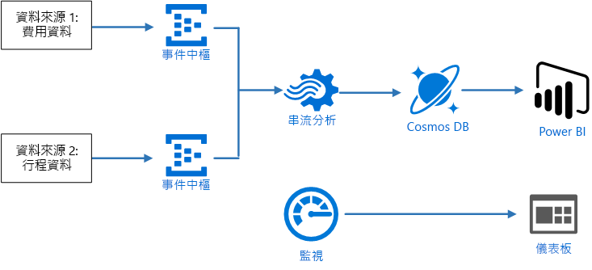
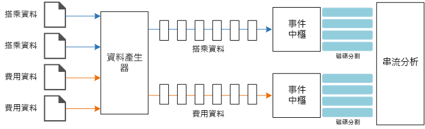
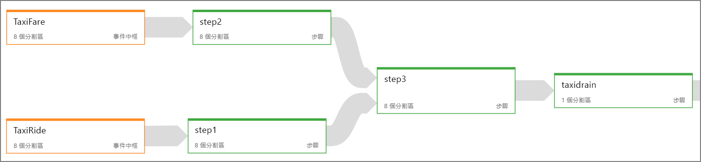
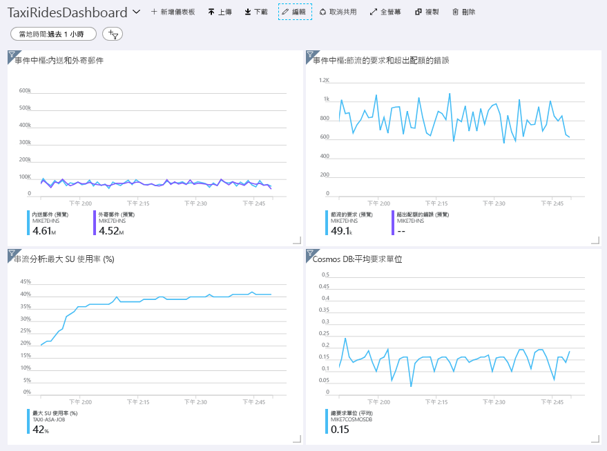
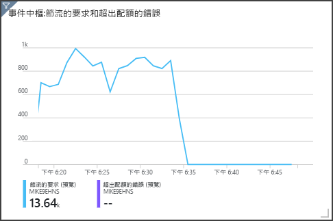

# <a name="stream-processing-with-azure-stream-analytics"></a><span data-ttu-id="e70a8-103">串流處理搭配 Azure 串流分析</span><span class="sxs-lookup"><span data-stu-id="e70a8-103">Stream processing with Azure Stream Analytics</span></span>

<span data-ttu-id="e70a8-104">此參考架構會示範端對端串流處理管線。</span><span class="sxs-lookup"><span data-stu-id="e70a8-104">This reference architecture shows an end-to-end stream processing pipeline.</span></span> <span data-ttu-id="e70a8-105">管線會從兩個來源擷取資料、在兩個串流中將記錄相互關聯，並計算時間範圍內的移動平均。</span><span class="sxs-lookup"><span data-stu-id="e70a8-105">The pipeline ingests data from two sources, correlates records in the two streams, and calculates a rolling average across a time window.</span></span> <span data-ttu-id="e70a8-106">結果會儲存以供進一步分析。</span><span class="sxs-lookup"><span data-stu-id="e70a8-106">The results are stored for further analysis.</span></span> [<span data-ttu-id="e70a8-107">**部署這個解決方案**。</span><span class="sxs-lookup"><span data-stu-id="e70a8-107">**Deploy this solution**.</span></span>](#deploy-the-solution)



<span data-ttu-id="e70a8-108">**案例**：計程車公司會收集有關每趟計程車車程的資料。</span><span class="sxs-lookup"><span data-stu-id="e70a8-108">**Scenario**: A taxi company collects data about each taxi trip.</span></span> <span data-ttu-id="e70a8-109">在此案例中，我們假設有兩個不同的裝置會傳送資料。</span><span class="sxs-lookup"><span data-stu-id="e70a8-109">For this scenario, we assume there are two separate devices sending data.</span></span> <span data-ttu-id="e70a8-110">計程車的其中一個計量會傳送關於每趟車程的資訊，如車程時間、距離和上下車地點等。</span><span class="sxs-lookup"><span data-stu-id="e70a8-110">The taxi has a meter that sends information about each ride &mdash; the duration, distance, and pickup and dropoff locations.</span></span> <span data-ttu-id="e70a8-111">另一個裝置會接收客戶付款，並傳送費用相關資料。</span><span class="sxs-lookup"><span data-stu-id="e70a8-111">A separate device accepts payments from customers and sends data about fares.</span></span> <span data-ttu-id="e70a8-112">計程車公司想要即時計算出平均每英里的小費，以便找出趨勢。</span><span class="sxs-lookup"><span data-stu-id="e70a8-112">The taxi company wants to calculate the average tip per mile driven, in real time, in order to spot trends.</span></span>

## <a name="architecture"></a><span data-ttu-id="e70a8-113">架構</span><span class="sxs-lookup"><span data-stu-id="e70a8-113">Architecture</span></span>

<span data-ttu-id="e70a8-114">此架構由下列元件組成。</span><span class="sxs-lookup"><span data-stu-id="e70a8-114">The architecture consists of the following components.</span></span>

<span data-ttu-id="e70a8-115">**資料來源**。</span><span class="sxs-lookup"><span data-stu-id="e70a8-115">**Data sources**.</span></span> <span data-ttu-id="e70a8-116">在此架構中，有兩個資料來源會即時產生資料流。</span><span class="sxs-lookup"><span data-stu-id="e70a8-116">In this architecture, there are two data sources that generate data streams in real time.</span></span> <span data-ttu-id="e70a8-117">第一個資料流包含車程資訊，而第二個包含費用資訊。</span><span class="sxs-lookup"><span data-stu-id="e70a8-117">The first stream contains ride information, and the second contains fare information.</span></span> <span data-ttu-id="e70a8-118">參考架構包含模擬的資料產生器，可讀取一組靜態檔案，並將資料推送到事件中樞。</span><span class="sxs-lookup"><span data-stu-id="e70a8-118">The reference architecture includes a simulated data generator that reads from a set of static files and pushes the data to Event Hubs.</span></span> <span data-ttu-id="e70a8-119">在實際的應用程式中，資料來源會是安裝在計程車上的裝置。</span><span class="sxs-lookup"><span data-stu-id="e70a8-119">In a real application, the data sources would be devices installed in the taxi cabs.</span></span>

<span data-ttu-id="e70a8-120">**Azure 事件中樞**.</span><span class="sxs-lookup"><span data-stu-id="e70a8-120">**Azure Event Hubs**.</span></span> <span data-ttu-id="e70a8-121">[事件中樞](/azure/event-hubs/)是事件擷取服務。</span><span class="sxs-lookup"><span data-stu-id="e70a8-121">[Event Hubs](/azure/event-hubs/) is an event ingestion service.</span></span> <span data-ttu-id="e70a8-122">此架構使用兩個事件中樞執行個體，分別用於兩個資料來源。</span><span class="sxs-lookup"><span data-stu-id="e70a8-122">This architecture uses two event hub instances, one for each data source.</span></span> <span data-ttu-id="e70a8-123">每個資料來源會將資料流傳送至相關聯的事件中樞。</span><span class="sxs-lookup"><span data-stu-id="e70a8-123">Each data source sends a stream of data to the associated event hub.</span></span>

<span data-ttu-id="e70a8-124">**Azure 串流分析**。</span><span class="sxs-lookup"><span data-stu-id="e70a8-124">**Azure Stream Analytics**.</span></span> <span data-ttu-id="e70a8-125">[串流分析](/azure/stream-analytics/)是事件處理引擎。</span><span class="sxs-lookup"><span data-stu-id="e70a8-125">[Stream Analytics](/azure/stream-analytics/) is an event-processing engine.</span></span> <span data-ttu-id="e70a8-126">串流分析作業會從兩個事件中樞讀取資料流，並執行串流處理。</span><span class="sxs-lookup"><span data-stu-id="e70a8-126">A Stream Analytics job reads the data streams from the two event hubs and performs stream processing.</span></span>

<span data-ttu-id="e70a8-127">**Cosmos DB**。</span><span class="sxs-lookup"><span data-stu-id="e70a8-127">**Cosmos DB**.</span></span> <span data-ttu-id="e70a8-128">串流分析作業的輸出是一系列記錄，其會以 JSON 文件寫入 Cosmos DB 文件資料庫。</span><span class="sxs-lookup"><span data-stu-id="e70a8-128">The output from the Stream Analytics job is a series of records, which are written as JSON documents to a Cosmos DB document database.</span></span>

<span data-ttu-id="e70a8-129">**Microsoft Power BI**。</span><span class="sxs-lookup"><span data-stu-id="e70a8-129">**Microsoft Power BI**.</span></span> <span data-ttu-id="e70a8-130">Power BI 是一套用來分析資料以產生商業見解的商務分析工具。</span><span class="sxs-lookup"><span data-stu-id="e70a8-130">Power BI is a suite of business analytics tools to analyze data for business insights.</span></span> <span data-ttu-id="e70a8-131">在此架構中，它會從 Cosmos DB 載入資料。</span><span class="sxs-lookup"><span data-stu-id="e70a8-131">In this architecture, it loads the data from Cosmos DB.</span></span> <span data-ttu-id="e70a8-132">這可讓使用者分析收集到的一組完整歷程記錄資料。</span><span class="sxs-lookup"><span data-stu-id="e70a8-132">This allows users to analyze the complete set of historical data that's been collected.</span></span> <span data-ttu-id="e70a8-133">您也可以直接從串流分析將結果串流到 Power BI，以取得資料的即時檢視。</span><span class="sxs-lookup"><span data-stu-id="e70a8-133">You could also stream the results directly from Stream Analytics to Power BI for a real-time view of the data.</span></span> <span data-ttu-id="e70a8-134">如需詳細資訊，請參閱 [Power BI 中的即時串流](/power-bi/service-real-time-streaming)。</span><span class="sxs-lookup"><span data-stu-id="e70a8-134">For more information, see [Real-time streaming in Power BI](/power-bi/service-real-time-streaming).</span></span>

<span data-ttu-id="e70a8-135">**Azure 監視器**。</span><span class="sxs-lookup"><span data-stu-id="e70a8-135">**Azure Monitor**.</span></span> <span data-ttu-id="e70a8-136">[Azure 監視器](/azure/monitoring-and-diagnostics/)會收集解決方案中部署的 Azure 服務相關效能計量。</span><span class="sxs-lookup"><span data-stu-id="e70a8-136">[Azure Monitor](/azure/monitoring-and-diagnostics/) collects performance metrics about the Azure services deployed in the solution.</span></span> <span data-ttu-id="e70a8-137">透過儀表板中的資料視覺化，您可以取得解決方案健康情況的深入解析。</span><span class="sxs-lookup"><span data-stu-id="e70a8-137">By visualizing these in a dashboard, you can get insights into the health of the solution.</span></span> 

## <a name="data-ingestion"></a><span data-ttu-id="e70a8-138">資料擷取</span><span class="sxs-lookup"><span data-stu-id="e70a8-138">Data ingestion</span></span>

<span data-ttu-id="e70a8-139">若要模擬資料來源，此參考架構會使用[紐約市計程車資料](https://uofi.app.box.com/v/NYCtaxidata/folder/2332218797)資料集<sup>[[1]](#note1)</sup>。</span><span class="sxs-lookup"><span data-stu-id="e70a8-139">To simulate a data source, this reference architecture uses the [New York City Taxi Data](https://uofi.app.box.com/v/NYCtaxidata/folder/2332218797) dataset<sup>[[1]](#note1)</sup>.</span></span> <span data-ttu-id="e70a8-140">此資料集包含紐約市在 4 年期間的計程車路程資料 (2010 &ndash; 2013)。</span><span class="sxs-lookup"><span data-stu-id="e70a8-140">This dataset contains data about taxi trips in New York City over a 4-year period (2010 &ndash; 2013).</span></span> <span data-ttu-id="e70a8-141">它包含兩種類型的記錄：車程資料和費用資料。</span><span class="sxs-lookup"><span data-stu-id="e70a8-141">It contains two types of record: Ride data and fare data.</span></span> <span data-ttu-id="e70a8-142">車程資料包括路程持續時間、路程距離和上下車地點。</span><span class="sxs-lookup"><span data-stu-id="e70a8-142">Ride data includes trip duration, trip distance, and pickup and dropoff location.</span></span> <span data-ttu-id="e70a8-143">費用資料包括費用、稅金和小費金額。</span><span class="sxs-lookup"><span data-stu-id="e70a8-143">Fare data includes fare, tax, and tip amounts.</span></span> <span data-ttu-id="e70a8-144">在這兩種記錄類型中共同欄位包含計程車牌照號碼、計程車執照和廠商識別碼。</span><span class="sxs-lookup"><span data-stu-id="e70a8-144">Common fields in both record types include medallion number, hack license, and vendor ID.</span></span> <span data-ttu-id="e70a8-145">這三個欄位可唯一識別一輛計程車加上司機。</span><span class="sxs-lookup"><span data-stu-id="e70a8-145">Together these three fields uniquely identify a taxi plus a driver.</span></span> <span data-ttu-id="e70a8-146">資料會以 CSV 格式儲存。</span><span class="sxs-lookup"><span data-stu-id="e70a8-146">The data is stored in CSV format.</span></span> 

<span data-ttu-id="e70a8-147">資料產生器為 .NET Core 應用程式，可讀取記錄並將其傳送到 Azure 事件中樞。</span><span class="sxs-lookup"><span data-stu-id="e70a8-147">The data generator is a .NET Core application that reads the records and sends them to Azure Event Hubs.</span></span> <span data-ttu-id="e70a8-148">產生器會以 JSON 格式傳送車程資料，以 CSV 格式傳送費用資料。</span><span class="sxs-lookup"><span data-stu-id="e70a8-148">The generator sends ride data in JSON format and fare data in CSV format.</span></span> 

<span data-ttu-id="e70a8-149">事件中樞使用[分割區](/azure/event-hubs/event-hubs-features#partitions)來分割資料。</span><span class="sxs-lookup"><span data-stu-id="e70a8-149">Event Hubs uses [partitions](/azure/event-hubs/event-hubs-features#partitions) to segment the data.</span></span> <span data-ttu-id="e70a8-150">資料分割可讓取用者平行讀取每個分割。</span><span class="sxs-lookup"><span data-stu-id="e70a8-150">Partitions allow a consumer to read each partition in parallel.</span></span> <span data-ttu-id="e70a8-151">將資料傳送至事件中樞時，您可以明確指定分割區索引鍵。</span><span class="sxs-lookup"><span data-stu-id="e70a8-151">When you send data to Event Hubs, you can specify the partition key explicitly.</span></span> <span data-ttu-id="e70a8-152">否則，記錄會以循環配置資源的方式指派給分割區。</span><span class="sxs-lookup"><span data-stu-id="e70a8-152">Otherwise, records are assigned to partitions in round-robin fashion.</span></span> 

<span data-ttu-id="e70a8-153">在此特定案例中，車程資料和費用資料最後應具有指定計程車的同一分割區識別碼。</span><span class="sxs-lookup"><span data-stu-id="e70a8-153">In this particular scenario, ride data and fare data should end up with the same partition ID for a given taxi cab.</span></span> <span data-ttu-id="e70a8-154">這可讓串流分析在將兩個資料流相互關聯時套用平行處理原則。</span><span class="sxs-lookup"><span data-stu-id="e70a8-154">This enables Stream Analytics to apply a degree of parallelism when it correlates the two streams.</span></span> <span data-ttu-id="e70a8-155">車程資料分割區 *n* 中的記錄會比對到費用資料分割區 *n* 中的記錄。</span><span class="sxs-lookup"><span data-stu-id="e70a8-155">A record in partition *n* of the ride data will match a record in partition *n* of the fare data.</span></span>



<span data-ttu-id="e70a8-156">在資料產生器中，這兩種記錄類型的共同資料模型具有 `PartitionKey` 屬性，其為 `Medallion`、`HackLicense` 和 `VendorId` 的串連。</span><span class="sxs-lookup"><span data-stu-id="e70a8-156">In the data generator, the common data model for both record types has a `PartitionKey` property which is the concatenation of `Medallion`, `HackLicense`, and `VendorId`.</span></span>

```csharp
public abstract class TaxiData
{
    public TaxiData()
    {
    }

    [JsonProperty]
    public long Medallion { get; set; }

    [JsonProperty]
    public long HackLicense { get; set; }

    [JsonProperty]
    public string VendorId { get; set; }

    [JsonProperty]
    public DateTimeOffset PickupTime { get; set; }

    [JsonIgnore]
    public string PartitionKey
    {
        get => $"{Medallion}_{HackLicense}_{VendorId}";
    }
```

<span data-ttu-id="e70a8-157">在傳送至事件中樞時，這個屬性用來提供明確的分割區索引鍵：</span><span class="sxs-lookup"><span data-stu-id="e70a8-157">This property is used to provide an explicit partition key when sending to Event Hubs:</span></span>

```csharp
using (var client = pool.GetObject())
{
    return client.Value.SendAsync(new EventData(Encoding.UTF8.GetBytes(
        t.GetData(dataFormat))), t.PartitionKey);
}
```

## <a name="stream-processing"></a><span data-ttu-id="e70a8-158">串流處理</span><span class="sxs-lookup"><span data-stu-id="e70a8-158">Stream processing</span></span>

<span data-ttu-id="e70a8-159">串流處理作業使用 SQL 查詢搭配數個不同步驟來定義。</span><span class="sxs-lookup"><span data-stu-id="e70a8-159">The stream processing job is defined using a SQL query with several distinct steps.</span></span> <span data-ttu-id="e70a8-160">前兩個步驟僅從兩個輸入資料流中選取記錄。</span><span class="sxs-lookup"><span data-stu-id="e70a8-160">The first two steps simply select records from the two input streams.</span></span>

```sql
WITH
Step1 AS (
    SELECT PartitionId,
           TRY_CAST(Medallion AS nvarchar(max)) AS Medallion,
           TRY_CAST(HackLicense AS nvarchar(max)) AS HackLicense,
           VendorId,
           TRY_CAST(PickupTime AS datetime) AS PickupTime,
           TripDistanceInMiles
    FROM [TaxiRide] PARTITION BY PartitionId
),
Step2 AS (
    SELECT PartitionId,
           medallion AS Medallion,
           hack_license AS HackLicense,
           vendor_id AS VendorId,
           TRY_CAST(pickup_datetime AS datetime) AS PickupTime,
           tip_amount AS TipAmount
    FROM [TaxiFare] PARTITION BY PartitionId
),
```

<span data-ttu-id="e70a8-161">下一個步驟會將兩個輸入資料流聯結，從每個資料流中選取相符的記錄。</span><span class="sxs-lookup"><span data-stu-id="e70a8-161">The next step joins the two input streams to select matching records from each stream.</span></span>

```sql
Step3 AS (
  SELECT
         tr.Medallion,
         tr.HackLicense,
         tr.VendorId,
         tr.PickupTime,
         tr.TripDistanceInMiles,
         tf.TipAmount
    FROM [Step1] tr
    PARTITION BY PartitionId
    JOIN [Step2] tf PARTITION BY PartitionId
      ON tr.Medallion = tf.Medallion
     AND tr.HackLicense = tf.HackLicense
     AND tr.VendorId = tf.VendorId
     AND tr.PickupTime = tf.PickupTime
     AND tr.PartitionId = tf.PartitionId
     AND DATEDIFF(minute, tr, tf) BETWEEN 0 AND 15
)
```

<span data-ttu-id="e70a8-162">此查詢會聯結一組欄位上的記錄，可唯一識別相符記錄 (Medallion、HackLicense、VendorId 和 PickupTime)。</span><span class="sxs-lookup"><span data-stu-id="e70a8-162">This query joins records on a set of fields that uniquely identify matching records (Medallion, HackLicense, VendorId, and PickupTime).</span></span> <span data-ttu-id="e70a8-163">`JOIN` 陳述式也包含分割區識別碼。</span><span class="sxs-lookup"><span data-stu-id="e70a8-163">The `JOIN` statement also includes the partition ID.</span></span> <span data-ttu-id="e70a8-164">如上所述，此案例中這是利用了相符的記錄具有相同的分割區識別碼。</span><span class="sxs-lookup"><span data-stu-id="e70a8-164">As mentioned, this takes advantage of the fact that matching records always have the same partition ID in this scenario.</span></span>

<span data-ttu-id="e70a8-165">在串流分析中，聯結是*時態性*，表示記錄已加入特定的時間範圍內。</span><span class="sxs-lookup"><span data-stu-id="e70a8-165">In Stream Analytics, joins are *temporal*, meaning records are joined within a particular window of time.</span></span> <span data-ttu-id="e70a8-166">否則，作業可能需要無限期等待相符項目。</span><span class="sxs-lookup"><span data-stu-id="e70a8-166">Otherwise, the job might need to wait indefinitely for a match.</span></span> <span data-ttu-id="e70a8-167">[DATEDIFF](https://msdn.microsoft.com/azure/stream-analytics/reference/join-azure-stream-analytics) 函式可指定針對符合項目，兩筆相符記錄的時間可以間隔多久。</span><span class="sxs-lookup"><span data-stu-id="e70a8-167">The [DATEDIFF](https://msdn.microsoft.com/azure/stream-analytics/reference/join-azure-stream-analytics) function specifies how far two matching records can be separated in time for a match.</span></span> 

<span data-ttu-id="e70a8-168">作業的最後一個步驟會計算每英里的平均小費，依 5 分鐘跳動視窗分組。</span><span class="sxs-lookup"><span data-stu-id="e70a8-168">The last step in the job computes the average tip per mile, grouped by a hopping window of 5 minutes.</span></span>

```sql
SELECT System.Timestamp AS WindowTime,
       SUM(tr.TipAmount) / SUM(tr.TripDistanceInMiles) AS AverageTipPerMile
  INTO [TaxiDrain]
  FROM [Step3] tr
  GROUP BY HoppingWindow(Duration(minute, 5), Hop(minute, 1))
```

<span data-ttu-id="e70a8-169">串流分析提供多種[時間範圍函式](/azure/stream-analytics/stream-analytics-window-functions)。</span><span class="sxs-lookup"><span data-stu-id="e70a8-169">Stream Analytics provides several [windowing functions](/azure/stream-analytics/stream-analytics-window-functions).</span></span> <span data-ttu-id="e70a8-170">跳動視窗會以一段固定時間向前移動，在此案例中為每個躍點 1 分鐘。</span><span class="sxs-lookup"><span data-stu-id="e70a8-170">A hopping window moves forward in time by a fixed period, in this case 1 minute per hop.</span></span> <span data-ttu-id="e70a8-171">目的是要計算過去 5 分鐘的移動平均。</span><span class="sxs-lookup"><span data-stu-id="e70a8-171">The result is to calculate a moving average over the past 5 minutes.</span></span>

<span data-ttu-id="e70a8-172">在此處所示的架構中，只有串流分析作業的結果會儲存到 Cosmos DB。</span><span class="sxs-lookup"><span data-stu-id="e70a8-172">In the architecture shown here, only the results of the Stream Analytics job are saved to Cosmos DB.</span></span> <span data-ttu-id="e70a8-173">在巨量資料案例中，也請考慮使用[事件中樞擷取](/azure/event-hubs/event-hubs-capture-overview)，將原始事件資料儲存至 Azure Blob 儲存體。</span><span class="sxs-lookup"><span data-stu-id="e70a8-173">For a big data scenario, consider also using [Event Hubs Capture](/azure/event-hubs/event-hubs-capture-overview) to save the raw event data into Azure Blob storage.</span></span> <span data-ttu-id="e70a8-174">保留未經處理資料可讓您在稍後對歷程記錄資料執行批次查詢，以便從資料中找出新的深入解析。</span><span class="sxs-lookup"><span data-stu-id="e70a8-174">Keeping the raw data will allow you to run batch queries over your historical data at later time, in order to derive new insights from the data.</span></span>

## <a name="scalability-considerations"></a><span data-ttu-id="e70a8-175">延展性考量</span><span class="sxs-lookup"><span data-stu-id="e70a8-175">Scalability considerations</span></span>

### <a name="event-hubs"></a><span data-ttu-id="e70a8-176">事件中樞</span><span class="sxs-lookup"><span data-stu-id="e70a8-176">Event Hubs</span></span>

<span data-ttu-id="e70a8-177">事件中樞的輸送量容量會以[輸送量單位](/azure/event-hubs/event-hubs-features#throughput-units)來測量。</span><span class="sxs-lookup"><span data-stu-id="e70a8-177">The throughput capacity of Event Hubs is measured in [throughput units](/azure/event-hubs/event-hubs-features#throughput-units).</span></span> <span data-ttu-id="e70a8-178">您可以啟用[自動擴充](/azure/event-hubs/event-hubs-auto-inflate)以自動調整事件中樞，這會根據流量 (上限為設定的最大值) 自動調整輸送量單位。</span><span class="sxs-lookup"><span data-stu-id="e70a8-178">You can autoscale an event hub by enabling [auto-inflate](/azure/event-hubs/event-hubs-auto-inflate), which automatically scales the throughput units based on traffic, up to a configured maximum.</span></span> 

### <a name="stream-analytics"></a><span data-ttu-id="e70a8-179">串流分析</span><span class="sxs-lookup"><span data-stu-id="e70a8-179">Stream Analytics</span></span>

<span data-ttu-id="e70a8-180">對於串流分析，配置給作業的計算資源會以串流單位測量。</span><span class="sxs-lookup"><span data-stu-id="e70a8-180">For Stream Analytics, the computing resources allocated to a job are measured in Streaming Units.</span></span> <span data-ttu-id="e70a8-181">如果作業可以平行處理，則串流分析作業可進行最佳調整。</span><span class="sxs-lookup"><span data-stu-id="e70a8-181">Stream Analytics jobs scale best if the job can be parallelized.</span></span> <span data-ttu-id="e70a8-182">如此一來，串流分析可以將作業分散至多個計算節點。</span><span class="sxs-lookup"><span data-stu-id="e70a8-182">That way, Stream Analytics can distribute the job across multiple compute nodes.</span></span>

<span data-ttu-id="e70a8-183">對於事件中樞輸入，使用 `PARTITION BY` 關鍵字來分割串流分析作業。</span><span class="sxs-lookup"><span data-stu-id="e70a8-183">For Event Hubs input, use the `PARTITION BY` keyword to partition the Stream Analytics job.</span></span> <span data-ttu-id="e70a8-184">資料會根據事件中樞分割區分割為子集。</span><span class="sxs-lookup"><span data-stu-id="e70a8-184">The data will be divided into subsets based on the Event Hubs partitions.</span></span> 

<span data-ttu-id="e70a8-185">時間範圍函式和時態性聯結需要額外的 SU。</span><span class="sxs-lookup"><span data-stu-id="e70a8-185">Windowing functions and temporal joins require additional SU.</span></span> <span data-ttu-id="e70a8-186">可能的話，請使用 `PARTITION BY` 以便每個分割區可個別處理。</span><span class="sxs-lookup"><span data-stu-id="e70a8-186">When possible, use `PARTITION BY` so that each partition is processed separately.</span></span> <span data-ttu-id="e70a8-187">如需詳細資訊，請參閱[了解和調整串流單位](/azure/stream-analytics/stream-analytics-streaming-unit-consumption#windowed-aggregates)。</span><span class="sxs-lookup"><span data-stu-id="e70a8-187">For more information, see [Understand and adjust Streaming Units](/azure/stream-analytics/stream-analytics-streaming-unit-consumption#windowed-aggregates).</span></span>

<span data-ttu-id="e70a8-188">如果無法平行處理整個串流分析作業，請嘗試將作業分成多個步驟，從一或多個平行步驟開始。</span><span class="sxs-lookup"><span data-stu-id="e70a8-188">If it's not possible to parallelize the entire Stream Analytics job, try to break the job into multiple steps, starting with one or more parallel steps.</span></span> <span data-ttu-id="e70a8-189">如此一來，第一個步驟即可平行執行。</span><span class="sxs-lookup"><span data-stu-id="e70a8-189">That way, the first steps can run in parallel.</span></span> <span data-ttu-id="e70a8-190">例如，在此參考架構中：</span><span class="sxs-lookup"><span data-stu-id="e70a8-190">For example, in this reference architecture:</span></span>

- <span data-ttu-id="e70a8-191">步驟 1 和 2 是簡單的 `SELECT` 陳述式，可選取單一分割區內的記錄。</span><span class="sxs-lookup"><span data-stu-id="e70a8-191">Steps 1 and 2 are simple `SELECT` statements that select records within a single partition.</span></span> 
- <span data-ttu-id="e70a8-192">步驟 3 會跨兩個輸入資料流執行資料分割的聯結。</span><span class="sxs-lookup"><span data-stu-id="e70a8-192">Step 3 performs a partitioned join across two input streams.</span></span> <span data-ttu-id="e70a8-193">此步驟是由於相符記錄共用相同的分割區索引鍵，因此每個輸入資料流一定會有相同的分割區識別碼。</span><span class="sxs-lookup"><span data-stu-id="e70a8-193">This step takes advantage of the fact that matching records share the same partition key, and so are guaranteed to have the same partition ID in each input stream.</span></span>
- <span data-ttu-id="e70a8-194">步驟 4 會彙總所有資料分割。</span><span class="sxs-lookup"><span data-stu-id="e70a8-194">Step 4 aggregates across all of the partitions.</span></span> <span data-ttu-id="e70a8-195">此步驟無法平行處理。</span><span class="sxs-lookup"><span data-stu-id="e70a8-195">This step cannot be parallelized.</span></span>

<span data-ttu-id="e70a8-196">使用串流分析[作業圖表](/azure/stream-analytics/stream-analytics-job-diagram-with-metrics)，查看有多少分割區指派給作業中的每個步驟。</span><span class="sxs-lookup"><span data-stu-id="e70a8-196">Use the Stream Analytics [job diagram](/azure/stream-analytics/stream-analytics-job-diagram-with-metrics) to see how many partitions are assigned to each step in the job.</span></span> <span data-ttu-id="e70a8-197">下圖顯示此參考架構的作業圖表：</span><span class="sxs-lookup"><span data-stu-id="e70a8-197">The following diagram shows the job diagram for this reference architecture:</span></span>



### <a name="cosmos-db"></a><span data-ttu-id="e70a8-198">Cosmos DB</span><span class="sxs-lookup"><span data-stu-id="e70a8-198">Cosmos DB</span></span>

<span data-ttu-id="e70a8-199">Cosmos DB 的輸送量容量會以[要求單位](/azure/cosmos-db/request-units) (RU) 來測量。</span><span class="sxs-lookup"><span data-stu-id="e70a8-199">Throughput capacity for Cosmos DB is measured in [Request Units](/azure/cosmos-db/request-units) (RU).</span></span> <span data-ttu-id="e70a8-200">若要將 Cosmos DB 容器調整超過 10,000 RU，建立容器時您必須指定[分割區索引鍵](/azure/cosmos-db/partition-data)，並在每份文件中包含分割區索引鍵。</span><span class="sxs-lookup"><span data-stu-id="e70a8-200">In order to scale a Cosmos DB container past 10,000 RU, you must specify a [partition key](/azure/cosmos-db/partition-data) when you create the container, and include the partition key in every document.</span></span> 

<span data-ttu-id="e70a8-201">在此參考架構中，新文件每分鐘只會建立一次 (跳動視窗間隔)，因此輸送量需求相當低。</span><span class="sxs-lookup"><span data-stu-id="e70a8-201">In this reference architecture, new documents are created only once per minute (the hopping window interval), so the throughput requirements are quite low.</span></span> <span data-ttu-id="e70a8-202">基於這個理由，此案例不需要指派分割區索引鍵。</span><span class="sxs-lookup"><span data-stu-id="e70a8-202">For that reason, there's no need to assign a partition key in this scenario.</span></span>

## <a name="monitoring-considerations"></a><span data-ttu-id="e70a8-203">監視功能考量</span><span class="sxs-lookup"><span data-stu-id="e70a8-203">Monitoring considerations</span></span>

<span data-ttu-id="e70a8-204">使用任何串流處理解決方案，請務必監視系統效能與健康情況。</span><span class="sxs-lookup"><span data-stu-id="e70a8-204">With any stream processing solution, it's important to monitor the performance and health of the system.</span></span> <span data-ttu-id="e70a8-205">[Azure 監視器](/azure/monitoring-and-diagnostics/)會為架構中使用的 Azure 服務收集計量和診斷記錄。</span><span class="sxs-lookup"><span data-stu-id="e70a8-205">[Azure Monitor](/azure/monitoring-and-diagnostics/) collects metrics and diagnostics logs for the Azure services used in the architecture.</span></span> <span data-ttu-id="e70a8-206">Azure 監視器內建於 Azure 平台，且不需要您應用程式中任何額外的程式碼。</span><span class="sxs-lookup"><span data-stu-id="e70a8-206">Azure Monitor is built into the Azure platform and does not require any additional code in your application.</span></span>

<span data-ttu-id="e70a8-207">任何下列警告信號表示您應相應放大相關的 Azure 資源：</span><span class="sxs-lookup"><span data-stu-id="e70a8-207">Any of the following warning signals indicate that you should scale out the relevant Azure resource:</span></span>

- <span data-ttu-id="e70a8-208">事件中樞會對要求進行節流，否則會接近每日的訊息配額。</span><span class="sxs-lookup"><span data-stu-id="e70a8-208">Event Hubs throttles requests or is close to the daily message quota.</span></span>
- <span data-ttu-id="e70a8-209">串流分析作業持續使用超過 80% 的配置串流單位 (SU)。</span><span class="sxs-lookup"><span data-stu-id="e70a8-209">The Stream Analytics job consistently uses more than 80% of allocated Streaming Units (SU).</span></span>
- <span data-ttu-id="e70a8-210">Cosmos DB 會開始對要求進行節流。</span><span class="sxs-lookup"><span data-stu-id="e70a8-210">Cosmos DB begins to throttle requests.</span></span>

<span data-ttu-id="e70a8-211">參考架構包含部署至 Azure 入口網站的自訂儀表板。</span><span class="sxs-lookup"><span data-stu-id="e70a8-211">The reference architecture includes a custom dashboard, which is deployed to the Azure portal.</span></span> <span data-ttu-id="e70a8-212">部署架構之後，您可以開啟 [Azure 入口網站](https://portal.azure.com)並從儀表板清單選取 `TaxiRidesDashboard` 來檢視儀表板。</span><span class="sxs-lookup"><span data-stu-id="e70a8-212">After you deploy the architecture, you can view the dashboard by opening the [Azure Portal](https://portal.azure.com) and selecting `TaxiRidesDashboard` from list of dashboards.</span></span> <span data-ttu-id="e70a8-213">如需在 Azure 入口網站建立及部署自訂儀表板的詳細資訊，請參閱[以程式設計方式建立 Azure 儀表板](/azure/azure-portal/azure-portal-dashboards-create-programmatically)。</span><span class="sxs-lookup"><span data-stu-id="e70a8-213">For more information about creating and deploying custom dashboards in the Azure portal, see [Programmatically create Azure Dashboards](/azure/azure-portal/azure-portal-dashboards-create-programmatically).</span></span>

<span data-ttu-id="e70a8-214">串流分析作業執行大約一小時後，下圖會顯示儀表板。</span><span class="sxs-lookup"><span data-stu-id="e70a8-214">The following image shows the dashboard after the Stream Analytics job ran for about an hour.</span></span>



<span data-ttu-id="e70a8-215">左下方的面板顯示出串流分析作業的 SU 耗用量在前 15 分鐘攀升，然後再下降。</span><span class="sxs-lookup"><span data-stu-id="e70a8-215">The panel on the lower left shows that the SU consumption for the Stream Analytics job climbs during the first 15 minutes and then levels off.</span></span> <span data-ttu-id="e70a8-216">作業達到穩定狀態時，這是典型的模式。</span><span class="sxs-lookup"><span data-stu-id="e70a8-216">This is a typical pattern as the job reaches a steady state.</span></span> 

<span data-ttu-id="e70a8-217">請注意，事件中樞正在對要求進行節流，如右上角面板所示。</span><span class="sxs-lookup"><span data-stu-id="e70a8-217">Notice that Event Hubs is throttling requests, shown in the upper right panel.</span></span> <span data-ttu-id="e70a8-218">偶爾節流的要求不是問題，因為收到節流錯誤時，事件中樞用戶端 SDK 會自動重試。</span><span class="sxs-lookup"><span data-stu-id="e70a8-218">An occasional throttled request is not a problem, because the Event Hubs client SDK automatically retries when it receives a throttling error.</span></span> <span data-ttu-id="e70a8-219">不過，如果您看到一致的節流錯誤，表示事件中樞需要更多輸送量單位。</span><span class="sxs-lookup"><span data-stu-id="e70a8-219">However, if you see consistent throttling errors, it means the event hub needs more throughput units.</span></span> <span data-ttu-id="e70a8-220">以下圖表顯示使用事件中樞自動擴充功能的測試回合，其可自動相應放大所需的輸送量單位。</span><span class="sxs-lookup"><span data-stu-id="e70a8-220">The following graph shows a test run using the Event Hubs auto-inflate feature, which automatically scales out the throughput units as needed.</span></span> 



<span data-ttu-id="e70a8-221">自動擴充已於 06:35 標記啟用。</span><span class="sxs-lookup"><span data-stu-id="e70a8-221">Auto-inflate was enabled at about the 06:35 mark.</span></span> <span data-ttu-id="e70a8-222">事件中樞自動向上調整至 3 個輸送量單位時，您會在節流的要求中看到 p 下降。</span><span class="sxs-lookup"><span data-stu-id="e70a8-222">You can see the p drop in throttled requests, as Event Hubs automatically scaled up to 3 throughput units.</span></span>

<span data-ttu-id="e70a8-223">有趣的是，這樣做的副作用是在串流分析作業中增加 SU 使用率。</span><span class="sxs-lookup"><span data-stu-id="e70a8-223">Interestingly, this had the side effect of increasing the SU utilization in the Stream Analytics job.</span></span> <span data-ttu-id="e70a8-224">藉由節流，事件中樞會以人為方式減少串流分析作業的擷取率。</span><span class="sxs-lookup"><span data-stu-id="e70a8-224">By throttling, Event Hubs was artificially reducing the ingestion rate for the Stream Analytics job.</span></span> <span data-ttu-id="e70a8-225">實際上常見到，解決一個效能瓶頸會帶來另一個瓶頸。</span><span class="sxs-lookup"><span data-stu-id="e70a8-225">It's actually common that resolving one performance bottleneck reveals another.</span></span> <span data-ttu-id="e70a8-226">在此案例中，為串流分析作業配置額外的 SU 解決了問題。</span><span class="sxs-lookup"><span data-stu-id="e70a8-226">In this case, allocating additional SU for the Stream Analytics job resolved the issue.</span></span>

## <a name="deploy-the-solution"></a><span data-ttu-id="e70a8-227">部署解決方案</span><span class="sxs-lookup"><span data-stu-id="e70a8-227">Deploy the solution</span></span>

<span data-ttu-id="e70a8-228">此參考架構的部署可在 [GitHub](https://github.com/mspnp/reference-architectures/tree/master/data) 上取得。</span><span class="sxs-lookup"><span data-stu-id="e70a8-228">A deployment for this reference architecture is available on [GitHub](https://github.com/mspnp/reference-architectures/tree/master/data).</span></span> 

### <a name="prerequisites"></a><span data-ttu-id="e70a8-229">必要條件</span><span class="sxs-lookup"><span data-stu-id="e70a8-229">Prerequisites</span></span>

1. <span data-ttu-id="e70a8-230">複製、派生或下載適用於[參考架構](https://github.com/mspnp/reference-architectures) GitHub 存放庫的 zip 檔案。</span><span class="sxs-lookup"><span data-stu-id="e70a8-230">Clone, fork, or download the zip file for the [reference architectures](https://github.com/mspnp/reference-architectures) GitHub repository.</span></span>

2. <span data-ttu-id="e70a8-231">安裝 [Docker](https://www.docker.com/) 以執行資料產生器。</span><span class="sxs-lookup"><span data-stu-id="e70a8-231">Install [Docker](https://www.docker.com/) to run the data generator.</span></span>

3. <span data-ttu-id="e70a8-232">安裝 [Azure CLI 2.0](/cli/azure/install-azure-cli?view=azure-cli-latest)。</span><span class="sxs-lookup"><span data-stu-id="e70a8-232">Install [Azure CLI 2.0](/cli/azure/install-azure-cli?view=azure-cli-latest).</span></span>

4. <span data-ttu-id="e70a8-233">從命令提示字元、Bash 提示字元或 PowerShell 提示字元中登入 Azure 帳戶，如下所示：</span><span class="sxs-lookup"><span data-stu-id="e70a8-233">From a command prompt, bash prompt, or PowerShell prompt, sign into your Azure account as follows:</span></span>

    ```
    az login
    ```

### <a name="download-the-source-data-files"></a><span data-ttu-id="e70a8-234">下載來源資料檔案</span><span class="sxs-lookup"><span data-stu-id="e70a8-234">Download the source data files</span></span>

1. <span data-ttu-id="e70a8-235">在 GitHub 存放庫中 `data/streaming_asa` 目錄下建立名為 `DataFile` 的目錄。</span><span class="sxs-lookup"><span data-stu-id="e70a8-235">Create a directory named `DataFile` under the `data/streaming_asa` directory in the GitHub repo.</span></span>

2. <span data-ttu-id="e70a8-236">開啟 web 瀏覽器並巡覽至 https://uofi.app.box.com/v/NYCtaxidata/folder/2332219935。</span><span class="sxs-lookup"><span data-stu-id="e70a8-236">Open a web browser and navigate to https://uofi.app.box.com/v/NYCtaxidata/folder/2332219935.</span></span>

3. <span data-ttu-id="e70a8-237">按一下此頁面上的 [下載] 按鈕，下載該年度所有計程車資料的 ZIP 檔案。</span><span class="sxs-lookup"><span data-stu-id="e70a8-237">Click the **Download** button on this page to download a zip file of all the taxi data for that year.</span></span>

4. <span data-ttu-id="e70a8-238">將 ZIP 檔案解壓縮至 `DataFile` 目錄。</span><span class="sxs-lookup"><span data-stu-id="e70a8-238">Extract the zip file to the `DataFile` directory.</span></span>

    > [!NOTE]
    > <span data-ttu-id="e70a8-239">此 ZIP 檔案包含其他 ZIP 檔案。</span><span class="sxs-lookup"><span data-stu-id="e70a8-239">This zip file contains other zip files.</span></span> <span data-ttu-id="e70a8-240">請勿解壓縮子系 ZIP 檔案。</span><span class="sxs-lookup"><span data-stu-id="e70a8-240">Don't extract the child zip files.</span></span>

<span data-ttu-id="e70a8-241">目錄結構看起來應如下所示：</span><span class="sxs-lookup"><span data-stu-id="e70a8-241">The directory structure should look like the following:</span></span>

```
/data
    /streaming_asa
        /DataFile
            /FOIL2013
                trip_data_1.zip
                trip_data_2.zip
                trip_data_3.zip
                ...
```

### <a name="deploy-the-azure-resources"></a><span data-ttu-id="e70a8-242">部署 Azure 資源</span><span class="sxs-lookup"><span data-stu-id="e70a8-242">Deploy the Azure resources</span></span>

1. <span data-ttu-id="e70a8-243">從殼層或 Windows 命令提示字元執行下列命令，並遵循登入提示：</span><span class="sxs-lookup"><span data-stu-id="e70a8-243">From a shell or Windows Command Prompt, run the following command and follow the sign-in prompt:</span></span>

    ```bash
    az login
    ```

2. <span data-ttu-id="e70a8-244">巡覽至 GitHub 存放庫的 `data/streaming_asa` 資料夾</span><span class="sxs-lookup"><span data-stu-id="e70a8-244">Navigate to the folder `data/streaming_asa` in the GitHub repository</span></span>

    ```bash
    cd data/streaming_asa
    ```

2. <span data-ttu-id="e70a8-245">執行下列命令以部署 Azure 資源：</span><span class="sxs-lookup"><span data-stu-id="e70a8-245">Run the following commands to deploy the Azure resources:</span></span>

    ```bash
    export resourceGroup='[Resource group name]'
    export resourceLocation='[Location]'
    export cosmosDatabaseAccount='[Cosmos DB account name]'
    export cosmosDatabase='[Cosmod DB database name]'
    export cosmosDataBaseCollection='[Cosmos DB collection name]'
    export eventHubNamespace='[Event Hubs namespace name]'

    # Create a resource group
    az group create --name $resourceGroup --location $resourceLocation

    # Deploy resources
    az group deployment create --resource-group $resourceGroup \
      --template-file ./azure/deployresources.json --parameters \
      eventHubNamespace=$eventHubNamespace \
      outputCosmosDatabaseAccount=$cosmosDatabaseAccount \
      outputCosmosDatabase=$cosmosDatabase \
      outputCosmosDatabaseCollection=$cosmosDataBaseCollection

    # Create a database 
    az cosmosdb database create --name $cosmosDatabaseAccount \
        --db-name $cosmosDatabase --resource-group $resourceGroup

    # Create a collection
    az cosmosdb collection create --collection-name $cosmosDataBaseCollection \
        --name $cosmosDatabaseAccount --db-name $cosmosDatabase \
        --resource-group $resourceGroup
    ```

3. <span data-ttu-id="e70a8-246">在 Azure 入口網站中，巡覽至建立的資源群組。</span><span class="sxs-lookup"><span data-stu-id="e70a8-246">In the Azure portal, navigate to the resource group that was created.</span></span>

4. <span data-ttu-id="e70a8-247">開啟串流分析作業的刀鋒視窗。</span><span class="sxs-lookup"><span data-stu-id="e70a8-247">Open the blade for the Stream Analytics job.</span></span>

5. <span data-ttu-id="e70a8-248">按一下 [啟動] 以啟動作業。</span><span class="sxs-lookup"><span data-stu-id="e70a8-248">Click **Start** to start the job.</span></span> <span data-ttu-id="e70a8-249">選取 [現在] 做為輸出開始時間。</span><span class="sxs-lookup"><span data-stu-id="e70a8-249">Select **Now** as the output start time.</span></span> <span data-ttu-id="e70a8-250">等候作業開始。</span><span class="sxs-lookup"><span data-stu-id="e70a8-250">Wait for the job to start.</span></span>

### <a name="run-the-data-generator"></a><span data-ttu-id="e70a8-251">執行資料產生器</span><span class="sxs-lookup"><span data-stu-id="e70a8-251">Run the data generator</span></span>

1. <span data-ttu-id="e70a8-252">取得事件中樞連接字串。</span><span class="sxs-lookup"><span data-stu-id="e70a8-252">Get the Event Hub connection strings.</span></span> <span data-ttu-id="e70a8-253">您可以從 Azure 入口網站取得，或藉由執行下列 CLI 命令：</span><span class="sxs-lookup"><span data-stu-id="e70a8-253">You can get these from the Azure portal, or by running the following CLI commands:</span></span>

    ```bash
    # RIDE_EVENT_HUB
    az eventhubs eventhub authorization-rule keys list \
        --eventhub-name taxi-ride \
        --name taxi-ride-asa-access-policy \
        --namespace-name $eventHubNamespace \
        --resource-group $resourceGroup \
        --query primaryConnectionString

    # FARE_EVENT_HUB
    az eventhubs eventhub authorization-rule keys list \
        --eventhub-name taxi-fare \
        --name taxi-fare-asa-access-policy \
        --namespace-name $eventHubNamespace \
        --resource-group $resourceGroup \
        --query primaryConnectionString
    ```

2. <span data-ttu-id="e70a8-254">巡覽至 GitHub 存放庫的 `data/streaming_asa/onprem` 目錄</span><span class="sxs-lookup"><span data-stu-id="e70a8-254">Navigate to the directory `data/streaming_asa/onprem` in the GitHub repository</span></span>

3. <span data-ttu-id="e70a8-255">更新 `main.env` 檔案中的值，如下所示：</span><span class="sxs-lookup"><span data-stu-id="e70a8-255">Update the values in the file `main.env` as follows:</span></span>

    ```
    RIDE_EVENT_HUB=[Connection string for taxi-ride event hub]
    FARE_EVENT_HUB=[Connection string for taxi-fare event hub]
    RIDE_DATA_FILE_PATH=/DataFile/FOIL2013
    MINUTES_TO_LEAD=0
    PUSH_RIDE_DATA_FIRST=false
    ```

4. <span data-ttu-id="e70a8-256">執行下列命令以建置 Docker 映像。</span><span class="sxs-lookup"><span data-stu-id="e70a8-256">Run the following command to build the Docker image.</span></span>

    ```bash
    docker build --no-cache -t dataloader .
    ```

5. <span data-ttu-id="e70a8-257">瀏覽回父代目錄 `data/stream_asa`。</span><span class="sxs-lookup"><span data-stu-id="e70a8-257">Navigate back to the parent directory, `data/stream_asa`.</span></span>

    ```bash
    cd ..
    ```

6. <span data-ttu-id="e70a8-258">執行下列命令以執行 Docker 映像。</span><span class="sxs-lookup"><span data-stu-id="e70a8-258">Run the following command to run the Docker image.</span></span>

    ```bash
    docker run -v `pwd`/DataFile:/DataFile --env-file=onprem/main.env dataloader:latest
    ```

<span data-ttu-id="e70a8-259">輸出應該看起來如下所示：</span><span class="sxs-lookup"><span data-stu-id="e70a8-259">The output should look like the following:</span></span>

```
Created 10000 records for TaxiFare
Created 10000 records for TaxiRide
Created 20000 records for TaxiFare
Created 20000 records for TaxiRide
Created 30000 records for TaxiFare
...
```

<span data-ttu-id="e70a8-260">讓程式執行至少 5 分鐘，這是串流分析查詢中所定義的範圍。</span><span class="sxs-lookup"><span data-stu-id="e70a8-260">Let the program run for at least 5 minutes, which is the window defined in the Stream Analytics query.</span></span> <span data-ttu-id="e70a8-261">若要確認串流分析作業正確執行，請開啟 Azure 入口網站並瀏覽至 Cosmos DB 資料庫。</span><span class="sxs-lookup"><span data-stu-id="e70a8-261">To verify the Stream Analytics job is running correctly, open the Azure portal and navigate to the Cosmos DB database.</span></span> <span data-ttu-id="e70a8-262">開啟 [資料總管] 刀鋒視窗，然後檢視文件。</span><span class="sxs-lookup"><span data-stu-id="e70a8-262">Open the **Data Explorer** blade and view the documents.</span></span> 

<span data-ttu-id="e70a8-263">[1] <span id="note1">Donovan, Brian; Work, Dan (2016)：紐約市計程車路程資料 (2010-2013)。</span><span class="sxs-lookup"><span data-stu-id="e70a8-263">[1] <span id="note1">Donovan, Brian; Work, Dan (2016): New York City Taxi Trip Data (2010-2013).</span></span> <span data-ttu-id="e70a8-264">伊利諾大學香檳分校。</span><span class="sxs-lookup"><span data-stu-id="e70a8-264">University of Illinois at Urbana-Champaign.</span></span> <span data-ttu-id="e70a8-265">https://doi.org/10.13012/J8PN93H8</span><span class="sxs-lookup"><span data-stu-id="e70a8-265">https://doi.org/10.13012/J8PN93H8</span></span>
