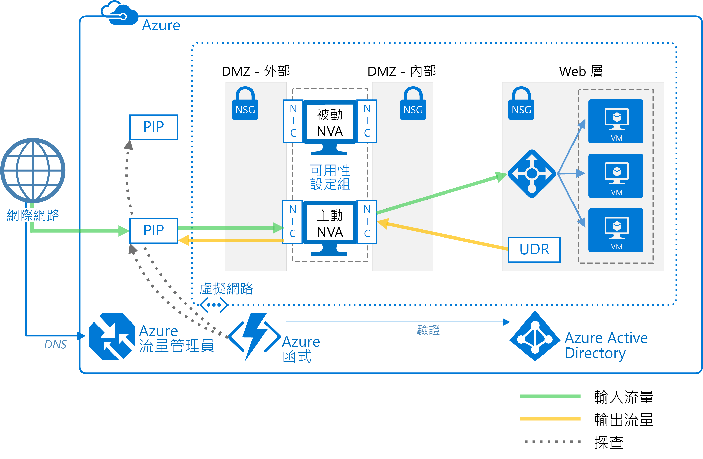

# 部署高可用性的網路虛擬設備Deploy highly available network virtual appliances

本文會示範如何在 Azure 中部署一組網路虛擬設備 (NVA) 以取得高可用性。This article shows how to deploy a set of network virtual appliances (NVAs) for high availability in Azure. NVA 通常是用來控制從周邊網路 (也稱為 DMZ) 流至其他網路或子網路之網路流量的流動。An NVA is typically used to control the flow of network traffic from a perimeter network, also known as a DMZ, to other networks or subnets. 若要了解如何在 Azure 中實作 DMZ，請參閱[Microsoft 雲端服務和網路安全性][cloud-security]。To learn about implementing a DMZ in Azure, see [Microsoft cloud services and network security][cloud-security]. 本文包含「僅輸入」、「僅輸出」，以及「輸入和輸出」的範例架構。The article includes example architectures for ingress only, egress only, and both ingress and egress.

**必要條件：** 本文假設您對 Azure 網路、[Azure 負載平衡器][lb-overview]，以及[使用者定義的路由][udr-overview] (UDR) 已具有基本的了解。**Prerequisites:** This article assumes a basic understanding of Azure networking, [Azure load balancers][lb-overview], and [user-defined routes][udr-overview] (UDRs).

## 架構圖Architecture diagrams

NVA 可以部署到許多不同架構的 DMZ 中。An NVA can be deployed to a DMZ in many different architectures. 例如，下圖說明針對輸入使用[單一 NVA][nva-scenario] 的方式。For example, the following figure illustrates the use of a [single NVA][nva-scenario] for ingress.

![[0]][0]![[0]][0]

在這種架構中，NVA 會檢查所有輸入和輸出的網路流量，並僅傳遞符合網路安全性規則的流量，藉此提供安全的網路界限。In this architecture, the NVA provides a secure network boundary by checking all inbound and outbound network traffic and passing only the traffic that meets network security rules. 不過，由於所有網路流量都必須通過 NVA，這也代表 NVA 會成為網路中的單一失敗點。However, the fact that all network traffic must pass through the NVA means that the NVA is a single point of failure in the network. 如果 NVA 失敗，網路流量就沒有其他路徑，導致所有後端子網路都無法使用。If the NVA fails, there is no other path for network traffic and all the back-end subnets are unavailable.

若要讓 NVA 具高可用性，請在可用性設定組中部署多個 NVA。To make an NVA highly available, deploy more than one NVA into an availability set.

下列架構描述高可用性 NVA 所需的資源和設定：The following architectures describe the resources and configuration necessary for highly available NVAs:

| 解決方案Solution | 優點Benefits | 考量Considerations |
| --- | --- | --- |
| [具第 7 層 NVA 的輸入][ingress-with-layer-7][Ingress with layer 7 NVAs][ingress-with-layer-7] |所有 NVA 節點都是作用中狀態All NVA nodes are active |需要可以終止連線並使用 SNAT 的 NVARequires an NVA that can terminate connections and use SNAT  需要另外一組 NVA 以供來自網際網路與 Azure 流量使用Requires a separate set of NVAs for traffic coming from the Internet and from Azure   僅能用於源自於 Azure 外部的流量Can only be used for traffic originating outside Azure |
| [第 7 層 NVA 的輸出][egress-with-layer-7][Egress with layer 7 NVAs][egress-with-layer-7] |所有 NVA 節點都是作用中狀態All NVA nodes are active | 需要可以終止連線並實作來源網路位址轉譯 (SNAT) 的 NVARequires an NVA that can terminate connections and implements source network address translation (SNAT)
| [具第 7 層 NVA 的輸入-輸出][ingress-egress-with-layer-7][Ingress-Egress with layer 7 NVAs][ingress-egress-with-layer-7] |所有節點都是作用中狀態All nodes are active 能夠處理來自 Azure 中的流量Able to handle traffic originated in Azure |需要可以終止連線並使用 SNAT 的 NVARequires an NVA that can terminate connections and use SNAT 需要另外一組 NVA 以供來自網際網路與 Azure 流量使用Requires a separate set of NVAs for traffic coming from the Internet and from Azure |
| [PIP-UDR 切換][pip-udr-switch][PIP-UDR switch][pip-udr-switch] |針對所有流量使用一組 NVASingle set of NVAs for all traffic 可以處理所有流量 (連接埠規則沒有限制)Can handle all traffic (no limit on port rules) |主動-被動Active-passive 需要容錯移轉程序Requires a failover process |
| [沒有 SNAT 的 PIP-UDRPIP-UDR without SNAT](#pip-udr-nvas-without-snat) | 針對所有流量使用一組 NVASingle set of NVAs for all traffic 可以處理所有流量 (連接埠規則沒有限制)Can handle all traffic (no limit on port rules) 不需要對傳入要求設定 SNATDoes not require configuring SNAT for inbound requests |主動-被動Active-passive 需要容錯移轉程序Requires a failover process 在虛擬網路外部執行探查和容錯移轉邏輯Probing and failover logic run outside the virtual network |

## 具第 7 層 NVA 的輸入Ingress with layer 7 NVAs

下圖所示範的高可用性架構會在面向網際網路的負載平衡器後方實作輸入 DMZ。The following figure shows a high availability architecture that implements an ingress DMZ behind an internet-facing load balancer. 此架構設計成可針對第 7 層流量 (例如 HTTP 或 HTTPS) 提供與 Azure 工作負載的連線：This architecture is designed to provide connectivity to Azure workloads for layer 7 traffic, such as HTTP or HTTPS:

![[1]][1]![[1]][1]

這個架構的優點是所有 NVA 都處於作用中狀態，而且如果其中一個失敗，負載平衡器就會將網路流量導向其他 NVA。The benefit of this architecture is that all NVAs are active, and if one fails the load balancer directs network traffic to the other NVA. 兩個 NVA 都會將流量路由傳送到內部負載平衡器，因此只要有一個 NVA 處於作用中狀態，流量就會繼續流動。Both NVAs route traffic to the internal load balancer so as long as one NVA is active, traffic continues to flow. 需要這些 NVA 以終止適用於 Web 層 VM 的 SSL 流量。The NVAs are required to terminate SSL traffic intended for the web tier VMs. 您無法擴充這些 NVA 以處理內部部署流量，因為內部部署流量需要另一組具有個別網路路由的專用 NVA。These NVAs cannot be extended to handle on-premises traffic because on-premises traffic requires another dedicated set of NVAs with their own network routes.

> [!NOTE]
> 此架構用於 [Azure 與內部部署資料中心之間的 DMZ][dmz-on-prem] 參考架構，以及 [Azure 與網際網路之間的 DMZ][dmz-internet] 參考架構。This architecture is used in the [DMZ between Azure and your on-premises datacenter][dmz-on-prem] reference architecture and the [DMZ between Azure and the Internet][dmz-internet] reference architecture. 這兩個參考架構皆包含您可以使用的部署解決方案。Each of these reference architectures includes a deployment solution that you can use. 如需詳細資訊，請遵循上述連結。Follow the links for more information.

## 具第 7 層 NVA 的輸出Egress with layer 7 NVAs

您可以擴充上述的架構，以針對源自 Azure 工作負載的要求提供輸出 DMZ。The previous architecture can be expanded to provide an egress DMZ for requests originating in the Azure workload. 下方架構旨在能於 DMZ 中為第 7 層的流量 (如 HTTP 或 HTTPS) 提供 NVA 的高可用性：The following architecture is designed to provide high availability of the NVAs in the DMZ for layer 7 traffic, such as HTTP or HTTPS:

![[2]][2]![[2]][2]

在此架構中，源自 Azure 中的所有流量都會路由傳送至內部負載平衡器。In this architecture, all traffic originating in Azure is routed to an internal load balancer. 負載平衡器會在一組 NVA 之間散發連出要求。The load balancer distributes outgoing requests between a set of NVAs. 這些 NVA 會使用個別的公用 IP 位址，將流量導向網際網路。These NVAs direct traffic to the Internet using their individual public IP addresses.

> [!NOTE]
> 此架構用於 [Azure 與內部部署資料中心之間的 DMZ][dmz-on-prem] 參考架構，以及 [Azure 與網際網路之間的 DMZ][dmz-internet] 參考架構。This architecture is used in the [DMZ between Azure and your on-premises datacenter][dmz-on-prem] reference architecture and the [DMZ between Azure and the Internet][dmz-internet] reference architecture. 這兩個參考架構皆包含您可以使用的部署解決方案。Each of these reference architectures includes a deployment solution that you can use. 如需詳細資訊，請遵循上述連結。Follow the links for more information.

## 具第 7 層 NVA 的輸入-輸出Ingress-egress with layer 7 NVAs

在先前的兩個架構中，針對輸入和輸出皆具有個別的 DMZ。In the two previous architectures, there was a separate DMZ for ingress and egress. 下列架構會示範如何建立可同時用於針對第 7 層流量 (例如 HTTP 或 HTTPS) 之輸入和輸出的 DMZ：The following architecture demonstrates how to create a DMZ that can be used for both ingress and egress for layer 7 traffic, such as HTTP or HTTPS:

![[4]][4]

在此架構中，NVA 會處理來自應用程式閘道的連入要求。In this architecture, the NVAs process incoming requests from the application gateway. NVA 也會處理來自負載平衡器後端集區中之工作負載 VM 的連出要求。The NVAs also process outgoing requests from the workload VMs in the back-end pool of the load balancer. 因為連入流量會透過應用程式閘道進行路由傳送，而連出流量則會透過負載平衡器進行路由傳送，因此 NVA 會負責維護工作階段親和性。Because incoming traffic is routed with an application gateway and outgoing traffic is routed with a load balancer, the NVAs are responsible for maintaining session affinity. 亦即，應用程式閘道會維護傳入和傳出要求的對應，使它可以將正確的回應轉送到原始要求者。That is, the application gateway maintains a mapping of inbound and outbound requests so it can forward the correct response to the original requestor. 不過，內部負載平衡器並無法存取應用程式閘道對應，並會使用自己的邏輯來將回應傳送到 NVA。However, the internal load balancer does not have access to the application gateway mappings, and uses its own logic to send responses to the NVAs. 負載平衡器有可能會將回應傳送給從未接收到來自應用程式閘道之要求的 NVA。It's possible the load balancer could send a response to an NVA that did not initially receive the request from the application gateway. 在此情況下，NVA 必須彼此進行通訊並傳輸回應，使正確的 NVA 可以將回應轉送至應用程式閘道。In this case, the NVAs must communicate and transfer the response between them so the correct NVA can forward the response to the application gateway.

> [!NOTE]
> 您也可以透過確保 NVA 執行輸入來源網路位址轉譯 (SNAT)，來解決非對稱的路由問題。You can also solve the asymmetric routing issue by ensuring the NVAs perform inbound source network address translation (SNAT). 這會將要求者的原始來源 IP 取代為 NVA 用於輸入流量的其中一個 IP 位址。This would replace the original source IP of the requestor to one of the IP addresses of the NVA used on the inbound flow. 如此可確保您能夠一次使用多個 NVA，同時保留路由對稱性。This ensures that you can use multiple NVAs at a time, while preserving the route symmetry.

## 具第 4 層 NVA 的 PIP-UDR 切換PIP-UDR switch with layer 4 NVAs

下列架構示範具有一個主動 NVA 和一個被動 NVA 的架構。The following architecture demonstrates an architecture with one active and one passive NVA. 此架構可同時處理第 4 層流量的輸入和輸出：This architecture handles both ingress and egress for layer 4 traffic:

![[3]][3]![[3]][3]

> [!TIP]
> 適用於此架構的完整解決方案可在 [GitHub][pnp-ha-nva] 上取得。A complete solution for this architecture is available on [GitHub][pnp-ha-nva].

此架構與本文中所討論的第一個架構類似。This architecture is similar to the first architecture discussed in this article. 該架構包含會接受和篩選第 4 層連入要求的單一 NVA。That architecture included a single NVA accepting and filtering incoming layer 4 requests. 此架構會新增另一個被動 NVA，以提供高可用性。This architecture adds a second passive NVA to provide high availability. 如果主動 NVA 失敗，被動 NVA 就會變成主動狀態，且 UDR 與 PIP 會變更為指向新主動 NVA 的 NIC。If the active NVA fails, the passive NVA is made active and the UDR and PIP are changed to point to the NICs on the now active NVA. 您可以手動完成 UDR 與 PIP 的變更，也可以使用自動化程序來完成。These changes to the UDR and PIP can either be done manually or using an automated process. 自動化程序通常是在 Azure 中執行的精靈或其他監控服務。The automated process is typically daemon or other monitoring service running in Azure. 它會查詢主動 NVA 上的健康情況探查，並在偵測到 NVA 失敗時，執行 UDR 與 PIP 的切換。It queries a health probe on the active NVA and performs the UDR and PIP switch when it detects a failure of the NVA.

上圖顯示提供高可用性精靈的 [ZooKeeper][zookeeper] 叢集範例。The preceding figure shows an example [ZooKeeper][zookeeper] cluster providing a high availability daemon. 在 ZooKeeper 叢集內，節點仲裁會選出一個前置節點。Within the ZooKeeper cluster, a quorum of nodes elects a leader. 如果前置節點失敗，剩餘的節點會再次選出一個新的前置節點。If the leader fails, the remaining nodes hold an election to elect a new leader. 針對這個架構，前置節點會執行在 NVA 上查詢健康情況端點的精靈。For this architecture, the leader node executes the daemon that queries the health endpoint on the NVA. 如果 NVA 無法回應健康情況探查，精靈就會啟動被動 NVA。If the NVA fails to respond to the health probe, the daemon activates the passive NVA. 接著，精靈會呼叫 Azure REST API，以將 PIP 從失敗的 NVA 移除，然後將其附加至新的主動 NVA。The daemon then calls the Azure REST API to remove the PIP from the failed NVA and attaches it to newly activated NVA. 之後，精靈會將 UDR 修改為指向新主動 NVA 的內部 IP 位址。The daemon then modifies the UDR to point to the newly activated NVA's internal IP address.

請不要將 ZooKeeper 節點包含在僅能使用包含 NVA 的路由進行存取的子網路中。Do not include the ZooKeeper nodes in a subnet that is only accessible using a route that includes the NVA. 否則，如果 NVA 失敗，就無法存取 ZooKeeper 節點。Otherwise, the ZooKeeper nodes are inaccessible if the NVA fails. 如果精靈因為任何原因而失敗，您將無法存取任何 ZooKeeper 節點來診斷問題。Should the daemon fail for any reason, you won't be able to access any of the ZooKeeper nodes to diagnose the problem.

若要查看包括程式碼範例的完整解決方案，請參閱 [GitHub 存放庫][pnp-ha-nva]中的檔案。To see the complete solution including sample code, see the files in the [GitHub repository][pnp-ha-nva].

## 沒有 SNAT 的 PIP-UDR NVAPIP-UDR NVAs without SNAT

此架構使用兩個 Azure 虛擬機器來裝載採主動-被動組態且支援自動容錯移轉的 NVA 防火牆，但不需要來源網路位址轉譯 (SNAT)。This architecture uses two Azure virtual machines to host the NVA firewall in an active-passive configuration that supports automated failover but does not require Source Network Address Translation (SNAT).

> [!TIP]
> 適用於此架構的完整解決方案可在 [GitHub][ha-nva-fo] 上取得。A complete solution for this architecture is available on [GitHub][ha-nva-fo].

此解決方案適用於無法在其 NVA 防火牆上為輸入要求設定 SNAT 的 Azure 客戶。This solution is designed for Azure customers who cannot configure SNAT for inbound requests on their NVA firewalls. SNAT 會隱藏原始的來源用戶端 IP 位址。SNAT hides the original source client IP address. 如果您必須記錄原始 IP，或在 NVA 後方的其他多層式安全性元件中使用原始 IP，此解決方案會提供基本方法。If you need to log the original IPs or used them within other layered security components behind your NVAs, this solution offers a basic approach.

UDR 資料表項目的容錯移轉會由下一個躍點位址自動執行，此位址會設定為使用中 NVA 防火牆虛擬機器上一個介面的 IP 位址。The failover of UDR table entries is automated by a next-hop address set to the IP address of an interface on the active NVA firewall virtual machine. 自動容錯移轉邏輯會由您使用 [Azure Functions](/azure/azure-functions/) 建立的函式應用程式來主控。The automated failover logic is hosted in a function app that you create using [Azure Functions](/azure/azure-functions/). 在 Azure Functions 中，容錯移轉程式碼會以無伺服器函式的形式執行。The failover code runs as a serverless function inside Azure Functions. 維護及自訂部署既方便又符合成本效益，而且相當容易。Deployment is convenient, cost-effective, and easy to maintain and customize. 此外，函式應用程式託管在 Azure Functions 內，因此在虛擬網路上沒有相依性。In addition, the function app is hosted within Azure Functions, so it has no dependencies on the virtual network. 如果虛擬網路的變更影響到 NVA 防火牆，函式應用程式會繼續獨立執行。If changes to the virtual network impact the NVA firewalls, the function app continues to run independently. 測試也會更精確，因為測試會使用與輸入用戶端要求相同的路由在虛擬網路外部進行。Testing is more accurate as well, because it takes place outside the virtual network using the same route as the inbound client requests.

若要檢查 NVA 防火牆的可用性，函式應用程式的程式碼會以下列其中一種方式探查該防火牆：To check the availability of the NVA firewall, the function app code probes it in one of two ways:

- 監視裝載 NVA 防火牆的 Azure 虛擬機器狀態。By monitoring the state of the Azure virtual machines hosting the NVA firewall.

- 測試是否有開啟的連接埠可穿過防火牆連線到後端 Web 伺服器。By testing whether there is an open port through the firewall to the back-end web server. 針對此選項，NVA 必須透過 PIP 公開通訊端，才能讓函式應用程式的程式碼進行測試。For this option, the NVA must expose a socket via PIP for the function app code to test.

您可以在設定函式應用程式時選擇要使用的探查類型。You choose the type of probe you want to use when you configure the function app. 若要查看包括程式碼範例的完整解決方案，請參閱 [GitHub 存放庫][ha-nva-fo]中的檔案。To see the complete solution including sample code, see the files in the [GitHub repository][ha-nva-fo].

## 後續步驟Next steps

- 了解如何使用第 7 層 NVA [在 Azure 與內部部署資料中心之間實作 DMZ][dmz-on-prem]。Learn how to [implement a DMZ between Azure and your on-premises datacenter][dmz-on-prem] using layer-7 NVAs.
- 了解如何使用第 7 層 NVA [在 Azure 與網際網路之間實作 DMZ][dmz-internet]。Learn how to [implement a DMZ between Azure and the Internet][dmz-internet] using layer-7 NVAs.
- [針對 Azure 中的網路虛擬設備問題進行疑難排解Troubleshoot network virtual appliance issues in Azure](/azure/virtual-network/virtual-network-troubleshoot-nva)

<!-- links -->

[cloud-security]: /azure/best-practices-network-security
[dmz-on-prem]: ./secure-vnet-hybrid.md
[dmz-internet]: ./secure-vnet-dmz.md
[egress-with-layer-7]: #egress-with-layer-7-nvas
[ingress-with-layer-7]: #ingress-with-layer-7-nvas
[ingress-egress-with-layer-7]: #ingress-egress-with-layer-7-nvas
[lb-overview]: /azure/load-balancer/load-balancer-overview/
[nva-scenario]: /azure/virtual-network/virtual-network-scenario-udr-gw-nva/
[pip-udr-switch]: #pip-udr-switch-with-layer-4-nvas
[udr-overview]: /azure/virtual-network/virtual-networks-udr-overview/
[zookeeper]: https://zookeeper.apache.org/
[pnp-ha-nva]: https://github.com/mspnp/ha-nva
[ha-nva-fo]: https://aka.ms/ha-nva-fo

<!-- images -->

[0]: ./images/nva-ha/single-nva.png "單一 NVA 架構"
[1]: ./images/nva-ha/l7-ingress.png "第 7 層輸入"
[2]: ./images/nva-ha/l7-ingress-egress.png "第 7 層輸出"
[3]: ./images/nva-ha/active-passive.png "主動-被動叢集"
[4]: ./images/nva-ha/l7-ingress-egress-ag.png
