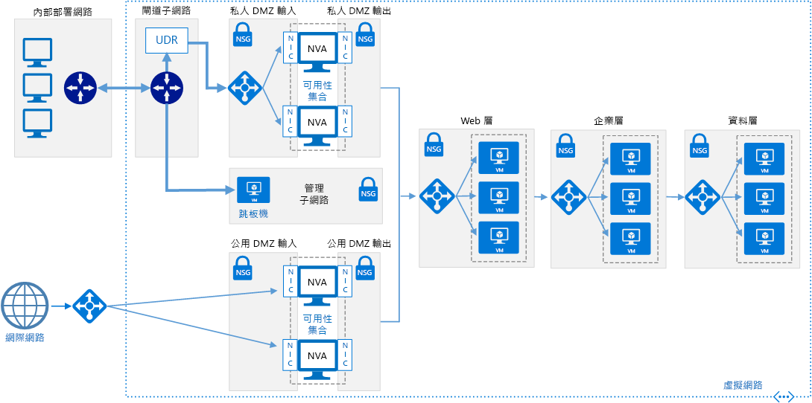
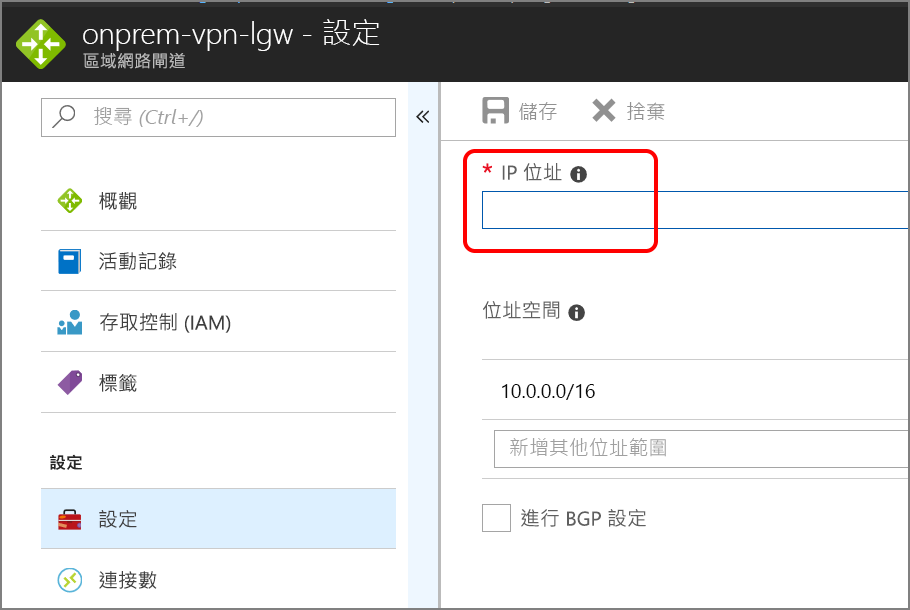

# <a name="implement-a-dmz-between-azure-and-the-internet"></a>實作 Azure 和網際網路之間的 DMZ

此參考架構顯示的安全混合式網路，可將內部部署網路擴充至 Azure 並接受網際網路流量。 [**部署這個解決方案**](#deploy-the-solution)。



下載這個架構的 [Visio 檔案][visio-download]。

此參考架構由[實作 Azure 和內部部署資料中心之間的 DMZ][implementing-a-secure-hybrid-network-architecture] 中所述的架構擴充而來。 除了用於處理來自內部網路流量的私人 DMZ，還加入了可處理網際網路流量的公用 DMZ。

此架構的典型使用案例包括：

- 部分工作負載在內部部署中執行、部分在 Azure 中執行的混合式應用程式。
- 負責路由傳送內部部署與網際網路的連入流量的 Azure 基礎結構。

## <a name="architecture"></a>架構

此架構由下列元件組成。

- **公用 IP 位址 (PIP)**。 公用端點的 IP 位址。 連線到網際網路的外部使用者可以透過此位址存取此系統。
- **網路虛擬設備 (NVA)**。 此架構有一個個別的 NVA 集區，用於處理來自網際網路的流量。
- **Azure 負載平衡器**。 來自網際網路的所有傳入要求都要通過負載平衡器，並散發到公用 DMZ 中的 NVA。
- **公用 DMZ 輸入子網路**。 此子網路會接受來自 Azure 負載平衡器的要求。 傳入要求會傳遞至公用 DMZ 中的其中一個 NVA。
- **公用 DMZ 輸出子網路**。 NVA 核准的要求會通過此子網路傳遞至 Web 層的內部負載平衡器。

## <a name="recommendations"></a>建議

下列建議適用於大部分的案例。 除非您有特定的需求會覆寫它們，否則請遵循下列建議。

### <a name="nva-recommendations"></a>NVA 建議

一組 NVA 用於來自網際網路的流量，另一組用於來自內部部署的流量。 兩者使用同一組 NVA 會造成安全性風險，因為在兩組網路流量之間沒有安全性界線。 使用個別 NVA 可降低檢查安全性規則的複雜度，並清楚哪些規則對應到每個傳入網路要求。 一組 NVA 僅實作於網際網路流量的規則，而另一組 NVA 僅實作內部部署流量的規則。

加入第 7 層 NVA 來終止 NVA 層級的應用程式連線，並維持與後端層的相容性。 這可確保對稱的連線，亦即來自後端層的回應流量會透過 NVA 傳回。

### <a name="public-load-balancer-recommendations"></a>公用負載平衡器建議

為了延展性和可用性，在[可用性設定組][availability-set]中部署公用 DMZ NVA，並使用[網際網路對向負載平衡器][load-balancer]分散可用性設定組中所有 NVA 的網際網路要求。

負載平衡器設定為只接受網際網路流量所需的通訊埠上的要求。 例如，限制輸入 HTTP 要求在連接埠 80，輸出 HTTPS 要求在連接埠 443。

## <a name="scalability-considerations"></a>延展性考量

即使您的架構一開始只需要公用 DMZ 中有單一 NVA，建議您從一開始就在公用 DMZ 前放置負載平衡器。 未來如果需要，這將更容易擴充至多個 NVA。

## <a name="availability-considerations"></a>可用性考量

網際網路對向負載平衡器需要公用 DMZ 輸入子網路中的每個 NVA 皆實作[健康情況探查][lb-probe]。 此端點無法回應健康情況探查的 NVA 會被視為無法使用，負載平衡器會將要求導向相同可用性設定組中的其他 NVA。 請注意，如果所有 NVA 回應都失敗，您的應用程式就會失敗，所以一定要設定監視，在狀況良好的 NVA 執行個體數目低於定義的臨界值時警示 DevOps。

## <a name="manageability-considerations"></a>管理性考量

對公用 DMZ 中 NVA 的所有監視和管理，應該由管理子網路中的 jumpbox 執行。 如[實作 Azure 與內部部署資料中心之間的 DMZ][implementing-a-secure-hybrid-network-architecture] 中所述，為了限制存取權，定義單一網路透過閘道從內部部署網路路由傳送至 jumpbox。

如果從內部部署網路到 Azure 的閘道連線關閉，藉由部署公用 IP 位址、將它加入 jumpbox、然後從網際網路登入，仍可連線至 jumpbox。

## <a name="security-considerations"></a>安全性考量

此參考架構實作多個安全性層級：

- 網際網路對向負載平衡器會將要求導向輸入公用 DMZ 子網路中的 NVA，而且只在應用程式所需的連接埠。
- 藉著封鎖 NSG 規則範圍之外的要求，輸入和輸出公用 DMZ 子網路的 NSG 規則可防止 NVA 受到危害。
- NVA 的 NAT 路由設定會將連接埠 80 和 443 上的傳入要求導向 Web 層負載平衡器，但會忽略其他所有通訊埠上的要求。

您應該記錄所有連接埠上的所有傳入要求。 定期稽核記錄，留意不在預期參數範圍之內的要求，因為這些可能表示入侵嘗試。

## <a name="deploy-the-solution"></a>部署解決方案

在 [GitHub][github-folder] 中有實作這些建議的參考架構部署。

### <a name="prerequisites"></a>必要條件

[!INCLUDE [ref-arch-prerequisites.md](../../../includes/ref-arch-prerequisites.md)]

### <a name="deploy-resources"></a>部署資源

1. 瀏覽至參考架構 GitHub 存放庫的 `/dmz/secure-vnet-dmz` 資料夾。

2. 執行以下命令：

    ```bash
    azbb -s <subscription_id> -g <resource_group_name> -l <region> -p onprem.json --deploy
    ```

3. 執行以下命令：

    ```bash
    azbb -s <subscription_id> -g <resource_group_name> -l <region> -p secure-vnet-hybrid.json --deploy
    ```

### <a name="connect-the-on-premises-and-azure-gateways"></a>將內部部署連線到 Azure 閘道

在此步驟中，您會將兩個區域網路閘道連線。

1. 在 Azure 入口網站中，巡覽至您所建立的資源群組。

2. 尋找名為 `ra-vpn-vgw-pip` 的資源，並複製 [概觀] 刀鋒視窗中所顯示的 IP 位址。

3. 尋找名為 `onprem-vpn-lgw` 的資源。

4. 按一下 [設定] 刀鋒視窗。 在 [IP 位址] 底下，貼上步驟 2 中的 IP 位址。

    

5. 按一下 [儲存]，並等候作業完成。 可能需要大約 5 分鐘的時間。

6. 尋找名為 `onprem-vpn-gateway1-pip` 的資源。 複製 [概觀] 刀鋒視窗中所顯示的 IP 位址。

7. 尋找名為 `ra-vpn-lgw` 的資源。

8. 按一下 [設定] 刀鋒視窗。 在 [IP 位址] 底下，貼上步驟 6 中的 IP 位址。

9. 按一下 [儲存]，並等候作業完成。

10. 若要確認連線，請前往每個閘道的 [連線] 刀鋒視窗。 狀態應該是 [已連線]。

### <a name="verify-that-network-traffic-reaches-the-web-tier"></a>請確認網路流量有到達 Web 層

1. 在 Azure 入口網站中，巡覽至您所建立的資源群組。

2. 尋找名為 `pub-dmz-lb` 的資源，也就是公用 DMZ 前方的負載平衡器。

3. 複製 [概觀] 刀鋒視窗中的公用 IP 位址，並在網頁瀏覽器中開啟此位址。 您應該會看到預設的 Apache2 伺服器首頁。

4. 尋找名為 `int-dmz-lb` 的資源，也就是私人 DMZ 前方的負載平衡器。 複製 [概觀] 刀鋒視窗中的私人 IP 位址。

5. 尋找名為 `jb-vm1` 的 VM。 請按一下 [連線]，並使用遠端桌面連線到 VM。 使用者名稱與密碼會在 onprem.json 檔案中指定。

6. 從遠端桌面工作階段中，開啟網頁瀏覽器並巡覽至步驟 4 中的 IP 位址。 您應該會看到預設的 Apache2 伺服器首頁。

[availability-set]: /azure/virtual-machines/virtual-machines-windows-manage-availability
[github-folder]: https://github.com/mspnp/reference-architectures/tree/master/dmz/secure-vnet-dmz

[implementing-a-secure-hybrid-network-architecture]: ./secure-vnet-hybrid.md
[iptables]: https://help.ubuntu.com/community/IptablesHowTo
[lb-probe]: /azure/load-balancer/load-balancer-custom-probe-overview
[load-balancer]: /azure/load-balancer/load-balancer-Internet-overview
[network-security-group]: /azure/virtual-network/virtual-networks-nsg

[visio-download]: https://archcenter.blob.core.windows.net/cdn/dmz-reference-architectures.vsdx
