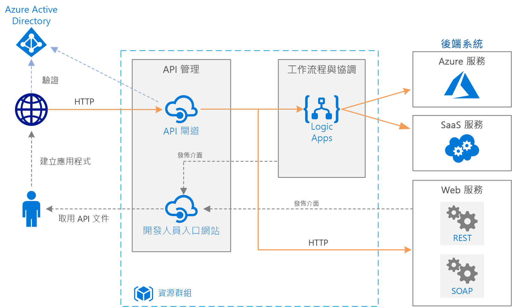

# Azure 上的基本企業整合Basic enterprise integration on Azure

此參考架構使用 [Azure Integration Services][integration-services] 協調企業後端系統的呼叫。This reference architecture uses [Azure Integration Services][integration-services] to orchestrate calls to enterprise backend systems. 後端系統可能包括軟體即服務 (SaaS) 系統、Azure 服務，以及企業中的現有 Web 服務。The backend systems may include software as a service (SaaS) systems, Azure services, and existing web services in your enterprise.

Azure Integration Services 是整合應用程式和資料的服務集合。Azure Integration Services is a collection of services for integrating applications and data. 此架構會使用這些服務的其中兩個：使用 [Logic Apps][logic-apps] 來協調工作流程，使用 [APIM][apim] 來建立 API 目錄。This architecture uses two of those services: [Logic Apps][logic-apps] to orchestrate workflows, and [API Management][apim] to create catalogs of APIs. 此架構足夠供基本整合案例使用，其中對後端服務的同步呼叫會觸發工作流程。This architecture is sufficient for basic integration scenarios where the workflow is triggered by synchronous calls to backend services. 使用[佇列和事件](./queues-events.md)的更複雜架構建立在此基本架構上。A more sophisticated architecture using [queues and events](./queues-events.md) builds on this basic architecture.

## 架構Architecture

此架構具有下列元件：The architecture has the following components:

- **後端系統**。**Backend systems**. 圖表右側是企業已部署或依賴的各種後端系統。The right-hand side of the diagram shows the various backend systems that the enterprise has deployed or relies on. 這些可能包括 SaaS 系統、其他 Azure 服務，或者會公開 REST 或 SOAP 端點的 Web 服務。These might include SaaS systems, other Azure services, or web services that expose REST or SOAP endpoints.

- **Azure Logic Apps**。**Azure Logic Apps**. [Logic Apps][logic-apps] 是一個無伺服器平台，用於建置可整合應用程式、資料和服務的企業工作流程。[Logic Apps][logic-apps] is a serverless platform for building enterprise workflows that integrate applications, data, and services. 在此架構中，邏輯應用程式會由 HTTP 要求觸發。In this architecture, the logic apps are triggered by HTTP requests. 您也可以為更複雜的協調流程巢狀處理工作流程。You can also nest workflows for more complex orchestration. Logic Apps 會使用[連接器][logic-apps-connectors]來整合常用的服務。Logic Apps uses [connectors][logic-apps-connectors] to integrate with commonly used services. Logic Apps 提供數百個連接器，且您可以建立自訂連接器。Logic Apps offers hundreds of connectors, and you can create custom connectors.

- **Azure API 管理**。**Azure API Management**. [API 管理][apim]是受控服務，用於發佈 HTTP API 的目錄，以促進重複使用及可搜尋性。[API Management][apim] is a managed service for publishing catalogs of HTTP APIs, to promote reuse and discoverability. API 管理由兩個相關元件組成：API Management consists of two related components:

  - **API 閘道**。**API gateway**. API 閘道可接受 HTTP 呼叫，並將它們路由傳送至後端。The API gateway accepts HTTP calls and routes them to the backend.

  - **開發人員入口網站**。**Developer portal**. Azure API 管理的每個執行個體都提供[開發人員入口網站][apim-dev-portal]的存取權。Each instance of Azure API Management provides access to a [developer portal][apim-dev-portal]. 此入口網站可讓開發人員存取呼叫 API 的文件和程式碼範例。This portal gives your developers access to documentation and code samples for calling the APIs. 您也可以在開發人員入口網站中測試 API。You can also test APIs in the developer portal.

  在此架構中，複合 API 是藉由[匯入邏輯應用程式][apim-logic-app]為 API 所建立。In this architecture, composite APIs are built by [importing logic apps][apim-logic-app] as APIs. 您也可以藉由[匯入 OpenAPI][apim-openapi] (Swagger) 規格或從 WSDL 規格[匯入 SOAP API][apim-soap] 來匯入現有的 Web 服務。You can also import existing web services by [importing OpenAPI][apim-openapi] (Swagger) specifications or [importing SOAP APIs][apim-soap] from WSDL specifications.

  API 閘道有助於分離前端用戶端與後端。The API gateway helps to decouple front-end clients from the back end. 比方說，它可以重新撰寫 URL，或在其到達後端前轉換要求。For example, it can rewrite URLs, or transform requests before they reach the backend. 它也可處理許多跨領域問題，例如驗證、跨原始來源資源共用 (CORS) 支援，以及回應快取。It also handles many cross-cutting concerns such as authentication, cross-origin resource sharing (CORS) support, and response caching.

- **Azure DNS**。**Azure DNS**. [Azure DNS][dns] 是適用於 DNS 網域的主機服務。[Azure DNS][dns] is a hosting service for DNS domains. Azure DNS 採用 Microsoft Azure 基礎結構來提供名稱解析。Azure DNS provides name resolution by using the Microsoft Azure infrastructure. 只要將您的網域裝載於 Azure，就可以使用您用於其他 Azure 服務的相同認證、API、工具和計費方式來管理 DNS 記錄。By hosting your domains in Azure, you can manage your DNS records by using the same credentials, APIs, tools, and billing that you use for your other Azure services. 若要使用自訂網域名稱 (例如 contoso.com)，請建立將自訂網域名稱對應至 IP 位址的 DNS 記錄。To use a custom domain name, such as contoso.com, create DNS records that map the custom domain name to the IP address. 如需詳細資訊，請參閱[在 API 管理中設定自訂網域名稱][apim-domain]。For more information, see [Configure a custom domain name in API Management][apim-domain].

- **Azure Active Directory (Azure AD)**。**Azure Active Directory (Azure AD)**. 使用 [Azure AD][aad] 來驗證呼叫 API 閘道的用戶端。Use [Azure AD][aad] to authenticate clients that call the API gateway. Azure AD 可支援 OpenID Connect (OIDC) 通訊協定。Azure AD supports the OpenID Connect (OIDC) protocol. 用戶端從 Azure AD 取得存取權杖，API 閘道會[驗證權杖][apim-jwt]以授權要求。Clients obtain an access token from Azure AD, and API Gateway [validates the token][apim-jwt] to authorize the request. 當使用 API 管理的標準或進階層，Azure AD 也可以保護開發人員入口網站的存取。When using the Standard or Premium tier of API Management, Azure AD can also secure access to the developer portal.

## 建議Recommendations

您的特定需求可能與此處所示的一般架構不同。Your specific requirements might differ from the generic architecture shown here. 以本節的建議作為起點。Use the recommendations in this section as a starting point.

### API 管理API Management

使用 API 管理的基本、標準或進階層。Use the API Management Basic, Standard, or Premium tiers. 這些層會提供生產環境服務等級協定 (SLA)，並支援在 Azure 區域內相應放大規模。These tiers offer a production service level agreement (SLA) and support scale out within the Azure region. API 管理的輸送量容量以*單位*進行測量。Throughput capacity for API Management is measured in *units*. 每個定價層都有相應放大規模的上限。進階層也支援跨多個 Azure 區域相應放大規模。Each pricing tier has a maximum scale-out. The Premium tier also supports scale out across multiple Azure regions. 根據您的功能集和必要輸送量的層級，選擇您的階層。Choose your tier based on your feature set and the level of required throughput. 如需詳細資訊，請參閱 [API 管理價格][apim-pricing]與 [Azure API 管理執行個體的容量][apim-capacity]。For more information, see [API Management pricing][apim-pricing] and [Capacity of an Azure API Management instance][apim-capacity].

每個 Azure API 管理執行個體都有預設網域名稱，也就是 `azure-api.net` &mdash 的子網域，例如 `contoso.azure-api.net`。Each Azure API Management instance has a default domain name, which is a subdomain of `azure-api.net` &mdash, for example, `contoso.azure-api.net`. 請考慮為您的組織設定[自訂網域][apim-domain]。Consider configuring a [custom domain][apim-domain] for your organization.

### Logic AppsLogic Apps

Logic Apps 最適合在回應不需要低延遲的案例中運作，例如非同步或半長時間執行的 API 呼叫。Logic Apps works best in scenarios that don't require low latency for a response, such as asynchronous or semi long-running API calls. 如果需要低延遲 (例如，會封鎖使用者介面的呼叫)，請使用不同的技術。If low latency is required, for example in a call that blocks a user interface, use a different technology. 例如，使用 Azure Functions 或部署至 Azure App Service 的 Web API。For example, use Azure Functions or a web API deployed to Azure App Service. 使用 API 管理讓您的 API 朝向您的 API 取用者。Use API Management to front the API to your API consumers.

### 區域Region

若要將網路延遲降到最低，將「API 管理」和 Logic Apps 放在相同區域中。To minimize network latency, put API Management and Logic Apps in the same region. 通常會選擇最接近使用者的區域 (或最接近後端服務)。In general, choose the region that's closest to your users (or closest to your backend services).

資源群組也有區域。The resource group also has a region. 此區域會指定部署中繼資料的儲存位置，以及部署範本的執行位置。This region specifies where to store deployment metadata and where to execute the deployment template. 若要改善部署期間的可用性，請將資源群組和資源放在相同區域。To improve availability during deployment, put the resource group and resources in the same region.

## 延展性考量Scalability considerations

若要提升 API 管理的延展性，請視需要新增[快取原則][apim-caching]。To increase the scalability of API Management, add [caching policies][apim-caching] where appropriate. 快取也有助於降低後端服務的負載。Caching also helps reduce the load on back-end services.

若要提供更大的容量，您可以在 Azure 區域中相應放大 Azure API 管理的基本、標準及進階層。To offer greater capacity, you can scale out Azure API Management Basic, Standard, and Premium tiers in an Azure region. 若要分析服務的使用情況，請在 [計量] 功能表上選取 [容量計量] 選項，然後視需要相應增加或相應減少規模。To analyze the usage for your service, on the **Metrics** menu, select the **Capacity Metric** option and then scale up or scale down as appropriate. 升級或調整程序需要 15 到 45 分鐘才會生效。The upgrade or scale process can take from 15 to 45 minutes to apply.

調整「API 管理」服務規模的建議事項：Recommendations for scaling an API Management service:

- 請在調整時考慮流量模式。Consider traffic patterns when scaling. 流量模式變動較大的客戶需要更多容量。Customers with more volatile traffic patterns need more capacity.

- 容量如果一直大於 66%，可能代表需要相應增加規模。Consistent capacity that's greater than 66% might indicate a need to scale up.

- 容量如果一直低於 20%，則可能代表需要相應減少規模。Consistent capacity that's under 20% might indicate an opportunity to scale down.

- 在生產環境中啟用負載前，一律先以代表性負載進行 API 管理服務負載測試。Before you enable the load in production, always load-test your API Management service with a representative load.

使用進階層，您可以跨多個 Azure 區域調整 API 管理執行個體。With the Premium tier, you can scale an API Management instance across multiple Azure regions. 這讓 API 管理可適用於更高的 SLA，並讓您在使用者附近多個區域中佈建服務。This makes API Management eligible for a higher SLA, and lets you provision services near users in multiple regions.

Logic Apps 無伺服器模型代表系統管理員不需要針對服務延展性進行規劃。The Logic Apps serverless model means administrators don't have to plan for service scalability. 服務會自動調整規模以滿足需求。The service automatically scales to meet demand.

## 可用性考量Availability considerations

檢閱每個服務的 SLA：Review the SLA for each service:

- [API 管理 SLA][apim-sla][API Management SLA][apim-sla]
- [Logic Apps SLA][logic-apps-sla][Logic Apps SLA][logic-apps-sla]

如果使用進階層跨二或多個區域部署 API 管理，即適用於較高的 SLA。If you deploy API Management across two or more regions with Premium tier, it is eligible for a higher SLA. 請參閱 [API 管理定價][apim-pricing]。See [API Management pricing][apim-pricing].

### 備份Backups

定期[備份][apim-backup] API 管理設定。Regularly [back up][apim-backup] your API Management configuration. 將備份檔案儲存在不同於服務所部署區域的位置或 Azure 區域中。Store your backup files in a location or Azure region that differs from the region where the service is deployed. 根據 [RTO][rto] 選擇災害復原策略：Based on your [RTO][rto], choose a disaster recovery strategy:

- 在災害復原事件中，佈建新的 API 管理執行個體、將備份還原至新的執行個體，以及重新指向 DNS 記錄。In a disaster recovery event, provision a new API Management instance, restore the backup to the new instance, and repoint the DNS records.

- 將 API 管理服務的被動執行個體保留在其他 Azure 區域中。Keep a passive instance of the API Management service in another Azure region. 定期將備份還原到該執行個體，以讓它與作用中服務保持同步。Regularly restore backups to that instance, to keep it in sync with the active service. 若要在災害復原事件中還原服務，您只需重新指向 DNS 記錄。To restore the service during a disaster recovery event, you need only repoint the DNS records. 這種方法會產生額外成本，因為您需要支付被動的執行個體，但可以縮短復原時間。This approach incurs additional cost because you pay for the passive instance, but reduces the time to recover.

對於邏輯應用程式，我們建議使用組態即程式碼的方法來備份及還原。For logic apps, we recommend a configuration-as-code approach to backing up and restoring. 因為邏輯應用程式無伺服器，您可以從 Azure Resource Manager 範本快速進行重新建立。Because logic apps are serverless, you can quickly recreate them from Azure Resource Manager templates. 將範本儲存在原始檔控制中，整合範本與您的持續整合/持續部署 (CI/CD) 程序。Save the templates in source control, integrate the templates with your continuous integration/continuous deployment (CI/CD) process. 在災害復原事件中，將範本部署到新的區域。In a disaster recovery event, deploy the template to a new region.

如果您將邏輯應用程式部署至不同的區域，請更新 API 管理中的組態。If you deploy a logic app to a different region, update the configuration in API Management. 您可以使用基本 PowerShell 指令碼來更新 API 的**後端**屬性。You can update the API's **Backend** property by using a basic PowerShell script.

## 管理性考量Manageability considerations

針對生產、部署和測試環境，各別建立資源群組。Create separate resource groups for production, development, and test environments. 個別的資源群組可讓您更輕鬆地管理部署、刪除測試部署及指派存取權限。Separate resource groups make it easier to manage deployments, delete test deployments, and assign access rights.

當您將資源指派給資源群組時，請考慮下列因素：When you assign resources to resource groups, consider these factors:

- **生命週期**。**Lifecycle**. 一般來說，會將具有相同生命週期的資源放在同一個資源群組中。In general, put resources that have the same lifecycle in the same resource group.

- **存取**。**Access**. 若要將存取原則套用至群組中的資源，您可以使用[角色型存取控制][rbac] (RBAC)。To apply access policies to the resources in a group, you can use [role-based access control][rbac] (RBAC).

- **計費**。**Billing**. 您可以檢視資源群組的彙總成本。You can view rollup costs for the resource group.

- **適用於 API 管理的定價層**。**Pricing tier for API Management**. 使用開發與測試環境的開發人員層。Use the Developer tier for development and test environments. 若要將成本降到最低，請部署生產環境的複本、執行測試，然後關閉。To minimize costs during preproduction, deploy a replica of your production environment, run your tests, and then shut down.

### 部署Deployment

使用 [Azure Resource Manager 範本][arm]來部署 Azure 資源。Use [Azure Resource Manager templates][arm] to deploy the Azure resources. 範本可讓您使用 PowerShell 或 Azure CLI，更輕鬆地自動執行部署。Templates make it easier to automate deployments using PowerShell or the Azure CLI.

將 Azure API 管理及任何個別的邏輯應用程式放在其自己的個別 Resource Manager 範本中。Put API Management and any individual logic apps in their own separate Resource Manager templates. 使用不同的範本時，可以將資源儲存於原始檔控制系統中。By using separate templates, you can store the resources in source control systems. 您可以一起部署範本，或者在 CI/CD 流程中個別部署。You can deploy the templates together or individually as part of a CI/CD process.

### 版本Versions

每次您變更邏輯應用程式的組態或透過 Resource Manager 範本部署更新時，Azure 都會保留該版本的複本，及保留所有具有執行歷程記錄的版本。Each time you change a logic app's configuration or deploy an update through a Resource Manager template, Azure keeps a copy of that version and keeps all versions that have a run history. 您可以使用這些版本來追蹤歷程記錄變更，或將某個版本升階成邏輯應用程式的目前組態。You can use these versions to track historical changes or promote a version as the logic app's current configuration. 例如，您可以將邏輯應用程式復原至先前的版本。For example, you can roll back a logic app to a previous version.

「API 管理」支援兩個截然不同但互補的版本設定概念：API Management supports two distinct but complementary versioning concepts:

- *版本*可讓 API 取用者根據其需求選擇 API 版本，例如 v1、v2、搶鮮版 (Beta) 或生產環境版。*Versions* allow API consumers to choose an API version based on their needs, for example, v1, v2, beta, or production.

- *修訂*允許 API 管理員在 API 中進行非中斷變更，並部署這些變更以及變更記錄，以便告知 API 取用者所做變更。*Revisions* allow API administrators to make non-breaking changes in an API and deploy those changes, along with a change log to inform API consumers about the changes.

您可以使用 Resource Manager 範本，在開發環境中進行修訂，然後在其他環境中部署該變更。You can make a revision in a development environment and deploy that change in other environments by using Resource Manager templates. 如需詳細資訊，請參閱[發佈多個 API 版本][apim-versions]For more information, see [Publish multiple versions of your API][apim-versions]

您也可以在變更之前使用修訂測試目前使用者能夠存取的 API。You can also use revisions to test an API before making the changes current and accessible to users. 不過，這個方法不建議用於負載測試或整合測試。However, this method isn't recommended for load testing or integration testing. 請改用個別的測試或生產階段前環境。Use separate test or preproduction environments instead.

## 診斷和監控Diagnostics and monitoring

使用 [Azure 監視器][monitor]在 API 管理和 Logic Apps 中進行作業監視。Use [Azure Monitor][monitor] for operational monitoring in both API Management and Logic Apps. Azure 監視器預設會啟用，並且會根據針對每個服務所設定的計量來提供資訊。Azure Monitor provides information based on the metrics configured for each service and is enabled by default. 如需詳細資訊，請參閱For more information, see:

- [監視已發佈的 API][apim-monitor][Monitor published APIs][apim-monitor]
- [監視狀態、設定診斷記錄，以及開啟 Azure Logic Apps 的警示][logic-apps-monitor][Monitor status, set up diagnostics logging, and turn on alerts for Azure Logic Apps][logic-apps-monitor]

每個服務也具有下列選項：Each service also has these options:

- 如需進行更深入的分析並顯示在儀表板上，請將 Logic Apps 記錄傳送至 [Azure Log Analytics][logic-apps-log-analytics]。For deeper analysis and dashboarding, send Logic Apps logs to [Azure Log Analytics][logic-apps-log-analytics].

- 若要進行 DevOps 監視，您可以針對 API 管理設定 Azure Application Insights。For DevOps monitoring, configure Azure Application Insights for API Management.

- API 管理支援[適用於自訂 API 分析的 Power BI 解決方案範本][apim-pbi] \(英文\)。API Management supports the [Power BI solution template for custom API analytics][apim-pbi]. 您可以使用此解決方案範本來建立自己的分析解決方案。You can use this solution template for creating your own analytics solution. 若為商務使用者，Power BI 中有可用的報告。For business users, Power BI makes reports available.

## 安全性考量Security considerations

雖然這份清單並未完整地說明所有的安全性最佳做法，以下安全性考量專門用於此架構：Although this list doesn't completely describe all security best practices, here are some security considerations that apply specifically to this architecture:

- Azure API 管理服務有固定的公用 IP 位址。The Azure API Management service has a fixed public IP address. 將呼叫 Logic Apps 端點的存取權限制成僅供 API 管理的 IP 位址使用。Restrict access for calling Logic Apps endpoints to only the IP address of API Management. 如需詳細資訊，請參閱[限制連入 IP 位址][logic-apps-restrict-ip]。For more information, see [Restrict incoming IP addresses][logic-apps-restrict-ip].

- 若要確保使用者具有適當的存取層級，請使用角色型存取控制 (RBAC)。To make sure users have appropriate access levels, use role-based access control (RBAC).

- 使用 OAuth 或 Open ID Connect 來保護 API 管理中的公用 API 端點。Secure public API endpoints in API Management by using OAuth or OpenID Connect. 若要保護公用 API 端點，請設定識別提供者，並新增 JSON Web 權杖 (JWT) 驗證原則。To secure public API endpoints, configure an identity provider, and add a JSON Web Token (JWT) validation policy. 如需詳細資訊，請參閱[使用 OAuth 2.0 搭配 Azure Active Directory 與 API 管理來保護 API][apim-oauth]。For more information, see [Protect an API by using OAuth 2.0 with Azure Active Directory and API Management][apim-oauth].

- 使用相互憑證，從 API 管理連線至後端服務。Connect to back-end services from API Management by using mutual certificates.

- 在 API 管理 API 上強制使用 HTTPS。Enforce HTTPS on the API Management APIs.

### 儲存祕密Storing secrets

永遠不要將密碼、存取金鑰或連接字串簽入原始檔控制。Never check passwords, access keys, or connection strings into source control. 如果需要這些值，請使用適當的技術來保護和部署這些值。If these values are required, secure and deploy these values by using the appropriate techniques.

如果邏輯應用程式需要您無法在連接器內建立的任何敏感性值，請將這些值儲存在 Azure Key Vault 中，然後從 Resource Manager 範本參考這些值。If a logic app requires any sensitive values that you can't create within a connector, store those values in Azure Key Vault and reference them from a Resource Manager template. 針對每個環境使用部署範本參數和參數檔。Use deployment template parameters and parameter files for each environment. 如需詳細資訊，請參閱[保護工作流程中的參數和輸入][logic-apps-secure]。For more information, see [Secure parameters and inputs within a workflow][logic-apps-secure].

API 管理中會使用名為「具名值」或「屬性」的物件來管理祕密。API Management manages secrets by using objects called *named values* or *properties*. 這些物件能安全地儲存可透過 API 管理原則存取的值。These objects securely store values that you can access through API Management policies. 如需詳細資訊，請參閱[如何使用 Azure API 管理原則中的具名值][apim-properties]。For more information, see [How to use Named Values in Azure API Management policies][apim-properties].

## 成本考量Cost considerations

我們會向您收取所有執行中「API 管理」執行個體的費用。You are charged for all API Management instances when they are running. 如果您已相應增加，且並非隨時需要該層級的效能，請以手動方式相應減少或設定[自動調整][apim-autoscale]。If you have scaled up and don't need that level of performance all the time, manually scale down or configure [autoscaling][apim-autoscale].

Logic Apps 會使用[無伺服器](/azure/logic-apps/logic-apps-serverless-overview)模型。Logic Apps uses a [serverless](/azure/logic-apps/logic-apps-serverless-overview) model. 計費的計算方式是以動作和連接器執行為基礎。Billing is calculated based on action and connector execution. 如需詳細資訊，請參閱 [Logic Apps 定價](https://azure.microsoft.com/pricing/details/logic-apps/)。For more information, see [Logic Apps pricing](https://azure.microsoft.com/pricing/details/logic-apps/). 目前沒有任何針對 Logic Apps 的階層考量。Currently, there are no tier considerations for Logic Apps.

## 後續步驟Next steps

為了提升可靠性和延展性，使用訊息佇列和事件來分離後端系統。For greater reliability and scalability, use message queues and events to decouple the backend systems. 此模式會顯示在此系列的下一個參考架構中：[使用訊息佇列和事件的企業整合](./queues-events.md)。This pattern is shown in the next reference architecture in this series: [Enterprise integration using message queues and events](./queues-events.md).

<!-- links -->

[aad]: /azure/active-directory
[apim]: /azure/api-management
[apim-autoscale]: /azure/api-management/api-management-howto-autoscale
[apim-backup]: /azure/api-management/api-management-howto-disaster-recovery-backup-restore
[apim-caching]: /azure/api-management/api-management-howto-cache
[apim-capacity]: /azure/api-management/api-management-capacity
[apim-dev-portal]: /azure/api-management/api-management-key-concepts#a-namedeveloper-portal-a-developer-portal
[apim-domain]: /azure/api-management/configure-custom-domain
[apim-jwt]: /azure/api-management/policies/authorize-request-based-on-jwt-claims
[apim-logic-app]: /azure/api-management/import-logic-app-as-api
[apim-monitor]: /azure/api-management/api-management-howto-use-azure-monitor
[apim-oauth]: /azure/api-management/api-management-howto-protect-backend-with-aad
[apim-openapi]: /azure/api-management/import-api-from-oas
[apim-pbi]: https://aka.ms/apimpbi
[apim-pricing]: https://azure.microsoft.com/pricing/details/api-management/
[apim-properties]: /azure/api-management/api-management-howto-properties
[apim-sla]: https://azure.microsoft.com/support/legal/sla/api-management/
[apim-soap]: /azure/api-management/import-soap-api
[apim-versions]: /azure/api-management/api-management-get-started-publish-versions
[arm]: /azure/azure-resource-manager/resource-group-authoring-templates
[dns]: /azure/dns/
[integration-services]: https://azure.microsoft.com/product-categories/integration/
[logic-apps]: /azure/logic-apps/logic-apps-overview
[logic-apps-connectors]: /azure/connectors/apis-list
[logic-apps-log-analytics]: /azure/logic-apps/logic-apps-monitor-your-logic-apps-oms
[logic-apps-monitor]: /azure/logic-apps/logic-apps-monitor-your-logic-apps
[logic-apps-restrict-ip]: /azure/logic-apps/logic-apps-securing-a-logic-app#restrict-incoming-ip-addresses
[logic-apps-secure]: /azure/logic-apps/logic-apps-securing-a-logic-app#secure-parameters-and-inputs-within-a-workflow
[logic-apps-sla]: https://azure.microsoft.com/support/legal/sla/logic-apps
[monitor]: /azure/azure-monitor/overview
[rbac]: /azure/role-based-access-control/overview
[rto]: ../../resiliency/index.md#rto-and-rpo