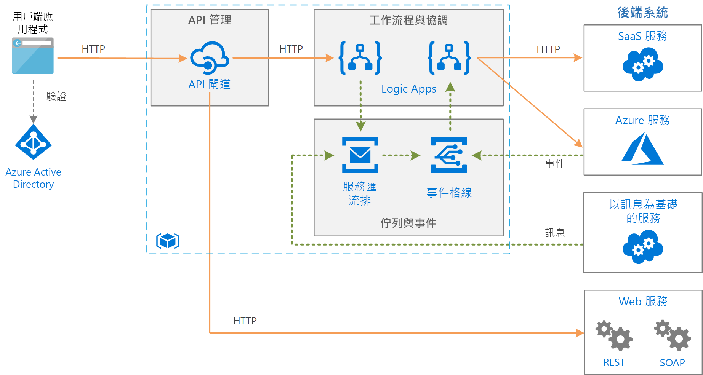

# 使用訊息佇列和事件在 Azure 上的企業整合

此架構整合企業後端系統，使用訊息佇列和事件來分離服務，以提升延展性和可靠性。 後端系統可能包括軟體即服務 (SaaS) 系統、Azure 服務，以及企業中的現有 Web 服務。

## 架構

此處所示架構建置在[基本企業整合][basic-enterprise-integration]中所示較簡單的架構之上。 該架構使用 [Logic Apps][logic-apps] 來協調工作流程，使用 [API 管理][apim]來建立 API 目錄。

這個版本的架構新增了讓系統更可靠且可擴充的兩個元件：

- **[Azure 服務匯流排][service-bus]**。 服務匯流排是安全、可靠的訊息代理程式。  

- **[Azure 事件格線][event-grid]**。 事件格線是事件路由服務。 它使用發佈/訂閱 (pub/sub) 事件模型。

相較於直接同步呼叫後端服務，使用訊息代理程式的非同步通訊可提供許多優點：

- 使用[佇列型負載調節模式](../../patterns/queue-based-load-leveling.md)，提供負載調節以處理工作負載的高載。
- 可靠追蹤長時間執行且牽涉到多個步驟或多個應用程式的工作流程進度。
- 協助分離應用程式。
- 與現有訊息型系統整合。
- 當後端系統無法使用時，可讓工作排入佇列。

事件格線可讓系統中的各個元件回應發生的事件，而非依賴輪詢或已排程工作。 與訊息佇列相同，它可協助分離應用程式和服務。 應用程式或服務可以發佈事件，而任何有興趣的訂閱者將會收到通知。 可以新增新訂閱者，而不需要更新寄件者。

許多 Azure 服務支援將事件傳送到事件格線。 比方說，當新檔案新增至 blob 存放區時，邏輯應用程式可以接聽事件。 此模式可讓回應式工作流程啟動一系列程序，這些工作流程包括上傳檔案或將訊息放在佇列中。 程序可能以平行方式或依特定順序執行。 

## 建議

[基本企業整合][basic-enterprise-integration]中所述的建議適用於此架構。 下列建議也適用：

### 服務匯流排 

服務匯流排具有兩種傳遞模式：*提取*或*推送*。 在提取模型中，接收者持續輪詢新訊息。 輪詢可能效率不佳，尤其如果您有許多佇列，每個接收一些訊息，或如果訊息之間有很多時間。 在推送模型中，當有新訊息時，服務匯流排會透過事件格線傳送事件。 接收者會訂閱事件。 觸發事件時，接收者會從服務匯流排提取下一批次的訊息。 

建立邏輯應用程式以取用服務匯流排訊息時，建議您使用推送模型搭配事件格線整合。 這通常更符合成本效益，因為邏輯應用程式不需要輪詢服務匯流排。 如需詳細資訊，請參閱 [Azure 服務匯流排與事件格線的整合概觀](/azure/service-bus-messaging/service-bus-to-event-grid-integration-concept)。 目前，事件格線通知需要有服務匯流排[進階層](https://azure.microsoft.com/pricing/details/service-bus/)。

使用 [PeekLock](/azure/service-bus-messaging/service-bus-messaging-overview#queues) 存取一組訊息。 當您使用 PeekLock 時，邏輯應用程式可以先執行步驟來驗證每個訊息，然後再完成或放棄訊息。 此方法可防止意外的訊息遺失。

### Event Grid 

引發事件格線觸發程序時，表示*至少一個*事件發生。 例如，當邏輯應用程式收到服務匯流排訊息的事件格線觸發程序，它應假設可能有數個訊息可處理。

事件方格會使用無伺服器模型。 計費的計算方式以作業 (事件執行) 的數目為基礎。 如需詳細資訊，請參閱[事件方格價格](https://azure.microsoft.com/pricing/details/event-grid/)。 目前沒有任何針對事件方格的階層考量。

## 延展性考量

若要達到更高的延展性，服務匯流排進階層可以將傳訊單位數目相應放大。 進階層設定可以有一個、兩個或四個傳訊單位。 如需調整服務匯流排規模的詳細資訊，請參閱[使用服務匯流排傳訊的效能改進最佳作法](/azure/service-bus-messaging/service-bus-performance-improvements)。

## 可用性考量

檢閱每個服務的 SLA：

- [API 管理 SLA][apim-sla]
- [事件格線 SLA][event-grid-sla]
- [Logic Apps SLA][logic-apps-sla]
- [服務匯流排 SLA][sb-sla]

若要能夠在發生嚴重服務中斷時進行容錯移轉，請考慮在服務匯流排進階層中實作異地災害復原。 如需詳細資訊，請參閱 [Azure 服務匯流排異地災害復原](/azure/service-bus-messaging/service-bus-geo-dr)。

## 安全性考量

若要保護服務匯流排，請使用共用存取簽章 (SAS)。 您可以使用 [SAS 驗證](/azure/service-bus-messaging/service-bus-sas)，授與使用者具特定權限的服務匯流排資源存取權。 如需詳細資訊，請參閱[服務匯流排驗證和授權](/azure/service-bus-messaging/service-bus-authentication-and-authorization)。

如果您需要將服務匯流排佇列以 HTTP 端點的形式 (舉例而言) 公開，以發佈新訊息，請使用 API 管理讓該端點成為前端，以保護佇列。 接著，您可以視情況使用憑證或 OAuth 驗證來保護該端點。 要保護端點，最簡單的方法是使用邏輯應用程式與 HTTP 要求/回應觸發程序作為媒介。

事件方格服務會透過驗證碼來保護事件傳遞。 如果您使用 Logic Apps 來取用事件，將會自動執行驗證。 如需詳細資訊，請參閱 [Event Grid 安全性和驗證](/azure/event-grid/security-authentication)。

[apim]: /azure/api-management
[apim-sla]: https://azure.microsoft.com/support/legal/sla/api-management/
[event-grid]: /azure/event-grid/
[event-grid-sla]: https://azure.microsoft.com/support/legal/sla/event-grid
[logic-apps]: /azure/logic-apps/logic-apps-overview
[logic-apps-sla]: https://azure.microsoft.com/support/legal/sla/logic-apps
[sb-sla]: https://azure.microsoft.com/support/legal/sla/service-bus/
[service-bus]: /azure/service-bus-messaging/
[basic-enterprise-integration]: ./basic-enterprise-integration.md