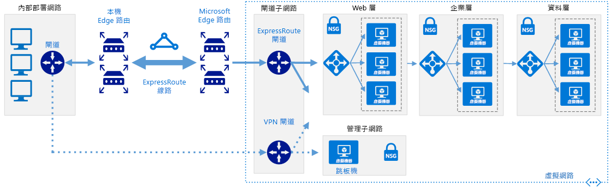

# <a name="connect-an-on-premises-network-to-azure-using-expressroute-with-vpn-failover"></a>使用 ExpressRoute 搭配 VPN 容錯移轉，將內部部署網路連線至 Azure

此參考架構會示範如何使用 ExpressRoute 搭配當作容錯移轉連線的站對站虛擬私人網路 (VPN)，將內部部署網路連線到 Azure 虛擬網路 (VNet)。 內部部署網路與 Azure VNet 之間的流量會透過 ExpressRoute 連線流動。 如果 ExpressRoute 線路的連線中斷，則流量會透過 IPSec VPN 通道路由傳送。 [**部署這個解決方案**](#deploy-the-solution)。

請注意，如果無法使用 ExpressRoute 線路，VPN 路由將只會處理私用對等連線。 公用對等和 Microsoft 對等連線將透過網際網路傳送。



下載這個架構的 [Visio 檔案][visio-download]。

## <a name="architecture"></a>架構

此架構由下列元件組成。

- **內部部署網路**。 在組織內執行的私用區域網路。

- **VPN 設備**。 可對內部部署網路提供外部連線的裝置或服務。 VPN 設備可能是硬體裝置或軟體解決方案，例如，Windows Server 2012 中的路由及遠端存取服務 (RRAS)。 如需支援的 VPN 設備清單，以及設定選取的 VPN 設備以連線至 Azure 的相關資訊，請參閱[關於站對站 VPN 閘道連線的 VPN 裝置][vpn-appliance]。

- **ExpressRoute 線路**。 透過邊緣路由器聯結內部部署網路與 Azure 之連線提供者所提供的第 2 層或第 3 層線路。 此線路使用連線提供者所管理的硬體基礎結構。

- **ExpressRoute 虛擬網路閘道**。 ExpressRoute 虛擬網路閘道可讓 VNet 連線到與內部部署網路連線所使用的 ExpressRoute 線路。

- **VPN 虛擬網路閘道**。 VPN 虛擬網路閘道可讓 VNet 連線到內部部署網路中的 VPN 設備。 VPN 虛擬網路閘道設定為僅透過 VPN 設備，接受來自內部網路的要求。 如需詳細資訊，請參閱[將內部部署網路連線至 Microsoft Azure 虛擬網路][connect-to-an-Azure-vnet]。

- **VPN 連線**。 連線的屬性會指定連線類型 (IPSec) 以及與內部部署 VPN 設備共用以加密流量的金鑰。

- **Azure 虛擬網路 (VNet)**。 每個 VNet 都位於單一 Azure 區域，而且可以裝載多個應用程式層。 應用程式層可以使用每個 VNet 中的子網路區隔。

- **閘道子網路**。 虛擬網路閘道會保留在相同的子網路中。

- **雲端應用程式**。 在 Azure 中裝載的應用程式。 此應用程式在透過 Azure 負載平衡器連線多個子網路的情況下，可能包括多層。 如需有關應用程式基礎結構的詳細資訊，請參閱[執行 Windows VM 工作負載][windows-vm-ra]和[執行 Linux VM 工作負載][linux-vm-ra]。

## <a name="recommendations"></a>建議

下列建議適用於大部分的案例。 除非您有特定的需求會覆寫它們，否則請遵循下列建議。

### <a name="vnet-and-gatewaysubnet"></a>VNet 和 GatewaySubnet

在相同的 VNet 中建立 ExpressRoute 虛擬網路閘道與 VPN 虛擬網路閘道。 這表示它們應該會共用名為 *GatewaySubnet* 的相同子網路。

如果在 VNet 已經包含名為 *GatewaySubnet* 的子網路，請確認其位址空間為 /27 或更大。 如果現有的子網路太小，請使用下列 PowerShell 命令移除子網路：

```powershell
$vnet = Get-AzureRmVirtualNetworkGateway -Name <yourvnetname> -ResourceGroupName <yourresourcegroup>
Remove-AzureRmVirtualNetworkSubnetConfig -Name GatewaySubnet -VirtualNetwork $vnet
```

如果 VNet 中不包含名為 **GatewaySubnet** 的子網路，請使用下列 PowerShell 命令建立一個新的子網路：

```powershell
$vnet = Get-AzureRmVirtualNetworkGateway -Name <yourvnetname> -ResourceGroupName <yourresourcegroup>
Add-AzureRmVirtualNetworkSubnetConfig -Name "GatewaySubnet" -VirtualNetwork $vnet -AddressPrefix "10.200.255.224/27"
$vnet = Set-AzureRmVirtualNetwork -VirtualNetwork $vnet
```

### <a name="vpn-and-expressroute-gateways"></a>VPN 和 ExpressRoute 閘道

請確認您的組織符合 [ExpressRoute 必要條件需求][expressroute-prereq]以連線至 Azure。

如果您在 Azure VNet 中已經有一個 VPN 虛擬網路閘道，請使用下列 Powershell 命令將它移除：

```powershell
Remove-AzureRmVirtualNetworkGateway -Name <yourgatewayname> -ResourceGroupName <yourresourcegroup>
```

請依照[使用 Azure ExpressRoute 實作混合式網路架構][implementing-expressroute]中的指示，建立 ExpressRoute 連線。

請依照[使用 Azure 和內部部署 VPN 實作混合式網路架構][implementing-vpn]中的指示，建立 VPN 虛擬網路閘道連線。

建立虛擬網路閘道連線之後，依下列方式測試環境：

1. 確定您可以從內部部署網路連線到 Azure VNet。
2. 連絡您的提供者停止 ExpressRoute 連線以進行測試。
3. 確認您仍然可以使用 VPN 虛擬網路閘道連線，從內部部署網路連線到 Azure VNet。
4. 連絡您的提供者以重新建立 ExpressRoute 連線。

## <a name="considerations"></a>考量

如需 ExpressRoute 的考量，請參閱[使用 Azure ExpressRoute 實作混合式網路架構][guidance-expressroute]指引。

如需站對站 VPN 的考量，請參閱[使用 Azure 和內部部署 VPN 實作混合式網路架構][guidance-vpn]指引。

如需 Azure 的一般安全性考量，請參閱 [Microsoft 雲端服務和網路安全性][best-practices-security]。

## <a name="deploy-the-solution"></a>部署解決方案

**必要條件**。 您必須已經使用適當的網路設備，設定現有的內部部署基礎結構。

若要部署解決方案，請執行下列步驟。

<!-- markdownlint-disable MD033 -->

1. 按一下下方的按鈕：<br><a href="https://portal.azure.com/#create/Microsoft.Template/uri/https%3A%2F%2Fraw.githubusercontent.com%2Fmspnp%2Freference-architectures%2Fmaster%2Fhybrid-networking%2Fexpressroute-vpn-failover%2Fazuredeploy.json" target="_blank"></a>

2. 等待此連結在 Azure 入口網站中開啟，然後按照下列步驟進行：
   - **資源群組**名稱已在參數檔案中定義，因此請在文字方塊中選取 [新建] 並輸入 `ra-hybrid-vpn-er-rg`。
   - 從 [位置] 下拉式方塊選取區域。
   - 請勿編輯 [範本的根 URI] 或 [參數根 URI] 文字方塊。
   - 檢閱條款和條件，然後按一下 [我同意上方所述的條款及條件] 核取方塊。
   - 按一下 [購買] 按鈕。

3. 等待部署完成。

4. 按一下下方的按鈕：<br><a href="https://portal.azure.com/#create/Microsoft.Template/uri/https%3A%2F%2Fraw.githubusercontent.com%2Fmspnp%2Freference-architectures%2Fmaster%2Fhybrid-networking%2Fexpressroute-vpn-failover%2Fazuredeploy-expressRouteCircuit.json" target="_blank"></a>

5. 等待此連結在 Azure 入口網站中開啟，進入後按照下列步驟進行：
   - 選取 [資源群組] 區段中的 [使用現有的]，然後在文字方塊中輸入 `ra-hybrid-vpn-er-rg`。
   - 從 [位置] 下拉式方塊選取區域。
   - 請勿編輯 [範本的根 URI] 或 [參數根 URI] 文字方塊。
   - 檢閱條款和條件，然後按一下 [我同意上方所述的條款及條件] 核取方塊。
   - 按一下 [購買] 按鈕。

<!-- markdownlint-enable MD033 -->

<!-- links -->

[windows-vm-ra]: ../virtual-machines-windows/index.md
[linux-vm-ra]: ../virtual-machines-linux/index.md
[resource-manager-overview]: /azure/azure-resource-manager/resource-group-overview
[vpn-appliance]: /azure/vpn-gateway/vpn-gateway-about-vpn-devices
[azure-vpn-gateway]: /azure/vpn-gateway/vpn-gateway-about-vpngateways
[connect-to-an-Azure-vnet]: https://technet.microsoft.com/library/dn786406.aspx
[expressroute-prereq]: /azure/expressroute/expressroute-prerequisites
[implementing-expressroute]: ./expressroute.md
[implementing-vpn]: ./vpn.md
[guidance-expressroute]: ./expressroute.md
[guidance-vpn]: ./vpn.md
[best-practices-security]: /azure/best-practices-network-security
[visio-download]: https://archcenter.blob.core.windows.net/cdn/hybrid-network-architectures.vsdx
