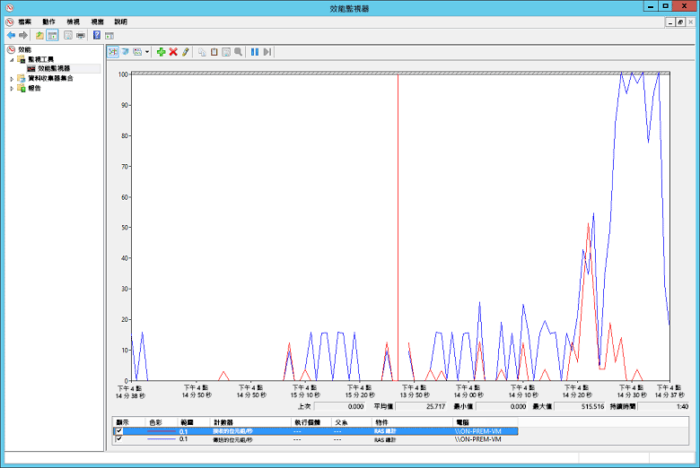

# <a name="troubleshoot-a-hybrid-vpn-connection"></a>針對混合式 VPN 連線進行疑難排解

本文提供了對內部部署網路與 Azure 之間的 VPN 閘道連線進行疑難排解的一些提示。 如需針對常見 VPN 相關錯誤進行疑難排解的一般資訊，請參閱[針對常見 VPN 相關錯誤進行移難排解][troubleshooting-vpn-errors]。

## <a name="verify-the-vpn-appliance-is-functioning-correctly"></a>驗證 VPN 設備是否正常運作

下列建議有助於判斷您的內部部署 VPN 設備是否正常運作。

**請查看 VPN 設備產生的任何記錄，以檢查是否有錯誤或失敗。** 這可協助您判斷 VPN 設備是否正確運作。 此資訊的位置會因為您的設備不同而有所差異。 例如，如果您在 Windows Server 2012 上使用 RRAS，您可以使用下列 PowerShell 命令來顯示 RRAS 服務的錯誤事件資訊：

```PowerShell
Get-EventLog -LogName System -EntryType Error -Source RemoteAccess | Format-List -Property *
```

每個項目的「訊息」屬性會提供錯誤的描述。 一些常見的範例包括：

- 無法連線，可能是由於在 RRAS VPN 網路介面設定中為 Azure VPN 閘道指定了不正確的 IP 位址。

  ```console
  EventID            : 20111
  MachineName        : on-prem-vm
  Data               : {41, 3, 0, 0}
  Index              : 14231
  Category           : (0)
  CategoryNumber     : 0
  EntryType          : Error
  Message            : RoutingDomainID- {00000000-0000-0000-0000-000000000000}: A demand dial connection to the remote
                          interface AzureGateway on port VPN2-4 was successfully initiated but failed to complete
                          successfully because of the  following error: The network connection between your computer and
                          the VPN server could not be established because the remote server is not responding. This could
                          be because one of the network devices (for example, firewalls, NAT, routers, and so on) between your computer
                          and the remote server is not configured to allow VPN connections. Please contact your
                          Administrator or your service provider to determine which device may be causing the problem.
  Source             : RemoteAccess
  ReplacementStrings : {{00000000-0000-0000-0000-000000000000}, AzureGateway, VPN2-4, The network connection between
                          your computer and the VPN server could not be established because the remote server is not
                          responding. This could be because one of the network devices (for example, firewalls, NAT, routers, and so on)
                          between your computer and the remote server is not configured to allow VPN connections. Please
                          contact your Administrator or your service provider to determine which device may be causing the
                          problem.}
  InstanceId         : 20111
  TimeGenerated      : 3/18/2016 1:26:02 PM
  TimeWritten        : 3/18/2016 1:26:02 PM
  UserName           :
  Site               :
  Container          :
  ```

- 在 RRAS VPN 的網路介面設定中指定了錯誤的共用金鑰。

  ```console
  EventID            : 20111
  MachineName        : on-prem-vm
  Data               : {233, 53, 0, 0}
  Index              : 14245
  Category           : (0)
  CategoryNumber     : 0
  EntryType          : Error
  Message            : RoutingDomainID- {00000000-0000-0000-0000-000000000000}: A demand dial connection to the remote
                          interface AzureGateway on port VPN2-4 was successfully initiated but failed to complete
                          successfully because of the  following error: Internet key exchange (IKE) authentication credentials are unacceptable.

  Source             : RemoteAccess
  ReplacementStrings : {{00000000-0000-0000-0000-000000000000}, AzureGateway, VPN2-4, IKE authentication credentials are
                          unacceptable.
                          }
  InstanceId         : 20111
  TimeGenerated      : 3/18/2016 1:34:22 PM
  TimeWritten        : 3/18/2016 1:34:22 PM
  UserName           :
  Site               :
  Container          :
  ```

您也可以使用下列 PowerShell 命令，取得嘗試透過 RRAS 服務連線的相關事件記錄資訊：

```powershell
Get-EventLog -LogName Application -Source RasClient | Format-List -Property *
```

在連線失敗的事件中，此記錄會包含看起來類似下列的錯誤：

```console
EventID            : 20227
MachineName        : on-prem-vm
Data               : {}
Index              : 4203
Category           : (0)
CategoryNumber     : 0
EntryType          : Error
Message            : CoId={B4000371-A67F-452F-AA4C-3125AA9CFC78}: The user SYSTEM dialed a connection named
                        AzureGateway that has failed. The error code returned on failure is 809.
Source             : RasClient
ReplacementStrings : {{B4000371-A67F-452F-AA4C-3125AA9CFC78}, SYSTEM, AzureGateway, 809}
InstanceId         : 20227
TimeGenerated      : 3/18/2016 1:29:21 PM
TimeWritten        : 3/18/2016 1:29:21 PM
UserName           :
Site               :
Container          :
```

## <a name="verify-connectivity"></a>驗證連線能力

**請檢查 VPN 閘道之間的連線和路由。** VPN 設備可能沒有正確地透過 Azure VPN 閘道路由流量。 請使用 [PsPing][psping] 等工具來檢查 VPN 閘道之間的連線和路由。 例如，若要測試內部部署機器是否能連線至位於 VNet 上的 Web 伺服器，請執行下列命令 (使用 Web 伺服器的位址取代 `<<web-server-address>>`)：

```console
PsPing -t <<web-server-address>>:80
```

如果內部部署機器可以將流量路由至 Web 伺服器，您應該會看到類似下列的輸出：

```console
D:\PSTools>psping -t 10.20.0.5:80

PsPing v2.01 - PsPing - ping, latency, bandwidth measurement utility
Copyright (C) 2012-2014 Mark Russinovich
Sysinternals - www.sysinternals.com

TCP connect to 10.20.0.5:80:
Infinite iterations (warmup 1) connecting test:
Connecting to 10.20.0.5:80 (warmup): 6.21ms
Connecting to 10.20.0.5:80: 3.79ms
Connecting to 10.20.0.5:80: 3.44ms
Connecting to 10.20.0.5:80: 4.81ms

    Sent = 3, Received = 3, Lost = 0 (0% loss),
    Minimum = 3.44ms, Maximum = 4.81ms, Average = 4.01ms
```

如果內部部署機器無法與指定的目的地通訊，您會看到像這樣的訊息：

```console
D:\PSTools>psping -t 10.20.1.6:80

PsPing v2.01 - PsPing - ping, latency, bandwidth measurement utility
Copyright (C) 2012-2014 Mark Russinovich
Sysinternals - www.sysinternals.com

TCP connect to 10.20.1.6:80:
Infinite iterations (warmup 1) connecting test:
Connecting to 10.20.1.6:80 (warmup): This operation returned because the timeout period expired.
Connecting to 10.20.1.6:80: This operation returned because the timeout period expired.
Connecting to 10.20.1.6:80: This operation returned because the timeout period expired.
Connecting to 10.20.1.6:80: This operation returned because the timeout period expired.
Connecting to 10.20.1.6:80:
    Sent = 3, Received = 0, Lost = 3 (100% loss),
    Minimum = 0.00ms, Maximum = 0.00ms, Average = 0.00ms
```

**請確認內部部署防火牆允許 VPN 流量通過且正確的連接埠已開啟。**

**請確認內部部署 VPN 設備使用的加密方法與 Azure VPN 閘道相容。** 針對原則型路由，Azure VPN 閘道支援 AES256、AES128 和 3DES 加密演算法。 路由型閘道支援 AES256 和 3DES。 如需詳細資訊，請參閱[關於 VPN 裝置和站對站 VPN 閘道連線的 IPsec/IKE 參數][vpn-appliance]。

## <a name="check-for-problems-with-the-azure-vpn-gateway"></a>檢查與 Azure VPN 閘道的問題

下列建議有助於判斷 Azure VPN 閘道是否有問題：

**檢查 Azure VPN 閘道診斷記錄，以查看是否有潛在問題。** 請參閱[逐步說明：擷取 Azure Resource Manager VNET 閘道診斷記錄][gateway-diagnostic-logs]。

**確認 Azure VPN 閘道與內部部署 VPN 設備是使用相同的共用驗證金鑰進行設定。** 您可以使用下列 Azure CLI 命令，檢視 Azure VPN 閘道所儲存的共用金鑰：

```azurecli
azure network vpn-connection shared-key show <<resource-group>> <<vpn-connection-name>>
```

您可以使用適用於您內部部署 VPN 設備的命令，來顯示該設備上設定的共用金鑰。

確認持有 Azure VPN 閘道的 GatewaySubnet 子網路沒有與 NSG 建立關聯。

您可使用下列 Azure CLI 命令檢視子網路詳細資料：

```azurecli
azure network vnet subnet show -g <<resource-group>> -e <<vnet-name>> -n GatewaySubnet
```

請確定沒有名為「網路安全性群組識別碼」的資料欄位。 下列範例會示範具有指派 NSG (VPN-Gateway-Group) 的 GatewaySubnet 執行個體結果。 如果您有對此 NSG 定義任何規則，此動作可能會使得閘道無法正常運作。

```console
C:\>azure network vnet subnet show -g profx-prod-rg -e profx-vnet -n GatewaySubnet
    info:    Executing command network vnet subnet show
    + Looking up virtual network "profx-vnet"
    + Looking up the subnet "GatewaySubnet"
    data:    Id                              : /subscriptions/########-####-####-####-############/resourceGroups/profx-prod-rg/providers/Microsoft.Network/virtualNetworks/profx-vnet/subnets/GatewaySubnet
    data:    Name                            : GatewaySubnet
    data:    Provisioning state              : Succeeded
    data:    Address prefix                  : 10.20.3.0/27
    data:    Network Security Group id       : /subscriptions/########-####-####-####-############/resourceGroups/profx-prod-rg/providers/Microsoft.Network/networkSecurityGroups/VPN-Gateway-Group
    info:    network vnet subnet show command OK
```

**請確認 Azure VNet 中的虛擬機器設定為允許流量從外部 VNet 傳入。** 如果有任何 NSG 規則與包含這些虛擬機器的子網路相關聯，請檢查這些規則。 您可使用下列 Azure CLI 命令檢視所有 NSG 規則：

```azurecli
azure network nsg show -g <<resource-group>> -n <<nsg-name>>
```

**請確認 Azure VPN 閘道已連線。** 您可以使用下列 Azure PowerShell 命令來檢查 Azure VPN 連線的目前狀態。 `<<connection-name>>` 參數是連結虛擬網路閘道與區域閘道的 Azure VPN 連線名稱。

```powershell
Get-AzureRmVirtualNetworkGatewayConnection -Name <<connection-name>> - ResourceGroupName <<resource-group>>
```

下列程式碼片段會醒目提示閘道連線時 (第一個範例) 和中斷連線時 (第二個範例) 所產生的輸出：

```powershell
PS C:\> Get-AzureRmVirtualNetworkGatewayConnection -Name profx-gateway-connection -ResourceGroupName profx-prod-rg

AuthorizationKey           :
VirtualNetworkGateway1     : Microsoft.Azure.Commands.Network.Models.PSVirtualNetworkGateway
VirtualNetworkGateway2     :
LocalNetworkGateway2       : Microsoft.Azure.Commands.Network.Models.PSLocalNetworkGateway
Peer                       :
ConnectionType             : IPsec
RoutingWeight              : 0
SharedKey                  : ####################################
ConnectionStatus           : Connected
EgressBytesTransferred     : 55254803
IngressBytesTransferred    : 32227221
ProvisioningState          : Succeeded
...
```

```powershell
PS C:\> Get-AzureRmVirtualNetworkGatewayConnection -Name profx-gateway-connection2 -ResourceGroupName profx-prod-rg

AuthorizationKey           :
VirtualNetworkGateway1     : Microsoft.Azure.Commands.Network.Models.PSVirtualNetworkGateway
VirtualNetworkGateway2     :
LocalNetworkGateway2       : Microsoft.Azure.Commands.Network.Models.PSLocalNetworkGateway
Peer                       :
ConnectionType             : IPsec
RoutingWeight              : 0
SharedKey                  : ####################################
ConnectionStatus           : NotConnected
EgressBytesTransferred     : 0
IngressBytesTransferred    : 0
ProvisioningState          : Succeeded
...
```

## <a name="miscellaneous-issues"></a>其他問題

下列建議有助於判斷主機虛擬機器設定、網路頻寬使用率或應用程式效能是否有問題：

**驗證防火牆組態。** 如果子網路中的 Azure 虛擬機器上正在執行客體作業系統，請確認其中的防火牆已正確設定，可允許內部部署 IP 範圍中的許可流量。

**請確認流量尚未接近 Azure VPN 閘道可用的頻寬上限。** 驗證此項目的方式取決於在內部部署的 VPN 設備。 例如，如果您在 Windows Server 2012 上使用 RRAS，您可以使用效能監視器來追蹤透過 VPN 連線收到和傳輸的資料量。 如果使用「RAS 總計」物件，請選取「接收的位元組/秒」和「傳輸的位元組/秒」計數器：


您應比較 VPN 閘道的可用頻寬所產生的結果 (從基本 SKU 的 100 Mbps 到 VpnGw3 SKU 的 1.25 Gbps)：



**請確認您已針對應用程式負載，部署正確的虛擬機器數量和大小。** 判斷 Azure VNet 中是否有任何一部虛擬機器執行速度緩慢。 如果有，則表示虛擬機器負載可能過重、虛擬機器可能太少以至於無法處理負載，或是負載平衡器可能未正確設定。 若要判斷原因，可[擷取及分析診斷資訊][azure-vm-diagnostics]。 您可以使用 Azure 入口網站檢查結果，但也有許多第三方工具可協助您深入了解效能資料。

**請確認應用程式正在有效率地使用雲端資源。** 檢測每個虛擬機器上執行的應用程式程式碼，判斷應用程式是否以最佳方式在使用資源。 您可以使用 [Application Insights][application-insights] 等工具。

<!-- links -->

[application-insights]: /azure/application-insights/app-insights-overview-usage
[azure-vm-diagnostics]: https://azure.microsoft.com/blog/windows-azure-virtual-machine-monitoring-with-wad-extension/
[gateway-diagnostic-logs]: https://blogs.technet.microsoft.com/keithmayer/2016/10/12/step-by-step-capturing-azure-resource-manager-arm-vnet-gateway-diagnostic-logs/
[psping]: https://technet.microsoft.com/sysinternals/jj729731.aspx
[troubleshooting-vpn-errors]: https://blogs.technet.microsoft.com/rrasblog/2009/08/12/troubleshooting-common-vpn-related-errors/
[vpn-appliance]: /azure/vpn-gateway/vpn-gateway-about-vpn-devices
