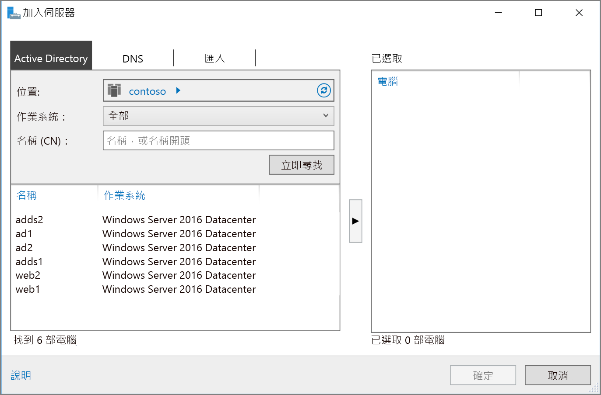

# <a name="extend-active-directory-domain-services-ad-ds-to-azure"></a>將 Active Directory Domain Services (AD DS) 擴充至 Azure

此參考架構說明如何將 Active Directory 環境擴充至 Azure，以使用 Active Directory Domain Services (AD DS) 提供分散式驗證服務。 [**部署這個解決方案**。](#deploy-the-solution)

[![0]][0] 

下載這個架構的 [Visio 檔案][visio-download]。

AD DS 可用來驗證包含在安全性網域中的使用者、電腦、應用程式或其他身分識別。 它可以裝載在內部部署環境，但如果您的應用程式部分裝載在內部部署環境且部分裝載在 Azure 中，則在 Azure 中複寫此功能可能更有效率。 如此可以減少將驗證和本機授權要求從雲端傳回執行內部部署之 AD DS 所造成的延遲。 

當內部部署網路與 Azure 虛擬網路透過 VPN 或 ExpressRoute 連線連接時，通常會使用這個架構。 此架構也支援雙向複寫，也就是說，您可以在內部部署或雲端上進行變更，而且這兩個來源會保持一致。 此架構的典型用途包括在內部部署與 Azure 之間散佈功能的混合式應用程式，以及使用 Active Directory 執行驗證的應用程式和服務。

如需了解其他考量，請參閱[選擇解決方案以整合內部部署 Active Directory 與 Azure][considerations]。 

## <a name="architecture"></a>架構 

此架構可擴充 [Azure 與網際網路之間的 DMZ][implementing-a-secure-hybrid-network-architecture-with-internet-access] 所示的架構。 其元件如下。

* **內部部署網路**。 內部部署網路包括可以針對內部部署元件執行驗證和授權的本機 Active Directory 伺服器。
* **Active Directory 伺服器**。 這些網域控制站是雲端中執行的 VM，負責實作目錄服務 (AD DS)。 這些伺服器可以驗證在 Azure 虛擬網路中執行的元件。
* **Active Directory 子網路**。 AD DS 伺服器會裝載在不同的子網路中。 網路安全性群組 (NSG) 規則可保護 AD DS 伺服器，並提供防火牆以防禦來自非預期來源的流量。
* **Azure 閘道和 Active Directory 同步處理**。 Azure 閘道會提供內部部署網路與 Azure VNet 之間的連線。 這可能是 [VPN 連線][azure-vpn-gateway]或 [Azure ExpressRoute][azure-expressroute]。 雲端與與內部部署環境中 Active Directory 伺服器之間的所有同步處理要求都會通過閘道。 使用者定義的路由 (UDR) 會針對傳送至 Azure 的內部部署流量處理路由傳送。 往返 Active Directory 伺服器的流量不會通過此案例中使用的網路虛擬設備 (NVA)。

如需有關設定 UDR 與 NVA 的詳細資訊，請參閱[在 Azure 中實作安全的混合式網路架構][implementing-a-secure-hybrid-network-architecture]。 

## <a name="recommendations"></a>建議

下列建議適用於大部分的案例。 除非您有特定的需求會覆寫它們，否則請遵循下列建議。 

### <a name="vm-recommendations"></a>VM 建議

根據預期的驗證要求量，決定您的 [VM 大小][vm-windows-sizes]需求。 針對在內部部署環境中裝載 AD DS 的電腦，使用其規格作為起點，以比對 Azure VM 的大小。 一旦部署之後，請根據 VM 上的實際負載，監視使用量並相應增加或減少。 如需有關調整 AD DS 網域控制站大小的詳細資訊，請參閱 [Active Directory Domain Services 的容量規劃][capacity-planning-for-adds]。

建立個別的虛擬資料磁碟，以儲存 Active Directory 的資料庫、記錄檔和 SYSVOL。 請不要將這些項目儲存在與作業系統相同的磁碟上。 請注意，連線到 VM 的資料磁碟預設會使用即刻寫入快取。 不過，這種形式的快取可能會與 AD DS 的需求發生衝突。 因此，請將資料磁碟上的 [主機快取偏好設定] 設定設為 [無]。 如需詳細資訊，請參閱 [Windows Server AD DS 資料庫和 SYSVOL 的位置][adds-data-disks]。

至少將兩個執行 AD DS 的 VM 部署為網域控制站，並將其新增至[可用性設定組][availability-set]。

### <a name="networking-recommendations"></a>網路功能的建議

使用靜態私人 IP 位址，設定每個 AD DS 伺服器的 VM 網路介面 (NIC)，以獲得完整的網域名稱服務 (DNS) 支援。 如需詳細資訊，請參閱[如何在 Azure 入口網站中設定靜態私人 IP 位址][set-a-static-ip-address]。

> [!NOTE]
> 請不要使用公用 IP 位址設定任何 AD DS 的 VM NIC。 如需詳細資料，請參閱[安全性考量][security-considerations]。
> 
> 

Active Directory 子網路 NSG 需要有允許來自內部部署環境傳入流量的規則。 如需有關 AD DS 使用之連接埠的詳細資訊，請參閱 [Active Directory 和 Active Directory Domain Services 連接埠需求][ad-ds-ports]。 此外，也請確定 UDR 表格沒有透過此架構中使用的 NVA 來路由傳送 AD DS 流量。 

### <a name="active-directory-site"></a>Active Directory 站台

在 AD DS 中，站台代表裝置的實體位置、網路或集合。 AD DS 站台可將彼此位置接近且透過高速網路連線的 AD DS 物件分組在一起，以便用來管理 AD DS 資料庫複寫。 AD DS 包含選取最佳策略的邏輯，以便在站台之間複寫 AD DS 資料庫。

建議您建立一個 AD DS 站台，其中包括針對 Azure 中應用程式所定義的子網路。 接著，設定內部部署 AD DS 站台之間的站台連結，AD DS 就會自動執行最有效率的資料庫複寫。 請注意，此資料庫複寫不需要超出初始設定。

### <a name="active-directory-operations-masters"></a>Active Directory 操作主機

操作主機角色可以指派給 AD DS 網域控制站，以支援複寫 AD DS 資料庫執行個體之間的一致性檢查。 操作主機角色有五個：架構主機、網域命名主機、相關識別元主機、主要網域控制站主機模擬器和基礎結構主機。 如需有關這些角色的詳細資訊，請參閱[什麼是操作主機？][ad-ds-operations-masters]。

建議您不要將操作主機角色指派給在 Azure 中部署的網域控制站。

### <a name="monitoring"></a>監視

監視網域控制站 VM 的資源以及 AD DS 服務，並建立計劃以快速修正任何問題。 如需詳細資訊，請參閱[監視 Active Directory][monitoring_ad]。 您也可以在監視伺服器上安裝 [Microsoft Systems Center][microsoft_systems_center] 之類的工具 (請參見架構圖表)，以協助執行這些工作。  

## <a name="scalability-considerations"></a>延展性考量

AD DS 是針對延展性而設計。 您不需要設定負載平衡器或流量控制器，就可以將要求導向到 AD DS 網域控制站。 唯一的延展性考量是要以適合您網路負載需求的正確大小來設定執行 AD DS 的 VM、監視 VM 的負載，以及視需要相應增加或減少。

## <a name="availability-considerations"></a>可用性考量

將執行 AD DS 的 VM 部署至[可用性設定組][availability-set]。 此外，請考慮將[待命操作主機][standby-operations-masters]的角色指派到至少一部伺服器，且數量取決於您的需求。 待命操作主機是操作主機的使用中複本，可在容錯移轉期間用來代替主要操作主機伺服器。

## <a name="manageability-considerations"></a>管理性考量

執行 AD DS 定期備份。 不要只複製網域控制站的 VHD 檔案，而是要執行定期備份，因為 VHD 上的 AD DS 資料庫檔案經過複製之後可能會處於不一致的狀態，進而無法重新啟動資料庫。

請不要使用 Azure 入口網站來關閉網域控制站 VM， 而是從客體作業系統來關機並重新啟動。 透過入口網站關機會導致將 VM 解除配置，進而同時重設 Active Directory 存放庫的 `VM-GenerationID` 和 `invocationID`。 如此會捨棄 AD DS 相關的識別元 (RID) 集區，並將 SYSVOL 標示為非權威，因而可能需要重新設定網域控制站。

## <a name="security-considerations"></a>安全性考量

AD DS 伺服器負責提供驗證服務，容易引來攻擊。 為保護其安全，請將 AD DS 伺服器放在不同的子網路，並使用 NSG 當作防火牆，以防止直接網際網路連線。 關閉 AD DS 伺服器上的所有連接埠，但驗證、授權及伺服器同步處理所需的連接埠除外。 如需詳細資訊，請參閱 [Active Directory 和 Active Directory Domain Services 連接埠需求][ad-ds-ports]。

請考慮使用一對子網路和 NVA，在伺服器周圍實作額外的安全性周邊，如[在 Azure 中實作具有網際網路存取權的安全混合式網路架構][implementing-a-secure-hybrid-network-architecture-with-internet-access]中所述。

使用 BitLocker 或 Azure 磁碟加密，將裝載 AD DS 資料庫的磁碟加密。

## <a name="deploy-the-solution"></a>部署解決方案

適用於此架構的部署可在 [GitHub][github] 上取得。 請注意，整個部署最多可能需要兩個小時，其中包括建立 VPN 閘道和執行設定 AD DS 的指令碼。

### <a name="prerequisites"></a>先決條件

1. 複製、派生或下載適用於[參考架構][github] GitHub 存放庫的 zip 檔案。

2. 安裝 [Azure CLI 2.0][azure-cli-2]。

3. 安裝 [Azure 建置組塊][azbb] npm 封裝。

4. 從命令提示字元、bash 提示字元或 PowerShell 提示字元中，使用下列命令登入 Azure 帳戶。

   ```bash
   az login
   ```

### <a name="deploy-the-simulated-on-premises-datacenter"></a>部署模擬的內部部署資料中心

1. 巡覽至 GitHub 存放庫的 `identity/adds-extend-domain` 資料夾。

2. 開啟 `onprem.json` 檔案。 搜尋 `adminPassword` 和 `Password` 的執行個體，並新增密碼的值。

3. 執行下列命令，並等待部署完成：

    ```bash
    azbb -s <subscription_id> -g <resource group> -l <location> -p onprem.json --deploy
    ```

### <a name="deploy-the-azure-vnet"></a>部署 Azure VNet

1. 開啟 `azure.json` 檔案。  搜尋 `adminPassword` 和 `Password` 的執行個體，並新增密碼的值。 

2. 在同一個檔案中，搜尋 `sharedKey` 的執行個體，並輸入 VPN 連線的共用金鑰。 

    ```bash
    "sharedKey": "",
    ```

3. 執行下列命令，並等待部署完成。

    ```bash
    azbb -s <subscription_id> -g <resource group> -l <location> -p onoprem.json --deploy
    ```

   部署至與內部 VNet 相同的資源群組。

### <a name="test-connectivity-with-the-azure-vnet"></a>測試 Azure VNet 的連線

部署完成後，您可以測試從模擬的內部部署環境到 Azure VNet 的連線。

1. 使用 Azure 入口網站，巡覽至您所建立的資源群組。

2. 尋找名為 `ra-onpremise-mgmt-vm1` 的 VM。

3. 按一下 `Connect` 以開啟 VM 的遠端桌面工作階段。 使用者名稱是 `contoso\testuser`，而密碼是您在 `onprem.json` 參數檔案中指定的密碼。

4. 從遠端桌面工作階段中開啟連至 10.0.4.4 (此為 VM `adds-vm1` 的 IP 位址) 的另一個遠端桌面工作階段。 使用者名稱是 `contoso\testuser`，而密碼是您在 `azure.json` 參數檔案中指定的密碼。

5. 從 `adds-vm1` 的遠端桌面工作階段中移至**伺服器管理員**，然後按一下 [新增其他要管理的伺服器]。 

6. 在 [Active Directory] 索引標籤中，按一下 [立即尋找]。 您應該會看到 AD、AD DS 和 Web VM 的清單。

   

## <a name="next-steps"></a>後續步驟

* 了解[在 Azure 中建立 AD DS 資源樹系][adds-resource-forest]的最佳作法。
* 了解[在 Azure 中建立 Active Directory Federation Services (AD FS) 基礎結構][adfs]的最佳作法。

<!-- links -->

[adds-resource-forest]: adds-forest.md
[adfs]: adfs.md
[azure-cli-2]: /azure/install-azure-cli
[azbb]: https://github.com/mspnp/template-building-blocks/wiki/Install-Azure-Building-Blocks
[implementing-a-secure-hybrid-network-architecture]: ../dmz/secure-vnet-hybrid.md
[implementing-a-secure-hybrid-network-architecture-with-internet-access]: ../dmz/secure-vnet-dmz.md

[adds-data-disks]: https://msdn.microsoft.com/library/azure/jj156090.aspx#BKMK_PlaceDB
[ad-ds-operations-masters]: https://technet.microsoft.com/library/cc779716(v=ws.10).aspx
[ad-ds-ports]: https://technet.microsoft.com/library/dd772723(v=ws.11).aspx
[availability-set]: /azure/virtual-machines/virtual-machines-windows-create-availability-set
[azure-expressroute]: /azure/expressroute/expressroute-introduction
[azure-vpn-gateway]: /azure/vpn-gateway/vpn-gateway-about-vpngateways
[capacity-planning-for-adds]: http://social.technet.microsoft.com/wiki/contents/articles/14355.capacity-planning-for-active-directory-domain-services.aspx
[considerations]: ./considerations.md
[GitHub]: https://github.com/mspnp/reference-architectures/tree/master/identity/adds-extend-domain
[microsoft_systems_center]: https://www.microsoft.com/server-cloud/products/system-center-2016/
[monitoring_ad]: https://msdn.microsoft.com/library/bb727046.aspx
[security-considerations]: #security-considerations
[set-a-static-ip-address]: /azure/virtual-network/virtual-networks-static-private-ip-arm-pportal
[standby-operations-masters]: https://technet.microsoft.com/library/cc794737(v=ws.10).aspx
[visio-download]: https://archcenter.blob.core.windows.net/cdn/identity-architectures.vsdx
[vm-windows-sizes]: /azure/virtual-machines/virtual-machines-windows-sizes

[0]: ./images/adds-extend-domain.png "使用 Active Directory 保護混合式網路架構的安全"
