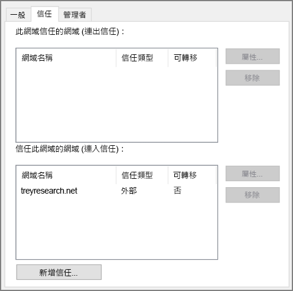

# <a name="create-an-active-directory-domain-services-ad-ds-resource-forest-in-azure"></a><span data-ttu-id="2c3e0-104">在 Azure 中建立 Active Directory Domain Services (AD DS) 資源樹系</span><span class="sxs-lookup"><span data-stu-id="2c3e0-104">Create an Active Directory Domain Services (AD DS) resource forest in Azure</span></span>

<span data-ttu-id="2c3e0-105">此參考架構會顯示如何在 Azure 中建立受到內部部署 AD 樹系內網域信任的另一個 Active Directory 網域。</span><span class="sxs-lookup"><span data-stu-id="2c3e0-105">This reference architecture shows how to create a separate Active Directory domain in Azure that is trusted by domains in your on-premises AD forest.</span></span> [<span data-ttu-id="2c3e0-106">**部署這個解決方案**。</span><span class="sxs-lookup"><span data-stu-id="2c3e0-106">**Deploy this solution**.</span></span>](#deploy-the-solution)

<span data-ttu-id="2c3e0-107">[![0]][0]</span><span class="sxs-lookup"><span data-stu-id="2c3e0-107">[![0]][0]</span></span> 

<span data-ttu-id="2c3e0-108">下載這個架構的 [Visio 檔案][visio-download]。</span><span class="sxs-lookup"><span data-stu-id="2c3e0-108">*Download a [Visio file][visio-download] of this architecture.*</span></span>

<span data-ttu-id="2c3e0-109">Active Directory Domain Services (AD DS) 會以階層式結構儲存身分識別資訊。</span><span class="sxs-lookup"><span data-stu-id="2c3e0-109">Active Directory Domain Services (AD DS) stores identity information in a hierarchical structure.</span></span> <span data-ttu-id="2c3e0-110">階層式結構中的最上層節點稱為樹系。</span><span class="sxs-lookup"><span data-stu-id="2c3e0-110">The top node in the hierarchical structure is known as a forest.</span></span> <span data-ttu-id="2c3e0-111">樹系包含網域，而網域則包含其他類型的物件。</span><span class="sxs-lookup"><span data-stu-id="2c3e0-111">A forest contains domains, and domains contain other types of objects.</span></span> <span data-ttu-id="2c3e0-112">此參考架構會在 Azure 中建立與內部部署網域具有單向連出信任關係的 AD DS 樹系。</span><span class="sxs-lookup"><span data-stu-id="2c3e0-112">This reference architecture creates an AD DS forest in Azure with a one-way outgoing trust relationship with an on-premises domain.</span></span> <span data-ttu-id="2c3e0-113">Azure 中的樹系包含不存在於內部部署的網域。</span><span class="sxs-lookup"><span data-stu-id="2c3e0-113">The forest in Azure contains a domain that does not exist on-premises.</span></span> <span data-ttu-id="2c3e0-114">因為信任關係，才能夠信任針對內部部署網域的登入，以存取個別 Azure 網域中的資源。</span><span class="sxs-lookup"><span data-stu-id="2c3e0-114">Because of the trust relationship, logons made against on-premises domains can be trusted for access to resources in the separate Azure domain.</span></span> 

<span data-ttu-id="2c3e0-115">這個架構的典型用途包括維持雲端中保留之物件和身分識別的安全性隔離，以及將個別網域從內部部署移轉到雲端。</span><span class="sxs-lookup"><span data-stu-id="2c3e0-115">Typical uses for this architecture include maintaining security separation for objects and identities held in the cloud, and migrating individual domains from on-premises to the cloud.</span></span> 

<span data-ttu-id="2c3e0-116">如需了解其他考量，請參閱[選擇解決方案以整合內部部署 Active Directory 與 Azure][considerations]。</span><span class="sxs-lookup"><span data-stu-id="2c3e0-116">For additional considerations, see [Choose a solution for integrating on-premises Active Directory with Azure][considerations].</span></span> 

## <a name="architecture"></a><span data-ttu-id="2c3e0-117">架構</span><span class="sxs-lookup"><span data-stu-id="2c3e0-117">Architecture</span></span>

<span data-ttu-id="2c3e0-118">此架構具有下列元件。</span><span class="sxs-lookup"><span data-stu-id="2c3e0-118">The architecture has the following components.</span></span>

* <span data-ttu-id="2c3e0-119">**內部部署網路**。</span><span class="sxs-lookup"><span data-stu-id="2c3e0-119">**On-premises network**.</span></span> <span data-ttu-id="2c3e0-120">內部部署網路包含自己的 Active Directory 樹系和網域。</span><span class="sxs-lookup"><span data-stu-id="2c3e0-120">The on-premises network contains its own Active Directory forest and domains.</span></span>
* <span data-ttu-id="2c3e0-121">**Active Directory 伺服器**。</span><span class="sxs-lookup"><span data-stu-id="2c3e0-121">**Active Directory servers**.</span></span> <span data-ttu-id="2c3e0-122">這些是雲端中實作當作 VM 執行之網域服務的網域控制站。</span><span class="sxs-lookup"><span data-stu-id="2c3e0-122">These are domain controllers implementing domain services running as VMs in the cloud.</span></span> <span data-ttu-id="2c3e0-123">這些伺服器會裝載包含一個或多個網域的樹系，而且與內部部署的網域不同。</span><span class="sxs-lookup"><span data-stu-id="2c3e0-123">These servers host a forest containing one or more domains, separate from those located on-premises.</span></span>
* <span data-ttu-id="2c3e0-124">**單向信任關係**。</span><span class="sxs-lookup"><span data-stu-id="2c3e0-124">**One-way trust relationship**.</span></span> <span data-ttu-id="2c3e0-125">圖表中的範例顯示 Azure 中網域到內部部署網域的單向信任。</span><span class="sxs-lookup"><span data-stu-id="2c3e0-125">The example in the diagram shows a one-way trust from the domain in Azure to the on-premises domain.</span></span> <span data-ttu-id="2c3e0-126">這種關係可讓內部部署使用者在 Azure 中存取網域內的資源，但不適用於反向。</span><span class="sxs-lookup"><span data-stu-id="2c3e0-126">This relationship enables on-premises users to access resources in the domain in Azure, but not the other way around.</span></span> <span data-ttu-id="2c3e0-127">如果雲端使用者也需要存取內部部署資源，您可以建立雙向信任。</span><span class="sxs-lookup"><span data-stu-id="2c3e0-127">It is possible to create a two-way trust if cloud users also require access to on-premises resources.</span></span>
* <span data-ttu-id="2c3e0-128">**Active Directory 子網路**。</span><span class="sxs-lookup"><span data-stu-id="2c3e0-128">**Active Directory subnet**.</span></span> <span data-ttu-id="2c3e0-129">AD DS 伺服器會裝載在不同的子網路中。</span><span class="sxs-lookup"><span data-stu-id="2c3e0-129">The AD DS servers are hosted in a separate subnet.</span></span> <span data-ttu-id="2c3e0-130">網路安全性群組 (NSG) 規則可保護 AD DS 伺服器，並提供防火牆以防禦來自非預期來源的流量。</span><span class="sxs-lookup"><span data-stu-id="2c3e0-130">Network security group (NSG) rules protect the AD DS servers and provide a firewall against traffic from unexpected sources.</span></span>
* <span data-ttu-id="2c3e0-131">**Azure 閘道**。</span><span class="sxs-lookup"><span data-stu-id="2c3e0-131">**Azure gateway**.</span></span> <span data-ttu-id="2c3e0-132">Azure 閘道會提供內部部署網路與 Azure VNet 之間的連線。</span><span class="sxs-lookup"><span data-stu-id="2c3e0-132">The Azure gateway provides a connection between the on-premises network and the Azure VNet.</span></span> <span data-ttu-id="2c3e0-133">這可能是 [VPN 連線][azure-vpn-gateway]或 [Azure ExpressRoute][azure-expressroute]。</span><span class="sxs-lookup"><span data-stu-id="2c3e0-133">This can be a [VPN connection][azure-vpn-gateway] or [Azure ExpressRoute][azure-expressroute].</span></span> <span data-ttu-id="2c3e0-134">如需詳細資訊，請參閱[在 Azure 中實作安全的混合式網路架構][implementing-a-secure-hybrid-network-architecture]。</span><span class="sxs-lookup"><span data-stu-id="2c3e0-134">For more information, see [Implementing a secure hybrid network architecture in Azure][implementing-a-secure-hybrid-network-architecture].</span></span>

## <a name="recommendations"></a><span data-ttu-id="2c3e0-135">建議</span><span class="sxs-lookup"><span data-stu-id="2c3e0-135">Recommendations</span></span>

<span data-ttu-id="2c3e0-136">如需在 Azure 中實作 Active Directory 的特定建議，請參閱下列文章：</span><span class="sxs-lookup"><span data-stu-id="2c3e0-136">For specific recommendations on implementing Active Directory in Azure, see the following articles:</span></span>

- <span data-ttu-id="2c3e0-137">[將 Active Directory Domain Services (AD DS) 擴充至 Azure][adds-extend-domain]。</span><span class="sxs-lookup"><span data-stu-id="2c3e0-137">[Extending Active Directory Domain Services (AD DS) to Azure][adds-extend-domain].</span></span> 
- <span data-ttu-id="2c3e0-138">[在 Azure 虛擬機器上部署 Windows Server Active Directory 的指導方針][ad-azure-guidelines]。</span><span class="sxs-lookup"><span data-stu-id="2c3e0-138">[Guidelines for Deploying Windows Server Active Directory on Azure Virtual Machines][ad-azure-guidelines].</span></span>

### <a name="trust"></a><span data-ttu-id="2c3e0-139">信任</span><span class="sxs-lookup"><span data-stu-id="2c3e0-139">Trust</span></span>

<span data-ttu-id="2c3e0-140">內部部署網域包含在雲端網域中的不同樹系內。</span><span class="sxs-lookup"><span data-stu-id="2c3e0-140">The on-premises domains are contained within a different forest from the domains in the cloud.</span></span> <span data-ttu-id="2c3e0-141">若要在雲端驗證內部部署使用者，Azure 中的網域必須信任內部部署樹系中的登入網域。</span><span class="sxs-lookup"><span data-stu-id="2c3e0-141">To enable authentication of on-premises users in the cloud, the domains in Azure must trust the logon domain in the on-premises forest.</span></span> <span data-ttu-id="2c3e0-142">同樣地，如果雲端為外部使用者提供登入網域，內部部署樹系也需要信任雲端網域。</span><span class="sxs-lookup"><span data-stu-id="2c3e0-142">Similarly, if the cloud provides a logon domain for external users, it may be necessary for the on-premises forest to trust the cloud domain.</span></span>

<span data-ttu-id="2c3e0-143">您可以在樹系層級[建立樹系信任][creating-forest-trusts]，也可以在網域層級[建立外部信任][creating-external-trusts]來建立信任。</span><span class="sxs-lookup"><span data-stu-id="2c3e0-143">You can establish trusts at the forest level by [creating forest trusts][creating-forest-trusts], or at the domain level by [creating external trusts][creating-external-trusts].</span></span> <span data-ttu-id="2c3e0-144">樹系層級信任會建立兩個樹系中所有網域之間的關係。</span><span class="sxs-lookup"><span data-stu-id="2c3e0-144">A forest level trust creates a relationship between all domains in two forests.</span></span> <span data-ttu-id="2c3e0-145">外部網域層級信任只會建立兩個指定網域之間的關係。</span><span class="sxs-lookup"><span data-stu-id="2c3e0-145">An external domain level trust only creates a relationship between two specified domains.</span></span> <span data-ttu-id="2c3e0-146">您僅應在不同樹系的網域之間建立外部網域層級信任。</span><span class="sxs-lookup"><span data-stu-id="2c3e0-146">You should only create external domain level trusts between domains in different forests.</span></span>

<span data-ttu-id="2c3e0-147">信任可以是單向或雙向：</span><span class="sxs-lookup"><span data-stu-id="2c3e0-147">Trusts can be unidirectional (one-way) or bidirectional (two-way):</span></span>

* <span data-ttu-id="2c3e0-148">單向信任可讓一個網域或樹系 (稱為「連入」網域或樹系) 中的使用者存取另一個網域或樹系 (「連出」網域或樹系) 中保留的資源。</span><span class="sxs-lookup"><span data-stu-id="2c3e0-148">A one-way trust enables users in one domain or forest (known as the *incoming* domain or forest) to access the resources held in another (the *outgoing* domain or forest).</span></span>
* <span data-ttu-id="2c3e0-149">雙向信任可讓網域或樹系中的使用者存取其他網域或樹系中保留的資源。</span><span class="sxs-lookup"><span data-stu-id="2c3e0-149">A two-way trust enables users in either domain or forest to access resources held in the other.</span></span>

<span data-ttu-id="2c3e0-150">下表摘要說明一些簡單案例的信任設定：</span><span class="sxs-lookup"><span data-stu-id="2c3e0-150">The following table summarizes trust configurations for some simple scenarios:</span></span>

| <span data-ttu-id="2c3e0-151">案例</span><span class="sxs-lookup"><span data-stu-id="2c3e0-151">Scenario</span></span> | <span data-ttu-id="2c3e0-152">內部部署信任</span><span class="sxs-lookup"><span data-stu-id="2c3e0-152">On-premises trust</span></span> | <span data-ttu-id="2c3e0-153">雲端信任</span><span class="sxs-lookup"><span data-stu-id="2c3e0-153">Cloud trust</span></span> |
| --- | --- | --- |
| <span data-ttu-id="2c3e0-154">內部部署使用者需要存取雲端的資源，但反之則否</span><span class="sxs-lookup"><span data-stu-id="2c3e0-154">On-premises users require access to resources in the cloud, but not vice versa</span></span> |<span data-ttu-id="2c3e0-155">單向，連入</span><span class="sxs-lookup"><span data-stu-id="2c3e0-155">One-way, incoming</span></span> |<span data-ttu-id="2c3e0-156">單向，連出</span><span class="sxs-lookup"><span data-stu-id="2c3e0-156">One-way, outgoing</span></span> |
| <span data-ttu-id="2c3e0-157">雲端使用者需要存取內部部署的資源，但反之則否</span><span class="sxs-lookup"><span data-stu-id="2c3e0-157">Users in the cloud require access to resources located on-premises, but not vice versa</span></span> |<span data-ttu-id="2c3e0-158">單向，連出</span><span class="sxs-lookup"><span data-stu-id="2c3e0-158">One-way, outgoing</span></span> |<span data-ttu-id="2c3e0-159">單向，連入</span><span class="sxs-lookup"><span data-stu-id="2c3e0-159">One-way, incoming</span></span> |
| <span data-ttu-id="2c3e0-160">雲端和內部部署的使用者需要同時存取雲端和內部部署保留的資源</span><span class="sxs-lookup"><span data-stu-id="2c3e0-160">Users in the cloud and on-premises both requires access to resources held in the cloud and on-premises</span></span> |<span data-ttu-id="2c3e0-161">雙向，連入和連出</span><span class="sxs-lookup"><span data-stu-id="2c3e0-161">Two-way, incoming and outgoing</span></span> |<span data-ttu-id="2c3e0-162">雙向，連入和連出</span><span class="sxs-lookup"><span data-stu-id="2c3e0-162">Two-way, incoming and outgoing</span></span> |

## <a name="scalability-considerations"></a><span data-ttu-id="2c3e0-163">延展性考量</span><span class="sxs-lookup"><span data-stu-id="2c3e0-163">Scalability considerations</span></span>

<span data-ttu-id="2c3e0-164">Active Directory 會針對屬於相同網域的網域控制站自動進行調整。</span><span class="sxs-lookup"><span data-stu-id="2c3e0-164">Active Directory is automatically scalable for domain controllers that are part of the same domain.</span></span> <span data-ttu-id="2c3e0-165">要求會分散到網域內的所有控制站。</span><span class="sxs-lookup"><span data-stu-id="2c3e0-165">Requests are distributed across all controllers within a domain.</span></span> <span data-ttu-id="2c3e0-166">您可以新增另一個網域控制站，而且該網域控制站會自動與網域同步。</span><span class="sxs-lookup"><span data-stu-id="2c3e0-166">You can add another domain controller, and it synchronizes automatically with the domain.</span></span> <span data-ttu-id="2c3e0-167">請勿將個別的負載平衡器設定為將流量導向至網域內的控制站。</span><span class="sxs-lookup"><span data-stu-id="2c3e0-167">Do not configure a separate load balancer to direct traffic to controllers within the domain.</span></span> <span data-ttu-id="2c3e0-168">請確定所有網域控制站都有足夠的記憶體和儲存體資源，可處理網域資料庫。</span><span class="sxs-lookup"><span data-stu-id="2c3e0-168">Ensure that all domain controllers have sufficient memory and storage resources to handle the domain database.</span></span> <span data-ttu-id="2c3e0-169">將所有網域控制站 VM 的大小設為相同。</span><span class="sxs-lookup"><span data-stu-id="2c3e0-169">Make all domain controller VMs the same size.</span></span>

## <a name="availability-considerations"></a><span data-ttu-id="2c3e0-170">可用性考量</span><span class="sxs-lookup"><span data-stu-id="2c3e0-170">Availability considerations</span></span>

<span data-ttu-id="2c3e0-171">針對每個網域至少佈建兩個網域控制站。</span><span class="sxs-lookup"><span data-stu-id="2c3e0-171">Provision at least two domain controllers for each domain.</span></span> <span data-ttu-id="2c3e0-172">如此可在伺服器之間啟用自動複寫。</span><span class="sxs-lookup"><span data-stu-id="2c3e0-172">This enables automatic replication between servers.</span></span> <span data-ttu-id="2c3e0-173">針對當作處理每個網域之 Active Directory 伺服器的 VM，建立可用性設定組。</span><span class="sxs-lookup"><span data-stu-id="2c3e0-173">Create an availability set for the VMs acting as Active Directory servers handling each domain.</span></span> <span data-ttu-id="2c3e0-174">在此可用性設定組中至少放置兩部伺服器。</span><span class="sxs-lookup"><span data-stu-id="2c3e0-174">Put at least two servers in this availability set.</span></span>

<span data-ttu-id="2c3e0-175">此外，如果作為彈性單一主機操作 (FSMO) 角色之伺服器的連線失敗，請考慮將每個網域中的一部或多部伺服器指定為[待命操作主機][standby-operations-masters]。</span><span class="sxs-lookup"><span data-stu-id="2c3e0-175">Also, consider designating one or more servers in each domain as [standby operations masters][standby-operations-masters] in case connectivity to a server acting as a flexible single master operation (FSMO) role fails.</span></span>

## <a name="manageability-considerations"></a><span data-ttu-id="2c3e0-176">管理性考量</span><span class="sxs-lookup"><span data-stu-id="2c3e0-176">Manageability considerations</span></span>

<span data-ttu-id="2c3e0-177">如需管理與監視考量的相關資訊，請參閱[將 Active Directory 擴充至 Azure][adds-extend-domain]。</span><span class="sxs-lookup"><span data-stu-id="2c3e0-177">For information about management and monitoring considerations, see [Extending Active Directory to Azure][adds-extend-domain].</span></span> 
 
<span data-ttu-id="2c3e0-178">如需其他資訊，請參閱[監視 Active Directory][monitoring_ad]。</span><span class="sxs-lookup"><span data-stu-id="2c3e0-178">For additional information, see [Monitoring Active Directory][monitoring_ad].</span></span> <span data-ttu-id="2c3e0-179">您可以在管理子網路中的監視伺服器上安裝工具 (例如 [Microsoft Systems Center][microsoft_systems_center]) 以協助執行這些工作。</span><span class="sxs-lookup"><span data-stu-id="2c3e0-179">You can install tools such as [Microsoft Systems Center][microsoft_systems_center] on a monitoring server in the management subnet to help perform these tasks.</span></span>

## <a name="security-considerations"></a><span data-ttu-id="2c3e0-180">安全性考量</span><span class="sxs-lookup"><span data-stu-id="2c3e0-180">Security considerations</span></span>

<span data-ttu-id="2c3e0-181">樹系層級信任是可轉移的。</span><span class="sxs-lookup"><span data-stu-id="2c3e0-181">Forest level trusts are transitive.</span></span> <span data-ttu-id="2c3e0-182">如果您在內部部署樹系與雲端樹系之間建立樹系層級信任，此信任會擴充至任一樹系中建立的其他新網域。</span><span class="sxs-lookup"><span data-stu-id="2c3e0-182">If you establish a forest level trust between an on-premises forest and a forest in the cloud, this trust is extended to other new domains created in either forest.</span></span> <span data-ttu-id="2c3e0-183">如果您基於安全性目的而使用網域提供區隔，請考慮僅在網域層級建立信任。</span><span class="sxs-lookup"><span data-stu-id="2c3e0-183">If you use domains to provide separation for security purposes, consider creating trusts at the domain level only.</span></span> <span data-ttu-id="2c3e0-184">網域層級信任是不可轉移的。</span><span class="sxs-lookup"><span data-stu-id="2c3e0-184">Domain level trusts are non-transitive.</span></span>

<span data-ttu-id="2c3e0-185">如需了解 Active Directory 專屬的安全性考量，請參閱[將 Active Directory 擴充至 Azure][adds-extend-domain] 中的＜安全性考量＞一節。</span><span class="sxs-lookup"><span data-stu-id="2c3e0-185">For Active Directory-specific security considerations, see the security considerations section in [Extending Active Directory to Azure][adds-extend-domain].</span></span>

## <a name="deploy-the-solution"></a><span data-ttu-id="2c3e0-186">部署解決方案</span><span class="sxs-lookup"><span data-stu-id="2c3e0-186">Deploy the solution</span></span>

<span data-ttu-id="2c3e0-187">適用於此架構的部署可在 [GitHub][github] 上取得。</span><span class="sxs-lookup"><span data-stu-id="2c3e0-187">A deployment for this architecture is available on [GitHub][github].</span></span> <span data-ttu-id="2c3e0-188">請注意，整個部署最多可能需要兩個小時，其中包括建立 VPN 閘道和執行設定 AD DS 的指令碼。</span><span class="sxs-lookup"><span data-stu-id="2c3e0-188">Note that the entire deployment can take up to two hours, which includes creating the VPN gateway and running the scripts that configure AD DS.</span></span>

### <a name="prerequisites"></a><span data-ttu-id="2c3e0-189">必要條件</span><span class="sxs-lookup"><span data-stu-id="2c3e0-189">Prerequisites</span></span>

[!INCLUDE [ref-arch-prerequisites.md](../../../includes/ref-arch-prerequisites.md)]

### <a name="deploy-the-simulated-on-premises-datacenter"></a><span data-ttu-id="2c3e0-190">部署模擬的內部部署資料中心</span><span class="sxs-lookup"><span data-stu-id="2c3e0-190">Deploy the simulated on-premises datacenter</span></span>

1. <span data-ttu-id="2c3e0-191">巡覽至 GitHub 存放庫的 `identity/adds-forest` 資料夾。</span><span class="sxs-lookup"><span data-stu-id="2c3e0-191">Navigate to the `identity/adds-forest` folder of the GitHub repository.</span></span>

2. <span data-ttu-id="2c3e0-192">開啟 `onprem.json` 檔案。</span><span class="sxs-lookup"><span data-stu-id="2c3e0-192">Open the `onprem.json` file.</span></span> <span data-ttu-id="2c3e0-193">搜尋 `adminPassword` 和 `Password` 的執行個體，並新增密碼的值。</span><span class="sxs-lookup"><span data-stu-id="2c3e0-193">Search for instances of `adminPassword` and `Password` and add values for the passwords.</span></span>

3. <span data-ttu-id="2c3e0-194">執行下列命令，並等待部署完成：</span><span class="sxs-lookup"><span data-stu-id="2c3e0-194">Run the following command and wait for the deployment to finish:</span></span>

    ```bash
    azbb -s <subscription_id> -g <resource group> -l <location> -p onprem.json --deploy
    ```

### <a name="deploy-the-azure-vnet"></a><span data-ttu-id="2c3e0-195">部署 Azure VNet</span><span class="sxs-lookup"><span data-stu-id="2c3e0-195">Deploy the Azure VNet</span></span>

1. <span data-ttu-id="2c3e0-196">開啟 `azure.json` 檔案。</span><span class="sxs-lookup"><span data-stu-id="2c3e0-196">Open the `azure.json` file.</span></span> <span data-ttu-id="2c3e0-197">搜尋 `adminPassword` 和 `Password` 的執行個體，並新增密碼的值。</span><span class="sxs-lookup"><span data-stu-id="2c3e0-197">Search for instances of `adminPassword` and `Password` and add values for the passwords.</span></span>

2. <span data-ttu-id="2c3e0-198">在同一個檔案中，搜尋 `sharedKey` 的執行個體，並輸入 VPN 連線的共用金鑰。</span><span class="sxs-lookup"><span data-stu-id="2c3e0-198">In the same file, search for instances of `sharedKey` and enter shared keys for the VPN connection.</span></span> 

    ```bash
    "sharedKey": "",
    ```

3. <span data-ttu-id="2c3e0-199">執行下列命令，並等待部署完成。</span><span class="sxs-lookup"><span data-stu-id="2c3e0-199">Run the following command and wait for the deployment to finish.</span></span>

    ```bash
    azbb -s <subscription_id> -g <resource group> -l <location> -p onoprem.json --deploy
    ```

   <span data-ttu-id="2c3e0-200">部署至與內部 VNet 相同的資源群組。</span><span class="sxs-lookup"><span data-stu-id="2c3e0-200">Deploy to the same resource group as the on-premises VNet.</span></span>


### <a name="test-the-ad-trust-relation"></a><span data-ttu-id="2c3e0-201">測試 AD 信任關係</span><span class="sxs-lookup"><span data-stu-id="2c3e0-201">Test the AD trust relation</span></span>

1. <span data-ttu-id="2c3e0-202">使用 Azure 入口網站，巡覽至您所建立的資源群組。</span><span class="sxs-lookup"><span data-stu-id="2c3e0-202">Use the Azure portal, navigate to the resource group that you created.</span></span>

2. <span data-ttu-id="2c3e0-203">使用 Azure 入口網站尋找名為 `ra-adt-mgmt-vm1` 的 VM。</span><span class="sxs-lookup"><span data-stu-id="2c3e0-203">Use the Azure portal to find the VM named `ra-adt-mgmt-vm1`.</span></span>

2. <span data-ttu-id="2c3e0-204">按一下 `Connect` 以開啟 VM 的遠端桌面工作階段。</span><span class="sxs-lookup"><span data-stu-id="2c3e0-204">Click `Connect` to open a remote desktop session to the VM.</span></span> <span data-ttu-id="2c3e0-205">使用者名稱是 `contoso\testuser`，而密碼是您在 `onprem.json` 參數檔案中指定的密碼。</span><span class="sxs-lookup"><span data-stu-id="2c3e0-205">The username is `contoso\testuser`, and the password is the one that you specified in the `onprem.json` parameter file.</span></span>

3. <span data-ttu-id="2c3e0-206">從遠端桌面工作階段中開啟連至 192.168.0.4 (此為 VM `ra-adtrust-onpremise-ad-vm1` 的 IP 位址) 的另一個遠端桌面工作階段。</span><span class="sxs-lookup"><span data-stu-id="2c3e0-206">From inside your remote desktop session, open another remote desktop session to 192.168.0.4, which is the IP address of the VM named `ra-adtrust-onpremise-ad-vm1`.</span></span> <span data-ttu-id="2c3e0-207">使用者名稱是 `contoso\testuser`，而密碼是您在 `azure.json` 參數檔案中指定的密碼。</span><span class="sxs-lookup"><span data-stu-id="2c3e0-207">The username is `contoso\testuser`, and the password is the one that you specified in the `azure.json` parameter file.</span></span>

4. <span data-ttu-id="2c3e0-208">從 `ra-adtrust-onpremise-ad-vm1` 的遠端桌面工作階段中移至 [伺服器管理員]，然後按一下 [工具] > [Active Directory 網域及信任]。</span><span class="sxs-lookup"><span data-stu-id="2c3e0-208">From inside the remote desktop session for `ra-adtrust-onpremise-ad-vm1`, go to **Server Manager** and click **Tools** > **Active Directory Domains and Trusts**.</span></span> 

5. <span data-ttu-id="2c3e0-209">在左窗格中，以滑鼠右鍵按一下 contoso.com，然後選取 [內容]。</span><span class="sxs-lookup"><span data-stu-id="2c3e0-209">In the left pane, right-click on the contoso.com and select **Properties**.</span></span>

6. <span data-ttu-id="2c3e0-210">按一下 [信任] 索引標籤。您應該會看到 treyresearch.net 列為連入信任。</span><span class="sxs-lookup"><span data-stu-id="2c3e0-210">Click the **Trusts** tab. You should see treyresearch.net listed as an incoming trust.</span></span>




## <a name="next-steps"></a><span data-ttu-id="2c3e0-211">後續步驟</span><span class="sxs-lookup"><span data-stu-id="2c3e0-211">Next steps</span></span>

* <span data-ttu-id="2c3e0-212">了解[將內部部署 AD DS 網域擴充至 Azure][adds-extend-domain] 的最佳做法</span><span class="sxs-lookup"><span data-stu-id="2c3e0-212">Learn the best practices for [extending your on-premises AD DS domain to Azure][adds-extend-domain]</span></span>
* <span data-ttu-id="2c3e0-213">了解[在 Azure 中建立 AD FS 基礎結構][adfs]的最佳做法。</span><span class="sxs-lookup"><span data-stu-id="2c3e0-213">Learn the best practices for [creating an AD FS infrastructure][adfs] in Azure.</span></span>

<!-- links -->
[adds-extend-domain]: adds-extend-domain.md
[adfs]: adfs.md
[azure-cli-2]: /azure/install-azure-cli
[azbb]: https://github.com/mspnp/template-building-blocks/wiki/Install-Azure-Building-Blocks

[implementing-a-secure-hybrid-network-architecture]: ../dmz/secure-vnet-hybrid.md
[implementing-a-secure-hybrid-network-architecture-with-internet-access]: ../dmz/secure-vnet-dmz.md

[running-VMs-for-an-N-tier-architecture-on-Azure]: ../virtual-machines-windows/n-tier.md

[ad-azure-guidelines]: https://msdn.microsoft.com/library/azure/jj156090.aspx
[azure-expressroute]: https://azure.microsoft.com/documentation/articles/expressroute-introduction/
[azure-vpn-gateway]: https://azure.microsoft.com/documentation/articles/vpn-gateway-about-vpngateways/
[considerations]: ./considerations.md
[creating-external-trusts]: https://technet.microsoft.com/library/cc816837(v=ws.10).aspx
[creating-forest-trusts]: https://technet.microsoft.com/library/cc816810(v=ws.10).aspx
[github]: https://github.com/mspnp/identity-reference-architectures/tree/master/adds-forest
[incoming-trust]: https://raw.githubusercontent.com/mspnp/identity-reference-architectures/master/adds-forest/extensions/incoming-trust.ps1
[microsoft_systems_center]: https://microsoft.com/cloud-platform/system-center
[monitoring_ad]: https://msdn.microsoft.com/library/bb727046.aspx
[resource-manager-overview]: /azure/azure-resource-manager/resource-group-overview
[solution-script]: https://raw.githubusercontent.com/mspnp/identity-reference-architectures/master/adds-forest/Deploy-ReferenceArchitecture.ps1
[standby-operations-masters]: https://technet.microsoft.com/library/cc794737(v=ws.10).aspx
[outgoing-trust]: https://raw.githubusercontent.com/mspnp/identity-reference-architectures/master/adds-forest/extensions/outgoing-trust.ps1
[verify-a-trust]: https://technet.microsoft.com/library/cc753821.aspx
[visio-download]: https://archcenter.blob.core.windows.net/cdn/identity-architectures.vsdx
[0]: ./images/adds-forest.png "使用不同的 Active Directory 網域保護混合式網路架構的安全"
