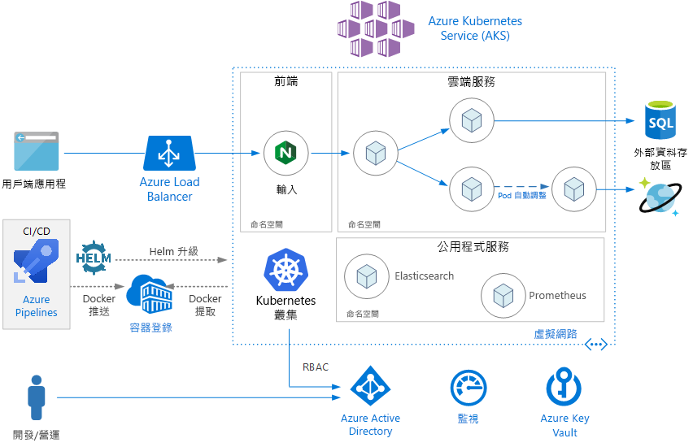
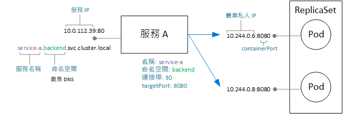
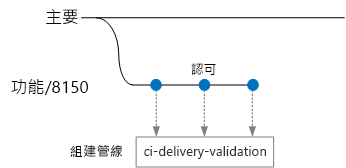
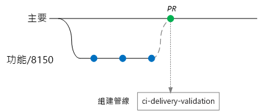
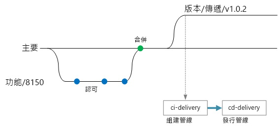

# <a name="microservices-architecture-on-azure-kubernetes-service-aks"></a>Azure Kubernetes Service (AKS) 上的微服務架構

此參考架構顯示部署至 Azure Kubernetes Service (AKS) 的微服務應用程式。 它會描述基本的 AKS 組態，可以是大多數部署的起點。 本文假設您已有 Kubernetes 的基本知識。 本文主要著重於在 AKS 上執行微服務架構的基礎結構與 DevOps 考量。 如需有關如何設計微服務的指引，請參閱[在 Azure 上建置微服務](../../microservices/index.md)。

這個架構的參考實作位於[GitHub](https://github.com/mspnp/microservices-reference-implementation)。




## <a name="architecture"></a>架構

此架構由下列元件組成。

**Azure Kubernetes Service** (AKS)。 AKS 是一項 Azure 服務，用來部署受控的 Kubernetes 叢集。 

**Kubernetes 叢集**。 AKS 負責部署 Kubernetes 叢集及管理 Kubernetes 主機。 您只需管理代理程式節點。

**虛擬網路**。 根據預設，AKS 會建立要在其中部署代理程式節點的虛擬網路。 針對更進階的案例，您可以先建立虛擬網路，以便控制子網路的設定方式、內部部署連線能力和 IP 位址等項目。 如需詳細資訊，請參閱[在 Azure Kubernetes Service (AKS) 中設定進階網路](/azure/aks/configure-advanced-networking)。

**輸入**。 輸入會將 HTTP (S) 路由公開給叢集內的服務。 如需詳細資訊，請參閱下面的 [API 閘道](#api-gateway)一節。

**外部資料存放區**。 微服務通常是無狀態，並且會將狀態寫入外部資料存放區，例如 Azure SQL Database 或 Cosmos DB。

**Azure Active Directory**。 AKS 會使用 Azure Active Directory (Azure AD) 身分識別來建立及管理其他 Azure 資源，例如 Azure 負載平衡器。 也建議您將 Azure AD 用於用戶端應用程式中的使用者驗證。

**Azure Container Registry**。 您可以使用 Container Registry 來儲存部署到叢集的私人 Docker 映像。 AKS 可以使用其 Azure AD 身分識別向 Container Registry 進行驗證。 請注意，AKS 不會要求使用 Azure Container Registry。 您可以使用其他容器登錄，例如 Docker Hub。

**Azure Pipelines**。 管線是 Azure DevOps Services 的一部分，可執行自動化組建、測試及部署。 您也可以使用 Jenkins 等第三方 CI/CD 解決方案。 

**Helm**。 Helm 是 Kubernetes 的套件管理員 &mdash; 可用來將 Kubernetes 物件組合成一個您可以發佈、部署、設定版本和更新的單元。

**Azure 監視器**。 Azure 監視器會收集並儲存計量和記錄，包括解決方案中 Azure 服務的平台計量和應用程式遙測。 您可以使用此資料來監視應用程式、設定警示和儀表板，以及對失敗執行根本原因分析。 Azure 監視器會與 AKS 整合，以收集控制器、節點和容器中的計量，以及容器記錄和主要節點記錄。

## <a name="design-considerations"></a>設計考量

雖然有許多建議做法適用於 AKS 上執行的其他工作負載，但是此參考架構著重於微服務架構。

### <a name="microservices"></a>微服務

使用 Kubernetes Service 物件為 Kubernetes 中的微服務建立模型是最自然的方式。 微服務是鬆散耦合且可獨立部署的程式碼單元。 微服務通常會透過定義完善的 API 進行通訊，並且可透過某種形式的服務探索來加以探索。 Kubernetes Service 物件會提供一組符合這些需求的功能：

- IP 位址。 Service 物件會為 Pod (ReplicaSet) 群組提供靜態內部 IP 位址。 建立或移動 Pod 時，一律可在此內部 IP 位址上連線到服務。

- 負載平衡。 傳送至服務 IP 位址的流量會負載平衡到 Pod。 

- 服務探索。 Kubernetes DNS 服務會指派內部 DNS 項目給服務。 這表示 API 閘道可以使用 DNS 名稱呼叫後端服務。 服務對服務通訊可以使用相同的機制。 DNS 項目會依據命名空間來組織，因此，如果您的命名空間對應至限界內容，則服務的 DNS 名稱自然會對應至應用程式定義域。

下圖顯示服務和 Pod 之間的概念性關聯。 端點 IP 位址和連接埠的實際對應會由 kube-proxy (Kubernetes 網路 Proxy) 來完成。



### <a name="api-gateway"></a>API Gateway

「API 閘道」是位於外部用戶端與微服務之間的閘道。 它會作為反向 Proxy，將要求從用戶端路由傳送到微服務。 它也會執行各種跨領域工作，例如驗證、SSL 終止和速率限制。 

閘道所提供的功能可以集合成一組，如下所示：

- [閘道路由](../../patterns/gateway-routing.md)：將用戶端要求路由至正確的後端服務。 這會為用戶端提供單一端點，並有助於讓用戶端與服務分離。

- [閘道彙總](../../patterns/gateway-aggregation.md)：將多個要求彙總成單一要求，以減少用戶端與後端之間的對話。

- [閘道卸載](../../patterns/gateway-offloading.md)。 閘道可從後端服務卸載功能，例如 SSL 終止、驗證、IP 允許清單或用戶端速率限制 (節流)。

API 閘道是一般的[微服務設計模式](https://microservices.io/patterns/apigateway.html)。 您可以使用數種不同的技術來實作 API 閘道。 最常見的實作可能是在叢集內部署邊緣路由器或反向 Proxy，例如 Nginx、HAProxy 或 Traefik。 

其他選項包括：

- Azure 應用程式閘道和/或 Azure API 管理，這兩者都是放置於叢集外部的受控服務。 應用程式閘道輸入控制器目前為 Beta 版。

- Azure Functions Proxy。 Proxy 可修改要求和回應，並根據 URL 路由要求。

Kubernetes 的**輸入**資源類型會擷取 Proxy 伺服器的組態設定。 其會搭配提供基礎輸入實作的輸入控制器。 適用於 Nginx、HAProxy、Traefik 和應用程式閘道 (預覽) 等的輸入控制器有很多種。

輸入控制器會處理 Proxy 伺服器的設定。 這些設定通常需要複雜的組態檔，如果您不是專家，可能很難調整這些檔案，因此輸入控制器是很好的抽象功能。 此外，輸入控制器可存取 Kubernetes API，因此可以對路由和負載平衡做出明智的決策。 例如，Nginx 輸入控制器會略過 kube-proxy 網路 Proxy。

相反地，如果您需要完全掌控設定，您可以略過此抽象功能，然後手動設定 Proxy 伺服器。 

反向 Proxy 伺服器是潛在瓶頸或單一失敗點，因此請一律部署至少兩個複本以獲得高可用性。

### <a name="data-storage"></a>資料儲存體

在微服務架構中，服務不應共用資料儲存體。 每個服務都應該將自己的私用資料放在個別邏輯儲存體，以避免服務之間有隱藏的相依性。 這是為了避免服務彼此意外結合，如果服務共用相同的基礎資料結構描述，就可能發生這種情況。 此外，若服務能管理自己的資料存放區，即可針對服務的特定需求來使用正確的資料存放區。 如需詳細資訊，請參閱[設計微服務：資料考量](/azure/architecture/microservices/data-considerations)。

請避免將永續性資料儲存在本機叢集存放區，因為這樣會將資料繫結至節點。 因此， 

- 請使用外部服務，例如 Azure SQL Database 或 Cosmos DB，或是

- 使用 Azure 磁碟或 Azure 檔案服務掛接永續性磁碟區。 如果有多個 Pod 需要共用相同的磁碟區，請使用 Azure 檔案服務。

### <a name="namespaces"></a>命名空間

您可以使用命名空間來組織叢集內的服務。 Kubernetes 叢集中的每個物件都會屬於一個命名空間。 根據預設，當您建立新的物件時，此物件會進入 `default` 命名空間。 但是較好的做法是建立更具描述性的命名空間，以協助組織叢集中的資源。

首先，命名空間有助於防止命名衝突。 當多個小組都將微服務部署到相同的叢集中時，就可能有數百個微服務，如果這些微服務都進入相同命名空間，就會變得難以管理。 此外，命名空間可讓您：

- 將資源限制套用至命名空間，如此一來，指派到該命名空間的 Pod 集合總數就不會超過命名空間的資源配額。

- 在命名空間層級上套用原則，包括 RBAC 和安全性原則。

針對微服務架構，請考慮將微服務組織到限界內容中，並為每個限界內容建立命名空間。 例如，與「訂單履行」限界內容相關的所有微服務可進入相同的命名空間。 或者，為每個開發小組建立命名空間。

將公用程式服務放入他們自己的個別命名空間中。 例如，您可能會部署 Elasticsearch 或 Prometheus 來監視叢集，或部署適用於 Helm 的 Tiller。

## <a name="scalability-considerations"></a>延展性考量

Kubernetes 支援兩個層級上的相應放大：

- 調整配置給部署的 Pod 數目。
- 調整叢集中的節點數目，以增加叢集可用的計算資源總數。

雖然您可以手動相應放大 Pod 和節點數，但我們建議您使用自動調整功能，將服務在高負載下會耗盡資源的機會降到最低。 自動調整策略必須同時將 Pod 和節點納入考量。 如果您只相應放大 Pod 數，最後會達到節點的資源限制。 

### <a name="pod-autoscaling"></a>Pod 自動調整

水平 Pod 自動調整程式 (HPA) 會根據觀察到的 CPU、記憶體或自訂計量來調整 Pod。 若要設定水平 Pod 調整，請指定目標計量 (例如，70% 的 CPU)，以及複本的最小和最大數目。 您應對服務進行負載測試，以導出這些數字。

自動調整的副作用是 Pod 可能會在發生相應放大和相應縮小事件時頻繁地建立或收回。 若要減輕這個副作用：

- 使用整備度探查讓 Kubernetes 知道新 Pod 何時可接受流量。
- 使用 Pod 中斷預算來限制服務一次可以收回幾個 Pod。

### <a name="cluster-autoscaling"></a>叢集自動調整

叢集自動調整程式可調整節點的數目。 如果由於資源限制而無法對 Pod 進行排程，則叢集自動調整程式就會佈建更多節點。  (附註：AKS 與叢集自動調整程式之間的整合目前為預覽狀態。)

HPA 會查看實際耗用的資源或執行中 Pod 的其他計量，而叢集自動調整程式會為尚未進行排程的 Pod 佈建節點。 因此，自動調整程式會查看部署中 Kubernetes Pod 規格上所指定的要求資源。 使用負載測試來微調這些值。

您無法在建立叢集後變更 VM 大小，因此應該先進行一些初步容量規劃，以選擇適當的 VM 大小作為建立叢集時的代理程式節點。 

## <a name="availability-considerations"></a>可用性考量

### <a name="health-probes"></a>健康狀態探查

Kubernetes 會定義兩種可由 Pod 公開的健康情況探查類型：

- 整備度探查：告訴 Kubernetes Pod 是否準備好接受要求。

- 活躍度探查：告訴 Kubernetes 是否應移除 Pod，以及是否有新的執行個體啟動。

考慮使用哪個探查時，回想服務在 Kubernetes 中的運作方式可協助您做決定。 服務會有符合一組 (零或多個) Pod 的標籤選取器。 Kubernetes 會將流量負載平衡至符合選取器的 Pod。 只有成功啟動且狀況良好的 Pod 會接收流量。 如果容器損毀，Kubernetes 會終止 Pod，並安排取代事宜。

有時候，即使已成功啟動 Pod，Pod 仍可能尚未準備好接收流量。 例如，可能有初始設定工作，像是在容器中執行的應用程式要將項目載入記憶體或讀取設定資料。 若要指出 Pod 健康情況良好但未準備好接收流量，可定義整備度探查。 

活躍度探查所處理的狀況是，Pod 仍在執行但狀況不良，而且應該回收。 例如，假設容器正在處理 HTTP 要求，但因為某些原因而停止回應。 容器沒有損毀，但已停止處理任何要求。 如果您定義 HTTP 活躍度探查，探查將會停止回應，並通知 Kubernetes 重新啟動 Pod。

以下是設計探查時的一些考量：

- 如果您程式碼的啟動時間很長，則會有活躍度探查在啟動完成之前即回報失敗的風險。 若要避免這個問題，請使用 initialDelaySeconds 設定，這會延遲啟動探查。

- 除非重新啟動 Pod 就有可能將 Pod 還原到狀況良好的狀態，否則活躍度探查並無幫助。 您可以使用活躍度探查來避免記憶體遺漏或未預期的鎖死，但重新啟動立即會再次失敗的 Pod 並無意義。

- 有時候，整備度探查會用來檢查相依的服務。 例如，如果 Pod 在資料庫上有相依性，活躍度探查可能會檢查資料庫連線。 不過，此方法可能產生非預期的問題。 外部服務可能會因為某些原因而暫時無法使用。 這會造成服務中所有 Pod 的整備度探查失敗，造成負載平衡中的所有 Pod 遭到移除，並因此在上游產生連鎖性失敗。 更好的方法是在您服務中實作重試處理，讓您的服務可以正確地從暫時性失敗中復原。

### <a name="resource-constraints"></a>資源限制

資源爭用可能會影響服務的可用性。 請為容器定義資源限制，以免單一容器拖垮叢集資源 (記憶體和 CPU)。 針對非容器資源 (例如執行緒或網路連線)，請考慮使用[隔艙模式](/azure/architecture/patterns/bulkhead)來隔離資源。

使用資源配額來限制命名空間允許的資源總數。 如此一來，前端就不能占用後端服務的資源，反之亦然。

## <a name="security-considerations"></a>安全性考量

### <a name="role-based-access-control-rbac"></a>角色型存取控制 (RBAC)

Kubernetes 和 Azure 均有角色型存取控制 (RBAC) 的機制：

- Azure RBAC 會控制 Azure 中的資源存取權，包括建立新 Azure 資源的能力。 權限可以指派給使用者、群組或服務主體。 (服務主體是由應用程式所使用的安全性身分識別)。

- Kubernetes RBAC 會控制 Kubernetes API 的權限。 例如，建立 Pod 和列出 Pod 都是可透過 RBAC 來允許 (或拒絕) 使用者執行的動作。 若要將 Kubernetes 權限指派給使用者，您可以建立「角色」和「角色繫結」：

  - 角色是可在命名空間內套用的一組權限。 權限會定義為資源 (Pod 和部署等) 上的動詞命令 (取得、更新、建立、刪除)。

  - RoleBinding 會將使用者或群組指派給角色 (Role)。

  - 另外還有 ClusterRole 物件，這類似於角色，但會套用到所有命名空間上的整個叢集。 若要將使用者或群組指派給 ClusterRole，請建立 ClusterRoleBinding。

AKS 會整合這兩種 RBAC 機制。 建立 AKS 叢集時，您可以將其設定為使用 Azure AD 進行使用者驗證。 如需如何設定此動作的詳細資料，請參閱[整合 Azure Active Directory 與 Azure Kubernetes Service](/azure/aks/aad-integration)。

完成此設定之後，想要存取 Kubernetes API (例如，透過 kubectl) 的使用者必須先使用其 Azure AD 認證登入。

根據預設，Azure AD 使用者沒有叢集的存取權。 若要授與存取權，叢集管理員會建立參照 Azure AD 使用者或群組的 RoleBindings。 如果使用者沒有執行特定作業的權限，則此動作會失敗。

如果使用者預設為沒有存取權，那麼叢集管理員怎麼有權限先建立角色繫結？ AKS 叢集實際上有兩種用來呼叫 Kubernetes API 伺服器的認證類型：叢集使用者和叢集管理員。叢集管理員認證會授與叢集的完整存取。 Azure CLI 命令 `az aks get-credentials --admin` 會下載叢集管理員認證，並將其儲存到您的 kubeconfig 檔案。 叢集管理員可以使用此 kubeconfig 來建立角色和角色繫結。

由於叢集管理員認證的功能強大，因此使用 Azure RBAC 來限制其存取權：

- 「Azure Kubernetes Service 叢集管理員角色」有權下載叢集管理員認證。 您應只將叢集管理員指派給此角色。

- 「Azure Kubernetes Service 叢集使用者角色」有權下載叢集使用者認證。 您可以將非管理員的使用者指派給這個角色。 此角色不會在叢集內的 Kubernetes 資源上提供任何特定權限 &mdash; 此角色只能讓使用者連線至 API 伺服器。 

定義您的 RBAC 原則 (Kubernetes 和 Azure) 時，請考量您組織中的角色：

- 誰可以建立或刪除 AKS 叢集和下載管理員認證？
- 誰可以管理叢集？
- 誰可以建立或更新命名空間內的資源？

以命名空間來界定 Kubernetes RBAC 權限的範圍是個好方法，請使用 Roles 和 RoleBindings，而不是 ClusterRoles 和 ClusterRoleBindings。

最後有個問題，AKS 叢集有什麼權限可用來建立和管理 Azure 資源 (例如負載平衡器、網路功能或儲存體)。 若要使用 Azure API 驗證叢集本身，叢集會使用 Azure AD 服務主體。 如果您未在建立叢集時指定服務主體，系統會自動建立一個。 不過，先建立服務主體，再將最低的 RBAC 權限指派給該服務主體是很好的安全性做法。 如需詳細資訊，請參閱[服務主體與 Azure Kubernetes Service](/azure/aks/kubernetes-service-principal)。

### <a name="secrets-management-and-application-credentials"></a>祕密管理和應用程式認證

應用程式和服務通常需要認證，才能連線到 Azure 儲存體或 SQL Database 等外部服務。 而所面臨的挑戰是保護這些認證的安全，以免遭到洩漏。 

針對Azure 資源，其中一個選項是使用受控識別。 受控識別的概念是應用程式或服務具有儲存在 Azure AD 中的身分識別，並會使用此身分識別向 Azure 服務進行驗證。 應用程式或服務會在 Azure AD 中建立其服務主體，並使用 OAuth 2.0 權杖進行驗證。 執行程序會呼叫 localhost 位址以取得權杖。 如此一來，您就不需要儲存任何密碼或連接字串。 您可以藉由使用 [aad-pod-identity](https://github.com/Azure/aad-pod-identity) 專案將身分識別指派給個別的 Pod，以在 AKS 中使用受控識別。

目前，並非所有 Azure 服務都支援使用受控識別進行驗證。 如需支援清單，請參閱[支援 Azure AD 驗證的 Azure 服務](/azure/active-directory/managed-identities-azure-resources/services-support-msi)。

即使有受控識別，您仍可能需要儲存某些認證或其他應用程式祕密，以取得不支援受控識別的 Azure 服務、第三方服務和 API 金鑰等等。 以下是可安全儲存祕密的一些選項：

- Azure Key Vault。 在 AKS 中，您可以將 Key Vault 中的一個或多個祕密掛接為磁碟區。 磁碟區會從 Key Vault 讀取祕密。 然後 Pod 就可以讀取祕密，就像是一般的磁碟區。 如需詳細資訊，請參閱 GitHub 上的 [Kubernetes-KeyVault-FlexVolume](https://github.com/Azure/kubernetes-keyvault-flexvol) 專案。

    Pod 可使用 Pod 身分識別 (如上所述)，或使用 Azure AD 服務主體及用戶端密碼來驗證其本身。 建議使用 Pod 身分識別，因為該案例中不需要用戶端密碼。 

- HashiCorp Vault。 Kubernetes 應用程式可使用 Azure AD 受控識別向 HashiCorp Vault 進行驗證。 請參閱 [HashiCorp Vault 可使用 Azure Active Directory](https://open.microsoft.com/2018/04/10/scaling-tips-hashicorp-vault-azure-active-directory/)。 您可以將 Vault 本身部署到 Kubernetes，但建議您在應用程式叢集的個別專用叢集中執行該 Vault。 

- Kubernetes 祕密。 另一個選項是直接使用 Kubernetes 祕密。 此選項最容易設定，但仍有一些挑戰。 祕密會儲存在 etcd，這是分散式的索引鍵-值存放區。 AKS [會對 etcd 進行待用加密](https://github.com/Azure/kubernetes-kms#azure-kubernetes-service-aks)。 Microsoft 負責管理加密金鑰。

使用 HashiCorp Vault 或 Azure Key Vault 等系統有幾項優點，例如：

- 集中控制祕密。
- 確保所有祕密都會進行待用加密。
- 集中管理金鑰。
- 對祕密進行存取控制。
- 稽核

### <a name="pod-and-container-security"></a>Pod 和容器安全性

這份清單並非詳盡無遺，但這裡有一些用來保護您 Pod 和容器的建議做法： 

請勿在具特殊權限的模式下執行容器。 具特殊權限的模式可讓容器存取主機上的所有裝置。 您可以設定 Pod 的安全性原則，以禁止在具特殊權限的模式下執行容器。 

可能的話，避免在容器內的根目錄中執行處理程序。 從安全性觀點來看，容器並不會提供完全的隔離，因此最好是以沒有特殊權限的使用者身分來執行容器程序。 

將映像儲存在受信任的私人容器登錄，例如 Azure Container Registry 或 Docker Trusted Registry。 在 Kubernetes 中使用驗證許可 Webhook，以確保 Pod 只可從受信任的登錄提取映像。

使用可透過 Azure Marketplace 取得的掃描解決方案 (例如 Twistlock 和 Aqua) 掃描映像，以檢查是否有已知弱點。

使用 ACR 工作 (Azure Container Registry 的一項功能) 自動修補映像。 容器映像的建置會以階層為基礎。 基底層包含 OS 映像和應用程式架構映像，例如 ASP.NET Core 或 Node.js。 通常，應用程式開發人員會在上游建立基底映像，並由其他專案維護人員來維護。 從上游修補這些映像時，務必更新、測試及重新部署您自己的映像，以免留下任何已知的安全性弱點。 ACR 工作可協助自動化此程序。

## <a name="deployment-cicd-considerations"></a>部署 (CI/CD) 考量︰

針對微服務架構，以下是強固 CI/CD 程序的一些目標：

- 每個小組都可建置並部署獨立擁有的服務，而不會影響或干擾其他小組。

- 將新版服務部署到生產環境之前，可先部署到開發/測試/QA 環境來進行驗證。 在每個階段上強制執行品質閘門 (Quality Gate)。

- 部署新版服務時，前一版服務可並存。

- 有足夠的存取控制原則。

- 您可以信任部署到生產環境的容器映像。

### <a name="isolation-of-environments"></a>環境隔離

您部署服務時會用到多個環境，這些環境分別用於開發、煙霧測試 (Smoke Test)、整合測試、負載測試和最後的生產環境。 這些環境需要某種程度的隔離。 在 Kubernetes 中，您可以選擇實體隔離和邏輯隔離。 實體隔離表示部署到不同叢集。 邏輯隔離會使用命名空間和原則，如先前所述。

我們建議您建立專用的生產環境叢集，以及用於開發/測試環境的個別叢集。 使用邏輯隔離來區隔開發/測試叢集內的環境。 部署到開發/測試叢集的服務應一律不能存取保存商務資料的資料存放區。 

### <a name="helm"></a>Helm

請考慮使用 Helm 來管理服務的建置和部署。 Helm 的部分功能有助於實現 CI/CD，包括：

- 將特定微服務的所有 Kubernetes 物件組織到單一 Helm 圖表。
- 將圖表部署為單一 helm 命令，而不是一系列的 kubectl 命令。
- 使用語意化版本控制系統來追蹤更新和修訂，並且具有能夠復原到先前版本的功能。
- 使用範本來避免許多檔案中的資訊重複，例如標籤和選取器。
- 管理圖表之間的相依性。
- 將圖表發佈至 Helm 存放庫，例如 Azure Container Registry，並將圖表與組建管線整合。

如需有關使用 Container Registry 作為 Helm 存放庫的詳細資訊，請參閱[使用 Azure Container Registry 作為您應用程式圖表的 Helm 存放庫](/azure/container-registry/container-registry-helm-repos)。

### <a name="cicd-workflow"></a>CI/CD 工作流程

建立 CI/CD 工作流程之前，您必須知道如何結構化和管理程式碼基底。

- 小組是使用不同的存放庫或使用 monorepo (單一存放庫)？
- 您的分支策略是什麼？
- 誰可以將程式碼推送至生產環境？ 有版本管理員角色嗎？

雖然 monorepo 方法較受青睞，但這兩者都有優點和缺點。

| &nbsp; | Monorepo | 多個存放庫 |
|--------|----------|----------------|
| **優點** | 程式碼共用<br/>可更輕鬆地將程式碼及工具標準化<br/>可更輕鬆地重構程式碼<br/>可搜尋性 - 程式碼的單一檢視<br/> | 每個小組有明確擁有權<br/>可能可減少合併衝突<br/>有助於強制分離微服務 |
| **挑戰** | 共用程式碼的變更可能會影響多個微服務<br/>很可能會有合併衝突<br/>工具必須擴充為大型程式碼基底<br/>存取控制<br/>更複雜的部署程序 | 難以共用程式碼<br/>難以強制執行編碼標準<br/>相依性管理<br/>擴散的程式碼基底、不佳的探索能力<br/>缺少共用的基礎結構

在本節中，我們會以下列假設提供可能的 CI/CD 工作流程：

- 程式碼存放庫是 monorepo，包含根據微服務統整的資料夾。
- 小組的分支策略是以[主幹型開發](https://trunkbaseddevelopment.com/)為基礎。
- 小組會使用 [Azure Pipelines](/azure/devops/pipelines) 執行 CI/CD 程序。
- 小組會在 Azure Container Registry 中使用[命名空間](/azure/container-registry/container-registry-best-practices#repository-namespaces)，以區隔核准用於生產環境的映像和仍在測試中的映像。

在此範例中，開發人員正在研究稱為「遞送服務」的微服務。 (此名稱來自[此處](../../microservices/design/index.md#scenario)所述的參考實作。)在開發新功能的同時，開發人員會將程式碼簽入功能分支。



將認可推送至這個分支時會觸發微服務的 CI 組建。 依照慣例，功能分支會命名為 `feature/*`。 [組建定義檔](/azure/devops/pipelines/yaml-schema)包含依分支名稱和來源路徑篩選的觸發程序。 使用此方法，每個小組都可以有自己的組建管線。

```yaml
trigger:
  batch: true
  branches:
    include:
    - master
    - feature/*

    exclude:
    - feature/experimental/*

  paths:
     include:
     - /src/shipping/delivery/
```

此時在流程中，CI 組建會執行一些最基本的程式碼驗證：

1. 建置程式碼
1. 執行單元測試

這邊的意思是要讓建置時間保持簡短，讓開發人員可以快速取得意見反應。 開發人員會在功能可合併到主體時開啟 PR。 這會觸發另一個 CI 組建，以執行一些額外的檢查：

1. 建置程式碼
1. 執行單元測試
1. 建置執行階段容器映像
1. 在映像上執行弱點掃描



> [!NOTE]
> 在 Azure Repos 中，您可以定義[原則](/azure/devops/repos/git/branch-policies)來保護分支。 例如，原則可能需要成功的 CI 組建再加上核准者的簽核，才能合併至主體。

在某個時間點，小組已準備好部署新版的「遞送」服務。 若要這樣做，版本管理員會使用以下命名模式，從主體中建立分支：`release/<microservice name>/<semver>`。 例如： `release/delivery/v1.0.2`。
這會觸發執行上述所有步驟的完整 CI 組建，以及：

1. 將 Docker 映像推送至 Azure Container Registry。 映像會以取自分支名稱的版本號碼來標記。
2. 執行 `helm package` 即可封裝 Helm 圖表
3. 執行 `az acr helm push` 可將 Helm 套件推送至 Container Registry。

假如此組建成功完成，即會觸發使用 Azure Pipelines [發行管線](/azure/devops/pipelines/release/what-is-release-management)的部署程序。 此管線會有下列動作

1. 執行 `helm upgrade`，將 Helm 圖表部署至 QA 環境。
1. 將套件移到生產環境之前，核准者會先進行簽核。 請參閱[使用核准功能的發行部署控制](/azure/devops/pipelines/release/approvals/approvals)。
1. 為 Azure Container Registry 中的生產命名空間重新標記 Docker 映像。 例如，如果目前的標記是 `myrepo.azurecr.io/delivery:v1.0.2`，則生產標記就會是 `myrepo.azurecr.io/prod/delivery:v1.0.2`。
1. 執行 `helm upgrade`，將 Helm 圖表部署至生產環境。



請務必記住這些工作可以涵蓋在個別的微服務中 (即使是 monorepo 也一樣)，以便小組快速進行部署。 處理程序中有一些手動步驟：核准 PR、建立發行分支，以及將部署核准到生產叢集中。 這些步驟會透過原則來手動執行 &mdash; 如果組織想要的話，也可以將其完全自動化。
