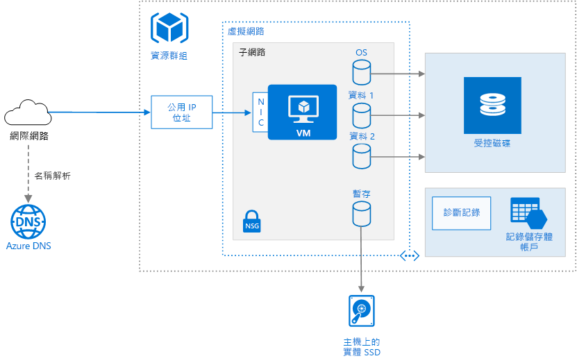

# <a name="run-a-linux-virtual-machine-on-azure"></a><span data-ttu-id="ba3fe-103">在 Azure 中執行 Linux 虛擬機器</span><span class="sxs-lookup"><span data-stu-id="ba3fe-103">Run a Linux virtual machine on Azure</span></span>

<span data-ttu-id="ba3fe-104">除了虛擬機器 (VM) 本身，佈建 VM 還需要額外的元件，包括網路功能和儲存體資源。</span><span class="sxs-lookup"><span data-stu-id="ba3fe-104">Provisioning a virtual machine (VM) in Azure requires some additional components besides the VM itself, including networking and storage resources.</span></span> <span data-ttu-id="ba3fe-105">本文將說明在 Azure 上執行 Linux VM 的最佳做法。</span><span class="sxs-lookup"><span data-stu-id="ba3fe-105">This article shows best practices for running a Linux VM on Azure.</span></span>



## <a name="resource-group"></a><span data-ttu-id="ba3fe-107">資源群組</span><span class="sxs-lookup"><span data-stu-id="ba3fe-107">Resource group</span></span>

<span data-ttu-id="ba3fe-108">[資源群組][resource-manager-overview]是保存 Azure 相關資源的本機容器。</span><span class="sxs-lookup"><span data-stu-id="ba3fe-108">A [resource group][resource-manager-overview] is a logical container that holds related Azure resources.</span></span> <span data-ttu-id="ba3fe-109">一般來說，根據資源的存留期以及將管理資源的人員來群組資源。</span><span class="sxs-lookup"><span data-stu-id="ba3fe-109">In general, group resources based on their lifetime and who will manage them.</span></span>

<span data-ttu-id="ba3fe-110">請將關係密切且具有相同生命週期的資源置於同一個[資源群組][resource-manager-overview]中。</span><span class="sxs-lookup"><span data-stu-id="ba3fe-110">Put closely associated resources that share the same lifecycle into the same [resource group][resource-manager-overview].</span></span> <span data-ttu-id="ba3fe-111">資源群組可讓您以群組為單位來部署和監視資源，並根據資源群組追蹤帳單成本。</span><span class="sxs-lookup"><span data-stu-id="ba3fe-111">Resource groups allow you to deploy and monitor resources as a group and track billing costs by resource group.</span></span> <span data-ttu-id="ba3fe-112">您也可以刪除整組資源，這對於測試部署很有用。</span><span class="sxs-lookup"><span data-stu-id="ba3fe-112">You can also delete resources as a set, which is useful for test deployments.</span></span> <span data-ttu-id="ba3fe-113">請指派有意義的資源名稱，以簡化尋找特定資源及了解其角色的程序。</span><span class="sxs-lookup"><span data-stu-id="ba3fe-113">Assign meaningful resource names to simplify locating a specific resource and understanding its role.</span></span> <span data-ttu-id="ba3fe-114">如需詳細資訊，請參閱[建議的 Azure 資源命名慣例][naming-conventions]。</span><span class="sxs-lookup"><span data-stu-id="ba3fe-114">For more information, see [Recommended Naming Conventions for Azure Resources][naming-conventions].</span></span>

## <a name="virtual-machine"></a><span data-ttu-id="ba3fe-115">虛擬機器</span><span class="sxs-lookup"><span data-stu-id="ba3fe-115">Virtual machine</span></span>

<span data-ttu-id="ba3fe-116">您可以從已發佈的映像清單、自訂的受控映像或您上傳至 Azure Blob 儲存體的虛擬硬碟 (VHD) 檔案佈建 VM。</span><span class="sxs-lookup"><span data-stu-id="ba3fe-116">You can provision a VM from a list of published images, or from a custom managed image or virtual hard disk (VHD) file uploaded to Azure Blob storage.</span></span>  <span data-ttu-id="ba3fe-117">Azure 支援執行各種受歡迎的 Linux 散發套件，包括 CentOS、Debian、Red Hat Enterprise、Ubuntu 和 FreeBSD。</span><span class="sxs-lookup"><span data-stu-id="ba3fe-117">Azure supports running various popular Linux distributions, including CentOS, Debian, Red Hat Enterprise, Ubuntu, and FreeBSD.</span></span> <span data-ttu-id="ba3fe-118">如需詳細資訊，請參閱 [Azure 和 Linux][azure-linux]。</span><span class="sxs-lookup"><span data-stu-id="ba3fe-118">For more information, see [Azure and Linux][azure-linux].</span></span>

<span data-ttu-id="ba3fe-119">Azure 提供許多不同的虛擬機器大小。</span><span class="sxs-lookup"><span data-stu-id="ba3fe-119">Azure offers many different virtual machine sizes.</span></span> <span data-ttu-id="ba3fe-120">如需相關資訊，請參閱 [Azure 中虛擬機器的大小][virtual-machine-sizes]。</span><span class="sxs-lookup"><span data-stu-id="ba3fe-120">For more information, see [Sizes for virtual machines in Azure][virtual-machine-sizes].</span></span> <span data-ttu-id="ba3fe-121">如果您將現有的工作負載移至 Azure，則從最符合您內部部署伺服器的 VM 大小開始。</span><span class="sxs-lookup"><span data-stu-id="ba3fe-121">If you are moving an existing workload to Azure, start with the VM size that's the closest match to your on-premises servers.</span></span> <span data-ttu-id="ba3fe-122">然後根據 CPU、記憶體和每秒的磁碟輸入/輸出作業 (IOPS) 測量您的實際工作負載效能，並視需要調整大小。</span><span class="sxs-lookup"><span data-stu-id="ba3fe-122">Then measure the performance of your actual workload in terms of CPU, memory, and disk input/output operations per second (IOPS), and adjust the size as needed.</span></span> 

<span data-ttu-id="ba3fe-123">一般而言，選擇最接近您的內部使用者或客戶的 Azure 區域。</span><span class="sxs-lookup"><span data-stu-id="ba3fe-123">Generally, choose an Azure region that is closest to your internal users or customers.</span></span> <span data-ttu-id="ba3fe-124">並非所有 VM 大小在所有區域都可供使用。</span><span class="sxs-lookup"><span data-stu-id="ba3fe-124">Not all VM sizes are available in all regions.</span></span> <span data-ttu-id="ba3fe-125">如需詳細資訊，請參閱[依區域提供的服務][services-by-region]。</span><span class="sxs-lookup"><span data-stu-id="ba3fe-125">For more information, see [Services by region][services-by-region].</span></span> <span data-ttu-id="ba3fe-126">如需特定區域中可用的 VM 大小清單，請從 Azure 命令列介面 (CLI) 執行下列命令：</span><span class="sxs-lookup"><span data-stu-id="ba3fe-126">For a list of the VM sizes available in a specific region, run the following command from the Azure command-line interface (CLI):</span></span>

```azurecli
az vm list-sizes --location <location>
```

<span data-ttu-id="ba3fe-127">如需選擇已發佈 VM 映像的相關資訊，請參閱[尋找 Linux VM 映像][select-vm-image]。</span><span class="sxs-lookup"><span data-stu-id="ba3fe-127">For information about choosing a published VM image, see [Find Linux VM images][select-vm-image].</span></span>

## <a name="disks"></a><span data-ttu-id="ba3fe-128">磁碟</span><span class="sxs-lookup"><span data-stu-id="ba3fe-128">Disks</span></span>

<span data-ttu-id="ba3fe-129">為了達到最佳的磁碟 I/O 效能，我們建議使用[進階儲存體][premium-storage]，這會將資料儲存在固態硬碟 (SSD)。</span><span class="sxs-lookup"><span data-stu-id="ba3fe-129">For best disk I/O performance, we recommend [Premium Storage][premium-storage], which stores data on solid-state drives (SSDs).</span></span> <span data-ttu-id="ba3fe-130">成本是依佈建的磁碟容量而定。</span><span class="sxs-lookup"><span data-stu-id="ba3fe-130">Cost is based on the capacity of the provisioned disk.</span></span> <span data-ttu-id="ba3fe-131">IOPS 和輸送量 (亦即，資料傳輸速率) 也取決於磁碟大小，因此當您佈建磁碟時，請考慮以下三個因素 (容量、IOPS 和輸送量)。</span><span class="sxs-lookup"><span data-stu-id="ba3fe-131">IOPS and throughput (that is, data transfer rate) also depend on disk size, so when you provision a disk, consider all three factors (capacity, IOPS, and throughput).</span></span>

<span data-ttu-id="ba3fe-132">我們也建議使用[受控磁碟][managed-disks]。</span><span class="sxs-lookup"><span data-stu-id="ba3fe-132">We also recommend using [Managed Disks][managed-disks].</span></span> <span data-ttu-id="ba3fe-133">受控磁碟藉由為您處理儲存體來簡化磁碟管理。</span><span class="sxs-lookup"><span data-stu-id="ba3fe-133">Managed disks simplify disk management by handling the storage for you.</span></span> <span data-ttu-id="ba3fe-134">受控磁碟不需要儲存體帳戶。</span><span class="sxs-lookup"><span data-stu-id="ba3fe-134">Managed disks do not require a storage account.</span></span> <span data-ttu-id="ba3fe-135">您只需指定磁碟的大小和類型，它就會以高度可用的資源方式進行部署</span><span class="sxs-lookup"><span data-stu-id="ba3fe-135">You simply specify the size and type of disk and it is deployed as a highly available resource</span></span>

<span data-ttu-id="ba3fe-136">作業系統磁碟是儲存在 [Azure 儲存體][azure-storage]中的 VHD，因此即使主機電腦已關閉仍會保存下來。</span><span class="sxs-lookup"><span data-stu-id="ba3fe-136">The OS disk is a VHD stored in [Azure Storage][azure-storage], so it persists even when the host machine is down.</span></span>  <span data-ttu-id="ba3fe-137">對於 Linux VM，作業系統磁碟是 `/dev/sda1`。</span><span class="sxs-lookup"><span data-stu-id="ba3fe-137">For Linux VMs, the OS disk is `/dev/sda1`.</span></span> <span data-ttu-id="ba3fe-138">我們也建議建立一或多個[資料磁碟][data-disk]，這些是用於應用程式資料的持續性 VHD。</span><span class="sxs-lookup"><span data-stu-id="ba3fe-138">We also recommend creating one or more [data disks][data-disk], which are persistent VHDs used for application data.</span></span>

<span data-ttu-id="ba3fe-139">當您建立 VHD 時，它仍未格式化。</span><span class="sxs-lookup"><span data-stu-id="ba3fe-139">When you create a VHD, it is unformatted.</span></span> <span data-ttu-id="ba3fe-140">登入 VM 來格式化磁碟。</span><span class="sxs-lookup"><span data-stu-id="ba3fe-140">Log into the VM to format the disk.</span></span> <span data-ttu-id="ba3fe-141">在 Linux 殼層中，資料磁碟會顯示為`/dev/sdc``/dev/sdd` 等等。</span><span class="sxs-lookup"><span data-stu-id="ba3fe-141">In the Linux shell, data disks are displayed as `/dev/sdc`, `/dev/sdd`, and so on.</span></span> <span data-ttu-id="ba3fe-142">您可以執行 `lsblk` 以列出區塊裝置，包括磁碟。</span><span class="sxs-lookup"><span data-stu-id="ba3fe-142">You can run `lsblk` to list the block devices, including the disks.</span></span> <span data-ttu-id="ba3fe-143">若要使用資料磁碟，請建立磁碟分割和檔案系統，並掛接該磁碟。</span><span class="sxs-lookup"><span data-stu-id="ba3fe-143">To use a data disk, create a partition and file system, and mount the disk.</span></span> <span data-ttu-id="ba3fe-144">例如︰</span><span class="sxs-lookup"><span data-stu-id="ba3fe-144">For example:</span></span>

```bash
# Create a partition.
sudo fdisk /dev/sdc     # Enter 'n' to partition, 'w' to write the change.

# Create a file system.
sudo mkfs -t ext3 /dev/sdc1

# Mount the drive.
sudo mkdir /data1
sudo mount /dev/sdc1 /data1
```

<span data-ttu-id="ba3fe-145">當您新增資料磁碟時，會指派邏輯單元編號 (LUN) 識別碼給磁碟。</span><span class="sxs-lookup"><span data-stu-id="ba3fe-145">When you add a data disk, a logical unit number (LUN) ID is assigned to the disk.</span></span> <span data-ttu-id="ba3fe-146">或者，您可以指定 LUN 識別碼 &mdash; 例如，如果您要更換磁碟，而且想要保留相同的 LUN 識別碼，或者您有會查看特定 LUN 識別碼的應用程式。</span><span class="sxs-lookup"><span data-stu-id="ba3fe-146">Optionally, you can specify the LUN ID &mdash; for example, if you're replacing a disk and want to retain the same LUN ID, or you have an application that looks for a specific LUN ID.</span></span> <span data-ttu-id="ba3fe-147">不過，請記住，每個磁碟的 LUN 識別碼不能重複。</span><span class="sxs-lookup"><span data-stu-id="ba3fe-147">However, remember that LUN IDs must be unique for each disk.</span></span>

<span data-ttu-id="ba3fe-148">您可能會想變更 I/O 排程器以將 SSD 上的效能最佳化，因為具有進階儲存體帳戶的 VM 磁碟為 SSD。</span><span class="sxs-lookup"><span data-stu-id="ba3fe-148">You may want to change the I/O scheduler to optimize for performance on SSDs because the disks for VMs with premium storage accounts are SSDs.</span></span> <span data-ttu-id="ba3fe-149">一般建議是使用適用於 SSD 的 NOOP 排程器，但您應該使用 [iostat] 之類的工具，來監視工作負載的磁碟 I/O 效能。</span><span class="sxs-lookup"><span data-stu-id="ba3fe-149">A common recommendation is to use the NOOP scheduler for SSDs, but you should use a tool such as [iostat] to monitor disk I/O performance for your workload.</span></span>

<span data-ttu-id="ba3fe-150">VM 是使用暫存磁碟來建立。</span><span class="sxs-lookup"><span data-stu-id="ba3fe-150">The VM is created with a temporary disk.</span></span> <span data-ttu-id="ba3fe-151">此磁碟會儲存在主機電腦的實體磁碟機上。</span><span class="sxs-lookup"><span data-stu-id="ba3fe-151">This disk is stored on a physical drive on the host machine.</span></span> <span data-ttu-id="ba3fe-152">它「不會」儲存在 Azure 儲存體中，而且可能在重新開機期間和其他 VM 生命週期事件中遭到刪除。</span><span class="sxs-lookup"><span data-stu-id="ba3fe-152">It is *not* saved in Azure Storage and may be deleted during reboots and other VM lifecycle events.</span></span> <span data-ttu-id="ba3fe-153">僅將此磁碟使用於暫存資料，例如分頁檔或交換檔。</span><span class="sxs-lookup"><span data-stu-id="ba3fe-153">Use this disk only for temporary data, such as page or swap files.</span></span> <span data-ttu-id="ba3fe-154">對於 Linux VM，暫存磁碟為 `/dev/sdb1` 且掛接於 `/mnt/resource` 或 `/mnt`。</span><span class="sxs-lookup"><span data-stu-id="ba3fe-154">For Linux VMs, the temporary disk is `/dev/sdb1` and is mounted at `/mnt/resource` or `/mnt`.</span></span>

## <a name="network"></a><span data-ttu-id="ba3fe-155">網路</span><span class="sxs-lookup"><span data-stu-id="ba3fe-155">Network</span></span>

<span data-ttu-id="ba3fe-156">網路元件包括下列資源：</span><span class="sxs-lookup"><span data-stu-id="ba3fe-156">The networking components include the following resources:</span></span>

- <span data-ttu-id="ba3fe-157">**虛擬網路**。</span><span class="sxs-lookup"><span data-stu-id="ba3fe-157">**Virtual network**.</span></span> <span data-ttu-id="ba3fe-158">每部 VM 都會部署到可以分割成多個子網路的虛擬網路。</span><span class="sxs-lookup"><span data-stu-id="ba3fe-158">Every VM is deployed into a virtual network that can be segmented into multiple subnets.</span></span>

- <span data-ttu-id="ba3fe-159">**網路介面 (NIC)**。</span><span class="sxs-lookup"><span data-stu-id="ba3fe-159">**Network interface (NIC)**.</span></span> <span data-ttu-id="ba3fe-160">NIC 可讓 VM 與虛擬網路通訊。</span><span class="sxs-lookup"><span data-stu-id="ba3fe-160">The NIC enables the VM to communicate with the virtual network.</span></span> <span data-ttu-id="ba3fe-161">如果您的 VM 需要多個 NIC，請注意每種 [VM 大小][vm-size-tables]都有定義 NIC 的數目上限。</span><span class="sxs-lookup"><span data-stu-id="ba3fe-161">If you need multiple NICs for your VM, be aware that a maximum number of NICs is defined for each [VM size][vm-size-tables].</span></span>

- <span data-ttu-id="ba3fe-162">**公用 IP 位址**。</span><span class="sxs-lookup"><span data-stu-id="ba3fe-162">**Public IP address**.</span></span> <span data-ttu-id="ba3fe-163">必須要有公用 IP 位址才能與 VM &mdash; 進行通訊，例如透過遠端桌面 (RDP)。</span><span class="sxs-lookup"><span data-stu-id="ba3fe-163">A public IP address is needed to communicate with the VM &mdash; for example, via remote desktop (RDP).</span></span> <span data-ttu-id="ba3fe-164">此公用 IP 位址可以是動態或靜態。</span><span class="sxs-lookup"><span data-stu-id="ba3fe-164">The public IP address can be dynamic or static.</span></span> <span data-ttu-id="ba3fe-165">預設值為動態。</span><span class="sxs-lookup"><span data-stu-id="ba3fe-165">The default is dynamic.</span></span>

- <span data-ttu-id="ba3fe-166">若您需要一個不會變更 &mdash; 的固定 IP 位址 (例如，若您需要建立 DNS「A」記錄，或將 IP 位址新增到安全清單中)，請保留一個[靜態 IP 位址][static-ip]。</span><span class="sxs-lookup"><span data-stu-id="ba3fe-166">Reserve a [static IP address][static-ip] if you need a fixed IP address that won't change &mdash; for example, if you need to create a DNS 'A' record or add the IP address to a safe list.</span></span>
- <span data-ttu-id="ba3fe-167">您也可以建立 IP 位址的完整網域名稱 (FQDN)。</span><span class="sxs-lookup"><span data-stu-id="ba3fe-167">You can also create a fully qualified domain name (FQDN) for the IP address.</span></span> <span data-ttu-id="ba3fe-168">然後您可以在 DNS 中註冊指向該 FQDN 的 [CNAME 記錄][cname-record]。</span><span class="sxs-lookup"><span data-stu-id="ba3fe-168">You can then register a [CNAME record][cname-record] in DNS that points to the FQDN.</span></span> <span data-ttu-id="ba3fe-169">如需詳細資訊，請參閱[在 Azure 入口網站中建立完整網域名稱][fqdn]。</span><span class="sxs-lookup"><span data-stu-id="ba3fe-169">For more information, see [Create a fully qualified domain name in the Azure portal][fqdn].</span></span>

- <span data-ttu-id="ba3fe-170">**網路安全性群組 (NSG)**。</span><span class="sxs-lookup"><span data-stu-id="ba3fe-170">**Network security group (NSG)**.</span></span> <span data-ttu-id="ba3fe-171">[網路安全性群組][nsg]可用來允許或拒絕 VM 的網路流量。</span><span class="sxs-lookup"><span data-stu-id="ba3fe-171">[Network security groups][nsg] are used to allow or deny network traffic to VMs.</span></span> <span data-ttu-id="ba3fe-172">NSG 可與子網路或個別 VM 執行個體相關聯。</span><span class="sxs-lookup"><span data-stu-id="ba3fe-172">NSGs can be associated either with subnets or with individual VM instances.</span></span>

<span data-ttu-id="ba3fe-173">所有 NSG 都包含一組[預設規則][nsg-default-rules]，包括一個封鎖所有網際網路輸入流量的規則。</span><span class="sxs-lookup"><span data-stu-id="ba3fe-173">All NSGs contain a set of [default rules][nsg-default-rules], including a rule that blocks all inbound Internet traffic.</span></span> <span data-ttu-id="ba3fe-174">預設的規則不能刪除，但其他規則可以覆寫它們。</span><span class="sxs-lookup"><span data-stu-id="ba3fe-174">The default rules cannot be deleted, but other rules can override them.</span></span> <span data-ttu-id="ba3fe-175">若要啟用網際網路流量，請建立允許輸入流量輸入特定連接埠的規則 &mdash; 例如，允許連接埠 80 用於 HTTP。</span><span class="sxs-lookup"><span data-stu-id="ba3fe-175">To enable Internet traffic, create rules that allow inbound traffic to specific ports &mdash; for example, port 80 for HTTP.</span></span> <span data-ttu-id="ba3fe-176">若要啟用 SSH，請新增一個 NSG 規則，以允許將輸入流量輸入至 TCP 連接埠 22。</span><span class="sxs-lookup"><span data-stu-id="ba3fe-176">To enable SSH, add an NSG rule that allows inbound traffic to TCP port 22.</span></span>

## <a name="operations"></a><span data-ttu-id="ba3fe-177">作業</span><span class="sxs-lookup"><span data-stu-id="ba3fe-177">Operations</span></span>

<span data-ttu-id="ba3fe-178">**SSH**。</span><span class="sxs-lookup"><span data-stu-id="ba3fe-178">**SSH**.</span></span> <span data-ttu-id="ba3fe-179">在您建立 VM 之前，先產生 2048 位元 RSA 公開-私密金鑰組。</span><span class="sxs-lookup"><span data-stu-id="ba3fe-179">Before you create a Linux VM, generate a 2048-bit RSA public-private key pair.</span></span> <span data-ttu-id="ba3fe-180">建立 VM 的時候使用公開金鑰檔案。</span><span class="sxs-lookup"><span data-stu-id="ba3fe-180">Use the public key file when you create the VM.</span></span> <span data-ttu-id="ba3fe-181">如需詳細資訊，請參閱[如何在 Azure 上搭配 Linux 與 Mac 使用 SSH][ssh-linux]。</span><span class="sxs-lookup"><span data-stu-id="ba3fe-181">For more information, see [How to Use SSH with Linux and Mac on Azure][ssh-linux].</span></span>

<span data-ttu-id="ba3fe-182">**診斷**。</span><span class="sxs-lookup"><span data-stu-id="ba3fe-182">**Diagnostics**.</span></span> <span data-ttu-id="ba3fe-183">啟用監視和診斷，包括基本健全狀況度量、診斷基礎結構記錄檔及[開機診斷][boot-diagnostics]。</span><span class="sxs-lookup"><span data-stu-id="ba3fe-183">Enable monitoring and diagnostics, including basic health metrics, diagnostics infrastructure logs, and [boot diagnostics][boot-diagnostics].</span></span> <span data-ttu-id="ba3fe-184">如果您的 VM 進入無法開機的狀態，開機診斷能協助您診斷開機失敗。</span><span class="sxs-lookup"><span data-stu-id="ba3fe-184">Boot diagnostics can help you diagnose boot failure if your VM gets into a non-bootable state.</span></span> <span data-ttu-id="ba3fe-185">建立用來儲存記錄的 Azure 儲存體帳戶。</span><span class="sxs-lookup"><span data-stu-id="ba3fe-185">Create an Azure Storage account to store the logs.</span></span> <span data-ttu-id="ba3fe-186">標準本地備援儲存體 (LRS) 帳戶已足以保存診斷記錄。</span><span class="sxs-lookup"><span data-stu-id="ba3fe-186">A standard locally redundant storage (LRS) account is sufficient for diagnostic logs.</span></span> <span data-ttu-id="ba3fe-187">如需詳細資訊，請參閱[啟用監視和診斷][enable-monitoring]。</span><span class="sxs-lookup"><span data-stu-id="ba3fe-187">For more information, see [Enable monitoring and diagnostics][enable-monitoring].</span></span>

<span data-ttu-id="ba3fe-188">**可用性**。</span><span class="sxs-lookup"><span data-stu-id="ba3fe-188">**Availability**.</span></span> <span data-ttu-id="ba3fe-189">您的 VM 可能會受到[計劃性維護][planned-maintenance]或[非計劃性停機][manage-vm-availability]的影響。</span><span class="sxs-lookup"><span data-stu-id="ba3fe-189">Your VM may be affected by [planned maintenance][planned-maintenance] or [unplanned downtime][manage-vm-availability].</span></span> <span data-ttu-id="ba3fe-190">您可以使用 [VM 重新啟動記錄檔][reboot-logs]來判斷 VM 重新啟動是否是因為計劃性維護所造成。</span><span class="sxs-lookup"><span data-stu-id="ba3fe-190">You can use [VM reboot logs][reboot-logs] to determine whether a VM reboot was caused by planned maintenance.</span></span> <span data-ttu-id="ba3fe-191">若要擁有較高的可用性，請在[可用性設定組](/azure/virtual-machines/linux/manage-availability#configure-multiple-virtual-machines-in-an-availability-set-for-redundancy)中部署多個 VM。</span><span class="sxs-lookup"><span data-stu-id="ba3fe-191">For higher availability, deploy multiple VMs in an [availability set](/azure/virtual-machines/linux/manage-availability#configure-multiple-virtual-machines-in-an-availability-set-for-redundancy).</span></span> <span data-ttu-id="ba3fe-192">此設定會提供較高的[服務等級協定 (SLA)][vm-sla]。</span><span class="sxs-lookup"><span data-stu-id="ba3fe-192">This configuration provides a higher [service level agreement (SLA)][vm-sla].</span></span>

<span data-ttu-id="ba3fe-193">**備份** 若要防止資料意外遺失，請使用 [Azure 備份](/azure/backup/)服務將您的 VM 備份到異地備援儲存體。</span><span class="sxs-lookup"><span data-stu-id="ba3fe-193">**Backups** To protect against accidental data loss, use the [Azure Backup](/azure/backup/) service to back up your VMs to geo-redundant storage.</span></span> <span data-ttu-id="ba3fe-194">Azure 備份提供應用程式一致的備份。</span><span class="sxs-lookup"><span data-stu-id="ba3fe-194">Azure Backup provides application-consistent backups.</span></span>

<span data-ttu-id="ba3fe-195">**停止 VM**。</span><span class="sxs-lookup"><span data-stu-id="ba3fe-195">**Stopping a VM**.</span></span> <span data-ttu-id="ba3fe-196">Azure 會區分「已停止」和「已解除配置」狀態。</span><span class="sxs-lookup"><span data-stu-id="ba3fe-196">Azure makes a distinction between "stopped" and "deallocated" states.</span></span> <span data-ttu-id="ba3fe-197">您需要在 VM 狀態停止時支付費用，而不是在取消配置 VM 時支付。</span><span class="sxs-lookup"><span data-stu-id="ba3fe-197">You are charged when the VM status is stopped, but not when the VM is deallocated.</span></span> <span data-ttu-id="ba3fe-198">在 Azure 入口網站中，[停止] 按鈕會取消配置 VM。</span><span class="sxs-lookup"><span data-stu-id="ba3fe-198">In the Azure portal, the **Stop** button deallocates the VM.</span></span> <span data-ttu-id="ba3fe-199">如果您已在登入時透過 OS 關閉，則會停止 VM，但不會取消配置，因此您仍需付費。</span><span class="sxs-lookup"><span data-stu-id="ba3fe-199">If you shut down through the OS while logged in, the VM is stopped but **not** deallocated, so you will still be charged.</span></span>

<span data-ttu-id="ba3fe-200">**刪除 VM**。</span><span class="sxs-lookup"><span data-stu-id="ba3fe-200">**Deleting a VM**.</span></span> <span data-ttu-id="ba3fe-201">如果您刪除 VM，並不會刪除 VHD。</span><span class="sxs-lookup"><span data-stu-id="ba3fe-201">If you delete a VM, the VHDs are not deleted.</span></span> <span data-ttu-id="ba3fe-202">這表示您可以放心地刪除 VM，而不會遺失任何資料。</span><span class="sxs-lookup"><span data-stu-id="ba3fe-202">That means you can safely delete the VM without losing data.</span></span> <span data-ttu-id="ba3fe-203">不過，您仍需支付儲存體費用。</span><span class="sxs-lookup"><span data-stu-id="ba3fe-203">However, you will still be charged for storage.</span></span> <span data-ttu-id="ba3fe-204">若要刪除 VHD，請將檔案從 [Blob 儲存體][blob-storage]中刪除。</span><span class="sxs-lookup"><span data-stu-id="ba3fe-204">To delete the VHD, delete the file from [Blob storage][blob-storage].</span></span> <span data-ttu-id="ba3fe-205">若要防止意外刪除，請使用[資源鎖定][resource-lock]來鎖定整個資源群組或鎖定個別資源 (例如 VM)。</span><span class="sxs-lookup"><span data-stu-id="ba3fe-205">To prevent accidental deletion, use a [resource lock][resource-lock] to lock the entire resource group or lock individual resources, such as a VM.</span></span>

## <a name="security-considerations"></a><span data-ttu-id="ba3fe-206">安全性考量</span><span class="sxs-lookup"><span data-stu-id="ba3fe-206">Security considerations</span></span>

<span data-ttu-id="ba3fe-207">使用 [Azure 資訊安全中心][security-center]來集中檢視 Azure 資源的安全性狀態。</span><span class="sxs-lookup"><span data-stu-id="ba3fe-207">Use [Azure Security Center][security-center] to get a central view of the security state of your Azure resources.</span></span> <span data-ttu-id="ba3fe-208">資訊安全中心會監視潛在的安全性問題，並提供全面性的部署安全性健康狀態。</span><span class="sxs-lookup"><span data-stu-id="ba3fe-208">Security Center monitors potential security issues and provides a comprehensive picture of the security health of your deployment.</span></span> <span data-ttu-id="ba3fe-209">資訊安全中心是依每個 Azure 訂用帳戶設定。</span><span class="sxs-lookup"><span data-stu-id="ba3fe-209">Security Center is configured per Azure subscription.</span></span> <span data-ttu-id="ba3fe-210">啟用安全性資料收集，如[將 Azure 訂用帳戶上架到資訊安全中心的標準層][security-center-get-started]中所述。</span><span class="sxs-lookup"><span data-stu-id="ba3fe-210">Enable security data collection as described in [Onboard your Azure subscription to Security Center Standard][security-center-get-started].</span></span> <span data-ttu-id="ba3fe-211">啟用資料收集時，資訊安全性中心就會自動掃描任何該訂用帳戶建立的 VM。</span><span class="sxs-lookup"><span data-stu-id="ba3fe-211">When data collection is enabled, Security Center automatically scans any VMs created under that subscription.</span></span>

<span data-ttu-id="ba3fe-212">**修補程式管理**。</span><span class="sxs-lookup"><span data-stu-id="ba3fe-212">**Patch management**.</span></span> <span data-ttu-id="ba3fe-213">若已啟用，資訊安全性中心會檢查是否遺漏了任何安全性或重要更新。</span><span class="sxs-lookup"><span data-stu-id="ba3fe-213">If enabled, Security Center checks whether any security and critical updates are missing.</span></span> <span data-ttu-id="ba3fe-214">使用 VM 上的 [群組原則設定][group-policy] 來啟用自動系統更新。</span><span class="sxs-lookup"><span data-stu-id="ba3fe-214">Use [Group Policy settings][group-policy] on the VM to enable automatic system updates.</span></span>

<span data-ttu-id="ba3fe-215">**反惡意程式碼**。</span><span class="sxs-lookup"><span data-stu-id="ba3fe-215">**Antimalware**.</span></span> <span data-ttu-id="ba3fe-216">如果啟用，資訊安全性中心會檢查是已安裝反惡意程式碼軟體。</span><span class="sxs-lookup"><span data-stu-id="ba3fe-216">If enabled, Security Center checks whether antimalware software is installed.</span></span> <span data-ttu-id="ba3fe-217">您也可以使用資訊安全中心來從 Azure 入口網站內安裝反惡意程式碼軟體。</span><span class="sxs-lookup"><span data-stu-id="ba3fe-217">You can also use Security Center to install antimalware software from inside the Azure portal.</span></span>

<span data-ttu-id="ba3fe-218">**存取控制**。</span><span class="sxs-lookup"><span data-stu-id="ba3fe-218">**Access control**.</span></span> <span data-ttu-id="ba3fe-219">請使用[角色型存取控制 (RBAC)][rbac] 來控制 Azure 資源的存取。</span><span class="sxs-lookup"><span data-stu-id="ba3fe-219">Use [role-based access control (RBAC)][rbac] to control access to Azure resources.</span></span> <span data-ttu-id="ba3fe-220">RBAC 可讓您指派授權角色給您 DevOps 小組的成員。</span><span class="sxs-lookup"><span data-stu-id="ba3fe-220">RBAC lets you assign authorization roles to members of your DevOps team.</span></span> <span data-ttu-id="ba3fe-221">例如，「讀取者」角色能檢視 Azure 資源但不能建立、管理或刪除它們。</span><span class="sxs-lookup"><span data-stu-id="ba3fe-221">For example, the Reader role can view Azure resources but not create, manage, or delete them.</span></span> <span data-ttu-id="ba3fe-222">有些權限只專屬於某個 Azure 資源類型。</span><span class="sxs-lookup"><span data-stu-id="ba3fe-222">Some permissions are specific to an Azure resource type.</span></span> <span data-ttu-id="ba3fe-223">例如，「虛擬機器參與者」角色能重新啟動或解除配置 VM、重設系統管理員密碼、建立新的 VM 等等。</span><span class="sxs-lookup"><span data-stu-id="ba3fe-223">For example, the Virtual Machine Contributor role can restart or deallocate a VM, reset the administrator password, create a new VM, and so on.</span></span> <span data-ttu-id="ba3fe-224">其他對此架構可能有用的[內建 RBAC 角色][rbac-roles]包括 [DevTest Labs 使用者][rbac-devtest]和[網路參與者][rbac-network]。</span><span class="sxs-lookup"><span data-stu-id="ba3fe-224">Other [built-in RBAC roles][rbac-roles] that may be useful for this architecture include [DevTest Labs User][rbac-devtest] and [Network Contributor][rbac-network].</span></span>

> [!NOTE]
> <span data-ttu-id="ba3fe-225">RBAC 不會限制使用者登入 VM 可執行的動作。</span><span class="sxs-lookup"><span data-stu-id="ba3fe-225">RBAC does not limit the actions that a user logged into a VM can perform.</span></span> <span data-ttu-id="ba3fe-226">這些權限是由客體 OS上的帳戶類型來決定。</span><span class="sxs-lookup"><span data-stu-id="ba3fe-226">Those permissions are determined by the account type on the guest OS.</span></span>

<span data-ttu-id="ba3fe-227">**稽核記錄**。</span><span class="sxs-lookup"><span data-stu-id="ba3fe-227">**Audit logs**.</span></span> <span data-ttu-id="ba3fe-228">使用[稽核記錄檔][audit-logs]來查看佈建動作和其他 VM 事件。</span><span class="sxs-lookup"><span data-stu-id="ba3fe-228">Use [audit logs][audit-logs] to see provisioning actions and other VM events.</span></span>

<span data-ttu-id="ba3fe-229">**資料加密**。</span><span class="sxs-lookup"><span data-stu-id="ba3fe-229">**Data encryption**.</span></span> <span data-ttu-id="ba3fe-230">如果您要加密作業系統和資料磁碟，請使用 [Azure 磁碟加密][disk-encryption]。</span><span class="sxs-lookup"><span data-stu-id="ba3fe-230">Use [Azure Disk Encryption][disk-encryption] if you need to encrypt the OS and data disks.</span></span>

## <a name="next-steps"></a><span data-ttu-id="ba3fe-231">後續步驟</span><span class="sxs-lookup"><span data-stu-id="ba3fe-231">Next steps</span></span>

- <span data-ttu-id="ba3fe-232">若要佈建 Linux VM，請參閱[使用 Azure CLI 來建立和管理 Linux VM](/azure/virtual-machines/linux/tutorial-manage-vm)</span><span class="sxs-lookup"><span data-stu-id="ba3fe-232">To provision a Linux VM, see [Create and Manage Linux VMs with the Azure CLI](/azure/virtual-machines/linux/tutorial-manage-vm)</span></span>
- <span data-ttu-id="ba3fe-233">若要了解 Linux VM 上的完整多層式架構 (N-Tier)，請參閱 [Azure 中使用 Apache Cassandra 的 Linux 多層式應用程式](./n-tier-cassandra.md)。</span><span class="sxs-lookup"><span data-stu-id="ba3fe-233">For a complete N-tier architecture on Linux VMs, see [Linux N-tier application in Azure with Apache Cassandra](./n-tier-cassandra.md).</span></span>

<!-- links -->
[audit-logs]: https://azure.microsoft.com/blog/analyze-azure-audit-logs-in-powerbi-more/
[azure-linux]: /azure/virtual-machines/virtual-machines-linux-azure-overview
[azure-storage]: /azure/storage/storage-introduction
[blob-storage]: /azure/storage/storage-introduction
[boot-diagnostics]: https://azure.microsoft.com/blog/boot-diagnostics-for-virtual-machines-v2/
[cname-record]: https://en.wikipedia.org/wiki/CNAME_record
[data-disk]: /azure/virtual-machines/virtual-machines-linux-about-disks-vhds
[disk-encryption]: /azure/security/azure-security-disk-encryption
[enable-monitoring]: /azure/monitoring-and-diagnostics/insights-how-to-use-diagnostics
[fqdn]: /azure/virtual-machines/virtual-machines-linux-portal-create-fqdn
[iostat]: https://en.wikipedia.org/wiki/Iostat
[manage-vm-availability]: /azure/virtual-machines/virtual-machines-linux-manage-availability
[managed-disks]: /azure/storage/storage-managed-disks-overview
[naming-conventions]: ../../best-practices/naming-conventions.md
[nsg]: /azure/virtual-network/virtual-networks-nsg
[nsg-default-rules]: /azure/virtual-network/virtual-networks-nsg#default-rules
[planned-maintenance]: /azure/virtual-machines/virtual-machines-linux-planned-maintenance
[premium-storage]: /azure/virtual-machines/linux/premium-storage
[rbac]: /azure/active-directory/role-based-access-control-what-is
[rbac-roles]: /azure/active-directory/role-based-access-built-in-roles
[rbac-devtest]: /azure/active-directory/role-based-access-built-in-roles#devtest-labs-user
[rbac-network]: /azure/active-directory/role-based-access-built-in-roles#network-contributor
[reboot-logs]: https://azure.microsoft.com/blog/viewing-vm-reboot-logs/
[resource-lock]: /azure/resource-group-lock-resources
[resource-manager-overview]: /azure/azure-resource-manager/resource-group-overview
[security-center]: /azure/security-center/security-center-intro
[security-center-get-started]: /azure/security-center/security-center-get-started
[select-vm-image]: /azure/virtual-machines/virtual-machines-linux-cli-ps-findimage
[services-by-region]: https://azure.microsoft.com/regions/#services
[ssh-linux]: /azure/virtual-machines/virtual-machines-linux-mac-create-ssh-keys
[static-ip]: /azure/virtual-network/virtual-networks-reserved-public-ip
[virtual-machine-sizes]: /azure/virtual-machines/virtual-machines-linux-sizes
[visio-download]: https://archcenter.blob.core.windows.net/cdn/vm-reference-architectures.vsdx
[vm-size-tables]: /azure/virtual-machines/virtual-machines-linux-sizes
[vm-sla]: https://azure.microsoft.com/support/legal/sla/virtual-machines
