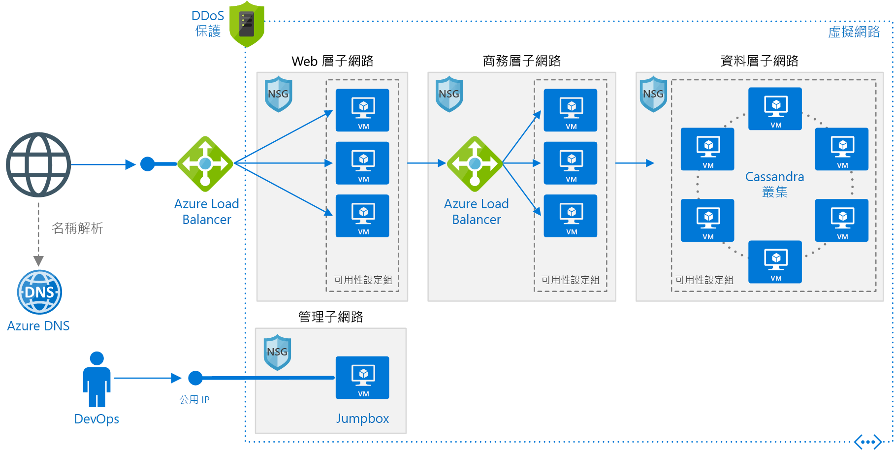

# <a name="linux-n-tier-application-in-azure-with-apache-cassandra"></a><span data-ttu-id="7e94d-103">Azure 中具有 Apache Cassandra 的 Linux 多層式架構 (N-tier) 應用程式</span><span class="sxs-lookup"><span data-stu-id="7e94d-103">Linux N-tier application in Azure with Apache Cassandra</span></span>

<span data-ttu-id="7e94d-104">此參考架構展示如何在 Linux 上使用 Apache Cassandra 作為資料層，來部署針對多層式架構 (N-Tier) 應用程式設定的虛擬機器 (VM) 和虛擬網路。</span><span class="sxs-lookup"><span data-stu-id="7e94d-104">This reference architecture shows how to deploy virtual machines (VMs) and a virtual network configured for an N-tier application, using Apache Cassandra on Linux for the data tier.</span></span> <span data-ttu-id="7e94d-105">[**部署這個解決方案**](#deploy-the-solution)。</span><span class="sxs-lookup"><span data-stu-id="7e94d-105">[**Deploy this solution**](#deploy-the-solution).</span></span>



<span data-ttu-id="7e94d-107">下載這個架構的 [Visio 檔案][visio-download]。</span><span class="sxs-lookup"><span data-stu-id="7e94d-107">*Download a [Visio file][visio-download] of this architecture.*</span></span>

## <a name="architecture"></a><span data-ttu-id="7e94d-108">架構</span><span class="sxs-lookup"><span data-stu-id="7e94d-108">Architecture</span></span>

<span data-ttu-id="7e94d-109">此架構具有下列元件：</span><span class="sxs-lookup"><span data-stu-id="7e94d-109">The architecture has the following components:</span></span>

- <span data-ttu-id="7e94d-110">**資源群組**。</span><span class="sxs-lookup"><span data-stu-id="7e94d-110">**Resource group**.</span></span> <span data-ttu-id="7e94d-111">[資源群組][resource-manager-overview]可用來將資源組合在一起，讓它們可以依存留期、擁有者或其他準則管理。</span><span class="sxs-lookup"><span data-stu-id="7e94d-111">[Resource groups][resource-manager-overview] are used to group resources so they can be managed by lifetime, owner, or other criteria.</span></span>

- <span data-ttu-id="7e94d-112">**虛擬網路 (VNet) 和子網路**。</span><span class="sxs-lookup"><span data-stu-id="7e94d-112">**Virtual network (VNet) and subnets**.</span></span> <span data-ttu-id="7e94d-113">每部 Azure VM 都會部署到可以分割成子網路的 VNet。</span><span class="sxs-lookup"><span data-stu-id="7e94d-113">Every Azure VM is deployed into a VNet that can be segmented into subnets.</span></span> <span data-ttu-id="7e94d-114">針對每一層建立不同的子網路。</span><span class="sxs-lookup"><span data-stu-id="7e94d-114">Create a separate subnet for each tier.</span></span>

- <span data-ttu-id="7e94d-115">**NSG**。</span><span class="sxs-lookup"><span data-stu-id="7e94d-115">**NSGs**.</span></span> <span data-ttu-id="7e94d-116">使用[網路安全性群組][nsg] (NSG) 來限制 VNet 內的網路流量。</span><span class="sxs-lookup"><span data-stu-id="7e94d-116">Use [network security groups][nsg] (NSGs) to restrict network traffic within the VNet.</span></span> <span data-ttu-id="7e94d-117">例如，在如下所示的三層式架構中，資料庫層接受來自 Business 層和管理子網路的流量，但不接受來自 Web 前端的流量。</span><span class="sxs-lookup"><span data-stu-id="7e94d-117">For example, in the three-tier architecture shown here, the database tier accepts traffic from the business tier and the management subnet, but not the web front end.</span></span>

- <span data-ttu-id="7e94d-118">**DDoS 保護**。</span><span class="sxs-lookup"><span data-stu-id="7e94d-118">**DDoS Protection**.</span></span> <span data-ttu-id="7e94d-119">雖然 Azure 平台提供基本的保護，可抵禦分散式阻斷服務 (DDoS) 攻擊，但我們建議您使用 [DDoS 保護標準][ddos]，其中具有增強的 DDoS 風險降低功能。</span><span class="sxs-lookup"><span data-stu-id="7e94d-119">Although the Azure platform provides basic protection against distributed denial of service (DDoS) attacks, we recommend using [DDoS Protection Standard][ddos], which has enhanced DDoS mitigation features.</span></span> <span data-ttu-id="7e94d-120">請參閱[安全性考量](#security-considerations)。</span><span class="sxs-lookup"><span data-stu-id="7e94d-120">See [Security considerations](#security-considerations).</span></span>

- <span data-ttu-id="7e94d-121">**虛擬機器**。</span><span class="sxs-lookup"><span data-stu-id="7e94d-121">**Virtual machines**.</span></span> <span data-ttu-id="7e94d-122">如需有關設定 VM 的建議，請參閱[在 Azure 上執行 Windows VM](./windows-vm.md) 和[在 Azure 上執行 Linux VM](./linux-vm.md)。</span><span class="sxs-lookup"><span data-stu-id="7e94d-122">For recommendations on configuring VMs, see [Run a Windows VM on Azure](./windows-vm.md) and [Run a Linux VM on Azure](./linux-vm.md).</span></span>

- <span data-ttu-id="7e94d-123">**可用性集合**。</span><span class="sxs-lookup"><span data-stu-id="7e94d-123">**Availability sets**.</span></span> <span data-ttu-id="7e94d-124">為每個層級建立[可用性設定組][azure-availability-sets]，並在每層中佈建至少兩部虛擬機器，可讓虛擬機器符合較高的[服務等級協定 (SLA)][vm-sla]。</span><span class="sxs-lookup"><span data-stu-id="7e94d-124">Create an [availability set][azure-availability-sets] for each tier, and provision at least two VMs in each tier, which makes the VMs eligible for a higher [service level agreement (SLA)][vm-sla].</span></span>

- <span data-ttu-id="7e94d-125">**Azure 負載平衡器**。</span><span class="sxs-lookup"><span data-stu-id="7e94d-125">**Azure load balancers**.</span></span> <span data-ttu-id="7e94d-126">[負載平衡器][load-balancer]會將連入網際網路要求散發到 VM 執行個體。</span><span class="sxs-lookup"><span data-stu-id="7e94d-126">The [load balancers][load-balancer] distribute incoming Internet requests to the VM instances.</span></span> <span data-ttu-id="7e94d-127">使用[公用負載平衡器][load-balancer-external]，可將連入的網際網路流量散發到 Web 層，使用[內部負載平衡器][load-balancer-internal]，則可將來自 Web 層的網路流量散發到 Business 層。</span><span class="sxs-lookup"><span data-stu-id="7e94d-127">Use a [public load balancer][load-balancer-external] to distribute incoming Internet traffic to the web tier, and an [internal load balancer][load-balancer-internal] to distribute network traffic from the web tier to the business tier.</span></span>

- <span data-ttu-id="7e94d-128">**公用 IP 位址**。</span><span class="sxs-lookup"><span data-stu-id="7e94d-128">**Public IP address**.</span></span> <span data-ttu-id="7e94d-129">公用負載平衡器需要公用 IP 位址才能接收網際網路流量。</span><span class="sxs-lookup"><span data-stu-id="7e94d-129">A public IP address is needed for the public load balancer to receive Internet traffic.</span></span>

- <span data-ttu-id="7e94d-130">**Jumpbox**。</span><span class="sxs-lookup"><span data-stu-id="7e94d-130">**Jumpbox**.</span></span> <span data-ttu-id="7e94d-131">也稱為[防禦主機]。</span><span class="sxs-lookup"><span data-stu-id="7e94d-131">Also called a [bastion host].</span></span> <span data-ttu-id="7e94d-132">網路上系統管理員用來連線到其他 VM 的安全 VM。</span><span class="sxs-lookup"><span data-stu-id="7e94d-132">A secure VM on the network that administrators use to connect to the other VMs.</span></span> <span data-ttu-id="7e94d-133">Jumpbox 具有 NSG，只允許來自安全清單上公用 IP 位址的遠端流量。</span><span class="sxs-lookup"><span data-stu-id="7e94d-133">The jumpbox has an NSG that allows remote traffic only from public IP addresses on a safe list.</span></span> <span data-ttu-id="7e94d-134">NSG 應允許 SSH 流量。</span><span class="sxs-lookup"><span data-stu-id="7e94d-134">The NSG should allow ssh traffic.</span></span>

- <span data-ttu-id="7e94d-135">**Apache Cassandra 資料庫**。</span><span class="sxs-lookup"><span data-stu-id="7e94d-135">**Apache Cassandra database**.</span></span> <span data-ttu-id="7e94d-136">藉由啟用複寫和容錯移轉，在資料層提供高可用性。</span><span class="sxs-lookup"><span data-stu-id="7e94d-136">Provides high availability at the data tier, by enabling replication and failover.</span></span>

- <span data-ttu-id="7e94d-137">**Azure DNS**。</span><span class="sxs-lookup"><span data-stu-id="7e94d-137">**Azure DNS**.</span></span> <span data-ttu-id="7e94d-138">[Azure DNS][azure-dns] 是適用於 DNS 網域的主機服務。</span><span class="sxs-lookup"><span data-stu-id="7e94d-138">[Azure DNS][azure-dns] is a hosting service for DNS domains.</span></span> <span data-ttu-id="7e94d-139">其使用 Microsoft Azure 基礎結構來提供名稱解析。</span><span class="sxs-lookup"><span data-stu-id="7e94d-139">It provides name resolution using Microsoft Azure infrastructure.</span></span> <span data-ttu-id="7e94d-140">只要將您的網域裝載於 Azure，就可以像管理其他 Azure 服務一樣，使用相同的認證、API、工具和計費方式來管理 DNS 記錄。</span><span class="sxs-lookup"><span data-stu-id="7e94d-140">By hosting your domains in Azure, you can manage your DNS records using the same credentials, APIs, tools, and billing as your other Azure services.</span></span>

## <a name="recommendations"></a><span data-ttu-id="7e94d-141">建議</span><span class="sxs-lookup"><span data-stu-id="7e94d-141">Recommendations</span></span>

<span data-ttu-id="7e94d-142">您的需求可能和此處所述的架構不同。</span><span class="sxs-lookup"><span data-stu-id="7e94d-142">Your requirements might differ from the architecture described here.</span></span> <span data-ttu-id="7e94d-143">請使用以下建議作為起點。</span><span class="sxs-lookup"><span data-stu-id="7e94d-143">Use these recommendations as a starting point.</span></span>

### <a name="vnet--subnets"></a><span data-ttu-id="7e94d-144">VNet / 子網路</span><span class="sxs-lookup"><span data-stu-id="7e94d-144">VNet / Subnets</span></span>

<span data-ttu-id="7e94d-145">當您建立 VNet 時，請判斷您在每個子網路中的資源需要多少個 IP 位址。</span><span class="sxs-lookup"><span data-stu-id="7e94d-145">When you create the VNet, determine how many IP addresses your resources in each subnet require.</span></span> <span data-ttu-id="7e94d-146">使用 [CIDR] 標記法，針對所需的 IP 位址指定子網路遮罩和夠大的 VNet 位址範圍。</span><span class="sxs-lookup"><span data-stu-id="7e94d-146">Specify a subnet mask and a VNet address range large enough for the required IP addresses, using [CIDR] notation.</span></span> <span data-ttu-id="7e94d-147">使用落在標準[私人 IP 位址區塊][private-ip-space]內的位址空間，其為 10.0.0.0/8、172.16.0.0/12 及 192.168.0.0/16。</span><span class="sxs-lookup"><span data-stu-id="7e94d-147">Use an address space that falls within the standard [private IP address blocks][private-ip-space], which are 10.0.0.0/8, 172.16.0.0/12, and 192.168.0.0/16.</span></span>

<span data-ttu-id="7e94d-148">選擇不會與您的內部部署網路重疊的位址範圍，以防您稍後需要在 VNet 和您的內部部署網路之間設定閘道。</span><span class="sxs-lookup"><span data-stu-id="7e94d-148">Choose an address range that doesn't overlap with your on-premises network, in case you need to set up a gateway between the VNet and your on-premise network later.</span></span> <span data-ttu-id="7e94d-149">一旦建立 VNet 之後，就無法變更位址範圍。</span><span class="sxs-lookup"><span data-stu-id="7e94d-149">Once you create the VNet, you can't change the address range.</span></span>

<span data-ttu-id="7e94d-150">請記得以功能和安全性需求來設計子網路。</span><span class="sxs-lookup"><span data-stu-id="7e94d-150">Design subnets with functionality and security requirements in mind.</span></span> <span data-ttu-id="7e94d-151">位於相同層或角色的所有 VM 都應移入相同的子網路，它可以是安全性界限。</span><span class="sxs-lookup"><span data-stu-id="7e94d-151">All VMs within the same tier or role should go into the same subnet, which can be a security boundary.</span></span> <span data-ttu-id="7e94d-152">如需設計 VNet 和子網路的詳細資訊，請參閱[規劃和設計 Azure 虛擬網路][plan-network]。</span><span class="sxs-lookup"><span data-stu-id="7e94d-152">For more information about designing VNets and subnets, see [Plan and design Azure Virtual Networks][plan-network].</span></span>

### <a name="load-balancers"></a><span data-ttu-id="7e94d-153">負載平衡器</span><span class="sxs-lookup"><span data-stu-id="7e94d-153">Load balancers</span></span>

<span data-ttu-id="7e94d-154">請勿直接向網際網路公開虛擬機器。</span><span class="sxs-lookup"><span data-stu-id="7e94d-154">Do not expose the VMs directly to the Internet.</span></span> <span data-ttu-id="7e94d-155">相反地，給每個虛擬機器私人 IP 位址。</span><span class="sxs-lookup"><span data-stu-id="7e94d-155">Instead, give each VM a private IP address.</span></span> <span data-ttu-id="7e94d-156">用戶端會使用公用負載平衡器的 IP 位址來連線。</span><span class="sxs-lookup"><span data-stu-id="7e94d-156">Clients connect using the IP address of the public load balancer.</span></span>

<span data-ttu-id="7e94d-157">定義負載平衡器規則，以將網路流量導向至 VM。</span><span class="sxs-lookup"><span data-stu-id="7e94d-157">Define load balancer rules to direct network traffic to the VMs.</span></span> <span data-ttu-id="7e94d-158">例如，若要啟用 HTTP 流量，請建立一個規則，將前端設定的連接埠 80 對應至後端位址集區的連接埠 80。</span><span class="sxs-lookup"><span data-stu-id="7e94d-158">For example, to enable HTTP traffic, create a rule that maps port 80 from the front-end configuration to port 80 on the back-end address pool.</span></span> <span data-ttu-id="7e94d-159">當用戶端將 HTTP 要求傳送到連接埠 80 時，負載平衡器會藉由使用[雜湊演算法][load-balancer-hashing] (其中包含來源 IP 位址) 來選取後端 IP 位址。</span><span class="sxs-lookup"><span data-stu-id="7e94d-159">When a client sends an HTTP request to port 80, the load balancer selects a back-end IP address by using a [hashing algorithm][load-balancer-hashing] that includes the source IP address.</span></span> <span data-ttu-id="7e94d-160">用戶端要求會散發到所有 VM。</span><span class="sxs-lookup"><span data-stu-id="7e94d-160">Client requests are distributed across all the VMs.</span></span>

### <a name="network-security-groups"></a><span data-ttu-id="7e94d-161">網路安全性群組</span><span class="sxs-lookup"><span data-stu-id="7e94d-161">Network security groups</span></span>

<span data-ttu-id="7e94d-162">使用 NSG 規則來限制各層之間的流量。</span><span class="sxs-lookup"><span data-stu-id="7e94d-162">Use NSG rules to restrict traffic between tiers.</span></span> <span data-ttu-id="7e94d-163">例如，在如上所示的三層式架構中，Web 層不會直接與資料庫層通訊。</span><span class="sxs-lookup"><span data-stu-id="7e94d-163">For example, in the three-tier architecture shown above, the web tier does not communicate directly with the database tier.</span></span> <span data-ttu-id="7e94d-164">若要強制執行此動作，資料庫層應該封鎖來自 Web 層子網路的連入流量。</span><span class="sxs-lookup"><span data-stu-id="7e94d-164">To enforce this, the database tier should block incoming traffic from the web tier subnet.</span></span>

1. <span data-ttu-id="7e94d-165">拒絕來自 VNet 的所有輸入流量。</span><span class="sxs-lookup"><span data-stu-id="7e94d-165">Deny all inbound traffic from the VNet.</span></span> <span data-ttu-id="7e94d-166">(在規則中使用 `VIRTUAL_NETWORK` 標記)。</span><span class="sxs-lookup"><span data-stu-id="7e94d-166">(Use the `VIRTUAL_NETWORK` tag in the rule.)</span></span>
2. <span data-ttu-id="7e94d-167">允許來自 Business 層子網路的輸入流量。</span><span class="sxs-lookup"><span data-stu-id="7e94d-167">Allow inbound traffic from the business tier subnet.</span></span>
3. <span data-ttu-id="7e94d-168">允許來自資料庫層子網路本身的輸入流量。</span><span class="sxs-lookup"><span data-stu-id="7e94d-168">Allow inbound traffic from the database tier subnet itself.</span></span> <span data-ttu-id="7e94d-169">此規則允許資料庫 VM 之間的通訊，是進行資料庫複寫和容錯移轉所需的。</span><span class="sxs-lookup"><span data-stu-id="7e94d-169">This rule allows communication between the database VMs, which is needed for database replication and failover.</span></span>
4. <span data-ttu-id="7e94d-170">允許來自 Jumpbox 子網路的 ssh 流量 (連接埠 22)。</span><span class="sxs-lookup"><span data-stu-id="7e94d-170">Allow ssh traffic (port 22) from the jumpbox subnet.</span></span> <span data-ttu-id="7e94d-171">此規則讓系統管理員能夠從 Jumpbox 連線到資料庫層。</span><span class="sxs-lookup"><span data-stu-id="7e94d-171">This rule lets administrators connect to the database tier from the jumpbox.</span></span>

<span data-ttu-id="7e94d-172">建立規則 2 &ndash; 4，其優先順序高於第一個規則，因此它們會覆寫它。</span><span class="sxs-lookup"><span data-stu-id="7e94d-172">Create rules 2 &ndash; 4 with higher priority than the first rule, so they override it.</span></span>

### <a name="cassandra"></a><span data-ttu-id="7e94d-173">Cassandra</span><span class="sxs-lookup"><span data-stu-id="7e94d-173">Cassandra</span></span>

<span data-ttu-id="7e94d-174">我們建議針對生產環境使用 [DataStax Enterprise][datastax]，但這些建議適用於所有的 Cassandra 版本。</span><span class="sxs-lookup"><span data-stu-id="7e94d-174">We recommend [DataStax Enterprise][datastax] for production use, but these recommendations apply to any Cassandra edition.</span></span> <span data-ttu-id="7e94d-175">如需在 Azure 中執行 DataStax 的詳細資訊，請參閱[適用於 Azure 的DataStax Enterprise 部署指南][cassandra-in-azure]。</span><span class="sxs-lookup"><span data-stu-id="7e94d-175">For more information on running DataStax in Azure, see [DataStax Enterprise Deployment Guide for Azure][cassandra-in-azure].</span></span>

<span data-ttu-id="7e94d-176">將適用於 Cassandra 叢集的 VM 放置於可用性設定組，以確保會將 Cassandra 複本散發到多個容錯網域和升級網域。</span><span class="sxs-lookup"><span data-stu-id="7e94d-176">Put the VMs for a Cassandra cluster in an availability set to ensure that the Cassandra replicas are distributed across multiple fault domains and upgrade domains.</span></span> <span data-ttu-id="7e94d-177">如需容錯網域和升級網域的詳細資訊，請參閱[管理虛擬機器的可用性][azure-availability-sets]。</span><span class="sxs-lookup"><span data-stu-id="7e94d-177">For more information about fault domains and upgrade domains, see [Manage the availability of virtual machines][azure-availability-sets].</span></span>

<span data-ttu-id="7e94d-178">針對每個可用性設定組設定三個錯誤網域 (最大值)，以及針對每個可用性設定組設定 18 個升級網域。</span><span class="sxs-lookup"><span data-stu-id="7e94d-178">Configure three fault domains (the maximum) per availability set and 18 upgrade domains per availability set.</span></span> <span data-ttu-id="7e94d-179">這提供仍能平均散發到容錯網域的升級網域數目上限。</span><span class="sxs-lookup"><span data-stu-id="7e94d-179">This provides the maximum number of upgrade domains that can still be distributed evenly across the fault domains.</span></span>

<span data-ttu-id="7e94d-180">在機架感知的模式中設定節點。</span><span class="sxs-lookup"><span data-stu-id="7e94d-180">Configure nodes in rack-aware mode.</span></span> <span data-ttu-id="7e94d-181">在 `cassandra-rackdc.properties` 檔案中，將容錯網域對應到機架。</span><span class="sxs-lookup"><span data-stu-id="7e94d-181">Map fault domains to racks in the `cassandra-rackdc.properties` file.</span></span>

<span data-ttu-id="7e94d-182">您不需要叢集前方的負載平衡器。</span><span class="sxs-lookup"><span data-stu-id="7e94d-182">You don't need a load balancer in front of the cluster.</span></span> <span data-ttu-id="7e94d-183">用戶端會直接連線至用戶端中的節點。</span><span class="sxs-lookup"><span data-stu-id="7e94d-183">The client connects directly to a node in the cluster.</span></span>

<span data-ttu-id="7e94d-184">如需高可用性，在多個 Azure 區域中部署 Cassandra。</span><span class="sxs-lookup"><span data-stu-id="7e94d-184">For high availability, deploy Cassandra in more than one Azure region.</span></span> <span data-ttu-id="7e94d-185">在每個區域中，會在機架感知的模式中使用錯誤和升級網域來設定節點，以便在區域內部提供復原能力。</span><span class="sxs-lookup"><span data-stu-id="7e94d-185">Nodes within each region are configured in rack-aware mode with fault and upgrade domains, for resiliency inside the region.</span></span>

### <a name="jumpbox"></a><span data-ttu-id="7e94d-186">Jumpbox</span><span class="sxs-lookup"><span data-stu-id="7e94d-186">Jumpbox</span></span>

<span data-ttu-id="7e94d-187">不允許從公用網際網路對執行應用程式工作負載的 VM 進行 ssh 存取。</span><span class="sxs-lookup"><span data-stu-id="7e94d-187">Don't allow ssh access from the public Internet to the VMs that run the application workload.</span></span> <span data-ttu-id="7e94d-188">對這些 VM 所做的所有 ssh 存取都必須改為透過 Jumpbox 進行。</span><span class="sxs-lookup"><span data-stu-id="7e94d-188">Instead, all ssh access to these VMs must come through the jumpbox.</span></span> <span data-ttu-id="7e94d-189">系統管理員會登入 Jumpbox，然後從 Jumpbox 登入其他 VM。</span><span class="sxs-lookup"><span data-stu-id="7e94d-189">An administrator logs into the jumpbox, and then logs into the other VM from the jumpbox.</span></span> <span data-ttu-id="7e94d-190">Jumpbox 允許來自網際網路，但只來自已知且安全 IP 位址的 ssh 流量。</span><span class="sxs-lookup"><span data-stu-id="7e94d-190">The jumpbox allows ssh traffic from the Internet, but only from known, safe IP addresses.</span></span>

<span data-ttu-id="7e94d-191">Jumpbox 有最低效能需求，因此選取小的 VM 大小。</span><span class="sxs-lookup"><span data-stu-id="7e94d-191">The jumpbox has minimal performance requirements, so select a small VM size.</span></span> <span data-ttu-id="7e94d-192">針對 Jumpbox 建立[公用 IP 位址]。</span><span class="sxs-lookup"><span data-stu-id="7e94d-192">Create a [public IP address] for the jumpbox.</span></span> <span data-ttu-id="7e94d-193">將 Jumpbox 放置於與其他 VM 相同的 VNet，但在個別的管理子網路中。</span><span class="sxs-lookup"><span data-stu-id="7e94d-193">Place the jumpbox in the same VNet as the other VMs, but in a separate management subnet.</span></span>

<span data-ttu-id="7e94d-194">若要保護 Jumpbox，請新增 NSG 規則，只允許來自一組安全公用 IP 位址的 ssh 連線。</span><span class="sxs-lookup"><span data-stu-id="7e94d-194">To secure the jumpbox, add an NSG rule that allows ssh connections only from a safe set of public IP addresses.</span></span> <span data-ttu-id="7e94d-195">設定其他子網路的 NSG，允許來自管理子網路的 ssh 流量。</span><span class="sxs-lookup"><span data-stu-id="7e94d-195">Configure the NSGs for the other subnets to allow ssh traffic from the management subnet.</span></span>

## <a name="scalability-considerations"></a><span data-ttu-id="7e94d-196">延展性考量</span><span class="sxs-lookup"><span data-stu-id="7e94d-196">Scalability considerations</span></span>

<span data-ttu-id="7e94d-197">針對 Web 和 Business 層，請考慮使用[虛擬機器擴展集][vmss]，而不是將個別虛擬機器部署至可用性設定組。</span><span class="sxs-lookup"><span data-stu-id="7e94d-197">For the web and business tiers, consider using [virtual machine scale sets][vmss], instead of deploying separate VMs into an availability set.</span></span> <span data-ttu-id="7e94d-198">擴展集可讓您輕鬆部署及管理一組完全相同的虛擬機器，並根據效能計量自動調整虛擬機器。</span><span class="sxs-lookup"><span data-stu-id="7e94d-198">A scale set makes it easy to deploy and manage a set of identical VMs, and autoscale the VMs based on performance metrics.</span></span> <span data-ttu-id="7e94d-199">當 VM 上的負載增加時，就會將其他 VM 自動新增到負載平衡器。</span><span class="sxs-lookup"><span data-stu-id="7e94d-199">As the load on the VMs increases, additional VMs are automatically added to the load balancer.</span></span> <span data-ttu-id="7e94d-200">如果您需要快速相應放大 VM 數目，或需要自動調整規模，請考慮擴展集。</span><span class="sxs-lookup"><span data-stu-id="7e94d-200">Consider scale sets if you need to quickly scale out VMs, or need to autoscale.</span></span>

<span data-ttu-id="7e94d-201">有兩種基本方法可用來設定擴展集中部署的 VM：</span><span class="sxs-lookup"><span data-stu-id="7e94d-201">There are two basic ways to configure VMs deployed in a scale set:</span></span>

- <span data-ttu-id="7e94d-202">部署虛擬機器之後，使用擴充功能來設定它。</span><span class="sxs-lookup"><span data-stu-id="7e94d-202">Use extensions to configure the VM after it's deployed.</span></span> <span data-ttu-id="7e94d-203">透過此方法，新的 VM 執行個體可能需要較長的時間來啟動不具擴充功能的 VM。</span><span class="sxs-lookup"><span data-stu-id="7e94d-203">With this approach, new VM instances may take longer to start up than a VM with no extensions.</span></span>

- <span data-ttu-id="7e94d-204">利用自訂的磁碟映像來部署[受控磁碟](/azure/storage/storage-managed-disks-overview)。</span><span class="sxs-lookup"><span data-stu-id="7e94d-204">Deploy a [managed disk](/azure/storage/storage-managed-disks-overview) with a custom disk image.</span></span> <span data-ttu-id="7e94d-205">這個選項可能會更快速地部署。</span><span class="sxs-lookup"><span data-stu-id="7e94d-205">This option may be quicker to deploy.</span></span> <span data-ttu-id="7e94d-206">不過，它會要求您讓映像保持最新狀態。</span><span class="sxs-lookup"><span data-stu-id="7e94d-206">However, it requires you to keep the image up-to-date.</span></span>

<span data-ttu-id="7e94d-207">如需詳細資訊，請參閱[擴展集的設計考量][vmss-design]。</span><span class="sxs-lookup"><span data-stu-id="7e94d-207">For more information, see [Design considerations for scale sets][vmss-design].</span></span>

> [!TIP]
> <span data-ttu-id="7e94d-208">使用任何自動調整規模解決方案時，事前也要利用生產層級的工作負載來進行測試。</span><span class="sxs-lookup"><span data-stu-id="7e94d-208">When using any autoscale solution, test it with production-level workloads well in advance.</span></span>

<span data-ttu-id="7e94d-209">每個 Azure 訂用帳戶都已經有預設限制，包括每個區域的 VM 最大數目。</span><span class="sxs-lookup"><span data-stu-id="7e94d-209">Each Azure subscription has default limits in place, including a maximum number of VMs per region.</span></span> <span data-ttu-id="7e94d-210">您可以藉由提出支援要求來提高限制。</span><span class="sxs-lookup"><span data-stu-id="7e94d-210">You can increase the limit by filing a support request.</span></span> <span data-ttu-id="7e94d-211">如需詳細資訊，請參閱 [Azure 訂用帳戶和服務限制、配額與條件約束][subscription-limits]。</span><span class="sxs-lookup"><span data-stu-id="7e94d-211">For more information, see [Azure subscription and service limits, quotas, and constraints][subscription-limits].</span></span>

## <a name="availability-considerations"></a><span data-ttu-id="7e94d-212">可用性考量</span><span class="sxs-lookup"><span data-stu-id="7e94d-212">Availability considerations</span></span>

<span data-ttu-id="7e94d-213">如果您未使用虛擬機器擴展集，請在相同層級中將虛擬機器放置於可用性設定組中。</span><span class="sxs-lookup"><span data-stu-id="7e94d-213">If you don't use virtual machine scale sets, put VMs for the same tier into an availability set.</span></span> <span data-ttu-id="7e94d-214">在可用性設定組中至少建立兩部 VM，以支援[適用於 Azure VM 的可用性 SLA][vm-sla]。</span><span class="sxs-lookup"><span data-stu-id="7e94d-214">Create at least two VMs in the availability set to support the [availability SLA for Azure VMs][vm-sla].</span></span> <span data-ttu-id="7e94d-215">如需詳細資訊，請參閱[管理虛擬機器的可用性][availability-set]。</span><span class="sxs-lookup"><span data-stu-id="7e94d-215">For more information, see [Manage the availability of virtual machines][availability-set].</span></span> <span data-ttu-id="7e94d-216">擴展集會自動使用*放置群組*，其可做為隱含的可用性設定組。</span><span class="sxs-lookup"><span data-stu-id="7e94d-216">Scale sets automatically use *placement groups*, which act as an implicit availability set.</span></span>

<span data-ttu-id="7e94d-217">負載平衡器會使用[健康情況探查][health-probes]來監視 VM 執行個體的可用性。</span><span class="sxs-lookup"><span data-stu-id="7e94d-217">The load balancer uses [health probes][health-probes] to monitor the availability of VM instances.</span></span> <span data-ttu-id="7e94d-218">如果探查無法在逾時期間內連線到執行個體，負載平衡器就會停止將流量傳送到該 VM。</span><span class="sxs-lookup"><span data-stu-id="7e94d-218">If a probe can't reach an instance within a timeout period, the load balancer stops sending traffic to that VM.</span></span> <span data-ttu-id="7e94d-219">負載平衡器將會繼續探查，而且如果 VM 再次變成可用，負載平衡器就會繼續將流量傳送到該 VM。</span><span class="sxs-lookup"><span data-stu-id="7e94d-219">The load balancer will continue to probe, and if the VM becomes available again, the load balancer resumes sending traffic to that VM.</span></span>

<span data-ttu-id="7e94d-220">以下是關於負載平衡器健康情況探查的建議：</span><span class="sxs-lookup"><span data-stu-id="7e94d-220">Here are some recommendations on load balancer health probes:</span></span>

- <span data-ttu-id="7e94d-221">探查可以測試 HTTP 或 TCP。</span><span class="sxs-lookup"><span data-stu-id="7e94d-221">Probes can test either HTTP or TCP.</span></span> <span data-ttu-id="7e94d-222">如果您的 VM 執行 HTTP 伺服器，請建立 HTTP 探查。</span><span class="sxs-lookup"><span data-stu-id="7e94d-222">If your VMs run an HTTP server, create an HTTP probe.</span></span> <span data-ttu-id="7e94d-223">否則，建立 TCP 探查。</span><span class="sxs-lookup"><span data-stu-id="7e94d-223">Otherwise create a TCP probe.</span></span>
- <span data-ttu-id="7e94d-224">針對 HTTP 探查，指定 HTTP 端點的路徑。</span><span class="sxs-lookup"><span data-stu-id="7e94d-224">For an HTTP probe, specify the path to an HTTP endpoint.</span></span> <span data-ttu-id="7e94d-225">探查會檢查來自此路徑的 HTTP 200 回應。</span><span class="sxs-lookup"><span data-stu-id="7e94d-225">The probe checks for an HTTP 200 response from this path.</span></span> <span data-ttu-id="7e94d-226">這可以是根路徑 ("/")，或是實作一些自訂邏輯來檢查應用程式健康情況的健康情況監視端點。</span><span class="sxs-lookup"><span data-stu-id="7e94d-226">This can be the root path ("/"), or a health-monitoring endpoint that implements some custom logic to check the health of the application.</span></span> <span data-ttu-id="7e94d-227">端點必須允許匿名的 HTTP 要求。</span><span class="sxs-lookup"><span data-stu-id="7e94d-227">The endpoint must allow anonymous HTTP requests.</span></span>
- <span data-ttu-id="7e94d-228">探查會從[已知的 IP 位址][health-probe-ip] 168.63.129.16 傳送出來。</span><span class="sxs-lookup"><span data-stu-id="7e94d-228">The probe is sent from a [known IP address][health-probe-ip], 168.63.129.16.</span></span> <span data-ttu-id="7e94d-229">請確認您未在任何防火牆原則或 NSG 規則中封鎖往返此 IP 位址的流量。</span><span class="sxs-lookup"><span data-stu-id="7e94d-229">Make sure you don't block traffic to or from this IP address in any firewall policies or NSG rules.</span></span>
- <span data-ttu-id="7e94d-230">使用[健康情況探查記錄][health-probe-log]來檢視健康情況探查的狀態。</span><span class="sxs-lookup"><span data-stu-id="7e94d-230">Use [health probe logs][health-probe-log] to view the status of the health probes.</span></span> <span data-ttu-id="7e94d-231">能夠針對每個負載平衡器登入 Azure 入口網站。</span><span class="sxs-lookup"><span data-stu-id="7e94d-231">Enable logging in the Azure portal for each load balancer.</span></span> <span data-ttu-id="7e94d-232">記錄會寫入 Azure Blob 儲存體。</span><span class="sxs-lookup"><span data-stu-id="7e94d-232">Logs are written to Azure Blob storage.</span></span> <span data-ttu-id="7e94d-233">記錄會顯示多少虛擬機器因探查回應失敗而未取得網路流量。</span><span class="sxs-lookup"><span data-stu-id="7e94d-233">The logs show how many VMs aren't getting network traffic because of failed probe responses.</span></span>

<span data-ttu-id="7e94d-234">針對 Cassandra 叢集，容錯移轉案例取決於應用程式所使用的一致性層級，以及複本數目。</span><span class="sxs-lookup"><span data-stu-id="7e94d-234">For the Cassandra cluster, the failover scenarios depend on the consistency levels used by the application and the number of replicas.</span></span> <span data-ttu-id="7e94d-235">如需 Cassandra 中的一致性層級和使用方式，請參閱[設定資料一致性][cassandra-consistency]和 [Cassandra：有多少節點會與仲裁交談？][cassandra-consistency-usage]</span><span class="sxs-lookup"><span data-stu-id="7e94d-235">For consistency levels and usage in Cassandra, see [Configuring data consistency][cassandra-consistency] and [Cassandra: How many nodes are talked to with Quorum?][cassandra-consistency-usage]</span></span> <span data-ttu-id="7e94d-236">Cassandra 中的資料可用性取決於應用程式所使用的一致性層級和複寫機制。</span><span class="sxs-lookup"><span data-stu-id="7e94d-236">Data availability in Cassandra is determined by the consistency level used by the application and the replication mechanism.</span></span> <span data-ttu-id="7e94d-237">如需 Cassandra 中的複寫，請參閱 [NoSQL 資料庫的資料複寫說明][cassandra-replication]。</span><span class="sxs-lookup"><span data-stu-id="7e94d-237">For replication in Cassandra, see [Data Replication in NoSQL Databases Explained][cassandra-replication].</span></span>

## <a name="security-considerations"></a><span data-ttu-id="7e94d-238">安全性考量</span><span class="sxs-lookup"><span data-stu-id="7e94d-238">Security considerations</span></span>

<span data-ttu-id="7e94d-239">虛擬網路是 Azure 中的流量隔離界限。</span><span class="sxs-lookup"><span data-stu-id="7e94d-239">Virtual networks are a traffic isolation boundary in Azure.</span></span> <span data-ttu-id="7e94d-240">某一個 VNet 中的 VM 無法直接與不同 VNet 中的 VM 通訊。</span><span class="sxs-lookup"><span data-stu-id="7e94d-240">VMs in one VNet can't communicate directly with VMs in a different VNet.</span></span> <span data-ttu-id="7e94d-241">除非您建立[網路安全性群組][nsg] (NSG) 來限制流量，否則，相同 VNet 中的 VM 可以彼此通訊。</span><span class="sxs-lookup"><span data-stu-id="7e94d-241">VMs within the same VNet can communicate, unless you create [network security groups][nsg] (NSGs) to restrict traffic.</span></span> <span data-ttu-id="7e94d-242">如需詳細資訊，請參閱 [Microsoft 雲端服務和網路安全性][network-security]。</span><span class="sxs-lookup"><span data-stu-id="7e94d-242">For more information, see [Microsoft cloud services and network security][network-security].</span></span>

<span data-ttu-id="7e94d-243">針對傳入的網際網路流量，負載平衡器規則會定義哪些流量可以連線到後端。</span><span class="sxs-lookup"><span data-stu-id="7e94d-243">For incoming Internet traffic, the load balancer rules define which traffic can reach the back end.</span></span> <span data-ttu-id="7e94d-244">不過，負載平衡器規則不支援 IP 安全清單，因此，如果您想要將特定的公用 IP 位址新增至安全清單，請將 NSG 新增至子網路。</span><span class="sxs-lookup"><span data-stu-id="7e94d-244">However, load balancer rules don't support IP safe lists, so if you want to add certain public IP addresses to a safe list, add an NSG to the subnet.</span></span>

<span data-ttu-id="7e94d-245">**DMZ**。</span><span class="sxs-lookup"><span data-stu-id="7e94d-245">**DMZ**.</span></span> <span data-ttu-id="7e94d-246">請考慮新增網路虛擬設備 (NVA)，在網際網路和 Azure 虛擬網路之間建立 DMZ。</span><span class="sxs-lookup"><span data-stu-id="7e94d-246">Consider adding a network virtual appliance (NVA) to create a DMZ between the Internet and the Azure virtual network.</span></span> <span data-ttu-id="7e94d-247">NVA 是虛擬設備的通稱，可以執行網路相關的工作，例如防火牆、封包檢查、稽核和自訂路由傳送。</span><span class="sxs-lookup"><span data-stu-id="7e94d-247">NVA is a generic term for a virtual appliance that can perform network-related tasks, such as firewall, packet inspection, auditing, and custom routing.</span></span> <span data-ttu-id="7e94d-248">如需詳細資訊，請參閱[實作 Azure 和網際網路之間的 DMZ][dmz]。</span><span class="sxs-lookup"><span data-stu-id="7e94d-248">For more information, see [Implementing a DMZ between Azure and the Internet][dmz].</span></span>

<span data-ttu-id="7e94d-249">**加密**。</span><span class="sxs-lookup"><span data-stu-id="7e94d-249">**Encryption**.</span></span> <span data-ttu-id="7e94d-250">將機密的待用資料加密，並使用 [Azure Key Vault][azure-key-vault] 來管理資料庫加密金鑰。</span><span class="sxs-lookup"><span data-stu-id="7e94d-250">Encrypt sensitive data at rest and use [Azure Key Vault][azure-key-vault] to manage the database encryption keys.</span></span> <span data-ttu-id="7e94d-251">Key Vault 可以在硬體安全模組 (HSM) 中儲存加密金鑰。</span><span class="sxs-lookup"><span data-stu-id="7e94d-251">Key Vault can store encryption keys in hardware security modules (HSMs).</span></span> <span data-ttu-id="7e94d-252">也建議將應用程式密碼 (例如資料庫連接字串) 儲存在金鑰保存庫中。</span><span class="sxs-lookup"><span data-stu-id="7e94d-252">It's also recommended to store application secrets, such as database connection strings, in Key Vault.</span></span>

<span data-ttu-id="7e94d-253">**DDoS 保護**。</span><span class="sxs-lookup"><span data-stu-id="7e94d-253">**DDoS protection**.</span></span> <span data-ttu-id="7e94d-254">Azure 平台預設會提供基本的 DDoS 保護。</span><span class="sxs-lookup"><span data-stu-id="7e94d-254">The Azure platform provides basic DDoS protection by default.</span></span> <span data-ttu-id="7e94d-255">此基本保護的目標是保護整個 Azure 基礎結構。</span><span class="sxs-lookup"><span data-stu-id="7e94d-255">This basic protection is targeted at protecting the Azure infrastructure as a whole.</span></span> <span data-ttu-id="7e94d-256">雖然基本 DDoS 保護會自動啟用，我們仍建議您使用 [DDoS 保護標準][ddos]。</span><span class="sxs-lookup"><span data-stu-id="7e94d-256">Although basic DDoS protection is automatically enabled, we recommend using [DDoS Protection Standard][ddos].</span></span> <span data-ttu-id="7e94d-257">標準保護使用彈性調整，可根據您的應用程式網路流量模式來偵測威脅。</span><span class="sxs-lookup"><span data-stu-id="7e94d-257">Standard protection uses adaptive tuning, based on your application's network traffic patterns, to detect threats.</span></span> <span data-ttu-id="7e94d-258">這可讓它針對 DDoS 攻擊套用風險降低措施，這些攻擊可能因整個基礎結構的 DDoS 原則而未被察覺。</span><span class="sxs-lookup"><span data-stu-id="7e94d-258">This allows it to apply mitigations against DDoS attacks that might go unnoticed by the infrastructure-wide DDoS policies.</span></span> <span data-ttu-id="7e94d-259">標準保護也會提供警示、遙測以及透過 Azure 監視器的分析。</span><span class="sxs-lookup"><span data-stu-id="7e94d-259">Standard protection also provides alerting, telemetry, and analytics through Azure Monitor.</span></span> <span data-ttu-id="7e94d-260">如需詳細資訊，請參閱 [Azure DDoS 保護：最佳做法與參考架構][ddos-best-practices]。</span><span class="sxs-lookup"><span data-stu-id="7e94d-260">For more information, see [Azure DDoS Protection: Best practices and reference architectures][ddos-best-practices].</span></span>

## <a name="deploy-the-solution"></a><span data-ttu-id="7e94d-261">部署解決方案</span><span class="sxs-lookup"><span data-stu-id="7e94d-261">Deploy the solution</span></span>

<span data-ttu-id="7e94d-262">此參考架構的部署可在 [GitHub][github-folder] 上取得。</span><span class="sxs-lookup"><span data-stu-id="7e94d-262">A deployment for this reference architecture is available on [GitHub][github-folder].</span></span>

### <a name="prerequisites"></a><span data-ttu-id="7e94d-263">必要條件</span><span class="sxs-lookup"><span data-stu-id="7e94d-263">Prerequisites</span></span>

[!INCLUDE [ref-arch-prerequisites.md](../../../includes/ref-arch-prerequisites.md)]

### <a name="deploy-the-solution-using-azbb"></a><span data-ttu-id="7e94d-264">使用 azbb 部署解決方案</span><span class="sxs-lookup"><span data-stu-id="7e94d-264">Deploy the solution using azbb</span></span>

<span data-ttu-id="7e94d-265">若要以多層式架構 (N-Tier) 應用程式參考架構部署 Linux VM，請依以下步驟進行：</span><span class="sxs-lookup"><span data-stu-id="7e94d-265">To deploy the Linux VMs for an N-tier application reference architecture, follow these steps:</span></span>

1. <span data-ttu-id="7e94d-266">瀏覽至您在上述必要條件步驟 1 中複製存放庫的 `virtual-machines\n-tier-linux` 資料夾。</span><span class="sxs-lookup"><span data-stu-id="7e94d-266">Navigate to the `virtual-machines\n-tier-linux` folder for the repository you cloned in step 1 of the pre-requisites above.</span></span>

2. <span data-ttu-id="7e94d-267">參數檔案會指定部署中每個 VM 的預設管理員使用者名稱及密碼。</span><span class="sxs-lookup"><span data-stu-id="7e94d-267">The parameter file specifies a default administrator user name and password for each VM in the deployment.</span></span> <span data-ttu-id="7e94d-268">在部署參考架構前先變更這些內容。</span><span class="sxs-lookup"><span data-stu-id="7e94d-268">Change these before you deploy the reference architecture.</span></span> <span data-ttu-id="7e94d-269">開啟 `n-tier-linux.json` 檔案，並用新設定取代每個 **adminUsername** 和 **adminPassword** 欄位。</span><span class="sxs-lookup"><span data-stu-id="7e94d-269">Open the `n-tier-linux.json` file and replace each **adminUsername** and **adminPassword** field with your new settings.</span></span>   <span data-ttu-id="7e94d-270">儲存檔案。</span><span class="sxs-lookup"><span data-stu-id="7e94d-270">Save the file.</span></span>

3. <span data-ttu-id="7e94d-271">使用如下所示的 **azbb** 工具來部署參考架構。</span><span class="sxs-lookup"><span data-stu-id="7e94d-271">Deploy the reference architecture using the **azbb** tool as shown below.</span></span>

   ```azurecli
   azbb -s <your subscription_id> -g <your resource_group_name> -l <azure region> -p n-tier-linux.json --deploy
   ```

<span data-ttu-id="7e94d-272">如需使用 Azure 組建區塊部署此範例參考架構的詳細資訊，請瀏覽 [GitHub 存放庫][git]。</span><span class="sxs-lookup"><span data-stu-id="7e94d-272">For more information on deploying this sample reference architecture using Azure Building Blocks, visit the [GitHub repository][git].</span></span>

<!-- links -->

[dmz]: ../dmz/secure-vnet-dmz.md
[multi-vm]: ./multi-vm.md
[naming conventions]: /azure/guidance/guidance-naming-conventions
[azure-availability-sets]: /azure/virtual-machines/virtual-machines-linux-manage-availability
[azure-dns]: /azure/dns/dns-overview
[azure-key-vault]: https://azure.microsoft.com/services/key-vault

[防禦主機]: https://en.wikipedia.org/wiki/Bastion_host
[bastion host]: https://en.wikipedia.org/wiki/Bastion_host
[cassandra-in-azure]: https://academy.datastax.com/resources/deployment-guide-azure
[cassandra-consistency]: https://docs.datastax.com/en/cassandra/2.0/cassandra/dml/dml_config_consistency_c.html
[cassandra-replication]: https://academy.datastax.com/planet-cassandra/data-replication-in-nosql-databases-explained
[cassandra-consistency-usage]: https://medium.com/@foundev/cassandra-how-many-nodes-are-talked-to-with-quorum-also-should-i-use-it-98074e75d7d5#.b4pb4alb2

[cidr]: https://en.wikipedia.org/wiki/Classless_Inter-Domain_Routing
[datastax]: https://www.datastax.com/products/datastax-enterprise
[ddos]: /azure/virtual-network/ddos-protection-overview
[ddos-best-practices]: /azure/security/azure-ddos-best-practices
[git]: https://github.com/mspnp/template-building-blocks
[github-folder]: https://github.com/mspnp/reference-architectures/tree/master/virtual-machines/n-tier-linux
[load-balancer-external]: /azure/load-balancer/load-balancer-internet-overview
[load-balancer-internal]: /azure/load-balancer/load-balancer-internal-overview
[nsg]: /azure/virtual-network/virtual-networks-nsg
[nsg-rules]: /azure/azure-resource-manager/best-practices-resource-manager-security#network-security-groups
[plan-network]: /azure/virtual-network/virtual-network-vnet-plan-design-arm
[private-ip-space]: https://en.wikipedia.org/wiki/Private_network#Private_IPv4_address_spaces
[公用 IP 位址]: /azure/virtual-network/virtual-network-ip-addresses-overview-arm
[public IP address]: /azure/virtual-network/virtual-network-ip-addresses-overview-arm
[vm-sla]: https://azure.microsoft.com/support/legal/sla/virtual-machines
[visio-download]: https://archcenter.blob.core.windows.net/cdn/vm-reference-architectures.vsdx

[resource-manager-overview]: /azure/azure-resource-manager/resource-group-overview
[vmss]: /azure/virtual-machine-scale-sets/virtual-machine-scale-sets-overview
[load-balancer]: /azure/load-balancer/load-balancer-get-started-internet-arm-cli
[load-balancer-hashing]: /azure/load-balancer/load-balancer-overview#load-balancer-features
[vmss-design]: /azure/virtual-machine-scale-sets/virtual-machine-scale-sets-design-overview
[subscription-limits]: /azure/azure-subscription-service-limits
[availability-set]: /azure/virtual-machines/virtual-machines-windows-manage-availability
[health-probes]: /azure/load-balancer/load-balancer-overview#load-balancer-features
[health-probe-log]: /azure/load-balancer/load-balancer-monitor-log
[health-probe-ip]: /azure/virtual-network/virtual-networks-nsg#special-rules
[network-security]: /azure/best-practices-network-security
