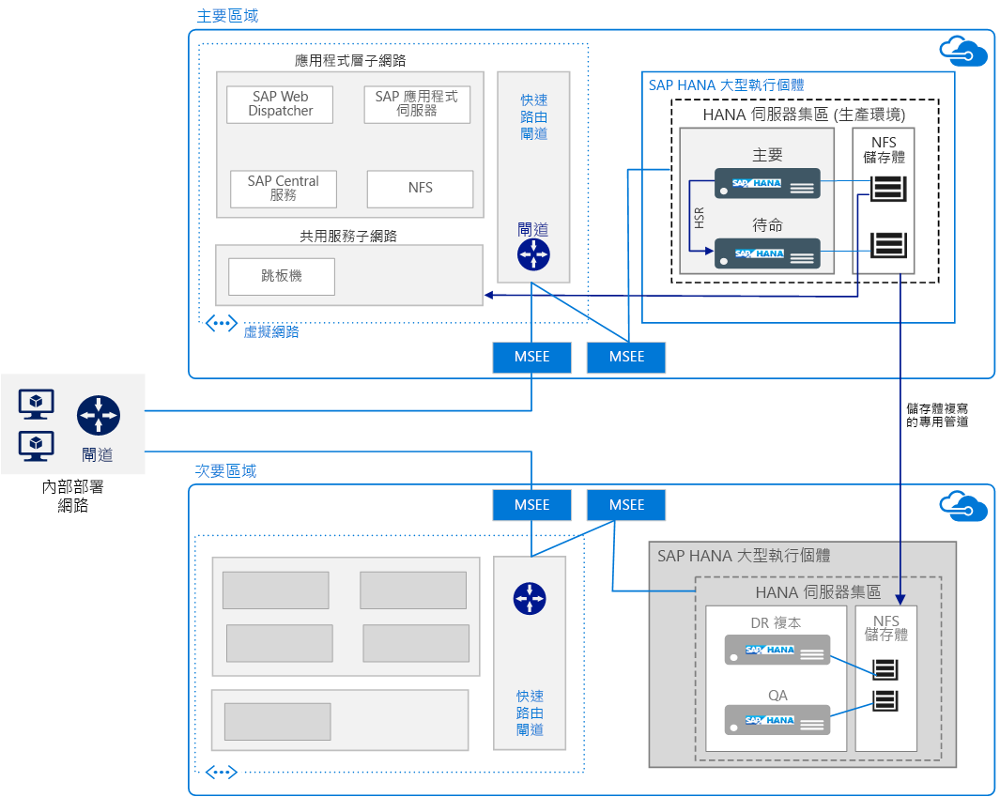

# 在 Azure 大型執行個體上執行 SAP HANARun SAP HANA on Azure Large Instances

此參考架構會顯示一組經過證實的做法，能在具有高可用性和災害復原 (DR) 的 Azure (大型執行個體) 上執行 SAP HANA。This reference architecture shows a set of proven practices for running SAP HANA on Azure (Large Instances) with high availability and disaster recovery (DR). 這個供應項目名為 HANA 大型執行個體，部署在 Azure 區域中的實體伺服器上。Called HANA Large Instances, this offering is deployed on physical servers in Azure regions.

下載這個架構的 [Visio 檔案][visio-download]。*Download a [Visio file][visio-download] of this architecture.*

> [!NOTE]
> 部署此參考架構需要 SAP 產品的適當授權和其他非 Microsoft 技術。Deploying this reference architecture requires appropriate licensing of SAP products and other non-Microsoft technologies.

## 架構Architecture

此架構由下列基礎結構元件組成。This architecture consists of the following infrastructure components.

- **虛擬網路**。**Virtual network**. [Azure 虛擬網路][vnet]服務會安全地讓 Azure 資源彼此連線，且系統會針對每個層將其細分為個別[子網路][subnet]。The [Azure Virtual Network][vnet] service securely connects Azure resources to each other and is subdivided into separate [subnets][subnet] for each layer. SAP 應用程式層會部署在 Azure 虛擬機器 (VM) 上，以連線至位於大型執行個體上的 HANA 資料庫層。SAP application layers are deployed on Azure virual machines (VMs) to connect to the HANA database layer residing on large instances.

- **虛擬機器**。**Virtual machines**. 會在 SAP 應用程式層和共用服務層中使用虛擬機器。Virtual machines are used in the SAP application layer and shared services layer. 後者包含 jumpbox，系統管理員會使用該 jumpbox 來設定 HANA 大型執行個體，並提供其他虛擬機器的存取權。The latter includes a jumpbox used by administrators to set up HANA Large Instances and to provide access to other virtual machines.

- **HANA 大型執行個體**。**HANA Large Instance**. 經認證已符合 SAP HANA Tailored Datacenter Integration (TDI) 標準的[實體伺服器][physical]，用於執行 SAP HANA。A [physical server][physical] certified to meet SAP HANA Tailored Datacenter Integration (TDI) standards runs SAP HANA. 此架構會使用兩個 HANA 大型執行個體：主要和次要計算單位。This architecture uses two HANA Large Instances: a primary and a secondary compute unit. 資料層的高可用性由 HANA 系統複寫 (HSR) 提供。High availability at the data layer is provided through HANA System Replication (HSR).

- **高可用性配對**。**High Availability Pair**. 一組 HANA 大型執行個體刀鋒視窗會一起管理，以提供應用程式備援能力和可靠性。A group of HANA Large Instances blades are managed together to provide application redundancy and reliability.

- **MSEE (Microsoft Enterprise Edge)**。**MSEE (Microsoft Enterprise Edge)**. MSEE 是透過 ExpressRoute 線路來自連線提供者或您網路邊線的連接點。MSEE is a connection point from a connectivity provider or your network edge through an ExpressRoute circuit.

- **網路介面卡 (NIC)**。**Network interface cards (NICs)**. 為了啟用通訊，HANA 大型執行個體伺服器預設會提供 4 個虛擬 NIC。To enable communication, the HANA Large Instance server provides four virtual NICs by default. 這個架構需要一個 NIC 才能進行用戶端通訊，需要第二個 NIC 才能進行 HSR 所需的端點對端點連線，需要第三個 NIC 才能啟用 HANA 大型執行個體儲存體，以及需要第四個才能讓 iSCSI 用於高可用性叢集。This architecture requires one NIC for client communication, a second NIC for the node-to-node connectivity needed by HSR, a third NIC for HANA Large Instance storage, and a fourth for iSCSI used in high availability clustering.

- **網路檔案系統 (NFS) 儲存體**。**Network File System (NFS) storage**. [NFS][nfs] 伺服器會支援網路檔案共用，它會為 HANA 大型執行個體提供安全資料持續性。The [NFS][nfs] server supports the network file share that provides secure data persistence for HANA Large Instance.

- **ExpressRoute**。**ExpressRoute**. 若要在內部部署網路與 Azure 虛擬網路之間建立不會經過公開網際網路的私人連線，[ExpressRoute][expressroute] 是最建議您使用 Azure 網路服務。[ExpressRoute][expressroute] is the recommended Azure networking service for creating private connections between an on-premises network and Azure virtual networks that do not go over the  public Internet. Azure 虛擬機器會使用另一個 ExpressRoute 連線，以連線至 HANA 大型執行個體。Azure VMs connect to HANA Large Instances using another ExpressRoute connection. Azure 虛擬網路與 HANA 大型執行個體之間的 ExpressRoute 連線已設為 Microsoft 供應項目的一部分。The ExpressRoute connection between the Azure virtual network and the HANA Large Instances is set up as part of the Microsoft offering.

- **閘道**。**Gateway**. 使用 ExpressRoute 閘道以將用於 SAP 應用程式層的 Azure 虛擬網路連線至 HANA 大型執行個體網路。The ExpressRoute Gateway is used to connect the Azure virtual network used for the SAP application layer to the HANA Large Instance network. 使用[高效能或超級效能][sku] SKU。Use the [High Performance or Ultra Performance][sku] SKU.

- **災害復原 (DR)**。**Disaster recovery (DR)**. 收到要求時，會支援儲存體複寫，並且該複寫的設定是從主要儲存體到位於其他區域中的 [DR 網站][DR-site]。Upon request, storage replication is supported and will be configured from the primary to the [DR site][DR-site] located in another region.

## 建議Recommendations

需求可能有所不同，因此請使用這些建議作為起點。Requirements can vary, so use these recommendations as a starting point.

### HANA 大型執行個體計算HANA Large Instances compute

[大型執行個體][physical]是以 Intel EX E7 CPU 架構為基礎且在大型執行個體戳記中設定的實體伺服器，也就是特定的一組伺服器或刀鋒視窗。[Large Instances][physical] are physical servers based on the Intel EX E7 CPU architecture and configured in a large instance stamp—that is, a specific set of servers or blades. 計算單位等於一個伺服器或刀鋒視窗，戳記由多個伺服器或刀鋒視窗組成。A compute unit equals one server or blade, and a stamp is made up of multiple servers or blades. 在大型執行個體戳記內，伺服器不會共用，而是專用於執行一個客戶的 SAP HANA 部署。Within a large instance stamp, servers are not shared and are dedicated to running one customer’s deployment of SAP HANA.

有各種 SKU 可用於 HANA 大型執行個體，針對單一執行個體的 S/4HANA 或其他 SAP HANA 工作負載，支援最多 20 TB (60 TB 相應放大) 的記憶體。A variety of SKUs are available for HANA Large Instances, supporting up to 20 TB single instance (60 TB scale-out) of memory for S/4HANA or other SAP HANA workloads. 提供[兩個類別][classes]的伺服器：[Two classes][classes] of servers are offered:

- 類型 I 類別：S72、S72m、S144、S144m、S192 和 S192mType I class: S72, S72m, S144, S144m, S192, and S192m

- 類型 II 類別：S384、S384m、S384xm、S576m、S768m 和 S960mType II class: S384, S384m, S384xm, S576m, S768m, and S960m

例如，S72 SKU 隨附 768 GB RAM、3 terabytes (TB) 儲存體，以及具有 36 核心的 2 個 Intel Xeon 處理器 (E7-8890 v3)。For example, the S72 SKU comes with 768 GB RAM, 3 terabytes (TB) of storage, and 2 Intel Xeon processors (E7-8890 v3) with 36 cores. 選擇適合的 SKU，來滿足您在架構和設計工作階段中所推斷出的大小需求。Choose a SKU that fulfills the sizing requirements you determined in your architecture and design sessions. 務必確定您的大小能與正確的 SKU 相符。Always ensure that your sizing applies to the correct SKU. 功能和部署需求會[因類型而異][type]，可用性會因[區域][region]而異。Capabilities and deployment requirements [vary by type][type], and availability varies by [region][region]. 您也可以從一個 SKU 升級到較大的 SKU。You can also step up from one SKU to a larger SKU.

Microsoft 會協助建立大型執行個體安裝，但是您要負責驗證作業系統的組態設定。Microsoft helps establish the large instance setup, but it is your responsibility to verify the operating system’s configuration settings. 請務必檢閱確切 Linux 版本的最新 SAP 附註。Make sure to review the most current SAP Notes for your exact Linux release.

### 儲存體Storage

實作儲存體配置時應以適用於 SAP HANA 的 TDI 建議為基礎。Storage layout is implemented according to the recommendation of the TDI for SAP HANA. HANA 大型執行個體隨附標準 TDI 規格的特定儲存體組態。HANA Large Instances come with a specific storage configuration for the standard TDI specifications. 不過，您可以 1 TB 為增量單位，購買額外的儲存體。However, you can purchase additional storage in 1 TB increments.

為了支援任務關鍵性環境的需求 (包括快速復原)，會使用 NFS 而不是直接連結儲存體。To support the requirements of mission-critical environments including fast recovery, NFS is used and not direct attached storage. 適用於 HANA 大型執行個體的 NFS 儲存體伺服器是裝載於多租用戶環境，在其中會使用計算、網路和儲存體隔離來隔離及保護租用戶。The NFS storage server for HANA Large Instances is hosted in a multi-tenant environment, where tenants are segregated and secured using compute, network, and storage isolation.

若要在主要網站中支援高可用性，請使用不同的儲存體配置。To support high availability at the primary site, use different storage layouts. 例如，在多主機相應放大中，會共用儲存體。For example, in a multi-host scale-out, the storage is shared. 另一個高可用性選項是以應用程式為基礎的複寫 (例如 HSR)。Another high availability option is application-based replication such as HSR. 不過，針對 DR 會使用以快照集為基礎的儲存體複寫。For DR, however, a snapshot-based storage replication is used.

### 網路Networking

此架構會同時使用虛擬和實體網路。This architecture uses both virtual and physical networks. 虛擬網路是 Azure IaaS 的一部分，而且會透過 [ExpressRoute][expressroute] 線路連線至離散 HANA 大型執行個體實體網路。The virtual network is part of Azure IaaS and connects to a discrete HANA Large Instances physical network through [ExpressRoute][expressroute]] circuits. 跨部署閘道會將您在 Azure 虛擬網路中的工作負載連線到內部部署網站。A cross-premises gateway connects your workloads in the Azure virtual network to your on-premises sites.

基於安全性考量，會將 HANA 大型執行個體網路彼此互相隔離。HANA Large Instances networks are isolated from each other for security. 除了專用的儲存體複寫，位於不同區域中的執行個體不會互相通訊。Instances residing in different regions do not communicate with each other, except for the dedicated storage replication. 不過，若要使用 HSR，需要區域間通訊。However, to use HSR, inter-region communications are required. [IP 路由表][ip]或 Proxy 可以用來啟用跨區域 HSR。[IP routing tables][ip] or proxies can be used to enable cross-regions HSR.

連線到一個區域中 HANA 大型執行個體的所有 Azure 虛擬網路，可以透過 ExpressRoute [交叉連線][cross-connected]至次要區域中的 HANA 大型執行個體。All Azure virtual networks that connect to HANA Large Instances in one region can be [cross-connected][cross-connected] via ExpressRoute to HANA Large Instances in a secondary region.

在佈建期間預設會包含適用於 HANA 大型執行個體的 ExpressRoute。ExpressRoute for HANA Large Instances is included by default during provisioning. 針對安裝，需要特定網路配置 (包括必要的 CIDR 位址範圍和網域路由)。For setup, a specific network layout is needed, including required CIDR address ranges and domain routing. 如需詳細資訊，請參閱 [Azure 上 SAP HANA (大型執行個體) 的基礎結構和連線][HLI-infrastructure]。For details, see [SAP HANA (large instances) infrastructure and connectivity on Azure][HLI-infrastructure].

## 延展性考量Scalability considerations

若要相應增加或相應減少，您可以從適用於 HANA 大型執行個體之各種尺寸的伺服器中選擇。To scale up or down, you can choose from many sizes of servers that are available for HANA Large Instances. 這些伺服器的分類為[類型 I 和類型 II][ classes]且是為不同的工作負載而量身訂做的。They are categorized as [Type I and Type II][classes] and tailored for different workloads. 請選擇可以隨著未來三年工作負載而成長的大小。Choose a size that can grow with your workload for the next three years. 一年認可也可行。One-year commitments are also available.

多主機相應放大部署通常用於 BW/4HANA 部署，作為一種資料庫資料分割策略。A multi-host scale-out deployment is generally used for BW/4HANA deployments as a kind of database partitioning strategy. 若要相應放大，請在安裝之前規劃 HANA 資料表的位置。To scale out, plan the placement of HANA tables prior to installation. 從基礎結構的觀點而言，多主機會連線到共用儲存體磁碟區，萬一 HANA 系統中其中一個計算背景工作角色節點失敗時，可以讓待命主機快速接管。From an infrastructure standpoint, multiple hosts are connected to a shared storage volume, enabling quick takeover by standby hosts in case one of the compute worker nodes in the HANA system fails.

單一刀鋒視窗上 HANA 中的 S/4HANA 和 SAP Business Suite，可以相應增加到單一 HANA 大型執行個體 20 TB。S/4HANA and SAP Business Suite on HANA on a single blade can be scaled up to 20 TB with a single HANA Large Instances instance.

針對嶄新的案例，可使用 [SAP Quick Sizer][quick-sizer] 來計算在 HANA 上實作 SAP 軟體時的記憶體需求。For greenfield scenarios, the [SAP Quick Sizer][quick-sizer] is available to calculate memory requirements of the implementation of SAP software on top of HANA. Hana 的記憶體需求會隨著資料磁碟區擴大而增加。Memory requirements for HANA increase as data volume grows. 使用您系統目前的記憶體耗用量作為基礎，來預測未來的耗用量，然後將需求對應至其中一個 HANA 大型執行個體大小。Use your system’s current memory consumption as the basis for predicting future consumption, and then map your demand into one of the HANA Large Instances sizes.

如果您已經有 SAP 部署，SAP 會提供報告，您可使用該報告來檢查現有系統所使用的資料和計算 HANA 執行個體的記憶體需求。If you already have SAP deployments, SAP provides reports you can use to check the data used by existing systems and calculate memory requirements for a HANA instance. 如需範例，請參閱下列 SAP 附註：For example, see the following SAP Notes:

- SAP 附註 [1793345][sap-1793345] - 調整 HANA 上 SAP Suite 的大小SAP Note [1793345][sap-1793345] - Sizing for SAP Suite on HANA
- SAP 附註 [1872170][sap-1872170] - HANA 與 S/4 HANA 上套件大小調整報告SAP Note [1872170][sap-1872170] - Suite on HANA and S/4 HANA sizing report
- SAP 附註 [2121330][sap-2121330] - 常見問題集：HANA 上 SAP BW 的大小調整報告SAP Note [2121330][sap-2121330] - FAQ: SAP BW on HANA Sizing Report
- SAP 附註 [1736976][sap-1736976] - HANA 上 BW 的大小調整報告SAP Note [1736976][sap-1736976] - Sizing Report for BW on HANA
- SAP 附註 [2296290][sap-2296290] - 新的 HANA 上 BW 的大小調整報告SAP Note [2296290][sap-2296290] - New Sizing Report for BW on HANA

## 可用性考量Availability considerations

資源備援是高可用性基礎結構解決方案中的一般主題。Resource redundancy is the general theme in highly available infrastructure solutions. 針對具有寬鬆 SLA 的企業，單一執行個體 Azure 虛擬機器會提供執行時間 SLA。For enterprises that have a less stringent SLA, single-instance Azure VMs offer an uptime SLA. 如需詳細資訊，請參閱 [Azure 服務等級協定](https://azure.microsoft.com/support/legal/sla/)。For more information, see [Azure Service Level Agreement](https://azure.microsoft.com/support/legal/sla/).

與 SAP、您的系統整合者或 Microsoft 合作，以便正確建構及實作[高可用性和災害復原][hli-hadr]策略。Work with SAP, your system integrator, or Microsoft to properly architect and implement a [high availability and disaster-recovery][hli-hadr] strategy. 此架構會遵循 Azure (大型執行個體) 上 HANA 的 Azure [服務等級協定][sla] (SLA)。This architecture follows the Azure [service-level agreement][sla] (SLA) for HANA on Azure (Large Instances). 若要評估您的可用性需求，請考慮任何單一失敗點、所需的服務執行時間層級，以及這些常見計量：To assess your availability requirements, consider any single points of failure, the desired level of uptime for services, and these common metrics:

- 復原時間目標 (RTO) 表示 HANA 大型執行個體伺服器無法使用的持續時間。Recovery Time Objective (RTO) means the duration of time in which the HANA Large Instances server is unavailable.

- 復原點目標 (RPO) 表示客戶資料可能由於失敗而遺失的最大可容忍期間。Recovery Point Objective (RPO) means the maximum tolerable period in which customer data might be lost due to a failure.

針對高可用性，在 HA 配對中部署一個以上的執行個體，並且在同步模式中使用 HSR 以將資料遺失與停機時間降到最低。For high availability, deploy more than one instance in a HA Pair and use HSR in a synchronous mode to minimize data loss and downtime. 除了本機、兩個節點的高可用性安裝以外，HSR 還支援多層式複寫，在其中位於不同 Azure 區域的第三個節點會登錄至叢集 HSR 配對的次要複本，作為其複寫目標。In addition to a local, two-node high availability setup, HSR supports multi-tier replication, where a third node in a separate Azure region registers to the secondary replica of the clustered HSR pair as its replication target. 這樣會形成複寫菊輪鍊。This forms a replication daisy chain. 對 DR 節點的容錯移轉是手動程序。The failover to the DR node is a manual process.

當您設定具有自動容錯移轉的 HANA 大型執行個體 HSR 時，您可以要求 Microsoft 服務管理小組為您現有的伺服器設定 [STONITH 裝置][stonith]。When you set up HANA Large Instances HSR with automatic failover, you can request the Microsoft Service Management team to set up a [STONITH device][stonith] for your existing servers.

## 災害復原考量Disaster recovery considerations

這個架構支援不同 Azure 區域中 HANA 大型執行個體之間的[災害復原][hli-dr]。This architecture supports [disaster recovery][hli-dr] between HANA Large Instances in different Azure regions. 有兩種方式可支援 HANA 大型執行個體的 DR：There are two ways to support DR with HANA Large Instances:

- 儲存體複寫。Storage replication. 主要儲存體內容會持續複寫到指定 DR HANA 大型執行個體伺服器上可用的遠端 DR 儲存體系統。The primary storage contents are constantly replicated to the remote DR storage systems that are available on the designated DR HANA Large Instances server. 在儲存體複寫中，HANA 資料庫不會載入記憶體。In storage replication, the HANA database is not loaded into memory. 此 DR 選項從管理的觀點而言更簡單。This DR option is simpler from an administration perspective. 若要判斷這是否為合適的策略，請針對可用性 SLA 考量資料庫載入時間。To determine if this is a suitable strategy, consider the database load time against the availability SLA. 儲存體複寫也可讓您執行時間點復原。Storage replication also enables you to perform point-in-time recovery. 如果已設定多用途 (成本最佳化) DR，您必須購買與 DR 位置相同大小的額外儲存體。If multi-purpose (cost-optimized) DR is set up, you must purchase additional storage of the same size at the DR location. Microsoft 為 HANA 容錯移轉提供自助式[儲存體快照集和容錯移轉指令碼][scripts]，作為 HANA 大型執行個體供應項目的一部分。Microsoft provides self-services [storage snapshot and failover scripts][scripts] for HANA failover as part of the HANA Large Instances offering.

- DR 區域中具有第三個複本的多層 HSR (其中 HANA 資料庫會載入記憶體)。Multi-tier HSR with a third replica in the DR region (where the HANA database is loaded onto memory). 此選項支援較快的復原時間，但是不支援時間點復原。This option supports a faster recovery time but does not support a point-in-time recovery. HSR 需要次要系統。HSR requires a secondary system. 針對 DR 網站的 HANA 系統複寫是透過 Proxy (例如 nginx 或 IP 資料表) 進行處理。HANA system replication for the DR site is handled through proxies such as nginx or IP tables.

> [!NOTE]
> 您可以在單一執行個體環境中執行，以針對成本最佳化此參考架構。You can optimize this reference architecture for costs by running in a single-instance environment. 這個[成本最佳化案例](https://blogs.sap.com/2016/07/19/new-whitepaper-for-high-availability-for-sap-hana-cost-optimized-scenario/)適用於非生產 HANA 工作負載。This [cost-optimized scenario](https://blogs.sap.com/2016/07/19/new-whitepaper-for-high-availability-for-sap-hana-cost-optimized-scenario/) is suitable for non-production HANA workloads.

## 備份考量Backup considerations

根據您的業務需求，從適用於[備份與復原][hli-backup]的數個選項中選擇。Based on your business requirements, choose from several options available for [backup and recovery][hli-backup].

| 備份選項Backup option                   | 優點Pros                                                                                                   | 缺點Cons                                                       |
|---------------------------------|--------------------------------------------------------------------------------------------------------|------------------------------------------------------------|
| HANA 備份HANA backup        | 對 SAP 是原生的。Native to SAP. 內建一致性檢查。Built-in consistency check.                                                             | 冗長備份與復原時間。Long backup and recovery times. 儲存體空間耗用量。Storage space consumption. |
| HANA 快照集HANA snapshot      | 對 SAP 是原生的。Native to SAP. 快速備份與還原。Rapid backup and restore.                                                               |                                       |
| 儲存體快照集Storage snapshot   | 隨附於 HANA 大型執行個體。Included with HANA Large Instances. 適用於 HANA 大型執行個體的最佳化 DR。Optimized DR for HANA Large Instances. 開機磁碟區備份支援。Boot volume backup support. | 每個磁碟區最多 254 個快照集。Maximum 254 snapshots per volume.                          |
| 記錄備份Log backup         | 時間點復原的必要項目。Required for point in time recovery.                                                                   |                                                            |
| 其他備份工具Other backup tools | 備援備份位置。Redundant backup location.                                                                             | 其他授權成本。Additional licensing costs.                                |

## 管理性考量Manageability considerations

使用 SAP HANA Studio、SAP HANA Cockpit、SAP Solution Manager 及其他原生 Linux 工具，監視 HANA 大型執行個體資源 (例如 CPU、記憶體、網路頻寬及儲存體空間)。Monitor HANA Large Instances resources such as CPU, memory, network bandwidth, and storage space using SAP HANA Studio, SAP HANA Cockpit, SAP Solution Manager, and other native Linux tools. HANA 大型執行個體未隨附內建監視工具。HANA Large Instances does not come with built-in monitoring tools. Microsoft 提供的資源可協助您根據組織的需求[進行疑難排解和監視][hli-troubleshoot]，而且 Microsoft 支援小組可以在針對技術問題進行疑難排解方面為您提供協助。Microsoft offers resources to help you [troubleshoot and monitor][hli-troubleshoot] according to your organization’s requirements, and the Microsoft support team can assist you in troubleshooting technical issues.

如果您需要更多計算功能，您必須取得更大的 SKU。If you need more computing capability, you must get a larger SKU.

## 安全性考量Security considerations

- 根據預設，HANA 大型執行個體會根據待用資料的 TDE (透明資料加密)，使用儲存體加密。By default, HANA Large Instances use storage encryption based on TDE (transparent data encryption) for the data at rest.

- 不會對 HANA 大型執行個體與虛擬機器之間傳輸中的資料進行加密。Data in transit between HANA Large Instances and the virtual machines is not encrypted. 若要加密資料傳輸，請啟用應用程式特定加密。To encrypt the data transfer, enable the application-specific encryption. 請參閱 SAP 附註 [2159014][sap-2159014] - 常見問題集：SAP HANA 安全性。See SAP Note [2159014][sap-2159014] - FAQ: SAP HANA Security.

- 隔離可以為多租用戶 HANA 大型執行個體環境中的租用戶之間提供安全性。Isolation provides security between the tenants in the multi-tenant HANA Large Instance environment. 會使用租用戶自己的 VLAN 將其進行隔離。Tenants are isolated using their own VLAN.

- [Azure 網路安全性最佳做法][network-best-practices]提供有用的指引。[Azure network security best practices][network-best-practices] provide helpful guidance.

- 如同任何部署，建議進行[作業系統強化][os-hardening]。As with any deployment, [operating system hardening][os-hardening] is recommended.

- 基於實體安全性的考量，僅限獲授權的人員可存取 Azure 資料中心。For physical security, access to Azure datacenters is limited to authorized personnel only. 沒有任何客戶可以存取實體伺服器。No customers can access the physical servers.

如需詳細資訊，請參閱 [SAP HANA 安全性 - 概觀][sap-security]。(需要 SAP Service Marketplace 帳戶才能進行存取。)For more information, see [SAP HANA Security—An Overview][sap-security].(A SAP Service Marketplace account is required for access.)

## 社群Communities

社群可以回答問題並協助您設定成功的部署。Communities can answer questions and help you set up a successful deployment. 請考慮下列：Consider the following:

- [在 Microsoft 平台上執行 SAP 應用程式部落格][running-sap-blog][Running SAP Applications on the Microsoft Platform Blog][running-sap-blog]
- [Azure 社群支援][azure-forum][Azure Community Support][azure-forum]
- [SAP 社群][sap-community][SAP Community][sap-community]
- [堆疊溢位 SAP][stack-overflow][Stack Overflow SAP][stack-overflow]

[azure-forum]: https://azure.microsoft.com/support/forums/
[azure-large-instances]: /azure/virtual-machines/workloads/sap/hana-overview-architecture
[classes]: /azure/virtual-machines/workloads/sap/hana-overview-architecture
[cross-connected]: /azure/virtual-machines/workloads/sap/hana-overview-high-availability-disaster-recovery#network-considerations-for-disaster-recovery-with-hana-large-instances
[dr-site]: /azure/virtual-machines/workloads/sap/hana-overview-high-availability-disaster-recovery
[expressroute]: /azure/architecture/reference-architectures/hybrid-networking/expressroute
[filter-network]: https://azure.microsoft.com/blog/multiple-vm-nics-and-network-virtual-appliances-in-azure/
[hli-dr]: /azure/virtual-machines/workloads/sap/hana-overview-high-availability-disaster-recovery#network-considerations-for-disaster-recovery-with-hana-large-instances
[hli-backup]: /azure/virtual-machines/workloads/sap/hana-overview-high-availability-disaster-recovery#backup-and-restore
[hli-hadr]: /azure/virtual-machines/workloads/sap/hana-overview-high-availability-disaster-recovery?toc=%2fazure%2fvirtual-machines%2flinux%2ftoc.json
[hli-infrastructure]: /azure/virtual-machines/workloads/sap/hana-overview-infrastructure-connectivity
[hli-overview]: /azure/virtual-machines/workloads/sap/hana-overview-architecture
[hli-troubleshoot]: /azure/virtual-machines/workloads/sap/troubleshooting-monitoring
[ip]: https://blogs.msdn.microsoft.com/saponsqlserver/2018/02/10/setting-up-hana-system-replication-on-azure-hana-large-instances/
[network-best-practices]: /azure/security/azure-security-network-security-best-practices
[nfs]: /azure/virtual-machines/workloads/sap/high-availability-guide-suse-nfs
[os-hardening]: /azure/security/azure-security-iaas
[physical]: /azure/virtual-machines/workloads/sap/hana-overview-architecture
[planning]: /azure/vpn-gateway/vpn-gateway-plan-design
[protecting-sap]: https://blogs.msdn.microsoft.com/saponsqlserver/2016/05/06/protecting-sap-systems-running-on-vmware-with-azure-site-recovery/
[ref-arch]: /azure/architecture/reference-architectures/
[running-SAP]: https://blogs.msdn.microsoft.com/saponsqlserver/2016/06/07/sap-on-sql-general-update-for-customers-partners-june-2016/
[region]: https://azure.microsoft.com/global-infrastructure/services/
[running-sap-blog]: https://blogs.msdn.microsoft.com/saponsqlserver/2017/05/04/sap-on-azure-general-update-for-customers-partners-april-2017/
[quick-sizer]: https://service.sap.com/quicksizing
[sap-1793345]: https://launchpad.support.sap.com/#/notes/1793345
[sap-1872170]: https://launchpad.support.sap.com/#/notes/1872170
[sap-2121330]: https://launchpad.support.sap.com/#/notes/2121330
[sap-2159014]: https://launchpad.support.sap.com/#/notes/2159014
[sap-1736976]: https://launchpad.support.sap.com/#/notes/1736976
[sap-2296290]: https://launchpad.support.sap.com/#/notes/2296290
[sap-community]: https://www.sap.com/community.html
[sap-security]: https://archive.sap.com/documents/docs/DOC-62943
[scripts]: /azure/virtual-machines/workloads/sap/hana-overview-high-availability-disaster-recovery
[sku]: /azure/expressroute/expressroute-about-virtual-network-gateways
[sla]: https://azure.microsoft.com/support/legal/sla/virtual-machines
[stack-overflow]: https://stackoverflow.com/tags/sap/info
[stonith]: /azure/virtual-machines/workloads/sap/ha-setup-with-stonith
[subnet]: /azure/virtual-network/virtual-network-manage-subnet
[swd]: https://help.sap.com/doc/saphelp_nw70ehp2/7.02.16/en-us/48/8fe37933114e6fe10000000a421937/frameset.htm
[type]: /azure/virtual-machines/workloads/sap/hana-installation
[vnet]: /azure/virtual-network/virtual-networks-overview
[visio-download]: https://archcenter.blob.core.windows.net/cdn/sap-reference-architectures.vsdx