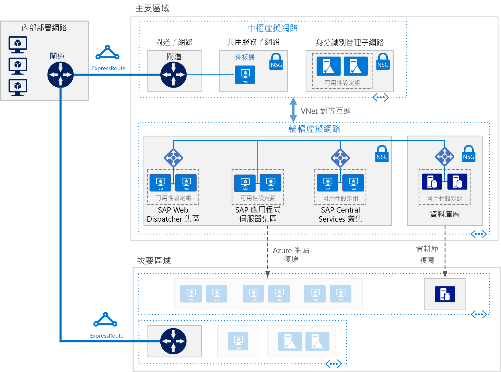

# 在 Azure 虛擬機器上部署適用於 AnyDB 的 SAP NetWeaver (Windows)Deploy SAP NetWeaver (Windows) for AnyDB on Azure Virtual Machines

此參考架構會顯示一組經過證實的做法，能在 Windows 環境中具有高可用性的 Azure 上執行 SAP NetWeaver。This reference architecture shows a set of proven practices for running SAP NetWeaver in a Windows environment on Azure with high availability. 資料庫是 AnyDB，這是任何支援 DBMS 的 SAP 字詞，不包括 SAP HANA。The database is AnyDB, the SAP term for any supported DBMS besides SAP HANA. 這個架構是以特定虛擬機器 (VM) 大小進行部署，大小可以變更以符合您的組織需求。This architecture is deployed with specific virtual machine (VM) sizes that can be changed to accommodate your organization's needs.

下載這個架構的 [Visio 檔案][visio-download]。*Download a [Visio file][visio-download] of this architecture.*

> [!NOTE] 
> 部署此參考架構需要 SAP 產品的適當授權和其他非 Microsoft 技術。Deploying this reference architecture requires appropriate licensing of SAP products and other non-Microsoft technologies.

## 架構Architecture
此架構由下列基礎結構和關鍵軟體元件組成。The architecture consists of the following infrastructure and key software components.

**虛擬網路**。**Virtual network**. Azure 虛擬網路服務會安全地讓 Azure 資源彼此連線。The Azure Virtual Network service securely connects Azure resources to each other. 在此架構中，虛擬網路是透過在[中樞輪輻](../hybrid-networking/hub-spoke.md)中樞中所部署的 VPN 閘道，連線至內部部署環境。In this architecture, the virtual network connects to an on-premises environment through a VPN gateway deployed in the hub of a [hub-spoke](../hybrid-networking/hub-spoke.md). 輪輻是虛擬網路，用於 SAP 應用程式和資料庫層。The spoke is the virtual network used for the SAP applications and database tier.

**子網路**。**Subnets**. 虛擬網路會針對以下各個層級細分為不同的子網路：應用程式 (SAP NetWeaver)、資料庫、共用服務 (jumpbox) 和 Active Directory。The virtual network is subdivided into separate subnets for each tier: application (SAP NetWeaver), database, shared services (the jumpbox), and Active Directory.
    
**虛擬機器**。**Virtual machines**. 此架構會針對應用程式層和資料庫層使用虛擬機器，群組如下：This architecture uses virtual machines for the application tier and database tier, grouped as follows:

- **SAP NetWeaver**。**SAP NetWeaver**. 應用程式層會使用 Windows 虛擬機器，並執行 SAP 中央服務和 SAP 應用程式伺服器。The application tier uses Windows virtual machines and runs SAP Central Services and SAP application servers. 執行中央服務的虛擬機器會設定為 Windows Server 容錯移轉叢集以取得高可用性，受 SIOS DataKeeper 叢集版本所支援。The VMs that run Central Services are configured as a Windows Server Failover Cluster for high availability, supported by SIOS DataKeeper Cluster Edition.
- **AnyDB**。**AnyDB**. 資料庫層會執行 AnyDB 作為來源資料庫，例如 Microsoft SQL Server、Oracle 或 IBM DB2。The database tier runs AnyDB as the source database, such as Microsoft SQL Server, Oracle, or IBM DB2.
- **Jumpbox**。**Jumpbox**. 也稱為防禦主機。Also called a bastion host. 這是網路上系統管理員用來連線到其他虛擬機器的安全虛擬機器。This is a secure virtual machine on the network that administrators use to connect to the other virtual machines.
- **Windows Server Active Directory 網域控制站**。**Windows Server Active Directory domain controllers**. 會針對所有虛擬機器和網域中的使用者使用網域控制站。The domain controllers are used on all VMs and users in the domain.

**負載平衡器**。**Load balancers**. 會使用 [Azure Load Balancer](/azure/load-balancer/load-balancer-overview) 執行個體，將流量分配到應用程式層子網路中的虛擬機器。[Azure Load Balancer](/azure/load-balancer/load-balancer-overview) instances are used to distribute traffic to virtual machines in the application tier subnet. 您可以在資料層中使用內建的 SAP 負載平衡器、Azure Load Balancer 或其他機制，根據 DBMS 來達到高可用性。At the data tier, high availability may be achieved using built-in SAP load balancers, Azure Load Balancer, or other mechanisms, depending on the DBMS. 如需詳細資訊，請參閱[適用於 SAP NetWeaver 的 Azure 虛擬機器 DBMS 部署](/azure/virtual-machines/workloads/sap/dbms-guide)。For more information, see [Azure Virtual Machines DBMS deployment for SAP NetWeaver](/azure/virtual-machines/workloads/sap/dbms-guide). 

**可用性設定組**。**Availability sets**. SAP Web Dispatcher、SAP 應用程式伺服器和 (A)SCS 的虛擬機器角色會分組到個別[可用性設定組](/azure/virtual-machines/windows/tutorial-availability-sets)，每個角色都會佈建至少兩部虛擬機器。Virtual machines for the SAP Web Dispatcher, SAP application server, and (A)SCS, roles are grouped into separate [availability sets](/azure/virtual-machines/windows/tutorial-availability-sets), and at least two virtual machines are provisioned per role. 這讓虛擬機器能夠符合適用於較高[服務等級協定](https://azure.microsoft.com/support/legal/sla/virtual-machines) (SLA) 的資格。This makes the virtual machines eligible for a higher [service level agreement](https://azure.microsoft.com/support/legal/sla/virtual-machines) (SLA).

**NIC**。**NICs**. [網路介面卡](/azure/virtual-network/virtual-network-network-interface) (NIC) 會啟用虛擬網路上虛擬機器的所有通訊。[Network interface cards](/azure/virtual-network/virtual-network-network-interface) (NICs) enable all communication of virtual machines on a virtual network.

**網路安全性群組**。**Network security groups**. 若要限制虛擬網路中的傳入、傳出及內部子網路流量，您可以建立[網路安全性群組](/azure/virtual-network/virtual-networks-nsg) (NSG)。To restrict incoming, outgoing, and intra-subnet traffic in the virtual network, you can create [network security groups](/azure/virtual-network/virtual-networks-nsg) (NSGs).

**閘道**。**Gateway**. 閘道會將您的內部部署網路擴充至 Azure 虛擬網路。A gateway extends your on-premises network to the Azure virtual network. [ExpressRoute](/azure/architecture/reference-architectures/hybrid-networking/expressroute) 是建議的 Azure 服務，用來建立不會經過公用網際網路的私人連線，但是也可以使用[站對站](/azure/vpn-gateway/vpn-gateway-howto-site-to-site-resource-manager-portal)連線。[ExpressRoute](/azure/architecture/reference-architectures/hybrid-networking/expressroute) is the recommended Azure service for creating private connections that do not go over the public Internet, but a [Site-to-Site](/azure/vpn-gateway/vpn-gateway-howto-site-to-site-resource-manager-portal) connection can also be used.

**Azure 儲存體**。**Azure Storage**. 若要提供虛擬機器虛擬硬碟 (VHD) 的持續性儲存體，則需要 [Azure 儲存體](/azure/storage/storage-standard-storage)。To provide persistent storage of a virtual machine's virtual hard disk (VHD), [Azure Storage](/azure/storage/storage-standard-storage) is required. [雲端見證](/windows-server/failover-clustering/deploy-cloud-witness)也會使用它來實作容錯移轉叢集作業。It is also used by [Cloud Witness](/windows-server/failover-clustering/deploy-cloud-witness) to implement a failover cluster operation. 

## 建議Recommendations
您的需求可能和此處所述的架構不同。Your requirements might differ from the architecture described here. 請使用以下建議作為起點。Use these recommendations as a starting point.

### SAP Web Dispatcher 集區SAP Web Dispatcher pool

Web Dispatcher 元件是用來作為 SAP 應用程式伺服器之間 SAP 流量的負載平衡器。The Web Dispatcher component is used as a load balancer for SAP traffic among the SAP application servers. 為了達到 Web Dispatcher 元件的高可用性，會使用 Azure Load Balancer 來實作平行 Web Dispatcher 設定。To achieve high availability for the Web Dispatcher component, Azure Load Balancer is used to implement the parallel Web Dispatcher setup. Web Dispatcher 會針對平衡器集區中可用 Web Dispatcher 之間的 HTTP(S) 流量分配，使用循環配置資源組態。Web Dispatcher uses in a round-robin configuration for HTTP(S) traffic distribution among the available Web Dispatchers in the balancers pool.

如需在 Azure 虛擬機器中執行 SAP NetWeaver 的詳細資訊，請參閱 [SAP NetWeaver 的 Azure 虛擬機器規劃和實作](/azure/virtual-machines/workloads/sap/planning-guide)。For details about running SAP NetWeaver in Azure VMs, see [Azure Virtual Machines planning and implementation for SAP NetWeaver](/azure/virtual-machines/workloads/sap/planning-guide).

### 應用程式伺服器集區Application servers pool

若要管理 ABAP 應用程式伺服器的登入群組，請使用 SMLG 交易。To manage logon groups for ABAP application servers, the SMLG transaction is used. 它會在中央服務的訊息伺服器內使用負載平衡函式，以針對 SAPGUI 和 RFC 流量，分配 SAP 應用程式伺服器集區之間的工作負載。It uses the load balancing function within the message server of the Central Services to distribute workload among SAP application servers pool for SAPGUIs and RFC traffic. 與高可用性中央服務的應用程式伺服器連線是透過叢集虛擬網路名稱。The application server connection to the highly available Central Services is through the cluster virtual network name.

### SAP 中央服務叢集SAP Central Services cluster

此參考架構會在應用程式層中的虛擬機器上執行中央服務。This reference architecture runs Central Services on VMs in the application tier. 部署到單一虛擬機器 (不需要高可用性時的典型部署) 時，中央服務是潛在的單一失敗點 (SPOF)。The Central Services is a potential single point of failure (SPOF) when deployed to a single VM—typical deployment when high availability is not a requirement. 若要實作高可用性解決方案，可以使用共用磁碟叢集或檔案共用叢集。To implement a high availability solution, either a shared disk cluster or a file share cluster can be used.

若要設定共用磁碟叢集的虛擬機器，請使用 [Windows Server 容錯移轉叢集](https://blogs.sap.com/2018/01/25/how-to-create-sap-resources-in-windows-failover-cluster/)。To configure VMs for a shared disk cluster, use [Windows Server Failover Cluster](https://blogs.sap.com/2018/01/25/how-to-create-sap-resources-in-windows-failover-cluster/). 建議將[雲端見證](/windows-server/failover-clustering/deploy-cloud-witness)作為仲裁見證。[Cloud Witness](/windows-server/failover-clustering/deploy-cloud-witness) is recommended as a quorum witness. 若要支援容錯移轉叢集環境，[SIOS DataKeeper 叢集版本](https://azuremarketplace.microsoft.com/marketplace/apps/sios_datakeeper.sios-datakeeper-8)會執行叢集共用磁碟區函式，方法為複寫叢集節點所擁有的獨立磁碟。To support the failover cluster environment, [SIOS DataKeeper Cluster Edition](https://azuremarketplace.microsoft.com/marketplace/apps/sios_datakeeper.sios-datakeeper-8) performs the cluster shared volume function by replicating independent disks owned by the cluster nodes. Azure 本身不支援共用磁碟，因此需要 SIOS 所提供的解決方案。Azure does not natively support shared disks and therefore requires solutions provided by SIOS.

如需詳細資訊，請參閱「3.For details, see "3. 在 Azure 上的 SIOS 執行 ASCS 的 SAP 客戶重要更新」，位於[在 Microsoft 平台上執行 SAP 應用程式](https://blogs.msdn.microsoft.com/saponsqlserver/2017/05/04/sap-on-azure-general-update-for-customers-partners-april-2017/)。Important Update for SAP Customers Running ASCS on SIOS on Azure” at [Running SAP applications on the Microsoft platform](https://blogs.msdn.microsoft.com/saponsqlserver/2017/05/04/sap-on-azure-general-update-for-customers-partners-april-2017/).

處理叢集的另一種方式是使用 Windows Server 容錯移轉叢集實作檔案共用叢集。Another way to handle clustering is to implement a file share cluster using Windows Server Failover Cluster. [SAP](https://blogs.sap.com/2018/03/19/migration-from-a-shared-disk-cluster-to-a-file-share-cluster/) 最近修改了中央服務部署模式，來透過 UNC 路徑存取 /sapmnt 全域目錄。[SAP](https://blogs.sap.com/2018/03/19/migration-from-a-shared-disk-cluster-to-a-file-share-cluster/) recently modified the Central Services deployment pattern to access the /sapmnt global directories via a UNC path. 這項變更會針對 SIOS，或中央服務虛擬機器上的其他共用磁碟解決方案[移除需求](https://blogs.msdn.microsoft.com/saponsqlserver/2017/08/10/high-available-ascs-for-windows-on-file-share-shared-disk-no-longer-required/)。This change [removes the requirement](https://blogs.msdn.microsoft.com/saponsqlserver/2017/08/10/high-available-ascs-for-windows-on-file-share-shared-disk-no-longer-required/) for SIOS or other shared disk solutions on the Central Services VMs. 但是仍然建議確保 /sapmnt UNC 共用是[高可用性](https://blogs.sap.com/2017/07/21/how-to-create-a-high-available-sapmnt-share/)。It is still recommended to ensure that the /sapmnt UNC share is [highly available](https://blogs.sap.com/2017/07/21/how-to-create-a-high-available-sapmnt-share/). 可以藉由使用 Windows Server 容錯移轉叢集與[相應放大檔案伺服器](https://blogs.msdn.microsoft.com/saponsqlserver/2017/11/14/file-server-with-sofs-and-s2d-as-an-alternative-to-cluster-shared-disk-for-clustering-of-an-sap-ascs-instance-in-azure-is-generally-available/) (SOFS) 和 Windows Server 2016 中的[儲存空間直接存取](https://blogs.sap.com/2018/03/07/your-sap-on-azure-part-5-ascs-high-availability-with-storage-spaces-direct/) (S2D) 功能，在中央服務執行個體上完成這個操作。This can be done on the Central Services instance by using Windows Server Failover Cluster with [Scale Out File Server](https://blogs.msdn.microsoft.com/saponsqlserver/2017/11/14/file-server-with-sofs-and-s2d-as-an-alternative-to-cluster-shared-disk-for-clustering-of-an-sap-ascs-instance-in-azure-is-generally-available/) (SOFS) and the [Storage Spaces Direct](https://blogs.sap.com/2018/03/07/your-sap-on-azure-part-5-ascs-high-availability-with-storage-spaces-direct/) (S2D) feature in Windows Server 2016. 

### 可用性設定組Availability sets

可用性設定組會將伺服器分配到不同實體基礎結構並且更新群組，以改善服務可用性。Availability sets distribute servers to different physical infrastructure and update groups to improve service availability. 將執行相同角色的虛擬機器放到可用性設定組，以協助防範 Azure 基礎結構維護所造成的停機時間，並符合 [SLA](https://azure.microsoft.com/support/legal/sla/virtual-machines) (SLA)。Put virtual machines that perform the same role into an availability sets to help guard against downtime caused by Azure infrastructure maintenance and to meet [SLAs](https://azure.microsoft.com/support/legal/sla/virtual-machines) (SLAs). 建議您針對每個可用性設定組使用兩部以上的虛擬機器。Two or more virtual machines per availability set is recommended.

集合中的所有虛擬機器必須執行相同的角色。All virtual machines in a set must perform the same role. 請勿在相同的可用性設定組中混用不同角色的伺服器。Do not mix servers of different roles in the same availability set. 例如，不要將中央服務節點放置在與應用程式伺服器相同的可用性設定組。For example, don't place a Central Services node in the same availability set with the application server.

### NICNICs

傳統內部部署 SAP 部署會為每部機器實作多個網路介面卡 (NIC)，以隔離系統管理流量與商務流量。Traditional on-premises SAP deployments implement multiple network interface cards (NICs) per machine to segregate administrative traffic from business traffic. 在 Azure 上，虛擬網路是軟體定義網路，它會透過相同的網路網狀架構傳送所有流量。On Azure, the virtual network is a software-defined network that sends all traffic through the same network fabric. 因此，不需要使用多個 NIC。Therefore, the use of multiple NICs is unnecessary. 不過，如果您的組織需要隔離流量，您可以對每部虛擬機器部署多個 NIC、將每個 NIC 連線到不同的子網路，然後使用 NSG 以強制執行不同的存取控制原則。However, if your organization needs to segregate traffic, you can deploy multiple NICs per VM, connect each NIC to a different subnet, and then use NSGs to enforce different access control policies.

### 子網路和 NSGSubnets and NSGs

此架構會將虛擬網路位址空間細分為子網路。This architecture subdivides the virtual network address space into subnets. 此參考架構主要著重在應用程式層子網路。This reference architecture focuses primarily on the application tier subnet. 每個子網路可以與定義子網路存取原則的 NSG 相關聯。Each subnet can be associated with a NSG that defines the access policies for the subnet. 將應用程式伺服器放在不同的子網路上，您就可以藉由管理子網路安全性原則 (而非個別伺服器)，以便更輕鬆地保護它們。Place application servers on a separate subnet so you can secure them more easily by managing the subnet security policies, not the individual servers.

當 NSG 與子網路產生關聯時，它會套用至子網路內的所有伺服器。When a NSG is associated with a subnet, it applies to all the servers within the subnet. 如需使用 NSG 對子網路中伺服器進行更細微控制的詳細資訊，請參閱[使用網路安全性群組篩選網路流量](https://azure.microsoft.com/en-us/blog/multiple-vm-nics-and-network-virtual-appliances-in-azure/)。For more information about using NSGs for fine-grained control over the servers in a subnet, see [Filter network traffic with network security groups](https://azure.microsoft.com/en-us/blog/multiple-vm-nics-and-network-virtual-appliances-in-azure/).

### 負載平衡器Load balancers

[SAP Web Dispatcher](https://help.sap.com/doc/saphelp_nw73ehp1/7.31.19/en-US/48/8fe37933114e6fe10000000a421937/frameset.htm) 會處理對 SAP 應用程式伺服器集區之 HTTP(S) 流量的負載平衡。[SAP Web Dispatcher](https://help.sap.com/doc/saphelp_nw73ehp1/7.31.19/en-US/48/8fe37933114e6fe10000000a421937/frameset.htm) handles load balancing of HTTP(S) traffic to a pool of SAP application servers.

針對透過 DIAG 通訊協定或遠端函式呼叫 (RFC)，從 SAP GUI 用戶端連線 SAP 伺服器的流量，中央服務訊息伺服器會透過 SAP 應用程式伺服器[登入群組](https://wiki.scn.sap.com/wiki/display/SI/ABAP+Logon+Group+based+Load+Balancing)進行負載平衡，因此不需要額外負載平衡器。For traffic from SAP GUI clients connecting a SAP server via DIAG protocol or Remote Function Calls (RFC), the Central Services message server balances the load through SAP application server [logon groups](https://wiki.scn.sap.com/wiki/display/SI/ABAP+Logon+Group+based+Load+Balancing), so no additional load balancer is needed.

### Azure 儲存體Azure Storage

針對所有資料庫伺服器虛擬機器，建議您使用 Azure 進階儲存體以獲得一致的讀取/寫入延遲。For all database server virtual machines, we recommend using Azure Premium Storage for consistent read/write latency. 對於將進階儲存體用於所有作業系統磁碟和資料磁碟的任何單一執行個體虛擬機器，請參閱[虛擬機器的 SLA](https://azure.microsoft.com/support/legal/sla/virtual-machines)。For any single instance virtual machine using Premium Storage for all operating system disks and data disks, see [SLA for Virtual Machines](https://azure.microsoft.com/support/legal/sla/virtual-machines). 此外，針對生產環境 SAP 系統，我們建議在所有情況下都使用進階 [Azure 受控磁碟](/azure/storage/storage-managed-disks-overview)。Also, for production SAP systems, we recommend using Premium [Azure Managed Disks](/azure/storage/storage-managed-disks-overview) in all cases. 基於可靠性的考量，會使用受控磁碟來管理磁碟的 VHD 檔案。For reliability, Managed Disks are used to manage the VHD files for the disks. 受控磁碟可確保可用性設定組內的虛擬機器磁碟是各自獨立的，以避免發生單一失敗點。Managed disks ensure that the disks for virtual machines within an availability set are isolated to avoid single points of failure.

針對 SAP 應用程式伺服器 (包括中央服務虛擬機器)，您可以使用 Azure 標準儲存體來降低成本，因為應用程式的執行會發生在記憶體中，並只會使用磁碟來記錄。For SAP application servers, including the Central Services virtual machines, you can use Azure Standard Storage to reduce cost, because application execution takes place in memory and disks are used for logging only. 不過，目前標準儲存體只針對非受控儲存體經過認證。However, at this time, Standard Storage is only certified for unmanaged storage. 因為應用程式伺服器未裝載任何資料，您也可以使用較小的 P4 和 P6 進階儲存體磁碟以協助降低成本。Since application servers do not host any data, you can also use the smaller P4 and P6 Premium Storage disks to help minimize cost.

[雲端見證](/windows-server/failover-clustering/deploy-cloud-witness)也會使用 Azure 儲存體，以針對遠離叢集所在主要區域的遠端 Azure 區域中的裝置維護仲裁。Azure Storage is also used by [Cloud Witness](/windows-server/failover-clustering/deploy-cloud-witness) to maintain quorum with a device in a remote Azure region away from the primary region where the cluster resides.

針對備份資料存放區，我們建議您使用 Azure [coolaccess 層](/azure/storage/storage-blob-storage-tiers)和[封存存取層儲存體](/azure/storage/storage-blob-storage-tiers)。For the backup data store, we recommend using Azure [coolaccess tier](/azure/storage/storage-blob-storage-tiers) and [archive access tier storage](/azure/storage/storage-blob-storage-tiers). 這些儲存體層是符合成本效益的方式，用來儲存不常存取的長時間執行資料。These storage tiers are cost-effective ways to store long-lived data that is infrequently accessed.

## 效能考量Performance considerations

SAP 應用程式伺服器會執行與資料庫伺服器的持續通訊。SAP application servers carry on constant communications with the database servers. 針對在任何資料庫平台上執行的效能關鍵性應用程式 (包括 SAP HANA)，請考慮啟用[寫入加速器](/azure/virtual-machines/linux/how-to-enable-write-accelerator)以改善記錄寫入延遲。For performance-critical applications running on any database platforms, including SAP HANA, consider enabling [Write Accelerator](/azure/virtual-machines/linux/how-to-enable-write-accelerator) to improve log write latency. 若要最佳化伺服器間的通訊，請使用[加速網路](https://azure.microsoft.com/blog/linux-and-windows-networking-performance-enhancements-accelerated-networking/)。To optimize inter-server communications, use the [Accelerated Network](https://azure.microsoft.com/blog/linux-and-windows-networking-performance-enhancements-accelerated-networking/). 請注意，這些加速器僅適用於特定虛擬機器系列。Note that these accelerators are available only for certain VM series.

若要達到高 IOPS 和磁碟頻寬輸送量，可將儲存體磁碟區[效能最佳化](/azure/virtual-machines/windows/premium-storage-performance)的常見做法套用於 Azure 儲存體配置。To achieve high IOPS and disk bandwidth throughput, the common practices in storage volume [performance optimization](/azure/virtual-machines/windows/premium-storage-performance) apply to Azure storage layout. 例如，將多個磁碟合併在一起來建立等量磁碟區，能夠改善 IO 效能。For example, combining multiple disks together to create a striped disk volume improves IO performance. 在不常變更的儲存體內容上啟用讀取快取，能夠增強資料擷取的速度。Enabling the read cache on storage content that changes infrequently enhances the speed of data retrieval.

針對 SQL 上的 SAP，[在 Azure 上部署 SAP 應用程式的前 10 名主要考量](https://blogs.msdn.microsoft.com/saponsqlserver/2015/05/25/top-10-key-considerations-for-deploying-sap-applications-on-azure/)部落格提供針對 SQL Server 上 SAP 工作負載最佳化 Azure 儲存體的絕佳建議。For SAP on SQL, the [Top 10 Key Considerations for Deploying SAP Applications on Azure](https://blogs.msdn.microsoft.com/saponsqlserver/2015/05/25/top-10-key-considerations-for-deploying-sap-applications-on-azure/) blog offers excellent advice on optimizing Azure storage for SAP workloads on SQL Server.

## 延展性考量Scalability considerations

在 SAP 應用程式層中，Azure 會提供各種不同的虛擬機器大小可進行相應增加或相應放大。如需完整清單，請參閱 [SAP 附註 1928533](https://launchpad.support.sap.com/#/notes/1928533) - Azure 上的 SAP 應用程式︰支援的產品和 Azure 虛擬機器類型。At the SAP application layer, Azure offers a wide range of virtual machine sizes for scaling up and scaling out. For an inclusive list, see [SAP note 1928533](https://launchpad.support.sap.com/#/notes/1928533) - SAP Applications on Azure: Supported Products and Azure VM Types. (需要 SAP Service Marketplace 帳戶才能進行存取)。(SAP Service Marketplace account required for access). SAP 應用程式伺服器和中央服務叢集可以藉由新增更多執行個體來相應增加/相應減少或相應放大。SAP application servers and the Central Services clusters can scale up/down or scale out by adding more instances. AnyDB 資料庫可以相應增加/相應減少，但是無法相應放大。AnyDB 的 SAP 資料庫容器不支援分區化。The AnyDB database can scale up/down but does not scale out. The SAP database container for AnyDB does not support sharding.

## 可用性考量Availability considerations

資源備援是高可用性基礎結構解決方案中的一般主題。Resource redundancy is the general theme in highly available infrastructure solutions. 針對具有寬鬆 SLA 的企業，單一執行個體 Azure 虛擬機器會提供執行時間 SLA。For enterprises that have a less stringent SLA, single-instance Azure VMs offer an uptime SLA. 如需詳細資訊，請參閱 [Azure 服務等級協定](https://azure.microsoft.com/support/legal/sla/)。For more information, see [Azure Service Level Agreement](https://azure.microsoft.com/support/legal/sla/).

在 SAP 應用程式的這個分散式安裝中，會複寫基底安裝來達到高可用性。In this distributed installation of the SAP application, the base installation is replicated to achieve high availability. 針對每一層的架構，高可用性設計會有所不同。For each layer of the architecture, the high availability design varies.

### 應用程式層Application tier

SAP Web Dispatcher 的高可用性是以備援執行個體來達成。High availability for SAP Web Dispatcher is achieved with redundant instances. 請參閱 SAP 文件中的 [SAP Web Dispatcher](https://help.sap.com/doc/saphelp_nw70ehp2/7.02.16/en-us/48/8fe37933114e6fe10000000a421937/frameset.htm)。See [SAP Web Dispatcher](https://help.sap.com/doc/saphelp_nw70ehp2/7.02.16/en-us/48/8fe37933114e6fe10000000a421937/frameset.htm) in the SAP Documentation.

中央服務的高可用性是使用 Windows Server 容錯移轉叢集來實作。High availability of the Central Services is implemented with Windows Server Failover Cluster. 部署在 Azure 上的時候，可以使用兩種方法來設定容錯移轉叢集的叢集儲存體：叢集共用磁碟區或檔案共用。When deployed on Azure, the cluster storage for the failover cluster can be configured using two approaches: either a clustered shared volume or a file share.

因為無法在 Azure 上使用共用磁碟，所以會使用 SIOS Datakeeper 來複寫連結到叢集節點的獨立磁碟內容，並且讓磁碟機作為叢集管理員的叢集共用磁碟區。Since shared disks are not possible on Azure, SIOS Datakeeper is used to replicate the content of independent disks attached to the cluster nodes and to abstract the drives as a cluster shared volume for the cluster manager. 如需實作詳細資料，請參閱[在 Azure 上叢集 SAP ASCS](https://blogs.msdn.microsoft.com/saponsqlserver/2015/05/20/clustering-sap-ascs-instance-using-windows-server-failover-cluster-on-microsoft-azure-with-sios-datakeeper-and-azure-internal-load-balancer/)。For implementation details, see [Clustering SAP ASCS on Azure](https://blogs.msdn.microsoft.com/saponsqlserver/2015/05/20/clustering-sap-ascs-instance-using-windows-server-failover-cluster-on-microsoft-azure-with-sios-datakeeper-and-azure-internal-load-balancer/).

另一個選項是使用由[相應放大檔案伺服器](https://blogs.msdn.microsoft.com/saponsqlserver/2017/11/14/file-server-with-sofs-and-s2d-as-an-alternative-to-cluster-shared-disk-for-clustering-of-an-sap-ascs-instance-in-azure-is-generally-available/) (SOFS) 提供服務的檔案共用。Another option is to use a file share served up by the [Scale Out Fileserver](https://blogs.msdn.microsoft.com/saponsqlserver/2017/11/14/file-server-with-sofs-and-s2d-as-an-alternative-to-cluster-shared-disk-for-clustering-of-an-sap-ascs-instance-in-azure-is-generally-available/) (SOFS). SOFS 提供彈性檔案共用，您可以用來作為 Windows 叢集的叢集共用磁碟區。SOFS offers resilient file shares you can use as a cluster shared volume for the Windows cluster. SOFS 叢集可以在多個中央服務節點之間共用。A SOFS cluster can be shared among multiple Central Services nodes. 在此文件撰寫當下，SOFS 只適用於高可用性設計，因為 SOFS 叢集不會跨區域擴充，以提供災害復原支援。As of this writing, SOFS is used only for high availability design, because the SOFS cluster does not extend across regions to provide disaster recovery support.

藉由應用程式伺服器集區內的負載平衡流量來達到 SAP 應用程式伺服器的高可用性。High availability for the SAP application servers is achieved by load balancing traffic within a pool of application servers.
請參閱[於 Microsoft Azure 上執行的 SAP 認證和設定](/azure/virtual-machines/workloads/sap/sap-certifications)。See [SAP certifications and configurations running on Microsoft Azure](/azure/virtual-machines/workloads/sap/sap-certifications).

### 資料庫層Database tier

此參考架構假設來源資料庫是在 AnyDB 上執行，亦即例如 SQL Server、SAP ASE、IBM DB2 或 Oracle 的 DBMS。This reference architecture assumes the source database is running on AnyDB—that is, a DBMS such as SQL Server, SAP ASE, IBM DB2, or Oracle. 資料庫層的原生複寫功能提供複寫節點之間手動或自動容錯移轉。The database tier's native replication feature provides either manual or automatic failover between replicated nodes.

如需特定資料庫系統的實作詳細資訊，請參閱[針對 SAP NetWeaver 的 Azure 虛擬機器 DBMS 部署](/azure/virtual-machines/workloads/sap/dbms-guide)。For implementation details about specific database systems, see [Azure Virtual Machines DBMS deployment for SAP NetWeaver](/azure/virtual-machines/workloads/sap/dbms-guide).

## 災害復原考量Disaster recovery considerations

針對災害復原 (DR)，您必須能夠容錯移轉到次要區域。For disaster recovery (DR), you must be able to fail over to a secondary region. 每一層會使用不同的策略來提供災害復原 (DR) 保護。Each tier uses a different strategy to provide disaster recovery (DR) protection.

- **應用程式伺服器層**。**Application servers tier**. SAP 應用程式伺服器不包含商務資料。SAP application servers do not contain business data. 在 Azure 上，簡易 DR 策略是在次要區域建立 SAP 應用程式伺服器，然後將它們關機。On Azure, a simple DR strategy is to create SAP application servers in the secondary region, then shut them down. 在主要應用程式伺服器上進行任何組態變更或核心更新時，必須將相同的變更複製到次要區域中的虛擬機器。Upon any configuration changes or kernel updates on the primary application server, the same changes must be copied to the virtual machines in the secondary region. 例如，將核心可執行檔複製到 DR 虛擬機器。For example, the kernel executables copied to the DR virtual machines. 如需將應用程式伺服器自動複寫到次要區域中，[Azure Site Recovery](/azure/site-recovery/site-recovery-overview) 是建議的解決方案。For automatic replication of application servers to a secondary region, [Azure Site Recovery](/azure/site-recovery/site-recovery-overview) is the recommended solution.

- **中央服務**。**Central Services**. 這個 SAP 應用程式堆疊的元件也不會保存商務資料。This component of the SAP application stack also does not persist business data. 您可以在災害復原區域中建置虛擬機器，來執行中央服務角色。You can build a VM in the disaster recovery region to run the Central Services role. 主要中央服務節點中同步處理的唯一內容是 /sapmnt 共用內容。The only content from the primary Central Services node to synchronize is the /sapmnt share content. 另外，如果組態變更或核心更新是在主要中央服務伺服器上發生，必須在執行中央服務的災害復原區域中的虛擬機器上重複執行這些變更或更新。Also, if configuration changes or kernel updates take place on the primary Central Services servers, they must be repeated on the VM in the disaster recovery region running Central Services. 若要同步處理兩部伺服器，您可以使用 Azure Site Recovery 複寫叢集節點，或者只使用定期排程備份作業將 /sapmnt 複製到災害復原區域。To synchronize the two servers, you can use either Azure Site Recovery to replicate the cluster nodes or simply use a regularly scheduled copy job to copy /sapmnt to the disaster recovery region. 如需這個簡易複寫方法之建置、複製及測試容錯移轉程序的詳細資訊，請下載 [SAP NetWeaver：建置 Hyper-V 和以 Microsoft Azure 作為基礎的災害復原解決方案](http://download.microsoft.com/download/9/5/6/956FEDC3-702D-4EFB-A7D3-2DB7505566B6/SAP%20NetWeaver%20-%20Building%20an%20Azure%20based%20Disaster%20Recovery%20Solution%20V1_5%20.docx)，並參考「4.3.For details about this simple replication method's build, copy, and test failover process, download [SAP NetWeaver: Building a Hyper-V and Microsoft Azure–based Disaster Recovery Solution](http://download.microsoft.com/download/9/5/6/956FEDC3-702D-4EFB-A7D3-2DB7505566B6/SAP%20NetWeaver%20-%20Building%20an%20Azure%20based%20Disaster%20Recovery%20Solution%20V1_5%20.docx), and refer to "4.3. SAP SPOF layer (ASCS)。」SAP SPOF layer (ASCS)."

- **資料庫層**。**Database tier**. DR 的最佳實作方式是使用資料庫自己的整合複寫技術。DR is best implemented with the database's own integrated replication technology. 舉例來說，如果是 SQL Server，我們建議使用 AlwaysOn 可用性群組以在遠端區域中建立複本，使用手動容錯移轉以非同步方式複寫交易。In the case of SQL Server, for example, we recommend using AlwaysOn Availability Group to establish a replica in a remote region, replicating transactions asynchronously with manual failover. 非同步複寫可避免對主要網站的互動式工作負載效能造成影響。Asynchronous replication avoids an impact to the performance of interactive workloads at the primary site. 手動容錯移轉讓人員有機會評估 DR 影響，並判斷透過 DR 網站的運作是否適當。Manual failover offers the opportunity for a person to evaluate the DR impact and decide if operating from the DR site is justified.

若要使用 Azure Site Recovery 自動建置原始的完整複寫生產環境網站，您必須執行自訂[部署指令碼](/azure/site-recovery/site-recovery-runbook-automation)。To use Azure Site Recovery to automatically build out a fully replicated production site of your original, you must run customized [deployment scripts](/azure/site-recovery/site-recovery-runbook-automation). Site Recovery 首先會在可用性設定組中部署虛擬機器，然後執行指令碼以新增負載平衡器之類的資源。Site Recovery first deploys the VMs in availability sets, then runs scripts to add resources such as load balancers.

## 管理性考量Manageability considerations

Azure 會提供幾個函式來[監視和診斷](/azure/architecture/best-practices/monitoring)整體基礎結構。Azure provides several functions for [monitoring and diagnostics](/azure/architecture/best-practices/monitoring) of the overall infrastructure. 此外，Azure 虛擬機器的增強型監視會由 Azure Operations Management Suite (OMS) 處理。Also, enhanced monitoring of Azure virtual machines is handled by Azure Operations Management Suite (OMS).

若要提供以 SAP 作為基礎的 SAP 基礎結構之資源與服務效能監視，請使用 [Azure SAP 增強型監視](/azure/virtual-machines/workloads/sap/deployment-guide#detailed-tasks-for-sap-software-deployment)延伸模組。To provide SAP-based monitoring of resources and service performance of the SAP infrastructure, the [Azure SAP Enhanced Monitoring](/azure/virtual-machines/workloads/sap/deployment-guide#detailed-tasks-for-sap-software-deployment) extension is used. 此延伸模組會將 Azure 監視統計資料輸入 SAP 應用程式，以進行作業系統監視和 DBA Cockpit 函式。This extension feeds Azure monitoring statistics into the SAP application for operating system monitoring and DBA Cockpit functions.

## 安全性考量Security considerations

SAP 有它自己的「使用者管理引擎 (UME)」，可控制角色型存取和 SAP 應用程式內的授權。SAP has its own Users Management Engine (UME) to control role-based access and authorization within the SAP application. 如需詳細資訊，請參閱[適用於 ABAP 的 SAP NetWeaver 應用程式伺服器安全性指南](https://help.sap.com/doc/7b932ef4728810148a4b1a83b0e91070/1610 001/en-US/frameset.htm?4dde53b3e9142e51e10000000a42189c.html)和 [SAP NetWeaver 應用程式伺服器 Java 安全性指南](https://help.sap.com/doc/saphelp_snc_uiaddon_10/1.0/en-US/57/d8bfcf38f66f48b95ce1f52b3f5184/frameset.htm)。For details, see [SAP NetWeaver Application Server for ABAP Security Guide](https://help.sap.com/doc/7b932ef4728810148a4b1a83b0e91070/1610 001/en-US/frameset.htm?4dde53b3e9142e51e10000000a42189c.html) and [SAP NetWeaver Application Server Java Security Guide](https://help.sap.com/doc/saphelp_snc_uiaddon_10/1.0/en-US/57/d8bfcf38f66f48b95ce1f52b3f5184/frameset.htm).

如需額外的網路安全性，請考慮實作[網路 DMZ](../dmz/secure-vnet-hybrid.md)，它會使用網路虛擬設備，在 Web Dispatcher 的子網路前面建立防火牆。For additional network security, consider implementing a [network DMZ](../dmz/secure-vnet-hybrid.md), which uses a network virtual appliance to create a firewall in front of the subnet for Web Dispatcher.

針對基礎結構安全性，資料在傳輸中和靜止時會加密。For infrastructure security, data is encrypted in transit and at rest. [Azure 虛擬機器 (VM) 上的 SAP NetWeaver - 規劃和實作指南](/azure/virtual-machines/workloads/sap/planning-guide)的「安全性考量」一節會開始說明網路安全性。The "Security considerations” section of the [SAP NetWeaver on Azure Virtual Machines (VMs) – Planning and Implementation Guide](/azure/virtual-machines/workloads/sap/planning-guide) begins to address network security. 本指南也會指定您在防火牆上必須開啟才能允許應用程式通訊的網路連接埠。The guide also specifies the network ports you must open on the firewalls to allow application communication.

如需加密 Windows 虛擬機器磁碟，您可以使用 [Azure 磁碟加密](/azure/security/azure-security-disk-encryption)。To encrypt Windows virtual machine disks, you can use [Azure Disk Encryption](/azure/security/azure-security-disk-encryption). 它會使用 Windows 的 BitLocker 功能來提供作業系統和資料磁碟的磁碟區加密。It uses the BitLocker feature of Windows to provide volume encryption for the operating system and the data disks. 此解決方案也可與 Azure Key Vault 搭配使用，協助您控制及管理金鑰保存庫訂用帳戶中的磁碟加密金鑰與祕密。The solution also works with Azure Key Vault to help you control and manage the disk-encryption keys and secrets in your key vault subscription. 虛擬機器磁碟上的所有待用資料都會在您的 Azure 儲存體中加密。Data on the virtual machine disks are encrypted at rest in your Azure storage.

## 社群Communities

社群可以回答問題並協助您設定成功的部署。Communities can answer questions and help you set up a successful deployment. 請考慮下列：Consider the following:

- [在 Microsoft 平台上執行 SAP 應用程式部落格Running SAP Applications on the Microsoft Platform Blog](https://blogs.msdn.microsoft.com/saponsqlserver/2017/05/04/sap-on-azure-general-update-for-customers-partners-april-2017/)
- [Azure 社群支援Azure Community Support](https://azure.microsoft.com/support/community/)
- [SAP 社群SAP Community](https://www.sap.com/community.html)
- [Stack OverflowStack Overflow](https://stackoverflow.com/tags/sap/)

[visio-download]: https://archcenter.blob.core.windows.net/cdn/sap-reference-architectures.vsdx
