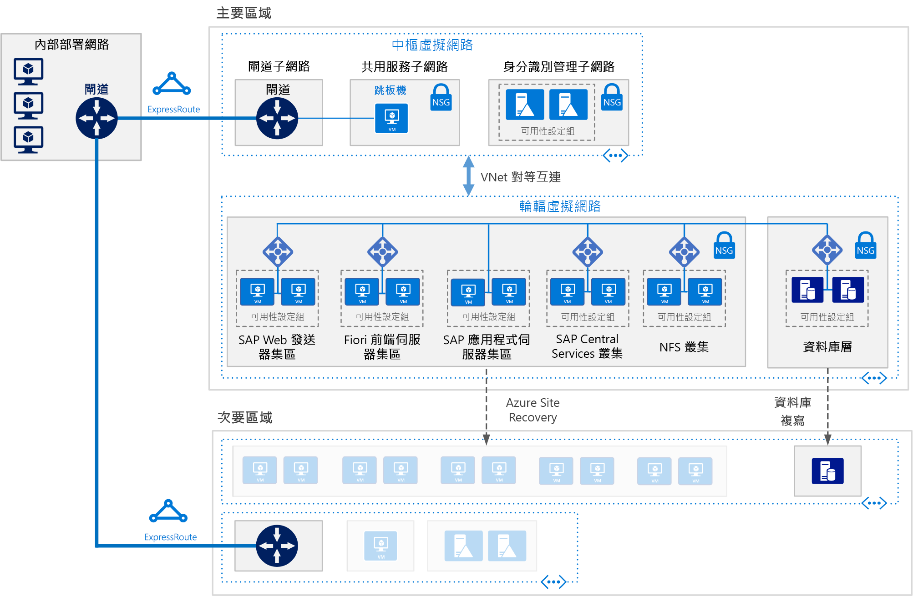

# Azure 上 Linux 虛擬機器的 SAP S/4HANASAP S/4HANA for Linux Virtual Machines on Azure

此參考架構會顯示一組經過證實的做法，能在 Azure 上支援災害復原的高可用性環境中執行 S/4HANA。This reference architecture shows a set of proven practices for running S/4HANA in a high availability environment that supports disaster recovery on Azure. 這個架構是以特定虛擬機器 (VM) 大小進行部署，大小可以變更以符合您的組織需求。This architecture is deployed with specific virtual machine (VM) sizes that can be changed to accommodate your organization's needs. 

下載這個架構的 [Visio 檔案][visio-download]。*Download a [Visio file][visio-download] of this architecture.*

> [!NOTE] 
> 部署此參考架構需要 SAP 產品的適當授權和其他非 Microsoft 技術。Deploying this reference architecture requires appropriate licensing of SAP products and other non-Microsoft technologies.

## 架構Architecture
 
此參考架構描述企業等級、生產環境層級系統。This reference architecture describes a enterprise-grade, production-level system. 若要符合您的業務需求，此組態可縮減為單一虛擬機器。To suit your business needs, this configuration can be reduced to a single virtual machine. 但是需要下列元件：However, the following components are required:

**虛擬網路**。**Virtual network**. [Azure 虛擬網路](/azure/virtual-network/virtual-networks-overview)服務會安全地讓 Azure 資源彼此連線。The [Azure Virtual Network](/azure/virtual-network/virtual-networks-overview) service securely connects Azure resources to each other. 在此架構中，虛擬網路是透過在[中樞輪輻拓撲](../hybrid-networking/hub-spoke.md)中樞中所部署的閘道，連線至內部部署環境。In this architecture, the virtual network connects to an on-premises environment through a gateway deployed in the hub of a [hub-spoke topology](../hybrid-networking/hub-spoke.md). 輪輻是虛擬網路，用於 SAP 應用程式。The spoke is the virtual network used for the SAP applications.

**子網路**。**Subnets**. 虛擬網路會針對以下每個層級細分為個別[子網路](/azure/virtual-network/virtual-network-manage-subnet)：閘道、應用程式、資料庫和共用服務。The virtual network is subdivided into separate [subnets](/azure/virtual-network/virtual-network-manage-subnet) for each tier: gateway, application, database, and shared services . 

**虛擬機器**。**Virtual machines**. 此架構會針對應用程式層和資料庫層使用執行 Linux 的虛擬機器，群組如下：This architecture uses virtual machines running Linux for the application tier and database tier, grouped as follows:

- **應用程式層**。**Application tier**. 包含 Fiori 前端伺服器集區、SAP Web Dispatcher 集區、應用程式伺服器集區以及 SAP 中央服務叢集。Includes the Fiori Front-end Server pool, SAP Web Dispatcher pool, application server pool, and SAP Central Services cluster. 如需 Azure Linux 虛擬機器上中央服務的高可用性，需要高可用性網路檔案系統 (NFS) 服務。For high availability of Central Services on Azure Linux virtual machines, a highly available Network File System (NFS) service is required.
- **NFS 叢集**。**NFS cluster**. 此架構會使用在 Linux 叢集上執行的 [NFS](/azure/virtual-machines/workloads/sap/high-availability-guide-suse-nfs) 伺服器，以儲存在 SAP 系統之間共用的資料。This architecture uses an [NFS](/azure/virtual-machines/workloads/sap/high-availability-guide-suse-nfs) server running on a Linux cluster to store data shared between SAP systems. 這個集中式叢集可以跨多個 SAP 系統共用。This centralized cluster can be shared across multiple SAP systems. 如需 NFS 服務的高可用性，會使用適用於所選取 Linux 發佈的適當高可用性擴充。For high availability of the NFS service, the appropriate High Availability Extension for the selected Linux distribution is used.
- **SAP HANA**。**SAP HANA**. 資料庫層會在叢集中使用兩個以上的 Linux 虛擬機器，以達到高可用性。The database tier uses two or more Linux virtual machines in a cluster to achieve high availability. HANA 系統複寫 (HSR) 會用來複寫主要和次要 HANA 系統之間的內容。HANA System Replication (HSR) is used to replicate contents between primary and secondary HANA systems. Linux 叢集會用來偵測系統失敗，並協助自動容錯移轉。Linux clustering is used to detect system failures and facilitate automatic failover. 以儲存體為基礎或以雲端為基礎的隔離機制可以用來確保失敗的系統是否已隔離或關機，以避免叢集核心分裂情況。A storage-based or cloud-based fencing mechanism can be used to ensure the failed system is isolated or shut down to avoid the cluster split-brain condition.
- **Jumpbox**。**Jumpbox**. 也稱為防禦主機。Also called a bastion host. 這是網路上系統管理員用來連線到其他虛擬機器的安全虛擬機器。This is a secure virtual machine on the network that administrators use to connect to the other virtual machines. 它可以執行 Windows 或 Linux。It can run Windows or Linux. 當使用 HANA Cockpit 或 HANA Studio 管理工具時，使用 Windows jumpbox 以方便網頁瀏覽。Use a Windows jumpbox for web browsing convenience when using HANA Cockpit or HANA Studio management tools.

**負載平衡器**。**Load balancers**. 內建 SAP 負載平衡器和 [Azure Load Balancer](/azure/load-balancer/load-balancer-overview) 兩者都可用來達到高可用性。Both built-in SAP load balancers and [Azure Load Balancer](/azure/load-balancer/load-balancer-overview) are used to achieve HA. 會使用 Azure Load Balancer 執行個體，將流量分配到應用程式層子網路中的虛擬機器。Azure Load Balancer instances are used to distribute traffic to virtual machines in the application tier subnet.

**可用性設定組**。**Availability sets**. 所有集區和叢集 (Web Dispatcher、SAP 應用程式伺服器、中央服務、NFS 及 HANA) 的虛擬機器會分組到個別[可用性設定組](/azure/virtual-machines/windows/tutorial-availability-sets)，每個角色都會佈建至少兩部虛擬機器。Virtual machines for all pools and clusters (Web Dispatcher, SAP application servers, Central Services, NFS, and HANA) are grouped into separate [availability sets](/azure/virtual-machines/windows/tutorial-availability-sets), and at least two virtual machines are provisioned per role. 這讓虛擬機器能夠符合適用於較高[服務等級協定](https://azure.microsoft.com/support/legal/sla/virtual-machines) (SLA) 的資格。This makes the virtual machines eligible for a higher [service level agreement](https://azure.microsoft.com/support/legal/sla/virtual-machines) (SLA). 

**NIC**。**NICs**. [網路介面卡](/azure/virtual-network/virtual-network-network-interface) (NIC) 會啟用虛擬網路上虛擬機器的所有通訊。[Network interface cards](/azure/virtual-network/virtual-network-network-interface) (NICs) enable all communication of virtual machines on a virtual network.

**網路安全性群組**。**Network security groups**. 若要限制虛擬網路中的傳入、傳出及內部子網路流量，請使用[網路安全性群組](/azure/virtual-network/virtual-networks-nsg) (NSG)。To restrict incoming, outgoing, and intra-subnet traffic in the virtual network, [network security groups](/azure/virtual-network/virtual-networks-nsg) (NSGs) are used.

**閘道**。**Gateway**. 閘道會將您的內部部署網路擴充至 Azure 虛擬網路。A gateway extends your on-premises network to the Azure virtual network. [ExpressRoute](/azure/architecture/reference-architectures/hybrid-networking/expressroute) 是建議的 Azure 服務，用來建立不會經過公用網際網路的私人連線，但是也可以使用[站對站](/azure/vpn-gateway/vpn-gateway-howto-site-to-site-resource-manager-portal)連線。[ExpressRoute](/azure/architecture/reference-architectures/hybrid-networking/expressroute) is the recommended Azure service for creating private connections that do not go over the public Internet, but a [Site-to-Site](/azure/vpn-gateway/vpn-gateway-howto-site-to-site-resource-manager-portal) connection can also be used. 

**Azure 儲存體**。**Azure Storage**. 若要提供虛擬機器虛擬硬碟 (VHD) 的持續性儲存體，則需要 [Azure 儲存體](/azure/storage/)。To provide persistent storage of a virtual machine's virtual hard disk (VHD), [Azure Storage](/azure/storage/) is required. 

## 建議Recommendations

此架構描述小型生產環境層級企業部署。This architecture describes a small production-level enterprise deployment. 您的部署會根據您的業務需求而有所不同。Your deployment will differ based on your business requirements. 請使用以下建議作為起點。Use these recommendations as a starting point.

### 虛擬機器Virtual machines

在應用程式伺服器集區和叢集中，根據您的需求來調整虛擬機器數目。In application server pools and clusters, adjust the number of virtual machines based on your requirements. [Azure 虛擬機器規劃和實作指南](/azure/virtual-machines/workloads/sap/planning-guide)包含關於在虛擬機器上執行 SAP NetWeaver 的詳細資訊，但是該資訊也適用於 SAP S/4HANA。The [Azure Virtual Machines planning and implementation guide](/azure/virtual-machines/workloads/sap/planning-guide) includes details about running SAP NetWeaver on virtual machines, but the information applies to SAP S/4HANA as well.

如需針對 Azure 虛擬機器類型和輸送量計量 (SAPS) 的 SAP 支援相關詳細資訊，請參閱 [SAP 附註 1928533](https://launchpad.support.sap.com/#/notes/1928533)。For details about SAP support for Azure virtual machine types and throughput metrics (SAPS), see [SAP Note 1928533](https://launchpad.support.sap.com/#/notes/1928533). 

### SAP Web Dispatcher 集區SAP Web Dispatcher pool

Web Dispatcher 元件是用來作為 SAP 應用程式伺服器之間 SAP 流量的負載平衡器。The Web Dispatcher component is used as a load balancer for SAP traffic among the SAP application servers. 若要達到 Web Dispatcher 元件的高可用性，使用 Azure Load Balancer 以針對平衡器後端集區中可用 Web Dispatcher 之間的 HTTP(S) 流量分配，在循環配置資源組態中實作平行 Web Dispatcher 設定。To achieve high availability for the Web Dispatcher component, Azure Load Balancer is used to implement the parallel Web Dispatcher setup in a round-robin configuration for HTTP(S) traffic distribution among the available Web Dispatchers in the balancers back-end pool. 

### Fiori 前端伺服器Fiori Front-end Server

Fiori 前端伺服器使用 [NetWeaver 閘道](https://help.sap.com/doc/saphelp_gateway20sp12/2.0/en-US/76/08828d832e4aa78748e9f82204a864/content.htm?no_cache=true)。The Fiori Front-end Server uses a [NetWeaver Gateway](https://help.sap.com/doc/saphelp_gateway20sp12/2.0/en-US/76/08828d832e4aa78748e9f82204a864/content.htm?no_cache=true). 針對小型部署，它可以在 Fiori 伺服器上載入。For small deployments, it can be loaded on the Fiori server. 針對大型部署，另外有用於 NetWeaver 閘道的個別伺服器可以部署在 Fiori 前端伺服器集區前面。For large deployments, a separate server for the NetWeaver Gateway may be deployed in front of the Fiori Front-end Server pool.

### 應用程式伺服器集區Application servers pool

若要管理 ABAP 應用程式伺服器的登入群組，請使用 SMLG 交易。To manage logon groups for ABAP application servers, the SMLG transaction is used. 它會在中央服務的訊息伺服器內使用負載平衡函式，以針對 SAPGUI 和 RFC 流量，分配 SAP 應用程式伺服器集區之間的工作負載。It uses the load balancing function within the message server of the Central Services to distribute workload among SAP application servers pool for SAPGUIs and RFC traffic. 與高可用性中央服務的應用程式伺服器連線是透過叢集虛擬網路名稱。The application server connection to the highly available Central Services is through the cluster virtual network name. 這樣可避免必須在本機容錯移轉之後變更中央服務連線的應用程式伺服器設定檔。This avoids the need to change the application server profile for Central Services connectivity after a local failover. 

### SAP 中央服務叢集SAP Central Services cluster

不需要高可用性時，可以將中央服務部署至單一虛擬機器。Central Services can be deployed to a single virtual machine when high availability is not a requirement. 不過，單一虛擬機器會變成 SAP 環境的潛在單一失敗點 (SPOF)。However, the single virtual machine becomes a potential single point of failure (SPOF) for the SAP environment. 針對高可用性中央服務部署，會使用高可用性 NFS 叢集和高可用性中央服務叢集。For a highly available Central Services deployment, a highly available NFS cluster and a highly available Central Services cluster are used.

### NFS 叢集NFS cluster

DRBD (分散複寫區塊裝置) 會用於 NFS 叢集節點之間的複寫。DRBD (Distributed Replicated Block Device) is used for replication between the nodes of the NFS cluster.

### 可用性設定組Availability sets

可用性設定組會將伺服器分配到不同實體基礎結構並且更新群組，以改善服務可用性。Availability sets distribute servers to different physical infrastructure and update groups to improve service availability. 將執行相同角色的虛擬機器放到可用性設定組，以協助防範 Azure 基礎結構維護所造成的停機時間，並符合 [SLA](https://azure.microsoft.com/support/legal/sla/virtual-machines)。Put virtual machines that perform the same role into an availability sets to help guard against downtime caused by Azure infrastructure maintenance and to meet [SLAs](https://azure.microsoft.com/support/legal/sla/virtual-machines). 建議您針對每個可用性設定組使用兩部以上的虛擬機器。Two or more virtual machines per availability set is recommended.

集合中的所有虛擬機器必須執行相同的角色。All virtual machines in a set must perform the same role. 請勿在相同的可用性設定組中混用不同角色的伺服器。Do not mix servers of different roles in the same availability set. 例如，不要將 ASCS 節點放置在與應用程式伺服器相同的可用性設定組。For example, don't place a ASCS node in the same availability set with the application server.

### NICNICs

傳統內部部署 SAP 環境會為每部機器實作多個網路介面卡 (NIC)，以隔離系統管理流量與商務流量。Traditional on-premises SAP landscapes implement multiple network interface cards (NICs) per machine to segregate administrative traffic from business traffic. 在 Azure 上，虛擬網路是軟體定義網路，它會透過相同的網路網狀架構傳送所有流量。On Azure, the virtual network is a software-defined network that sends all traffic through the same network fabric. 因此，不需要使用多個 NIC。Therefore, the use of multiple NICs is unnecessary. 不過，如果您的組織需要隔離流量，您可以對每部虛擬機器部署多個 NIC、將每個 NIC 連線到不同的子網路，然後使用 NSG 以強制執行不同的存取控制原則。However, if your organization needs to segregate traffic, you can deploy multiple NICs per VM, connect each NIC to a different subnet, and then use NSGs to enforce different access control policies.

### 子網路和 NSGSubnets and NSGs

此架構會將虛擬網路位址空間細分為子網路。This architecture subdivides the virtual network address space into subnets. 每個子網路可以與定義子網路存取原則的 NSG 相關聯。Each subnet can be associated with a NSG that defines the access policies for the subnet. 將應用程式伺服器放在不同的子網路上，您就可以藉由管理子網路安全性原則 (而非個別伺服器)，以便更輕鬆地保護它們。Place application servers on a separate subnet so you can secure them more easily by managing the subnet security policies, not the individual servers.

當 NSG 與子網路產生關聯時，它會套用至子網路內的所有伺服器。When a NSG is associated with a subnet, it then applies to all the servers within the subnet. 如需使用 NSG 對子網路中伺服器進行更細微控制的詳細資訊，請參閱[使用網路安全性群組篩選網路流量](https://azure.microsoft.com/blog/multiple-vm-nics-and-network-virtual-appliances-in-azure/)。For more information about using NSGs for fine-grained control over the servers in a subnet, see [Filter network traffic with network security groups](https://azure.microsoft.com/blog/multiple-vm-nics-and-network-virtual-appliances-in-azure/).

另請參閱[規劃與設計 VPN 閘道](/azure/vpn-gateway/vpn-gateway-plan-design)。See also [Planning and design for VPN Gateway](/azure/vpn-gateway/vpn-gateway-plan-design).

### 負載平衡器Load balancers

[SAP Web Dispatcher](https://help.sap.com/doc/saphelp_nw73ehp1/7.31.19/en-US/48/8fe37933114e6fe10000000a421937/frameset.htm) 會處理到 SAP 應用程式伺服器集區之 HTTP(S) 流量 (包含 Fiori 樣式應用程式) 的負載平衡。[SAP Web Dispatcher](https://help.sap.com/doc/saphelp_nw73ehp1/7.31.19/en-US/48/8fe37933114e6fe10000000a421937/frameset.htm) handles load balancing of HTTP(S) traffic including Fiori style applications to a pool of SAP application servers. 

針對透過 DIAG 或遠端函式呼叫 (RFC)，從 SAP GUI 用戶端連線 SAP 伺服器的流量，中央服務訊息伺服器會透過 SAP 應用程式伺服器[登入群組](https://wiki.scn.sap.com/wiki/display/SI/ABAP+Logon+Group+based+Load+Balancing)進行負載平衡，因此不需要額外負載平衡器。For traffic from SAP GUI clients connecting a SAP server via DIAG or Remote Function Calls (RFC), the Central Service message server balances the load through SAP application server [logon groups](https://wiki.scn.sap.com/wiki/display/SI/ABAP+Logon+Group+based+Load+Balancing), so no additional load balancer is needed. 

### Azure 儲存體Azure Storage

我們建議針對資料庫伺服器虛擬機器使用 Azure 進階儲存體。We recommend using Azure Premium Storage for the database server virtual machines. 進階儲存體提供一致的讀取/寫入延遲。Premium storage provides consistent read/write latency. 如需針對單一執行個體虛擬機器的作業系統磁碟和資料磁碟使用進階儲存體的詳細資訊，請參閱[虛擬機器的 SLA](https://azure.microsoft.com/support/legal/sla/virtual-machines/)。For details about using Premium Storage for the operating system disks and data disks of a single-instance virtual machine, see [SLA for Virtual Machines](https://azure.microsoft.com/support/legal/sla/virtual-machines/). 

針對所有生產環境 SAP 系統，我們建議使用進階 [Azure 受控磁碟](/azure/storage/storage-managed-disks-overview)。For all production SAP systems, we recommend using Premium [Azure Managed Disks](/azure/storage/storage-managed-disks-overview). 受控磁碟是用來管理磁碟的 VHD 檔案，可增加可靠性。Managed Disks are used to manage the VHD files for the disks, adding reliability. 它們也會確保可用性設定組內的虛擬機器磁碟是各自獨立的，以避免發生單一失敗點。They also ensure that the disks for virtual machines within an availability set are isolated to avoid single points of failure.

針對 SAP 應用程式伺服器 (包括中央服務虛擬機器)，您可以使用 Azure 標準儲存體來降低成本，因為應用程式的執行會發生在記憶體中，並只會使用磁碟來記錄。For SAP application servers, including the Central Services virtual machines, you can use Azure Standard Storage to reduce cost, because application execution takes place in memory and uses disks for logging only. 不過，目前標準儲存體只針對非受控儲存體經過認證。However, at this time, Standard Storage is only certified for unmanaged storage. 因為應用程式伺服器未裝載任何資料，您也可以使用較小的 P4 和 P6 進階儲存體磁碟以協助降低成本。Since application servers do not host any data, you can also use the smaller P4 and P6 Premium Storage disks to help minimize cost.

針對備份資料存放區，我們建議您使用 Azure [非經常性存取層和/或封存存取層儲存體](/azure/storage/storage-blob-storage-tiers)。For the backup data store, we recommend using Azure [cool access tier storage and/or archive access tier storage](/azure/storage/storage-blob-storage-tiers). 這些儲存體層是符合成本效益的方式，用來儲存不常存取的長時間執行資料。These storage tiers are cost-effective ways to store long-lived data that is less frequently accessed.

## 效能考量Performance considerations

SAP 應用程式伺服器會執行與資料庫伺服器的持續通訊。SAP application servers carry on constant communications with the database servers. 針對 HANA 資料庫虛擬機器，請考量啟用[寫入加速器](/azure/virtual-machines/linux/how-to-enable-write-accelerator)以改善記錄寫入延遲。For the HANA database virtual machines, consider enabling [Write Accelerator](/azure/virtual-machines/linux/how-to-enable-write-accelerator) to improve log write latency. 若要最佳化伺服器間的通訊，請使用[加速網路](https://azure.microsoft.com/blog/linux-and-windows-networking-performance-enhancements-accelerated-networking/)。To optimize inter-server communications, use the [Accelerated Network](https://azure.microsoft.com/blog/linux-and-windows-networking-performance-enhancements-accelerated-networking/). 請注意，這些加速器僅適用於特定虛擬機器系列。Note that these accelerators are available only for certain VM series.

若要達到高 IOPS 和磁碟頻寬輸送量，可將儲存體磁碟區[效能最佳化](/azure/virtual-machines/linux/premium-storage-performance)的常見做法套用於 Azure 儲存體配置。To achieve high IOPS and disk bandwidth throughput, the common practices in storage volume [performance optimization](/azure/virtual-machines/linux/premium-storage-performance) apply to Azure storage layout. 例如，將多個磁碟合併在一起來建立等量磁碟區，能夠改善 IO 效能。For example, combining multiple disks together to create a striped disk volume improves IO performance. 在不常變更的儲存體內容上啟用讀取快取，能夠增強資料擷取的速度。Enabling the read cache on storage content that changes infrequently enhances the speed of data retrieval. 如需有關效能需求的詳細資訊，請參閱 [SAP 附註 1943937 - 硬體設定檢查工具](https://launchpad.support.sap.com/#/notes/1943937) (需要 SAP Service Marketplace 帳戶才能進行存取)。For details about performance requirements, see [SAP note 1943937 - Hardware Configuration Check Tool](https://launchpad.support.sap.com/#/notes/1943937) (SAP Service Marketplace account required for access).

## 延展性考量Scalability considerations

在 SAP 應用程式層中，Azure 會提供各種不同的虛擬機器大小可進行相應增加或相應放大。如需完整清單，請參閱 [SAP 附註 1928533](https://launchpad.support.sap.com/#/notes/1928533) - Azure 上的 SAP 應用程式︰支援的產品和 Azure VM 類型 (需要 SAP Service Marketplace 帳戶才能進行存取)。At the SAP application layer, Azure offers a wide range of virtual machine sizes for scaling up and scaling out. For an inclusive list, see [SAP Note 1928533](https://launchpad.support.sap.com/#/notes/1928533) - SAP Applications on Azure: Supported Products and Azure VM types (SAP Service Marketplace account required for access). 隨著我們持續認證更多虛擬機器類型，您可以使用相同的雲端部署相應增加或相應減少。As we continue to certify more virtual machines types, you can scale up or down with the same cloud deployment. 

在資料庫層，此基礎架構會在虛擬機器上執行 HANA。At the database layer, this architecture runs HANA on VMs. 如果您的工作負載超過虛擬機器大小上限，Microsoft 也會提供適用於 SAP HANA 的 [Azure 大型執行個體](/azure/virtual-machines/workloads/sap/hana-overview-architecture)。If your workload exceeds the maximum VM size, Microsoft also offers [Azure Large Instances](/azure/virtual-machines/workloads/sap/hana-overview-architecture) for SAP HANA. 這些實體伺服器共同位於 Microsoft Azure 經過認證的資料中心，在此文件撰寫當下，為單一執行個體提供最多 20 TB 的記憶體容量。These physical servers are co-located in a Microsoft Azure certified datacenter and as of this writing, provide up to 20 TB of memory capacity for a single instance. 多重節點組態也可具有多達 60 TB 的記憶體總容量。Multi-node configuration is also possible with a total memory capacity of up to 60 TB.

## 可用性考量Availability considerations

資源備援是高可用性基礎結構解決方案中的一般主題。Resource redundancy is the general theme in highly available infrastructure solutions. 針對具有寬鬆 SLA 的企業，單一執行個體 Azure 虛擬機器會提供執行時間 SLA。For enterprises that have a less stringent SLA, single-instance Azure VMs offer an uptime SLA. 如需詳細資訊，請參閱 [Azure 服務等級協定](https://azure.microsoft.com/support/legal/sla/)。For more information, see [Azure Service Level Agreement](https://azure.microsoft.com/support/legal/sla/).

在 SAP 應用程式的這個分散式安裝中，會複寫基底安裝來達到高可用性。In this distributed installation of the SAP application, the base installation is replicated to achieve high availability. 針對每一層的架構，高可用性設計會有所不同。For each layer of the architecture, the high availability design varies. 

### 應用程式層Application tier

- Web Dispatcher。Web Dispatcher. 高可用性是以備援 Web Dispatcher 執行個體來達成。High availability is achieved with redundant Web Dispatcher instances. 請參閱 SAP 文件中的 [SAP Web Dispatcher](https://help.sap.com/doc/saphelp_nw70ehp2/7.02.16/en-us/48/8fe37933114e6fe10000000a421937/frameset.htm)。See [SAP Web Dispatcher](https://help.sap.com/doc/saphelp_nw70ehp2/7.02.16/en-us/48/8fe37933114e6fe10000000a421937/frameset.htm) in the SAP documentation.
- Fiori 伺服器。Fiori servers. 藉由在伺服器集區內負載平衡流量來達到高可用性。High availability is achieved by load balancing traffic within a pool of servers.
- 中央服務。Central Services. 如需 Azure Linux 虛擬機器上中央服務的高可用性，會使用適用於所選取 Linux 發佈的適當高可用性擴充，以及高可用性 NFS 叢集會裝載 DRBD 儲存體。For high availability of Central Services on Azure Linux virtual machines, the appropriate High Availability Extension for the selected Linux distribution is used, and the highly available NFS cluster hosts DRBD storage.
- 應用程式伺服器。Application servers. 藉由應用程式伺服器集區內的負載平衡流量來達到高可用性。High availability is achieved by load balancing traffic within a pool of application servers.

### 資料庫層Database tier

此參考基本架構描述由兩部 Azure 虛擬機器所組成的高可用性 SAP HANA 資料庫系統。This reference architecture depicts a highly available SAP HANA database system consisting of two Azure virtual machines. 資料庫層的原生系統複寫功能提供複寫節點之間手動或自動容錯移轉：The database tier's native system replication feature provides either manual or automatic failover between replicated nodes:

- 針對手動容錯移轉，部署多個 HANA 執行個體，並使用 HANA 系統複寫 (HSR)。For manual failover, deploy more than one HANA instance and use HANA System Replication (HSR).
- 針對自動容錯移轉，同時使用適用於您的 Linux 散佈的 HSR 和 高可用性擴充 (HAE)。For automatic failover, use both HSR and Linux High Availability Extension (HAE) for your Linux distribution. Linux HAE 為 HANA 資源提供叢集服務，偵測失敗事件並且協調錯誤服務前往狀況良好節點的容錯移轉。Linux HAE provides the cluster services to the HANA resources, detecting failure events and orchestrating the failover of errant services to the healthy node. 

請參閱[於 Microsoft Azure 上執行的 SAP 認證和設定](/azure/virtual-machines/workloads/sap/sap-certifications)。See [SAP certifications and configurations running on Microsoft Azure](/azure/virtual-machines/workloads/sap/sap-certifications).

### 災害復原考量Disaster recovery considerations
每一層會使用不同的策略來提供災害復原 (DR) 保護。Each tier uses a different strategy to provide disaster recovery (DR) protection.

- **應用程式伺服器層**。**Application servers tier**. SAP 應用程式伺服器不包含商務資料。SAP application servers do not contain business data. 在 Azure 上，簡易 DR 策略是在次要區域建立 SAP 應用程式伺服器，然後將它們關機。On Azure, a simple DR strategy is to create SAP application servers in the secondary region, then shut them down. 在主要應用程式伺服器上進行任何組態變更或核心更新時，必須將相同的變更套用到次要區域中的虛擬機器。Upon any configuration changes or kernel updates on the primary application server, the same changes must be applied to the virtual machines in the secondary region. 例如，將 SAP 核心可執行檔複製到 DR 虛擬機器。For example, copy the SAP kernel executables to the DR virtual machines. 如需將應用程式伺服器自動複寫到次要區域中，[Azure Site Recovery](/azure/site-recovery/site-recovery-overview) 是建議的解決方案。For automatic replication of application servers to a secondary region, [Azure Site Recovery](/azure/site-recovery/site-recovery-overview) is the recommended solution. 在此文件撰寫當下，ASR 還無法支援在 Azure 虛擬機器中複寫加速網路組態設定。As of the writing of this paper, ASR doesn't yet support the replication of the Accelerated Network configuration setting in Azure VMs.

- **中央服務**。**Central Services**. 這個 SAP 應用程式堆疊的元件也不會保存商務資料。This component of the SAP application stack also does not persist business data. 您可以在次要區域中建置虛擬機器，來執行中央服務角色。You can build a VM in the secondary region to run the Central Services role. 主要中央服務節點中同步處理的唯一內容是 /sapmnt 共用內容。The only content from the primary Central Services node to synchronize is the /sapmnt share content. 另外，如果組態變更或核心更新是在主要中央服務伺服器上，它們必須在執行中央服務之次要區域中的虛擬機器上重複執行。Also, if configuration changes or kernel updates take place on the primary Central Services servers, they must be repeated on the VM in the secondary region running Central Services. 若要同步處理兩部伺服器，您可以使用 Azure Site Recovery 複寫叢集節點，或者只使用定期排程備份作業將 /sapmnt 複製到 DR 端。To synchronize the two servers, you can use either Azure Site Recovery, to replicate the cluster nodes, or simply use a regularly scheduled copy job to copy /sapmnt to the DR side. 如需組建、複製及測試容錯移轉程序的詳細資訊，請下載 [SAP NetWeaver：建置 Hyper-V 和以 Microsoft Azure 作為基礎的災害復原解決方案](http://download.microsoft.com/download/9/5/6/956FEDC3-702D-4EFB-A7D3-2DB7505566B6/SAP%20NetWeaver%20-%20Building%20an%20Azure%20based%20Disaster%20Recovery%20Solution%20V1_5%20.docx)，並參考 4.3 節：「SAP SPOF 層 (ASCS)」。For details about the build, copy, and test failover process, download [SAP NetWeaver: Building a Hyper-V and Microsoft Azure–based Disaster Recovery Solution](http://download.microsoft.com/download/9/5/6/956FEDC3-702D-4EFB-A7D3-2DB7505566B6/SAP%20NetWeaver%20-%20Building%20an%20Azure%20based%20Disaster%20Recovery%20Solution%20V1_5%20.docx), and refer to section 4.3, "SAP SPOF layer (ASCS)." 這份文件適用於在 Windows 中執行的 NetWeaver，但是您可以為 Linux 建立同等的組態。This paper applies to NetWeaver running on Windows, but you can create the equivalent configuration for Linux. 針對中央服務，使用 [Azure Site Recovery](/en-us/azure/site-recovery/site-recovery-overview) 以複寫叢集節點和儲存體。For Central Services, use [Azure Site Recovery](/en-us/azure/site-recovery/site-recovery-overview) to replicate the cluster nodes and storage. 針對 Linux，使用高可用性擴充建立三個節點地理叢集。For Linux, create a three node geo-cluster using a High Availability Extension. 

- **SAP 資料庫層**。**SAP database tier**. 針對 HANA 支援複寫使用 HSR。Use HSR for HANA-supported replication. 除了本機、兩個節點的高可用性安裝以外，HSR 還支援多層式複寫，其中位於不同 Azure 區域的第三個節點會作為外部實體而不是叢集的一部分，且登錄至叢集 HSR 配對的次要複本，作為其複寫目標。In addition to a local, two-node high availability setup, HSR supports multi-tier replication where a third node in a separate Azure region acts as a foreign entity, not part of the cluster, and registers to the secondary replica of the clustered HSR pair as its replication target. 這樣會形成複寫菊輪鍊。This form a replication daisy chain. 對 DR 節點的容錯移轉是手動程序。The failover to the DR node is a manual process.

若要使用 Azure Site Recovery 自動建置原始的完整複寫生產環境網站，您必須執行自訂[部署指令碼](/azure/site-recovery/site-recovery-runbook-automation)。To use Azure Site Recovery to automatically build a fully replicated production site of your original, you must run customized [deployment scripts](/azure/site-recovery/site-recovery-runbook-automation). Site Recovery 首先會在可用性設定組中部署虛擬機器，然後執行指令碼以新增負載平衡器之類的資源。Site Recovery first deploys the virtual machines in availability sets, then runs scripts to add resources such as load balancers. 

## 管理性考量Manageability considerations

SAP HANA 具有備份功能，會使用基本 Azure 基礎結構。SAP HANA has a backup feature that makes use of the underlying Azure infrastructure. 若要備份在 Azure 虛擬機器上執行的 SAP HANA 資料庫，就要使用 SAP HANA 快照集和 Azure 儲存體快照集來確保備份檔案的一致性。To back up the SAP HANA database running on Azure virtual machines, both the SAP HANA snapshot and Azure storage snapshot are used to ensure the backup files' consistency. 如需詳細資訊，請參閱 [Azure 虛擬機器上的 SAP HANA 備份指南](/azure/virtual-machines/workloads/sap/sap-hana-backup-guide)和 [Azure 備份服務常見問題集](/azure/backup/backup-azure-backup-faq)。For details, see [Backup guide for SAP HANA on Azure Virtual Machines](/azure/virtual-machines/workloads/sap/sap-hana-backup-guide) and the [Azure Backup service FAQ](/azure/backup/backup-azure-backup-faq). 只有 HANA 單一容器部署支援 Azure 儲存體快照集。Only HANA single container deployments support Azure storage snapshot.

### 身分識別管理Identity management

藉由在所有層級使用集中式身分識別管理系統，以控制資源的存取權：Control access to resources by using a centralized identity management system at all levels:

- 透過[角色型存取控制](/azure/active-directory/role-based-access-control-what-is) (RBAC) 提供 Azure 資源的存取權。Provide access to Azure resources through [role-based access control](/azure/active-directory/role-based-access-control-what-is) (RBAC). 
- 透過 LDAP、Azure Active Directory、Kerberos 或其他系統，授與 Azure 虛擬機器的存取權。Grant access to Azure VMs through LDAP, Azure Active Directory, Kerberos, or another system. 
- 支援透過 SAP 提供的服務在應用程式本身內存取，或者使用 [OAuth 2.0 和 Azure Active Directory](/azure/active-directory/develop/active-directory-protocols-oauth-code)。Support access within the apps themselves through the services that SAP provides, or use [OAuth 2.0 and Azure Active Directory](/azure/active-directory/develop/active-directory-protocols-oauth-code). 

### 監視Monitoring

Azure 會提供幾個函式來[監視和診斷](/azure/architecture/best-practices/monitoring)整體基礎結構。Azure provides several functions for [monitoring and diagnostics](/azure/architecture/best-practices/monitoring) of the overall infrastructure. 此外，Azure 虛擬機器 (Linux 或 Windows) 的增強型監視會由 Azure Operations Management Suite (OMS) 處理。Also, enhanced monitoring of Azure virtual machines (Linux or Windows) is handled by Azure Operations Management Suite (OMS). 

若要提供以 SAP 作為基礎的 SAP 基礎結構之資源與服務效能監視，請使用 [Azure SAP 增強型監視](/azure/virtual-machines/workloads/sap/deployment-guide#d98edcd3-f2a1-49f7-b26a-07448ceb60ca)延伸模組。To provide SAP-based monitoring of resources and service performance of the SAP infrastructure, the [Azure SAP Enhanced Monitoring](/azure/virtual-machines/workloads/sap/deployment-guide#d98edcd3-f2a1-49f7-b26a-07448ceb60ca) extension is used. 此延伸模組會將 Azure 監視統計資料輸入 SAP 應用程式，以進行作業系統監視和 DBA Cockpit 函式。This extension feeds Azure monitoring statistics into the SAP application for operating system monitoring and DBA Cockpit functions. SAP 增強型監視是在 Azure 上執行 SAP 的必要先決條件。SAP enhanced monitoring is a mandatory prerequisite to run SAP on Azure. 如需詳細資訊，請參閱 [SAP 附註 2191498](https://launchpad.support.sap.com/#/notes/2191498) -「Linux 上的 SAP 搭配 Azure：增強型監視」。For details, see [SAP Note 2191498](https://launchpad.support.sap.com/#/notes/2191498) – "SAP on Linux with Azure: Enhanced Monitoring."

## 安全性考量Security considerations

SAP 有它自己的「使用者管理引擎 (UME)」，可控制角色型存取和 SAP 應用程式內的授權。SAP has its own Users Management Engine (UME) to control role-based access and authorization within the SAP application. 如需詳細資訊，請參閱 [SAP HANA 安全性 - 概觀](https://archive.sap.com/documents/docs/DOC-62943) (需要 SAP Service Marketplace 帳戶才能進行存取)。For details, see [SAP HANA Security—An Overview](https://archive.sap.com/documents/docs/DOC-62943) (SAP Service Marketplace account required for access.)

如需額外的網路安全性，請考慮實作[網路 DMZ](/azure/architecture/reference-architectures/dmz/secure-vnet-hybrid)，它會使用網路虛擬設備，在 Web Dispatcher 的子網路和 Fiori 前端伺服器集區前面建立防火牆。For additional network security, consider implementing a [Network DMZ](/azure/architecture/reference-architectures/dmz/secure-vnet-hybrid), which uses a network virtual appliance to create a firewall in front of the subnet for Web Dispatcher and Fiori Front-End Server pools.

針對基礎結構安全性，資料在傳輸中和靜止時會加密。For infrastructure security, data is encrypted in transit and at rest. [Azure 虛擬機器上的 SAP NetWeaver - 規劃和實作指南](/azure/virtual-machines/workloads/sap/planning-guide)的「安全性考量」一節會開始說明網路安全性並套用至 S/4HANA。The "Security considerations" section of the [SAP NetWeaver on Azure Virtual Machines–Planning and Implementation Guide](/azure/virtual-machines/workloads/sap/planning-guide) begins to address network security and applies to S/4HANA. 本指南也會指定您在防火牆上必須開啟才能允許應用程式通訊的網路連接埠。The guide also specifies the network ports you must open on the firewalls to allow application communication. 

如需加密 Linux IaaS 虛擬機器磁碟，您可以使用 [Azure 磁碟加密](/azure/security/azure-security-disk-encryption)。To encrypt Linux IaaS virtual machine disks, you can use [Azure Disk Encryption](/azure/security/azure-security-disk-encryption). 它會使用 Linux 的 DM-Crypt 功能來提供作業系統和資料磁碟的磁碟區加密。It uses the DM-Crypt feature of Linux to provide volume encryption for the operating system and the data disks. 此解決方案也可與 Azure Key Vault 搭配使用，協助您控制及管理金鑰保存庫訂用帳戶中的磁碟加密金鑰與祕密。The solution also works with Azure Key Vault to help you control and manage the disk-encryption keys and secrets in your key vault subscription. 虛擬機器磁碟上的所有待用資料都會在您的 Azure 儲存體中加密。Data on the virtual machine disks are encrypted at rest in your Azure storage.

針對 SAP HANA 靜止資料加密，建議您使用 SAP HANA 原生加密技術。For SAP HANA data-at-rest encryption, we recommend using the SAP HANA native encryption technology. 

> [!NOTE]
> 請勿在相同的伺服器上使用 HANA 靜止資料加密搭配 Azure 磁碟加密。Do not use the HANA data-at-rest encryption with Azure Disk Encryption on the same server. 針對 Hana，僅使用 HANA 資料加密。For HANA, use only HANA data encryption.

## 社群Communities

社群可以回答問題並協助您設定成功的部署。Communities can answer questions and help you set up a successful deployment. 請考慮下列：Consider the following:

- [在 Microsoft 平台上執行 SAP 應用程式部落格Running SAP Applications on the Microsoft Platform Blog](https://blogs.msdn.microsoft.com/saponsqlserver/2017/05/04/sap-on-azure-general-update-for-customers-partners-april-2017/)
- [Azure 社群支援Azure Community Support](https://azure.microsoft.com/support/community/)
- [SAP 社群SAP Community](https://www.sap.com/community.html)
- [Stack OverflowStack Overflow](https://stackoverflow.com/tags/sap/)

[visio-download]: https://archcenter.blob.core.windows.net/cdn/sap-reference-architectures.vsdx
