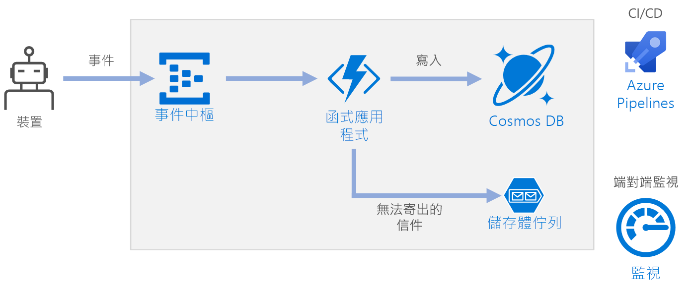

# <a name="serverless-event-processing-using-azure-functions"></a>使用 Azure Functions 進行無伺服器事件處理

此參考架構顯示無伺服器、事件驅動的架構，該架構會擷取資料流、處理資料，並將結果寫入至後端資料庫。 此架構的參考實作可在 [GitHub][github] 上取得。



## <a name="architecture"></a>架構

**事件中樞**會擷取資料流。 [事件中樞][eh]是針對高輸送量資料流案例所設計的。

> [!NOTE]
> 針對 IoT 案例，我們建議 IoT 中樞。 IoT 中樞有內建端點，與 Azure 事件中樞 API 相容，所以您可以在此架構中使用任一個服務，不需要在後端處理中進行重大變更。 如需詳細資訊，請參閱[將 IoT 裝置連線到 Azure：IoT 中樞和事件中樞][iot]。

**函式應用程式**。 [Azure Functions][functions] 是無伺服器計算選項。 它會使用事件驅動的模型，在該模型中一段程式碼 ("function") 是由觸發程序叫用。 在此架構中，當事件抵達事件中樞時，它們會觸發函式，該函式會處理事件並將結果寫入至儲存體。

函式應用程式適用於處理來自事件中樞的個別記錄。 對於更複雜的資料流處理案例，請考慮使用 Azure Databricks 或 Azure 串流分析的 Apache Spark。

**Cosmos DB**。 [Cosmos DB][cosmosdb] 是多模型資料庫服務。 針對此案例，事件處理函式會使用 Cosmos DB [SQL API][cosmosdb-sql] 來儲存 JSON 記錄。

**佇列儲存體**。 [佇列儲存體][queue]是用於無效信件訊息。 如果在處理事件時發生錯誤，函式會儲存無效信件佇列中的事件資料供稍後處理。 如需詳細資訊，請參閱[恢復功能考量](#resiliency-considerations)。

**Azure 監視器**。 [監視器][monitor]會收集解決方案中部署的 Azure 服務相關效能計量。 透過儀表板中的資料視覺化，您可以看到解決方案的健康情況。

**Azure Pipelines**。 [Pipelines][pipelines] 是持續整合 (CI) 和持續傳遞 (CD) 服務，它會建置、測試及部署應用程式。

## <a name="scalability-considerations"></a>延展性考量

### <a name="event-hubs"></a>事件中樞

事件中樞的輸送量容量會以[輸送量單位][eh-throughput]來測量。 您可以啟用[自動擴充][eh-autoscale]以自動調整事件中樞，這會根據流量 (上限為設定的最大值) 自動調整輸送量單位。

函式應用程式中的[事件中樞觸發程序][eh-trigger]會根據事件中樞中的分割區數目來進行調整。 每個分割區一次獲指派一個函式執行個體。 若要將輸送量最大化，請批次接收事件，而不是一次一個。

### <a name="cosmos-db"></a>Cosmos DB

Cosmos DB 的輸送量容量會以[要求單位][ru] (RU) 來測量。 若要將 Cosmos DB 容器調整超過 10,000 RU，建立容器時您必須指定[分割區索引鍵][partition-key]，並在您建立的每份文件中包含分割區索引鍵。

以下是良好分割區索引鍵的一些特性：

- 索引鍵值空間很大。 
- 會針對每個索引鍵值平均分配讀取/寫入，避免熱門索引鍵。
- 針對任何單一索引鍵值所儲存的資料上限不會超過最大實體分割區大小 (10 GB)。 
- 文件的分割區索引鍵不會變更。 您無法更新現有文件上的分割區索引鍵。 

在此參考架構的案例中，函式會針對傳送資料的各個裝置，確實儲存一個文件。 函式會使用 upsert 作業，持續以最新的裝置狀態來更新文件。 裝置識別碼對於此案例是很好的分割區索引鍵，因為寫入會平均分配到索引鍵，而且每個分割區的大小會嚴格限定，因為每個索引鍵值有單一文件。 如需有關分割區索引鍵的詳細資訊，請參閱[在 Azure Cosmos DB 中進行資料分割和調整][cosmosdb-scale]。

## <a name="resiliency-considerations"></a>恢復功能考量

搭配 Functions 使用事件中樞觸發程序時，攔截您處理迴圈內的例外狀況。 如果發生無法處理的例外狀況，Functions 執行階段不會重試訊息。 如果無法處理訊息，請將訊息放入無效信件佇列。 使用頻外程序來檢查訊息並判斷矯正措施。 

下列程式碼示範擷取函式如何攔截例外狀況，並將未處理的訊息放入無效信件佇列。

```csharp
[FunctionName("RawTelemetryFunction")]
[StorageAccount("DeadLetterStorage")]
public static async Task RunAsync(
    [EventHubTrigger("%EventHubName%", Connection = "EventHubConnection", ConsumerGroup ="%EventHubConsumerGroup%")]EventData[] messages,
    [Queue("deadletterqueue")] IAsyncCollector<DeadLetterMessage> deadLetterMessages,
    ILogger logger)
{
    foreach (var message in messages)
    {
        DeviceState deviceState = null;

        try
        {
            deviceState = telemetryProcessor.Deserialize(message.Body.Array, logger);
        }
        catch (Exception ex)
        {
            logger.LogError(ex, "Error deserializing message", message.SystemProperties.PartitionKey, message.SystemProperties.SequenceNumber);
            await deadLetterMessages.AddAsync(new DeadLetterMessage { Issue = ex.Message, EventData = message });
        }

        try
        {
            await stateChangeProcessor.UpdateState(deviceState, logger);
        }
        catch (Exception ex)
        {
            logger.LogError(ex, "Error updating status document", deviceState);
            await deadLetterMessages.AddAsync(new DeadLetterMessage { Issue = ex.Message, EventData = message, DeviceState = deviceState });
        }
    }
}
```

請注意，函式會使用[佇列儲存體輸出繫結][queue-binding]將項目放入佇列。

如上所示的程式碼也會將例外狀況記錄至 Application Insights。 您可以使用分割區索引鍵和序號，將無效信件訊息與記錄中的例外狀況相互關聯。 

無效信件佇列中的訊息應該有足夠的資訊，讓您可以了解錯誤的內容。 在此範例中，`DeadLetterMessage` 類別包含例外狀況訊息、原始事件資料，以及還原序列化事件訊息 (如果有的話)。 

```csharp
public class DeadLetterMessage
{
    public string Issue { get; set; }
    public EventData EventData { get; set; }
    public DeviceState DeviceState { get; set; }
}
```

使用 [Azure 監視器][monitor]來監視事件中樞。 如果您發現有輸入但沒有輸出，這表示未處理訊息。 在此情況下，進入 [Log Analytics][log-analytics] 並尋找例外狀況或其他錯誤。

## <a name="disaster-recovery-considerations"></a>災害復原考量

這裡示範的部署是位於單一 Azure 區域中。 如需更有彈性的災害復原方法，請利用各種服務中的地區散發功能：

- **事件中樞**。 建立兩個事件中樞命名空間，主要 (主動) 命名空間和次要 (被動) 命名空間。 訊息會自動路由傳送至主動命名空間，除非您容錯移轉至次要命名空間。 如需詳細資訊，請參閱 [Azure 事件中樞地理災害復原][eh-dr]。

- **函式應用程式**。 部署第二個函式應用程式，該應用程式正在等候從次要事件中樞命名空間中讀取。 此函式會寫入至無效信件佇列的次要儲存體帳戶。

- **Cosmos DB**。 Cosmos DB 支援[多重主要區域][cosmosdb-geo]，可讓您寫入至新增到 Cosmos DB 帳戶的任何區域。 如果您未啟用多重主要，您仍然可以容錯移轉主要寫入區域。 Cosmos DB 用戶端 SDK 與 Azure Function 繫結會自動處理容錯移轉，因此您不需要更新任何應用程式組態設定。

- **Azure 儲存體**。 針對無效信件佇列使用 [RA-GRS][ra-grs] 儲存體。 這樣會在另一個區域中建立唯讀複本。 如果主要區域無法使用，您可以讀取目前在佇列中的項目。 此外，在次要區域中佈建另一個儲存體帳戶，讓函式可以在容錯移轉之後寫入至其中。

## <a name="deploy-the-solution"></a>部署解決方案

若要部署此參考架構，請檢視 [GitHub 讀我檔案][readme]。 

<!-- links -->

[cosmosdb]: /azure/cosmos-db/introduction
[cosmosdb-geo]: /azure/cosmos-db/distribute-data-globally
[cosmosdb-scale]: /azure/cosmos-db/partition-data
[cosmosdb-sql]: /azure/cosmos-db/sql-api-introduction
[eh]: /azure/event-hubs/
[eh-autoscale]: /azure/event-hubs/event-hubs-auto-inflate
[eh-dr]: /azure/event-hubs/event-hubs-geo-dr
[eh-throughput]: /azure/event-hubs/event-hubs-features#throughput-units
[eh-trigger]: /azure/azure-functions/functions-bindings-event-hubs
[functions]: /azure/azure-functions/functions-overview
[iot]: /azure/iot-hub/iot-hub-compare-event-hubs
[log-analytics]: /azure/log-analytics/log-analytics-queries
[monitor]: /azure/azure-monitor/overview
[partition-key]: /azure/cosmos-db/partition-data
[pipelines]: /azure/devops/pipelines/index
[queue]: /azure/storage/queues/storage-queues-introduction
[queue-binding]: /azure/azure-functions/functions-bindings-storage-queue#output
[ra-grs]: /azure/storage/common/storage-redundancy-grs
[ru]: /azure/cosmos-db/request-units

[github]: https://github.com/mspnp/serverless-reference-implementation
[readme]: https://github.com/mspnp/serverless-reference-implementation/blob/master/README.md