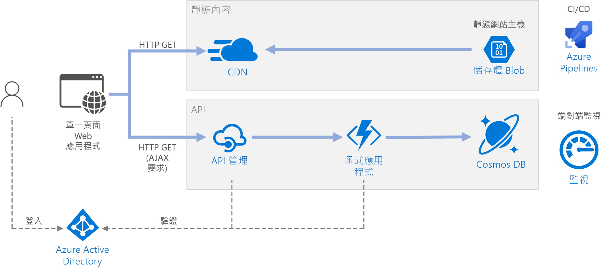

# <a name="serverless-web-application-on-azure"></a><span data-ttu-id="b6e0b-103">Azure 上的無伺服器 Web 應用程式</span><span class="sxs-lookup"><span data-stu-id="b6e0b-103">Serverless web application on Azure</span></span>

<span data-ttu-id="b6e0b-104">此參考架構顯示[無伺服器](https://azure.microsoft.com/solutions/serverless/) Web 應用程式。</span><span class="sxs-lookup"><span data-stu-id="b6e0b-104">This reference architecture shows a [serverless](https://azure.microsoft.com/solutions/serverless/) web application.</span></span> <span data-ttu-id="b6e0b-105">應用程式會為 Azure Blob 儲存體的靜態內容提供服務，並且使用 Azure Functions 來實作 API。</span><span class="sxs-lookup"><span data-stu-id="b6e0b-105">The application serves static content from Azure Blob Storage, and implements an API using Azure Functions.</span></span> <span data-ttu-id="b6e0b-106">API 會從 Cosmos DB 讀取資料，並且將結果傳回至 Web 應用程式。</span><span class="sxs-lookup"><span data-stu-id="b6e0b-106">The API reads data from Cosmos DB and returns the results to the web app.</span></span> <span data-ttu-id="b6e0b-107">此架構的參考實作可在 [GitHub][github] 上取得。</span><span class="sxs-lookup"><span data-stu-id="b6e0b-107">A reference implementation for this architecture is available on [GitHub][github].</span></span>



<span data-ttu-id="b6e0b-109">無伺服器一詞有兩個不同但相關的意思：</span><span class="sxs-lookup"><span data-stu-id="b6e0b-109">The term serverless has two distinct but related meanings:</span></span>

- <span data-ttu-id="b6e0b-110">**後端即服務** (BaaS)。</span><span class="sxs-lookup"><span data-stu-id="b6e0b-110">**Backend as a service** (BaaS).</span></span> <span data-ttu-id="b6e0b-111">後端雲端服務，例如資料庫和儲存體，提供 API 讓用戶端應用程式直接連線到這些服務。</span><span class="sxs-lookup"><span data-stu-id="b6e0b-111">Backend cloud services, such as databases and storage, provide APIs that enable client applications to connect directly to these services.</span></span>
- <span data-ttu-id="b6e0b-112">**函式即服務** (FaaS)。</span><span class="sxs-lookup"><span data-stu-id="b6e0b-112">**Functions as a service** (FaaS).</span></span> <span data-ttu-id="b6e0b-113">在此模型中，"function" 是部署至雲端的一段程式碼，在裝載環境內執行，將執行程式碼的伺服器完全摘要出來。</span><span class="sxs-lookup"><span data-stu-id="b6e0b-113">In this model, a "function" is a piece of code that is deployed to the cloud and runs inside a hosting environment that completely abstracts the servers that run the code.</span></span>

<span data-ttu-id="b6e0b-114">這兩個定義在概念上的共通之處，就是開發人員和 DevOps 人員不需要部署、設定或管理伺服器。</span><span class="sxs-lookup"><span data-stu-id="b6e0b-114">Both definitions have in common the idea that developers and DevOps personnel don't need to deploy, configure, or manage servers.</span></span> <span data-ttu-id="b6e0b-115">此參考架構著重於使用 Azure Functions 的 FaaS，雖然為 Azure Blob 儲存體的 Web 內容提供服務是 BaaS 的範例。</span><span class="sxs-lookup"><span data-stu-id="b6e0b-115">This reference architecture focuses on FaaS using Azure Functions, although serving web content from Azure Blob Storage is an example of BaaS.</span></span> <span data-ttu-id="b6e0b-116">FaaS 的一些重要特性是：</span><span class="sxs-lookup"><span data-stu-id="b6e0b-116">Some important characteristics of FaaS are:</span></span>

1. <span data-ttu-id="b6e0b-117">計算資源會視平台的需要，動態配置。</span><span class="sxs-lookup"><span data-stu-id="b6e0b-117">Compute resources are allocated dynamically as needed by the platform.</span></span>
1. <span data-ttu-id="b6e0b-118">以耗用量為基礎的定價：您只需支付用來執行程式碼的計算資源。</span><span class="sxs-lookup"><span data-stu-id="b6e0b-118">Consumption-based pricing: You are charged only for the compute resources used to execute your code.</span></span>
1. <span data-ttu-id="b6e0b-119">計算資源會根據流量進行隨需調整，開發人員不需要進行任何設定。</span><span class="sxs-lookup"><span data-stu-id="b6e0b-119">The compute resources scale on demand based on traffic, without the developer needing to do any configuration.</span></span>

<span data-ttu-id="b6e0b-120">函式會在外部觸發程序發生時執行，例如 HTTP 要求或訊息抵達佇列時。</span><span class="sxs-lookup"><span data-stu-id="b6e0b-120">Functions are executed when an external trigger occurs, such as an HTTP request or a message arriving on a queue.</span></span> <span data-ttu-id="b6e0b-121">這樣可以自然地為無伺服器架構提供[事件驅動架構樣式][event-driven]。</span><span class="sxs-lookup"><span data-stu-id="b6e0b-121">This makes an [event-driven architecture style][event-driven] natural for serverless architectures.</span></span> <span data-ttu-id="b6e0b-122">若要協調架構中元件之間的工作，請考慮使用訊息代理程式或 pub/sub 模式。</span><span class="sxs-lookup"><span data-stu-id="b6e0b-122">To coordinate work between components in the architecture, consider using message brokers or pub/sub patterns.</span></span> <span data-ttu-id="b6e0b-123">如需在 Azure 中傳訊技術之間做選擇的協助，請參閱[在傳遞訊息的 Azure 服務之間進行選擇][azure-messaging]。</span><span class="sxs-lookup"><span data-stu-id="b6e0b-123">For help choosing between messaging technologies in Azure, see [Choose between Azure services that deliver messages][azure-messaging].</span></span>

## <a name="architecture"></a><span data-ttu-id="b6e0b-124">架構</span><span class="sxs-lookup"><span data-stu-id="b6e0b-124">Architecture</span></span>

<span data-ttu-id="b6e0b-125">此架構由下列元件組成：</span><span class="sxs-lookup"><span data-stu-id="b6e0b-125">The architecture consists of the following components:</span></span>

<span data-ttu-id="b6e0b-126">**Blob 儲存體**。</span><span class="sxs-lookup"><span data-stu-id="b6e0b-126">**Blob Storage**.</span></span> <span data-ttu-id="b6e0b-127">靜態 Web 內容 (例如 HTML、CSS 和 JavaScript 檔案) 會儲存在 Azure Blob 儲存體中，並且使用[靜態網站代管][static-hosting]來為用戶端提供服務。</span><span class="sxs-lookup"><span data-stu-id="b6e0b-127">Static web content, such as HTML, CSS, and JavaScript files, are stored in Azure Blob Storage and served to clients by using [static website hosting][static-hosting].</span></span> <span data-ttu-id="b6e0b-128">透過 JavaScript 程式碼發生的所有動態互動，都會對後端 API 進行呼叫。</span><span class="sxs-lookup"><span data-stu-id="b6e0b-128">All dynamic interaction happens through JavaScript code making calls to the backend APIs.</span></span> <span data-ttu-id="b6e0b-129">沒有伺服器端程式碼可用來轉譯網頁。</span><span class="sxs-lookup"><span data-stu-id="b6e0b-129">There is no server-side code to render the web page.</span></span> <span data-ttu-id="b6e0b-130">靜態網站代管支援索引文件和自訂 404 錯誤頁面。</span><span class="sxs-lookup"><span data-stu-id="b6e0b-130">Static website hosting supports index documents and custom 404 error pages.</span></span>

> [!NOTE]
> <span data-ttu-id="b6e0b-131">靜態網站代管目前處於[預覽][static-hosting-preview]狀態。</span><span class="sxs-lookup"><span data-stu-id="b6e0b-131">Static website hosting is currently in [preview][static-hosting-preview].</span></span>

<span data-ttu-id="b6e0b-132">**CDN**。</span><span class="sxs-lookup"><span data-stu-id="b6e0b-132">**CDN**.</span></span> <span data-ttu-id="b6e0b-133">使用 [Azure 內容傳遞網路][cdn] (CDN) 快取內容，以降低延遲而且更快速傳遞內容，以及佈建 HTTPS 端點。</span><span class="sxs-lookup"><span data-stu-id="b6e0b-133">Use [Azure Content Delivery Network][cdn] (CDN) to cache content for lower latency and faster delivery of content, as well as providing an HTTPS endpoint.</span></span>

<span data-ttu-id="b6e0b-134">**函式應用程式**。</span><span class="sxs-lookup"><span data-stu-id="b6e0b-134">**Function Apps**.</span></span> <span data-ttu-id="b6e0b-135">[Azure Functions][functions] 是無伺服器計算選項。</span><span class="sxs-lookup"><span data-stu-id="b6e0b-135">[Azure Functions][functions] is a serverless compute option.</span></span> <span data-ttu-id="b6e0b-136">它會使用事件驅動的模型，在該模型中一段程式碼 ("function") 是由觸發程序叫用。</span><span class="sxs-lookup"><span data-stu-id="b6e0b-136">It uses an event-driven model, where a piece of code (a "function") is invoked by a trigger.</span></span> <span data-ttu-id="b6e0b-137">在此架構中，當用戶端提出 HTTP 要求時，會叫用函式。</span><span class="sxs-lookup"><span data-stu-id="b6e0b-137">In this architecture, the function is invoked when a client makes an HTTP request.</span></span> <span data-ttu-id="b6e0b-138">要求一律會透過 API 閘道路由傳送，如下所述。</span><span class="sxs-lookup"><span data-stu-id="b6e0b-138">The request is always routed through an API gateway, described below.</span></span>

<span data-ttu-id="b6e0b-139">**API 管理**。</span><span class="sxs-lookup"><span data-stu-id="b6e0b-139">**API Management**.</span></span> <span data-ttu-id="b6e0b-140">[API 管理][apim]提供位於 HTTP 函式前方的 API 閘道。</span><span class="sxs-lookup"><span data-stu-id="b6e0b-140">[API Management][apim] provides a API gateway that sits in front of the HTTP function.</span></span> <span data-ttu-id="b6e0b-141">您可以使用 API 管理來發佈和管理由用戶端應用程式使用的 API。</span><span class="sxs-lookup"><span data-stu-id="b6e0b-141">You can use API Management to publish and manage APIs used by client applications.</span></span> <span data-ttu-id="b6e0b-142">使用閘道有助於讓前端應用程式與後端 API 分離。</span><span class="sxs-lookup"><span data-stu-id="b6e0b-142">Using a gateway helps to decouple the front-end application from the back-end APIs.</span></span> <span data-ttu-id="b6e0b-143">例如，API 管理可以重新撰寫 URL、在要求到達後端之前轉換要求、設定要求或回應標頭等等。</span><span class="sxs-lookup"><span data-stu-id="b6e0b-143">For example, API Management can rewrite URLs, transform requests before they reach the backend, set request or response headers, and so forth.</span></span>

<span data-ttu-id="b6e0b-144">API 管理也可用來實作跨領域考量，例如：</span><span class="sxs-lookup"><span data-stu-id="b6e0b-144">API Management can also be used to implement cross-cutting concerns such as:</span></span>

- <span data-ttu-id="b6e0b-145">強制採用使用量配額和頻率限制</span><span class="sxs-lookup"><span data-stu-id="b6e0b-145">Enforcing usage quotas and rate limits</span></span>
- <span data-ttu-id="b6e0b-146">驗證 OAuth 權杖以進行驗證</span><span class="sxs-lookup"><span data-stu-id="b6e0b-146">Validating OAuth tokens for authentication</span></span>
- <span data-ttu-id="b6e0b-147">啟用跨原始來源要求 (CORS)</span><span class="sxs-lookup"><span data-stu-id="b6e0b-147">Enabling cross-origin requests (CORS)</span></span>
- <span data-ttu-id="b6e0b-148">快取回應</span><span class="sxs-lookup"><span data-stu-id="b6e0b-148">Caching responses</span></span>
- <span data-ttu-id="b6e0b-149">監視和記錄要求</span><span class="sxs-lookup"><span data-stu-id="b6e0b-149">Monitoring and logging requests</span></span>

<span data-ttu-id="b6e0b-150">如果您不需要 API 管理所提供的所有功能，另一個選項是使用[函式 Proxy][functions-proxy]。</span><span class="sxs-lookup"><span data-stu-id="b6e0b-150">If you don't need all of the functionality provided by API Management, another option is to use [Functions Proxies][functions-proxy].</span></span> <span data-ttu-id="b6e0b-151">Azure Functions 的這項功能可讓您藉由建立至後端函式的路由，為多個函式應用程式定義單一 API 介面。</span><span class="sxs-lookup"><span data-stu-id="b6e0b-151">This feature of Azure Functions lets you define a single API surface for multiple function apps, by creating routes to back-end functions.</span></span> <span data-ttu-id="b6e0b-152">函式 Proxy 也可以在 HTTP 要求和回應上執行有限的轉換。</span><span class="sxs-lookup"><span data-stu-id="b6e0b-152">Function proxies can also perform limited transformations on the HTTP request and response.</span></span> <span data-ttu-id="b6e0b-153">不過，它們不提供與 API 管理相同的豐富原則型功能。</span><span class="sxs-lookup"><span data-stu-id="b6e0b-153">However, they don't provide the same rich policy-based capabilities of API Management.</span></span>

<span data-ttu-id="b6e0b-154">**Cosmos DB**。</span><span class="sxs-lookup"><span data-stu-id="b6e0b-154">**Cosmos DB**.</span></span> <span data-ttu-id="b6e0b-155">[Cosmos DB][cosmosdb] 是多模型資料庫服務。</span><span class="sxs-lookup"><span data-stu-id="b6e0b-155">[Cosmos DB][cosmosdb] is a multi-model database service.</span></span> <span data-ttu-id="b6e0b-156">針對此案例，函式應用程式會擷取 Cosmos DB 的文件以回應用戶端的 HTTP GET 要求。</span><span class="sxs-lookup"><span data-stu-id="b6e0b-156">For this scenario, the function application fetches documents from Cosmos DB in response to HTTP GET requests from the client.</span></span>

<span data-ttu-id="b6e0b-157">**Azure Active Directory** (Azure AD)。</span><span class="sxs-lookup"><span data-stu-id="b6e0b-157">**Azure Active Directory** (Azure AD).</span></span> <span data-ttu-id="b6e0b-158">使用者藉由使用其 Azure AD 認證來登入 Web 應用程式。</span><span class="sxs-lookup"><span data-stu-id="b6e0b-158">Users sign into the web application by using their Azure AD credentials.</span></span> <span data-ttu-id="b6e0b-159">Azure AD 會傳回 API 的存取權杖，Web 應用程式會使用該權杖來驗證 API 要求 (請參閱[驗證](#authentication))。</span><span class="sxs-lookup"><span data-stu-id="b6e0b-159">Azure AD returns an access token for the API, which the web application uses to authenticate API requests (see [Authentication](#authentication)).</span></span>

<span data-ttu-id="b6e0b-160">**Azure 監視器**。</span><span class="sxs-lookup"><span data-stu-id="b6e0b-160">**Azure Monitor**.</span></span> <span data-ttu-id="b6e0b-161">[監視器][monitor]會收集解決方案中部署的 Azure 服務相關效能計量。</span><span class="sxs-lookup"><span data-stu-id="b6e0b-161">[Monitor][monitor] collects performance metrics about the Azure services deployed in the solution.</span></span> <span data-ttu-id="b6e0b-162">透過儀表板中的資料視覺化，您可以看到解決方案的健康情況。</span><span class="sxs-lookup"><span data-stu-id="b6e0b-162">By visualizing these in a dashboard, you can get visibility into the health of the solution.</span></span> <span data-ttu-id="b6e0b-163">也會收集應用程式記錄。</span><span class="sxs-lookup"><span data-stu-id="b6e0b-163">It also collected application logs.</span></span>

<span data-ttu-id="b6e0b-164">**Azure Pipelines**。</span><span class="sxs-lookup"><span data-stu-id="b6e0b-164">**Azure Pipelines**.</span></span> <span data-ttu-id="b6e0b-165">[Pipelines][pipelines] 是持續整合 (CI) 和持續傳遞 (CD) 服務，它會建置、測試及部署應用程式。</span><span class="sxs-lookup"><span data-stu-id="b6e0b-165">[Pipelines][pipelines] is a continuous integration (CI) and continuous delivery (CD) service that builds, tests, and deploys the application.</span></span>

## <a name="recommendations"></a><span data-ttu-id="b6e0b-166">建議</span><span class="sxs-lookup"><span data-stu-id="b6e0b-166">Recommendations</span></span>

### <a name="function-app-plans"></a><span data-ttu-id="b6e0b-167">函式應用程式方案</span><span class="sxs-lookup"><span data-stu-id="b6e0b-167">Function App plans</span></span>

<span data-ttu-id="b6e0b-168">Azure Functions 支援兩種裝載模型。</span><span class="sxs-lookup"><span data-stu-id="b6e0b-168">Azure Functions supports two hosting models.</span></span> <span data-ttu-id="b6e0b-169">使用**使用情況方案**，會在程式碼執行時自動配置計算能力。</span><span class="sxs-lookup"><span data-stu-id="b6e0b-169">With the **consumption plan**, compute power is automatically allocated when your code is running.</span></span>  <span data-ttu-id="b6e0b-170">使用 **App Service** 方案，就會為您的程式碼配置一組 VM。</span><span class="sxs-lookup"><span data-stu-id="b6e0b-170">With the **App Service** plan, a set of VMs are allocated for your code.</span></span> <span data-ttu-id="b6e0b-171">App Service 方案會定義 VM 數目和 VM 大小。</span><span class="sxs-lookup"><span data-stu-id="b6e0b-171">The App Service plan defines the number of VMs and the VM size.</span></span>

<span data-ttu-id="b6e0b-172">請注意，根據上述的定義，App Service 方案並不是嚴格的*無伺服器*。</span><span class="sxs-lookup"><span data-stu-id="b6e0b-172">Note that the App Service plan is not strictly *serverless*, according to the definition given above.</span></span> <span data-ttu-id="b6e0b-173">程式設計模型相同，不過，相同函式程式碼可以在使用情況方案和 App Service 方案中執行。</span><span class="sxs-lookup"><span data-stu-id="b6e0b-173">The programming model is the same, however &mdash; the same function code can run in both a consumption plan and an App Service plan.</span></span>

<span data-ttu-id="b6e0b-174">以下是選擇要使用哪個類型方案時要考慮的一些因素：</span><span class="sxs-lookup"><span data-stu-id="b6e0b-174">Here are some factors to consider when choosing which type of plan to use:</span></span>

- <span data-ttu-id="b6e0b-175">**冷啟動**。</span><span class="sxs-lookup"><span data-stu-id="b6e0b-175">**Cold start**.</span></span> <span data-ttu-id="b6e0b-176">使用使用情況方案，最近尚未叫用的函式將會在下次執行時發生一些額外的延遲。</span><span class="sxs-lookup"><span data-stu-id="b6e0b-176">With the consumption plan, a function that hasn't been invoked recently will incur some additional latency the next time it runs.</span></span> <span data-ttu-id="b6e0b-177">這個額外的延遲是因為配置以及準備執行階段環境。</span><span class="sxs-lookup"><span data-stu-id="b6e0b-177">This additional latency is due to allocating and preparing the runtime environment.</span></span> <span data-ttu-id="b6e0b-178">通常是數秒鐘，但是會因為一些因素而異，包括需要載入的相依性數目。</span><span class="sxs-lookup"><span data-stu-id="b6e0b-178">It is usually on the order of seconds but depends on several factors, including the number of dependencies that need to be loaded.</span></span> <span data-ttu-id="b6e0b-179">如需詳細資訊，請參閱[了解無伺服器冷啟動][functions-cold-start]。</span><span class="sxs-lookup"><span data-stu-id="b6e0b-179">For more information, see [Understanding Serverless Cold Start][functions-cold-start].</span></span> <span data-ttu-id="b6e0b-180">冷啟動通常更關注於互動式工作負載 (HTTP 觸發程序) 而非非同步訊息驅動工作負載 (佇列或事件中樞觸發程序)，因為使用者會直接觀察到額外的延遲。</span><span class="sxs-lookup"><span data-stu-id="b6e0b-180">Cold start is usually more of a concern for interactive workloads (HTTP triggers) than asynchronous message-driven workloads (queue or event hubs triggers), because the additional latency is directly observed by users.</span></span>
- <span data-ttu-id="b6e0b-181">**逾時期間**。</span><span class="sxs-lookup"><span data-stu-id="b6e0b-181">**Timeout period**.</span></span>  <span data-ttu-id="b6e0b-182">在使用情況方案中，函式執行會在一段[可設定][functions-timeout]的時間之後逾時 (最多 10 分鐘)</span><span class="sxs-lookup"><span data-stu-id="b6e0b-182">In the consumption plan, a function execution times out after a [configurable][functions-timeout] period of time (to a maximum of 10 minutes)</span></span>
- <span data-ttu-id="b6e0b-183">**虛擬網路隔離**。</span><span class="sxs-lookup"><span data-stu-id="b6e0b-183">**Virtual network isolation**.</span></span> <span data-ttu-id="b6e0b-184">使用 App Service 方案可讓函式在 [App Service 環境][ase]內執行，這是專用和隔離的裝載環境。</span><span class="sxs-lookup"><span data-stu-id="b6e0b-184">Using an App Service plan allows functions to run inside of an [App Service Environment][ase], which is a dedicated and isolated hosting environment.</span></span>
- <span data-ttu-id="b6e0b-185">**定價模型**。</span><span class="sxs-lookup"><span data-stu-id="b6e0b-185">**Pricing model**.</span></span> <span data-ttu-id="b6e0b-186">使用情況方案是依據執行次數和資源使用情況 (記憶體 &times; 執行時間) 來計費。</span><span class="sxs-lookup"><span data-stu-id="b6e0b-186">The consumption plan is billed by the number of executions and resource consumption (memory &times; execution time).</span></span> <span data-ttu-id="b6e0b-187">App Service 方案是每小時依據 VM 執行個體 SKU 來計費。</span><span class="sxs-lookup"><span data-stu-id="b6e0b-187">The App Service plan is billed hourly based on VM instance SKU.</span></span> <span data-ttu-id="b6e0b-188">通常，使用情況方案比 App Service 方案便宜，因為您只需支付您所使用的計算資源。</span><span class="sxs-lookup"><span data-stu-id="b6e0b-188">Often, the consumption plan can be cheaper than an App Service plan, because you pay only for the compute resources that you use.</span></span> <span data-ttu-id="b6e0b-189">如果您的流量有尖峰與低谷，更是如此。</span><span class="sxs-lookup"><span data-stu-id="b6e0b-189">This is especially true if your traffic experiences peaks and troughs.</span></span> <span data-ttu-id="b6e0b-190">不過，如果應用程式有常態的大量輸送量，App Service 方案可能會比使用情況方案還要划算。</span><span class="sxs-lookup"><span data-stu-id="b6e0b-190">However, if an application experiences constant high-volume throughput, an App Service plan may cost less than the consumption plan.</span></span>
- <span data-ttu-id="b6e0b-191">**調整大小**。</span><span class="sxs-lookup"><span data-stu-id="b6e0b-191">**Scaling**.</span></span> <span data-ttu-id="b6e0b-192">使用情況模型的一大優點是，它會根據連入流量視需要動態調整。</span><span class="sxs-lookup"><span data-stu-id="b6e0b-192">A big advantage of the consumption model is that it scales dynamically as needed, based on the incoming traffic.</span></span> <span data-ttu-id="b6e0b-193">雖然這個調整相當快速，還是有緩慢的期間。</span><span class="sxs-lookup"><span data-stu-id="b6e0b-193">While this scaling occurs quickly, there is still a ramp-up period.</span></span> <span data-ttu-id="b6e0b-194">對於某些工作負載，您可以故意過度佈建 VM，以便處理暴增的流量而不會有緩慢的時間。</span><span class="sxs-lookup"><span data-stu-id="b6e0b-194">For some workloads, you might want to deliberately overprovision the VMs, so that you can handle bursts of traffic with zero ramp-up time.</span></span> <span data-ttu-id="b6e0b-195">在此情況下，請考慮 App Service 方案。</span><span class="sxs-lookup"><span data-stu-id="b6e0b-195">In that case, consider an App Service plan.</span></span>

### <a name="function-app-boundaries"></a><span data-ttu-id="b6e0b-196">函式應用程式界限</span><span class="sxs-lookup"><span data-stu-id="b6e0b-196">Function App boundaries</span></span>

<span data-ttu-id="b6e0b-197">函式應用程式可主控一或多個函式的執行。</span><span class="sxs-lookup"><span data-stu-id="b6e0b-197">A *function app* hosts the execution of one or more *functions*.</span></span> <span data-ttu-id="b6e0b-198">您可以使用函式應用程式將數個函式群組在一起，作為邏輯單元。</span><span class="sxs-lookup"><span data-stu-id="b6e0b-198">You can use a function app to group several functions together as a logical unit.</span></span> <span data-ttu-id="b6e0b-199">在函式應用程式中，函式會共用相同的應用程式設定、裝載方案，以及部署生命週期。</span><span class="sxs-lookup"><span data-stu-id="b6e0b-199">Within a function app, the functions share the same application settings, hosting plan, and deployment lifecycle.</span></span> <span data-ttu-id="b6e0b-200">每個函式應用程式都有自己的主機名稱。</span><span class="sxs-lookup"><span data-stu-id="b6e0b-200">Each function app has its own hostname.</span></span>

<span data-ttu-id="b6e0b-201">使用函式應用程式將共用相同生命週期和設定的函式群組在一起。</span><span class="sxs-lookup"><span data-stu-id="b6e0b-201">Use function apps to group functions that share the same lifecycle and settings.</span></span> <span data-ttu-id="b6e0b-202">不會共用相同生命週期的函式應該裝載在不同的函式應用程式中。</span><span class="sxs-lookup"><span data-stu-id="b6e0b-202">Functions that don't share the same lifecycle should be hosted in different function apps.</span></span>

<span data-ttu-id="b6e0b-203">請考慮採用微服務方法，其中每個函式應用程式代表一個微服務，可能包含數個相關的函式。</span><span class="sxs-lookup"><span data-stu-id="b6e0b-203">Consider taking a microservices approach, where each function app represents one microservice, possibly consisting of several related functions.</span></span> <span data-ttu-id="b6e0b-204">在微服務架構中，服務應該具有鬆散結合和高度功能一致性的特性。</span><span class="sxs-lookup"><span data-stu-id="b6e0b-204">In a microservices architecture, services should have loose coupling and high functional cohesion.</span></span> <span data-ttu-id="b6e0b-205">若您可以變更一項服務，而不需要同時更新其他服務，就表示是鬆散結合。</span><span class="sxs-lookup"><span data-stu-id="b6e0b-205">*Loosely* coupled means you can change one service without requiring other services to be updated at the same time.</span></span> <span data-ttu-id="b6e0b-206">緊密表示服務具有單一、明確定義的用途。</span><span class="sxs-lookup"><span data-stu-id="b6e0b-206">*Cohesive* means a service has a single, well-defined purpose.</span></span> <span data-ttu-id="b6e0b-207">如需有關這些概念的詳細討論，請參閱[設計微服務：領域分析][microservices-domain-analysis]。</span><span class="sxs-lookup"><span data-stu-id="b6e0b-207">For more discussion of these ideas, see [Designing microservices: Domain analysis][microservices-domain-analysis].</span></span>

### <a name="function-bindings"></a><span data-ttu-id="b6e0b-208">Function 繫結</span><span class="sxs-lookup"><span data-stu-id="b6e0b-208">Function bindings</span></span>

<span data-ttu-id="b6e0b-209">可行時使用 Functions [繫結][functions-bindings]。</span><span class="sxs-lookup"><span data-stu-id="b6e0b-209">Use Functions [bindings][functions-bindings] when possible.</span></span> <span data-ttu-id="b6e0b-210">繫結會提供宣告式方式，將您的程式碼連線至資料，並與其他 Azure 服務整合。</span><span class="sxs-lookup"><span data-stu-id="b6e0b-210">Bindings provide a declarative way to connect your code to data and integrate with other Azure services.</span></span> <span data-ttu-id="b6e0b-211">輸入繫結會從外部資料來源填入輸入參數。</span><span class="sxs-lookup"><span data-stu-id="b6e0b-211">An input binding populates an input parameter from an external data source.</span></span> <span data-ttu-id="b6e0b-212">輸出繫結會將函式的傳回值傳送至資料接收器，例如佇列或資料庫。</span><span class="sxs-lookup"><span data-stu-id="b6e0b-212">An output binding sends the function's return value to a data sink, such as a queue or database.</span></span>

<span data-ttu-id="b6e0b-213">例如，參考實作中的 `GetStatus` 函式會使用 Cosmos DB [輸入繫結][cosmosdb-input-binding]。</span><span class="sxs-lookup"><span data-stu-id="b6e0b-213">For example, the `GetStatus` function in the reference implementation uses the Cosmos DB [input binding][cosmosdb-input-binding].</span></span> <span data-ttu-id="b6e0b-214">這個繫結是設定為在 Cosmos DB 中查詢文件，使用從 HTTP 要求中查詢字串採用的查詢參數。</span><span class="sxs-lookup"><span data-stu-id="b6e0b-214">This binding is configured to look up a document in Cosmos DB, using query parameters that are taken from the query string in the HTTP request.</span></span> <span data-ttu-id="b6e0b-215">如果找到文件，則將它傳遞至函式作為參數。</span><span class="sxs-lookup"><span data-stu-id="b6e0b-215">If the document is found, it is passed to the function as a parameter.</span></span>

```csharp
[FunctionName("GetStatusFunction")]
public static Task<IActionResult> Run(
    [HttpTrigger(AuthorizationLevel.Function, "get", Route = null)] HttpRequest req,
    [CosmosDB(
        databaseName: "%COSMOSDB_DATABASE_NAME%",
        collectionName: "%COSMOSDB_DATABASE_COL%",
        ConnectionStringSetting = "COSMOSDB_CONNECTION_STRING",
        Id = "{Query.deviceId}",
        PartitionKey = "{Query.deviceId}")] dynamic deviceStatus,
    ILogger log)
{
    ...
}
```

<span data-ttu-id="b6e0b-216">藉由使用繫結，您不需要撰寫直接與服務交談的程式碼，如此可簡化函式程式碼，同時也能將資料來源或接收器的詳細資料摘要出來。</span><span class="sxs-lookup"><span data-stu-id="b6e0b-216">By using bindings, you don't need to write code that talks directly to the service, which makes the function code simpler and also abstracts the details of the data source or sink.</span></span> <span data-ttu-id="b6e0b-217">不過，在某些情況下，您可能需要比繫結所提供更複雜的邏輯。</span><span class="sxs-lookup"><span data-stu-id="b6e0b-217">In some cases, however, you may need more complex logic than the binding provides.</span></span> <span data-ttu-id="b6e0b-218">在此情況下，請直接使用 Azure 用戶端 SDK。</span><span class="sxs-lookup"><span data-stu-id="b6e0b-218">In that case, use the Azure client SDKs directly.</span></span>

## <a name="scalability-considerations"></a><span data-ttu-id="b6e0b-219">延展性考量</span><span class="sxs-lookup"><span data-stu-id="b6e0b-219">Scalability considerations</span></span>

<span data-ttu-id="b6e0b-220">**Functions**。</span><span class="sxs-lookup"><span data-stu-id="b6e0b-220">**Functions**.</span></span> <span data-ttu-id="b6e0b-221">針對使用情況方案，HTTP 觸發程序是根據流量進行調整。</span><span class="sxs-lookup"><span data-stu-id="b6e0b-221">For the consumption plan, the HTTP trigger scales based on the traffic.</span></span> <span data-ttu-id="b6e0b-222">並行函式執行個體的數目有限制，但是每個執行個體一次可以處理一個以上的要求。</span><span class="sxs-lookup"><span data-stu-id="b6e0b-222">There is a limit to the number of concurrent function instances, but each instance can process more than one request at a time.</span></span> <span data-ttu-id="b6e0b-223">針對 App Service 方案，HTTP 觸發程序是根據 VM 執行個體的數目進行調整，該數目可以是固定值，或是根據一組自動調整規則來自動調整。</span><span class="sxs-lookup"><span data-stu-id="b6e0b-223">For an App Service plan, the HTTP trigger scales according to the number of VM instances, which can be a fixed value or can autoscale based on a set of autoscaling rules.</span></span> <span data-ttu-id="b6e0b-224">如需詳細資訊，請參閱 [Azure Functions 規模調整和裝載][functions-scale]。</span><span class="sxs-lookup"><span data-stu-id="b6e0b-224">For information, see [Azure Functions scale and hosting][functions-scale].</span></span>

<span data-ttu-id="b6e0b-225">**Cosmos DB**。</span><span class="sxs-lookup"><span data-stu-id="b6e0b-225">**Cosmos DB**.</span></span> <span data-ttu-id="b6e0b-226">Cosmos DB 的輸送量容量會以[要求單位][ru] (RU) 來測量。</span><span class="sxs-lookup"><span data-stu-id="b6e0b-226">Throughput capacity for Cosmos DB is measured in [Request Units][ru] (RU).</span></span> <span data-ttu-id="b6e0b-227">1 RU 的輸送量會對應至需要 GET 1KB 文件的輸送量。</span><span class="sxs-lookup"><span data-stu-id="b6e0b-227">A 1-RU throughput corresponds to the throughput need to GET a 1KB document.</span></span> <span data-ttu-id="b6e0b-228">若要將 Cosmos DB 容器調整超過 10,000 RU，建立容器時您必須指定[分割區索引鍵][partition-key]，並在您建立的每份文件中包含分割區索引鍵。</span><span class="sxs-lookup"><span data-stu-id="b6e0b-228">In order to scale a Cosmos DB container past 10,000 RU, you must specify a [partition key][partition-key] when you create the container and include the partition key in every document that you create.</span></span> <span data-ttu-id="b6e0b-229">如需有關分割區索引鍵的詳細資訊，請參閱[在 Azure Cosmos DB 中進行資料分割和調整][cosmosdb-scale]。</span><span class="sxs-lookup"><span data-stu-id="b6e0b-229">For more information about partition keys, see [Partition and scale in Azure Cosmos DB][cosmosdb-scale].</span></span>

<span data-ttu-id="b6e0b-230">**API 管理**。</span><span class="sxs-lookup"><span data-stu-id="b6e0b-230">**API Management**.</span></span> <span data-ttu-id="b6e0b-231">API 管理可以相應放大，並支援規則型自動調整。</span><span class="sxs-lookup"><span data-stu-id="b6e0b-231">API Management can scale out and supports rule-based autoscaling.</span></span> <span data-ttu-id="b6e0b-232">請注意，調整程序需要至少 20 分鐘的時間。</span><span class="sxs-lookup"><span data-stu-id="b6e0b-232">Note that the scaling process takes at least 20 minutes.</span></span> <span data-ttu-id="b6e0b-233">如果您的流量暴增，您應該針對您預期的最大暴增流量進行佈建。</span><span class="sxs-lookup"><span data-stu-id="b6e0b-233">If your traffic is bursty, you should provision for the maximum burst traffic that you expect.</span></span> <span data-ttu-id="b6e0b-234">不過，自動調整對於處理每小時或每日流量變化相當有用。</span><span class="sxs-lookup"><span data-stu-id="b6e0b-234">However, autoscaling is useful for handling hourly or daily variations in traffic.</span></span> <span data-ttu-id="b6e0b-235">如需詳細資訊，請參閱[自動調整 Azure API 管理執行個體][apim-scale]。</span><span class="sxs-lookup"><span data-stu-id="b6e0b-235">For more information, see [Automatically scale an Azure API Management instance][apim-scale].</span></span>

## <a name="disaster-recovery-considerations"></a><span data-ttu-id="b6e0b-236">災害復原考量</span><span class="sxs-lookup"><span data-stu-id="b6e0b-236">Disaster recovery considerations</span></span>

<span data-ttu-id="b6e0b-237">這裡示範的部署是位於單一 Azure 區域中。</span><span class="sxs-lookup"><span data-stu-id="b6e0b-237">The deployment shown here resides in a single Azure region.</span></span> <span data-ttu-id="b6e0b-238">如需更有彈性的災害復原方法，請利用各種服務中的地區散發功能：</span><span class="sxs-lookup"><span data-stu-id="b6e0b-238">For a more resilient approach to disaster-recovery, take advantage of the geo-distribution features in the various services:</span></span>

- <span data-ttu-id="b6e0b-239">API 管理支援多區域部署，可用來在任意數量的 Azure 區域之間發佈單一 API 管理執行個體。</span><span class="sxs-lookup"><span data-stu-id="b6e0b-239">API Management supports multi-region deployment, which can be used to distribute a single API Management instance across any number of Azure regions.</span></span> <span data-ttu-id="b6e0b-240">如需詳細資訊，請參閱[如何將 Azure API 管理服務執行個體部署到多個 Azure 區域][api-geo]。</span><span class="sxs-lookup"><span data-stu-id="b6e0b-240">For more information, see [How to deploy an Azure API Management service instance to multiple Azure regions][api-geo].</span></span>

- <span data-ttu-id="b6e0b-241">使用[流量管理員][tm]以將 HTTP 要求路由傳送到主要區域。</span><span class="sxs-lookup"><span data-stu-id="b6e0b-241">Use [Traffic Manager][tm] to route HTTP requests to the primary region.</span></span> <span data-ttu-id="b6e0b-242">如果在該區域中執行的函式應用程式變得無法使用，流量管理員可以容錯移轉到次要區域。</span><span class="sxs-lookup"><span data-stu-id="b6e0b-242">If the Function App running in that region becomes unavailable, Traffic Manager can fail over to a secondary region.</span></span>

- <span data-ttu-id="b6e0b-243">Cosmos DB 支援[多重主要區域][cosmosdb-geo]，可讓您寫入至新增到 Cosmos DB 帳戶的任何區域。</span><span class="sxs-lookup"><span data-stu-id="b6e0b-243">Cosmos DB supports [multiple master regions][cosmosdb-geo], which enables writes to any region that you add to your Cosmos DB account.</span></span> <span data-ttu-id="b6e0b-244">如果您未啟用多重主要，您仍然可以容錯移轉主要寫入區域。</span><span class="sxs-lookup"><span data-stu-id="b6e0b-244">If you don't enable multi-master, you can still fail over the primary write region.</span></span> <span data-ttu-id="b6e0b-245">Cosmos DB 用戶端 SDK 與 Azure Function 繫結會自動處理容錯移轉，因此您不需要更新任何應用程式組態設定。</span><span class="sxs-lookup"><span data-stu-id="b6e0b-245">The Cosmos DB client SDKs and the Azure Function bindings automatically handle the failover, so you don't need to update any application configuration settings.</span></span>

## <a name="security-considerations"></a><span data-ttu-id="b6e0b-246">安全性考量</span><span class="sxs-lookup"><span data-stu-id="b6e0b-246">Security considerations</span></span>

### <a name="authentication"></a><span data-ttu-id="b6e0b-247">驗證</span><span class="sxs-lookup"><span data-stu-id="b6e0b-247">Authentication</span></span>

<span data-ttu-id="b6e0b-248">參考實作中的 `GetStatus` API 會使用 Azure AD 來驗證要求。</span><span class="sxs-lookup"><span data-stu-id="b6e0b-248">The `GetStatus` API in the reference implementation uses Azure AD to authenticate requests.</span></span> <span data-ttu-id="b6e0b-249">Azure AD 支援 Open ID Connect 通訊協定，該通訊協定是以 OAuth 2 通訊協定為基礎所建置的驗證通訊協定。</span><span class="sxs-lookup"><span data-stu-id="b6e0b-249">Azure AD supports the Open ID Connect protocol, which is an authentication protocol built on top of the OAuth 2 protocol.</span></span>

<span data-ttu-id="b6e0b-250">在此架構中，用戶端應用程式是在瀏覽器中執行的單頁應用程式 (SPA)。</span><span class="sxs-lookup"><span data-stu-id="b6e0b-250">In this architecture, the client application is a single-page application (SPA) that runs in the browser.</span></span> <span data-ttu-id="b6e0b-251">這種類型的用戶端應用程式無法隱藏用戶端密碼或授權碼，因此隱含授與流程是適當的。</span><span class="sxs-lookup"><span data-stu-id="b6e0b-251">This type of client application cannot keep a client secret or an authorization code hidden, so the implicit grant flow is appropriate.</span></span> <span data-ttu-id="b6e0b-252">(請參閱[應該使用何種 OAuth 2.0 流程？][oauth-flow])。</span><span class="sxs-lookup"><span data-stu-id="b6e0b-252">(See [Which OAuth 2.0 flow should I use?][oauth-flow]).</span></span> <span data-ttu-id="b6e0b-253">以下是整體流程︰</span><span class="sxs-lookup"><span data-stu-id="b6e0b-253">Here's the overall flow:</span></span>

1. <span data-ttu-id="b6e0b-254">使用者在 Web 應用程式中按一下 [登入] 連結。</span><span class="sxs-lookup"><span data-stu-id="b6e0b-254">The user clicks the "Sign in" link in the web application.</span></span>
1. <span data-ttu-id="b6e0b-255">瀏覽器重新導向至 Azure AD 登入頁面。</span><span class="sxs-lookup"><span data-stu-id="b6e0b-255">The browser is redirected the Azure AD sign in page.</span></span>
1. <span data-ttu-id="b6e0b-256">使用者登入。</span><span class="sxs-lookup"><span data-stu-id="b6e0b-256">The user signs in.</span></span>
1. <span data-ttu-id="b6e0b-257">Azure AD 會重新導向回用戶端應用程式，在 URL 片段中包含存取權杖。</span><span class="sxs-lookup"><span data-stu-id="b6e0b-257">Azure AD redirects back to the client application, including an access token in the URL fragment.</span></span>
1. <span data-ttu-id="b6e0b-258">當 Web 應用程式呼叫 API 時，它會在驗證標頭中包含存取權杖。</span><span class="sxs-lookup"><span data-stu-id="b6e0b-258">When the web application calls the API, it includes the access token in the Authentication header.</span></span> <span data-ttu-id="b6e0b-259">應用程式識別碼會作為存取權杖中的對象 ('aud') 宣告進行傳送。</span><span class="sxs-lookup"><span data-stu-id="b6e0b-259">The application ID is sent as the audience ('aud') claim in the access token.</span></span>
1. <span data-ttu-id="b6e0b-260">後端 API 會驗證存取權杖。</span><span class="sxs-lookup"><span data-stu-id="b6e0b-260">The backend API validates the access token.</span></span>

<span data-ttu-id="b6e0b-261">若要設定驗證：</span><span class="sxs-lookup"><span data-stu-id="b6e0b-261">To configure authentication:</span></span>

- <span data-ttu-id="b6e0b-262">在您的 Azure AD 租用戶中註冊應用程式。</span><span class="sxs-lookup"><span data-stu-id="b6e0b-262">Register an application in your Azure AD tenant.</span></span> <span data-ttu-id="b6e0b-263">這樣會產生應用程式識別碼，用戶端將其與登入 URL 包含在一起。</span><span class="sxs-lookup"><span data-stu-id="b6e0b-263">This generates an application ID, which the client includes with the login URL.</span></span>

- <span data-ttu-id="b6e0b-264">在函式應用程式內啟用 Azure AD 驗證。</span><span class="sxs-lookup"><span data-stu-id="b6e0b-264">Enable Azure AD authentication inside the Function App.</span></span> <span data-ttu-id="b6e0b-265">如需詳細資訊，請參閱 [Azure App Service 中的驗證與授權][app-service-auth]。</span><span class="sxs-lookup"><span data-stu-id="b6e0b-265">For more information, see [Authentication and authorization in Azure App Service][app-service-auth].</span></span>

- <span data-ttu-id="b6e0b-266">藉由驗證存取權杖，將 [validate-jwt 原則][apim-validate-jwt]新增至 API 管理以預先授權要求。</span><span class="sxs-lookup"><span data-stu-id="b6e0b-266">Add the [validate-jwt policy][apim-validate-jwt] to API Management to pre-authorize the request by validating the access token.</span></span>

<span data-ttu-id="b6e0b-267">如需詳細資訊，請參閱 [GitHub 讀我檔案][readme]。</span><span class="sxs-lookup"><span data-stu-id="b6e0b-267">For more details, see the [GitHub readme][readme].</span></span>

<span data-ttu-id="b6e0b-268">建議您在 Azure AD 中，為用戶端應用程式和後端 API 建立個別的應用程式。</span><span class="sxs-lookup"><span data-stu-id="b6e0b-268">It's recommended to create separate app registrations in Azure AD for the client application and the backend API.</span></span> <span data-ttu-id="b6e0b-269">授予用戶端應用程式權限來呼叫 API。</span><span class="sxs-lookup"><span data-stu-id="b6e0b-269">Grant the client application permission to call the API.</span></span> <span data-ttu-id="b6e0b-270">這種方法可讓您彈性地定義多個 API 和用戶端，並控制每個 API 和用戶端的權限。</span><span class="sxs-lookup"><span data-stu-id="b6e0b-270">This approach gives you the flexibility to define multiple APIs and clients and control the permissions for each.</span></span>

<span data-ttu-id="b6e0b-271">在 API 中，使用[範圍][scopes]來為應用程式提供對使用者要求權限的精確控制。</span><span class="sxs-lookup"><span data-stu-id="b6e0b-271">Within an API, use [scopes][scopes] to give applications fine-grained control over what permissions they request from a user.</span></span> <span data-ttu-id="b6e0b-272">例如，API 可能包含 `Read` 和 `Write` 範圍，而特定用戶端應用程式可能會要求使用者僅授權 `Read` 權限。</span><span class="sxs-lookup"><span data-stu-id="b6e0b-272">For example, an API might have `Read` and `Write` scopes, and a particular client app might ask the user to authorize `Read` permissions only.</span></span>

### <a name="authorization"></a><span data-ttu-id="b6e0b-273">Authorization</span><span class="sxs-lookup"><span data-stu-id="b6e0b-273">Authorization</span></span>

<span data-ttu-id="b6e0b-274">在許多應用程式中，後端 API 必須檢查使用者是否具有執行指定動作的權限。</span><span class="sxs-lookup"><span data-stu-id="b6e0b-274">In many applications, the backend API must check whether a user has permission to perform a given action.</span></span> <span data-ttu-id="b6e0b-275">建議使用[宣告型授權][claims]，其中使用者的相關資訊是由識別提供者 (在此案例中是 Azure AD) 傳送，用來進行授權決策。</span><span class="sxs-lookup"><span data-stu-id="b6e0b-275">It's recommended to use [claims-based authorization][claims], where information about the user is conveyed by the identity provider (in this case, Azure AD) and used to make authorization decisions.</span></span>

<span data-ttu-id="b6e0b-276">某些宣告是在 Azure AD 傳回給用戶端的識別碼權杖內提供。</span><span class="sxs-lookup"><span data-stu-id="b6e0b-276">Some claims are provided inside the ID token that Azure AD returns to the client.</span></span> <span data-ttu-id="b6e0b-277">您可以藉由檢查要求中的 X-MS-CLIENT-PRINCIPAL 標頭，從函式應用程式內取得這些宣告。</span><span class="sxs-lookup"><span data-stu-id="b6e0b-277">You can get these claims from within the function app by examining the X-MS-CLIENT-PRINCIPAL header in the request.</span></span> <span data-ttu-id="b6e0b-278">針對其他宣告，請使用 [Microsoft Graph][graph] 來查詢 Azure AD (登入時需要使用者同意)。</span><span class="sxs-lookup"><span data-stu-id="b6e0b-278">For other claims, use [Microsoft Graph][graph] to query Azure AD (requires user consent during sign-in).</span></span>

<span data-ttu-id="b6e0b-279">例如，當您在 Azure AD 中註冊應用程式時，可以在應用程式的註冊資訊清單中定義一組應用程式角色。</span><span class="sxs-lookup"><span data-stu-id="b6e0b-279">For example, when you register an application in Azure AD, you can define a set of application roles in the application's registration manifest.</span></span> <span data-ttu-id="b6e0b-280">當使用者登入應用程式時，Azure AD 會針對已授與使用者的每個角色 (包括透過群組成員資格繼承的角色) 包含「角色」宣告。</span><span class="sxs-lookup"><span data-stu-id="b6e0b-280">When a user signs into the application, Azure AD includes a "roles" claim for each role that the user has been granted (including roles that are inherited through group membership).</span></span>

<span data-ttu-id="b6e0b-281">在參考實作中，函式會檢查已驗證使用者是否為 `GetStatus` 應用程式角色的成員。</span><span class="sxs-lookup"><span data-stu-id="b6e0b-281">In the reference implementation, the function checks whether the authenticated user is a member of the `GetStatus` application role.</span></span> <span data-ttu-id="b6e0b-282">如果不是，則函式會傳回 HTTP 未經授權 (401) 回應。</span><span class="sxs-lookup"><span data-stu-id="b6e0b-282">If not, the function returns an HTTP Unauthorized (401) response.</span></span>

```csharp
[FunctionName("GetStatusFunction")]
public static Task<IActionResult> Run(
    [HttpTrigger(AuthorizationLevel.Function, "get", "post", Route = null)] HttpRequest req,
    [CosmosDB(
        databaseName: "%COSMOSDB_DATABASE_NAME%",
        collectionName: "%COSMOSDB_DATABASE_COL%",
        ConnectionStringSetting = "COSMOSDB_CONNECTION_STRING",
        Id = "{Query.deviceId}",
        PartitionKey = "{Query.deviceId}")] dynamic deviceStatus,
    ILogger log)
{
    log.LogInformation("Processing GetStatus request.");

    return req.HandleIfAuthorizedForRoles(new[] { GetDeviceStatusRoleName },
        async () =>
        {
            string deviceId = req.Query["deviceId"];
            if (deviceId == null)
            {
                return new BadRequestObjectResult("Missing DeviceId");
            }

            return await Task.FromResult<IActionResult>(deviceStatus != null
                    ? (ActionResult)new OkObjectResult(deviceStatus)
                    : new NotFoundResult());
        },
        log);
}
```

<span data-ttu-id="b6e0b-283">在此程式碼範例中，`HandleIfAuthorizedForRoles` 是擴充方法，會檢查角色宣告，並且在找不到宣告時傳回 HTTP 401。</span><span class="sxs-lookup"><span data-stu-id="b6e0b-283">In this code example, `HandleIfAuthorizedForRoles` is an extension method that checks for the role claim and returns HTTP 401 if the claim isn't found.</span></span> <span data-ttu-id="b6e0b-284">您可以在[這裡][HttpRequestAuthorizationExtensions]找到原始程式碼。</span><span class="sxs-lookup"><span data-stu-id="b6e0b-284">You can find the source code [here][HttpRequestAuthorizationExtensions].</span></span> <span data-ttu-id="b6e0b-285">請注意，`HandleIfAuthorizedForRoles` 會採用 `ILogger` 參數。</span><span class="sxs-lookup"><span data-stu-id="b6e0b-285">Notice that `HandleIfAuthorizedForRoles` takes an `ILogger` parameter.</span></span> <span data-ttu-id="b6e0b-286">您應該記錄未經授權的要求，以便擁有稽核記錄，並且可以視需要診斷問題。</span><span class="sxs-lookup"><span data-stu-id="b6e0b-286">You should log unauthorized requests so that you have an audit trail and can diagnose issues if needed.</span></span> <span data-ttu-id="b6e0b-287">在此同時，請避免洩漏 HTTP 401 回應內的任何詳細資訊。</span><span class="sxs-lookup"><span data-stu-id="b6e0b-287">At the same time, avoid leaking any detailed information inside the HTTP 401 response.</span></span>

### <a name="cors"></a><span data-ttu-id="b6e0b-288">CORS</span><span class="sxs-lookup"><span data-stu-id="b6e0b-288">CORS</span></span>

<span data-ttu-id="b6e0b-289">在此參考架構中，Web 應用程式和 API 不會共用相同的來源。</span><span class="sxs-lookup"><span data-stu-id="b6e0b-289">In this reference architecture, the web application and the API do not share the same origin.</span></span> <span data-ttu-id="b6e0b-290">這表示當應用程式呼叫 API 時，它是跨原始來源要求。</span><span class="sxs-lookup"><span data-stu-id="b6e0b-290">That means when the application calls the API, it is a cross-origin request.</span></span> <span data-ttu-id="b6e0b-291">瀏覽器安全性可防止網頁對另一個網域提出 AJAX 要求。</span><span class="sxs-lookup"><span data-stu-id="b6e0b-291">Browser security prevents a web page from making AJAX requests to another domain.</span></span> <span data-ttu-id="b6e0b-292">這項限制也稱為同源原則，可防止惡意網站從另一個網站讀取敏感性資料。</span><span class="sxs-lookup"><span data-stu-id="b6e0b-292">This restriction is called the *same-origin policy* and prevents a malicious site from reading sensitive data from another site.</span></span> <span data-ttu-id="b6e0b-293">若要啟用跨原始來源要求，請將跨原始來源資源共用 (CORS) [原則][cors-policy] 新增至 API 管理閘道：</span><span class="sxs-lookup"><span data-stu-id="b6e0b-293">To enable a cross-origin request, add a Cross-Origin Resource Sharing (CORS) [policy][cors-policy] to the API Management gateway:</span></span>

```xml
<cors allow-credentials="true">
    <allowed-origins>
        <origin>[Website URL]</origin>
    </allowed-origins>
    <allowed-methods>
        <method>GET</method>
    </allowed-methods>
    <allowed-headers>
        <header>*</header>
    </allowed-headers>
</cors>
```

<span data-ttu-id="b6e0b-294">在此範例中，**allow-credentials** 屬性是 **true**。</span><span class="sxs-lookup"><span data-stu-id="b6e0b-294">In this example, the **allow-credentials** attribute is **true**.</span></span> <span data-ttu-id="b6e0b-295">這樣會授權瀏覽器以傳送具有要求的認證 (包括 Cookie)。</span><span class="sxs-lookup"><span data-stu-id="b6e0b-295">This authorizes the browser to send credentials (including cookies) with the request.</span></span> <span data-ttu-id="b6e0b-296">否則，瀏覽器預設不會傳送具有跨原始來源要求的認證。</span><span class="sxs-lookup"><span data-stu-id="b6e0b-296">Otherwise, by default the browser does not send credentials with a cross-origin request.</span></span>

> [!NOTE]
> <span data-ttu-id="b6e0b-297">將 **allow-credentials** 設為 **true** 時請小心謹慎，因為這樣表示網站可以在使用者不知情的情況下，代表使用者將使用者的認證傳送至您的 API。</span><span class="sxs-lookup"><span data-stu-id="b6e0b-297">Be very careful about setting **allow-credentials** to **true**, because it means a website can send the user's credentials to your API on the user's behalf, without the user being aware.</span></span> <span data-ttu-id="b6e0b-298">您必須信任允許的來源。</span><span class="sxs-lookup"><span data-stu-id="b6e0b-298">You must trust the allowed origin.</span></span>

### <a name="enforce-https"></a><span data-ttu-id="b6e0b-299">強制使用 HTTPS</span><span class="sxs-lookup"><span data-stu-id="b6e0b-299">Enforce HTTPS</span></span>

<span data-ttu-id="b6e0b-300">若要取得最大安全性，在整個要求管線中都必須使用 HTTPS：</span><span class="sxs-lookup"><span data-stu-id="b6e0b-300">For maximum security, require HTTPS throughout the request pipeline:</span></span>

- <span data-ttu-id="b6e0b-301">**CDN**。</span><span class="sxs-lookup"><span data-stu-id="b6e0b-301">**CDN**.</span></span> <span data-ttu-id="b6e0b-302">Azure CDN 預設支援 `*.azureedge.net` 子網域上的 HTTPS。</span><span class="sxs-lookup"><span data-stu-id="b6e0b-302">Azure CDN supports HTTPS on the `*.azureedge.net` subdomain by default.</span></span> <span data-ttu-id="b6e0b-303">若要在 CDN 中針對自訂網域名稱啟用 HTTPS，請參閱[教學課程：在 Azure CDN 自訂網域上設定 HTTPS][cdn-https]。</span><span class="sxs-lookup"><span data-stu-id="b6e0b-303">To enable HTTPS in the CDN for custom domain names, see [Tutorial: Configure HTTPS on an Azure CDN custom domain][cdn-https].</span></span>

- <span data-ttu-id="b6e0b-304">**靜態網站代管**。</span><span class="sxs-lookup"><span data-stu-id="b6e0b-304">**Static website hosting**.</span></span> <span data-ttu-id="b6e0b-305">在儲存體帳戶上啟用 [[需要安全傳輸][storage-https]] 選項。</span><span class="sxs-lookup"><span data-stu-id="b6e0b-305">Enable the "[Secure transfer required][storage-https]" option on the Storage account.</span></span> <span data-ttu-id="b6e0b-306">啟用此選項時，儲存體帳戶只允許來自安全 HTTPS 連線的要求。</span><span class="sxs-lookup"><span data-stu-id="b6e0b-306">When this option is enabled, the storage account only allows requests from secure HTTPS connections.</span></span>

- <span data-ttu-id="b6e0b-307">**API 管理**。</span><span class="sxs-lookup"><span data-stu-id="b6e0b-307">**API Management**.</span></span> <span data-ttu-id="b6e0b-308">將 API 設為僅使用 HTTPS 通訊協定。</span><span class="sxs-lookup"><span data-stu-id="b6e0b-308">Configure the APIs to use HTTPS protocol only.</span></span> <span data-ttu-id="b6e0b-309">您可以在 Azure 入口網站中或透過 Resource Manager 範本進行設定：</span><span class="sxs-lookup"><span data-stu-id="b6e0b-309">You can configure this in the Azure portal or through a Resource Manager template:</span></span>

    ```json
    {
        "apiVersion": "2018-01-01",
        "type": "apis",
        "name": "dronedeliveryapi",
        "dependsOn": [
            "[concat('Microsoft.ApiManagement/service/', variables('apiManagementServiceName'))]"
        ],
        "properties": {
            "displayName": "Drone Delivery API",
            "description": "Drone Delivery API",
            "path": "api",
            "protocols": [ "HTTPS" ]
        },
        ...
    }
    ```

- <span data-ttu-id="b6e0b-310">**Azure Functions**。</span><span class="sxs-lookup"><span data-stu-id="b6e0b-310">**Azure Functions**.</span></span> <span data-ttu-id="b6e0b-311">啟用 [[僅限 HTTPS][functions-https]] 設定。</span><span class="sxs-lookup"><span data-stu-id="b6e0b-311">Enable the "[HTTPS Only][functions-https]" setting.</span></span>

### <a name="lock-down-the-function-app"></a><span data-ttu-id="b6e0b-312">鎖定函式應用程式</span><span class="sxs-lookup"><span data-stu-id="b6e0b-312">Lock down the function app</span></span>

<span data-ttu-id="b6e0b-313">對函式的所有呼叫都應該經過 API 閘道。</span><span class="sxs-lookup"><span data-stu-id="b6e0b-313">All calls to the function should go through the API gateway.</span></span> <span data-ttu-id="b6e0b-314">您可以如下所示地達成此目的︰</span><span class="sxs-lookup"><span data-stu-id="b6e0b-314">You can achieve this as follows:</span></span>

- <span data-ttu-id="b6e0b-315">設定函式應用程式以要求函式金鑰。</span><span class="sxs-lookup"><span data-stu-id="b6e0b-315">Configure the function app to require a function key.</span></span> <span data-ttu-id="b6e0b-316">API 管理閘道會在呼叫函式應用程式時，包含函式金鑰。</span><span class="sxs-lookup"><span data-stu-id="b6e0b-316">The API Management gateway will include the function key when it calls the function app.</span></span> <span data-ttu-id="b6e0b-317">這樣可防止用戶端略過閘道而直接呼叫函式。</span><span class="sxs-lookup"><span data-stu-id="b6e0b-317">This prevents clients from calling the function directly, bypassing the gateway.</span></span>

- <span data-ttu-id="b6e0b-318">API 管理閘道具有[靜態 IP 位址][apim-ip]。</span><span class="sxs-lookup"><span data-stu-id="b6e0b-318">The API Management gateway has a [static IP address][apim-ip].</span></span> <span data-ttu-id="b6e0b-319">限制 Azure Function，僅允許來自該靜態 IP 位址的呼叫。</span><span class="sxs-lookup"><span data-stu-id="b6e0b-319">Restrict the Azure Function to allow only calls from that static IP address.</span></span> <span data-ttu-id="b6e0b-320">如需詳細資訊，請參閱 [Azure App Service 靜態 IP 限制][app-service-ip-restrictions]。</span><span class="sxs-lookup"><span data-stu-id="b6e0b-320">For more information, see [Azure App Service Static IP Restrictions][app-service-ip-restrictions].</span></span> <span data-ttu-id="b6e0b-321">(這項功能僅適用於標準層服務。)</span><span class="sxs-lookup"><span data-stu-id="b6e0b-321">(This feature is available for Standard tier services only.)</span></span>

### <a name="protect-application-secrets"></a><span data-ttu-id="b6e0b-322">保護應用程式祕密</span><span class="sxs-lookup"><span data-stu-id="b6e0b-322">Protect application secrets</span></span>

<span data-ttu-id="b6e0b-323">請勿將應用程式祕密 (例如資料庫認證) 存放在您的程式碼或組態檔中。</span><span class="sxs-lookup"><span data-stu-id="b6e0b-323">Don't store application secrets, such as database credentials, in your code or configuration files.</span></span> <span data-ttu-id="b6e0b-324">而是使用應用程式設定，該設定以加密方式儲存在 Azure 中。</span><span class="sxs-lookup"><span data-stu-id="b6e0b-324">Instead, use App settings, which are stored encrypted in Azure.</span></span> <span data-ttu-id="b6e0b-325">如需詳細資訊，請參閱 [Azure App Service 和 Azure Functions 中的安全性][app-service-security]。</span><span class="sxs-lookup"><span data-stu-id="b6e0b-325">For more information, see [Security in Azure App Service and Azure Functions][app-service-security].</span></span>

<span data-ttu-id="b6e0b-326">或者，您可以將應用程式祕密儲存在 Key Vault 中。</span><span class="sxs-lookup"><span data-stu-id="b6e0b-326">Alternatively, you can store application secrets in Key Vault.</span></span> <span data-ttu-id="b6e0b-327">這樣可讓您集中儲存祕密、控制其散佈，及監視祕密如何及何時遭到存取。</span><span class="sxs-lookup"><span data-stu-id="b6e0b-327">This allows you to centralize the storage of secrets, control their distribution, and monitor how and when secrets are being accessed.</span></span> <span data-ttu-id="b6e0b-328">如需詳細資訊，請參閱[設定 Azure Web 應用程式以從 Key Vault 讀取祕密][key-vault-web-app]。</span><span class="sxs-lookup"><span data-stu-id="b6e0b-328">For more information, see [Configure an Azure web application to read a secret from Key Vault][key-vault-web-app].</span></span> <span data-ttu-id="b6e0b-329">不過請注意，Functions 觸發程序和繫結會從應用程式設定載入其組態設定。</span><span class="sxs-lookup"><span data-stu-id="b6e0b-329">However, note that Functions triggers and bindings load their configuration settings from app settings.</span></span> <span data-ttu-id="b6e0b-330">沒有內建方法可用來設定觸發程序和繫結使用 Key Vault 祕密。</span><span class="sxs-lookup"><span data-stu-id="b6e0b-330">There is no built-in way to configure the triggers and bindings to use Key Vault secrets.</span></span>

## <a name="devops-considerations"></a><span data-ttu-id="b6e0b-331">DevOps 考量</span><span class="sxs-lookup"><span data-stu-id="b6e0b-331">DevOps considerations</span></span>

### <a name="deployment"></a><span data-ttu-id="b6e0b-332">部署</span><span class="sxs-lookup"><span data-stu-id="b6e0b-332">Deployment</span></span>

<span data-ttu-id="b6e0b-333">若要部署函式應用程式，我們建議您使用[封裝檔案][functions-run-from-package] (「從套件執行」)。</span><span class="sxs-lookup"><span data-stu-id="b6e0b-333">To deploy the function app, we recommend using [package files][functions-run-from-package] ("Run from package").</span></span> <span data-ttu-id="b6e0b-334">使用此方法，您將 zip 檔案上傳至 Blob 儲存體容器，且 Functions 執行階段會將 zip 檔案裝載為唯讀檔案系統。</span><span class="sxs-lookup"><span data-stu-id="b6e0b-334">Using this approach, you upload a zip file to a Blob Storage container and the Functions runtime mounts the zip file as a read-only file system.</span></span> <span data-ttu-id="b6e0b-335">這是不可部分完成的作業，可以減少部署失敗而使應用程式處於不一致狀態的情況。</span><span class="sxs-lookup"><span data-stu-id="b6e0b-335">This is an atomic operation, which reduces the chance that a failed deployment will leave the application in an inconsistent state.</span></span> <span data-ttu-id="b6e0b-336">它也可以提升冷啟動時間，特別是針對 Node.js 應用程式，因為所有的檔案都是一次交換。</span><span class="sxs-lookup"><span data-stu-id="b6e0b-336">It can also improve cold start times, especially for Node.js apps, because all of the files are swapped at once.</span></span>

### <a name="api-versioning"></a><span data-ttu-id="b6e0b-337">API 版本控制</span><span class="sxs-lookup"><span data-stu-id="b6e0b-337">API versioning</span></span>

<span data-ttu-id="b6e0b-338">API 是服務與用戶端之間的合約。</span><span class="sxs-lookup"><span data-stu-id="b6e0b-338">An API is a contract between a service and clients.</span></span> <span data-ttu-id="b6e0b-339">在此架構中，API 合約會在 API 管理層加以定義。</span><span class="sxs-lookup"><span data-stu-id="b6e0b-339">In this architecture, the API contract is defined at the API Management layer.</span></span> <span data-ttu-id="b6e0b-340">「API 管理」支援兩個截然不同但互補的[版本控制概念][apim-versioning]：</span><span class="sxs-lookup"><span data-stu-id="b6e0b-340">API Management supports two distinct but complementary [versioning concepts][apim-versioning]:</span></span>

- <span data-ttu-id="b6e0b-341">*版本*可讓 API 取用者根據其需求選擇 API 版本，例如，v1 和 v2。</span><span class="sxs-lookup"><span data-stu-id="b6e0b-341">*Versions* allow API consumers to choose an API version based on their needs, such as v1 versus v2.</span></span>

- <span data-ttu-id="b6e0b-342">*修訂*允許 API 管理員在 API 中進行非中斷變更，並部署這些變更以及變更記錄，以便告知 API 取用者所做變更。</span><span class="sxs-lookup"><span data-stu-id="b6e0b-342">*Revisions* allow API administrators to make non-breaking changes in an API and deploy those changes, along with a change log to inform API consumers about the changes.</span></span>

<span data-ttu-id="b6e0b-343">如果您在 API 中進行重大變更，請在 API 管理中發行新版本。</span><span class="sxs-lookup"><span data-stu-id="b6e0b-343">If you make a breaking change in an API, publish a new version in API Management.</span></span> <span data-ttu-id="b6e0b-344">在個別函式應用程式中，並排部署新版本與原始版本。</span><span class="sxs-lookup"><span data-stu-id="b6e0b-344">Deploy the new version side-by-side with the original version, in a separate Function App.</span></span> <span data-ttu-id="b6e0b-345">這樣可讓您將現有的用戶端遷移至新的 API，而不會中斷用戶端應用程式。</span><span class="sxs-lookup"><span data-stu-id="b6e0b-345">This lets you migrate existing clients to the new API without breaking client applications.</span></span> <span data-ttu-id="b6e0b-346">最後，您可以取代舊版。</span><span class="sxs-lookup"><span data-stu-id="b6e0b-346">Eventually, you can deprecate the previous version.</span></span> <span data-ttu-id="b6e0b-347">APIM 支援數個[版本控制配置][apim-versioning-schemes]：URL 路徑、HTTP 標頭或查詢字串。</span><span class="sxs-lookup"><span data-stu-id="b6e0b-347">API Management supports several [versioning schemes][apim-versioning-schemes]: URL path, HTTP header, or query string.</span></span> <span data-ttu-id="b6e0b-348">如需 API 版本控制的詳細資訊，請參閱 [RESTful Web API 版本控制][api-versioning]。</span><span class="sxs-lookup"><span data-stu-id="b6e0b-348">For more information about API versioning in general, see [Versioning a RESTful web API][api-versioning].</span></span>

<span data-ttu-id="b6e0b-349">如需不中斷 API 變更的更新，請將新版本部署到相同函式應用程式中的預備位置。</span><span class="sxs-lookup"><span data-stu-id="b6e0b-349">For updates that are not breaking API changes, deploy the new version to a staging slot in the same Function App.</span></span> <span data-ttu-id="b6e0b-350">確認部署成功，然後將預備版本切換為生產環境版本。</span><span class="sxs-lookup"><span data-stu-id="b6e0b-350">Verify the deployment succeeded and then swap the staged version with the production version.</span></span> <span data-ttu-id="b6e0b-351">在 API 管理中發佈修訂版。</span><span class="sxs-lookup"><span data-stu-id="b6e0b-351">Publish a revision in API Management.</span></span>

## <a name="deploy-the-solution"></a><span data-ttu-id="b6e0b-352">部署解決方案</span><span class="sxs-lookup"><span data-stu-id="b6e0b-352">Deploy the solution</span></span>

<span data-ttu-id="b6e0b-353">若要部署此參考架構，請檢視 [GitHub 讀我檔案][readme]。</span><span class="sxs-lookup"><span data-stu-id="b6e0b-353">To deploy this reference architecture, view the [GitHub readme][readme].</span></span>

<!-- links -->

[api-versioning]: ../../best-practices/api-design.md#versioning-a-restful-web-api
[apim]: /azure/api-management/api-management-key-concepts
[apim-ip]: /azure/api-management/api-management-faq#is-the-api-management-gateway-ip-address-constant-can-i-use-it-in-firewall-rules
[api-geo]: /azure/api-management/api-management-howto-deploy-multi-region
[apim-scale]: /azure/api-management/api-management-howto-autoscale
[apim-validate-jwt]: /azure/api-management/api-management-access-restriction-policies#ValidateJWT
[apim-versioning]: /azure/api-management/api-management-get-started-publish-versions
[apim-versioning-schemes]: /azure/api-management/api-management-get-started-publish-versions#choose-a-versioning-scheme
[app-service-auth]: /azure/app-service/app-service-authentication-overview
[app-service-ip-restrictions]: /azure/app-service/app-service-ip-restrictions
[app-service-security]: /azure/app-service/app-service-security
[ase]: /azure/app-service/environment/intro
[azure-messaging]: /azure/event-grid/compare-messaging-services
[claims]: https://en.wikipedia.org/wiki/Claims-based_identity
[cdn]: https://azure.microsoft.com/services/cdn/
[cdn-https]: /azure/cdn/cdn-custom-ssl
[cors-policy]: /azure/api-management/api-management-cross-domain-policies
[cosmosdb]: /azure/cosmos-db/introduction
[cosmosdb-geo]: /azure/cosmos-db/distribute-data-globally
[cosmosdb-input-binding]: /azure/azure-functions/functions-bindings-cosmosdb-v2#input
[cosmosdb-scale]: /azure/cosmos-db/partition-data
[event-driven]: ../../guide/architecture-styles/event-driven.md
[functions]: /azure/azure-functions/functions-overview
[functions-bindings]: /azure/azure-functions/functions-triggers-bindings
[functions-cold-start]: https://blogs.msdn.microsoft.com/appserviceteam/2018/02/07/understanding-serverless-cold-start/
[functions-https]: /azure/app-service/app-service-web-tutorial-custom-ssl#enforce-https
[functions-proxy]: /azure/azure-functions/functions-proxies
[functions-run-from-package]: /azure/azure-functions/run-functions-from-deployment-package
[functions-scale]: /azure/azure-functions/functions-scale
[functions-timeout]: /azure/azure-functions/functions-scale#consumption-plan
[functions-zip-deploy]: /azure/azure-functions/deployment-zip-push
[graph]: https://developer.microsoft.com/graph/docs/concepts/overview
[key-vault-web-app]: /azure/key-vault/tutorial-web-application-keyvault
[microservices-domain-analysis]: ../../microservices/domain-analysis.md
[monitor]: /azure/azure-monitor/overview
[oauth-flow]: https://auth0.com/docs/api-auth/which-oauth-flow-to-use
[partition-key]: /azure/cosmos-db/partition-data
[pipelines]: /azure/devops/pipelines/index
[ru]: /azure/cosmos-db/request-units
[scopes]: /azure/active-directory/develop/v2-permissions-and-consent
[static-hosting]: /azure/storage/blobs/storage-blob-static-website
[static-hosting-preview]: https://azure.microsoft.com/blog/azure-storage-static-web-hosting-public-preview/
[storage-https]: /azure/storage/common/storage-require-secure-transfer
[tm]: /azure/traffic-manager/traffic-manager-overview

[github]: https://github.com/mspnp/serverless-reference-implementation
[HttpRequestAuthorizationExtensions]: https://github.com/mspnp/serverless-reference-implementation/blob/master/src/DroneStatus/dotnet/DroneStatusFunctionApp/HttpRequestAuthorizationExtensions.cs
[readme]: https://github.com/mspnp/serverless-reference-implementation/blob/master/README.md
