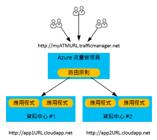
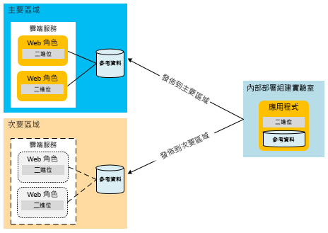
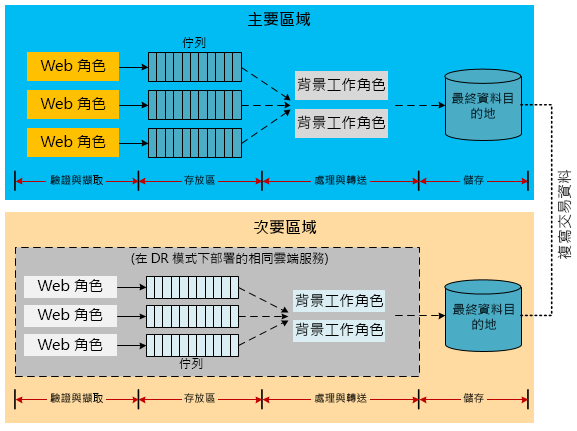
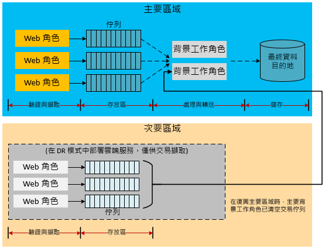
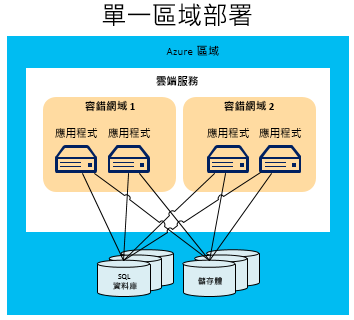
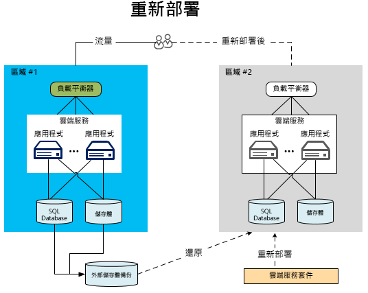
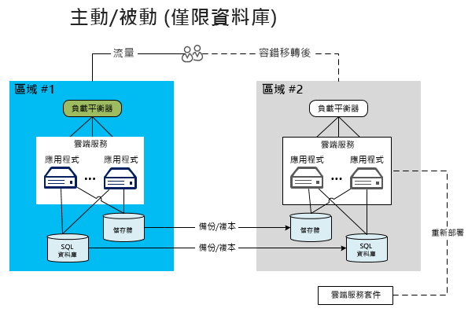
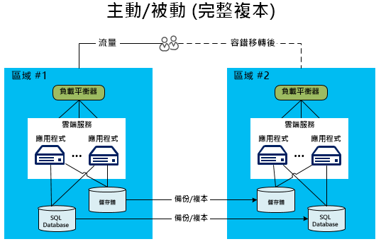
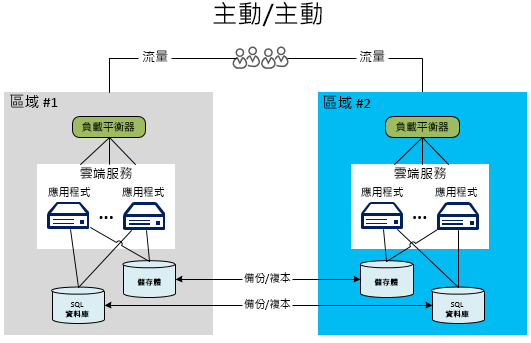

# Azure 應用程式的災害復原

災害復原 (DR) 著重在從應用程式功能的重大損失中復原。 例如，如果裝載您應用程式的 Azure 區域變得無法使用，您必須有在其他區域執行應用程式或存取資料的計劃。

企業和技術擁有者必須決定災害發生期間需要多少功能。 此功能等級可能有一些形式：完全無法使用、部分可用 (透過降級的功能或延遲處理)，或完全可用。

復原功能和高可用性策略的目的是要處理暫時性的失敗狀況。  執行此計劃會涉及人員、程序，以及可讓系統繼續運作的支援應用程式。 您的計劃應該包括演練失敗和測試資料庫的復原，以確保計劃可靠無虞。

## Azure 災害復原功能

和可用性考量一樣，Azure 提供了[復原功能技術指引](./index.md)，以便支援災害復原。 Azure 可用性功能與災害復原之間也有關聯性。 例如，各容錯網域的角色管理會增加應用程式的可用性。 如果沒有該管理功能，未經處理的硬體故障就會變成「災害」案例。 利用這些可用性功能和策略是防範您的應用程式發生災害的重要部分。 不過，本文不僅討論一般可用性問題，還會討論更嚴重 (和更罕見) 的災害事件。

## 多個資料中心區域

Azure 會維護世界各地許多區域的資料中心。 此基礎結構可支援數個災害復原案例，例如系統提供的 Azure 儲存體異地複寫到次要地區。 您也可以輕鬆且低廉地將雲端服務部署到全世界的多個位置。 將在多個區域中建置和維護自有資料中心的成本與困難度與此做比較。 將資料和服務部署至多個區域，有助於防止您的應用程式在單一區域中面臨嚴重中斷。 在設計災害復原計劃時，請務必了解配對區域的概念。 如需詳細資訊，請參閱[商務持續性和災害復原 (BCDR)：Azure 配對的區域](/azure/best-practices-availability-paired-regions)。

## Azure Site Recovery

[Azure Site Recovery](/azure/site-recovery/) 提供在區域之間複寫 Azure VM 的簡易方式。 其管理負擔最小，因為您不需要在次要地區中佈建任何其他資源。 當您啟用複寫時，Site Recovery 會根據來源 VM 設定，在目標區域中自動建立所需的資源。 並提供自動化連續複寫，讓您只要按一下即可執行應用程式容錯移轉。 您也可藉由測試容錯移轉來執行災害復原演練，完全不影響生產工作負載或進行中的複寫。

## Azure 流量管理員

發生特定區域的失敗時，您必須將流量重新導向至其他區域中的服務或部署。 透過 Azure 流量管理員等服務來處理是最有效的方式，如果主要區域失敗，其可自動將使用者的流量容錯移轉至另一個區域。 在設計有效的 DR 策略時，請務必了解流量管理員的基本概念。

流量管理員會使用網域名稱系統 (DNS)，根據流量路由方法和端點的健康情況，將用戶端要求導向到最適當的端點。 在下圖中，使用者連線至流量管理員 URL (`http://myATMURL.trafficmanager.net`)，而此 URL 擷取了實際的網站 URL (`http://app1URL.cloudapp.net` 和 `http://app2URL.cloudapp.net`)。 根據您設定的[流量管理員路由方法](/azure/traffic-manager/traffic-manager-routing-methods)，使用者要求會路由至適當的基礎 URL。 基於本文的目的，我們只會關心容錯移轉選項。

在設定流量管理員時，您會提供新的流量管理員 DNS 首碼，以供使用者用來存取您的服務。 流量管理員現在會將負載平衡提取到比區域層級高一個層級。 流量管理員 DNS 會對應至其管理的所有部署的 CNAME。

在流量管理員內，您可以指定已排列優先順序的部署清單，以在發生失敗時作為使用者的路由目的地。 流量管理員會監視部署端點。 如果主要部署變得無法使用，流量管理員會將使用者路由至優先順序清單上的下一個部署。

雖然流量管理員會決定容錯移轉期間要前往何處，但您可以決定當您不是處於容錯移轉模式時，容錯移轉網域是要休眠還是處於作用中狀態 (與流量管理員無關)。 不論該網站目前是否正在服務使用者，流量管理員都會偵測主要網站中的失敗，並變換到容錯移轉網站。

如需 Azure 流量管理員如何運作的詳細資訊，請參考：

- [流量管理員概觀](/azure/traffic-manager/traffic-manager-overview/)
- [流量管理員路由方法](/azure/traffic-manager/traffic-manager-routing-methods)
- [設定容錯移轉路由方法](/azure/traffic-manager/traffic-manager-configure-failover-routing-method/)

## Azure 災害案例

下列各節涵蓋數個不同類型的災害案例。 全區域服務中斷不是全應用程式失敗的唯一原因。 設計不良和管理錯誤也可能導致中斷。 請務必在復原計劃的設計和測試階段，考慮可能的失敗原因。 完善的計畫會充分利用 Azure 功能，並透過應用程式特有策略來增強功能。 選擇的回應取決於應用程式的重要性、復原點目標 (RPO) 和復原時間目標 (RTO)。

### 應用程式失敗

Azure 流量管理員會自動處理主機虛擬機器中基礎硬體或作業系統軟體所造成的失敗。 Azure 會建立新的角色執行個體，並將它新增至可用集區。 如果有多個已執行的角色執行個體，Azure 會在取代失敗的節點時，將處理移到其他執行中的角色執行個體。

即使硬體或作業系統沒有任何基礎性失敗，也可能會發生嚴重的應用程式錯誤。 應用程式可能會因為邏輯錯誤或資料完整性問題所造成的嚴重例外狀況而失敗。 您必須將足夠的遙測資料納入應用程式程式碼，以便監視系統偵測失敗狀況，並通知應用程式管理員。 完全了解災害復原程序的系統管理員可以決定是否要在解決重大錯誤時，觸發容錯移轉程序或接受可用性中斷情形。

### 資料損毀

Azure 會在相同區域的不同容錯網域中，自動重複儲存 Azure SQL Database 和 Azure 儲存體資料三次。 如果您使用異地複寫，資料會在不同的區域中額外儲存三次。 不過，如果您的使用者或應用程式損毀主要複本中的該資料，該資料會很快地複製到其他複本。 不幸的是，這會導致多份資料損毀。

若要管理您的資料的潛在損毀，您有兩個選項。 首先，您可以管理自訂備份策略。 視您的商務需求或控管規定而定，您可以將備份儲存在 Azure 或內部部署。 另一個選項是使用還原時間點選項來復原 SQL Database。 如需詳細資訊，請參閱下面的[災害復原的資料策略](#data-strategies-for-disaster-recovery)一節。

### 網路中斷

無法存取 Azure 網路的組件時，您可能無法存取您的應用程式或資料。 如果一或多個角色執行個體因為網路問題而無法使用，Azure 會使用您的應用程式的其餘可用執行個體。 如果您的應用程式因為 Azure 網路中斷而無法存取其資料，您可以使用快取的資料，以降低的應用程式功能在本機執行。 您必須設計災害復原策略，才能在應用程式中以降低的功能來執行。 對於某些應用程式，這可能不太實際。

另一個選項是將資料儲存在替代位置，直到恢復連線為止。 如果降低功能不可行，則剩餘的選項為應用程式停機或容錯移轉至替代區域。 以降低功能執行之應用程式的設計既是業務決策，也是技術決策。 這在[降低的應用程式功能](#reduced-application-functionality)一節中有進一步的討論。

### 相依服務失敗

Azure 提供許多可能經歷定期中斷的服務。 例如，[Azure Redis 快取](https://azure.microsoft.com/services/cache/)是一種多租用戶服務，可為您的應用程式提供快取功能。 如果相依服務無法使用，請務必考慮應用程式發生什麼事。 在許多方面，此案例很類似網路中斷案例。 不過，獨立考量每個服務可能會改善您的整體計畫。

Azure Redis 快取從可提供災害復原優點的雲端服務部署，提供快取功能給您的應用程式。 首先，此服務現在是在您的部署的本機角色上執行。 因此，您可以在雲端服務的整體管理程序中充分監視和管理快取的狀態。 這種類型的快取也會公開新功能 (例如已快取之資料的高可用性)，藉由在其他節點上保有重複的複本，以在單一節點失敗時保留快取的資料。

請注意，高可用性會減少輸送量並增加延遲，因為寫入作業也必須更新所有次要複本。 為了儲存快取的資料所需的記憶體數量會實際加倍，在規劃容量時必須將這一點列入考量。  此範例示範每個相依服務可能有改善整體可用性和抵抗重大失敗的功能。

就每個相依服務，您應該了解服務中斷的影響。 在快取範例中，有可能直接從資料庫存取資料，直到您還原您的快取為止。 這會導致在提供完整的應用程式資料存取時，效能會降低。

### 全區域服務中斷

上述失敗主要是可在相同的 Azure 區域內管理的失敗。 不過，您還必須對整個區域發生服務中斷的可能性有所準備。 如果發生全區域服務中斷，則無法使用您的資料的本機備援複本。 如已啟用異地複寫，則您的 Blob 和資料表在不同的區域中有額外三份複本。 如果 Microsoft 宣告此區域遺失，Azure 會將所有的 DNS 項目重新對應至異地複寫的區域。

> [!NOTE]
> 請注意，您完全無法控制這個程序，而且它只有在全區域服務中斷時才會發生。 請考慮使用 [Azure Site Recovery](/azure/site-recovery/) 來達成更好的 RPO 和 RTO。 Site Recovery 可讓應用程式決定可接受的中斷狀況為何，以及何時要容錯移轉至複寫的 VM。

### 全 Azure 服務中斷

在災害規劃中，您必須考量各種可能的災害。 其中一種最嚴重的服務中斷可能會同時涉及所有的 Azure 區域。 如同其他服務中斷，您可以決定在該事件中接受暫時停機的風險。 相較於涉及相依服務或單一區域的獨立服務中斷，跨區域的大規模服務中斷極為罕見。

不過，您可以決定某些關鍵任務應用程式需要有備份計劃，以防多個區域的服務皆中斷。 此計劃可能包括容錯移轉到[替代雲端](#alternative-cloud)或[混合式內部部署與雲端解決方案](#hybrid-on-premises-and-cloud-solution)中的服務。

### 降低的應用程式功能

設計良好的應用程式通常會透過實作鬆散結合的資訊交換模式，來使用可相互通訊的服務。 容易進行災害復原的應用程式需要在服務層級區隔責任。 這可防止相依服務的中斷導致關閉整個應用程式。 例如，假設 Y 公司有一個 Web 商務應用程式。此應用程式可能由下列模組構成︰

- **產品型錄** 可讓使用者瀏覽產品。
- **購物車** 可讓使用者加入/移除購物車中的產品。
- **訂單狀態** 可顯示使用者訂單的運送狀態。
- **訂單提交** 可提交訂單並且付款，以完成購物工作階段。
- **訂單處理** 可驗證訂單的資料完整性並執行可用數量檢查。

當此應用程式中的服務相依性無法使用時，服務在相依性復原之前如何運作？ 完備的系統會透過設計階段和執行階段的責任區隔來實作隔離界限。 您可以將每個失敗歸類為可復原和不可復原。 不可復原的錯誤會讓服務停止運作，但您可以透過替代項目緩和可復原的錯誤。 透過自動處理錯誤及採取替代動作而解決的某些問題，使用者並不會察覺到。 在更嚴重的服務中斷期間，應用程式可能完全無法使用。 第三個選項是繼續以降低的功能處理使用者要求。

比方說，如果裝載訂單的資料庫無法運作，「訂單處理」服務就會喪失其處理銷售交易的能力。 視架構而定，它可能難以或無法繼續執行應用程式的「提交訂單」和「訂單處理」服務。 如果應用程式並非設計用來處理此案例，則整個應用程式可能會離線。 不過，如果產品資料儲存在不同的位置，則產品型錄模組仍可用來檢視產品。 但是，應用程式的其他組件則無法使用，例如訂購或庫存查詢。

決定要提供哪些降低的應用程式功能，既是業務決策也是技術決策。 您也必須決定應用程式要如何向使用者通知臨時性問題。 在上述範例中，應用程式可能會允許檢視產品，並將產品加入購物車。 不過，當使用者嘗試進行購買，應用程式會通知使用者，訂購功能暫時無法使用。 對客戶而言，雖不理想，但的確能防止全應用程式的服務中斷。

## 災害復原的資料策略

在災害復原計劃中，如何適當處理資料是其中一項麻煩。 在復原過程中，通常會花最多時間在還原資料。 不同的降低功能選擇會導致面臨從失敗中復原資料和失敗後一致性的困難挑戰。

其中一項考量是需要還原或維護應用程式的資料複本。 您會將此資料用於次要網站上的參考和交易目的。 內部部署需要經過所費不貲且冗長的規劃程序，才能實作多區域的災害復原策略。 為了方便起見，包括 Azure 在內的大部分雲端提供者欣然允許將應用程式部署至多個區域。 這些區域會分布於各地，這麼一來，多重區域的服務中斷應該極少出現。 用於處理跨越區資料的策略是促使任何災害復原計畫成功的因素之一。

下列各節討論與資料備份、參考資料和交易資料相關的災害復原技術。

### 備份與還原

應用程式資料的定期備份可支援一些災害復原案例。 不同的儲存體資源需要不同的技術。

#### SQL Database

在基本、標準和進階 SQL Database 層中，您可以利用時間點還原來復原資料庫。 如需詳細資訊，請參閱[概觀：雲端商務持續性和 SQL Database 的資料庫災害復原](/azure/sql-database/sql-database-business-continuity/)。 另一個選項是使用「SQL Database 的主動式異地複寫」。 這會自動將資料庫變更複寫到相同 Azure 區域或甚至不同 Azure 區域中的次要資料庫。 這可對本文中所呈現的一些較為手動的資料同步處理技術提供可能的替代方式。 如需詳細資訊，請參閱[概觀：SQL Database 作用中異地複寫](/azure/sql-database/sql-database-geo-replication-overview/)。

您也可以使用較為手動的方式進行備份和還原。 使用 DATABASE COPY 命令建立具有交易一致性的資料庫備份複本。 您也可以使用 Azure SQL Database 的匯入/匯出服務，其支援將資料庫匯出到 BACPAC 檔案 (此為包含資料庫結構描述和相關聯資料的壓縮檔案)，並儲存在 Azure Blob 儲存體中。

Azure 儲存體的內建備援功能會在相同區域中建立兩個備份檔案複本。 不過，執行備份程序的頻率可決定您的 RPO，而 RPO 就是您在災害案例中可能會遺失的資料量。 例如，假設您在每個整點執行備份，而災害發生在整點前的兩分鐘。 您會遺失上次執行備份後所記錄的 58 分鐘資料。 此外，若要防止全區域的服務中斷，您應該將 BACPAC 檔案複製到替代區域。 然後，您可選擇在替代區域中還原這些備份。 如需詳細資訊，請參閱[概觀：雲端商務持續性和 SQL Database 的資料庫災害復原](/azure/sql-database/sql-database-business-continuity/)。

#### SQL 資料倉儲

對於 SQL 資料倉儲，請使用[異地備份](/azure/sql-data-warehouse/backup-and-restore#geo-backups)還原至配對區域以進行災害復原。 這些備份作業每隔 24 小時進行一次，且可於 20 分鐘內在配對區域內還原。 依預設，所有 SQL 資料倉儲都會啟用這項功能。 如需有關如何還原資料倉儲的詳細資訊，請參閱[使用 PowerShell 從 Azure 地理區域還原](/azure/sql-data-warehouse/sql-data-warehouse-restore#restore-from-an-azure-geographical-region-using-powershell)。

#### Azure 儲存體

對於 Azure 儲存體，您可以開發自訂備份程序，或使用某個協力廠商備份工具。 請注意，在儲存體資源會相互參考的大多數應用程式設計中，有額外的複雜性。 比方說，假設 SQL Database 中有一個資料行連結至 Azure 儲存體中的 Blob。 如果備份未同時進行，則資料庫可能有失敗前未備份 Blob 的指標。 應用程式或災害復原計畫必須實作相關程序來處理復原後的此種不一致情況。

#### 其他資料平台

其他基礎結構即服務 (IaaS) 所裝載的資料平台 (例如 Elasticsearch 或 MongoDB)，各自都有自己的功能以及在建立整合式備份和還原程序時的考量。 對於這些資料平台，我們一般會建議使用任何原生或可用的整合式複寫或快照功能。 如果這些功能不存在或不適合，再考慮使用 Azure 備份服務或受控/非受控磁碟快照集，以建立應用程式資料的時間點複本。 在所有情況下，皆請務必判斷如何達到一致的備份，尤其是當應用程式資料橫跨多個檔案系統，或是當您使用磁碟區管理員或軟體型 RAID 將多個磁碟機組合成單一檔案系統時。

### 災害復原的參考資料模式

參考資料是可支援應用程式功能的唯讀資料。 它通常不會頻繁變更。 雖然備份和還原是一種用來處理全區域服務中斷的方法，但 RTO 相對較長。 當您將應用程式部署到次要地區時，有些策略可改善參考資料的 RTO。

因為參考的資料變更很少，可以改善 RTO，藉由維護永久複本的次要地區中的參考資料。 這可排除在災害事件中還原備份所需的時間。 為了符合多重區域的災害復原需求，您必須在多個區域上一起部署應用程式和參考資料。 您也可以將參考資料部署到角色本身、外部儲存體或兩者的組合。

計算節點內的參考資料部署模型暗中符合災害復原需求。 您必須將參考資料的複本部署到每個區域，才可將參考資料部署至 SQL Database。 Azure 儲存體適用相同的策略。 您必須將 Azure 儲存體上儲存的任何參考資料複本部署到主要和次要地區。

您必須對所有資料 (包括參考資料) 實作自己的應用程式特定備份常式。 跨區域的異地複寫複本只用於全區域的服務中斷。 若要避免延長停機時間，請將應用程式資料的關鍵性部分部署到次要地區。 如需這種拓撲的範例，請參閱 [主動-被動模型](#active-passive)。

### 災害復原的交易資料模式

實作完整功能的災害模式策略時，必須將交易資料非同步複寫到次要地區。 可進行複寫的實際時間範圍將會決定應用程式的 RPO 特性。 在複寫時間範圍內，您仍可復原從主要區域遺失的資料。 您也可以稍後合併次要地區。

下列架構範例對於在容錯移轉案例中以不同方式處理交易資料，提供了一些構想。 請務必注意，這些範例並不詳盡。 例如，Azure SQL Database 可以取代佇列等中繼儲存位置。 佇列本身可能是 Azure 儲存體或服務匯流排佇列 (請參閱 [Azure 佇列和服務匯流排佇列 - 比較和對比](/azure/service-bus-messaging/service-bus-azure-and-service-bus-queues-compared-contrasted/))。 伺服器存放裝置目的地也可能有所改變，例如 Azure 資料表，而不是 SQL Database。 此外，也可能會插入背景工作角色做為各種步驟中的媒介。 目的不是要完全模擬這些架構，而是要考量復原交易資料和相關模組中的各種替代方案。

#### 複寫交易資料以準備進行災害復原

請考慮使用 Azure 儲存體佇列來保存交易資料的應用程式。 這可讓背景工作角色將交易資料處理至分離架構中的伺服器資料庫。 如果前端角色必須立即查詢該資料，則交易需要使用某種形式的暫存快取。 視資料遺失容錯層級而定，您可以選擇複寫佇列、資料庫或所有的儲存體資源。 只利用資料庫複寫，如果主要區域故障，您仍可在主要區域恢復時復原佇列中的資料。

下圖顯示伺服器資料庫跨區域同步處理的架構。

實作此架構的最大挑戰是區域之間的複寫策略。 [Azure SQL 資料同步](/azure/sql-database/sql-database-get-started-sql-data-sync/)服務會啟用這種類型的複寫。 截至本文撰寫時，此服務還是預覽狀態，尚未建議用於生產環境。 如需詳細資訊，請參閱[概觀：雲端商務持續性和 SQL Database 的資料庫災害復原](/azure/sql-database/sql-database-business-continuity/)。 對於生產應用程式，您必須投資協力廠商解決方案或在程式碼中建立自己的複寫邏輯。 視架構而定，複寫可能是雙向的，而且更加複雜。

有一個可能的實作會使用前一個範例中的中繼佇列。 將資料處理至最終儲存目的地的背景工作角色，可以在主要和次要地區中進行變更。 這些不是一般工作，而複寫程式碼的完整指引已超出本文的範圍。 請對將資料複寫到次要區域的方法投入大量時間和測試。 額外處理和測試有助於確保容錯移轉和復原程序會正確地處理任何可能的資料不一致或重複的交易。

> [!NOTE]
> 本文件大部分著重於平台即服務 (PaaS)。 不過，有其他複寫和可用性選項可供使用 Azure 虛擬機器的混合式應用程式使用。 這些混合式應用程式會使用基礎結構即服務 (IaaS) 在 Azure 中的虛擬機器上裝載 SQL Server。 這允許 SQL Server 中的傳統可用性方法，例如 AlwaysOn 可用性群組或記錄傳送。 有些技術 (例如 AlwaysOn) 僅適用於內部部署 SQL Server 執行個體與 Azure 虛擬機器之間。 如需詳細資訊，請參閱 [Azure 虛擬機器中的 SQL Server 高可用性和災害復原](/azure/virtual-machines/windows/sql/virtual-machines-windows-sql-high-availability-dr/)。

#### 降低應用程式功能以擷取交易

請考慮建立以降低的功能運作的第二架構。 次要區域中的應用程式會停用所有功能，例如報告、商業智慧 (BI) 或清空佇列。 它只接受如商務需求所定義的最重要交易工作流程類型。 系統會擷取交易並將它們寫入佇列。 系統可能會在服務中斷的初期階段延後處理資料。 如果主要區域的系統在預期的時間範圍內重新啟動，則主要區域中的背景工作角色可以清空佇列。 此程序可免除資料庫合併的需求。 如果主要區域服務中斷超出可容忍的範圍，應用程式即可開始處理佇列。

在此案例中，次要區域中的資料庫包含必須在主要資料庫重新啟動後合併的遞增交易資料。 下圖顯示此策略來暫時儲存交易資料，直到還原主要區域為止。

如需復原 Azure 應用程式的資料管理技術的詳細討論，請參閱 [Failsafe︰恢復雲端架構指引](https://channel9.msdn.com/Series/FailSafe)。

## 災害復原的部署拓撲

您必須準備關鍵性應用程式，以便處理全區域的服務中斷。 將多重區域部署策略納入作業規劃中。

多重區域部署可能涉及 IT 處理程序，以在災害後將應用程式和參考資料發佈到次要地區。 如果應用程式需要立即容錯移轉，則部署程序可能涉及主動/被動設定或主動/主動設定。 這種部署類型會有在替代區域中執行的現有應用程式執行個體。 Azure 流量管理員等路由服務可提供 DNS 層級的負載平衡服務。 它可以偵測服務中斷，而必要時會將使用者路由到不同的區域。

成功的 Azure 災害復原包括從一開始就將該復原功能建置到解決方案中。 雲端可提供其他在災害期間從失敗復原的選項，而這些是傳統主機服務提供者所沒有的選項。 具體來說，您可以在不同區域中以動態方式快速地配置資源，避免閒置資源在失敗發生前產生成本。

下列各節涵蓋災害復原的各種部署拓撲。 一般而言，增加成本或複雜性與取得額外可用性會有所折衷。

### 單一區域部署

單一區域部署並不是災害復原拓撲，而是為了與其他架構對比。 Azure 中的應用程式通常會使用單一區域部署，但這種方式並不符合災害復原拓撲的需求。

下圖說明在單一 Azure 區域中執行的應用程式。 Azure 流量管理員以及使用容錯和升級網域會增加區域內的應用程式可用性。

在此案例中，資料庫是單一失敗點。 雖然 Azure 會將不同容錯網域的資料複寫到內部複本，但這樣的複製只會在相同的區域內發生。 應用程式經不起嚴重失敗。 如果該區域停止運作，則容錯網域也會停止運作，包括其中的所有服務執行個體和儲存體資源。

對於所有應用程式 (最不重要的應用程式除外)，您必須設計一個計畫來將您的應用程式部署於多個區域。 在考慮要使用哪一個部署拓撲時，您也應該考慮 RTO 和成本限制。

我們現在來看看可支援跨不同區域容錯移轉的特定方法。 這些範例全都使用兩個區域來描述此程序。

### 使用 Azure Site Recovery 進行容錯移轉

當您使用 Azure Site Recovery 啟用 Azure VM 複寫時，它會在次要地區中建立數個資源：

- 資源群組。
- 虛擬網路 (VNet)。
- 儲存體帳戶。
- 容錯移轉後要保存 VM 的可用性設定組。

主要區域中 VM 磁碟上的資料寫入會持續傳送到次要地區中的儲存體帳戶。 目標儲存體帳戶會每隔幾分鐘產生復原點。 當您起始容錯移轉時，系統會在目標資源群組、VNet 和可用性設定組中建立已復原的 VM。 在容錯移轉時，您可以選擇任何可用的復原點。

### 重新部署到次要 Azure 區域

對於重新部署到次要區域的方法，只有主要區域會有應用程式和資料庫在執行。 次要地區並未設定為自動容錯移轉。 因此當災害發生時，您必須在新的區域中加快服務的所有組件。 這包括將雲端服務上傳至 Azure、部署雲端服務、還原資料，以及變更 DNS 以重新路由傳送流量。

雖然這是最經濟實惠的多區域選項，但其 RTO 特性最差。 在此模型中，服務封裝和資料庫備份會儲存在內部部署或在次要地區的 Azure Blob 儲存體執行個體中。 不過，您必須先部署新的服務並還原資料，才能恢復正常作業。 即使系統會完全自動地從備份儲存體傳輸資料，但佈建新的資料庫環境仍會耗費大量時間。 將資料從備份磁碟儲存體移到次要地區上的空白資料庫，是還原過程中成本最高的部分。 不過，您必須這麼做才能使新資料庫進入運作狀態，因為它不會進行複寫。

最好的方法是將服務封裝存放在次要地區的 Blob 儲存體中。 如此一來，當您從內部部署開發電腦部署時，就不需要將封裝上傳至 Azure。 您可以使用 PowerShell 指令碼，將服務封裝從 Blob 儲存體快速地部署到新的雲端服務。

此選項只適合用於可容忍高 RTO 的非關鍵性應用程式。 比方說，這可能適用於可中斷幾小時，但必須在 24 小時內恢復運作的應用程式。

### 主動-被動

主動-被動拓撲是許多公司偏愛的選擇。 比起重新部署方法，此拓撲增加的成本相對較少，所以可改善 RTO。 在此案例中，也是有主要和次要 Azure 地區。 所有的流量會移至主要區域的作用中部署。 因為資料庫同時在這兩個區域上，所以次要地區的災害復原準備更加完善。 此外，兩者之間已備妥同步處理機制。 這種待命方法可以有兩種變化︰僅限資料庫的方法或次要地區中的完整部署。

#### 僅限資料庫

在主動-被動拓撲的第一種變化中，只有主要區域已部署雲端服務應用程式。 不過，有別於重新部署方法，這兩個區域會同步處理資料庫的內容。 (如需詳細資訊，請參閱[災害復原的交易資料模式](#transactional-data-pattern-for-disaster-recovery)一節)。發生災害時，啟用需求比較少。 您會在次要地區中啟動應用程式、變更新資料庫的連接字串，並變更 DNS 項目，以重新路由傳送流量。

如同重新部署方法，您應該已在次要地區的 Azure Blob 儲存體中儲存服務封裝，以便加快部署速度。 不過，您不必承受資料庫還原作業所需的大部分額外負擔，因為資料庫已就緒且正在執行。 這可節省大量的時間，讓此模式成為經濟實惠的 DR 模式 (也是最常使用的模式)。

#### 完整複本

在主動-被動拓撲的第二種變化中，主要區域和次要地區都有完整的部署。 此部署包括雲端服務和已同步處理的資料庫。 不過，只有主要區域會主動處理來自使用者的網路要求。 只有當主要區域發生服務中斷時，次要地區才會變成主動。 在此情況下，所有新的網路要求會路由傳送到次要地區。 Azure 流量管理員可以自動管理此容錯移轉。

因為已經部署服務，所以容錯移轉發生的速度比僅限資料庫變化快。 此拓撲提供了非常低的 RTO。 次要的容錯移轉區域必須準備好在主要區域失敗後立即開始。

伴隨著更快的回應時間，此拓撲會預先配置和部署備份服務，讓您不會在災害期間要配置新執行個體時卻沒有空間。 如果您的次要 Azure 區域逼近容量上限，這點很重要。 沒有任何服務等級協定 (SLA) 可保證您能夠立即在任何區域部署一或多個新的雲端服務。

若要以此模型達到最快的回應時間，您在主要和次要地區中必須具有類似的規模 (角色執行個體數目)。 儘管有些優點，但支付未使用計算執行個體的代價很高，而這可能不是最審慎的財務選擇。 基於這點，所以在次要地區上較常使用稍微相應縮減的雲端服務版本。 然後您即可視需要，快速地容錯移轉和相應擴大次要部署。 您應讓容錯移轉程序自動化，以便在無法存取主要區域後，根據負載啟動其他執行個體。 這可能會牽涉到使用自動調整機制，如 [虛擬機器擴展集](/azure/virtual-machine-scale-sets/virtual-machine-scale-sets-overview/)。

在下圖顯示的模型中，主要和次要地區均包含主動-被動拓撲中完整部署的雲端服務。

### 主動-主動

在主動-主動拓撲中，雲端服務和資料庫已完整部署於這兩個區域中。 不同於主動-被動模式，這兩個區域都會接收使用者流量。 此選項會產生最快的復原時間。 服務已經調整成能夠處理每個區域的部分負載。 已啟用 DNS 來使用次要地區。 在決定如何將使用者路由到適當區域時，有額外的複雜性。 循環配置資源排程或許可行。 使用者比較可能使用其資料的主要複本所在的特定區域。

在容錯移轉的情況下，只需停用主要區域的 DNS。 這會將所有流量都路由傳送到次要地區。

即使在此模型中，仍有一些變化。 例如，下圖顯示的主要區域擁有資料庫的主要複本。 兩個區域中的雲端服務會寫入至該主要資料庫。 次要部署可以主要或複寫的資料庫讀取資料。 此範例中的複寫是單向的。

上圖中的主動-主動架構有一個缺點。 第二個區域必須存取第一個區域中的資料庫，這是因為主要複本位於那裡。 當您存取區域外部的資料時，效能會明顯降低 在跨區域的資料庫呼叫中，您應該考慮某種類型的批次策略，以改善這些呼叫的效能。 如需詳細資訊，請參閱[如何使用批次處理來改善 SQL Database 應用程式效能](/azure/sql-database/sql-database-use-batching-to-improve-performance/)。

替代架構可能會牽涉到每個區域直接存取其本身的資料庫。 在該模型中，需要某種類型的雙向複寫，才能同步處理每個區域中的資料庫。

在先前的拓撲中，降低 RTO 一般會增加成本和複雜度。 主動-主動拓撲則與此成本模式背離。 在主動-主動拓撲中，主要區域上的執行個體可能不需要像主動-被動拓撲中這麼多。 如果主動-被動架構中的主要區域上有 10 個執行個體，則主動-主動架構中的每個區域可能只需要 5 個執行個體。 兩個區域現在會分擔負載。 如果您在有 10 個執行個體等待容錯移轉的被動區域上保持暖待命狀態，這可能比主動-被動拓撲更節省成本。

請注意在您還原主要區域前，次要地區可能會收到突然湧入的新使用者。 如果當主要區域遭遇服務中斷時，每部伺服器上有 10000 名使用者，則次要地區會突然必須處理 20000 名使用者。 監視次要地區的規則時，必須偵測這種增加量並且讓次要地區中的執行個體加倍。 如需詳細資訊，請參閱 [失敗偵測](#failure-detection)一節。

## 混合式內部部署與雲端解決方案

災害復原的其他策略之一是設計一個可在內部部署和雲端執行的混合式應用程式。 視應用程式而定，主要區域可能位於任一個位置。 請考量先前的架構，再想像以主要或次要地區做為內部部署位置。

這些混合式架構中有一些挑戰。 首先，本文大致已處理 PaaS 架構模式。 Azure 中的 PaaS 應用程式通常仰賴 Azure 特有的概念，例如角色、雲端服務和流量管理員。 建立這類型 PaaS 應用程式的內部部署解決方案，會需要截然不同的架構。 從管理或成本的觀點來看，這可能不可行。

不過，對於已移轉至雲端的傳統架構 (例如 IaaS 型架構)，混合式的災害復原解決方案的挑戰比較小。 IaaS 應用程式會使用雲端中可有直接內部部署對等項目的虛擬機器。 您也可以使用虛擬網路來連接雲端的機器與內部部署網路資源。 這可為僅限的 PaaS 應用程式帶來多種可能性。 例如，SQL Server 可以利用災害復原解決方案，例如 AlwaysOn 可用性群組和資料庫鏡像。 如需詳細資訊，請參閱 [Azure 虛擬機器中的 SQL Server 高可用性和災害復原](/azure/virtual-machines/windows/sql/virtual-machines-windows-sql-high-availability-dr/)。

IaaS 解決方案也為內部部署應用程式提供比較簡單的路徑，以便使用 Azure 做為容錯移轉選項。 您在現有的內部部署區域中可能有功能完整的應用程式。 不過，如果您沒有足夠的資源可維護不同位置的區域以供容錯移轉，該怎麼辦？ 您可決定使用虛擬機器和虛擬網路來取得在 Azure 中執行的應用程式。 在該情況下，定義可將資料同步處理到雲端的程序。 然後 Azure 部署會變成要用於容錯移轉的次要地區。 主要區域會保留內部部署應用程式。 如需 IaaS 架構和功能的詳細資訊，請參閱 [虛擬機器文件](/azure/virtual-machines/)。

## 替代雲端

有時候，廣泛的 Microsoft Azure 功能可能仍無法滿足貴組織所需的內部合規性規則或原則。 甚至準備萬全且專為在災害期間實作備份系統所設計，在雲端服務提供者全面中斷服務的情況下，仍有所不足。

您應該比較可用性需求與提高可用性的成本和複雜度。 請執行風險分析，並定義您的解決方案的 RTO 和 RPO。 如果您的應用程式無法容忍任何停機時間，您可能要考慮使用其他雲端解決方案。 除非整個網際網路中斷，否則 Azure 全面無法存取時仍可使用另一個雲端解決方案。

如同混合式案例一樣，先前災害復原架構中的容錯移轉部署也可以存在於另一個雲端解決方案中。 替代雲端 DR 網站只能用於 RTO 允許極短停機時間的解決方案。 請注意，使用 Azure 外部 DR 網站的解決方案需要執行更多工作才能設定、開發、部署和維護。 此外，經過實證的做法也比較難以在跨雲端的架構中實作。 雖然雲端平台有類似的高階概念，但 API 和架構不同。

如果您的 DR 策略依賴多個雲端平台，則將抽象層納入解決方案的設計中便很重要。 這可讓您不需要在發生災害時針對不同的雲端平台，開發及維護兩個不同版本的相同應用程式。 如同混合式案例，在這些情況下，使用 Azure 虛擬機器或 Azure 容器服務，可能會比使用雲端特有的 PaaS 設計簡單。

## 自動化

先前所討論的某些模式必須快速啟動離線部署，以及還原系統的特定部分。 自動化指令碼能夠啟動隨選資源及快速部署解決方案。 下面的 DR 相關自動化範例使用 [Azure PowerShell](https://msdn.microsoft.com/library/azure/jj156055.aspx)，但使用 [Azure CLI](https://docs.microsoft.com/cli/azure/get-started-with-azure-cli) 或[服務管理 REST API](https://msdn.microsoft.com/library/azure/ee460799.aspx) 也是很好的選項。

自動化指令碼可管理 Azure 未能透明處理的 DR 層面。 這種方式可產生一致且可重複的結果，進而減少人為錯誤。 預先定義的 DR 指令碼也可減少災害發生期間重建系統及其構成部分所需的時間。 當網站已關閉且每分鐘都在虧錢時，您不會想嘗試以手動方式指出如何還原網站。

從頭到尾重複地測試您的指令碼。 驗證其基本功能之後，請務必在[災害模擬](#disaster-simulation)中進行測試。 這有助於揭露指令碼或處理程序中的缺失。

自動化的最佳做法是建立 Azure 災害復原 PowerShell 指令碼或命令列介面 (CLI) 指令碼的儲存機制。 清楚標示並加以分類，以便快速存取。 指定主要人員來負責管理指令碼的存放庫和版本控制。 詳細記載這些指令碼，並提供參數說明和指令碼使用範例。 此外，請務必讓此文件與您的 Azure 部署保持同步。 這強調由主要人員負責存放庫所有組件的目的。

## 失敗偵測

若要正確處理可用性和災害復原的問題，您必須能夠偵測及診斷失敗。 執行進階的伺服器和部署監視，以在系統或其元件突然無法使用時快速注意到。 監視工具會評估雲端服務和其相依項目的整體健康狀態，所以可以執行部分的這項工作。 [System Center 2016](https://www.microsoft.com/cloud-platform/system-center) 是其中一項合適的 Microsoft 工具。 協力廠商工具也可以提供監視功能。 大部分監視解決方案會追蹤關鍵效能計數器和服務可用性。

雖然這些工具很重要，但您必須規劃雲端服務內的錯誤偵測和報告功能。 您也必須規劃適當使用 Azure 診斷。 自訂效能計數器或事件記錄檔項目也可以是整體策略的一部分。 這可在發生失敗時提供更多資料，以便快速診斷問題及恢復完整功能。 它也提供其他計量，以便監視工具用來判斷應用程式健康狀態。 如需詳細資訊，請參閱 [在 Azure 雲端服務中啟用 Azure 診斷](/azure/cloud-services/cloud-services-dotnet-diagnostics/)。 如需如何規劃整體「健康狀態模型」的討論，請參閱 [Failsafe︰恢復雲端架構指引](https://channel9.msdn.com/Series/FailSafe)。

## 災害模擬

模擬測試牽涉到在工作樓層建立小型的真實情況，以觀察團隊成員的反應。 模擬也會顯示解決方案在復原計畫中的有效性。 以建立的案例不干擾實際業務，但仍覺得像是「真實」情況的方式執行模擬。

請考慮在應用程式中設計某種「切換表單」，以手動模擬可用性問題。 例如，透過軟體交換技術，讓排序模組無法運作，以觸發資料庫存取例外狀況。 您可以對網路介面層級的其他模組，採取類似的輕量型方法。

模擬會反白顯示任何處理不當的問題。 模擬案例必須可完全控制。 這表示，即使復原計畫似乎失敗，您可以讓情況還原到正常狀態，而不會造成任何重大損害。 此外，您也一定要知會管理高層何時及如何執行模擬演習。 此計劃應詳述模擬期間受到影響的時間和資源。 也要定義測試災害復原計劃時的成功量值。

如果您使用 Azure Site Recovery，您可以執行移轉至 Azure 的測試容錯移轉，以驗證您的複寫策略，或在沒有資料遺失或停機的情況下執行災害復原演練。 測試容錯移轉不會影響正在進行的 VM 複寫或您的生產環境。

其他幾項技術可以測試災害復原計劃。 不過，其中大部分都只是這些基本技巧的變更版本。 這項側是的目的是要評估復原計劃的可行性。 災害復原測試著重於詳細資訊，以在基本復原計劃中找出漏洞。

## 服務特有的指引

下列主題會說明災害復原特有的 Azure 服務：

| 服務 | 話題 |
|---------|-------|
| 適用於 MySQL 的 Azure 資料庫 | [使用「適用於 MySQL 的 Azure 資料庫」的商務持續性概觀](/azure/mysql/concepts-business-continuity) |
| 適用於 PostgreSQL 的 Azure 資料庫 | [使用「適用於 PostgreSQL 的 Azure 資料庫」的商務持續性概觀](/azure/postgresql/concepts-business-continuity)
| 雲端服務 | [發生影響 Azure 雲端服務的 Azure 服務中斷事件時該怎麼辦](/azure/cloud-services/cloud-services-disaster-recovery-guidance) |
| Cosmos DB | [Azure Cosmos DB 中商務持續性的自動區域性容錯移轉](/azure/cosmos-db/regional-failover)
| Key Vault | [Azure Key Vault 的可用性與備援](/azure/key-vault/key-vault-disaster-recovery-guidance) |
|儲存體 | [如果 Azure 儲存體發生中斷怎麼辦](/azure/storage/storage-disaster-recovery-guidance) |
| SQL Database | [還原 Azure SQL Database 或容錯移轉到次要資料庫](/azure/sql-database/sql-database-disaster-recovery) |
| 虛擬機器 | [發生影響 Azure 虛擬機器的 Azure 服務中斷事件時該怎麼辦](/azure/virtual-machines/virtual-machines-disaster-recovery-guidance) |
| 虛擬網路 | [虛擬網路 – 商務持續性](/azure/virtual-network/virtual-network-disaster-recovery-guidance) |
