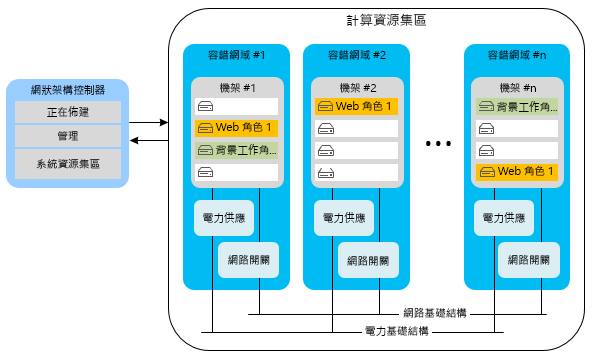
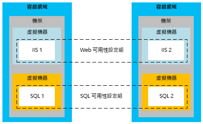
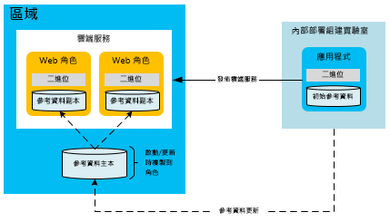
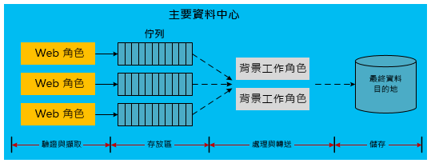

[!INCLUDE [header](../_includes/header.md)]
# 建置在 Microsoft Azure 上之應用程式的高可用性High availability for applications built on Microsoft Azure
具有高可用性的應用程式可以化解相依服務和硬體中，可用性、負載和暫時性失敗方面的變動。A highly available application absorbs fluctuations in availability, load, and temporary failures in dependent services and hardware. 應用程式會持續以可接受的方式來執行，如業務需求或應用程式服務等級協定 (SLA) 所定義。The application continues to perform acceptably, as defined by business requirements or application service-level agreements (SLAs).

## Azure 的高可用性功能Azure high-availability features
Azure 有許多支援高可用性應用程式的內建平台功能。Azure has many built-in platform features that support highly available applications. 本節說明其中的一些主要功能。This section describes some of those key features.

### 網狀架構控制器Fabric controller
Azure 網狀架構控制器會佈建和監視 Azure 計算執行個體的狀況。The Azure fabric controller provisions and monitors the condition of Azure compute instances. 網狀架構控制器會監視主機和來賓機器執行個體的硬體和軟體狀態。The fabric controller monitors the status of the hardware and software of the host and guest machine instances. 當它偵測到失敗時，就會自動重新放置 VM 執行個體來維持 SLA。When it detects a failure, it maintains SLAs by automatically relocating the VM instances. 容錯和升級網域的概念可進一步支援計算 SLA。The concept of fault and upgrade domains further supports the compute SLA.

在部署多個雲端服務角色執行個體時，Azure 會將這些執行個體部署到不同的容錯網域。When multiple Cloud Service role instances are deployed, Azure deploys these instances to different fault domains. 容錯網域界限基本上是相同區域中的不同硬體機架。A fault domain boundary is essentially a different hardware rack in the same region. 容錯網域會減少局部硬體故障中斷應用程式服務的機率。Fault domains reduce the probability that a localized hardware failure interrupts the service of an application. 您無法管理背景工作角色或 Web 角色的容錯網域數目。You cannot manage the number of fault domains of your worker roles or web roles. 網狀架構控制器會使用與 Azure 託管應用程式分開的專用資源。The fabric controller uses dedicated resources that are separate from Azure-hosted applications. 它需要 100% 的執行時間，因為它會作為 Azure 系統的核心。It requires 100 percent uptime because it serves as the nucleus of the Azure system. 它會跨容錯網域監視和管理角色執行個體。It monitors and manages role instances across fault domains.

下圖顯示網狀架構控制器跨不同容錯網域所部署和管理的 Azure 共用資源。The following diagram shows Azure shared resources that the fabric controller deploys and manages across different fault domains.

儘管容錯網域是用以減緩失敗的實際分隔，但升級網域是執行個體分隔的邏輯單元，可判斷將在特定時間升級服務的哪些執行個體。While fault domains are physical separations to mitigate failure, upgrade domains are logical units of instance separation that determine which instances of a service will be upgraded at a specific time. 根據預設，會針對您的託管服務部署定義五個升級網域。By default, five upgrade domains are defined for your hosted service deployment. 不過，您可以在服務定義檔中變更該值。However, you can change that value in the service definition file. 例如，如果您的 Web 角色有八個執行個體，三個升級網域中有兩個執行個體，而一個升級網域中有兩個執行個體。For example, if you have eight instances of your web role, there are two instances in three upgrade domains and two instances in one upgrade domain. Azure 會根據升級網域數目定義更新序列。Azure defines the update sequence based on the number of upgrade domains. 如需詳細資訊，請參閱[更新雲端服務](/azure/cloud-services/cloud-services-update-azure-service/)。For more information, see [Update a cloud service](/azure/cloud-services/cloud-services-update-azure-service/).

### 其他服務中的功能Features in other services
除了支援高可用性計算資源的平台功能，Azure 還會在它的其他服務中內嵌高可用性功能。In addition to the platform features that support high availability of compute resources, Azure embeds high-availability features in its other services. 例如，Azure 儲存體會在 Azure 儲存體帳戶中至少保留所有資料的三個複本。For example, Azure Storage maintains at least three replicas of all data in your Azure storage account. 它也可讓異地備援在次要區域中儲存資料複本。It also enables geo-replication to store copies of your data in a secondary region. Azure 內容傳遞網路可在全球快取 Blob，以獲得備援、延展性和低延遲。The Azure Content Delivery Network allows blobs to be cached around the world for redundancy, scalability, and lower latency. Azure SQL Database 也會維護多個複本。Azure SQL Database maintains multiple replicas as well.

如需 Azure 平台可用性功能的更深入討論，請參閱[復原技術指引](index.md)。For a deeper discussion of Azure platform availability features, see [Resiliency technical guidance](index.md). 另請參閱 [Windows Azure 上大規模服務設計的最佳作法](https://azure.microsoft.com/blog/best-practices-for-designing-large-scale-services-on-windows-azure/) \(英文\)。Also see [Best practices for designing large-scale services on Windows Azure](https://azure.microsoft.com/blog/best-practices-for-designing-large-scale-services-on-windows-azure/).

雖然 Azure 提供多個支援高可用性的功能，但請務必了解其限制：Although Azure provides multiple features that support high availability, it's important to understand their limitations:

* 針對計算，Azure 保證您的角色可供使用且執行中，但它無法偵測您的應用程式正在執行中還是已多載。For compute, Azure guarantees that your roles are available and running, but it cannot detect whether your application is running or overloaded.
* 針對 Azure SQL Database，資料會在區域內同步複寫。For Azure SQL Database, data is replicated synchronously within the region. 您可以選擇主動式異地複寫，其最多可在相同區域 (或不同區域) 中允許四個額外的資料庫複本。You can choose active geo-replication, which allows up to four additional database copies in the same region (or different regions). 雖然這些資料庫複本不是時間點備份，但 SQL Database 還是會提供時間點備份功能。While these database replicas are not point-in-time backups, SQL Database does provide point-in-time backup capabilities. 如需詳細資訊，請參閱[使用自動資料庫備份復原 Azure SQL Database：時間點還原](/azure/sql-database/sql-database-recovery-using-backups#point-in-time-restore)。For more information, see [Recover an Azure SQL Database using automated data backups: Point-in-time restore](/azure/sql-database/sql-database-recovery-using-backups#point-in-time-restore).
* 針對 Azure 儲存體，資料表資料和 Blob 資料預設均會複寫到替代區域。For Azure Storage, table data and blob data are replicated by default to an alternate region. 不過，在 Microsoft 選擇容錯移轉至替代網站之前，您無法存取這些複本。However, you cannot access the replicas until Microsoft chooses to fail over to the alternate site. 區域容錯移轉只會在遇到長時間的全區域服務中斷時發生，而且沒有適用於異地容錯移轉時間的 SLA。A region failover occurs only during a prolonged region-wide service disruption, and there is no SLA for geo-failover time. 也請務必注意，任何資料損毀都會快速擴散到複本。It's also important to note that any data corruption quickly spreads to the replicas. 基於這些理由，您必須搭配應用程式特有的可用性功能來補充平台可用性功能，包括 Blob 快照集功能，以建立 Blob 資料的時間點備份。For these reasons, you must supplement platform availability features with application-specific availability features, including the blob snapshot feature to create point-in-time backups of blob data.

### Azure 虛擬機器的可用性設定組Availability sets for Azure Virtual Machines
本文主要將重點放在使用平台即服務 (PaaS) 模型的雲端服務。This document primarily focuses on cloud services, which use a platform-as-a-service (PaaS) model. Azure 虛擬機器還具備特有的可用性功能，其使用基礎結構即服務 (IaaS) 模型。There are also specific availability features for Azure Virtual Machines, which use an infrastructure-as-a-service (IaaS) model. 若要利用虛擬機器來達到高可用性，您必須使用可用性設定組，為錯誤和升級網域提供類似功能。To achieve high availability with Virtual Machines, you must use availability sets, which serve a similar function to fault and upgrade domains. 在可用性設定組內，Azure 會以防止局部硬體故障和維護活動關閉該群組中所有電腦的方式，來放置虛擬機器。Within an availability set, Azure positions the virtual machines in a way that prevents localized hardware faults and maintenance activities from bringing down all the machines in that group. 必須有可用性設定組才能實現 Azure 的虛擬機器可用性 SLA。Availability sets are required to achieve the Azure SLA for the availability of Virtual Machines.

下圖呈現兩個分別適用於 Web 和 SQL Server 虛擬機器的可用性設定組。The following diagram shows two availability sets for web and SQL Server virtual machines, respectively.

> [!NOTE]
> 在上圖中，SQL Server 是在虛擬機器上安裝並執行。In the preceding diagram, SQL Server is installed and running on virtual machines. 這點不同於 Azure SQL Database，其會提供資料庫作為受管理的服務。This is different from Azure SQL Database, which provides a database as a managed service.
> 
> 

## 應用程式的高可用性策略Application strategies for high availability
大部分應用程式的高可用性策略包括備援或移除應用程式元件之間的硬式相依性。Most application strategies for high availability involve either redundancy or the removal of hard dependencies between application components. 應用程式的設計應該支援在 Azure 或協力廠商服務偶爾停機時執行容錯。Application design should support fault tolerance during sporadic downtime of Azure or third-party services. 下列各節將說明可改善雲端服務可用性的應用程式模式。The following sections describe application patterns for improving the availability of your cloud services.

### 非同步通訊和耐久性佇列Asynchronous communication and durable queues
若要提高 Azure 應用程式中的可用性，請考慮在鬆散結合的服務之間進行非同步通訊。To increase availability in Azure applications, consider asynchronous communication between loosely coupled services. 在此模式中，會將訊息寫入儲存體佇列或 Azure 服務匯流排佇列，以供稍後處理。In this pattern, messages are written to either storage queues or Azure Service Bus queues for later processing. 將訊息寫入佇列時，控制權就會立即回到傳送者。When a message is written to the queue, control immediately returns to the sender. 應用程式的另一個服務 (通常實作為背景工作角色) 會處理訊息。Another service of the application (typically implemented as a worker role) processes the message. 如果處理服務停止運作，訊息就會累積在佇列中，直到處理服務還原為止。If the processing service stops working, the messages accumulate in the queue until the processing service is restored. 前端傳送者與訊息處理器之間沒有直接相依性。There is no direct dependency between the front-end sender and the message processor. 這樣就不需要會在分散式應用程式中造成瓶頸的同步服務呼叫。This eliminates synchronous service calls that can cause bottlenecks in distributed applications.

此模式的變化會在 Azure 儲存體 (Blob、資料表、佇列) 或服務匯流排佇列中儲存關於失敗資料庫的資訊。A variation of this pattern stores information about failed database calls in Azure Storage (blobs, tables, or queues) or Service Bus queues. 例如，某個應用程式內對另一個服務 (例如 Azure SQL Database) 的同步呼叫會重複失敗。For example, a synchronous call within an application to another service (such as Azure SQL Database) fails repeatedly. 您或許可以將該要求序列化到耐久性儲存體。You might be able to serialize that request into durable storage. 稍後當服務或資料庫重新上線時，應用程式就可從儲存體重新提交要求。At some later point when the service or database is back online, the application can resubmit the request from storage. 此模型的差異在於，中繼位置只會在失敗時使用，不會作為應用程式工作流程的固定部分。The difference in this model is that the intermediate location is used only during failures, not as a regular part of the application workflow.

在這兩種案例中，非同步通訊和中繼儲存體可避免停機的後端服務關閉整個應用程式。In both scenarios, asynchronous communication and intermediate storage prevent a downed back-end service from bringing down the entire application. 佇列會做為邏輯媒介。Queues serve as a logical intermediary. 如需在佇列服務之間進行選擇的詳細資訊，請參閱 [Azure 佇列和 Azure 服務匯流排佇列 &mdash; 異同比較](/azure/service-bus-messaging/service-bus-azure-and-service-bus-queues-compared-contrasted/)。For more information on choosing between queuing services, see [Azure queues and Azure Service Bus queues &mdash; compared and contrasted](/azure/service-bus-messaging/service-bus-azure-and-service-bus-queues-compared-contrasted/).

### 錯誤偵測和重試邏輯Fault detection and retry logic
高可用性應用程式設計的一個關鍵點是，使用程式碼內的重試邏輯，適當地處理暫時無法使用的服務。A key aspect of the design of highly available applications is the use of retry logic within code to gracefully handle a service that is temporarily unavailable. 適用於 Azure 儲存體和 Azure 服務匯流排的新版 SDK 原本就支援重試。Recent versions of SDKs for both Azure Storage and Azure Service Bus natively support retries. 如需為應用程式提供自訂重試邏輯的詳細資訊，請參閱[重試邏輯](../patterns/retry.md)。For more information on providing custom retry logic for your application, see the [Retry pattern](../patterns/retry.md).

### 高可用性的參考資料模式Reference data pattern for high availability
參考資料是應用程式的唯讀資料。Reference data is the read-only data of an application. 此資料會提供商業內容，應用程式會在商務作業期間，於其中產生交易資料。This data provides the business context within which the application generates transactional data during a business operation. 交易資料的完整性取決於交易完成時間的參考資料快照集。The integrity of transactional data depends on a snapshot of the reference data at the time the transaction was completed.

您必須有參考資料，才能使應用程式正常運作。Reference data is necessary for the proper operation of the application. 各種應用程式都會建立和維護參考資料；主要資料管理 (MDM) 系統通常會執行此函式。Various applications create and maintain reference data; master data management (MDM) systems often perform this function. 這些系統會負責參考資料的生命週期。These systems are responsible for the life cycle of the reference data. 參考資料的範例包括產品目錄、員工主檔、組件主檔和設備主檔。Examples of reference data include product catalog, employee master, parts master, and equipment master. 參考資料也可以來自組織外部，例如郵遞區號或稅率。Reference data can also originate from outside the organization, for example, postal codes or tax rates. 用來增加參考資料可用性的策略，通常不會比交易資料的策略困難。Strategies for increasing the availability of reference data are typically less difficult than those for transactional data. 參考資料的優點在於它多半不可變。Reference data has the advantage of being mostly immutable.

透過與應用程式一起部署參考資料，取用參考資料的 Azure Web 角色和背景工作角色會在執行階段變成自發性。Azure web and worker roles that consume reference data can be made autonomous at runtime by deploying the reference data along with the application. 如果本機儲存體的大小允許這類部署，這會是個理想的方式。This approach is ideal if the size of the local storage allows such a deployment. 在本機部署的內嵌 SQL Database、NoSQL 資料庫或 XML 檔案，有助於 Azure 計算調整單位的自發性。Embedded SQL databases, NoSQL databases, or XML files deployed locally help with the autonomy of Azure compute scale units. 不過，您應該具有不需重新部署就能更新每個角色中的資料的機制。However, you should have a mechanism to update the data in each role without requiring redeployment. 若要這樣做，請在雲端儲存體端點 (例如，Azure Blob 儲存體或 SQL Database) 上放置參考資料的任何更新。To do this, place any updates to the reference data at a cloud storage endpoint (for example, Azure Blob storage or SQL Database). 在每個會在角色啟動時將資料更新下載到計算節點的角色中新增程式碼。Add code to each role that downloads the data updates into the compute nodes at role startup. 或者，新增可讓系統管理員執行強制下載到角色執行個體的程式碼。Alternatively, add code that allows an administrator to perform a forced download into the role instances.

若要增加可用性，角色也應該包含一組參考資料，以免儲存體關閉。To increase availability, the roles should also contain a set of reference data in case storage is down. 角色可以使用一組基本的參考資料來啟動，直到儲存體資源變成可供更新使用為止。Roles can start with a basic set of reference data until the storage resource becomes available for the updates.

利用此模式，如果您要部署或下載大量參考資料，則新的部署或角色執行個體可能需要較長的時間來啟動。With this pattern, new deployments or role instances may take longer to start if you are deploying or downloading large amounts of reference data. 這個取捨結果是可接受的，因為其會自發性地讓每個角色立即可以取得參考資料，而不需取決於外部儲存體服務。This tradeoff might be acceptable for the autonomy of having the reference data immediately available on each role, rather than depending on external storage services.

### 高可用性的交易資料模式Transactional data pattern for high availability
交易資料是應用程式在商務內容中產生的資料。Transactional data is the data that the application generates in a business context. 交易資料是應用程式所實作的一組商務程序以及支援這些程序的參考資料的組合。Transactional data is a combination of the set of business processes that the application implements and the reference data that supports these processes. 交易資料範例可包括訂單、預先出貨通知、發票和客戶關係管理 (CRM) 商機。Examples of transactional data can include orders, advanced shipping notices, invoices, and customer relationship management (CRM) opportunities. 交易資料會送到外部系統，以進行記錄保存或進一步處理。Transactional data is supplied to external systems for record keeping or for further processing.

參考資料可以在負責處理該資料的系統內加以變更。Reference data can change within the systems that are responsible for that data. 因此，交易資料必須儲存時間點參考資料內容，將外部相依性降至最低，以達到其語意一致性。Therefore, transactional data must save the point-in-time reference data context to minimize external dependencies for its semantic consistency. 例如，在訂單完成數個月之後，可能會從目錄中移除產品。For example, a product may be removed from the catalog several months after an order is fulfilled. 建議盡可能使用交易來儲存最多的參考資料內容。Storing as much reference data context as possible with the transaction is recommended. 這個方法會保留與交易相關聯的語意，即使在擷取交易之後參考資料就會變更也是一樣。This approach preserves the semantics associated with the transaction, even if the reference data changes after the transaction is captured.

如先前所述，使用鬆散結合和非同步通訊的架構可提供更高等級的可用性。As mentioned previously, architectures that use loose coupling and asynchronous communication can provide higher levels of availability. 交易資料也是如此，但其實作更加複雜。This is true for transactional data as well, but the implementation is more complex. 傳統的交易模式通常依賴資料庫來保證交易。Traditional transactional patterns usually rely on the database for guaranteeing the transaction. 當您引入中繼層時，應用程式的程式碼必須正確處理各層的資料，以確保有足夠的一致性和耐久性。When you introduce intermediate layers, the application code must correctly handle the data at various layers to ensure sufficient consistency and durability.

下列順序說明將交易資料的擷取和處理分開進行的工作流程︰The following sequence describes a workflow that separates the capture of transactional data from its processing:

1. Web 計算節點︰目前的參考資料。Web compute node: Present reference data.
2. 外部儲存體︰儲存中繼交易資料。External storage: Save intermediate transactional data.
3. Web 計算節點︰完成使用者交易。Web compute node: Complete the end-user transaction.
4. Web 計算節點︰將完成的交易資料及其參考資料內容傳送到保證提供可預測回應的暫時耐久性儲存體。Web compute node: Send the completed transactional data with its reference data context to temporary durable storage that is guaranteed to give a predictable response.
5. Web 計算節點︰向使用者發出交易完成的訊號。Web compute node: Signal the end-user completion of the transaction.
6. 背景計算節點︰擷取交易資料、視需要進一步處理它，並將它傳送到其在目前系統中的最終儲存體位置。Background compute node: Extract the transactional data, process it further if necessary, and send it to its final storage location in the current system.

下圖說明這種設計在 Azure 託管雲端服務中的一個可能的實作。The following diagram shows one possible implementation of this design in an Azure-hosted cloud service.

上圖中的虛線箭頭表示非同步處理。The dashed arrows in the preceding diagram indicate asynchronous processing. 前端 Web 角色並不知道這個非同步處理。The front-end web role is not aware of this asynchronous processing. 這會造成交易儲存在有關目前系統的最終目的地。This leads to the storage of the transaction at its final destination with reference to the current system. 由於這種非同步模型會帶來延遲，交易資料無法立即可供查詢。Due to the latency that this asynchronous model introduces, the transactional data is not immediately available for query. 因此，每個交易資料單位都必須儲存在快取或使用者工作階段中，才能滿足立即 UI 的需要。Therefore, each unit of the transactional data needs to be saved in a cache or a user session to meet the immediate UI needs.

Web 角色會不同於基礎結構的其餘部分而變成是自發性的。The web role is autonomous from the rest of the infrastructure. 其可用性設定檔是 Web 角色和 Azure 佇列的組合，而不是整個基礎結構。Its availability profile is a combination of the web role and the Azure queue and not the entire infrastructure. 除了高可用性，這種方法還可讓 Web 角色進行水平調整，不受後端儲存體所控制。In addition to high availability, this approach allows the web role to scale horizontally, independent of the back-end storage. 這個高可用性模型會影響作業的經濟效益。This high-availability model can have an impact on the economics of operations. Azure 佇列和背景工作角色等其他元件會影響每月使用量成本。Additional components like Azure queues and worker roles can affect monthly usage costs.

上圖說明交易資料的這種分離方法的其中一個實作。The previous diagram shows one implementation of this decoupled approach to transactional data. 還有其他許多可能的實作。There are many other possible implementations. 下列清單會提供一些替代實作：The following list provides some alternatives:

* 背景工作角色或許可以放在 Web 角色和儲存體佇列之間。A worker role might be placed between the web role and the storage queue.
* 可以使用服務匯流排佇列，而不使用 Azure 儲存體佇列。A Service Bus queue can be used instead of an Azure Storage queue.
* 最終目的地可以是 Azure 儲存體或不同的資料庫提供者。The final destination might be Azure Storage or a different database provider.
* 可在 Web 層使用 Azure 快取，以在交易後提供立即的快取需求。Azure Cache can be used at the web layer to provide the immediate caching requirements after the transaction.

### 延展性模式Scalability patterns
請務必注意，雲端服務的延展性會直接影響可用性。It's important to note that the scalability of a cloud service directly affects availability. 如果負載增加造成服務沒有回應，使用者的認知會是應用程式已停止運作。If increased load causes your service to be unresponsive, the user perception is that the application is down. 根據您預期的應用程式負載和未來的預期，遵循適用於延展性且經過證實的作法。Follow proven practices for scalability based on your expected application load and future expectations. 將規模最大化會涉及許多考量，例如，單一或多個儲存體帳戶、跨多個資料庫共用，以及快取策略。Maximizing scale involves many considerations, such as single versus multiple storage accounts, sharing across multiple databases, and caching strategies. 如需這些模式的深入資訊，請參閱 [Microsoft Azure 中大規模服務設計的最佳作法](https://azure.microsoft.com/blog/best-practices-for-designing-large-scale-services-on-windows-azure/) \(英文\)。For in-depth information about these patterns, see [Best practices for designing large-scale services on Microsoft Azure](https://azure.microsoft.com/blog/best-practices-for-designing-large-scale-services-on-windows-azure/).

## 後續步驟Next steps
本系列的文件會說明建置在 Microsoft Azure 上之應用程式的災害復原和高可用性。This series of documents covers disaster recovery and high availability for applications built on Microsoft Azure. 系列中的下一篇文章是[建置在 Microsoft Azure 上之應用程式的災害復原](disaster-recovery-azure-applications.md)。The next article in the series is [Disaster recovery for applications built on Microsoft Azure](disaster-recovery-azure-applications.md).

