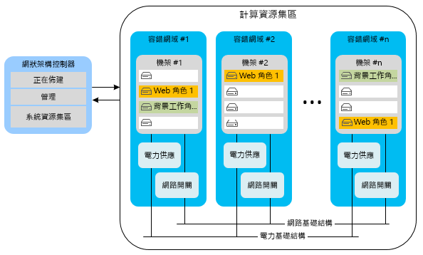
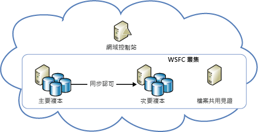
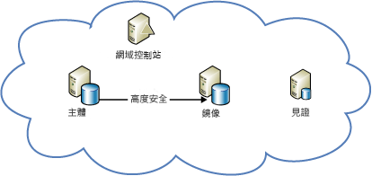

[!INCLUDE [header](../_includes/header.md)]

# Azure 復原技術指導：從 Azure 的本機失敗中復原Azure resiliency technical guidance: Recovery from local failures in Azure

應用程式可用性有兩個主要威脅︰There are two primary threats to application availability:

* 裝置失敗，例如磁碟機及伺服器The failure of devices, such as drives and servers
* 重要資源耗盡，例如在尖峰負載狀況下計算The exhaustion of critical resources, such as compute under peak load conditions

Azure 可提供資源管理、彈性、負載平衡和資料分割的組合，以在這些情況下實現高可用性。Azure provides a combination of resource management, elasticity, load balancing, and partitioning to enable high availability under these circumstances. 在這些功能之中，有些會自動針對所有 Azure 服務來執行。Some of these features are performed automatically for all Azure services. 不過，有時候應用程式開發人員則必須另外執行一些工作，以從中受惠。However, in some cases, the application developer must do some additional work to benefit from them.

## 雲端服務Cloud Services
Azure 雲端服務是由含有一或多個 Web 或背景工作角色的集合所組成。Azure Cloud Services consists of collections of one or more web or worker roles. 角色的一或多個執行個體可以同時執行。One or more instances of a role can run concurrently. 組態會決定執行個體的數目。The configuration determines the number of instances. 角色執行個體可透過名為網狀架構控制器的元件進行監視及管理。Role instances are monitored and managed through a component called the fabric controller. 網狀架構控制器會自動偵測並回應軟體和硬體的失敗。The fabric controller detects and responds to both software and hardware failures automatically.

每個角色執行個體都會在自己的虛擬機器 (VM) 中執行，並透過客體代理程式與其網狀架構控制器通訊。Every role instance runs in its own virtual machine (VM) and communicates with its fabric controller through a guest agent. 客體代理程式會收集資源和節點的度量，包括 VM 使用量、狀態、記錄檔、資源使用量、例外狀況和失敗狀況。The guest agent collects resource and node metrics, including VM usage, status, logs, resource usage, exceptions, and failure conditions. 網狀架構控制器會以可設定的間隔查詢客體代理程式，並在客體代理程式未能回應時重新啟動 VM。The fabric controller queries the guest agent at configurable intervals, and it restarts the VM if the guest agent fails to respond. 如果發生硬體失敗，相關聯的網狀架構控制器會將所有受影響的角色執行個體移至新的硬體節點，並將網路重新設定為將流量路由傳送至該處。In the event of hardware failure, the associated fabric controller moves all affected role instances to a new hardware node and reconfigures the network to route traffic there.

若要受益於這些功能，開發人員應確定服務角色都會避免在角色執行個體上儲存狀態。To benefit from these features, developers should ensure that all service roles avoid storing state on the role instances. 相反地，所有永續性資料應存取自耐久性儲存體，例如 Azure 儲存體或 Azure SQL Database。Instead, all persistent data should be accessed from durable storage, such as Azure Storage or Azure SQL Database. 這可讓任何角色處理要求。This allows any roles to handle requests. 同時也表示角色執行個體即使在任何時候當機，也不會在服務的暫時性或永續性狀態導致不一致。It also means that role instances can go down at any time without creating inconsistencies in the transient or persistent state of the service.

將狀態儲存於角色外部的要求有幾個含意。The requirement to store state externally to the roles has several implications. 例如，這表示 Azure 儲存體資料表的所有相關變更，皆應該盡可能在單一實體群組交易中完成變更。It implies, for example, that all related changes to an Azure Storage table should be changed in a single entity-group transaction, if possible. 當然，變更不可能總是可在單一交易中完成。Of course, it isn't always possible to make all changes in a single transaction. 您必須特別小心地處理，才能確保當角色執行個體失敗，而中斷跨越服務的二個以上永續性狀態更新的長時間執行作業時，不會造成問題。You must take special care to ensure that role instance failures do not cause problems when they interrupt long-running operations that span two or more updates to the persistent state of the service. 如果另一個角色嘗試重試這類作業，它應該要預料到並能處理工作僅部分完成的情況。If another role attempts to retry such an operation, it should anticipate and handle the case where the work was partially completed.

例如，假設有某項服務會將資料分割到多個存放區。For example, consider a service that partitions data across multiple stores. 如果背景工作角色在重新放置分區時當機，分區重新放置作業可能並未完成。If a worker role goes down while it's relocating a shard, the relocation of the shard might not finish. 或者重新放置作業可能會由不同的背景工作角色從頭開始重複此作業，因而可能造成孤立的資料或資料損毀。Or the relocation might be repeated from its inception by a different worker role, potentially causing orphaned data or data corruption. 為了避免發生問題，長時間執行的作業必須具有下列兩種特性之一或兩者兼具︰To prevent problems, long-running operations must be one or both of the following:

* 等冪︰可重複執行且沒有副作用。*Idempotent*: Repeatable without side effects. 為了達到等冪，長時間執行的作業不論執行幾次，都應該具有相同的效果，即使在執行期間發生中斷也一樣。To be idempotent, a long-running operation should have the same effect no matter how many times it's executed, even when it's interrupted during execution.
* 以累加方式重新啟動︰能夠從最近的失敗點繼續。*Incrementally restartable*: Able to continue from the most recent point of failure. 為了能以累加方式重新啟動，長時間執行的作業應該包含一系列較小的不可部分完成作業。To be incrementally restartable, a long-running operation should consist of a sequence of smaller atomic operations. 它也應該在耐久性儲存體中記錄其進度，以便後續的每次叫用都會在其上次停止處重新開始。It should also record its progress in durable storage, so that each subsequent invocation picks up where its predecessor stopped.

最後，所有長時間執行的作業都應該重複叫用，直到成功為止。Finally, all long-running operations should be invoked repeatedly until they succeed. 例如，佈建作業可能會放在 Azure 佇列中，然後只會在成功時才由背景工作角色從佇列中移除。For example, a provisioning operation might be placed in an Azure queue, and then removed from the queue by a worker role only when it succeeds. 記憶體回收可能必須清除中斷的作業所建立的資料。Garbage collection might be necessary to clean up data that interrupted operations create.

### 彈性Elasticity
每個角色所執行的初始執行個體數目是由每個角色的組態決定。The initial number of instances running for each role is determined in each role’s configuration. 系統管理員一開始應該根據預期的負載，設定讓每個角色執行兩個以上的執行個體。Administrators should initially configure each role to run with two or more instances based on expected load. 但您可以在使用模式變更時，輕鬆地相應增加或減少角色執行個體。But you can easily scale role instances up or down as usage patterns change. 您可以在 Azure 入口網站中手動執行此程序，或使用 Windows PowerShell、服務管理 API 或協力廠商工具自動進行此程序。You can do this manually in the Azure portal, or you can automate the process by using Windows PowerShell, the Service Management API, or third-party tools. 如需詳細資訊，請參閱 [如何自動調整應用程式](/azure/cloud-services/cloud-services-how-to-scale/)。For more information, see [How to autoscale an application](/azure/cloud-services/cloud-services-how-to-scale/).

### 分割Partitioning
Azure 網狀架構控制器使用兩種類型的資料分割︰The Azure fabric controller uses two types of partitions:

* 「更新網域」  可用來以群組為單位升級服務的角色執行個體。An *update domain* is used to upgrade a service’s role instances in groups. Azure 會在多個更新網域內部署服務執行個體。Azure deploys service instances into multiple update domains. 在進行就地更新時，網狀架構控制器會關閉一個更新網域中的所有執行個體，加以更新，然後予以重新啟動，之後再移至下一個更新網域。For an in-place update, the fabric controller brings down all the instances in one update domain, updates them, and then restarts them before moving to the next update domain. 這種方法可避免整個服務在更新程序進行期間變得無法使用。This approach prevents the entire service from being unavailable during the update process.
* 「容錯網域」  會定義硬體或網路可能的失敗點。A *fault domain* defines potential points of hardware or network failure. 對於具有多個執行個體的任何角色，網狀架構控制器會確保執行個體能分配給多個容錯網域，以避免獨立的硬體故障造成服務中斷。For any role that has more than one instance, the fabric controller ensures that the instances are distributed across multiple fault domains, to prevent isolated hardware failures from disrupting service. 容錯網域負責控管所有的伺服器和叢集失敗的揭露。Fault domains govern all exposure to server and cluster failures.

[Azure 服務等級協定 (SLA)](https://azure.microsoft.com/support/legal/sla/) 保證，當兩個以上的 Web 角色執行個體部署到不同的容錯和升級網域時，它們會在至少 99.95% 的時間內具有外部連線能力。The [Azure service-level agreement (SLA)](https://azure.microsoft.com/support/legal/sla/) guarantees that when two or more web role instances are deployed to different fault and upgrade domains, they'll have external connectivity at least 99.95 percent of the time. 和更新網域不同的是，容錯網域的數目無法透過任何方法來控制。Unlike update domains, there's no way to control the number of fault domains. Azure 會自動配置容錯網域，並在其中分配角色執行個體。Azure automatically allocates fault domains and distributes role instances across them. 每個角色至少會將前兩個執行個體置於不同的容錯和升級網域，以便確保任何具有至少兩個執行個體的角色都能符合 SLA。At least the first two instances of every role are placed in different fault and upgrade domains to ensure that any role with at least two instances will satisfy the SLA. 下圖說明這個概念。This is represented in the following diagram.

### 負載平衡Load balancing
Web 角色的所有輸入流量都會通過無狀態的負載平衡器，它會將用戶端要求分配給角色執行個體。All inbound traffic to a web role passes through a stateless load balancer, which distributes client requests among the role instances. 個別角色執行個體沒有公用 IP 位址，且無法直接從網際網路定址。Individual role instances do not have public IP addresses, and they are not directly addressable from the Internet. Web 角色沒有狀態，因此任何用戶端要求都能路由至任何角色執行個體。Web roles are stateless so that any client request can be routed to any role instance. [StatusCheck](https://msdn.microsoft.com/library/microsoft.windowsazure.serviceruntime.roleenvironment.statuscheck.aspx) 事件每 15 秒就會引發一次。A [StatusCheck](https://msdn.microsoft.com/library/microsoft.windowsazure.serviceruntime.roleenvironment.statuscheck.aspx) event is raised every 15 seconds. 您可以使用此事件來指出角色是否已準備好接收流量，或是否處於忙碌狀態，因此應該從負載平衡器輪替名單中剔除。You can use this to indicate whether the role is ready to receive traffic, or whether it's busy and should be taken out of the load-balancer rotation.

## 虛擬機器Virtual Machines
Azure 虛擬機器和平台即服務 (PaaS) 計算角色在高可用性的許多方面有不同之處。Azure Virtual Machines differs from platform as a service (PaaS) compute roles in several respects in relation to high availability. 在某些情況下，您必須進行額外工作才能確保高可用性。In some instances, you must do additional work to ensure high availability.

### 磁碟耐久性Disk durability
不同於 PaaS 角色執行個體，即使虛擬機器重新放置，虛擬機器的磁碟機上儲存的資料仍是永續性的。Unlike PaaS role instances, data stored on virtual machine drives is persistent even when the virtual machine is relocated. Azure 虛擬機器會將存在的 VM 磁碟用做 Azure 儲存體中的 Blob。Azure virtual machines use VM disks that exist as blobs in Azure Storage. 由於 Azure 儲存體的可用性特性，虛擬機器的磁碟機上儲存的資料也是高可用性的。Because of the availability characteristics of Azure Storage, the data stored on a virtual machine’s drives is also highly available.

請注意，磁碟機 D (在 Windows VM 中) 是這項規則的例外狀況。Note that drive D (in Windows VMs) is the exception to this rule. 實際上，磁碟機 D 是機架伺服器上裝載 VM 的實體儲存體，如果回收 VM，其資料將會遺失。Drive D is actually physical storage on the rack server that hosts the VM, and its data will be lost if the VM is recycled. 磁碟機 D 僅適用於暫時儲存。Drive D is intended for temporary storage only. 在 Linux，Azure「通常」(但不是一定) 將本機暫存磁碟公開為 /dev/sdb 區塊裝置。In Linux, Azure “usually” (but not always) exposes the local temporary disk as /dev/sdb block device. 它通常由 Azure Linux 代理程式掛接為 /mnt/resource 或 /mnt 掛接點 (可透過 /etc/waagent.conf 設定)。It is often mounted by the Azure Linux Agent as /mnt/resource or /mnt mount points (configurable via /etc/waagent.conf).

### 分割Partitioning
Azure 原本就了解 PaaS 應用程式 (Web 角色和背景工作角色) 中的各層，因此可以正確地將它們分配到容錯網域和更新網域。Azure natively understands the tiers in a PaaS application (web role and worker role) and thus can properly distribute them across fault and update domains. 相反地，基礎結構即服務 (IaaS) 應用程式中的各層則必須透過可用性設定組手動定義。In contrast, the tiers in an infrastructure as a service (IaaS) application must be manually defined through availability sets. IaaS 底下的 SLA 需要可用性設定組。Availability sets are required for an SLA under IaaS.

在上圖中，Internet Information Services (IIS) 層 (做為 Web 應用程式層) 和 SQL 層 (做為資料層) 會指派給不同的可用性設定組。In the preceding diagram, the Internet Information Services (IIS) tier (which works as a web app tier) and the SQL tier (which works as a data tier) are assigned to different availability sets. 這可確保每一層的所有執行個體可透過分配虛擬機器給多個容錯網域而具備硬體備援，並且整個層級不會在更新期間遭到關閉。This ensures that all instances of each tier have hardware redundancy by distributing virtual machines across fault domains, and that entire tiers are not taken down during an update.

### 負載平衡Load balancing
如果流量應該分配給各個 VM，您必須將應用程式中的 VM 予以群組，並在特定 TCP 或 UDP 端點進行負載平衡。If the VMs should have traffic distributed across them, you must group the VMs in an application and load balance across a specific TCP or UDP endpoint. 如需詳細資訊，請參閱 [虛擬機器負載平衡](/azure/virtual-machines/virtual-machines-linux-load-balance/?toc=%2fazure%2fvirtual-machines%2flinux%2ftoc.json)。For more information, see [Load balancing virtual machines](/azure/virtual-machines/virtual-machines-linux-load-balance/?toc=%2fazure%2fvirtual-machines%2flinux%2ftoc.json). 如果 VM 接收來自其他來源 (例如佇列機制) 的輸入，則不需要負載平衡器。If the VMs receive input from another source (for example, a queuing mechanism), a load balancer is not required. 負載平衡器會使用基本健康情況檢查，來判斷是否應該將流量傳送至節點。The load balancer uses a basic health check to determine whether traffic should be sent to the node. 此外，您也可以建立自己的探查，來實作可決定 VM 是否應接收流量的應用程式特定健康情況度量。It's also possible to create your own probes to implement application-specific health metrics that determine whether the VM should receive traffic.

## 儲存體Storage
Azure 儲存體是 Azure 的基準耐久性資料服務。Azure Storage is the baseline durable data service for Azure. 它可提供 Blob、資料表、佇列和 VM 磁碟儲存體。It provides blob, table, queue, and VM disk storage. 它會結合複寫和資源管理，在單一資料中心內提供高可用性。It uses a combination of replication and resource management to provide high availability within a single datacenter. Azure 儲存體可用性 SLA 保證，在至少 99.9% 的時間內︰The Azure Storage availability SLA guarantees that at least 99.9 percent of the time:

* 會成功且正確地處理格式正確的要求，以新增、更新、讀取和刪除資料。Correctly formatted requests to add, update, read, and delete data will be successfully and correctly processed.
* 儲存體帳戶能夠連線到網際網路閘道。Storage accounts will have connectivity to the Internet gateway.

### 複寫Replication
Azure 儲存體可透過在位於區域內完全獨立的實體儲存子系統中，於其中的不同磁碟機上為所有資料維護多個複本，以促進資料耐久性。Azure Storage facilitates data durability by maintaining multiple copies of all data on different drives across fully independent physical storage subsystems within the region. 這些資料會以同步方式進行複寫，並且會先認可所有複本再確認寫入。Data is replicated synchronously, and all copies are committed before the write is acknowledged. Azure 儲存體有強烈一致性，也就是說，讀取一定會反映最近的寫入。Azure Storage is strongly consistent, meaning that reads are guaranteed to reflect the most recent writes. 此外，資料複本會持續接受掃描，以偵測和修復位元損壞，這些損壞是經常被忽略的儲存資料完整性威脅。In addition, copies of data are continually scanned to detect and repair bit rot, an often overlooked threat to the integrity of stored data.

只要使用 Azure 儲存體，服務就會從複寫獲益。Services benefit from replication just by using Azure Storage. 服務開發人員不必進行額外的工作，就能從本機失敗復原。The service developer doesn't need to do additional work to recover from a local failure.

### 資源管理Resource management
在 2014 年 5 月之後建立的儲存體帳戶，最多可以成長到 500 TB (先前的上限為 200 TB)。Storage accounts created after May 2014, can grow to up to 500 TB (the previous maximum was 200 TB). 如果需要額外空間，就必須將應用程式設計成會使用多個儲存體帳戶。If additional space is required, applications must be designed to use multiple storage accounts.

### 虛擬機器磁碟Virtual machine disks
在 Azure 儲存體中，虛擬機器的磁碟會儲存為分頁 Blob，因此具有和 Blob 儲存體完全相同的耐久性和延展性屬性。A virtual machine’s disk is stored as a page blob in Azure Storage, giving it all the same durability and scalability properties as Blob storage. 即使執行 VM 的伺服器失敗，因此必須在另一部伺服器上重新啟動，此設計仍可讓虛擬機器磁碟上的資料永續存在。This design makes the data on a virtual machine’s disk persistent, even if the server running the VM fails and the VM must be restarted on another server.

## 資料庫Database
### SQL DatabaseSQL Database
Azure SQL Database 提供資料庫即服務。Azure SQL Database provides database as a service. 它可讓應用程式快速佈建關聯式資料庫、在其中插入資料並進行查詢。It allows applications to quickly provision, insert data into, and query relational databases. 它提供許多熟悉的 SQL Server 特性與功能，同時減少了硬體、組態、修補和復原的負擔。It provides many of the familiar SQL Server features and functionality, while abstracting the burden of hardware, configuration, patching, and resiliency.

> [!NOTE]
> Azure SQL Database 不提供與 SQL Server 的一對一功能對應。Azure SQL Database does not provide one-to-one feature parity with SQL Server. 其目的是要滿足一組唯一適用於雲端應用程式的不同需求 (彈性調整、資料庫即服務以降低維護成本等等)。It's intended to fulfill a different set of requirements--one that's uniquely suited to cloud applications (elastic scale, database as a service to reduce maintenance costs, and so on). 如需詳細資訊，請參閱 [選擇雲端 SQL Server 選項：Azure SQL (PaaS) Database 或 Azure VM 上的 SQL Server (IaaS)](/azure/sql-database/sql-database-paas-vs-sql-server-iaas/)。For more information, see [Choose a cloud SQL Server option: Azure SQL (PaaS) Database or SQL Server on Azure VMs (IaaS)](/azure/sql-database/sql-database-paas-vs-sql-server-iaas/).
> 
> 

#### 複寫Replication
Azure SQL Database 針對節點層級失敗提供內建的復原功能。Azure SQL Database provides built-in resiliency to node-level failure. 所有對資料庫的寫入，都會透過仲裁認可技術自動複寫到兩個以上的背景節點中 All writes into a database are automatically replicated to two or more background nodes through a quorum commit technique. (主要節點和至少一個次要節點必須先確認活動已寫入交易記錄內，交易才會被視為成功並傳回)。萬一發生節點失敗，資料庫會自動容錯移轉至其中一個次要複本。(The primary and at least one secondary must confirm that the activity is written to the transaction log before the transaction is deemed successful and returns.) In the case of node failure, the database automatically fails over to one of the secondary replicas. 這會導致用戶端應用程式暫時中斷連線。This causes a transient connection interruption for client applications. 有鑑於此，所有 Azure SQL Database 用戶端都必須實作某種形式的暫時性連線處理。For this reason, all Azure SQL Database clients must implement some form of transient connection handling. 如需詳細資訊，請參閱[重試服務的特定指引](/azure/best-practices-retry-service-specific/)。For more information, see [Retry service specific guidance](/azure/best-practices-retry-service-specific/).

#### 資源管理Resource management
每個資料庫在建立時都會設定大小上限。Each database, when created, is configured with an upper size limit. 目前可用的大小上限為 1 TB (大小限制根據您的服務層而有所不同，請參閱 [Azure SQL Database 的服務層和效能層級](/azure/sql-database/sql-database-resource-limits/#service-tiers-and-performance-levels)。The currently available maximum size is 1 TB (size limits vary based on your service tier, see [service tiers and performance levels of Azure SQL Databases](/azure/sql-database/sql-database-resource-limits/#service-tiers-and-performance-levels). 當資料庫達到大小上限，就會拒絕其他 INSERT 或 UPDATE 命令 When a database hits its upper size limit, it rejects additional INSERT or UPDATE commands. (但仍可查詢和刪除資料)。(Querying and deleting data is still possible.)

在資料庫內，Azure SQL Database 會使用網狀架構來管理資源。Within a database, Azure SQL Database uses a fabric to manage resources. 不過，它會使用通道拓撲 (而不是網狀架構控制器) 來偵測失敗。However, instead of a fabric controller, it uses a ring topology to detect failures. 叢集中的每個複本都有兩個鄰近項目，而且複本需負責在鄰近項目關閉時進行偵測。Every replica in a cluster has two neighbors and is responsible for detecting when they go down. 當複本關閉時，其鄰近項目會觸發重新設定代理程式，以在另一部電腦上重新建立複本。When a replica goes down, its neighbors trigger a reconfiguration agent to re-create it on another machine. 所提供的引擎節流可確保邏輯伺服器不會在電腦上使用太多資源，或超過電腦的實體限制。Engine throttling is provided to ensure that a logical server doesn't use too many resources on a machine or exceed the machine’s physical limits.

### 彈性Elasticity
如果應用程式需要超過 1 TB 的資料庫限制，就必須實作相應放大方法。If the application requires more than the 1 TB database limit, it must implement a scale-out approach. 您可以透過將資料手動分割 (也稱為分區化) 到多個 SQL Database，以使用 Azure SQL Database 相應放大。You scale out with Azure SQL Database by manually partitioning, also known as sharding, data across multiple SQL databases. 此相應放大方法可讓成本有機會隨著規模達成接近線性的成長。This scale-out approach provides the opportunity to achieve nearly linear cost growth with scale. 彈性成長或隨選容量可以視需要來成長，而其成本會隨之遞增，因為資料庫的計費是根據每天使用的實際大小平均值，而不是可能的最大大小。Elastic growth or capacity on demand can grow with incremental costs as needed because databases are billed based on the average actual size used per day, not based on maximum possible size.

## 虛擬機器上的 SQL ServerSQL Server on Virtual Machines
透過在 Azure 虛擬機器上安裝 SQL Server (2014 版或更新版本)，您將可以利用 SQL Server 的傳統可用性功能。By installing SQL Server (version 2014 or later) on Azure Virtual Machines, you can take advantage of the traditional availability features of SQL Server. 這些功能包括 AlwaysOn 可用性群組或資料庫鏡像。These features include AlwaysOn Availability Groups and database mirroring. 請注意，與內部部署、非虛擬化的 IT 基礎結構相較之下，Azure VM、儲存體和網路各有不同的作業特性。Note that Azure VMs, storage, and networking have different operational characteristics than an on-premises, non-virtualized IT infrastructure. 若要在 Azure 中成功實作高可用性/災害復原 (HA/DR) SQL Server 解決方案，您必須了解這些差異，並配合這些差異設計您的解決方案。A successful implementation of a high availability/disaster recovery (HA/DR) SQL Server solution in Azure requires that you understand these differences and design your solution to accommodate them.

### 可用性設定組中的高可用性節點High-availability nodes in an availability set
當您在 Azure 中實作高可用性解決方案時，您可以使用 Azure 中的可用性設定組，將高可用性節點放入分隔的容錯網域和升級網域。When you implement a high-availability solution in Azure, you can use the availability set in Azure to place the high-availability nodes into separate fault domains and upgrade domains. 但您必須要清楚，可用性設定組是一種 Azure 概念。To be clear, the availability set is an Azure concept. 您最好遵循此概念，以確保資料庫確實具有高可用性，不論您是使用 AlwaysOn 可用性群組、資料庫鏡像或其他方法。It's a best practice that you should follow to make sure that your databases are indeed highly available, whether you're using AlwaysOn Availability Groups, database mirroring, or something else. 如果您沒有遵循這個最佳做法，您可能會誤以為系統具有高可用性。If you don't follow this best practice, you might be under the false assumption that your system is highly available. 但事實上節點卻可能全部同時失敗，只因為它們剛好放在 Azure 區域內的相同容錯網域中。But in reality, your nodes can all fail simultaneously because they happen to be placed in the same fault domain in the Azure region.

這項建議不適用於記錄傳送。This recommendation is not as applicable with log shipping. 因為既然要做為災害復原功能，您就應該確定伺服器是在不同的 Azure 區域執行。As a disaster recovery feature, you should ensure that the servers are running in separate Azure regions. 根據定義，這些區域是不同的容錯網域。By definition, these regions are separate fault domains.

若要將透過傳統入口網站部署的 Azure 雲端服務放入相同的可用性設定組中，您必須將其部署至相同的雲端服務中。For Azure Cloud Services VMs deployed through the classic portal to be in the same availability set, you must deploy them in the same Cloud Service. 透過 Azure Resource Manager (目前的入口網站) 部署的 VM 沒有這項限制。VMs deployed through Azure Resource Manager (the current portal) do not have this limitation. 對於傳統入口網站部署在 Azure 雲端服務中的 VM，只有相同雲端服務內的節點可以參與相同的可用性設定組。For classic portal deployed VMs in Azure Cloud Service, only nodes in the same Cloud Service can participate in the same availability set. 此外，雲端服務 VM 應該位於相同的虛擬網路中，以確保即使在服務修復之後，VM 也能保有其 IP。In addition, the Cloud Services VMs should be in the same virtual network to ensure that they maintain their IPs even after service healing. 這可避免 DNS 更新中斷。This avoids DNS update disruptions.

### 僅限 Azure：高可用性解決方案Azure-only: High-availability solutions
您可以使用 AlwaysOn 可用性群組或資料庫鏡像，為 Azure 中的 SQL Server 資料庫提供高可用性解決方案。You can have a high-availability solution for your SQL Server databases in Azure by using AlwaysOn Availability Groups or database mirroring.

下圖說明在 Azure 虛擬機器中執行的 AlwaysOn 可用性群組的架構。The following diagram demonstrates the architecture of AlwaysOn Availability Groups running on Azure Virtual Machines. 此圖擷取自關於此主題的深度文章： [Azure 虛擬機器中的 SQL Server 高可用性和災害復原](/azure/virtual-machines/windows/sql/virtual-machines-windows-sql-high-availability-dr/)。This diagram was taken from the in-depth article on this subject, [High availability and disaster recovery for SQL Server on Azure Virtual Machines](/azure/virtual-machines/windows/sql/virtual-machines-windows-sql-high-availability-dr/).

您也可以使用 Azure 入口網站中的 AlwaysOn 範本，以在 Azure VM 上端對端自動佈建 AlwaysOn 可用性群組部署。You can also automatically provision an AlwaysOn Availability Groups deployment end-to-end on Azure VMs by using the AlwaysOn template in the Azure portal. 如需詳細資訊，請參閱 [Microsoft Azure 入口網站資源庫提供的 SQL Server AlwaysOn](https://blogs.technet.microsoft.com/dataplatforminsider/2014/08/25/sql-server-alwayson-offering-in-microsoft-azure-portal-gallery/)。For more information, see [SQL Server AlwaysOn Offering in Microsoft Azure Portal Gallery](https://blogs.technet.microsoft.com/dataplatforminsider/2014/08/25/sql-server-alwayson-offering-in-microsoft-azure-portal-gallery/).

下圖說明如何在 Azure 虛擬機器上使用資料庫鏡像。The following diagram demonstrates the use of database mirroring on Azure Virtual Machines. 此圖擷取自深度主題： [Azure 虛擬機器中的 SQL Server 高可用性和災害復原](/azure/virtual-machines/windows/sql/virtual-machines-windows-sql-high-availability-dr/)。It was also taken from the in-depth topic [High availability and disaster recovery for SQL Server on Azure Virtual Machines](/azure/virtual-machines/windows/sql/virtual-machines-windows-sql-high-availability-dr/).

> [!NOTE]
> 這兩種架構都必須要有網域控制站。Both architectures require a domain controller. 不過，在使用資料庫鏡像時，則可以使用伺服器憑證，而不需要有網域控制站。However, with database mirroring, it's possible to use server certificates to eliminate the need for a domain controller.
> 
> 

## 其他 Azure 平台服務Other Azure platform services
建置在 Azure 之上的應用程式可獲益於平台功能而從本機失敗中復原。Applications that are built on Azure benefit from platform capabilities to recover from local failures. 在某些情況下，您可以採取特定動作來增加特定案例的可用性。In some cases, you can take specific actions to increase availability for your specific scenario.

### 服務匯流排Service Bus
為了避免 Azure 服務匯流排暫時中斷，請考慮建立耐久性用戶端佇列。To mitigate against a temporary outage of Azure Service Bus, consider creating a durable client-side queue. 這會暫時使用替代的本機儲存體機制，來儲存無法新增至服務匯流排佇列的訊息。This temporarily uses an alternate, local storage mechanism to store messages that cannot be added to the Service Bus queue. 應用程式可以決定服務還原之後，要如何處理暫時儲存的訊息。The application can decide how to handle the temporarily stored messages after the service is restored. 如需詳細資訊，請參閱[使用服務匯流排代理傳訊的效能改進最佳作法](/azure/service-bus-messaging/service-bus-performance-improvements/)和[服務匯流排 (災害復原)](recovery-loss-azure-region.md#other-azure-platform-services)。For more information, see [Best practices for performance improvements using Service Bus brokered messaging](/azure/service-bus-messaging/service-bus-performance-improvements/) and [Service Bus (disaster recovery)](recovery-loss-azure-region.md#other-azure-platform-services).

### HDInsightHDInsight
根據預設，與 Azure HDInsight 相關聯的資料會儲存在 Azure Blob 儲存體中。The data that's associated with Azure HDInsight is stored by default in Azure Blob storage. Azure 儲存體會指定 Blob 儲存體的高可用性和耐久性屬性。Azure Storage specifies high-availability and durability properties for Blob storage. 與 Hadoop MapReduce 作業相關聯的多重節點處理，會在暫時性的 Hadoop 分散式檔案系統 (HDFS) 中進行，如果 HDInsight 有需要，便會佈建此系統。The multiple-node processing that's associated with Hadoop MapReduce jobs occurs on a transient Hadoop Distributed File System (HDFS) that is provisioned when HDInsight needs it. 根據預設，MapReduce 作業的結果也會儲存在 Azure Blob 儲存體中，因此在取消佈建 Hadoop 叢集之後，處理過的資料仍具有耐久性且維持高可用性。Results from a MapReduce job are also stored by default in Azure Blob storage, so that the processed data is durable and remains highly available after the Hadoop cluster is deprovisioned. 如需詳細資訊，請參閱 [HDInsight (災害復原)](recovery-loss-azure-region.md#other-azure-platform-services)。For more information, see [HDInsight (disaster recovery)](recovery-loss-azure-region.md#other-azure-platform-services).

## 本機失敗的檢查清單Checklists for local failures
### 雲端服務Cloud Services
1. 檢閱此文件的＜雲端服務＞一節。Review the Cloud Services section of this document.
2. 為每個角色設定至少兩個執行個體。Configure at least two instances for each role.
3. 在耐久性儲存體 (而非角色執行個體) 中保存狀態。Persist state in durable storage, not on role instances.
4. 正確地處理 StatusCheck 事件。Correctly handle the StatusCheck event.
5. 盡可能將相關的變更包裝在交易中。Wrap related changes in transactions when possible.
6. 確認背景工作角色的工作具有等冪性且可以重新啟動。Verify that worker role tasks are idempotent and restartable.
7. 持續叫用作業，直到成功為止。Continue to invoke operations until they succeed.
8. 考慮自動調整策略。Consider autoscaling strategies.

### 虛擬機器Virtual Machines
1. 檢閱此文件的＜虛擬機器＞一節。Review the Virtual Machines section of this document.
2. 請勿使用磁碟機 D 來進行永續性儲存。Do not use drive D for persistent storage.
3. 將服務層中的電腦群組為可用性設定組。Group machines in a service tier into an availability set.
4. 設定負載平衡和選擇性探查。Configure load balancing and optional probes.

### 儲存體Storage
1. 檢閱此文件的＜儲存體＞一節。Review the Storage section of this document.
2. 當資料或頻寬超出配額時，使用多個儲存體帳戶。Use multiple storage accounts when data or bandwidth exceeds quotas.

### SQL DatabaseSQL Database
1. 檢閱此文件的＜SQL Database＞一節。Review the SQL Database section of this document.
2. 實作重試原則來處理暫時性錯誤。Implement a retry policy to handle transient errors.
3. 使用分割/分區化做為相應放大策略。Use partitioning/sharding as a scale-out strategy.

### 虛擬機器上的 SQL ServerSQL Server on Virtual Machines
1. 檢閱此文件的＜虛擬機器上的 SQL Server＞一節。Review the SQL Server on Virtual Machines section of this document.
2. 遵循先前的虛擬機器建議。Follow the previous recommendations for Virtual Machines.
3. 使用 SQL Server 高可用性功能，例如 AlwaysOn。Use SQL Server high availability features, such as AlwaysOn.

### 服務匯流排Service Bus
1. 檢閱此文件的＜服務匯流排＞一節。Review the Service Bus section of this document.
2. 考慮建立耐久性用戶端佇列來做為備份。Consider creating a durable client-side queue as a backup.

### HDInsightHDInsight
1. 檢閱此文件的＜HDInsight＞一節。Review the HDInsight section of this document.
2. 本機失敗不需要其他可用性步驟。No additional availability steps are required for local failures.

