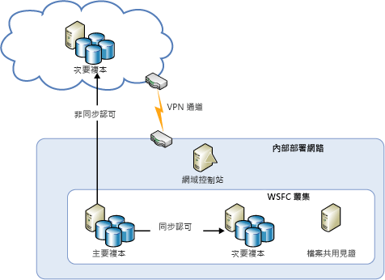
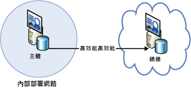
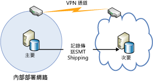

[!INCLUDE [header](../_includes/header.md)]

# Azure 復原技術指導：從內部部署復原到 Azure

Azure 提供一組完整的服務，可針對高可用性和災害復原用途，啟用從內部部署資料中心至 Azure 的擴充︰

- **網路**：您可以使用虛擬私人網路，將內部部署網路安全地擴充至雲端。
- **計算**：使用 Hyper-V 內部部署的客戶可以將現有虛擬機器 (VM)「提升並移轉」至 Azure。
- **儲存體**：StorSimple 會將您的檔案系統擴充至 Azure 儲存體。 Azure 備份服務會將檔案和 SQL Database 備份至 Azure 儲存體。
- **資料庫複寫**︰您可以使用 SQL Server 2014 (或更新版本) 可用性群組，為您的內部部署資料實作高可用性和災害復原。

## 網路功能

您可以使用 Azure 虛擬網路在 Azure 中建立邏輯隔離區段，並透過 IPsec 連線，安全地將其連接到內部部署資料中心或單一用戶端機器。 透過虛擬網路，您可以運用 Azure 的可調整的隨選基礎結構，同時提供連線至內部部署資料和應用程式的能力，包括 Windows Server、大型主機及 UNIX 上執行的系統。 如需詳細資訊，請參閱 [Azure 網路文件](/azure/virtual-network/virtual-networks-overview/) 。

## 計算

如果您在內部部署使用 Hyper-V，則可以將現有的虛擬機器「提升並移轉」至執行 Windows Server 2012 (或更新版本) 的 Azure 和服務提供者，而不用變更 VM 或轉換 VM 格式。 如需詳細資訊，請參閱[關於 Azure 虛擬機器的磁碟與 VHD](/azure/virtual-machines/virtual-machines-linux-about-disks-vhds/?toc=%2fazure%2fvirtual-machines%2flinux%2ftoc.json)。

## Azure Site Recovery

如果您想要災害復原即服務 (DRaaS)，Azure 提供 [Azure Site Recovery](https://azure.microsoft.com/services/site-recovery/)。 Azure Site Recovery 為 VMware、Hyper-V 與實體伺服器提供全面性的保護。 透過 Azure Site Recovery，您可以使用另一部內部部署伺服器或 Azure 做為復原網站。 如需 Azure Site Recovery 的詳細資訊，請參閱 [Azure Site Recovery 文件](https://azure.microsoft.com/documentation/services/site-recovery/)。

## 儲存體

有數個選項可以使用 Azure 做為內部部署資料的備份網站。

### StorSimple

StorSimple 安全而明確地整合內部部署應用程式的雲端儲存體。 它也提供單一的應用裝置，提供高效能分層式的本機和雲端儲存體、即時封存、雲端型資料保護和災害復原。 如需詳細資訊，請參閱 [StorSimple 產品頁面](https://azure.microsoft.com/services/storsimple/)。

### Azure 備份

Azure 備份可以在 Windows Server 2012 (或更新版本)、Windows Server 2012 Essentials (或更新版本) 和System Center 2012 Data Protection Manager (或更新版本) 中利用熟悉的備份工具啟用雲端備份。 這些工具提供備份管理的工作流程，不受備份的儲存體位置的影響，無論是本機磁碟或 Azure 儲存體。 在將資料備份到雲端之後，授權使用者可以輕易地將備份復原至任何伺服器。

之後進行增量備份時，只有變更的檔案才會傳輸到雲端， 如此可協助有效使用儲存體空間、降低頻寬耗用，並且支援對多個版本的資料執行時間點復原。 您也可以選擇使用其他功能，例如資料保留原則、資料壓縮和資料傳輸節流。 使用 Azure 做為備份位置有明顯的優點，備份會自動在「異地」處理。 這樣就能排除保護本地備份媒體的額外需求。

如需詳細資訊，請參閱[何謂 Azure 備份？](/azure/backup/backup-introduction-to-azure-backup/)和[設定 DPM 資料的 Azure 備份](https://technet.microsoft.com/library/jj728752.aspx)。

## 資料庫

您可以使用 AlwaysOn 可用性群組、資料庫鏡像及記錄傳送，為混合式 IT 環境中的 SQL Server 資料庫提供災害復原解決方案，以及使用 Azure Blob 儲存體進行備份和還原。 這些解決方案都使用在 Azure 虛擬機器上執行的 SQL Server。

AlwaysOn 可用性群組可以在混合式 IT 環境中使用，在該環境中資料庫複本同時存在於內部部署和雲端中。 如下圖所示。

資料庫鏡像也能橫跨憑證式安裝中的內部部署伺服器和雲端。 下圖說明此概念。

記錄傳送可以用來同步處理內部部署資料庫與 Azure 虛擬機器中的 SQL Server 資料庫。

最後，您可以直接將內部部署資料庫備份至 Azure Blob 儲存體。

如需詳細資訊，請參閱 [Azure 虛擬機器中的 SQL Server 高可用性和災害復原](/azure/virtual-machines/windows/sql/virtual-machines-windows-sql-high-availability-dr/)和 [Azure 虛擬機器中的 SQL Server 備份和還原](/azure/virtual-machines/windows/sql/virtual-machines-windows-sql-backup-recovery/)。

## Microsoft Azure 中的內部部署復原的檢查清單

<!-- markdownlint-disable MD024 -->

### 網路功能

1. 檢閱此文件的＜網路＞一節。
2. 使用虛擬網路將內部部署安全地連接至雲端。

### 計算

1. 檢閱此文件的＜計算＞一節。
2. 在 Hyper-V 與 Azure 之間重新放置 VM。

### 儲存體

1. 檢閱此文件的＜儲存體＞一節。
2. 利用 StorSimple 服務以使用雲端儲存體。
3. 使用 Azure 備份服務。

### 資料庫

1. 檢閱此文件的＜資料庫＞一節。
2. 考量使用 Azure VM 上的 SQL Server 做為備份。
3. 設定 AlwaysOn 可用性群組。
4. 設定憑證式資料庫鏡像。
5. 使用記錄傳送。
6. 將內部部署資料庫備份至 Azure Blob 儲存體。

<!-- markdownlint-enable MD024 -->
