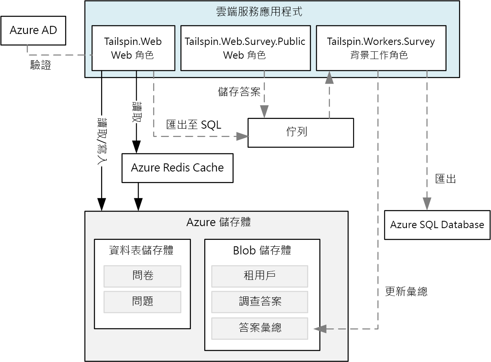
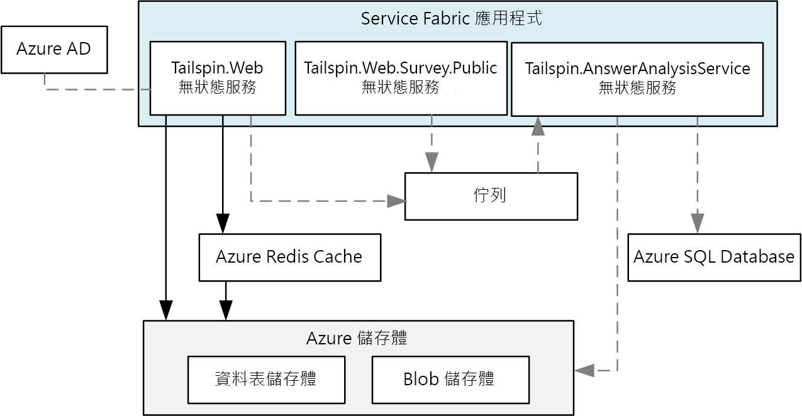
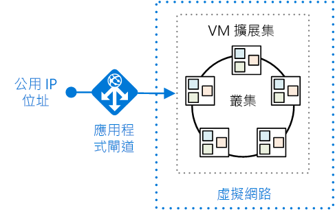
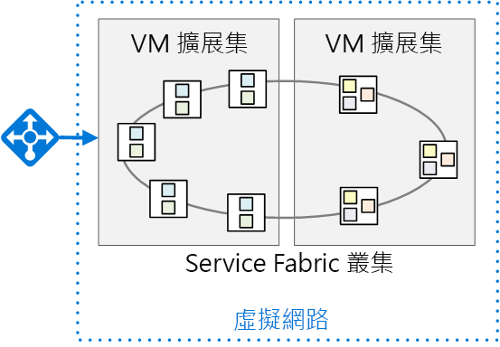

# <a name="migrate-an-azure-cloud-services-application-to-azure-service-fabric"></a>將 Azure 雲端服務應用程式移轉至 Azure Service Fabric 

[ 程式碼範例][sample-code]

本文說明如何將應用程式從 Azure 雲端服務移轉至 Azure Service Fabric。 內容重點放在架構決策和建議的做法。 

在此專案中，我們從稱為「Surveys」的雲端服務應用程式來開始著手，並已將其移植到 Service Fabric。 我們的目標是要以最少的變動移轉應用程式。 在之後的文章中，我們會採用微服務架構，讓 Service Fabric 的應用程式獲得最佳效能。

在閱讀本文之前，先大致了解 Service Fabric 和微服務架構的基本概念，會對您有所幫助。 請參閱下列文章：

- [Azure Service Fabric 概觀][sf-overview]
- [為何要用微服務方式建置應用程式？][sf-why-microservices]


## <a name="about-the-surveys-application"></a>關於 Surveys 應用程式

在 2012 年時，Patterns & Practices 群組針對《[Developing Multi-tenant Applications for the Cloud][tailspin-book]》一書建立了名為「Surveys」的應用程式。 本書說明 Tailspin 這家虛構公司所設計並實作的 Surveys 應用程式。

Surveys 是多租用戶應用程式，可讓客戶建立問卷。 客戶註冊該應用程式之後，客戶組織的成員即可建立和發佈問卷，並收集結果以進行分析。 該應用程式並有一個公用網站可供眾人進入問卷。 您可以在[這裡][tailspin-scenario]深入了解原始的 Tailspin 案例。

現在，Tailspin 想要使用 Azure 上所執行的 Service Fabric，將 Surveys 應用程式移往微服務架構。 由於該應用程式已部署為雲端服務應用程式，Tailspin 採用了多階段方式：

1.  將雲端服務植入 Service Fabric，同時將應用程式的變更降至最低。
2.  將 Service Fabric 的應用程式移往微服務架構，讓其獲得最佳效能。

本文會說明第一個階段。 之後的文章會說明第二個階段。 在真實世界的專案中，這兩個階段可能會重疊。 在移植到 Service Fabric 的同時，您也會開始重新設計應用程式的架構，使其能夠進入微服務。 之後，您可能會進一步改善架構，或許是將較大型的服務分割成眾多較小的服務。  

該應用程式的程式碼可於 [GitHub][sample-code] 取得。 此存放庫內含雲端服務應用程式與 Service Fabric 版本。 

> 雲端服務是《Developing Multi-tenant Applications》一書中所提供之原始應用程式的更新版本。

## <a name="why-microservices"></a>使用微服務的理由？

本文不會深入討論微服務，但 Tailspin 希望藉由移往微服務架構而能獲得的優勢如下：

- **應用程式升級**。 服務可以獨立地部署，以便能夠採取累加方式升級應用程式。
- **復原功能和錯誤隔離**。 如果服務失敗，其他服務會繼續執行。
- **延展性**。 服務可以獨立調整。
- **彈性**。 服務是圍繞商務案例 (而不是技術堆疊) 來設計的，因此可讓您更輕鬆地將服務移轉至新的技術、架構或資料存放區。
- **敏捷式開發**。 相較於單體式應用程式，個別服務的程式碼較少，因此其程式碼基底較容易理解、知道原由和進行測試。
- **小型焦點小組**。 應用程式分成了許多小型服務，因此可由小型的聚焦小組建置各個服務。

## <a name="why-service-fabric"></a>使用 Service Fabric 的理由？
      
Service Fabric 適合用於微服務架構，因為分散式系統所需的大部分功能都會內建在 Service Fabric 中，包括：

- **叢集管理**。 Service Fabric 會自動處理節點的容錯移轉、健康情況監視和其他叢集管理功能。
- **水平調整**。 當您將節點新增至 Service Fabric 叢集時，應用程式會自動調整，因為服務會分散到這些新節點。
- **服務探索**。 Service Fabric 會提供可解析具名服務端點的探索服務。
- **無狀態服務和具狀態服務**。 具狀態服務會使用[可靠集合][sf-reliable-collections]，這些集合不僅可取代快取或佇列，還能加以分割。
- **應用程式生命週期管理**。 服務可以獨立升級，應用程式不必停機。
- 跨機器叢集的**服務協調流程**。
- **更高的密度**以獲得最佳的資源耗用量。 單一節點可以裝載多個服務。

Service Fabric 可供各種 Microsoft 服務使用，包括 Azure SQL Database、Cosmos DB、Azure 事件中樞等等，因此是經過證實可供建置分散式雲端應用程式的平台。 

## <a name="comparing-cloud-services-with-service-fabric"></a>比較雲端服務與 Service Fabric

下表摘要列出雲端服務和 Service Fabric 應用程式的一些重要差異。 如需更深入的套論，請參閱[移轉應用程式之前，先了解雲端服務與 Service Fabric 之間的差異][sf-compare-cloud-services]。

|        | 雲端服務 | Service Fabric |
|--------|---------------|----------------|
| 應用程式組合 | 角色| 服務 |
| 密度 |每個 VM 一個角色執行個體 | 單一節點可有多個服務 |
| 最小節點數目 | 每一角色 2 個 | 每一叢集 5 個，用於生產部署 |
| 狀態管理 | 無狀態 | 無狀態或具狀態* |
| 裝載 | Azure | 雲端或內部部署 |
| Web 裝載 | IIS** | 自我裝載 |
| 部署模型 | [傳統部署模型][azure-deployment-models] | [Resource Manager][azure-deployment-models]  |
| 包裝中 | 雲端服務套件檔案 (.cspkg) | 應用程式和服務套件 |
| 應用程式更新 | VIP 交換或輪流更新 | 輪流更新 |
| 自動調整 | [內建服務][cloud-service-autoscale] | 具有 VM 擴展集可供自動相應放大 |
| Debugging | 本機模擬器 | 本機叢集 |


\*具狀態服務會使用[可靠集合][sf-reliable-collections]來跨複本儲存狀態，讓所有讀取皆是在叢集節點的本機進行。 寫入會複寫到各個節點，以提供可靠性。 無狀態服務可以使用資料庫或其他外部儲存體而具有外部狀態。

** 背景工作角色也可以使用 OWIN 自我裝載 ASP.NET Web API。

## <a name="the-surveys-application-on-cloud-services"></a>雲端服務上的 Surveys 應用程式

下圖顯示雲端服務上所執行之 Surveys 應用程式的架構。 



此應用程式是由兩個 Web 角色和一個背景工作角色所組成。

- **Tailspin.Web** Web 角色可裝載 ASP.NET 網站，供 Tailspin 客戶用來建立和管理問卷。 客戶也會使用此網站來註冊應用程式，並管理其訂用帳戶。 最後，Tailspin 管理員可用它來查看租用戶清單，並管理租用戶資料。 

- **Tailspin.Web.Survey.Public** Web 角色可裝載 ASP.NET 網站，供眾人進入 Tailspin 客戶所發佈的問卷。 

- **Tailspin.Workers.Survey** 背景工作角色負責進行幕後處理。 Web 角色會將工作項目放入佇列，背景工作角色則負責處理這些項目。 系統會定義兩個背景工作：將問卷的答覆匯出到 Azure SQL Database，並計算問卷答覆的統計資料。

除了雲端服務外，Surveys 應用程式還會使用一些其他的 Azure 服務：

- **Azure 儲存體**，以存放問卷、問卷答覆和租用戶資訊。

- **Azure Redis 快取**，以快取 Azure 儲存體中儲存的部分資料，來加快讀取存取的速度。 

- **Azure Active Directory** (Azure AD)，以驗證客戶與 Tailspin 管理員。

- **Azure SQL Database**，以儲存問卷答覆來進行分析。 

## <a name="moving-to-service-fabric"></a>移往 Service Fabric

如前所述，此階段的目標是要移轉至 Service Fabric，且所需的變更要最少。 為此，我們建立了對應至原始應用程式中各個雲端服務角色的無狀態服務：



此架構刻意設計成非常類似原始應用程式。 不過，圖表中會隱藏一些重要差異。 在本文的其餘部分，我們會探討這些差異。 


## <a name="converting-the-cloud-service-roles-to-services"></a>將雲端服務角色轉換為服務

如前所述，我們已將每個雲端服務角色移轉到 Service Fabric 服務。 由於雲端服務角色是無狀態的，因為在此階段中，我們必須在 Service Fabric 中建立無狀態服務。 

在移轉時，我們遵循了[將 Web 角色和背景工作角色轉換成 Service Fabric 無狀態服務的指南][sf-migration]中概述的步驟。 

### <a name="creating-the-web-front-end-services"></a>建立 Web 前端服務

在 Service Fabric 中，服務會在 Service Fabric 執行階段所建立的處理序內執行。 對於 Web 前端來說，這表示服務未在 IIS 內執行。 相反地，服務必須裝載 Web 伺服器。 這種方式稱為「自我裝載」，因為在處理序內執行的程式碼會作為 Web 伺服器主機。 

自我裝載的需求代表 Service Fabric 服務無法使用 ASP.NET MVC 或 ASP.NET Web Form，因為這些架構需要 IIS，並不支援自我裝載。 自我裝載選項包含：

- [ASP.NET Core][aspnet-core]，使用 [Kestrel][kestrel] Web 伺服器自我裝載。 
- [ASP.NET Web API][aspnet-webapi]，使用 [OWIN][owin] 自我裝載。
- [Nancy](http://nancyfx.org/) 之類的第三方架構。

原始的 Surveys 應用程式使用 ASP.NET MVC。 因為 ASP.NET MVC 無法自我裝載在 Service Fabric 中，我們考慮了下列移轉選項：

- 將 Web 角色植入 ASP.NET Core，以便能夠自我裝載。
- 將網站轉換為單一頁面應用程式 (SPA)，以使用 ASP.NET Web API 呼叫 Web API 實作。 這會需要徹底重新設計的 Web 前端。
- 保留現有的 ASP.NET MVC 程式碼，並將 Windows Server 容器中的 IIS 部署到 Service Fabric。 這個方式只需要稍微變更程式碼，或完全不必變更。 

第一個選項是移植到 ASP.NET Core，可讓我們使用 ASP.NET Core 中的最新功能。 為了執行轉換，我們遵循了[從 ASP.NET MVC 移轉到 ASP.NET Core MVC][aspnet-migration] 中說明的步驟。 

> [!NOTE]
> 為求安全，在搭配使用 ASP.NET Core 與 Kestrel 時，您應該在 Kestrel 前面放置反向 Proxy 以處理來自網際網路的流量。 如需詳細資訊，請參閱 [ASP.NET Core 中的 Kestrel Web 伺服器實作][kestrel]。 [部署應用程式](#deploying-the-application)一節會說明建議的 Azure 部署。

### <a name="http-listeners"></a>HTTP 接聽程式

在雲端服務中，Web 角色或背景工作角色會藉由在[服務定義檔][cloud-service-endpoints]宣告 HTTP 端點，以將其公開。 Web 角色必須至少有一個端點。

```xml
<!-- Cloud service endpoint -->
<Endpoints>
    <InputEndpoint name="HttpIn" protocol="http" port="80" />
</Endpoints>
```

同樣地，Service Fabric 端點會於服務資訊清單中宣告： 

```xml
<!-- Service Fabric endpoint -->
<Endpoints>
    <Endpoint Protocol="http" Name="ServiceEndpoint" Type="Input" Port="8002" />
</Endpoints>
```

不過，不同於雲端服務角色，Service Fabric 服務可共置於相同節點內。 因此，每個服務都必須接聽不同連接埠。 在本文稍後，我們會討論連接埠 80 或連接埠 443 上的用戶端要求是如何路由至服務的正確連接埠。

服務必須明確地建立每個端點的接聽程式。 原因是 Service Fabric 對於通訊堆疊是無從驗證的。 如需詳細資訊，請參閱[使用 ASP.NET Core 建置應用程式的 Web 服務前端][sf-aspnet-core]。

## <a name="packaging-and-configuration"></a>封裝和設定

 雲端服務包含下列組態和套件檔案：

| 檔案 | 說明 |
|------|-------------|
| 服務定義 (.csdef) | Azure 用來設定雲端服務的設定。 定義角色、端點、啟動工作和組態設定名稱。 |
| 服務組態 (.cscfg) | 每一部署的設定，包括角色執行個體數目、端點連接埠號碼，以及組態設定的值。 
| 服務套件 (.cspkg) | 包含應用程式程式碼和組態以及服務定義檔。  |

整個應用程式有一個 .csdef 檔案。 您可以有多個用於不同環境的 .cscfg 檔案，例如本機、測試或生產環境。 當服務執行時，您可以更新 .cscfg，但不能更新 .csdef。 如需詳細資訊，請參閱[什麼是雲端服務模型？如何封裝？][cloud-service-config]

Service Fabric 在服務「定義」和服務「設定」之間有相似的劃分，但結構更為細微。 若要了解 Service Fabric 的組態模型，了解 Service Fabric 應用程式的封裝方式會有所幫助。 結構如下：

```
Application package
  - Service packages
    - Code package
    - Configuration package
    - Data package (optional)
```

應用程式套件是您部署的項目。 它包含一或多個服務套件。 服務套件包含程式碼、組態和資料套件。 程式碼套件包含服務的二進位檔，組態套件則包含組態設定。 此模型可讓您不需重新部署整個應用程式，就能升級個別的服務。 它也可讓您只更新組態設定，而不需重新部署程式碼或重新啟動服務。

Service Fabric 應用程式包含下列組態檔：

| 檔案 | 位置 | 說明 |
|------|----------|-------------|
| ApplicationManifest.xml | 應用程式套件 | 定義撰寫應用程式的服務。 |
| ServiceManifest.xml | 服務套件| 說明一或多個服務。 |
| Settings.xml | 組態套件 | 包含服務套件中定義之服務的組態設定。 |

如需詳細資訊，請參閱[在 Service Fabric 中模型化應用程式][sf-application-model]。

若要支援多個環境的不同組態設定，請使用下列方式，如[管理多個環境的應用程式參數][sf-multiple-environments]所述：

1. 定義服務的 Setting.xml 檔案中的設定。
2. 在應用程式資訊清單中，定義設定的覆寫。
3. 將環境專屬設定放入應用程式參數檔案中。


## <a name="deploying-the-application"></a>部署應用程式

Azure 雲端服務是受控服務，而 Service Fabric 是執行階段。 您可以在許多環境 (包括 Azure 和內部部署環境) 建立 Service Fabric 叢集。 在本文中，我們聚焦在部署至 Azure。 

下圖顯示建議的部署：



Service Fabric 叢集會部署到 [VM 擴展集][vm-scale-sets]。 擴展集是可用來部署及管理一組相同 VM 的 Azure 計算資源。 

如前所述，Kestrel Web 伺服器需要反向 Proxy 以確保安全。 此圖會顯示 [Azure 應用程式閘道][application-gateway]，這是一項 Azure 服務，可提供各種第 7 層的負載平衡功能。 它會用來當做反向 Proxy 服務，終止用戶端連線，並將要求轉寄到後端端點。 您可以使用不同的反向 Proxy 解決方案，例如 nginx。  

### <a name="layer-7-routing"></a>第 7 層路由

在[原始的 Surveys 應用程式](https://msdn.microsoft.com/library/hh534477.aspx#sec21)中，一個 Web 角色接聽連接埠 80，另一個 Web 角色接聽連接埠 443。 

| 公用網站 | 問卷管理網站 |
|-------------|------------------------|
| `http://tailspin.cloudapp.net` | `https://tailspin.cloudapp.net` |

另一個選項是使用第 7 層路由。 在此方式中，不同的 URL 路徑會路由至後端上的不同連接埠號碼。 例如，公用網站可能會使用開頭為 `/public/` 的 URL 路徑。 

第 7 層路由的選項包括：

- 使用應用程式閘道。 

- 使用網路虛擬設備 (NVA)，例如 nginx。

- 將自訂閘道撰寫為無狀態服務。

如果您有兩個以上的服務具有公開的 HTTP 端點，但想要讓它們顯示為每個站台皆具有單一網域名稱，請考慮這種方式。

> 有一個方式我們並「不」建議，那就是讓外部用戶端透過 Service Fabric [反向 Proxy][sf-reverse-proxy] 傳送要求。 雖然這是可行方式，但反向 Proxy 應該要用於服務對服務的通訊。 對外部用戶端公開，將會暴露具有 HTTP 端點之叢集中執行的「任何」服務。

### <a name="node-types-and-placement-constraints"></a>節點類型和放置條件約束

在如上所示的部署中，所有服務會在所有節點上執行。 不過，您也可以將服務分組，讓特定服務只在叢集內的特定節點上執行。 會使用此方式的原因包括：

- 要在不同 VM 類型上執行某些服務。 例如，某些服務可能需要大量計算或需要 GPU。 您可以在 Service Fabric 叢集中混合使用不同的 VM 類型。
- 隔離前端服務與後端服務，以確保安全。 所有前端服務會在一組節點上執行，後端服務則會在相同叢集內的不同節點上執行。
- 不同的調整需求。 某些服務可能需要比其他服務在更多節點上執行。 例如，如果您定義前端節點和後端節點，每一組都可以獨立調整。

下圖顯示分隔前端和後端服務的叢集：



若要實作這種方式：

1.  在建立叢集時，請定義兩個以上的節點類型。 
2.  對每個服務使用[放置條件約束][sf-placement-constraints]以將服務指派給某個節點類型。

當您部署至 Azure 時，每個節點類型都會部署到不同的 VM 擴展集。 Service Fabric 叢集橫跨所有節點類型。 如需詳細資訊，請參閱 [Service Fabric 節點類型與虛擬機器調整集之間的關聯性][sf-node-types]。

> 如果叢集有多個節點類型，系統會將某種節點類型指定為「主要」節點類型。 Service Fabric 執行階段服務 (例如叢集管理服務) 會在主要節點類型上執行。 在生產環境中，請為主要節點類型佈建至少 5 個節點。 其他節點類型則至少應該有 2 個節點。

## <a name="configuring-and-managing-the-cluster"></a>設定和管理叢集

您必須保護叢集，以免未經授權的使用者連線到您的叢集。 建議您使用 Azure AD 來驗證用戶端，並使用 X.509 憑證以確保節點對節點的安全性。 如需詳細資訊，請參閱 [Service Fabric 叢集安全性案例][sf-security]。

若要設定公用 HTTPS 端點，請參閱[在服務資訊清單中指定資源][sf-manifest-resources]。

您可以在叢集中新增 VM，以將應用程式相應放大。 VM 擴展集支援使用自動調整規則，根據效能計數器來進行自動調整。 如需詳細資訊，請參閱[使用自動調整規則相應縮小或放大 Service Fabric 叢集][sf-auto-scale]。

在叢集執行時，您應該將所有節點的記錄收集到集中位置。 如需詳細資訊，請參閱[使用 Azure 診斷收集記錄][sf-logs]。   


## <a name="conclusion"></a>結論

將 Surveys 應用程式移植到 Service Fabric 的做法相當簡單。 總結來說，我們已完成下列工作：

- 將角色轉換為無狀態服務。
- 將 Web 前端轉換為 ASP.NET Core。
- 將封裝和設定檔變更為 Service Fabric 模型。

此外，部署已從雲端服務變更為 VM 擴展集內執行的 Service Fabric 叢集。

## <a name="next-steps"></a>後續步驟

現在 Surveys 應用程式已移轉，Tailspin 想要利用 Service Fabric 功能，例如獨立服務部署和版本設定。 深入了解 Tailspin 如何將這些服務分解為更細微的架構，以便利用[重構由 Azure 雲端服務移轉的 Azure Service Fabric 應用程式][refactor-surveys]中的這些 Service Fabric 功能

<!-- links -->

[application-gateway]: /azure/application-gateway/
[aspnet-core]: /aspnet/core/
[aspnet-webapi]: https://www.asp.net/web-api
[aspnet-migration]: /aspnet/core/migration/mvc
[aspnet-hosting]: /aspnet/core/fundamentals/hosting
[aspnet-webapi]: https://www.asp.net/web-api
[azure-deployment-models]: /azure/azure-resource-manager/resource-manager-deployment-model
[cloud-service-autoscale]: /azure/cloud-services/cloud-services-how-to-scale-portal
[cloud-service-config]: /azure/cloud-services/cloud-services-model-and-package
[cloud-service-endpoints]: /azure/cloud-services/cloud-services-enable-communication-role-instances#worker-roles-vs-web-roles
[kestrel]: https://docs.microsoft.com/aspnet/core/fundamentals/servers/kestrel
[lb-probes]: /azure/load-balancer/load-balancer-custom-probe-overview
[owin]: https://www.asp.net/aspnet/overview/owin-and-katana
[refactor-surveys]: refactor-migrated-app.md
[sample-code]: https://github.com/mspnp/cloud-services-to-service-fabric
[sf-application-model]: /azure/service-fabric/service-fabric-application-model
[sf-aspnet-core]: /azure/service-fabric/service-fabric-add-a-web-frontend
[sf-auto-scale]: /azure/service-fabric/service-fabric-cluster-scale-up-down
[sf-compare-cloud-services]: /azure/service-fabric/service-fabric-cloud-services-migration-differences
[sf-connect-and-communicate]: /azure/service-fabric/service-fabric-connect-and-communicate-with-services
[sf-containers]: /azure/service-fabric/service-fabric-containers-overview
[sf-logs]: /azure/service-fabric/service-fabric-diagnostics-how-to-setup-wad
[sf-manifest-resources]: /azure/service-fabric/service-fabric-service-manifest-resources
[sf-migration]: /azure/service-fabric/service-fabric-cloud-services-migration-worker-role-stateless-service
[sf-multiple-environments]: /azure/service-fabric/service-fabric-manage-multiple-environment-app-configuration
[sf-node-types]: /azure/service-fabric/service-fabric-cluster-nodetypes
[sf-overview]: /azure/service-fabric/service-fabric-overview
[sf-placement-constraints]: /azure/service-fabric/service-fabric-cluster-resource-manager-cluster-description
[sf-reliable-collections]: /azure/service-fabric/service-fabric-reliable-services-reliable-collections
[sf-reliable-services]: /azure/service-fabric/service-fabric-reliable-services-introduction
[sf-reverse-proxy]: /azure/service-fabric/service-fabric-reverseproxy
[sf-security]: /azure/service-fabric/service-fabric-cluster-security
[sf-why-microservices]: /azure/service-fabric/service-fabric-overview-microservices
[tailspin-book]: https://msdn.microsoft.com/library/ff966499.aspx
[tailspin-scenario]: https://msdn.microsoft.com/library/hh534482.aspx
[unity]: https://msdn.microsoft.com/library/ff647202.aspx
[vm-scale-sets]: /azure/virtual-machine-scale-sets/virtual-machine-scale-sets-overview
