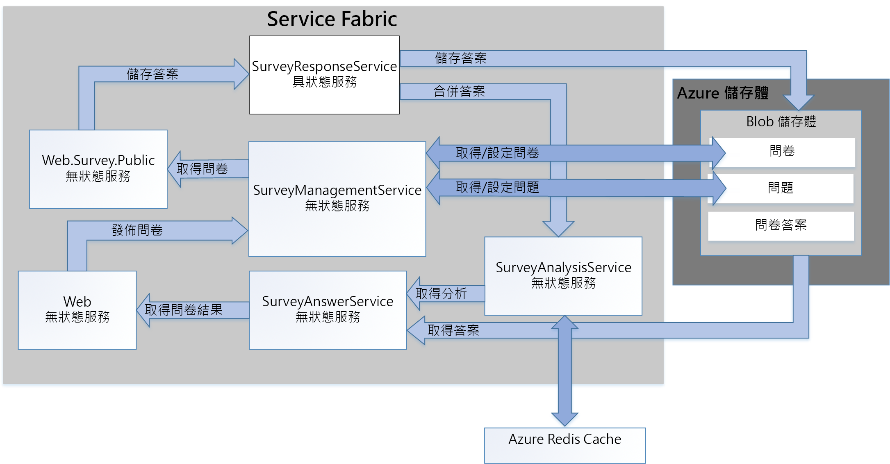

# <a name="refactor-an-azure-service-fabric-application-migrated-from-azure-cloud-services"></a>重構由 Azure 雲端服務移轉的 Azure Service Fabric 應用程式

[ 程式碼範例][sample-code]

本文說明將現有 Azure Service Fabric 應用程式重構為更細微的架構。 本文著重在重構 Service Fabric 應用程式的設計、封裝、效能和部署考量。

## <a name="scenario"></a>案例

如先前的文章[將 Azure 雲端服務應用程式移轉至 Azure Service Fabric][migrate-from-cloud-services] 中所討論的，模式和實務小組在 2012 年撰寫的書籍中，記載了在 Azure 中設計和實作雲端服務應用程式的程序。 該書籍描述名為 Tailspin 的虛構公司，想要建立名為 **Surveys** 的雲端服務應用程式。 Surveys 應用程式可以讓使用者建立及發行問卷，讓大眾回答。 下圖顯示此版本 Surveys 應用程式的架構：


**Tailspin.Web** Web 角色可裝載 ASP.NET MVC 網站，供 Tailspin 客戶用來：
* 註冊 Surveys 應用程式，
* 建立或刪除單一問卷，
* 檢視單一問卷的結果，
* 要求將該問卷結果匯出到 SQL，以及
* 檢視彙總的問卷結果和分析。

**Tailspin.Web.Survey.Public** Web 角色也可以裝載 ASP.NET MVC 網站，讓大眾造訪以填寫問卷。 這些回應會放在要儲存的佇列中。

**Tailspin.Workers.Survey** 背景工作角色會從多個佇列中挑選要求來執行幕後處理。

然後模式和實務小組會建立新專案，以將這個應用程式移轉到 Azure Service Fabric。 此專案的目標是只進行必要的程式碼變更，讓應用程式在 Azure Service Fabric 叢集中執行。 如此一來，原始的 Web 角色和背景工作角色就不會分解成更細微的架構。 產生的架構與應用程式的雲端服務版本非常類似：


**Tailspin.Web** 服務是從原始的 Tailspin.Web Web 角色移轉。

**Tailspin.Web.Survey.Public** 服務是從原始的 Tailspin.Web.Survey.Public Web 角色移轉。

**Tailspin.AnswerAnalysisService** 服務是從原始的 Tailspin.Workers.Survey 背景工作角色移轉。

> [!NOTE] 
> 對每個 Web 角色和背景工作角色進行最少的程式碼變更時，**Tailspin.Web** 和 **Tailspin.Web.Survey.Public** 會修改以自我裝載 [Kestrel] 網頁伺服器。 舊版的 Surveys 應用程式是 ASP.Net 應用程式，它是使用 Internet Information Services (IIS) 所裝載的，但是無法在 Service Fabric 中執行 IIS 作為服務。 因此，任何網頁伺服器必須能夠自我裝載，例如 [Kestrel]。 在某些情況下可能可以在 Service Fabric 於容器中執行 IIS。 如需詳細資訊，請參閱[使用容器的案例][container-scenarios]。  

現在，Tailspin 將 Surveys 應用程式重構成更細微的架構。 Tailspin 重構的動機是讓開發、建置及部署 Surveys 應用程式更加容易。 透過將現有 Web 角色和背景工作角色分解成更細微的架構，Tailspin 想要移除這些角色之間現有的緊密結合通訊和資料相依性。

Tailspin 看見了將 Surveys 應用程式重構成更細微的架構之其他優點：
* 每個服務可以封裝到獨立專案，其範圍小到足以由小型小組來管理。
* 每個服務都可以獨立設定版本和部署。
* 每個服務可以使用該服務的最佳技術來實作。 例如，Service Fabric 叢集可以包含使用不同版本的 .Net Frameworks、Java 或其他語言 (例如 C 或 C++) 建置之服務。
* 每個服務可以獨立地調整以回應負載的增加和減少。

> [!NOTE] 
> 多組織用戶管理超出此應用程式的重構範圍。 Tailspin 有數個選項可以支援多組織用戶管理，且稍後可以進行這些設計決策而不會影響最初的設計。 例如，Tailspin 可以為叢集內的每個租用戶建立服務的個別執行個體，或者為每個租用戶建立個別的叢集。

## <a name="design-considerations"></a>設計考量
 
下圖顯示重構成更細微架構之 Surveys 應用程式的架構：



**Tailspin.Web** 是自我裝載 ASP.NET MVC 應用程式的無狀態服務，Tailspin 客戶會造訪以建立問卷，並檢視問卷結果。 此服務會與來自移轉 Service Fabric 應用程式的 Tailspin.Web 服務共用它的大部分程式碼。 如先前所述，此服務會使用 ASP.NET Core，並且從使用 Kestrel 作為 Web 前端切換成實作 WebListener。

**Tailspin.Web.Surveys.Public** 是無狀態服務，也會自我裝載 ASP.NET MVC 網站。 使用者會造訪這個網站以從清單中選取問卷，然後填寫。此服務會與來自移轉 Service Fabric 應用程式的 Tailspin.Web.Survey.Public 服務共用它的大部分程式碼。 此服務會使用 ASP.NET Core，也會從使用 Kestrel 作為 Web 前端切換成實作 WebListener。

**Tailspin.SurveyResponseService** 是具狀態服務，它會將問卷答案儲存在 Azure Blob 儲存體中。 它也會將答案合併成問卷分析資料。 服務會實作為具狀態服務，因為它使用 [ReliableConcurrentQueue][reliable-concurrent-queue] 來批次處理問卷答案。 這項功能原本是在移轉的 Service Fabric 應用程式之 *Tailspin.AnswerAnalysisService* 服務中實作。

**Tailspin.SurveyManagementService** 是無狀態服務，它會儲存及擷取問卷和問卷問題。 服務會使用 Azure Blob 儲存體。 這項功能原本也是在移轉的 Service Fabric 應用程式之 *Tailspin.Web* 和 *Tailspin.Web.Survey.Public* 服務的資料存取元件中實作。 Tailspin 將原始功能重構成此服務，讓它可以獨立調整。

**Tailspin.SurveyAnswerService** 是無狀態服務，它會擷取問卷答案和問卷分析。 服務也會使用 Azure Blob 儲存體。 這項功能原本也是在移轉的 Service Fabric 應用程式之 *Tailspin.Web* 服務的資料存取元件中實作。 Tailspin 將原始功能重構成此服務，因為它預期負載較少，並且會使用較少的執行個體以節省資源。

**Tailspin.SurveyAnalysisService** 是無狀態服務，它會將問卷答案摘要資料保存在 Redis 快取以進行快速擷取。 此服務是由 Tailspin.SurveyResponseService 在每次回答問卷時及新問卷答案資料合併到摘要資料中時呼叫。 此服務包含原本是在移轉的 Service Fabric 應用程式之 *Tailspin.AnswerAnalysisService* 服務中實作的功能。

## <a name="stateless-versus-stateful-services"></a>無狀態服務和具狀態服務

Azure Service Fabric 支援下列程式設計模型：
* 客體可執行檔模型可讓任何可執行檔封裝為服務，並部署到 Service Fabric 叢集。 Service Fabric 會協調和管理客體可執行檔的執行。
* 容器模型可讓服務在容器映像中部署。 Service Fabric 支援在 Linux 核心容器以及 Windows Server 容器上方建立及管理容器。 
* 可靠的服務程式設計模型可以建立無狀態服務或具狀態服務，這些服務會與所有 Service Fabric 平台功能整合。 具狀態服務可讓複寫狀態儲存在 Service Fabric 叢集。 無狀態服務就沒有辦法。
* 可靠的動作項目程式設計模型可以建立服務，這些服務會實作虛擬動作項目模式。

Surveys 應用程式中的所有服務都是可靠的無狀態服務，除了 Tailspin.SurveyResponseService 服務。 此服務會實作 [ReliableConcurrentQueue][reliable-concurrent-queue] 以在收到問卷答案時進行處理。 ReliableConcurrentQueue 中的回應會儲存到 Azure Blob 儲存體，並且傳遞給 Tailspin.SurveyAnalysisService 進行分析。 Tailspin 會選擇 ReliableConcurrentQueue，因為回應不需要由佇列 (例如 Azure 服務匯流排) 提供的嚴格先進先出 (FIFO) 順序。 ReliableConcurrentQueue 也設計為針對佇列和清除佇列作業提供高輸送量和低延遲。

請注意，保存來自 ReliableConcurrentQueue 之清除佇列項目的作業在理想情況下應該具有等冪性。 如果在處理來自佇列之項目的期間擲回例外狀況，可能是處理相同的項目超過一次。 在 Surveys 應用程式中，將問卷答案合併至 Tailspin.SurveyAnalysisService 的作業不是等冪，因為 Tailspin 決定問卷分析資料只是分析資料目前的快照集，不需要一致。 儲存到 Azure Blob 儲存體中的問卷答案最終保持一致，因此問卷最終分析一定可以從這項資料正確重新計算。

## <a name="communication-framework"></a>通訊架構

Surveys 應用程式中的每個服務都使用 RESTful Web API 來進行通訊。 RESTful API 提供下列優點：
* 使用方便：每個服務都是使用 ASP.Net Core MVC 所建置，且原生支援 Web API 的建立。
* 安全性：所有服務都不需要 SSL，但是 Tailspin 可以要求每個服務這樣做。 
* 版本設定：用戶端可以根據特定版本的 Web API 撰寫及測試。

Survey 應用程式中的服務會使用由 Service Fabric 實作的[反向 Proxy][reverse-proxy]。 反向 Proxy 是一項服務，它會在 Service Fabric 的每個節點上執行，並且提供端點解析、自動重試及處理其他類型的連線失敗。 若要使用反向 Proxy，對於特定服務之每個 RESTful API 呼叫是使用預先定義的反向 Proxy 連接埠來進行。  例如，如果反向 Proxy 連接埠已設定為 **19081**，對於 Tailspin.SurveyAnswerService 的呼叫可以進行如下：

```csharp
static SurveyAnswerService()
{
    httpClient = new HttpClient
    {
        BaseAddress = new Uri("http://localhost:19081/Tailspin/SurveyAnswerService/")
    };
}
```
若要啟用反向 Proxy，請於 Service Fabric 叢集建立期間指定反向 Proxy 連接埠。 如需詳細資訊，請參閱 Azure Service Fabric 中的[反向 Proxy][reverse-proxy]。

## <a name="performance-considerations"></a>效能考量

Tailspin 會使用 Visual Studio 範本，為 Tailspin.Web 和 Tailspin.Web.Surveys.Public 建立 ASP.NET Core 服務。 根據預設，這些範本包含主控台的記錄。 主控台的記錄可能是在開發和偵錯期間完成，但是主控台的所有記錄應該在應用程式部署到生產環境時移除。

> [!NOTE]
> 如需有關針對在生產環境中執行之 Service Fabric 應用程式設定監視和診斷的詳細資訊，請參閱適用於 Azure Service Fabric 的[監視和診斷][monitoring-diagnostics]。

例如，針對每個 Web 前端服務之 startup.cs 中的下列行應該註解化：

```csharp
// This method gets called by the runtime. Use this method to configure the HTTP request pipeline.
public void Configure(IApplicationBuilder app, IHostingEnvironment env, ILoggerFactory loggerFactory)
{
    //loggerFactory.AddConsole(Configuration.GetSection("Logging"));
    //loggerFactory.AddDebug();

    app.UseMvc();
}
```

> [!NOTE]
> 發行時當 Visual Studio 設定為「發行」，可以有條件地排除這些行。

最後，當 Tailspin 將 Tailspin 應用程式部署到生產環境時，它們會將 Visual Studio 切換成**發行**模式。

## <a name="deployment-considerations"></a>部署考量

重構的 Surveys 應用程式是由 5 個無狀態服務和 1 個具狀態服務所組成，因此叢集規劃受限為決定正確的 VM 大小和節點數目。 在說明叢集的 applicationmanifest.xml 檔案中，Tailspin 為每個服務將 StatelessService 標記的 InstanceCount 屬性設為 -1。 值 -1 會指示 Service Fabric 在叢集的每個節點上建立服務的執行個體。

> [!NOTE]
> 具狀態服務需要為其資料規劃正確資料分割和複本數目的額外步驟。

Tailspin 使用 Azure 入口網站來部署叢集。 Service Fabric 叢集資源類型會部署所有必要的基礎結構，包括 VM 擴展集和負載平衡器。 建議的 VM 大小會在針對 Service Fabric 叢集佈建程序期間顯示於 Azure 入口網站中。 請注意，因為 VM 是部署在 VM 擴展集中，它們可以隨著使用者負載增加而相應增加和相應放大。

> [!NOTE]
> 如同先前的討論，在移轉版本的 Surveys 應用程式中，兩個 Web 前端是使用 ASP.Net Core 和 Kestrel 自我裝載為網頁伺服器。 雖然移轉的 Survey 應用程式未使用反向 Proxy，但是強烈建議使用反向 Proxy，例如 IIS、Nginx 或 Apache。 如需詳細資訊，請參閱 [ASP.NET Core 中的 Kestrel 網頁伺服器實作簡介][kestrel-intro]。
> 在重構的 Surveys 應用程式中，兩個 Web 前端會使用 ASP.Net Core 與[WebListener][weblistener] 自我裝載為網頁伺服器，因此不需要反向 Proxy。

## <a name="next-steps"></a>後續步驟

Surveys 應用程式的程式碼可於 [GitHub][sample-code] 取得。

如果您剛開始使用 [Azure Service Fabric][service-fabric]，請先設定開發環境，然後下載最新的 [Azure SDK][azure-sdk] 和 [Azure Service Fabric SDK][service-fabric-sdk]。 SDK 包含 OneBox 叢集管理員，因此您可以使用完整的 F5 偵錯在本機部署及測試 Surveys 應用程式。

<!-- links -->
[azure-sdk]: https://azure.microsoft.com/downloads/archive-net-downloads/
[container-scenarios]: /azure/service-fabric/service-fabric-containers-overview
[kestrel]: https://docs.microsoft.com/aspnet/core/fundamentals/servers/kestrel?tabs=aspnetcore2x
[kestrel-intro]: https://docs.microsoft.com/aspnet/core/fundamentals/servers/kestrel?tabs=aspnetcore1x
[migrate-from-cloud-services]: migrate-from-cloud-services.md
[monitoring-diagnostics]: /azure/service-fabric/service-fabric-diagnostics-overview
[reliable-concurrent-queue]: /azure/service-fabric/service-fabric-reliable-services-reliable-concurrent-queue
[reverse-proxy]: /azure/service-fabric/service-fabric-reverseproxy
[sample-code]: https://github.com/mspnp/cloud-services-to-service-fabric/tree/master/servicefabric-phase-2
[service-fabric]: /azure/service-fabric/service-fabric-get-started
[service-fabric-sdk]: /azure/service-fabric/service-fabric-get-started
[weblistener]: https://docs.microsoft.com/aspnet/core/fundamentals/servers/weblistener
