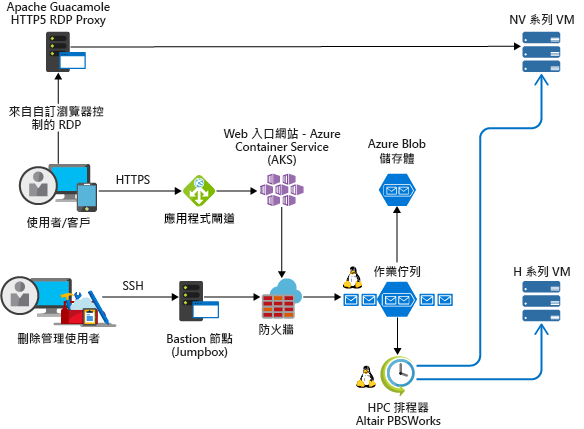

<!-- markdownlint-disable MD033 -->
<!-- markdownlint-disable MD026 -->

# Azure 上的高效能運算 (HPC)High Performance Computing (HPC) on Azure

## HPC 簡介Introduction to HPC

<!-- markdownlint-disable MD034 -->

> [!VIDEO https://www.youtube.com/embed/rKURT32faJk]

<!-- markdownlint-enable MD034 -->

高效能運算 (HPC) (也稱為「巨量計算」) 會使用大量 CPU 或 GPU 型電腦來解決複雜的數學工作。High Performance Computing (HPC), also called "Big Compute", uses a large number of CPU or GPU-based computers to solve complex mathematical tasks.

許多產業都使用 HPC 來解決一些最困難的問題。Many industries use HPC to solve some of their most difficult problems.  這些產業包括下列工作負載：These include workloads such as:

- GenomicsGenomics
- 石油與天然氣模擬Oil and gas simulations
- 財務Finance
- 半導體設計Semiconductor design
- EngineeringEngineering
- 天氣模型Weather modeling

### HPC 在雲端上有何不同？How is HPC different on the cloud?

內部部署 HPC 系統與雲端中 HPC 系統之間的其中一項主要差異，就是依照需求動態新增及移除資源的能力。One of the primary differences between an on-premise HPC system and one in the cloud is the ability for resources to dynamically be added and removed as they're needed.  動態調整會因為瓶頸而移除計算功能，改而讓客戶能夠針對其作業需求適度調整其基礎結構的大小。Dynamic scaling removes compute capacity as a bottleneck and instead allow customers to right size their infrastructure for the requirements of their jobs.

下列文章提供此動態調整功能的詳細說明。The following articles provide more detail about this dynamic scaling capability.

- [大量計算架構樣式Big Compute Architecture Style](/azure/architecture/guide/architecture-styles/big-compute?context=/azure/architecture/topics/high-performance-computing/context/hpc-context)
- [自動調整最佳做法Autoscaling best practices](/azure/architecture/best-practices/auto-scaling?context=/azure/architecture/topics/high-performance-computing/context/hpc-context)

## 實作檢查清單Implementation checklist

當您想要在 Azure 上實作自己的 HPC 解決方案時，請確定您已檢閱下列主題：As you're looking to implement your own HPC solution on Azure, ensure you're reviewed the following topics:

<!-- markdownlint-disable MD032 -->

> [!div class="checklist"]
> - 根據您的需求選擇適當的[架構](#infrastructure)Choose the appropriate [architecture](#infrastructure) based on your requirements
> - 知道哪個[計算](#compute)選項適合您的工作負載Know which [compute](#compute) options is right for your workload
> - 找出符合您需求的合適[儲存體](#storage)解決方案Identify the right [storage](#storage) solution that meets your needs
> - 決定您要如何[管理](#management)您所有的資源Decide how you're going to [manage](#management) all your resources
> - 針對雲端將您的[應用程式](#hpc-applications)最佳化Optimize your [application](#hpc-applications) for the cloud
> - [保護](#security)您的基礎結構[Secure](#security) your Infrastructure

<!-- markdownlint-enable MD032 -->

## 基礎結構Infrastructure

建置 HPC 系統時需要許多基礎結構元件。There are a number of infrastructure components necessary to build an HPC system.  不論您選擇如何管理您的 HPC 工作負載，計算、儲存體和網路都會提供基礎元件。Compute, Storage, and Networking provide the underlying components, no matter how you choose to manage your HPC workloads.

### 範例 HPC 架構Example HPC architectures

有幾個不同的方式可在 Azure 上設計及實作您的 HPC 架構。There are a number of different ways to design and implement your HPC architecture on Azure.  HPC 應用程式可擴展成上千個計算核心，以擴充內部部署叢集或以 100% 雲端原生解決方案的方式執行。HPC applications can scale to thousands of compute cores, extend on-premises clusters, or run as a 100% cloud native solution.

下列案例概述幾個常見的 HPC 解決方案建置方式。The following scenarios outline a few of the common ways HPC solutions are built.

<ul class="columns is-multiline has-margin-left-none has-margin-bottom-none has-padding-top-medium">
    <li class="column is-one-third has-padding-top-small-mobile has-padding-bottom-small">
        <a class="is-undecorated is-full-height is-block"
            href="/azure/architecture/example-scenario/apps/hpc-saas?context=/azure/architecture/topics/high-performance-computing/context/hpc-context">
            <article class="card has-outline-hover is-relative is-fullheight">
                    <figure class="image has-margin-right-none has-margin-left-none has-margin-top-none has-margin-bottom-none">
                        
                    </figure>
                

                    

                        <h3 class="is-size-4 has-margin-top-none has-margin-bottom-none has-text-primary">Azure 上的電腦輔助工程服務Computer-aided engineering services on Azure</h3>
                    

                    

                        
為 Azure 上的電腦輔助工程 (CAE) 提供軟體即服務 (SaaS) 平台。Provide a software-as-a-service (SaaS) platform for computer-aided engineering (CAE) on Azure.

                    

                

            </article>
        </a>
    </li>
    <li class="column is-one-third has-padding-top-small-mobile has-padding-bottom-small">
        <a class="is-undecorated is-full-height is-block"
            href="/azure/architecture/example-scenario/infrastructure/hpc-cfd?context=/azure/architecture/topics/high-performance-computing/context/hpc-context">
            <article class="card has-outline-hover is-relative is-fullheight">
                    <figure class="image has-margin-right-none has-margin-left-none has-margin-top-none has-margin-bottom-none">
                        
                    </figure>
                

                    

                        <h3 class="is-size-4 has-margin-top-none has-margin-bottom-none has-text-primary">Azure 上的計算流體力學 (CFD) 模擬Computational fluid dynamics (CFD) simulations on Azure</h3>
                    

                    

                        
在 Azure 上執行計算流體力學 (CFD) 模擬。Execute computational fluid dynamics (CFD) simulations on Azure.

                    

                

            </article>
        </a>
    </li>
    <li class="column is-one-third has-padding-top-small-mobile has-padding-bottom-small">
        <a class="is-undecorated is-full-height is-block"
            href="/azure/architecture/example-scenario/infrastructure/video-rendering?context=/azure/architecture/topics/high-performance-computing/context/hpc-context">
            <article class="card has-outline-hover is-relative is-fullheight">
                    <figure class="image has-margin-right-none has-margin-left-none has-margin-top-none has-margin-bottom-none">
                        
                    </figure>
                

                    

                        <h3 class="is-size-4 has-margin-top-none has-margin-bottom-none has-text-primary">Azure 上的 3D 影片轉譯3D video rendering on Azure</h3>
                    

                    

                        
使用 Azure Batch 服務在 Azure 中執行原生 HPC 工作負載Run native HPC workloads in Azure using the Azure Batch service

                    

                

            </article>
        </a>
    </li>
</ul>

### 計算Compute

Azure 提供針對 CPU 和 GPU 密集型工作負載最佳化的各種大小。Azure offers a range of sizes that are optimized for both CPU & GPU intensive workloads.

#### CPU 型虛擬機器CPU-based virtual machines

- [Linux VMLinux VMs](/azure/virtual-machines/linux/sizes-hpc?context=/azure/architecture/topics/high-performance-computing/context/hpc-context)
- [Windows VM](/azure/virtual-machines/windows/sizes-hpc?context=/azure/architecture/topics/high-performance-computing/context/hpc-context) 的 VM[Windows VM's](/azure/virtual-machines/windows/sizes-hpc?context=/azure/architecture/topics/high-performance-computing/context/hpc-context) VMs
  
#### 已啟用 GPU 的虛擬機器GPU-enabled virtual machines

N 系列 VM 功能 NVIDIA GPU 是專為需要大量運算或需要大量圖形的應用程式所設計，包括人工地智慧 (AI) 學習和視覺效果。N-series VMs feature NVIDIA GPUs designed for compute-intensive or graphics-intensive applications including artificial intelligence (AI) learning and visualization.

- [Linux VMLinux VMs](/azure/virtual-machines/linux/sizes-gpu?context=/azure/architecture/topics/high-performance-computing/context/hpc-context)
- [Windows VMWindows VMs](/azure/virtual-machines/windows/sizes-gpu?context=/azure/architecture/topics/high-performance-computing/context/hpc-context)

### 儲存體Storage

大規模 Batch 和 HPC 工作負載所需要的資料儲存和存取會超過傳統雲端檔案系統的容量。Large-scale Batch and HPC workloads have demands for data storage and access that exceed the capabilities of traditional cloud file systems.  有數個解決方案可管理 Azure 上 HPC 應用程式的速度和容量需求There are a number of solutions to manage both the speed and capacity needs of HPC applications on Azure

- [Avere vFXT](https://azure.microsoft.com/services/storage/avere-vfxt/) 可供更快速、更容易取得資料儲存體，以在邊緣執行高效能運算[Avere vFXT](https://azure.microsoft.com/services/storage/avere-vfxt/) for faster, more accessible data storage for high-performance computing at the edge
- [BeeGFSBeeGFS](https://azure.microsoft.com/resources/implement-glusterfs-on-azure/)
- [儲存體最佳化的虛擬機器Storage Optimized Virtual Machines](/azure/virtual-machines/windows/sizes-storage?context=/azure/architecture/topics/high-performance-computing/context/hpc-context)
- [Blob、資料表和佇列儲存體Blob, table, and queue storage](/azure/storage/storage-introduction?context=/azure/architecture/topics/high-performance-computing/context/hpc-context)
- [Azure SMB 檔案儲存體Azure SMB File storage](/azure/storage/files/storage-files-introduction?context=/azure/architecture/topics/high-performance-computing/context/hpc-context)
- [Intel Cloud Edition LustreIntel Cloud Edition Lustre](https://azuremarketplace.microsoft.com/marketplace/apps/intel.intel-cloud-edition-gs)

如需比較 Azure 上 Lustre、GlusterFS 和 BeeGFS 的詳細資訊，請檢閱 [Azure 電子書上的平行檔案系統](https://blogs.msdn.microsoft.com/azurecat/2018/06/11/azurecat-ebook-parallel-virtual-file-systems-on-microsoft-azure/)For more information comparing Lustre, GlusterFS, and BeeGFS on Azure, review the [Parallel Files Systems on Azure eBook](https://blogs.msdn.microsoft.com/azurecat/2018/06/11/azurecat-ebook-parallel-virtual-file-systems-on-microsoft-azure/)

### 網路功能Networking

H16r、H16mr、A8 和 A9 VM 可以連線到高輸送量後端 RDMA 網路。H16r, H16mr, A8, and A9 VMs can connect to a high throughput back-end RDMA network. 此網路可以改善 Microsoft MPI 或 Intel MPI 下執行的緊密結合平行應用程式效能。This network can improve the performance of tightly coupled parallel applications running under Microsoft MPI or Intel MPI.

- [支援 RDMA 的執行個體RDMA Capable Instances](/azure/virtual-machines/windows/sizes-hpc?context=/azure/architecture/topics/high-performance-computing/context/hpc-context#rdma-capable-instances)
- [虛擬網路Virtual Network](/azure/virtual-network/virtual-networks-overview?context=/azure/architecture/topics/high-performance-computing/context/hpc-context)
- [ExpressRouteExpressRoute](/azure/expressroute/expressroute-introduction?context=/azure/architecture/topics/high-performance-computing/context/hpc-context)

## 管理性Management

### 自己動手做Do-it-yourself

在 Azure 上從頭開始建置 HPC 系統隨可提供大量彈性，但通常需要密集維護。Building an HPC system from scratch on Azure offers a significant amount of flexibility, but is often very maintenance intensive.  

1. 在 Azure 虛擬機器或[虛擬機器擴展集](/azure/virtual-machine-scale-sets/overview?context=/azure/architecture/topics/high-performance-computing/context/hpc-context)中設定自己的叢集環境。Set up your own cluster environment in Azure virtual machines or [virtual machine scale sets](/azure/virtual-machine-scale-sets/overview?context=/azure/architecture/topics/high-performance-computing/context/hpc-context).
2. 使用 Azure Resource Manager 範本來部署前置[工作負載管理員](#workload-managers)基礎結構和[應用程式](#hpc-applications)。Use Azure Resource Manager templates to deploy leading [workload managers](#workload-managers), infrastructure, and [applications](#hpc-applications).
3. 選擇 HPC 和 GPU [VM 大小](#compute)，包括 MPI 或 GPU 工作負載的特製化硬體和網路連線。Choose HPC and GPU [VM sizes](#compute) that include specialized hardware and network connections for MPI or GPU workloads.
4. 為 I/O 密集的工作負載新增[高效能儲存體](#storage)。Add [high performance storage](#storage) for I/O-intensive workloads.

### 混合式和雲端負載平衡Hybrid and cloud Bursting

如果您有想要連線到 Azure 的現有內部部署 HPC 系統，則有許多資源可協助您上手。If you have an existing on-premise HPC system that you'd like to connect to Azure, there are a number of resources to help get you started.

首先，檢閱文件中的[將內部部署網路連線到 Azure 的選項](/azure/architecture/reference-architectures/hybrid-networking/?context=/azure/architecture/topics/high-performance-computing/context/hpc-context)一文。First, review the [Options for connecting an on-premises network to Azure](/azure/architecture/reference-architectures/hybrid-networking/?context=/azure/architecture/topics/high-performance-computing/context/hpc-context) article in the documentation.  從那裡，您可以取得這些連線選項的資訊：From there, you may want information on these connectivity options:

<ul class="columns is-multiline has-margin-left-none has-margin-bottom-none has-padding-top-medium">
    <li class="column is-one-third has-padding-top-small-mobile has-padding-bottom-small">
        <a class="is-undecorated is-full-height is-block"
            href="/azure/architecture/reference-architectures/hybrid-networking/vpn?context=/azure/architecture/topics/high-performance-computing/context/hpc-context">
            <article class="card has-outline-hover is-relative is-fullheight">
                    <figure class="image has-margin-right-none has-margin-left-none has-margin-top-none has-margin-bottom-none">
                        
                    </figure>
                

                    

                        <h3 class="is-size-4 has-margin-top-none has-margin-bottom-none has-text-primary">使用 VPN 閘道將內部部署網路連線至 AzureConnect an on-premises network to Azure using a VPN gateway</h3>
                    

                    

                        
此參考架構會示範如何使用網站對網站虛擬私人網路 (VPN)，將內部部署網路擴充至 Azure。This reference architecture shows how to extend an on-premises network to Azure, using a site-to-site virtual private network (VPN).

                    

                

            </article>
        </a>
    </li>
    <li class="column is-one-third has-padding-top-small-mobile has-padding-bottom-small">
        <a class="is-undecorated is-full-height is-block"
            href="/azure/architecture/reference-architectures/hybrid-networking/expressroute?context=/azure/architecture/topics/high-performance-computing/context/hpc-context">
            <article class="card has-outline-hover is-relative is-fullheight">
                    <figure class="image has-margin-right-none has-margin-left-none has-margin-top-none has-margin-bottom-none">
                        
                    </figure>
                

                    

                        <h3 class="is-size-4 has-margin-top-none has-margin-bottom-none has-text-primary">使用 ExpressRoute 將內部部署網路連線至 AzureConnect an on-premises network to Azure using ExpressRoute</h3>
                    

                    

                        
ExpressRoute 連線會透過第三方連線提供者，使用私人的專用連線。ExpressRoute connections use a private, dedicated connection through a third-party connectivity provider. 私人連線會將內部部署網路延伸到 Azure。The private connection extends your on-premises network into Azure.

                    

                

            </article>
        </a>
    </li>
    <li class="column is-one-third has-padding-top-small-mobile has-padding-bottom-small">
        <a class="is-undecorated is-full-height is-block"
            href="/azure/architecture/reference-architectures/hybrid-networking/expressroute-vpn-failover?context=/azure/architecture/topics/high-performance-computing/context/hpc-context">
            <article class="card has-outline-hover is-relative is-fullheight">
                    <figure class="image has-margin-right-none has-margin-left-none has-margin-top-none has-margin-bottom-none">
                        
                    </figure>
                

                    

                        <h3 class="is-size-4 has-margin-top-none has-margin-bottom-none has-text-primary">使用 ExpressRoute 搭配 VPN 容錯移轉，將內部部署網路連線至 AzureConnect an on-premises network to Azure using ExpressRoute with VPN failover</h3>
                    

                    

                        
跨越使用 ExpressRoute 搭配 VPN 閘道容錯移轉連線的 Azure 虛擬網路與內部部署網路，實作可用性高且安全的站對站網路架構。Implement a highly available and secure site-to-site network architecture that spans an Azure virtual network and an on-premises network connected using ExpressRoute with VPN gateway failover.

                    

                

            </article>
        </a>
    </li>
</ul>

安全地建立網路連線後，您即可透過現有[工作負載管理員](#workload-managers)的負載平衡功能，開始隨選使用雲端計算資源。Once network connectivity is securely established, you can start using cloud compute resources on-demand with the bursting capabilities of your existing [workload manager](#workload-managers).

### Marketplace 解決方案Marketplace solutions

[Azure Marketplace](https://azuremarketplace.microsoft.com/marketplace/) 中提供許多工作負載管理員。There are a number of workload managers offered in the [Azure Marketplace](https://azuremarketplace.microsoft.com/marketplace/).

- [RogueWave CentOS 型 HPCRogueWave CentOS-based HPC](https://azuremarketplace.microsoft.com/marketplace/apps/RogueWave.CentOSbased73HPC?tab=Overview)
- [適用於 HPC 的 SUSE Linux Enterprise ServerSUSE Linux Enterprise Server for HPC](https://azure.microsoft.com/marketplace/partners/suse/suselinuxenterpriseserver12optimizedforhighperformancecompute/)
- [TIBCO Grid Server EngineTIBCO Grid Server Engine](https://azuremarketplace.microsoft.com/marketplace/apps/tibco-software.gridserverlinuxengine?tab=Overview)
- [適用於 Windows 和 Linux 的 Azure 資料科學 VMAzure Data Science VM for Windows and Linux](/azure/machine-learning/data-science-virtual-machine/overview?context=/azure/architecture/topics/high-performance-computing/context/hpc-context)
- [D3ViewD3View](https://azuremarketplace.microsoft.com/marketplace/apps/xfinityinc.d3view-v5?tab=Overview)
- [UberCloudUberCloud](https://azure.microsoft.com/search/marketplace/?q=ubercloud)

### Azure BatchAzure Batch

[Azure Batch](/azure/batch/batch-technical-overview?context=/azure/architecture/topics/high-performance-computing/context/hpc-context) 是一項平台服務，可用於在雲端有效地執行大規模的平行和高效能運算 (HPC) 應用程式。[Azure Batch](/azure/batch/batch-technical-overview?context=/azure/architecture/topics/high-performance-computing/context/hpc-context) is a platform service for running large-scale parallel and high-performance computing (HPC) applications efficiently in the cloud. Azure Batch 可排程要在受控集區虛擬機器上執行的需要大量運算工作，而且可以調整運算資源以符合工作的需求。Azure Batch schedules compute-intensive work to run on a managed pool of virtual machines, and can automatically scale compute resources to meet the needs of your jobs.

SaaS 提供者或開發人員可使用 Batch SDK 和工具，將 HPC 應用程式或容器工作負載與 Azure 進行整合、將資料暫存至 Azure，並建置作業執行管線。SaaS providers or developers can use the Batch SDKs and tools to integrate HPC applications or container workloads with Azure, stage data to Azure, and build job execution pipelines.

### Azure CycleCloudAzure CycleCloud

[Azure CycleCloud](/azure/cyclecloud/?context=/azure/architecture/topics/high-performance-computing/context/hpc-context) 在 Azure 上使用任何作業排程器 (如 Slurm、Grid Engine、HPC Pack、HTCondor、LSF、PBS Pro 或 Symphony) 管理 HPC 工作負載的最簡單方法[Azure CycleCloud](/azure/cyclecloud/?context=/azure/architecture/topics/high-performance-computing/context/hpc-context) Provides the simplest way to manage HPC workloads using any scheduler (like Slurm, Grid Engine, HPC Pack, HTCondor, LSF, PBS Pro, or Symphony), on Azure

CycleCloud 可讓您：CycleCloud allows you to:

- 部署完整叢集和其他資源，包括排程器、計算 VM、儲存體、網路和快取Deploy full clusters and other resources, including scheduler, compute VMs, storage, networking, and cache
- 協調作業、資料和雲端工作流程Orchestrate job, data, and cloud workflows
- 讓管理員能完全控制哪些使用者可執行作業，以及執行位置和成本Give admins full control over which users can run jobs, as well as where and at what cost
- 透過進階原則和治理功能 (包括成本控制、Active Directory 整合、監視和報告) 自訂叢集並予以最佳化Customize and optimize clusters through advanced policy and governance features, including cost controls, Active Directory integration, monitoring, and reporting
- 使用目前的作業排程器和應用程式，並無需修改Use your current job scheduler and applications without modification
- 針對各種 HPC 工作負載和產業，利用內建自動調整和經過測試的參考架構Take advantage of built-in autoscaling and battle-tested reference architectures for a wide range of HPC workloads and industries

### 工作負載管理員Workload managers

下列是可以在 Azure 基礎結構中執行的叢集和工作負載管理員範例。The following are examples of cluster and workload managers that can run in Azure infrastructure. 在 Azure VM 中建立獨立叢集，或從內部部署叢集高載至 Azure VM。Create stand-alone clusters in Azure VMs or burst to Azure VMs from an on-premises cluster.

- [Alces Flight ComputeAlces Flight Compute](https://azuremarketplace.microsoft.com/marketplace/apps/alces-flight-limited.alces-flight-compute-solo?tab=Overview)
- [TIBCO DataSynapse GridServerTIBCO DataSynapse GridServer](https://azure.microsoft.com/blog/tibco-datasynapse-comes-to-the-azure-marketplace/)
- [Bright Cluster ManagerBright Cluster Manager](http://www.brightcomputing.com/technology-partners/microsoft)
- [IBM Spectrum Symphony 和 Symphony LSFIBM Spectrum Symphony and Symphony LSF](https://azure.microsoft.com/blog/ibm-and-microsoft-azure-support-spectrum-symphony-and-spectrum-lsf/)
- [PBS ProPBS Pro](http://pbspro.org)
- [AltairAltair](http://www.altair.com/)
- [RescaleRescale](https://www.rescale.com/azure/)
- [Microsoft HPC PackMicrosoft HPC Pack](https://technet.microsoft.com/library/mt744885.aspx)
  - [適用於 Windows 的 HPC 套件HPC Pack for Windows](/azure/virtual-machines/windows/hpcpack-cluster-options?context=/azure/architecture/topics/high-performance-computing/context/hpc-context)
  - [適用於 Linux 的 HPC 套件HPC Pack for Linux](/azure/virtual-machines/linux/hpcpack-cluster-options?context=/azure/architecture/topics/high-performance-computing/context/hpc-context)

#### 容器Containers

容器也可用來管理一些 HPC 工作負載。Containers can also be used to manage some HPC workloads.  Azure Kubernetes Service (AKS) 等服務可讓您輕鬆地在 Azure 中部署受控 Kubernetes 叢集。Services like the Azure Kubernetes Service (AKS) makes it simple to deploy a managed Kubernetes cluster in Azure.

- [Azure Kubernetes Service (AKS)Azure Kubernetes Service (AKS)](/azure/aks/intro-kubernetes?context=/azure/architecture/topics/high-performance-computing/context/hpc-context)
- [容器登錄Container Registry](/azure/container-registry/container-registry-intro?context=/azure/architecture/topics/high-performance-computing/context/hpc-context)

## 成本管理Cost management

您可以透過一些不同方法在 Azure 上管理您的 HPC 成本。Managing your HPC cost on Azure can be done through a few different ways.  確定您已檢閱 [Azure 購買選項](https://azure.microsoft.com/pricing/purchase-options/)，以尋找最適合貴組織的方法。Ensure you've reviewed the [Azure purchasing options](https://azure.microsoft.com/pricing/purchase-options/) to find the method that works best for your organization.

[低優先順序 VM](/azure/virtual-machine-scale-sets/virtual-machine-scale-sets-use-low-priority?context=/azure/architecture/topics/high-performance-computing/context/hpc-context) 可讓您以大幅降低的成本使用我們未運用的容量。[Low priority VMs](/azure/virtual-machine-scale-sets/virtual-machine-scale-sets-use-low-priority?context=/azure/architecture/topics/high-performance-computing/context/hpc-context) allow you to take advantage of our unutilized capacity at a significant cost savings.

## 安全性Security

如需 Azure 上的安全性最佳做法概觀，請檢閱 [Azure 安全性文件](/azure/security/azure-security?context=/azure/architecture/topics/high-performance-computing/context/hpc-context)。For an overview of security best practices on Azure, review the [Azure Security Documentation](/azure/security/azure-security?context=/azure/architecture/topics/high-performance-computing/context/hpc-context).  

除了[雲端負載平衡](#hybrid-and-cloud-bursting)區段中可用的網路組態，您可以實作中樞/輪輻組態，以隔離您的計算資源：In addition to the network configurations available in the [Cloud Bursting](#hybrid-and-cloud-bursting) section, you may want to implement a hub/spoke configuration to isolate your compute resources:

<ul class="columns is-multiline has-margin-left-none has-margin-bottom-none has-padding-top-medium">
    <li class="column is-one-third has-padding-top-small-mobile has-padding-bottom-small">
        <a class="is-undecorated is-full-height is-block"
            href="/azure/architecture/reference-architectures/hybrid-networking/hub-spoke?context=/azure/architecture/topics/high-performance-computing/context/hpc-context">
            <article class="card has-outline-hover is-relative is-fullheight">
                    <figure class="image has-margin-right-none has-margin-left-none has-margin-top-none has-margin-bottom-none">
                        
                    </figure>
                

                    

                        <h3 class="is-size-4 has-margin-top-none has-margin-bottom-none has-text-primary">在 Azure 中實作中樞輪輻網路拓撲Implement a hub-spoke network topology in Azure</h3>
                    

                    

                        
「中樞」是 Azure 中的虛擬網路 (VNet)，可當作內部部署網路的連線中心點。The hub is a virtual network (VNet) in Azure that acts as a central point of connectivity to your on-premises network. 輪輻是與中樞對等的 VNet，可用於隔離工作負載。The spokes are VNets that peer with the hub, and can be used to isolate workloads.

                    

                

            </article>
        </a>
    </li>
    <li class="column is-one-third has-padding-top-small-mobile has-padding-bottom-small">
        <a class="is-undecorated is-full-height is-block"
            href="/azure/architecture/reference-architectures/hybrid-networking/shared-services?context=/azure/architecture/topics/high-performance-computing/context/hpc-context">
            <article class="card has-outline-hover is-relative is-fullheight">
                    <figure class="image has-margin-right-none has-margin-left-none has-margin-top-none has-margin-bottom-none">
                        
                    </figure>
                

                    

                        <h3 class="is-size-4 has-margin-top-none has-margin-bottom-none has-text-primary">在 Azure 中實作中樞輪輻網路拓撲與共用服務Implement a hub-spoke network topology with shared services in Azure</h3>
                    

                    

                        
此參考架構是建置在中樞輪輻參考架構基礎上，以包含可以被所有輪輻取用之中樞中的共用服務。This reference architecture builds on the hub-spoke reference architecture to include shared services in the hub that can be consumed by all spokes.

                    

                

            </article>
        </a>
    </li>
</ul>

## HPC 應用程式HPC applications

在 Azure 中執行自訂或商業 HPC 應用程式。Run custom or commercial HPC applications in Azure. 本節中的數個範例會經過基準測試，以使用其他 VM 或運算核心有效地進行擴充。Several examples in this section are benchmarked to scale efficiently with additional VMs or compute cores. 請瀏覽 [Azure Marketplace](https://azuremarketplace.microsoft.com/marketplace) 以取得可立即部署的解決方案。Visit the [Azure Marketplace](https://azuremarketplace.microsoft.com/marketplace) for ready-to-deploy solutions.

> [!NOTE]
> 請向廠商確認任何商業應用程式在雲端中的執行授權或其他限制。Check with the vendor of any commercial application for licensing or other restrictions for running in the cloud. 並非所有廠商都提供隨用隨付授權。Not all vendors offer pay-as-you-go licensing. 您可能需要視您的解決方案，在雲端中授權伺服器，或連線至內部部署授權伺服器。You might need a licensing server in the cloud for your solution, or connect to an on-premises license server.

### 工程應用程式Engineering applications

- [Altair RADIOSSAltair RADIOSS](https://azure.microsoft.com/blog/availability-of-altair-radioss-rdma-on-microsoft-azure/)
- [ANSYS CFDANSYS CFD](https://azure.microsoft.com/blog/ansys-cfd-and-microsoft-azure-perform-the-best-hpc-scalability-in-the-cloud/)
- [MATLAB Distributed Computing ServerMATLAB Distributed Computing Server](/azure/virtual-machines/windows/matlab-mdcs-cluster?context=/azure/architecture/topics/high-performance-computing/context/hpc-context)
- [StarCCM+StarCCM+](https://blogs.msdn.microsoft.com/azurecat/2017/07/07/run-star-ccm-in-an-azure-hpc-cluster/)
- [OpenFOAMOpenFOAM](https://simulation.azure.com/casestudies/Team-182-ABB-UC-Final.pdf)

### 圖形和轉譯器Graphics and rendering

- Azure Batch 上的 [Autodesk Maya、3ds Max 和 Arnold](/azure/batch/batch-rendering-service?context=/azure/architecture/topics/high-performance-computing/context/hpc-context)[Autodesk Maya, 3ds Max, and Arnold](/azure/batch/batch-rendering-service?context=/azure/architecture/topics/high-performance-computing/context/hpc-context) on Azure Batch

### AI 和深入學習AI and deep learning

- [Microsoft 辨識工具組Microsoft Cognitive Toolkit](/cognitive-toolkit/cntk-on-azure)
- [深入學習 VMDeep Learning VM](https://azuremarketplace.microsoft.com/marketplace/apps/microsoft-ads.dsvm-deep-learning)
- [深入學習的 Batch Shipyard 訣竅Batch Shipyard recipes for deep learning](https://github.com/Azure/batch-shipyard/tree/master/recipes#deeplearning)

### MPI 提供者MPI Providers

- [Microsoft MPIMicrosoft MPI](/message-passing-interface/microsoft-mpi)

## 遠端視覺效果Remote visualization

<ul class="columns is-multiline has-margin-left-none has-margin-bottom-none has-padding-top-medium">
    <li class="column is-one-third has-padding-top-small-mobile has-padding-bottom-small">
        <a class="is-undecorated is-full-height is-block"
            href="/azure/architecture/example-scenario/infrastructure/linux-vdi-citrix?context=/azure/architecture/topics/high-performance-computing/context/hpc-context">
            <article class="card has-outline-hover is-relative is-fullheight">
                    <figure class="image has-margin-right-none has-margin-left-none has-margin-top-none has-margin-bottom-none">
                        
                    </figure>
                

                    

                        <h3 class="is-size-4 has-margin-top-none has-margin-bottom-none has-text-primary">使用 Citrix 的 Linux 虛擬桌面Linux virtual desktops with Citrix</h3>
                    

                    

                        
在 Azure 上使用 Citrix 建置適用於 Linux 桌面的 VDI 環境。Build a VDI environment for Linux Desktops using Citrix on Azure.

                    

                

            </article>
        </a>
    </li>
</ul>

## 效能評定Performance Benchmarks

- [計算評定Compute benchmarks](/azure/virtual-machines/windows/compute-benchmark-scores?context=/azure/architecture/topics/high-performance-computing/context/hpc-context)

## 客戶案例Customer stories

有許多客戶在使用 Azure 處理其 HPC 工作負載方面非常成功。There are a number of customers who have seen great success by using Azure for their HPC workloads.  您可以在底下找到這些客戶的一些案例研究：You can find a few of these customer case studies below:

- [ANEOANEO](https://customers.microsoft.com/story/it-provider-finds-highly-scalable-cloud-based-hpc-redu)
- [AXA Global P&CAXA Global P&C](https://customers.microsoft.com/story/axa-global-p-and-c)
- [AxiomaAxioma](https://customers.microsoft.com/story/axioma-delivers-fintechs-first-born-in-the-cloud-multi-asset-class-enterprise-risk-solution)
- [d3Viewd3View](https://customers.microsoft.com/story/big-data-solution-provider-adopts-new-cloud-gains-thou)
- [EFSEFS](https://customers.microsoft.com/story/efs-professionalservices-azure)
- [Hymans RobertsonHymans Robertson](https://customers.microsoft.com/story/hymans-robertson)
- [MetLifeMetLife](https://enterprise.microsoft.com/customer-story/industries/insurance/metlife/)
- [Microsoft ResearchMicrosoft Research](https://customers.microsoft.com/doclink/fast-lmm-and-windows-azure-put-genetics-research-on-fa)
- [明德精算顧問有限公司Milliman](https://customers.microsoft.com/story/actuarial-firm-works-to-transform-insurance-industry-w)
- [Mitsubishi UFJ Securities InternationalMitsubishi UFJ Securities International](https://customers.microsoft.com/story/powering-risk-compute-grids-in-the-cloud)
- [NeuroInitiativeNeuroInitiative](https://customers.microsoft.com/story/neuroinitiative-health-provider-azure)
- [SchlumbergerSchlumberger](https://azure.microsoft.com/blog/big-compute-for-large-engineering-simulations)
- [Towers WatsonTowers Watson](https://customers.microsoft.com/story/insurance-tech-provider-delivers-disruptive-solutions)

## 其他重要資訊Other important information

- 在嘗試執行大規模工作負載之前，先確定您的 [vCPU 配額](/azure/virtual-machines/linux/quotas?context=/azure/architecture/topics/high-performance-computing/context/hpc-context)已經增加。Ensure your [vCPU quota](/azure/virtual-machines/linux/quotas?context=/azure/architecture/topics/high-performance-computing/context/hpc-context) has been increased before attempting to run large-scale workloads.

## 後續步驟Next steps

如需最新公告，請參閱：For the latest announcements, see:

- [Microsoft HPC 和 Batch 小組部落格Microsoft HPC and Batch team blog](http://blogs.technet.com/b/windowshpc/)
- 瀏覽 [Azure 部落格](https://azure.microsoft.com/blog/tag/hpc/)。Visit the [Azure blog](https://azure.microsoft.com/blog/tag/hpc/).

### Microsoft Batch 範例Microsoft Batch Examples

這些教學課程將為您提供在 Microsoft Batch 上執行應用程式的詳細資訊These tutorials will provide you with details on running applications on Microsoft Batch

- [開始使用 Batch 進行開發Get started developing with Batch](/azure/batch/quick-run-dotnet?context=/azure/architecture/topics/high-performance-computing/context/hpc-context)
- [使用 Azure Batch 程式碼範例Use Azure Batch code samples](https://github.com/Azure/azure-batch-samples)
- [使用低優先順序的 VM 搭配 BatchUse low-priority VMs with Batch](/azure/batch/batch-low-pri-vms?context=/azure/architecture/topics/high-performance-computing/context/hpc-context)
- [使用 Batch Shipyard 執行容器化的 HPC 工作負載Run containerized HPC workloads with Batch Shipyard](https://github.com/Azure/batch-shipyard)
- [在 Batch 上執行平行的 R 工作負載Run parallel R workloads on Batch](https://github.com/Azure/doAzureParallel)
- [在 Batch 上執行隨選 Spark 作業Run on-demand Spark jobs on Batch](https://github.com/Azure/aztk)
- [在 Batch 集區中使用需要大量運算的 VMUse compute-intensive VMs in Batch pools](/azure/batch/batch-pool-compute-intensive-sizes?context=/azure/architecture/topics/high-performance-computing/context/hpc-context)